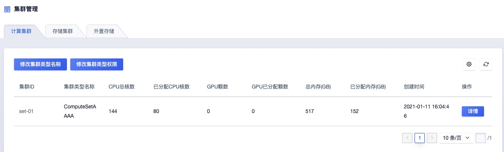
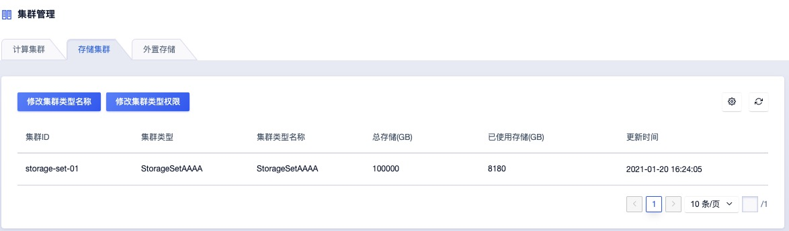

# 管理员指南

版权声明

版权所有 © 优刻得科技股份有限公司 2019 保留一切权利。

本文档中出现的任何文字叙述、文档格式、图片、方法及过程等内容，除另有特别注明外，其著作权或其它相关权利均属于优刻得科技股份有限公司。非经优刻得科技股份有限公司书面许可，任何单位和个人不得以任何方式和形式对本文档内的任何部分擅自进行摘抄、复制、备份、修改、传播、翻译成其它语言、将其全部或部分用于商业用途。

UCloudStack 商标和 UCloud 商标为优刻得科技股份有限公司所有。对于本手册中可能出现的其它公司的商标及产品标识，由各自权利人拥有。

注意您购买的产品、服务或特性等应受优刻得科技股份有限公司商业合同和条款约束，本文档中描述的全部或部分产品、服务或特性可能不在您的购买或使用权利范围之内。除非合同另有约定，优刻得科技股份有限公司对本文档内容不做任何明示或暗示的声明或保证。

由于产品版本升级或其它原因，本文档内容会不定期更新，除非另有约定，本文档仅作为使用指导，本文档中的所有陈述、信息和建议不构成任何明示或暗示的担保。

## 前言

云平台提供了两套图形化管理界面，一套是租户视角的，用于普通运维、开发日常申请测试使用云资源，另一套是管理者视角的，用于云平台的管理员管理、维护、运营云平台。

该文档即为云平台的管理者控制台使用手册。

## 1. 地域

地域（Region)是云平台中一个逻辑概念，一个地域由一个或多可用区(Available Zone)组成，同一个地域的不同可用区之间，风火水电完全隔离，并通过网络服务提供点(POP)互联互通，且不同可用区之间延时一般小于等于 2 ms。

地域概念的引入，使得云平台具备了跨数据中心的高可用能力。

### 1.1 概览

从地域列表页，点击详情，可进入地域的概览页面。

概览页面提供以下功能：

1、基本信息展示：地域名称、地域 ID、创建时间、地域节点 IP（IPV6）；

2、监控信息展示：虚拟机数量（包括运行状态、关机状态下的虚拟机）、CPU使用率、内存使用率、EIP使用率。

管理员可通过该监控大屏了解该地域下多个可用区的资源使用情况。

### 1.2 基础镜像管理

云平台的基础镜像为地域级别，可在不同可用区下共享。默认情况下，云平台包含 Centos 、Ubuntu 等多个Linux发行版，以及多个版本的 Windows 操作系统。

在云平台实施部署时，管理员可根据自身业务需求，上传需要的操作系统版本。

* 默认操作系统包括 Centos 6.5 64 、Centos 7.4 64 、Windows 2008r2 64 、Windows 2012r2 64 、Ubuntu 14.04 64 、Ubuntu 16.04 64 ；
* 基础镜像均经过系统化测试，并定期更新维护，确保镜像安全稳定的运行和使用；

Linux 镜像默认系统盘为 20GB ，Windows 镜像默认系统盘为 40GB 。

在基础镜像管理页面，管理员可以查看到当下所有的基础镜像信息，以及每个镜像的状态。

为了保证云平台的稳定运行，目前不提供基础镜像的修改、删除操作。

### 1.3 可用区

可用区 (Available Zone)指在同一地域内，电力和网络互相独立的物理区域，用于业务故障隔离，理论情况下，一个可用区可由一个数据中心园区的不同数据中心组成。

对于在单地域部署多可用区的管理员而言，可在此页面查看到每个可用区的资源使用情况，每个字段含义如下：

* 可用区基本信息
  * 所属地域：可用区所在城市，如上海、北京；

  * 可用区名称：指资源部署的实际物理位置分类,一个可用区类似一个数据中心；
  * 可用区ID：可用区唯一 ID；
  * GPU 总颗数： 该可用区总 GPU 颗数；
  * 已分配颗数：该可用区已经分配的 GPU 颗数；
  * CPU 总核数：该可用区总的 CPU 核数；
  * 已分配核数：该可用区已经分配的 CPU 核数；
  * 总内存：该可用区总内存（GB）；
  * 已分配内存：已分配的内存（GB）；
  * 创建时间：可用区创建时间；

除查看该可用区基本信息，管理员也可以通过该页面修改可用区名称，使其符合企业内部习惯。

# 2. 可用区

云平台所需要的计算及存储集群，都分别部署在每个可用区下，用户可在可用区下创建虚拟机，而管理员可以通过可用区页面查看及管理可用区下的信息及资源。

管理员可以在可用区列表页面查看所有的可用区及每个可用区的资源使用情况。

点击“查看详情”可进入到详情页面，查看更多信息。

### 2.1 概览

在概览页面，管理员可查看到下述信息：

* 基本信息：
  * 地域名称
  * 可用区名称
  * 可用区 ID
  * GPU 总颗数
  * 已分配颗数
  * CPU总核数
  * 已使用核数
  * 总内存
  * 已分配内存
  * 创建时间 
* 监控信息：不同时间段的监控信息，时间跨度支持小时、天或自定义时间长度。
  * CPUNum：使用核数和未使用核数；
  * MemoryNum：使用量和未使用量；

### 2.2 计算集群

一个可用区下可部署不同类型的计算集群，如普通 x86、GPU、ARM 等，默认根据 CPU 平台设定集群名称，管理员也可根据自身情况修改集群名称。计算集群包括以下信息：

* 可用区名称 
* 计算集群 ID 
* 集群类型名称 
* 架构
* GPU 总颗数
* 已分配颗数
* CPU 总核数 
* 已分配核数 
* 总内存(GB)
* 已分配内存(GB) 
* 创建时间 

除了以上基本信息，管理员也可点击详情，进入到集群详情页，查看该集群的更多信息，如集群物理机数量、物理机健康情况等。

### 2.3 存储集群

与集群集群类似，一个可用区下可部署不同类型的存储集群，如 SSD、SATA、SAS 等。一般根据存储介质或存储用途设定集群名称，管理员也可根据自身情况修改集群名称。存储集群列表包括以下信息：

* 可用区名称 
* 存储集群 ID
* 集群类型名称 
* 架构
* 总存储(GB) 
* 已使用存储(GB) 
* 创建时间 

除了以上基本信息外，管理员也可点击详情，进入到存储集群详情页，查看该集群的更多信息，如集群物理机数量、物理机健康情况等。

我们将在第三章详细说明。

## 3 集群

集群是云平台的一个逻辑概念，一个集群由一组配置、用途相同的物理机组成。管理员可在集群页面查看集群相关信息。

### 3.1 计算集群

计算集群的列表页会列出该地域下所有可用区中不同类型的计算集群，如 GPU集群、x86 集群、ARM 集群等。

点击进入详情，可查看到集群概览信息、集群物理机情况、计算集群下所有的虚拟机信息。

#### 3.1.1 概览

概览页面包括该集群的基本信息，以及集群的资源总量及资源使用量。另外还包括集群的监控信息，主要有集群CPU、内存的使用量及剩余量。

#### 3.1.2 物理机

物理机页面列出了该计算集群下所有的物理机，及物理机的IP、使用量等信息。并支持以下操作：

* 锁定：被锁定的物理机，将不能再创建虚拟机，配合物理机的锁定及虚拟机的在线迁移功能，云平台可平滑实现计算集群的维护、升级等操作。

* 解锁：将锁定的物理机解锁，重新投入生产。
* 查看详情：可进入到物理机详情页面，查看该物理机的更多信息，我们将在物理机章节详细展开。

#### 3.1.3 计算实例

计算实例页面列出了该集群集群下所有的虚拟机，需要特别指出的是，除了租户正常创建的虚拟机外，用于用户Nat网关、MySQL实例的虚拟机也会展示在该页面。

除了展示虚拟机各项配置信息如CPU、内存、镜像、运行状态等信息外，管理员还可以执行以下操作：

**迁移：云平台支持虚拟机的在线迁移功能，虚拟机的在线迁移对用户无感知，完全不影响用户业务。管理员可以在物理机周期性维护、告警等情况下执行该操作，将虚拟机迁移至健康且相对空闲的物理机。**

## 3.2 存储集群

存储集群的列表页默认展示所有地域下全部可用区的所有存储集群，存储集群支持多种类型，默认为分布式存储，也可支持其他存储，需要在部署实施之前指定。

存储集群列表展示该存储集群的存储总量及使用量，方便管理员查看整个集群的使用情况，以便及时扩容避免影响业务。

点击“详情”按钮，可进入存储集群的详情页，可查看存储集群的详细信息及各项监控指标。

#### 3.2.1 概览

概览页展示以下信息：

* 可用区名称
* 存储集群 ID
* 集群类型名称
* 架构
* 总存储（GB）
* 已使用存储（GB）
* 创建时间

#### 3.2.2 Ceph

云平台默认使用Ceph作为存储集群的实现，管理员可在该页面查看到Ceph的各项监控指标，并根据这些指标做出后续运维决策。

## 4 物理机

物理机是为云平台提供基础计算、存储、网络服务的实体，每台物理机上均部署了云平台的专属软件，管理员请勿随意重装、更改物理机的配置。如有需要，请联系云平台提供方。

在物理机列表页，管理员可以查看到已部署云平台管理软件的所有物理机，包括每天物理机的资源使用情况，所属地域、可用区、计算集群、资源总量及资源使用量。

除了可进行前述已经寿命过的锁定及解锁操作，管理员还可点击“详情”，进入详情页面，查看物理机概览信息、计算实例、Libvirt、OVS信息。

### 4.1 概览

在概览页面，管理员可查看到物理机的基本信息，同时可方便地获取到物理机的以下监控信息，便于快速定位问题。监控指标信息如下：

* 网卡入带宽
* 网卡出带宽
* 磁盘读吞吐
* 磁盘写吞吐
* 网卡入包量
* 网卡出包量
* 磁盘读次数
* 磁盘写次数
* CPU使用率
* 内存使用率
* TCP连接数
* 阻塞进程数

### 4.2 Host 计算实例

Host计算实例页面默认展示所有运行在该物理机上的虚拟机，以及虚拟机的配置、镜像、运行状态等。

需要说明的是，除了租户创建的虚拟机，租户所使用的诸如Nat网关、MySQL实例所依赖的虚拟机，也会一并展示出来，管理员可根据业务情况手动调整各业务的分布情况。

### 4.3 Libvirt

Libvirt 是一组软件的汇集，提供了管理虚拟机和其它虚拟化功能（如：存储和网络接口等）的便利途径。这些软件包括：一个长期稳定的 C 语言 API、一个守护进程（libvirtd）和一个命令行工具（virsh）。Libvirt 的主要目标是提供一个单一途径以管理多种不同虚拟化方案以及虚拟化主机，包括：KVM/QEMU，Xen，LXC，OpenVZ 或 VirtualBox hypervisors 。

为管理员提供此视图主要是考虑到云平台一般都是长线运营，不同物理机的Libvirt版本会存在不一致的情况，展示Libvirt的信息有助于管理员更好地运营维护云平台，并可在平台遇到问题时，快速将相关信息提供给云平台建设方。

### 4.4 OVS

OVS即Open vSwitch，意为开放虚拟交换标准，Open vSwitch是在开源的Apache2.0许可下的产品级质量的多层虚拟交换标准，它旨在通过编程扩展，使庞大的网络自动化（配置、管理、维护），同时还支持标准的管理接口和协议（如NetFlow， sFlow， SPAN， RSPAN， CLI， LACP， 802.1ag）。

云平台上的每台物理机均部署配置了OVS，用于实现云平台上不同虚拟机之间的通信。

管理员可在OVS页面查看到以下监控信息，在平台网络出现问题时，提供以下监控指标可方便云平台建设方快速定位问题：

* StatsHit

* StatsLost

* StatsMask

* StatsFlows

* StatsMisses

* StatsMaskHit

## 5 镜像

镜像（Image）是 虚拟机实例运行环境的模板，包含了操作系统和预装软件以及配置。

云平台的镜像一般分为两类。其一是“基础镜像”，在云平台部署时默认提供，或后续上传，包括了各种 Linux、Windows 等操作系统。 其二是“自制镜像”，是由用户通过虚拟机来自行创建的自有映像，只有云平台用户本人可见。

管理员可在镜像页面查看云平台所有可用的“基础镜像”，并根据业务需要来选择是否要制作上传新的“基础镜像”。

云平台的镜像是地域属性的，即管理员只需要在一个地域上传镜像，即可实现该地域下所有可用区可用。

只有“可用”状态下镜像方可被云平台用户实现，并基于其创建虚拟机，或者自制镜像。

## 6 虚拟机

虚拟机提供可随时扩展的计算服务，一台虚拟机包含了CPU、内存、磁盘等最基础的计算组件。

虚拟机是云平台最为核心的服务，有些服务，如IP、镜像、分布式存储等必须与虚拟机结合方可使用，其他服务，如负载均衡、数据库、缓存等可以和虚拟机结合共同构建基础IT架构。

我们为云平台的管理员提供了全局视角的虚拟机查看、管理功能 ，而不局限于某单一租户。

管理员可在虚拟机管理列表页查看到云平台下所有地域的虚拟机，以及每台虚拟机的基本属性，包括：资源ID、所属地域、所属可用区、所属租户、配置、内/外网IP、创建时间、到期时间、运行状态等。

除了查看外，考虑到云平台更多为私有部署的形式，而非公有云强租户隔离、强数据安全的要求，我们为集群管理员提供了诸如虚拟机创建、删除、VNC登录等功能，方便管理员更好地运维、运营云平台，具体功能如下：

### 6.1 创建虚拟机

虚拟机创建功能让管理员可替代对云平台不熟悉的租户创建虚拟机。

1、在虚拟机控制台，点击“创建虚拟机” ，弹出虚拟机创建向导；

2、选择虚拟机归属租户，并支持创建新租户；

* 租户邮箱：选择租户邮箱，进行创建资源；
* 创建租户：可以创建新的租户账号；

3、选择地域和可用区

* 地域：选择虚拟机运行的目标地域和可用区，一旦创建无法修改。
* 可用区：选择虚拟机运行的目标地域和可用区，一旦创建无法修改。

4、选择基础配置：

* 机型：根据云平台的实施情况选择；
* GPU：根据云平台的实施情况选择，部分云平台可能无GPU。
* 规格：虚拟机 CPU 内存规格可选，1核2G、2核4G、4核8G、8核16G、16核32G、32核64、G64核128G；
* 镜像：支持基础镜像类型 Windows、centOS、Ubuntu，也可自制镜像；
* 系统盘类型：存储B(HDD)、存储A(SSD)；
* 系统盘：目前支持 40GB；
* 数据盘类型：存储B(HDD)、存储A(SSD)；
*  数据盘：容量支持 0GB-8000GB；

5、选择网络设置：

* VPC：可选择默认 VPC，也可以创建新的VPC；
* 子网：可选择默认子网，也可以创建新的子网；
*  内网IP：支持指定特定的内网IP，批量创建时不支持；

* 外网 IP：支持创建虚拟机时创建一个外网 IP 并绑定至虚拟机；
* 外网安全组：可选择默外网安全组，也可以创建外网安全组；
* 内网安全组：可选择默认内网安全组，也可以创建内网安全组；

6、管理设置

* 虚拟机名称：设置虚拟机名称；
* 管理员名称：管理员名称不可设置，linux默认为root或ubuntu；
* 登录方式：目前仅支持密码登录；
* 管理员密码：设置管理员密码；
* 确认密码：确认管理员密码；

7、选择结算方式及批量购买：

* 购买数量
* 付费方式

点击“立即购买”，即可创建出一台归属于某个特定租户的虚拟机。

虚拟机创建出来后，管理员还可对该虚拟机执行VNC登录、关闭、重启、修改防火墙、重置密码等云平台普通用户可执行的操作，此处不再一一赘述。

## 7 账务

云平台提供完备财务功能，如租户订单、交易、充值记录查询，另提供云产品的价格配置管理，管理员可根据实际情况为各项云产品、各产品小类设置价格策略，实现政企等内部结算。

### 7.1 订单管理

在订单管理页面，管理员可查询到每一台云资源的创建订单，以及订单的生成时间、订单金额、订单所属资源ID、订单号等信息，方便财务审计及追溯。

### 7.2 交易管理

和订单管理仅关注消费不同（资源的创建扣费、删除退费等），交易管理还罗列了诸如客户账号充值等信息，方便跟踪单个租户的交易行为。交易列表包含以下信息：

* 交易单号
* 交易类型
* 支出（元）
* 收入（元）
* 账户余额(元) 
* 免费余额(元) 
* 交易时间

### 7.3 充值管理

充值管理记录了所有云平台用户的充值信息以及充值方式，主要包含以下基本信息：

* 充值单号
* 账户ID 
* 充值渠道 
* 充值账户 
* 充值金额(元) 
* 创建时间

### 7.4 价格配置

价格配置用于管理员为云平台的每个产品制定基础价格，结合租户维护的折扣，可实现不同客户不同单价，灵活的价格策略对于企业内部跨部门结算有极大的帮助。

价格配置列表页包含了云平台的所有产品，以及每个产品单价，列表也主要包含以下信息：

* 地域 

* 集群 

* 产品 

* 计费类型 

* 计费规则 

* 价格配置 

* 更新时间 

管理员可为每个产品编辑基础单价，以虚拟机的CPU为例，管理员可设置单核CPU的小时单价数值为1667，表示单核CPU的小时单价为0.1667元。

当然，除了线性定价，也支持梯度计费，如0-4核的小时单价为0.1元，4-8核的小时单价为0.08元。

## 8 租户

云平台支持多租户管理，对于多个部门有IT需求的企业而言，多租户的引入，可以有效实现权限管理，降低不同部门混用可能造成的风险，并可实现事后审计。

### 8.1 创建租户

管理员账号可创建新的租户，对已有的租户进行管理，比如冻结租户、解冻租户等操作。

### 8.2 冻结租户

管理员可随时冻结存在风险或其他问题的租户，阻止其使用云平台账号创建、删除云资源。

### 8.3 解冻租户

管理员可在租户问题/风险接触后，为其解冻，恢复其云平台的使用权限。

### 8.4 租户概述

集群管理员还可进入到租户的详情页面，查看如租户子账号信息、订单信息、交易信息、充值信息、价格等。

另外还可进行租户的配额管理，轻松实现企业IT预算控制及云平台整体资源管控。

### 8.5 租户订单管理

订单管理的基本信息包括：订单号、资源ID、地域、订单类型、订单金额、创建时间等；

与财务功能中的订单管理不同，租户侧的订单管理只展示该租户的订单信息。

### 8.6 租户交易管理

交易管理的基本信息包括：交易单号、交易类型、支出、收入、账户余额、免费余额、交易时间；

### 8.7 租户充值管理

充值管理等基本信息包括：充值单号、账户ID、充值渠道、充值账户、充值金额、创建时间；

并可手动为租户充值，如赠送金额等。

### 8.8 租户配额管理

配额管理的基本信息包括：产品类型、地域、配额、创建时间、更新时间等；

并支持修改该租户某个产品的配额（即可购买某产品最大数量。）

### 8.9 租户价格管理（折扣）

基本信息包括：地域、集群、产品、计费类型、计费规则、价格配置、折扣、折扣价格、更新时间。

并可为某租户修改某产品的折扣，如修改租户的 CPU 折扣为 80（8折）。

## 9. 全局配置

为了方便管理员更加轻松灵活地管理集群，云平台提供全局配置管理，如告警发件人邮箱配置、回收策略配置、磁盘IO策略配置、可创建虚拟机规格配置、全局统一配额策略等。

### 9.1 全局配置

全局配置中目前主要包含多项配置：

* 邮件发送人配置：用于云平台的告警、通知邮件发送；

* 回收策略配置：用于设置云平台的资源到期回收策略；

* 磁盘IO策略配置：用于控制磁盘IOPS；

* 带宽配置：设置云平台的上下行带宽；

* 安全设置：如是否默认开启二次登录，是否定期修改密码等、防暴力破解策略等；

* 网段设置：设置云平台的默认VPC网段等。

### 9.2 规格配置

管理员在 云平台配置虚拟机的规格，如是否允许租户创建出 48C 的虚拟机。或者是否允许 1C8G 这种 CPU 内存配置比过高的虚拟机机型。

**创建虚拟机规格**

**删除虚拟机规格**

**修改虚拟机规格**

### 9.3 配额管理

对于云平台而言，如果放任单个租户无限制创建资源，不但会导致资源的滥用，而且极大可能影响到其他租户的正常使用。

因此云平台引入了配额这一概念，使得每个租户可创建的资源不再是不收限制的。

全局配置中的配额管理，相当于为平台的所有租户设置了一个基础的默认配额，配额租户维度的配额修改功能，可实现不同租户不同配额。

配额管理的列表页，展示了云平台提供的所有产品中，每个产品的默认配额值。

管理员可根据云平台实际情况，修改产品的默认配额值。

这里需要注意的是，对于稀缺的资源型产品和非稀缺的虚拟类产品，建议执行不同的配额规则。如虚拟机这种资源型产品，建议设置数量不要超过太多，而是按租户修改。而对于安全组这种虚拟类产品，可以适当放开，避免租户因配额限制影响业务的正常运行。

