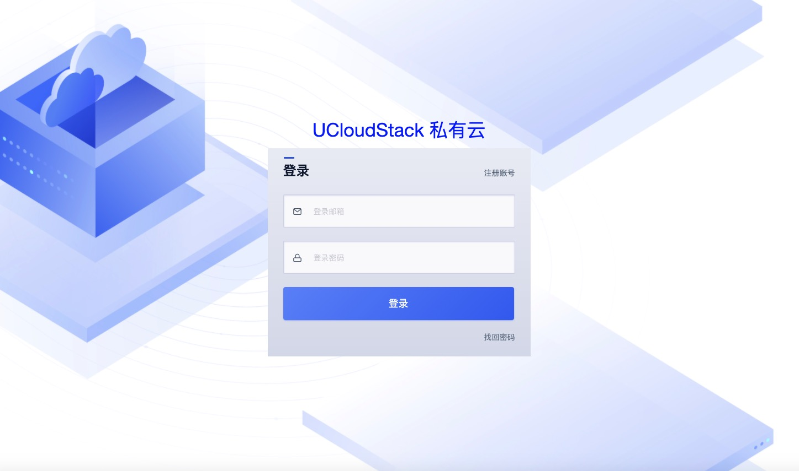
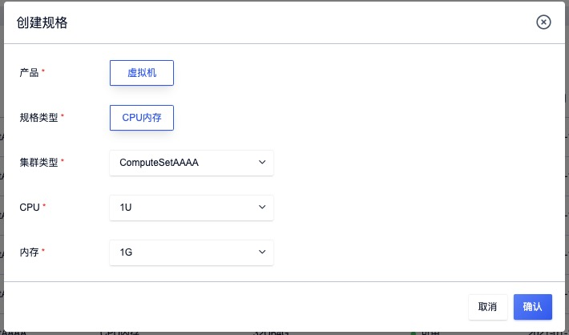
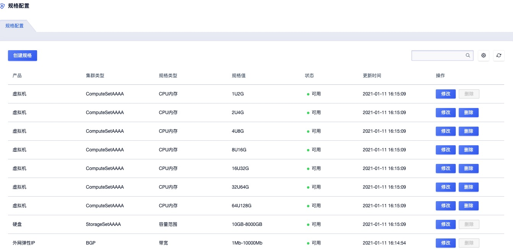
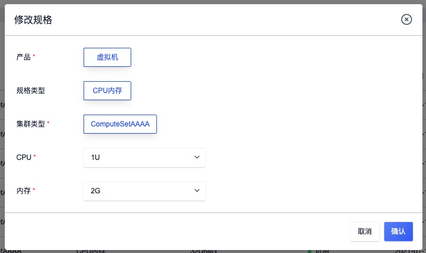
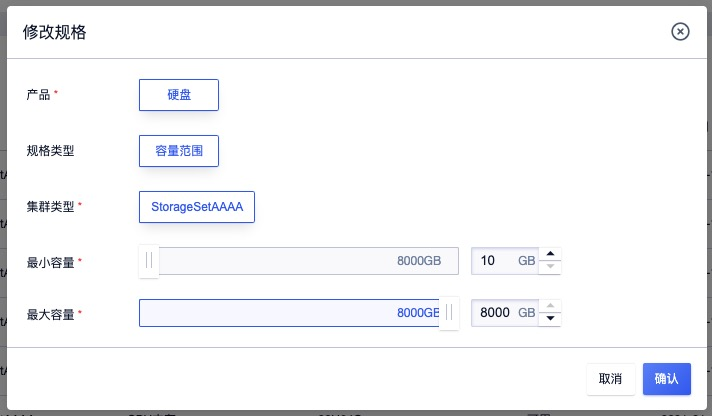
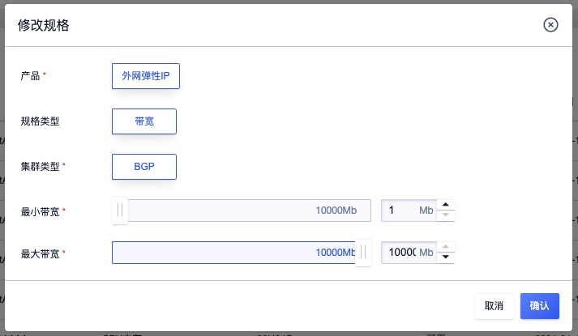
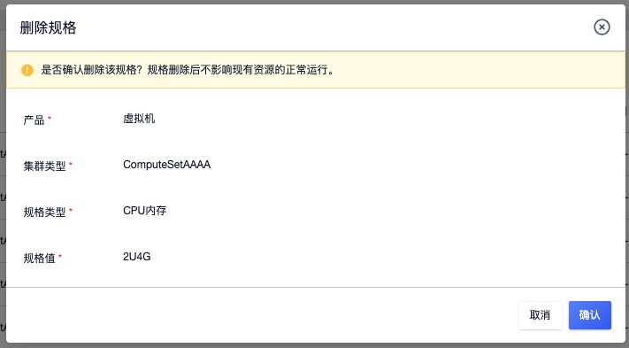
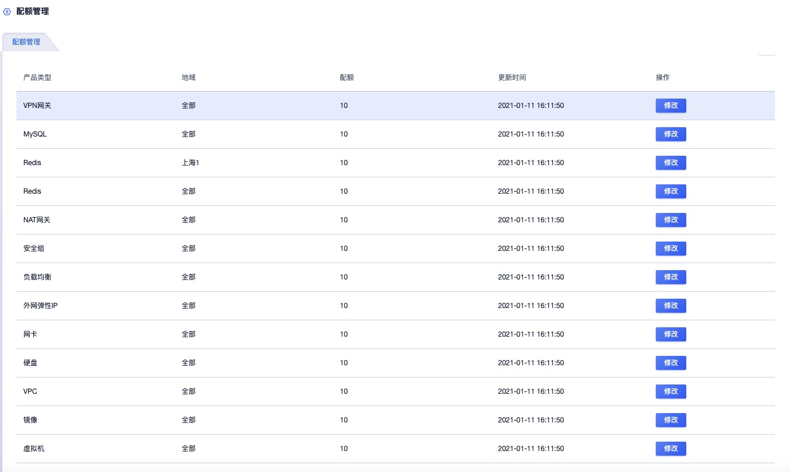
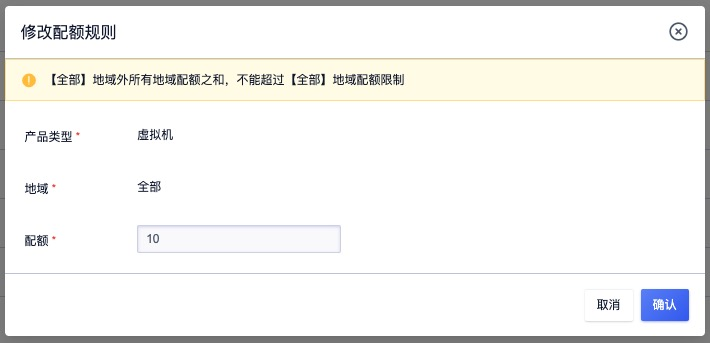

# 10 平台管理

平台管理为管理员提供平台全局配置、配额配置及自定义规格配置等能力，支持企业和管理员对平台提供服务的进行定制化配置，提升平台的客制化能力。

## 10.1 全局配置

全局配置为管理员提供整个云平台的全局配置信息，包括平台设置、计费设置、控制台安全、硬盘管理、网络设置、邮箱设置、网站设置（企业定制）、登录页设置（企业定制）、回收策略、资源管理及配额设置等。

### 10.1.1 平台设置

平台设置是指对平台本身的设置，包括 NTP 服务器地址及系统版本。

#### 10.1.1.1 NTP 服务器地址

平台支持管理员修改平台的 NTP 服务器地址，使平台可通过新修订的 NTP 服务器同步时间，让平台管理服务可通过准确的时间机制提供服务，如双因子验证、数据库同步、存储同步、操作日志时间及平台上面和时间相关服务。

管理员可通过全局配置中的 NTP 服务器地址查看并修改 NTP 服务器地址，默认为空，如下图所示：

NTP 服务器地址仅支持 IPv4 地址，且 IP 地址必须从平台网络可达，以保证可以和 NTP Server 端进行通信；平台会检测 NTP Server 是否可用。修改 NTP 服务器地址可能会影响平台的服务使用，配置时需要谨慎操作。

#### 10.1.1.2 系统版本

UCloudStack 云平台提供标准版、信创版及快杰版三个发行版本，管理员可通过系统版本参数查看当前系统的版本。仅支持查看不支持修改。

### 10.1.2 计费设置

计费设置是指管理员为平台设置【资源是否自动续费】，默认值为是，即租户悼账户余额充足时，将自动对租户下已有的计费资源进行续费；若管理员将资源是否自动续费关闭时，将不再对租户下资源进行自动续费，资源到期后会即变更为已过期状态，7 天内不进行续费将会自动进行删除或进入回收站。

### 10.1.3 控制台安全

控制台安全配置项是平台为保证控制台及账号安全进行的全局配置，包括是否开启多次登录失败冻结账号、是否开启 90 天强制修改密码、是否禁止多点同时登录及控制台无操作自动退出时长。

1. **是否开启多次登录失败冻结账号**

   平台支持管理员为平台开启或关闭全局账号登录多次失败冻结账号的功能。

   默认值为否，若开启后，输入密码错误 5 次并登陆失败，账号将被冻结，需要联系平台管理员到租户管理的账号列表处对账号进行解冻操作。

2. **是否开启 90 天强制修改密码**

   支持管理员为平台全局账号开启 90 天强制修改密码策略，保证账号安全。

   默认设置为否，若开启后，每 90 天需要账号登录控制台时会要求强制修改账户密码。

3. **是否禁止多点同时登录**

   支持管理员为平台全局账号开启多点登录，以适应对平台账号不同的登录需求。

   默认设置为否，代表平台账号仅支持单点登录，即一个账号同一时间仅支持在一个客户端进行登录，在其它客户端进行登录时将会自动退出已登录的客户端连接。

   若开启多点同时登录，代表平台账号支持多个客户端同时登录，即一个账号在不同的客户端均可同时登录并管理平台资源。

4. **控制台无操作自动退出时长**

   支持管理员为平台全局设置空闲时长，保证控制台资源和数据的安全。

   默认值为 15 分钟，即代表控制台在 15 分钟内无任何操作即会自动退出，支持设置 `1~1440` 分钟。

### 10.1.4 硬盘管理（全局磁盘QoS）

硬盘管理支持管理员对平台全局云硬盘开启或关闭 QoS 控制，以保证平台所有租户云盘资源的性能可靠性。

1. 平台默认全局开启磁盘 QoS ，即代表平台全局硬盘 QoS 生效，包括新建硬盘和已有硬盘的 QoS 。
   * 硬盘默认创建出来会根据平台计算公式赋予 QoS 值。
   * 已有硬盘的 QoS 根据已赋予的默认值或管理员修改的值生效。
   * 配置为开启时，管理员为每个硬盘自定义的 QoS 才可生效。

2. 配置为关闭时，平台全局硬盘 QoS 失效，包括新建硬盘和已有硬盘的QoS。
   * 新创建的硬盘 QoS 不受限制。
   * 已有硬盘的 QoS 不受限制。
   * 配置为关闭时，管理员为每个硬盘自定义的 QoS 不会生效。

3. 硬盘扩容容量后，会根据计算公式重新计算新容量的 QoS 值，根据计算的QoS值重新设置硬盘的 QoS。
   - 若硬盘扩容前设置的 QoS 值  < 新容量 QoS 值，则以新容量 QoS 值为准。
   - 若硬盘扩容前设置的 QoS 值 > 新容量 QoS 值，则以扩容前设置的值为准。

### 10.1.5 网络设置

网络设置支持管理员对平台的 VPC 网段和内网带宽进行配置，其中 VPC 网段是指管理员为平台租户设置 VPC 可使用的 CIDR 网络；内网带宽是指平台 VPC 网络内网带宽的 QoS 。

#### 10.1.5.1 VPC 网段

管理员为平台设置租户可使用 VPC CIDR 网段，默认为 `10.0.0.0/16,172.16.0.0/16,192.168.0.0/16` 三段私有网强行地址，管理员可根据平台实际使用情况进行修改。

设置 VPC 网段后，平台租户创建 VPC 网络时，仅可选择 VPC 网段内配置的私有网段，以适应私有云环境下内网网段冲突的场景。平台建议将 VPC 网段、外网网段及物理网络网段配置为三段不同的地址段，如将 VPC 网段配置为 `172.16.0.0/16`，将外网网段配置为 `192.168.0.0/16` ，物理网络环境配置为 `10.0.0.0/16` ，以方面网络配置及路由下发，同时提升运维效率。

管理员可根据实际网络环境配置 VPC 可使用的网段，本文仅作为示例，以实际私有云网络及部署环境为准。

#### 10.1.5.2 内网带宽 QoS

内网带宽 QoS 是指平台管理员为平台全局的 VPC 内网设置带宽上限，即指定虚拟机 VPC 内网网卡(eth0)间的带宽 QoS 限制。默认值为 4096Mbps ，支持的带宽范围为 `0~8192` 。

当内网带宽设置为 0 时，代表平台全局内网不限制 QoS ，平台建议为内网设置 QoS ，以保证平台所有租户资源 VPC 内网间的带宽性能和可靠性。

### 10.1.6 邮箱设置

邮箱设置是指平台邮件服务的配置，主要功能包注册激活、找回密码及监控告警邮件的接收和发送。平台支持管理员定义邮箱的发件人邮箱地址、发件人邮箱密码、邮件服务器地址、邮箱服务器端口及邮件主题前缀，如图所示：

- 发件人邮箱地址: 配置发件人的邮箱地址。
- 发件人邮箱密码：配置发件人邮箱密码
- 邮箱服务器地址: 设置发件邮箱的 IP 地址
- 邮箱服务器端口：设置发件邮箱的端口，默认值为 994 ，范围支持 0-65535 。
- 邮箱主题前缀：配置平台发送的提醒邮件的主题前缀，如私有云、政务云等。

> 平台部署时默认必须提供邮箱设置，避免无法接收注册激活、找回密码及监控告警邮件。

### 10.1.7 网站设置（客制化）

网站设置是平台为企业和管理员提供的客制化能力，包括网站 Favicon 图片、网站 Title、云平台 Logo 图片，即自定义云平台的 Logo 及浏览器标志。

- 网站 Favicon 图片：浏览器标签页上展示的 Favicon  图片，必须为 ico 格式，最大不超过 100KB 。
- 网站 Title ：浏览器标签页上展示的网站说明，如`UCloud - 中立 安全 可信赖的云计算服务商`，支持中英文及特殊字符。
- 云平台 Logo 图片：租户和管理员控制台导航栏上方的 logo ，允许管理员自定义，图片支持 png、jpeg、jpg格式，最大不超过 200KB，推荐尺寸 24px*24px 。

### 10.1.8 登录页设置（客制化）

登录页设置是平台为企业和管理员提供的登录客制化能力，包括 SSO 背景图、SSO 标题、SSO 标题颜色等，效果如下图所示：

* SSO 背景图：代表登录框后的背景图片，图片支持png、jpeg、jpg格式，最大不超过500KB 。
* SSO 标题：代表登录框上的标题描述，如 UCloudStack 私有云，可支持中英文及特殊字符。
* SSO 标题颜色：代表登录框上标题的颜色，支持白色、黑色、红色、黄色、绿色、青色、蓝色、棕色、紫色、橙色、灰色及金色，以适应不同背景图片上文字的可读性。

### 10.1.9 回收策略

回收策略是平台为管理员提供的回收站策略的自定义配置，包括回收站资源是否自动销毁、回收站资源自动销毁周期及过期资源是否自动删除进入回收站。

- **回收站资源是否自动销毁**

  设置资源进入回收站后，是否在固定周期后销毁，默认为开启状态；如果实际使用中，无需自动销毁进入回收站的资源，可关闭此配置。

- **回收站资源自动销毁周期**

  资源删除进入回收站后自动删除的周期，仅当开启回收站资源自动销毁时有效，默认值为 360000 秒，支持的范围为 `1~360000` 秒。

- **过期资源是否自动删除进回收站**

  开启后，虚拟机、云硬盘、外网 IP 等资源过期 7 天后会自动进入回收站。进入回收站时，虚拟机关联的资源将会被解绑。若平台的过期资源无需删除，则会自动变更为已过期状态，待 7 天后自动进行删除。

### 10.1.10 资源管理配置

资源管理配置允许管理员配置资源是否允许删除及是否开启计算实例状态检查。

* 资源是否允许删除：管理员对平台全局设置资源是否允许删除，默认值为是，代表允许平台所有租户删除资源。若将此项配置变更为否，则代表平台所有租户无法删除资源。
* 是否开启计算实例状态检查：管理员对平台全局设置计算实例是否进行宕机状态检查，默认为否，若开启后，租户的虚拟机状态中可查看虚拟机的宕机迁移及在线迁移状态。

### 10.1.11 配额设置

配额设置是平台为管理员提供的针对全局资源配额的配置，包括是否开启配额管理及单个硬盘创建快照的上限。

- 是否开启配额管理：设置平台是否需要开启配额管理，默认状态为开启。关闭后，租户创建资源时将不再受租户配额的限制，可以创建任意数量的资源。
- 单个硬盘创建快照上限：设置单个硬盘创建快照的数量上限，默认为 10 个，支持的范围为 `0~200` 个，0 代表单个硬盘创建快照的数量不受限制，管理员可根据平台实际使用情况调整上限数值。

## 10.2 规格配置

规格配置是平台为企业和管理员提供的自定义规格能力，管理人员可通过自定义规格配置调整云平台上架云产品服务的规格类型，包括虚拟机、硬盘、外网 IP 等，其中虚拟机支持定义 CPU  和内存规格；硬盘支持定义租户可创建云盘的容量范围；外网 IP 支持定义租户可申请外网 IP 的带宽范围。

平台针对虚拟机、硬盘、外网 IP 会默认提供建议型的规格，管理员可根据企业需求对规格进行变更，包括创建、查看、删除、修改等。

### 10.2.1 创建规格

创建规格仅支持创建虚拟机 CPU/内存的规格，云硬盘和外网 IP 的规格由平台默认生成，仅支持修改。管理员可通过全局配置——规格配置中的创建规格进行创建操作，如下图所示：

创建虚拟机规格支持根据不同的集群创建不同的规格，即可为不同的机型创建不同的规格，租户创建虚拟机选择不同机型时，即可创建不同规格的虚拟机，适应不同集群硬件配置不一致的应用场景。可分别定义 CPU 和内存：

* CPU 规格支持（U）：1、2、4、8、16、24、32、64 。
* 内存规格支持（G）：1、2、4、8、16、24、32、64 、128 。

创建出的规格即可被所有租户看到并使用，可根据业务需求在不同的集群中创建不同的规格。

### 10.2.2 查看规格

支持管理员查看平台已定义的所有规格配置，包括虚拟机、硬盘、外网 IP 等产品的规格配置。平台默认会为每个产品针对集群类型生成默认规格，即每个产品会根据集群类型分别生成默认规格，如在计算集群 A 中默认虚拟机规格及存储集群中默认硬盘规格；其中硬盘和外网 IP 规格仅支持查看和修改，不可进行创建和删除。

* 虚拟机规格定义租户创建虚拟机时可选择的 CPU/内存组合，如 1U2G 、2U4G 等。
* 硬盘规格定义租户在创建硬盘时可设置的容量范围（最小容量和最大容量），每个存储集群类型对应一个默认的硬盘容量范围规格。
* 外网 IP 规格定义租户在申请外网 IP 时的带宽范围（最小带宽和最大带宽），每个外网网段对应一个默认的带宽范围规格。

管理员可通过规格配置列表查看当前已有规格的列表信息，包括产品、集群类型、规格类型、规格值、状态、更新时间及操作项，如下图所示：

- 产品：代表规格对应的产品，包括虚拟机、硬盘及外网 IP。
- 集群类型：代表规格对应的集群类型或外网网段，指当前规格生效的纬度，如虚拟机在计算集群 A 的 CPU/内存规格；硬盘在存储集群 A 的容量范围规格；外网 IP 在 BGP 网段的带宽范围规格。
- 规格类型：自定义规格对应的规格类型，不同产品的规格类型不同。虚拟机规格类型为 CPU 内存，硬盘的规格类型为容量范围，外网 IP 的规格类型为带宽范围。
- 规格值：代表自定义规格的规格，如 CPU 规格为 1U2G；硬盘容量范围规格为 `10GB~8000GB` ；外网 IP 带宽规格为 `1Mb~10000Mb` 。
- 状态：指自定义规格的状态。
- 更新时间：指自定义规格的更新时间。

管理员可通过自定义规格的列表操作项，对每条规格进行修改和删除操作；同时列表上支持规格配置的搜索。

### 10.2.3 修改规格

支持管理员对已创建和默认生成的规格值进行修改。

（1）虚拟机产品规格支持修改 CPU 和内存值，其中 CPU 可指定 1、2、4、8、16、24、32、64；内存可过年费 定 1、2、4、8、16、24、32、64 、128 ，可根据业务需要自定义组合 CPU 和内存规格。

（2）硬盘产品规格支持修改容量范围的最小容量和最大容量，其中最小容量和最大容量可设置的范围为 10GB 到 8000G ，即平台允许租户创建的云硬盘最小为 10GB ，最大支持到 8000GB ，可根据业务需要调整最小值和最大值。

（3）外网 IP 规格支持修改带宽范围的最小带宽和最大带宽，其中最小带宽和最大带宽可设置的范围为 1Mb 到 10000Mb ，即平台允许租户申请的外网 IP 最小为 1Mb 最到为 10000Mb ，可根据业务需要调整最小值和最大值。

### 10.2.4 删除规格

支持管理员删除指定自定义虚拟机规格，不支持删除硬盘和外网 IP 的规格。如下图所示：

规格删除后平台租户即不可在所属机型中创建当前规格的虚拟机，但不影响通过该规格创建资源的正常运行。

> 虚拟机规格在每个集群内会生成一条无法删除的默认规格，以避免平台上所有规格均被删除，导致无法创建虚拟机。

## 10.3 配额管理

### 10.3.1 概述

配额（quota）是一个租户（包含子账号）针对每种虚拟资源在一个地域下可创建的数量限制。通过限制每个租户拥有的资源配额，可有效共享并合理分配云平台物理资源，提升资源利用率的同时，满足云平台上每一个账户的资源需求。

**配额管理生效的前提是全局配置中【是否开启配额管理】为的配置项为是，否则配额管理的配置值则不生效。**云平台全局提供每种资源在每个数据中心的默认配额，即每个租户创建时默认提供的资源配额模板。平台管理员可通过租户管理中的配额管理自定义每个租户的资源配额。租户主账号及所拥有的子账号不可自定义修改资源配额数量，仅提供查看配额。

子账号和主账号共享租户的资源配额，即每种资源配额为主账号和所包含的所有子账号可创建的资源数量之和。如租户对于云硬盘的配额为 10 ，则租户的主账号及所有子账号可创建的云硬盘数量上限不可超过 10 个。

管理员可根据平台实际使用情况调整默认配额，调整后及时生效，平台所有已有租户的配额将按照新的配额标准执行，新创建的租户也会按照新的配额标准设置配额限制。

目前配额限制主要包括虚拟机数量、自制镜像数量、VPC 数量、硬盘数量、网卡数量、外网 IP 数量、安全组数量、负载均衡数量、VPN 网关数量、NAT 网关数量、MySQL 数量及 Redis 数量 。支持管理员查看平台全局配额配置，同时支持管理员对配额项进行修改操作。

> 平台支持为单个租户调整配额，可参考租户管理中关于调整租户配额部分的描述。

### 10.3.2 查看配额

管理员可通过全局配置——配额管理查看当前平台全局配额管理中已有的配额配置信息，包括产品类型、地域、配额、更新时间及操作项，如下图所示：

其中地域代表产品在当前地域中的配额设置，配额值代表在产品在当前地域中的配额值。管理员可通过修改按钮对配额进行修改。

### 10.3.3 修改配额

支持管理员修改平台上地域及全部地域级别的配额值，其中每个产品单个地域配额之和不能超过【全部】地域配额限制，如下图所示：

修改全局配额设置不影响为租户自定义的配额设置。全局配额后修改后，若租户已有的产品数量超过设置值，不影响租户已有的资源运行；若租户将资源删除后，则无法再创建超过配额值的资源。
