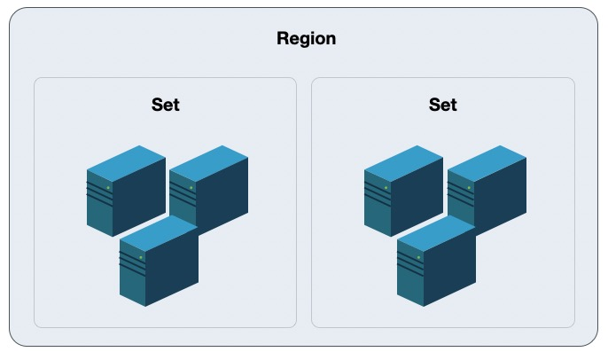

# 4 集群管理

集群（Set）是平台物理资源的逻辑划分，用于区分不同配置规格及不同存储类型的服务节点，如 X86 计算集群、ARM 计算集群、SSD 存储集群或商业存储集群等。一个数据中心可支持部署多个计算和存储集群，一个集群通常由一组配置、用途相同的物理节点组成，且服务节点一般具有相同的 CPU/内存、磁盘类型及操作系统。

云平台支持将 X86、ARM、GPU 等异构计算集群统一管理，并可统一管理 SSD、STAT、NVME 多种架构存储集群。 用户可将虚拟资源部署于不同的计算集群，并分别对虚拟资源挂载不同存储集群的块存储设备。

服务器为计算&存储融合节点时，不同磁盘类型的节点划分为一个集群，如 SSD 计算节点集群；若服务器为独立存储节点时，不同磁盘类型的节点划分为一个集群，如 SATA 存储节点集群。通常一个集群的服务器建议接入同一组接入交换机，业务数据网络仅在集群内进行传输。

平台支持管理员账号对数据中心的计算集群、存储集群及外置存储集群进行便捷的管理和维护，同时平台可对集群进行权限控制，用于将部分物理资源独享给一个或部分租户使用，适用于专属私有云场景。

## 4.1 计算集群

计算集群是一组配置、用途相同的计算节点（物理机）组成，用于部署并承载平台上运行的虚拟计算资源。一个数据中心可部署多个不同类型的计算集群，如 X86 集群、ARM 集群、GPU 集群等，不同的集群可运行不同类型的虚拟机资源，如 GPU 集群可为租户提供 GPU 虚拟机，ARM 集群可为租户提供基于 ARM 或国产化 OS 的虚拟机。

为保证虚拟机高可用，平台基于集群纬度提供虚拟化智能调度策略，包括打散部署、在线迁移及宕机迁移，即虚拟资源可在集群内的所有计算节点中进行调度、部署及迁移，提升业务的可用性。

* 打散部署是指平台租户创建虚拟机时默认会将创建的虚拟机尽量打散部署于集群内的所有节点上，保障硬件或软件故障等异常情况下租户业务服务的可用性。
* 在线迁移是指平台管理员手动将一台虚拟机从集群的一个物理机迁移到另一台物理机，释放源物理机的资源。
* 宕机迁移是指运行虚拟机的物理机出现异常或故障导致宕机时，调度系统会自动将其所承载的虚拟资源快速迁移至集群内健康且负载正常的物理机，尽量保证业务的可用性。

基于在线迁移和宕机迁移的逻辑，通常在部署上推荐将相同 CPU 和内存配置的物理机节点规划为一个计算集群，避免因 CPU 架构或配置不一致，导致虚拟机迁移后异常或无法启动。

默认情况下平台会根据 CPU 平台架构设定集群名称，管理员可根据平台自身使用情况修改集群名称；同时支持管理员查看并管理计算集群及计算集群内的物理机和计算实例，如修改集群权限、在线迁移计算实例等。

### 4.1.1 查看计算集群

通过导航栏的【集群】中的【计算集群】可进入平台计算集群管理控制台，也可通过【地域详情】中的【计算集群】进行特定地域的计算集群管理。

管理员可通过计算集群控制台查看特定地域的所有计算集群列表及信息，包括集群 ID、集群类型、集群类型名称、CPU 总核数、已分配核数、GPU 颗数、已分配 GPU 颗数、总内存、已分配内存及创建时间，如下图所示：

- 集群 ID ：集群在平台的唯一标识符，如 set-01、set-02 。 
- 集群类型名称：标志集群的名称，即在租户端的机型，租户在创建虚拟机时可选择不同的集群部署虚拟机。
- CPU 总核数 ：集群中总 vCPU 核数，即平台用户在集群中可申请的 vCPU 核数。
- 已分配核数 ：集群下已分配的 vCPU 核数，即平台用户在集群中已申请的 vCPU 核数。
- GPU 总颗数：集群中所有物理节点上的所有 GPU 设备总颗数。
- 已分配颗数：集群中已分配的 GPU 颗数。
- 总内存（GB）：集群中总的内存容量，即平台用户在集群中可申请的内存容量。
- 已分配内存（GB）：地域下已分配到总内存容量，即平台用户在集群中已申请的内存容量。
- 创建时间 ：计算集群的创建时间

> 如一个集群已分配的 vCPU 和内存比例超过 80% 以上，代表地域下可用 vCPU 和内存资源较少，通常需要进行扩容；也可统计租户云资源使用率并及时释放云资源，确保真正需要使用资源的用户可分配到云资源。

管理员也可通过列表集群名称或列表后的详情按钮进入集群详情页面，查看计算集群概览信息，并对集群中包括的物理及所有计算实例进行管理。

（1）计算集群概览页面展示计算集群的基本信息和监控信息：

* 基本信息主要展示集群ID、集群类型名称、总核数、已分配核数、总内存、已分配内存等信息。
* 监控信息主要展示集群下 CPU 核数的使用趋势（包括总量、已分配、未分配）、内存容量使用趋势（包括总量、已分配、未分配）。

（2）物理机管理是指对集群内的所有计算节点的管理，如对物理机进行锁定、进入维护模式等，详见物理资源管理中的[物理机管理]()章节。

（3）计算实例管理是指对集群内所有计算实例的管理，如在线迁移，详见[计算实例管理]()章节。

### 4.1.2 修改集群类型名称

集群类型即代表一个集群，默认情况下平台会根据 CPU 平台架构设定集群名称，平台管理员可根据平台使用需求，为计算集群命名更有标志性的名称。

修改集群类型名称后，用户在创建虚拟资源时选择的机型名称会同步为集群名称。修改名称不影响集群和资源的正常运行，在任何情况下均可修改。管理员可在计算集群列表点击“修改集群类型名称”，输入新名称即可更改集群类型名称，如下图所示：

> 平台上计算集群类型和集群名称为一个概念，即一个集群类型即代表一个集群。

### 4.1.3 修改集群权限

平台的计算集群默认对所有租户开放权限，平台支持对计算集群进行权限控制，用于将部分物理计算资源独享给一个或部分租户使用，适用于专属私有云场景。修改集群权限后，集群仅可对指定的租户开放并使用，无权限的租户无法查看并使用受限的集群创建虚拟资源。

在应用场景上，可将特殊机型的物理服务器集群、GPU 物理服务器集群仅对少部分租户开放权限，使一部分租户的关键业务仅运行在指定的集群中。假设目前有 50 台计算存储超融合物理机，针对 ABCD 四个用户中 A 独享 30 台物理机的场景，解决方案如下所示：

为满足租户可独享部分物理机，在部署平台规划物理资源时，需要将独享物理机划分至一个独立的计算集群，同时需将独享物理机上的存储资源划分至一个独立的存储集群，并将划分的计算和存储集群分配给独享租户，以保证划分给租户的计算及存储资源为相同的独享物理机。

- 在部署平台时，将 30 台物理服务器规划至同一个计算集群（计算集群 1），保证其余 20 台服务器划入不同的计算集群（计算集群2）。
- 同时将 30 台物理服务器上的磁盘资源规划至同一个存储集群类型（存储集群1），保证其余 20 台存储资源划入不同的存储集群（存储集群2）。

通过上述的方案，在物理层面和平台逻辑层面，将 30 台物理服务器的计算资源和存储资源划入了独立的资源池，即而通过平台的 【集群类型权限】将 计算集群1 和 存储集群1 的使用权限配置为 A 租户。

此时 A 租户在创建虚拟机、磁盘、快照、负载均衡、NAT 网关及 VPN 网关实例时可以选择【计算集群1】机型和 【存储集群1】存储类型，BCD 租户创建资源时无法查看到计算集群 1 和存储集群 1 ，继而无法在该独享集群上创建相关资源，保证计算集群 1 和存储集群 1 的计算存储资源被 A 租户独享。

平台管理员可在计算集群列表点击【修改集群类型权限】，指定租户权限为“所有租户”或“指定租户”，即可将集群划分给指定的租户，如下图所示：

默认权限为所有租户，即平台所有租户默认均可部署虚拟资源至所有集群；当用户为集群设置租户权限为指定租户时，仅指定的租户可查看并部署虚拟资源至集群。

### 4.1.4 计算实例管理

计算实例管理是指平台管理员对计算集群内所有计算实例的管理，包括平台租户在集群中部署的虚拟机实例及负载均衡、NAT 网关、VPN 网关等 PaaS 产品的计算实例。平台提供计算实例的生命周期管理，包括查看计算实例、在线迁移、宕机迁移等，管理员可通过计算实例了解集群资源的具体情况。

#### 4.1.4.1 查看计算实例

管理员可通过【计算集群】列表进行详情页面，切换至“计算实例”标签，即可查看和管理计算集群下的计算实例列表及相关信息，包括计算实例的名称、实例 ID、资源 ID、所属租户、物理机、镜像 ID、GPU、CPU、内存、状态、创建时间及更新时间，如下图所示：

- 名称：计算实例对应的资源名称，当计算实例为虚拟机时展示虚拟机名称，当计算实例为 PaaS 产品的一个实例时展示 PaaS 产品的资源名称，如 `lb001` 。
- 计算实例 ID：计算实例在所对应的底层计算实例标识符。
- 资源 ID：计算实例所对应资源在平台的标识符。
- 所属租户：计算实例的所属租户邮箱。
- 物理机 IP：部署计算实例的宿主机 IP 地址，由于计算实例关机后即不占用 CPU 和内存资源，因此计算实例关机时物理机 IP 为空。
- 镜像 ID：计算实例所使用操作系统镜像 ID 。
- GPU：计算实例的 GPU 颗数。
- CPU：计算实例的 vCPU 核数。
- 内存：计算实例的内存容量。
- 状态：计算实例的状态，包括创建中、启动中、运行中、关机、断电中、重装系统中、删除中及迁移中，其中迁移中包括在线迁移和宕机迁移。
- 创建时间：计算实例的创建时间。
- 更新时间：计算实例的更新时间。

#### 4.1.4.2 在线迁移

在线迁移是计划内的迁移操作，即虚拟机划计算实例不停机的情况下，在不同的物理机之间进行在线跨机迁移。通过在线迁移可平衡计算节点负载、将相互通信的虚拟机迁移至一个计算节点、将多个虚拟机分散到不同的计算节点等多种场景，提高平台及业务的可用性和可靠性。

在线迁移的过程首先会在目标物理机注册一个相同配置的虚拟机进程，然后进行计算实例内存数据同步，最终快速切换业务到目标实例。整个迁移切换过程非常短暂，几乎不影响或中断用户运行在实例中的业务，适用于云平台资源动态调整、物理机停机维护、优化服务器能源消耗等场景，进一步增强云平台可靠性。

计算实例的在线迁移支持随机分配和指定物理节点两种模式，以适应不同场景的迁移任务：

* 随机分配：是指平台根据集群内计算节点的负载情况，随机分配物理机作为计算实例迁移的目标节点。
* 指定物理节点：是指实例迁移有明确的目标节点，平台将指定的节点作为计算实例迁移的目标节点。

管理员可根据具体场景需求，选择适合的迁移模式，默认为指定物理节点模式。若迁移有明确的目标节点，如虚拟机当前所在物理机器负载过高，迁移到已知的负载较低的物理节点上，可选择指定物理节点迁移模式，并根据物理机 IP 选择目标节点；若无明确目标节点，可选择随机分配迁移模式，系统将自动选定合适的物理节点。在线迁移的前提条件如下：

- 计算实例为正常运行状态。
- 实例所在集群有足够的资源满足迁移需求。
- 计算实例未挂载 GPU 设备，即不支持迁移 GPU 虚拟机。
- 虚拟机所部署的业务不存在频繁读写操作，否则可能导致迁移过程缓慢或无法完成。

管理员可通过【计算实例】列表操作项的【迁移】进行在线迁移操作，指定迁移模式和目标节点即可进行实例的迁移，如下图所示：

在线迁移仅支持在相同的计算集群内迁移，迁移过程中实例的状态变更为“迁移中”，待迁移成功后转换为“运行中”状态。**在线迁移过程中，会迁移源实例的全量及增量内存数据，待内存数据反复迭代完成数据同步时，即可迁移完成。**

#### 4.1.4.3 宕机自动迁移

宕机迁移又称离线迁移（Offline Migration）或虚拟机高可用（ High Availability），指平台底层物理机出现异常或故障而导致宕机时，调度系统会自动将其所承载的虚拟资源快速迁移到健康且负载正常的物理机，尽量保证业务的可用性。

整体宕机迁移不涉及存储及数据迁移，新的计算实例可快速在新物理机上运行，平均迁移时间为 90 秒左右，可能会影响或中断运行在虚拟机中的业务。宕机迁移为平台智能调度系统自动触发行为，整个过程无需人工干预，管理员可通过计算实例列表的状态查看宕机迁移过程，宕机迁移过程中实例的状态为“迁移中”，待计算实例成功在健康的节点启动并正常运行后，实例的状态流转为“运行中”。

平台基于集群纬度提供计算实例的宕机迁移，即计算实例所属物理机发生故障时，只会将计算实例重新部署至集群内的健康且负载正常的物理机节点。通常在部署上推荐将相同 CPU 和内存配置的物理机节点规划为一个计算集群内，避免因 CPU 架构或配置不一致，导致虚拟机迁移后异常或无法启动。

### 4.1.5 集群物理机管理

集群物理机管理是指管理员对集群内的所有计算节点的管理，如对物理机进行锁定、进入维护模式等。集群物理机管理相关操作与资源管理中物理机管理一致，区别仅在于集群物理机管理是对本集群内的计算节点进行管理，资源管理中的物理机管理是对地域内所有计算节点进行管理，具体管理操作详见【资源管理】中的[物理机管理]()章节。

## 4.2 存储集群

存储集群平台默认提供的分布式存储集群，通常由一组配置相同的存储节点（物理机）组成，用于部署并承载分布式存储资源。一个数据中心可部署多个不同类型的存储集群，如 SSD 集群、SATA 集群、容量型集群、性能型集群等，不同的集群可提供不同类型的云盘源，如 SSD 存储集群可为租户提供 SSD 类型的云硬盘。

平台通过分布式存储集群体系结构提供基础存储资源，并支持在线水平扩容，同时融合智能存储集群、多副本机制、数据重均衡、故障数据重建、数据清洗、自动精简配置及快照等技术，为虚拟化存储提供高性能、高可靠、高扩展、易管理及数据安全性保障，全方面提升存储虚拟化及云平台的服务质量。

分布式存储集群默认支持 3 副本策略，写入数据时先向主副本写入数据，由主副本负责向其他副本同步数据，并将每一份数据的副本跨磁盘、跨服务器、跨机柜分别存储于不同磁盘上，多维度保证数据安全。在存储集群中存储服务器节点无网络中断或磁盘故障等异常情况时，副本数据始终保持为 3 副本，不区分主副本和备副本；当存储节点发生异常副本数量少于 3 时，存储系统会自动进行数据副本重建，以保证数据副本永久为三份，为虚拟化存储数据安全保驾护航。

平台支持管理员对存储集群进行管理，包括查看存储集群、修改集群类型名称及修改集群权限等，可通过管理控制台存储集群页面进行管理。

### 4.2.1 查看存储集群

地域可部署不同类型的存储集群，如 SSD、SATA、SAS 等，通常根据存储介质或存储用途设定集群名称，管理员也可根据部署环境信息修改集群名称。通过导航栏的【集群】中的【存储集群】可进入平台存储集群管理控制台，也可通过【地域详情】中的【存储集群】进行特定地域的存储集群管理。

管理员可通过存储集群控制台查看特定地域的所有存储集群列表及信息，包括集群 ID、集群类型、集群类型名称、总存储、已使用存储及创建时间，如下图所示：

- 集群ID：存储集群平台全局唯一标识符，如 storage-set-01。
- 集群类型：存储集群的类型。
- 集群类型名称：标志存储集群类型的名称，即在租户端的磁盘类型，租户在创建虚拟机时可选择不同的存储类型创建云硬盘，一个存储集群类型中包知多个存储集群，
- 总存储：代表存储集群的总容量，单位为 GB 。
- 已使用存储：存储集群的已使用容量，即平台用户已申请的存储容量，单位为 GB 。
- 更新时间：存储集群的更新时间

> 注：已使用存储指平台租户已申请的存储容量，不代表存储集群的真实使用量。

### 4.2.2 修改集群类型名称

默认情况下平台会根据存储介质或存储用途设定集群名称，平台管理员可根据平台使用需求，为存储集群命名更有标志性的名称。

修改集群类型名称后，用户在创建云硬盘时选择的磁盘类型会同步为集群类型名称。修改名称不影响集群和资源的正常运行，在任何情况下均可修改。管理员可在存储集群列表点击“修改集群类型名称”，输入新名称即可更改集群类型名称，如下图所示：

### 4.2.3 修改集群权限

平台的存储集群默认对所有租户开放权限，平台支持对存储集群进行权限控制，用于将部分物理存储资源独享给一个或部分租户使用，适用于专属私有云场景。修改集群权限后，集群仅可对指定的租户开放并使用，无权限的租户无法查看并使用受限的集群创建云盘资源。

为满足租户可独享部分物理机，在部署平台规划物理资源时，需要将独享物理机划分至一个独立的计算集群，同时需将独享物理机上的存储资源划分至一个独立的存储集群，并将划分的计算和存储集群分配给独享租户，以保证划分给租户的计算及存储资源为相同的独享物理机。

平台管理员可在存储集群列表点击【修改集群类型权限】，指定租户权限为“所有租户”或“指定租户”，即可将集群划分给指定的租户，如下图所示：

默认权限为所有租户，即平台所有租户默认均可在所有存储集群上创建并使用云盘资源；当用户为集群设置租户权限为指定租户时，仅指定的租户可查看并使用集群的存储资源。

##  4.3 外置存储

### 4.3.1 产品简介

云平台默认提供分布式存储作为虚拟化的后端存储，为云平台用户提供高可用、高性能、高可靠及高安全的存储服务。同时云平台虚拟化支持对接商业存储设备，如 IPSAN 等存储阵列，为云平台虚拟机提供集群中高性能块存储服务，同时可利旧企业用户的集中存储设备，整体节省信息化转型的总拥有成本。

外置存储服务是云平台为企业用户提供的商业存储服务，通过 ISCSI 协议对接商业存储，将商业存储作为虚拟化后端存储池，提供存储池管理及逻辑卷分配，可直接作为虚拟机的系统盘及数据盘进行使用，即只要支持 ISCSI 协议的存储设备均可作为平台虚拟化的后端存储，适应多种应用场景。

平台支持存储设备的对接和管理，并支持将存储设备中的 LUN 分配给租户，由租户将 LUN 分配或挂载至虚拟机的系统盘或数据盘，进行数据的读写，具体功能特性如下：

* 支持存储设备资源池的录入管理，并支持一键扫描 ISCSI 设备中已创建的 LUN 存储卷信息。
* 支持将已扫描的 LUN 存储卷分配给平台租户，使租户有权限使用磁盘作为虚拟机的系统盘或数据盘。
* 支持租户将有权限的 LUN 存储卷信息作为虚拟机的系统盘，使虚拟机直接运行直商业存储中，提升性能。
* 支持租户将有权限的 LUN 存储卷信息作为虚拟机的数据盘。
* 支持将存储卷重新分配给平台其它租户。

基于以上功能特性，平台可支持直接使用商业存储设备作为虚拟化的后端存储，为虚拟机提供传统商业存储设备的存储空间，同时不影响商业存储中的其它 LUN 为其它业务提供存储服务。

平台基于 ISCSI 协议对接商业存储，在对接中需要将存储设备的 LUN 映射到平台计算节点，使平台计算节点上运行的虚拟机可直接使用映射的 LUN ；同时为保证虚拟机的高可用，需要将 LUN 同时映射到一个集群内的所有计算节点，即所有计算节点均可挂载并使用映射的存储卷，以保证宕机迁移时可在每个计算节点挂载该存储卷信息。

* 当虚拟机所在的计算节点故障时，平台会自动触发虚拟机宕机迁移，即将虚拟机迁移至计算集群内正常的计算节点上，使虚拟机可正常提供服务。
* 虚拟机使用的 LUN 存储卷已被映射到集群内所有计算节点，当虚拟机在集群内迁移至新节点后，可直接使用已映射的 LUN 存储启动虚拟机的系统盘或数据盘，并正常挂载至虚拟机，保证虚拟机迁移后业务正常。

平台仅将商业存储的 LUN 作为存储卷进行使用，不对存储卷本身进行管理，如 LUN 的创建、映射、扩容、快照、备份、回滚、克隆等。

### 4.3.2 使用流程

在使用外置存储前，需要平台管理者或存储设备管理者，将外置存储与平台的计算节点网络打通，使计算节点可与存储设备间直接内网可互相通信。

物理存储设备及网络准备好后，即可与平台进行对接并使用平台提供的外置存储服务，整个对接过程需要存储设备管理员、平台管理员及平台租户三个角色进行操作，其中与平台相关的为平台管理员和平台租户的操作，如下图流程所示：

1. **存储设备管理员管理存储卷**

   所有存储卷的管理均由存储设备管理员自行在商业存储的管理系统上进行操作，包括存储卷（Lun）的创建和映射，同时包括存储卷的扩容、快照、备份及删除等相关生命周期管理。

2. **存储设备管理员映射存储卷至集群计算节点**

   创建好的 Lun ，由存储设备管理员在存储设备上映射到所有计算节点（如果新增计算节点，需再次进行映射），同时也可进行多路径映射。

3. **平台管理员录入并管理存储设备**

   存储卷 LUN 映射成功后，由【平台管理员】在管理控制台“外置存储集群”中进行 ISCSI 存储池或存储设备的录入，录入时需要指定存储设备的 ISCSI 地址，如 172.18.12.8:8080 。

4. **平台管理员扫描已映射的 LUN 信息**

   录入的存储设备后，由【平台管理员】在存储设备中一键扫描 ISCSI 存储设备中已被映射至集群节点上的存储卷设备及信息。

5. **平台管理员为租户分配 LUN 设备**

   由【平台管理员】将扫描成功的 LUN 存储卷设备指定给租户，一个存储卷同一时间仅支持分配给一个租户，分配后租户在外置存储设备中即可查询已分配的存储卷设备，并可进行创建虚拟机或挂载虚拟机。

6. **平台租户使用 LUN 存储卷设备**

   平台租户通过控制台外置存储可直接查询已分配的存储卷，并在创建虚拟机时指定系统盘类型为外置存储，或者也可直接将 LUN 存储卷直接挂载给已有虚拟机，作为虚拟机的数据盘进行使用。

平台租户使用外置存储服务的前提是存储卷已映射并分配给租户，租户只需要简单的绑定即可便捷的使用平台提供的外置存储设备，并可进行弹性绑定和解绑。

### 4.3.3 添加外置存储

平台用户在使用外置存储前，需要管理员在控制台添加外置存储到云平台，添加时需要指定商业存储的 ISCSI 地址，即平台连接商业存储的 ISCSI 入口，通常以 IP 和端口组成。添加外置存储时支持为一个存储商务添加多个 ISCSI 地址，适用于商业存储的多路径访问，保证 LUN 存储访问的可用性。

管理员可通过导航栏中的集群进入集群管理，切换至外置存储控制台进行外置存储页面，通过【新建】操作进入添加外置存储向导页面，如下图所示：

* 名称：外置存储的名称，添加时必须指定。
* ISCSI 地址：外置存储的 ISCSI 连接地址，格式为 IP:Port ，支持添加多个 ISCSI 地址，如 172.16.13.201:3260 和 172.16.13.202:3260 。

添加后外置存储列表会生成一条外置存储信息，可查看外置存储的信息及已映射到平台的 LUN 存储卷信息。

### 4.3.4 查看外置存储

支持管理员查看外置存储的列表信息，包括名称、资源 ID、ISCSI 地址、LUN 数量及操作项，如下图所示：

* 名称：外置存储的名称和标识，租户端在创建虚拟机时系统盘类型处显示的名称。
* 资源 ID ：外置存储在平台的全局唯一标识符。
* ISCSI 地址：外置存储的 ISCSI 连接地址，可以为多个。
* LUN 数量：外置存储中已映射到平台上的 LUN 存储卷数量。

列表上可支持对每个外置存储进行删除操作，并可点击详情进入外置存储查看并管理商业存储的 LUN 存储卷。

### 4.3.5 扫描 LUN 存储卷

外置存储添加至云平台后，需要平台管理员对存储设备中已映射至平台的 LUN 存储卷进行一键扫描，使平台可获取可使用的 LUN 设备信息。

平台管理管理员可通过外置存储详情【LUN存储卷】列表上的【扫描】按钮进行 LUN 存储卷的扫描，触发扫描后，商业存储设备管理员映射至平台计算节点的 LUN 存储卷将会展示至 LUN 存储卷列表中，可通过列表信息查看 LUN 存储卷的信息，并将存储卷分配级指定的租户，用于创建虚拟机或作为数据盘挂载至虚拟机。

> 当存储设备管理员在存储设备上新增 LUN ，并将 LUN 映射到平台后，可重新通过扫描发现新映射的存储卷，并可将新的存储卷分配给租户，进行虚拟机的创建和数据盘挂载。

### 4.3.6 查看存储卷信息

管理员可通过外置存储详情中的【LUN 存储卷】列表查看已扫描出的存储卷信息，包括 LUNID、资源 ID、容量、状态、挂载资源、所属租户及操作项，如下图所示：

* LUNID：LUN 存储卷在商业存储中的唯一标识符。
* 资源 ID：存储卷在平台的唯一标识符。
* 容量：当前 LUN 存储卷的容量大小。
* 状态：当前 LUN 存储卷的状态，包括未绑定、绑定中、已绑定、解绑中。
* 挂载资源：LUN 存储卷已挂载的虚拟机 ID ，未绑定时为空。
* 所属租户：LUN 存储卷已分配的租户邮箱地址。

通过列表上操作项，支持对每一个 LUN 存储卷信息进行租户分配操作，即将存储卷分配给一个租户。

### 4.3.7 分配存储卷给租户

支持平台管理员将商业存储中已扫描的的 LUN 存储卷信息分配给一个租户，使租户有权限使用 LUN 作为虚拟机的系统盘或数据盘。支持修改存储卷的所属租户，即将存储卷从一个租户重新分配给另一个租户。一个存储卷同一时间仅支持分配给一个租户且同一时间仅支持挂载至一台虚拟机。

管理员可通过 LUN 存储卷列表上的【分配】操作，将一个 LUN 存储设备分配给一个租户，如下图所示：

管理员也可通过分配操作将一个存储卷重新分配给另一个租户，仅支持未绑定状态的 LUN 设备重新分配租户。

### 4.3.8 删除外置存储

平台支持管理员删除外置存储，删除前扫描出的所有 LUN 设备必须为未绑定状态。可通过外置存储资源列表操作项中的删除对外置存储进行删除，如下图所示：

外置存储删除仅表示设备从平台进行释放，可通过录入 ISCSI 地址重新添加存储设备到云平台。

