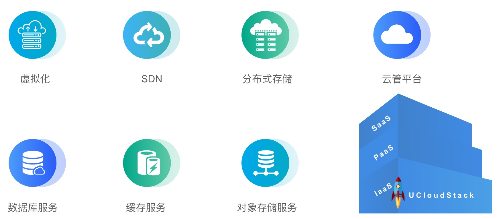

# 产品概述   
<b style="font-size: 18px">&nbsp;[查看 PDF](Introduction.pdf ':ignore title')</b>
  

---

UCloudStack 是一个企业专有云 IaaS+PaaS 平台，提供虚拟化、SDN 网络、分布式存储、数据库缓存等核心服务的统一管理、资源调度编排、多租户管理、监控日志及云运营运维管理控制台和 APIs 等一整套云资源管理能力，帮助更多企业数字化转型。

UCloudStack 定位为新一代轻量级企业专有云平台，1 台服务器可 POC 验证，3 台服务器即可构建生产环境，提供纯软件交付、软硬一体交付及超融合一体机交付等解决方案，针对受安全或合规限制，短期无法使用公有云，但有云化或虚拟化需求的用户场景。

平台具有安全稳定、便捷高效、智能可靠、异构兼容四大特性，用户可通过管理控制台或 APIs 快速安全的构建和部署业务资源及数据中心，支持与 UCloud 公有云无缝打通，灵活调用公有云能力，帮助用户构建一个安全可靠的混合云架构。

UCloudStack 基于多年公有云基础架构，通过纯软件定义实现高稳定、高可用及高兼容性的云平台，兼容 x86 和 ARM 架构，不强行绑定硬件及品牌，支持已有设备及传统商业存储的异构及统一管理，有效降低用户管理维护成本；同时产品通过与国产化飞腾芯片、华为鲲鹏及银河麒麟操作系统的兼容性测试，为用户提供一套安全可靠且自主可控的云服务平台。

### 文档目录

- 产品简介

  - [产品概述](UCloudStack/README.md)
  - [产品架构](UCloudStack/arch.md)
  - [核心功能](UCloudStack/features.md)
  - [产品特性](UCloudStack/advantages.md)
  - [技术特性](UCloudStack/techadv.md)
  - [应用场景](UCloudStack/scenario.md)

- 操作指南  

    - [用户手册](UCloudStack/UserGuide/UserGuide.md)
    - [管理员手册](UCloudStack/AdminGuide/AdminGuide.md)

- 技术白皮书

    - [技术白皮书](UCloudStack/TechWhitepaper/TechWhitepaper.md)

- 部署指南

    - [数据中心部署](UCloudStack/DataCenterDeploy/DataCenterDeploy.md)

- 开发者指南 

    - [API 手册](UCloudStack/APIGuide/APIGuide.md)

- 常见问题

    - [产品架构类](UCloudStack/faq.md)

- 更新历史

    - [产品更新](UCloudStack/changelog.md)
    - [文档更新](UCloudStack/docschangelog.md)
    
    
