# 技术白皮书

---

[TOC]

<font size="5" color="black">版权声明</font>

版权所有 © 优刻得科技股份有限公司 2020 保留一切权利。

本文档中出现的任何文字叙述、文档格式、图片、方法及过程等内容，除另有特别注明外，其著作权或其它相关权利均属于优刻得科技股份有限公司。非经优刻得科技股份有限公司书面许可，任何单位和个人不得以任何方式和形式对本文档内的任何部分擅自进行摘抄、复制、备份、修改、传播、翻译成其它语言、将其全部或部分用于商业用途。

UCloudStack 商标和 UCloud 商标为优刻得科技股份有限公司所有。对于本手册中可能出现的其它公司的商标及产品标识，由各自权利人拥有。

注意您购买的产品、服务或特性等应受优刻得科技股份有限公司商业合同和条款约束，本文档中描述的全部或部分产品、服务或特性可能不在您的购买或使用权利范围之内。除非合同另有约定，优刻得科技股份有限公司对本文档内容不做任何明示或暗示的声明或保证。

由于产品版本升级或其它原因，本文档内容会不定期更新，除非另有约定，本文档仅作为使用指导，本文档中的所有陈述、信息和建议不构成任何明示或暗示的担保。


# 前言

UCloud （优刻得科技股份有限公司）是中立、安全的云计算服务平台，坚持中立，不涉足客户业务领域。公司自主研发 IaaS、PaaS、大数据流通平台、AI 服务平台等一系列云计算产品，并深入了解互联网、传统企业在不同场景下的业务需求，提供公有云、私有云、混合云、专有云在内的综合性行业解决方案。

依托公司在莫斯科、圣保罗、拉各斯、伦敦等全球部署的 32 大高效节能绿色数据中心，以及国内北、上、广、深、杭等 11 地线下服务站，UCloud 已为全球上万家企业级客户提供云服务支持，间接服务终端用户数量达到数亿人。UCloud 深耕用户需求，秉持产品快速定制、贴身应需服务的理念，推出适合行业特性的产品与服务，业务已覆盖包含互联网、金融、新零售、制造、教育、政府等在内的诸多行业。

公司核心团队来自腾讯、阿里、百度、华为、VMware 等国内外知名互联网和 IT 企业，同时引进传统金融、医疗、零售、制造业等行业精英人才，目前员工总数超过 1000 人。

在云计算之前，企业业务应用上线，需要经历组网规划、容量规划、设备选型、下单、付款、发货、运输、安装、部署、调试的整个完整过程。随着云计算、大数据、人工智能等新技术对各行各业的赋能，以虚拟化和软件定义技术方向构建新一代数据中心为基础，实现业务的集中管理、资源动态调配、业务快速部署及统一运营运维，满足企业关键应用向 x86 及国产化系统迁移时，对资源高性能、高可靠、安全性、高可用及易用性上的要求，同时提高基础架构的自动化管理水平及业务快速交付能力，继而推动企业的数字化转型与业务创新。

UCloud 提供计算、存储、网络、数据库、中间件、云分发、多媒体音视频、大数据、人工智能及云安全防护等产品服务，为多种业务场景提供全方位的公有云计算产品和服务。为帮助企业级客户实现数字化转型，快速构建新一代基于虚拟化的私有数据中心，UCloud 基于多年运营的公有云架构，复用服务器操作系统内核及虚拟化核心组件（KVM、OVS、Qemu、Libvirt），同时优化核心调度系统及管理平台，对公有云平台进行定制重构，缩减部署规模及业务开销，提高云平台的可靠性、可用性及可运营性，提供一套可私有化交付且与公有云用户体验一致的企业专有云平台——UCloudStack 。

通过 UCloudStack 企业专有云平台，企业可在现有数据中心及设备上快速构建一套成熟且完整的私有云及混合云解决方案。为企业简化业务上云过程，提升组织管理和业务管理效率的同时，降低业务转型及信息系统的总体拥有成本，助力企业数字化转型。

# 1 产品简介

## 1.1 产品概述

UCloudStack 是一个企业专有云 IaaS+PaaS 平台，提供虚拟化、SDN 网络、分布式存储、数据库缓存等核心服务的统一管理、资源调度编排、多租户管理、监控日志及云运营运维管理控制台和 APIs 等一整套云资源管理能力，帮助更多企业数字化转型。


UCloudStack 定位为新一代轻量级企业专有云平台，1 台服务器可 POC 验证，3 台服务器即可构建生产环境，提供纯软件交付、软硬一体交付及超融合一体机交付等解决方案，针对受安全或合规限制，短期无法使用公有云，但有云化或虚拟化需求的用户场景。

平台具有安全稳定、便捷高效、智能可靠、异构兼容四大特性，用户可通过管理控制台或 APIs 快速安全的构建和部署业务资源及数据中心，支持与 UCloud 公有云无缝打通，灵活调用公有云能力，帮助用户构建一个安全可靠的混合云架构。

UCloudStack 基于多年公有云基础架构，通过纯软件定义实现高稳定、高可用及高兼容性的云平台，兼容 x86 和 ARM 架构，不强行绑定硬件及品牌，支持已有设备及传统商业存储的异构及统一管理，有效降低用户管理维护成本；同时产品通过与国产化飞腾芯片、华为鲲鹏及银河麒麟操作系统的兼容性测试，为用户提供一套安全可靠且自主可控的云服务平台。


## 1.2 产品架构


UCloudStack 平台整体产品架构由基础硬件设施、虚拟核心引擎、智能调度系统、核心产品资源、统一云管平台及运维管理平台组成，为用户、管理员及运营人员提供云平台管理和服务。

- **基础设施**：用于承载 UCloudStack 平台的服务器、交换机及存储设备等。
  
  - 平台支持并兼容通用 x86 及 ARM 架构硬件服务器，不限制服务器和硬件品牌；
  - 支持 SSD 、SATA 、SAS 等磁盘存储，同时支持计算存储超融合节点及对接磁盘阵列设备，无厂商锁定；
  - 支持华为、思科、H3C 等通用交换机、路由器网络设备接入，所有网络功能均通过 SDN 软件定义，仅需物理交换机支持 Vlan、Trunk、IPV6、端口聚合、堆叠等特性；
  - 支持混合云接入并适配客户现有硬件资源，充分利用资源的同时，无缝对接现有资源服务。
- **虚拟核心引擎**：承载平台核心虚拟化计算、存储、网络的实现和逻辑。
  
  - 虚拟化计算：通过 KVM 、Libvirt 及 Qemu 实现计算虚拟化 ；
  - 分布式网络 SDN ：通过 OVS + VXLAN 实现 SDN 虚拟网络，提供网络隔离，支持 VPC 、弹性 IP 、NAT 网关 、负载均衡、安全组、混合云接入及网络拓朴等网络功能；
  - 分布式存储 SDS ：基于 Ceph 实现分布式高性能存储，为平台提供块存储服务，具有三副本特性，保证性能和数据安全性。
- **智能调度系统**
  
  - 支持反亲和性调度部署策略，保证业务的高可用性和高可靠性；
  - 支持在线迁移技术，实时感知物理机状态和负载信息；
  - 物理主机故障或超过负载时，自动迁移虚拟机至低负载物理主机；
  - 创建虚拟机时，根据业务调度策略，自动启动虚拟机至低负载健康的物理主机；
  - 支持计算额度分配和资源抢占，保障公平的前提下，有效共享物理资源；
  - 支持平台虚拟资源的网络流表控制及下发，保证分布式网络架构的性能及可用性。
- **核心产品资源**
  - **地域/可用区：**指资源部署的物理位置分类。区域之间相互独立，如华东、华南、浙江等；一个区域下可分为多个可用区，一个可用区类似一个数据中心；
  - **集群：**用于区分不同资源在一个数据中心下的分布情况，如 x86 计算集群、 SSD 存储集群 及 SATA 存储集群，一个可用区可以部署多个集群；
  - **多租户：**平台支持多租户模式，提供租户隔离功能、子帐号、权限控制、配额配置及价格配置等功能；
  - **子帐号及权限**：支持一个租户拥有多个子帐号，支持资源隔离并可对子帐号进行资源管理的权限控制；
  - **计量计费**：支持按需、按月、按年三种计费方式，支持过期续费及回收策略，同时提供完整的计费订单及消费明细；
  - **弹性计算：**运行在物理主机上的虚拟机，支持从镜像创建、重启/关机/启动、删除、VNC登陆、重装系统、重置密码、加入 VPC网络和安全组、挂载数据盘、快照及反亲和策略部署等虚拟机全生命周期功能；
  - **镜像：**虚拟机运行时所需的操作系统，提供 CentOS 、Windows 、Ubuntu 等常用基础操作系统镜像；支持将虚拟机导出为镜像，通过自制镜像重建虚拟机；
  - **外网 IP ：**用于虚拟机、负载均衡及NAT 网关等资源的外网 IP 接入。支持多运营商线路接入并可调整弹性 IP 的带宽上限；
  - **弹性网卡：**一种可随时附加到虚拟机的弹性网络接口，支持绑定和解绑，可在多个虚拟机间灵活迁移，为虚拟机提供高可用集群搭建能力，同时可实现精细化网络管理及廉价故障转移方案；
  - **云硬盘**：一种基于分布式存储系统为虚拟机提供持久化存储空间的块设备。具有独立的生命周期，支持随意绑定/解绑至多个虚拟机使用，并能够在存储空间不足时对云硬盘进行扩容，基于网络分布式访问，为云主机提供高安全、高可靠、高性能及可扩展的数据磁盘；
  - **VPC 网络：**软件定义虚拟专有网络，用于租户间数据隔离。提供自定义 VPC 网络、子网规划及网络拓朴;
  - **NAT 网关：**企业级 VPC 网关，为云平台资源提供 SNAT 和 DNAT 代理，支持外网和物理网两种网络地址转换能力，并支持普通和白名单两种资源网络出口模式；
  - **负载均衡：**基于 TCP/UDP/HTTP/HTTPS 协议将网络访问流量在多台虚拟机间自动分配的控制服务，类似于传统物理网络的硬件负载均衡器.用于多台虚拟机间实现流量负载及高可用，提供内外网 4 层和 7 层监听及健康检查服务；
  - **安全组：**虚拟防火墙，提供出入双方向流量访问控制规则，定义哪些网络或协议能访问资源，用于限制虚拟资源的网络访问流量，支持 TCP 、UDP 、ICMP 及多种应用协议，为云平台提供必要的安全保障；
  
  - **监控告警：**支持虚拟机、磁盘、弹性 IP 、物理 IP、负载均衡、MySQL、Redis 等资源各维度监控数据收集及展示；同时可通过告警模板快速配置资源监控指标的告警策略和通知规则；
  - **回收站：**资源删除后暂存的位置，支持回收资源、恢复资源及彻底删除资源等操作；
  - **操作日志：**云平台所有资源及云平台自身的操作和审计日志，支持多时间跨度的日志收集和展示，提供操作失败原因；
  - **网络/磁盘 QoS ：**用于控制和限制内外网络 IP 地址的带宽上限及磁盘的 IOPS ； 
  - **数据库服务：**企业级 MySQL 数据库服务，提供双主热备高可用集群方案，支持对数据库集群的快速部署、容灾、监控、备份恢复、归档、帐号权限、扩容及迁移等功能；
  - **缓存服务：**企业级 Redis 缓存服务，提供多主多从高可用集群架构，支持主从热备、容灾切换、备份恢复、故障迁移、扩容、数据归档、帐号权限、数据持久化及监控告警等全套缓存解决；
- **统一云管平台**
  - UCloudStack 平台提供 Web 控制台 和 API 接口两种方式接入和管理云平台；
  - 通过 WEB 控制台用户可快捷的的使用并管理云平台资源，如虚拟机、弹性 IP 、负载均衡 、计费等；
  - 开发者可通过 APIs 自定义构建云平台资源，支持无缝迁移上云。
- **运维管理平台**：为云平台管理员提供的运维运营管理平台，包括租户管理、资源管理、帐务管理、监控告警、日志审计、系统管理及部署升级等功能模块。
  - **租户管理：**用于管理整个云平台的租户及帐号信息，提供创建/冻结租户及充值功能，支持查看租户拥有资源信息、订单记录、交易记录及配额价格等信息，同时支持修改租户的资源配额及产品价格；
  - **资源管理：**支持查看并管理平台所有物理资源和虚拟资源；
    - 物理资源包括物理地域、可用区、集群、宿主机资源、存储资源、网络/IP资源及镜像资源等；
    - 虚拟资源包括所有租户及子帐号所拥有的资源，包括虚拟机、VPC 、负载均衡、外网 IP 、物理 IP、NAT 网关、MySQL、Redis、监控告警、安全组、回收站等；
  - **帐务管理：**支持查看平台所有订单记录、交易记录、充值记录及全局产品价格，支持配置平台整体产品价格，同时支持财务报表导出；
  - **平台监控告警：**提供 UCloudStack 自身物理设备、组件及所有虚拟资源的监控数据，并支持自定义监控报警和通知；
  - **日志事件：**提供平台所有租户、子帐号及管理员的操作日志和审计信息，可进行多维度的筛选和搜索；
  - **系统管理：**提供云平台全局配置和配额管理功能。
    - 全局配置包含通知邮件配置、回收站策略、产品功能开关、全局磁盘 IO 配置、带宽全局配置等；
    - 全局配额支持查看并修改全局每个地域虚拟资源的配额值；
  - **部署升级：**平台支持自动化脚本安装物理服务器节点，包括操作系统、云平台组件及管理服务等。
- **基础监控服务**：云平台基础硬件资源的外围监控服务，包括云平台接入的所有网络设备、服务器、磁盘阵列等硬件设备的运行状态和性能指标进行监控告警，同时也可对集群中 MySQL、Redis、MongoDB 等常用服务进行监控和告警。

## 1.3 产品特性

**安全稳定**

- 软件定义数据中心，全平台高可用架构
- 纯自主研发，基于公有云平台优化，安全可控
- 复用公有云内核和核心组件，安全可靠
- 7 年持续稳健运行，数万+客户验证，保障稳定性和可靠性

**便捷高效**

- 3 节点构建生产环境，简单网络架构，快速实施部署
- 服务器节点快速横向扩展，实现性能和容量线性扩展
- 自动化运营运维平台，软件平滑升级，轻松高效运维
- 公有云一致用户体验，虚拟资源可视化，所见即所得

**智能可靠**

- 资源智能调度，宕机自动迁移
- 在线弹性扩容，保障业务运行
- 资源均衡部署，保证业务高可用
- 数据多副本存储，保证数据安全

**异构兼容**

- 不强行绑定硬件品牌，兼容 x86 和 ARM 架构
- 兼容国产化芯片及操作系统，安全可信
- 硬件设备异构搭建，混合管理，降低业务上云成本
- 已有设备混合接入，大幅降低 TCO 总拥有成本


## 1.4 技术架构特性

### 1.4.1 API 幂等性

幂等性是指一次和多次请求某一个资源应该具有同样的副作用，保证资源请求无论调用多少次得到的结果始终一致。如多次调用更新虚拟机的 API 请求，返回的结果都是一致的。

UCloudStack 通过分布式锁、业务字段唯一约束及 Token 唯一约束等技术手段保证平台资源 API 幂等性。对虚拟机、云硬盘、VPC 、负载均衡等资源的操作请求（除创建请求）均支持重复提交，并保证多次调用同一个 API 请求返回结果的一致性，同时避免网络中断导致 API 未能获取确切结果，从而导致重复操作的问题；

### 1.4.2 全异步架构

* 云平台使用消息总线进行服务通信连接，在调用服务 API 时，源服务发消息给目的服务，并注册一个回调函数，然后立即返回；一旦目的服务完成任务，即触发回调函数回复任务结果；
* 云平台服务之间和服务内部均采用异步调用方法，通过异步消息进行通信，并结合异步 HTTP 调用机制，保证平台所有组件均实现异步操作；
* 基于异步架构机制，云平台可同时管理数十万以上的虚拟机及虚拟资源，后端系统每秒可并发处理上万条 API 请求；
* UCloudStack 采用的插件机制，每个插件设置相应的代理程序，同时在 HTTP 包头为每个请求设置回调 URL ,插件任务结束后，代理程序发送应答给调用者的 URL ；

### 1.4.3 分布式

**(1) 分布式底层系统**：UCloudStack 核心模块提供计算、存储及调度等分布式底层支持，用于智能调度、资源管理、安全管理、集群部署及集群监控等功能模块。

* 智能调度：基于分布式服务调用和远程服务调用为租户提供智能调度模块。智能调度模块实时监测集群和所有服务节点的状态和负载，当某集群扩容、服务器故障、网络故障及配置发生变更时，智能调度模块将自动迁移被变更集群的虚拟资源到健康的服务器节点，保证云平台的高可靠性和高可用性；
* 资源管理：通过分布式资源管理模块，负责集群计算、存储、网络等资源的分配及管理，为云平台租户提供资源配额、资源申请、资源调度、资源占用及访问控制，提升整个集群的资源利用率；
* 安全管理：分布式底层系统提供安全管理模块，为租户提供身份认证、授权机制、访问控制等功能。通过 API 密钥对和用户名密码等多种方式进行服务间调用及用户身份认证；通过角色权限机制进行用户对资源访问的控制；通过 VPC 隔离机制和安全组对资源网络进行访问控制，保证平台的安全性；
* 集群部署：分布式底层系统为云平台提供自动化部署集群节点的模块，为运维人员提供集群部署、配置管理、集群管理、集群扩容、在线迁移及服务节点下线等功能，为平台管理者提供自动化部署通道；

* 集群监控：监控模块主要负责平台物理资源和虚拟资源信息收集、监控及告警。监控模块在物理机及虚拟资源上部署 Agent ，获取资源的运行状态信息，并将信息指标化展示给用户；同时监控模块提供监控告警规则，通过配置告警规则，对集群的状态事件进行监控及报警，并有效存储监控报警历史记录；

**(2) 分布式存储系统**：UCloudStack 采用高可靠、高安全、高扩展、高性能的分布式存储系统，提供块存储服务，保证本地数据的安全性和可靠性。

- 软件定义分布式存储，将大量通用机器的磁盘存储资源聚合在一起，采用通用的存储系统标准，对数据中心的所有存储进行统一管理；
- 分布式存储系统采用多副本数据备份机制，写入数据时先向主副本写入数据，由主副本负责向其他副本同步数据，并将每一份数据的副本跨磁盘、跨服务器、跨机柜、跨数据中心分别存储于不同磁盘上，多维度保证数据安全；
- 多副本机制存储数据，将自动屏蔽软硬件故障，磁盘损坏和软件故障，系统自动检测到并自动进行副本数据备份和迁移，保证数据安全性，不会影响业务数据存储和使用
- 分布式存储服务支持水平扩展、增量扩容及数据自动平衡性，保证存储系统的高扩展性；
- 支持 PB 级存储容量，总文件数量可支持亿量级；
- 支持不间断数据存储和访问服务，SLA 为 99.95% ，保证存储系统的高可用性；
- 支持高性能云硬盘，IOPS 和 吞吐量随存储容量规模线性增长，保证响应时延；

在部署上，计算节点自带 SSD 磁盘构建为高性能的存储池，计算节点自带的 SATA/SAS 磁盘构建为普通性能存储池。分布式存储系统将块设备内建为弹性块存储，可供虚拟机直接挂载使用，在数据写入时通过三副本、写入确认机制及副本分布策略等措施，最大限度保障数据安全性和可用性。在本地可通过备份及快照技术，将本地数据定时增量备份服务器或对象存储服务，在数据丢失或损坏时，可通过备份快速恢复本地业务的数据，包括数据库数据、应用数据及文件目录数据等，可实现分钟级恢复。

**(3) 分布式网络架构**：采用分布式 Overlay 网络，提供 VPC 、NAT 网关、负载均衡、安全组、外网 IP 等网络功能。

- UCloudStack 云平台 Overlay 网络分布式运行在所有计算节点；
  - 管理服务仅作为管理角色，不承担网络组件部署及生产网络传输；
  - 虚拟网络流表分发服务为高可用架构，仅做流表分发不透传生产网络传输；
  - 所有生产网络仅在计算节点上传输，无需通过管理服务或流表分发服务进行转发；
  - 管理服务和流表分发服务故障，不影响已部署好的虚拟资源运行及通信。
- 超融合计算节点或独立存储节点根据磁盘和业务分不同的集群（Set）；
  - 每个集群最多 45 台节点，控制集群规模；
  - 业务数据网络仅在单集群中进行传输，即在单组交换机中进行传输。
- 分布式存储直接通过物理网络进行挂载，无需通过 overlay 网络进行挂载和传输；
  - 通过 libvirt 融合分布式存储 rbd 和 qemu ，qemu 通过 librbd 操作分布式存储；
  - 虚拟化进程与分布式存储进程通过本机 & 跨物理机内网进行通信；
  - 云平台内网至少使用万兆交换机并做端口聚合，可满足虚拟机和分布式存储的性能需求；

分布式网络架构将业务数据传输分散至各个计算节点，除业务逻辑等北向流量需要管理服务外，所有虚拟化资源的业务实现等南向流量均分布在计算节点或存储节点上，即平台业务扩展并不受管理节点数量限制。

### 1.4.4 高可用

UCloudStack 企业专有云架构平台，从硬件设施、网络设备、服务器节点、虚拟化组件、分布式存储均提供高可用技术方案，保证整个云平台业务不间断运行：

- 数据中心机柜级别冗余性设计，所有设备均对称部署于机柜，单机柜掉电或故障不影响业务；
- 网络服务区域隔离设计，内网业务和外网业务在物理设备上完全隔离，避免内外网业务相互影响；
- 网络设备扩展性设计，所有网络设备分为核心和接入两层架构，一套核心可水平扩展几十套接入设备；
- 网络设备冗余性设计 ，所有网络设备均为一组两台堆叠，避免交换机单点故障；
- 交换机下联接入冗余性设计，所有服务器双上联交换机的接口均做 LACP 端口聚合，避免单点故障；
- 服务器网络接入冗余性设计，所有服务器节点均做双网卡绑定，分别接入内网和外网，避免单点故障；
- 管理节点冗余性和扩展性设计，多台管理节点均为 HA 部署，并支持横向扩展，避免管理节点单点故障；
- 通过智能调度系统将虚拟机均衡部署于计算节点，可水平扩展计算节点数量；
- 分布式存储冗余性设计，将数据均衡存储于所有磁盘，并三副本、写确认机制及副本分布策略保证数据安全；
- 进行服务器节点及存储扩展时，只需增加相应数量的硬件设备，并相应的配置资源调度管理系统；
- 云平台内各组件均采用高可用架构设计，如管理服务、调度服务、网络流表分发服务等，保证平台高可用；
- 云平台提供的产品服务，如负载均衡、NAT 网关、数据库服务及缓存服务均采用高可用架构构建，保证云平台提供服务的可靠性。


### 1.4.5 业务实现分离

UCloudStack 云平台架构从业务逻辑上分为北向接口和南向接口，将云平台的业务逻辑和业务实现进行分离，业务管理逻辑不可用时，不影响虚拟资源的正常运行，整体提升云平台业务可用性和可靠性。

* 北向接口：仅定义业务逻辑，提供业务接口，负责北向数据落地。业务接口包括帐户认证、资源调度、监控、计费、API 网关及 WEB 控制台等业务服务接口；
* 南向接口：仅定义业务实现，负责将北向接口的业务转换为实现，如虚拟机运行、VPC 网络构建、分布式存储数据存储等；

业务实现分离后，当云平台业务端（如 WEB 控制台）发生故障时，并不影响已运行在云平台上的虚拟机及运行在虚拟机中的业务，一定程度上保证业务高可用。

### 1.4.6 组件化

UCloudStack 将云平台的所有虚拟资源组件化，支持热插拔、编排组合及横向扩展。

* 组件化包括虚拟机、磁盘、网卡、IP、路由器、交换机、安全组等；
* 每种组件均支持热插拔，如将一个 IP 绑定至一个在运行中的虚拟机；
* 每种组件均支持横向扩展，如横向增加虚拟机的磁盘，提升整体云平台的健壮性 。

## 1.5 应用场景

### 1.5.1 虚拟化&云化

**适用场景**

* 业务应用虚拟化环境；
* 私有云业务场景；
* 资源统一管理；
* 私有云国产化；

**UCloudStack 解决方案**

* 弹性计算、分布式网络及分布式存储构建基础设施虚拟化环境；
* 软件定义网络功能，包括二层网络、子网、NAT 网关、负载均衡等；
* 云平台可私有化轻量级部署，支持纯软件及软硬一体交付；
* 提供云管理平台，对物理资源、虚拟资源及业务应用统一管理；
* 兼容 x86 和 ARM 架构，适配国产化芯片、服务器及操作系统。

### 1.5.2 快速交付

**适用场景**

* 业务快速部署扩容；
* 业务无缝迁移上云；
* 应急业务系统快速交付；
* 资源统一调度，数据存储安全性；

**UCloudStack 解决方案**

* 公有云一致体验的简捷界面，一键快速部署；
* 可视化运维，即开即用，支持在线扩容；
* 提供在线迁移产品及方案，快速迁移上云；
* 智能调度系统，保证所有计算、存储、网络资源的统一合理调度；
* 分布式存储系统，数据三副本存储，保证数据存储安全性。

### 1.5.3 开发测试环境

**适用场景**

- POC 演示验证；
- 业务产品 Demo 展示；
- 教育医疗实验信息环境；
- 政府军工科研信息环境；

**UCloudStack 解决方案**

- 1 台服务器即可 POC ，同时提供超融合云一体机；
- 多租户隔离并共享底层物理资源，多实验环境互不影响；
- 计量计费，实现多租户资源按时、按月、按年计费；
- 支持 GPU 虚拟机资源，应对人工智能及科研信息环境；
- 磁盘/网络 QoS 、安全组、配额，支撑多租户实验环境。

### 1.5.4 应用基础环境

**适用场景**

- 5G 边缘计算业务；
- 混合云及灾备云；
- SaaS 应用的基础运行环境；
- IT 软硬件一体交付运维；

**UCloudStack 解决方案**

- 管理计算可分离部署，支持跨地域统一管理所有节点；
- 混合云接入支持与 IDC 数据中心及物理网络互通，构建混合云环境；
- 支持地域/可用区，通过跨可用区容灾 LB 及 DB ，组建两地三中心；
- 提供计算、存储、网络、数据库及缓存服务，为 SaaS 应用提供可靠基础环境；
- 虚拟化 IT 基础设施，云化部署业务服务，混合接入数据中心，统一云管理及运营管理平台。


# 2 平台物理架构

## 2.1 物理集群节点

UCloudStack 云平台系统常见集群节点角色有 4 种，分别是管理节点、计算节点、独立存储节点、基础监控节点。其中计算节点为计算和存储融合节点，如果需要独立的存储区域，可采用独立存储节点。

如需将 UCloudStack 云平台与 IDC 物理环境打通，搭建混合云服务模式，可采用云平台提供的【物理 IP】功能进行接入。

### 2.1.1 管理节点

集群内部署的核心管理服务，承载 UCloudStack 云平台的北向接口服务模块，包括帐户认证、计量计费、资源管理、API-Gateway 及服务监控等服务，提供标准 API 和 WEB 控制台两种接入和管理方式。

* 管理节点负责虚拟资源全生命周期的管理，由于北向业务与南向实现接口分离及分布式网络机制，网络流量通过所在计算节点直接转发，平台业务扩展并不受管理节点数量限制，1 台管理节点可管理上千台计算节点；
* 云平台支持统一的底层资源，基于管理服务仅转发和透传管理流量，**平台支持并推荐将管理服务部署于计算节点的虚拟机中**，通过平台虚拟机的智能调度提供管理能力的高可用。

管理服务与计算服务间通过 TCP/IP 协议进行通信，提供管理服务通过内网或外网与计算节点通信的能力，支持管理服务与计算服务分离部署，如管理服务部署至公有云或其中一个数据中心，计算节点分布在各个数据中心，通过全局云管平台跨机房、跨数据中心及跨地域统一管理。

### 2.1.2 计算节点

集群内宿主机节点，用于运行虚拟机、虚拟网络、分布式存储、数据库服务、缓存服务等资源，同时承载智能调度控制和监控服务。计算节点类型可为计算存储超融合节点或独立计算节点：

* 计算存储融合节点：云平台分布式存储使用所有计算节点的数据磁盘，一台节点仅支持部署一种类型的数据磁盘，如 SATA、SSD、NVME 等；
* 独立计算节点：用于独立运行所有计算和网络资源，通过挂载独立存储节点的磁盘作为云平台的存储资源；
* 一般由几台到几千台服务器组成，生产环境至少部署 3 台以上，保证分布式存储系统的多副本部署及运行；
* 通常建议将相同配置的计算节点服务器放置在一个集群内进行虚拟资源的调度。

在部署上，每台计算节点（以超融合为例）均会部署用于运行计算存储网络的 KVM、Qemu、Libvirt、OVS、Ceph 等核心组件，同时在每个地域中至少有两台计算节点会部署核心调度及管理模块，如下图所示：

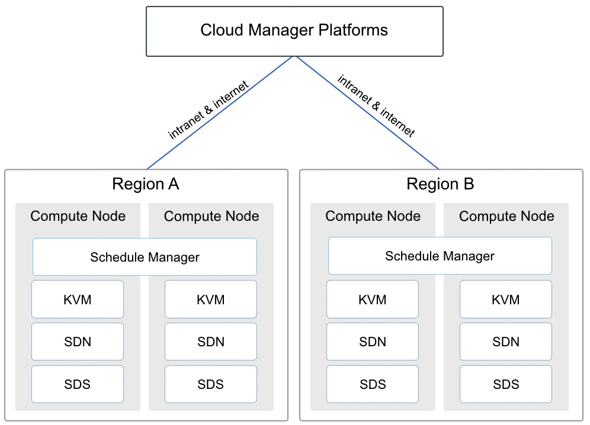

其中【Schedule Manager】即为 UCloudStack 云平台的核心调度及管理模块，用于虚拟资源的运行调度及虚拟网络的流表下发管理，每一个地域仅需部署一套高可用的 Schedule Manager 。一般为主备模式，可在两台或多台计算节点上进行部署，当部署调度模块的主计算节点服务器物理故障时，部署调度模块的备计算节点将自动接替调度服务，保证核心调度及流表控制服务的可用性。

每个地域或数据中心的部署的 Schedule Manager 均会开放一个 API 端点，作为管理服务连接并管理数据中心计算资源的统一入口。API 端点支持通过内网和互联网的连接模式，在 TCP/IP 网络通信可达的情况下，管理服务（Cloud Manager Platforms）支持部署于相同数据中心，也可部署于公有云或其它数据中心，并可为多数据中心计算资源提供统一调度和管理，满足云平台多应用场景部署。

> 若为独立计算节点，则无需部署分布式存储，需搭配独立存储节点提供存储服务。

### 2.1.3 独立存储节点

独立存储节点，用于独立承载分布式存储的节点，构建独立存储区域。适合将计算和存储分离，搭建独立存储网络的场景。独立存储节点，使用独立的存储网络接入设备，与计算业务物理或逻辑隔离。

* 部署独立存储节点，可节省计算节点的 CPU、内存等资源；
* 一般由几台和几千台服务器组成，生产环境至少部署 3 台以上，保证分布式系统的正常部署和运行；
* 独立存储节点为【**可选**】节点，如果采用超融合节点，可使用计存存储超融合节点上的数据磁盘作为分布式存储的存储池。

部署存储节点时，建议每个节点均配置相同介质类型的数据磁盘，如全 SSD 存储节点、SATA 存储节点 等，将相同磁盘类型的节点组成一个存储集群，分别作为普通存储和高性能存储资源池。

> 如需对接商业存储设备，需将存储设备与存储节点相连，在存储节点上部署分布式存储系统，将磁盘阵列作为存储资源池。

### 2.1.4 基础监控节点

基础监控节点是用于承载云平台基础硬件资源的监控服务，包括云平台接入的所有网络设备、服务器、磁盘阵列等硬件设备的运行状态和性能指标进行监控告警，同时也可对集群中 MySQL、Redis、MongoDB 等常用服务进行监控和告警。

基础监控节点为【**可选**】节点，一般部署 2 个节点即可，可采用一台物理服务器部署，也可将其中一个节点部署于一个虚拟机中，生产环境中，可根据需求选择部署方案。

### 2.1.5 推荐节点方案

UCloudStack 物理节点方案会根据企业业务需求及应用场景进行调整，通常推荐 3+3 的节点方案，即 3 台 SATA 超融合计算节点 + 3 台 SSD 超融合计算节点，管理服务部署于计算节点的虚拟机中，后续可根据业务规模水平扩展，如将 SATA 超融合计算节点扩容为 9 台。

SSD 和 SATA 节点的配比取决于业务需求，如高存储容量需求较大，则需配置较多的 SATA 节点；若高性能业务需求较多，则需配置较多的 SSD 全闪节点。

最佳实践中，生产环境至少需要 3 台 SATA/SSD 超融合节点部署搭建  UCloudStack 平台，即 UCloudStack 最小生产规模为 3 台服务器。

## 2.2 物理网络架构

为构建高可用、高可靠、高安全的企业专有云平台， UCloudStack 平台均采用高可用冗余性设计。本文以标准网络拓扑图为基础进行物理网络架构描述，本架构设计至少需要 6 台万兆交换机、2 台千兆交换机、 多台计算&存储节点服务器。若有 IPMI 管理及网络设备管理等需求，可根据需求增加 IPMI 和 Management 交换机并接入网络。


UCloudStack 平台网络设计为**核心**、**接入**二层架构，接入交换机双上联到核心，且按计算业务分集群划分。本架构设计从业务场景上提供公网服务，因此整体业务架构分为**内网区域**和**外网区域**两张网络，分别承载云平台内网通信和外网通信，两张网络在网络设备层面物理隔离。

同时标准架构中，通过将用户数据中心的物理网络与云平台【外网区域】物理连接在一起，通过云平台提供的物理 IP 产品，实现平台虚拟机与物理网络进打通的业务场景。

### 2.2.1 架构规模

标准的网络架构为单数据中心网络架构，即单数据中心可支撑 900 ~1000 台规模的节点数量：

- 两台交换机堆叠在一起，称为一组交换机，如一组内网接入交换机或一组外网接入交换机；
- 通常一组接入交换机为 96 个业务接口，堆叠检测及备用占用 3\*2 个接口，可用业务端口为 90 个；
- 每个服务器节点使用两个网卡占用一组接入交换机的 2 个接口，即一组接入交换机可接入 45 台服务器；
- 每增加一组交换机即可扩展 45 个节点，一组核心交换机至少可接入 20 组接入交换机，即至少可支撑 900 个节点服务器。

### 2.2.2 网络区域

网络区域的设备通常包括内网核心交换机、外网核心交换机、内网接入交换机、外网接入交换机。若服务器节点规模较小且暂不考虑扩容，可仅采用内/外网接入交换机。

- 内网核心交换机：采用 2 台 40GE 的三层交换机堆叠作为一组内网核心，用于承载内网接入交换机的汇聚和管理；
- 外网核心交换机：采用 2 台万兆三层交换机堆叠作为一组外网核心，用于承载外网接入交换机的汇聚和管理；
- 内网接入交换机：采用 2 台万兆交换机堆叠作为一组内网接入，用于承载 45 台服务器内网接入；
- 外网接入交换机：采用 2 台千兆交换机堆叠作为一组外网接入 ，用于承载 45 台服务器外网接入；
- 除 Internet 连接外，网络均为大二层环境，采用 LLDP 协议获取网络拓扑信息，所有网络接入均为端口聚合，保证高可用；同时通过控制接口广播报文流量，抑制网络广播风暴；
- 外网核心交换机与 Internet 之间可以为二层聚合、三层聚合、L3 ECMP 、L3 A/S 等互连模式，同时支持串联或旁挂防火墙、IDS、IPS 及防 DDOS 等安全设备；
- 云平台提供的网络功能均采用软件定义的方式实现，物理交换机仅作为网络流量转发设备，即仅使用交换机部分通用能力，如**堆叠、Vlan、Trunk、LACP 及 IPV6** 等，无需采用 SDN 交换机实现虚拟网络的通信。

若云平台虚拟机需要与数据中心的物理服务器进行通信，如标准架构图所示，需要将物理网络与云平台外网交换机进行互联，通过云平台提供的【物理 IP】产品进行绑定并通信。

标准网络架构中，通常推荐至少采用万兆及以上级别的交换机，保证平台节点内网接入、虚拟资源通信及分布式存储的性能及可用性。由于外网接入带宽一般较小，通常推荐采用千兆交换机作为外网接入设备。

### 2.2.3 服务器区域

服务器区域的设备通常包括计算存储超融合节点、独立计算节点、独立存储节点、管理节点及基础监控节点。若直接使用计算节点的虚拟机作为管理节点，即可省去物理管理节点服务器。

- 计算节点**【必选】**：采用 x86/ARM 架构服务器作为计算节点或计算存储超融合节点，用于运行虚拟机、虚拟网络分布式、存储服务及数据库缓存等服务，承载整个云平台的资源核心实现及运行。
  - 采用 2 个 GE 网卡分别上联到两台外网接入交换机 ，并做双网卡 bond ，作为计算节点外网接入；
  - 采用 2 个 10GE 网卡分别上联到两台内网接入交换机 ，并做双网卡 bond ，作为计算节点内网接入；
  - 若为超融合节点，则分布式存储使用所有计算节点上的数据磁盘，所有计算节点上的数据磁盘组成统一分存储资源池，用于构建分布式存储；
  - 若为独立计算节点，则分布式存储使用存储节点上的数据磁盘作为统存储资源池，通过网络跨集群挂载。
- 独立存储节点**【可选】**：若计算存储需要分离部署，可采用 x86/ARM 架构且磁盘较多服务器作为独立存储节点，用于承载独立的分布式存储服务。
  - 存储节点与计算服务通过内网进行通信，仅需 2 个 10GE 网卡分别上联到两台内网接入交换机 ，并做双网卡 bond ，作为存储节点的内网接入；
  - 如需将计算存储网络物理隔离，可采用独立存储接入交换机，存储节点的网卡上联至存储接入交换机；
  - 分布式存储使用存储节点及超融合节点上的所有数据磁盘，三副本保证数据安全；
  - 为保证分布式存储的性能及可用性，存储节点必须采用万兆以上速率的网卡。
- 管理节点【**可选**】：平台默认推荐使用平台虚拟机部署管理服务，如需**物理服务器**承载并运行管理服务，可采用 x86/ARM 服务器作为云平台管理节点，用于承载云平台管理塻块及服务。
  - 采用 2 个 GE 网卡分别上联到两台外网接入交换机 ，并做双网卡 bond ，作为管理节点外网接入；
  - 采用 2 个 10GE 网卡分别上联到两台内网接入交换机 ，并做双网卡 bond ，作为管理节点内网接入。
- 基础监控节点**【可选】**：可采用 x86 服务器接入内网作为基础监控节点，用于监控云平台基础设施。

> 以上网卡 bond 均采用 “ mode=4 ” 模式，即 IEEE 802.3ad 动态链路聚合。

<span id="_224-标准架构扩展"></span>

### 2.2.4 标准架构扩展

在实际项目中，根据用户需求和所提供的环境，可对标准网络架构进行调整，如项目较小规模（ 48 节点内）或仅需一个简单的测试环境或等场景。

（1）如需内外网物理隔离且考虑接入冗余，可采用 2 组共 4 台接入交换机进行业务部署。
- 2 台堆叠用于服务器内网接入，2 台堆叠用于服务器外网接入；
- 每台服务器内外网分别使用 2 个接口绑定接入内外网接入交换机，可支持 48 台服务器节点冗余接入。

（2）如需内外网物理隔离且不考虑接入冗余，可采用 2 台接入交换机进行业务部署；
- 1 台用于服务器内网接入，1 台用于服务器外网接入；
- 每台服务器分别使用 1 个接口接入内网接入交换机及外网接入交换机，支持 48 台服务器节点接入；

（3）若内外网无需物理隔离且考虑接入冗余，可采用 2 台交换机堆叠，通过 Vlan 隔离内外网，如下图所示：


- 方案一：通过在交换机上划分 Vlan ，服务器分别使用 2 个接口绑定接入交换机内外网 Vlan 接口，即每台服务器需 2 组 `bond` (4 个接口)实现内外网业务通信，可支持 24 节点；
- 方案二：通过在服务器操作系统内划分 Vlan（即子接口），服务器分别使用 2 个接口绑定接入交换机 Trunk 接口，即每台服务器仅需 2 个接口绑定实现内外网业务通信，可支持 48 节点；

（4）若内外网无需物理隔离且不考虑接入冗余，可采用 1 台交换机，通过交换机 Vlan 或服务器内划分 Vlan 进行内外网隔离及接入。

## 2.3 硬件选型

### 2.3.1 推荐配置

**（1）网络设备推荐配置**

| 业务                      | 配置描述                       |
| ------------------------ | ------------------------------ |
| 内网核心交换机           | 40G板卡(16口)*4，64\*40GE |
| 外网核心交换机           |  48\*10GE + 6\*40GE             |
| 内网接入交换机(**必选**) | 48\*10GE + 6\*40GE             |
| 存储接入交换机           | 48\*10GE + 6\*40GE             |
| 外网接入交换机           |  48\*GE + 4\*10GE + 2\*40GE     |

> 交换机型号默认推荐华为 CE 系列，亦可根据配置选择其它品牌同等配置交换机。

**（2）服务器推荐配置**

| 业务             | 配置描述                                                     |
| ---------------- | ------------------------------------------------------------ |
| 计算+SATA节点    | Factor Form：2U<br/>CPU：Intel® Xeon® Gold 6126 Processor 19.25M Cache, 2.60 GHz \*2<br/>DIMM：DDR4_32GB_2666MHz \* 12<br/>OS_HDD：SATA3_SSD_240GB_6Gb/s \*2<br/>Data_HDD：SATA3_HDD_4TB_6Gb/s_7200RPM \*6<br/>NIC: Intel 2口 千兆+Intel 2口 万兆(不含SFP+多模模块)<br/>HDD Controller: 12Gb/s_RAID_Card _1G Cache_SuperCap<br/>PSU: ≥550W 白金版 *2 |
| 计算+SSD节点     | Factor Form：2U<br/>CPU：Intel® Xeon® Gold 6146 Processor 24.75M Cache, 3.20 GHz \*2<br/>DIMM：DDR4_32GB_2666MHz \* 12<br/>OS_HDD：SATA3_SSD_240GB_6Gb/s \*2<br/>Data_HDD：SATA3_SSD_960GB_6Gb/s\*8<br/>NIC: Intel 2口 千兆+Intel 2口 万兆(不含SFP+多模模块)<br/>HDD Controller: 12Gb/s_RAID_Card _1G Cache_SuperCap<br/>PSU: ≥700W 白金版 *2 |
| 管理节点（若有） | Factor Form：2U<br/>CPU：Intel® Xeon® Silver 4110 Processor 11M Cache, 2.10 GHz *2<br/>DIMM：DDR4_32GB_2666MHz *2<br/>OS HDD：SATA3_SSD_240GB_6Gb/s *2 <br/>Data HDD：SATA3_SSD_480G *6<br/>HDD Controller：12Gb/s RAID Card + ≥1G Cache + SuperCap<br/>NIC：Intel 2口 千兆+Intel 2口 万兆(不含SFP+多模模块)<br/>PSU：≥550W白金版电源 *2 |

**（3）独立存储节点推荐配置**

| 业务             | 配置描述                                                     |
| ---------------- | ------------------------------------------------------------ |
| 独立存储SATA节点 | Factor Form：2U<br/>CPU：Intel® Xeon® Gold 4110 Processor 11M Cache, 2.10 GHz *2<br/>DIMM：DDR4_16GB_2666MHz * 6<br/>OS_HDD：SATA3_SSD_240GB_6Gb/s *2<br/>Data_HDD：SATA3_HDD_8TB_6Gb/s_7200RPM *12<br/>NIC: Intel 2口 千兆+Intel 2口 万兆(不含SFP+多模模块)<br/>HDD Controller: 12Gb_HBA_Card<br/>PSU: ≥550W 白金版 *2 |
| 独立存储SSD节点  | Factor Form：2U<br/>CPU：Intel® Xeon® Gold 4110 Processor 11M Cache, 2.10 GHz *2<br/>DIMM：DDR4_16GB_2666MHz * 6<br/>OS_HDD：SATA3_SSD_240GB_6Gb/s *2<br/>Data_HDD：U.2 NVMe 6.4TB *2<br/>NIC: Intel 2口 千兆+Intel 2口 万兆(不含SFP+多模模块)<br/>HDD Controller: 12Gb_HBA_Card<br/>PSU: ≥800W 白金版 *2 |

### 2.3.2 最低配置

用于生产环境的最低主机和网络硬件配置，一般生产环境至少需要 3 台计算节点和 2 台万兆接入交换机。

**（1）服务器最低配置**

| 配置分类 | 配置说明                                                     |
| -------- | ------------------------------------------------------------ |
| CPU      | CPU 不低于 8 核心，且支持 x86 或 ARM 架构的硬件虚拟化特性<br/>通常建议服务器配置相同型号的 CPU |
| 内存     | 单台服务器的内存不低于 64G                                   |
| 网卡     | 最少 2 块千兆以上网卡，建议使用 2 块万兆网卡<br/>如需外网访问，建议内外网各 2 块网卡 |
| 磁盘     | 至少 2 块系统盘做 RAID1<br/>本地数据盘根据业务情况，可使用机械硬盘 SATA 和 SSD 硬盘<br/>若业务对读写性能要求较高，建议采用 SSD 或 NVMe 类型的硬盘 |

**（2）网络设备最低配置**

| 业务 | 网络设备描述                                                 |
| ---- | ------------------------------------------------------------ |
| 内网 | 至少 1~2 台普通二层交换机，做交换机堆叠，保证高可用          |
| 外网 | 如需外网接入，可与内网共用交换机，通过 Vlan 进行逻辑隔离，详见 [标准架构扩展](#_224-标准架构扩展) |

## 2.4 机柜空间规划

网络设备和服务器的物理机柜空间规划如下图所示：


所有设备在机柜中对称部署，实现机柜级冗余，单机柜掉电或故障不影响云平台业务。一个机柜可支撑 15 个节点，根据网络架构设计一组接入交换机支撑 45 个节点，即一组接入交换机支撑 3 个机柜。3 个机柜为 1 组，平均 1 组机柜支撑 45 个节点、1 组内网接入交换机、1 组外网接入交换机、1 台 IPMI 接入交换机。

如上图项目案例中的设备包括 8 台业务交换机、4 台运维管理交换机、21 台服务器设备及 3 个机柜：

- 一组内网核心交换机对称部署于 2 个机柜，即其中两个机柜各部署 1 台；
- 一组内网接入交换机对称部署于 2 个机柜，即其中两个机柜各部署 1 台；
- 一组外网核心交换机对称部署于 2 个机柜，即其中两个机柜各部署 1 台；
- 一组外网接入交换机对称部署于 2 个机柜，即其中两个机柜各部署 1 台；
- 一组管理汇聚交换机对称部署于 2 个机柜，即其中两个机柜各部署 1 台；
- 1 台 IPMI 接入交换机 和 1 台网络设备带外管理交换机部署于 1个机柜；
- 3 台管理节对称部署于 3 个机柜，即每个机柜各部署 1台；
- 12 台计算 & SATA 节点对称部署于 3 个机柜，即每个机柜各部署 4 台；
- 6 台计算 & SSD 节点对称部署于 3 个机柜，即每个机柜各部署 2 台。

> 若服务器分集群部署云平台，建议不同集群的服务器对称部署于多个机柜中。


# 3 产品功能架构

## 3.1 虚拟化核心

UCloudStack 虚拟化核心具备计算虚拟化、智能调度、存储虚拟化、网络虚拟化的基础能力，为专有云平台提供软件定义的计算、存储、网络及资源管理等服务，在保证资源服务性能、可用性及安全性的同时，提供统一资源调度及管理服务，适应企业基础设施服务的多种应用场景。

### 3.1.1 计算虚拟化

云计算技术是虚拟化技术的延伸，计算虚拟化是在硬件之上增加一个 Hypervisor，通过它虚拟出多个完全隔离的主机并可安装不同的操作系统，承载不同的应用程序运行，最大程度上解决了一台物理机被一个系统或一个应用占用的问题，有效的提高资源使用率。

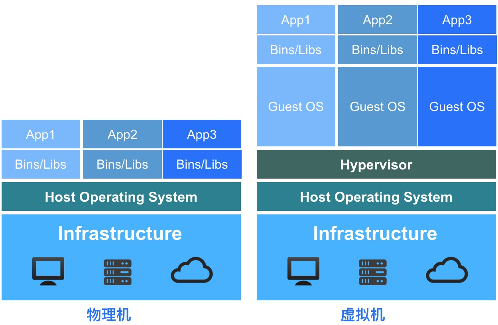

如上图所示，物理机和虚拟机在应用部署及资源占用上有本质区别：

* 物理机环境
  * 操作系统是直接安装在物理机上，通常一台物理机只支持安装一个操作系统；
  * 所有的应用程序和服务均需部署在物理机操作系统上，共享底层硬件资源；
  * 多个应用程序对底层操作系统的及组件要求不一致时，可能会导致应用无法正常运行，需要将两个应用程序分虽部署至一台物理机上，在非业务高峰时资源利用率较低。
* 虚拟机环境
  * 在硬件底层及操作系统之上增加 Hypervisor 层，作为计算虚拟化的引擎；
  * 虚拟化引擎支持将底层硬件虚拟为多个主机，即虚拟机；
  * 每个虚拟机都拥有独立的硬件设施，如 CPU、内存、磁盘、网卡等；
  * 每个虚拟机可以独立安装并运行不同的操作系统（GuestOS），相互完全隔离，彼此不受影响；
  * 每个虚拟机操作系统与物理机的操作系统一致，拥有独立的组件及库文件，可运行专属应用服务；
  * 多个应用程序的虚拟机在完全隔离且彼此不影响的情况下运行在一台物理机上，并共享物理机的资源，提高物理机的资源使用率及管理效率。

UCloudStack 计算虚拟化采用 KVM 和 Qemu 等 Hypervisor 组件及技术，将通用裸金属架构的 x86/ARM 服务器资源进行抽象，以虚拟机的方式呈现给用户。虚拟机将 CPU、 内存、I/O、磁盘等服务器物理资源转化为一组可统一管理、调度和分配的逻辑资源，并基于虚拟机在物理机上构建多个同时运行、相互隔离的虚拟机执行环境，可充分利用硬件辅助的完全虚拟化技术，实现高资源利用率的同时满足应用更加灵活的资源动态分配需求，如快速部署、资源均衡部署、重置系统、在线变更配置及热迁移等特性，降低应用业务的运营成本，提升部署运维的灵活性及业务响应的速度。

UCloudStack 计算虚拟化通过 KVM 硬件辅助的全虚拟化技术实现，**因此需要 CPU 虚拟化特性的支持**，即要求计算节点 CPU 支持虚拟化技术，如 Intel VT 和 AMD V 技术。KVM 属于 Linux Kernel 的一个模块，虚拟化平台可通过加载内核模块的方式启动 KVM ，管理虚拟硬件的设备驱动，用于模拟 CPU 和内存资源，同时需要加载 QEMU 模块模拟 I/O 设备。KVM 虚机包括虚拟内存、虚拟 CPU 和虚机 I/O 设备，其中 KVM 用于 CPU 和内存的虚拟化，QEMU 用于 I/O 设备的虚拟化。

虚拟机不直接感知物理 CPU ，它的计算单元会通过 Hypervisor 抽象的 vCPU 和内存进行呈现，通过与 GuestOS 的结合共同构建虚拟机系统。I/O 设备的虚拟化是 Hypervisor 复用外设资源，通过软件模拟真实硬件进行呈现，为 GuestOS 提供诸如网卡、磁盘、USB 设备等外设。

计算虚拟化是 UCloudStack 企业专有云平台的服务器虚拟化组件，是整个云平台架构的核心组件。在提供基础计算资源的同时，支持 CPU 超分、嵌套虚拟化、RAW 镜像文件、NUMA 优化、GPU 透传、虚拟机异常重启及集群平滑扩容等特性。

#### 3.1.1.1 CPU 超分

UCloudStack 支持平台物理 CPU 超分，即平台可虚拟化的 vCPU 数量可大于 pCPU 数量，在分配给虚拟机的 CPU 资源未全部使用时，共享未使用的部分给其它虚拟机使用，进一步提高平台 CPU 资源使用率。以 1 台双路 CPU 的计算节点服务器为例：

* 双路 CPU 即为 2 颗物理 CPU ，每颗物理 CPU 为 12 核 24 线程；
* 每颗 CPU 为 24 核，两颗 CPU 为 48 核，即可分配 48 vCPU；
* 正常情况下，能提供的虚拟机 vCPU 为 48C ；

若平台管理员开启 CPU 超分，并设置超分比例为 **`1:2`** ，即代表可使用的 vCPU 数量是实际 CPU 数量的 2 倍。服务器（48C ）在开启 2 倍超分后，可实际创建使用的 vCPU 为 96 ，即可创建 96C 的虚拟机。

支持平台管理员在设置并管理 CPU 超分比，并查看平台 CPU 的实际使用量及 vCPU 的使用量。由于开启超分后，可能存在多台虚拟机共用 vCPU 的情况，为不大幅影响虚拟机的性能及可用性，通常建议尽量降低 CPU 超分比例，甚至不建议开启 CPU 超分。

如平台实际共 48 vCPU ，经过超分后可创建 96 vCPU 的虚拟机，在虚拟机业务峰值时可能会真正占满 48 vCPU 的性能，通过超分资源运行的虚拟机性能会极速下降，甚至会影响虚拟机的正常运行。CPU 超分比例需通过长期运行运营的数据进行调整，与平台虚拟机上所运行的业务应用程序有强关联性，需要长期考察平台在峰值业务时需要的 CPU 资源量进行灵活调整。

#### 3.1.1.2 嵌套虚拟化

嵌套虚拟化是指在 UCloudStack 平台的虚拟机基础之上继续搭建虚拟化环境，允许在虚拟机中暴露更多物理 CPU 的特性，适用于在虚拟机上快速搭建虚拟化测试环境，如在 UCloudStack 虚拟机上运行 VMware Vsphere 的虚拟化软件。

支持平台管理员开启或关闭 vCPU 硬件虚拟化功能，开启后云平台的虚拟机中可以在部署虚拟化环境，并将虚拟机之上在运行虚拟机；当关闭 vCPU 硬件虚拟化功能后，云平台的虚拟机中将无法正常运行虚拟机。

#### 3.1.1.3 RAW 镜像文件

UCloudStack 平台使用 RAW 格式的镜像作为虚拟机的虚拟磁盘文件，即原始镜像。 

RAW 镜像会直接当作一个块设备提供给虚拟机使用，由宿主机文件系统管理镜像文件的空洞，如创建一个 100GB 的 RAW 的镜像文件，实际占用空间很小。当虚拟机的 GuestOS 读写磁盘时，会以 CHS 变量方式进行运算并寻址，通过 KVM 驱动将值翻译成 RAW 镜像特有格式进行 IO 操作。

RAW 镜像的优势在于启动虚拟机的效率较高，即启动虚拟机速度较快，相比 QCOW2 格式镜像的虚拟机启动速度快 25%，同时 RAW 镜像支持转换为 QCOW2 格式。

RAW 镜像及运行的虚拟机块设备均会存储于统一分布式存储系统中，方便虚拟机的迁移和故障恢复。

#### 3.1.1.4 NUMA 优化

NUMA（非统一内存访问 Non Uniform Memory Access Architecture）是一种用于多处理器的内存存储设计，内存访问时间取决于处理的内存位置。在 NUMA 下，处理器访问它自己在本地内存的速度比非本地内存效率更高。

在物理服务器中，一个物理 CPU 插槽本身直连的内存叫本地内存，其它物理 CPU 插槽直连的内存即为非本地内存。一个物理 CPU 访问非本地内存需经过 QPI 总线，存在一定的时延，如果访问频繁，可能就会加大访问的时延，进而影响部分需大量使用内存做缓存的业务，如 Oracle 数据库服务。

NUMA 优化是指尽量让物理 CPU 访问本地内存，降低访问内存缓存的时延。UCloudStack 的虚拟化实现及迁移等技术已经过 NUMA 技术优化，将虚拟机 CPU 对应的本地内存绑定在节点上，使其尽可能使物理 CPU 访问本地内存，提高业务的访问时延。

#### 3.1.1.5 GPU 透传

UCloudStack 平台支持 GPU 设备透传能力，为平台用户提供 GPU 虚拟机服务，让虚拟机拥有高性能计算和图形处理能力。GPU 虚拟机在科学计算表现中比传统架构性能提高数十倍，可同时搭配 SSD 云硬盘，IO 性能亦在普通磁盘的数十倍以上，可有效提升图形处理、科学计算等领域的计算处理效率，降低IT成本投入。

GPU 虚拟机与标准虚拟机采用一致管理方式，包括内外网 IP 分配、弹性网卡、子网及安全组管理，并可对 GPU 虚拟机进行全生命周期管理，包括重置密码，变更配置及监控等，使用方式与普通的虚拟机一致，支持多种操作系统，如 CentOS、Ubuntu、Windows 等，在不增加额外管理的基础上，为租户提供例捷的 GPU 计算服务。

用户可以自定义需要的 GPU、CPU、内存、硬盘数量，让企业以更具性价比的方式享受GPU带来的高性能计算。为让 GPU 发挥最佳性能，平台对 GPU 、CPU 及内存的组合定义如下：

| GPU  | CPU  | 内存      |
| ---- | ---- | --------- |
| 1颗  | 4核  | 8G，16G   |
|      | 8核  | 16G，32G  |
| 2颗  | 8核  | 16G，32G  |
|      | 16核 | 32G，64G  |
| 4颗  | 16核 | 32G，64G  |
|      | 32核 | 64G，128G |

平台本身不限制 GPU 品牌及型号，即支持任意 GPU 设备透传，已测试并兼容 GPU 型号为 Tesla V100 和 Tesla K80 。

!> 平台默认不支持 GPU 虚拟化，如需 GPU 虚拟化能力，需购买 GPU 虚拟化授权。

#### 3.1.1.6 VM异常重启

虚拟机支持 Windows、Linux、Ubuntu 等 Guest  操作系统，在日常运行中可能因为系统或应用程序的原因出现死机、卡死等业务中断问题。在出现此类故障时，虚拟机或物理机均不会自动重启使系统恢复，需要管理员或运维人员手动介入重启，可能会影响业务连续性敏感的应用。

UCloudStack 平台为用户提供虚拟机异常重启功能，支持对虚拟机的网络通信状态、磁盘 IO、网络流量及虚拟机本身进程进行不断检测，判断虚拟机的操作系统是否已进入卡死或异常状态。若卡死状态持续一定时间，可认为虚拟机发生异常，系统将自动对虚拟机进行关机并重启操作，将虚拟机恢复至正常运行状态。

VM 异常重启动能可帮助云平台资源管理者进行自动化运维，同时保证虚拟机业务的持续可用性。

#### 3.1.1.7 集群平滑扩容

UCloudStack 平台支持平滑扩容集群内的计算节点，新增的节点不会影响已有节点及虚拟资源的运行。通过平滑扩容云平台管理员可轻松解决平台因业务增长而带来的资源扩展，包括硬件资源不足、高负载主机维护、新业务上线资源扩容等场景。

UCloudStack 集群扩容可保证节点扩展过程中业务不中断，虚拟资源均正常运行，并提供简单快速的部署操作，支持自动化脚本一键部署上线。在扩容后平台支持在线为节点添加磁盘功能，使管理员可在不影响平台稳定运行的情况下，为平台横向及纵向的扩展资源。

平滑扩容成功后，平台原有的虚拟资源会保持原始状态，待平台有新的虚拟资源需要运行和部署时，智能调度平台会将新的虚拟资源（如虚拟机）调度至平滑扩容的节点；若平台有物理机发生故障，原物理机上的虚拟机会根据调度策略迁移至新扩容的节点。支持平台管理员手动将一台虚拟机迁移至新扩容的节点，用于平衡平台整体资源使用率。

### 3.1.2 智能调度

智能调度是 UCloudStack 平台虚拟机资源调度管理的核心，由【Schedule Manager 】模块负责调度任务的控制和管理，支持反亲和性部署策略，用于决策虚拟机运行在哪一台物理服务器上，同时管理虚拟机状态及迁移计划，保证虚拟机可用性和可靠性。

智能调度系统实时监测集群所有计算节点计算、存储、网络等负载信息，作为虚拟机调度和管理的数据依据。当有新的虚拟资源需要部署时，**调度系统会优先选择低负荷节点进行部署**，确保整个集群节点的负载。如下图所示，新创建的虚拟资源将会通过调度检测，自动部署至负载较低的 Node3 节点上。


调度系统在优先选择低负荷节点进行虚拟资源部署的同时，分别提供打散部署、在线迁移、宕机迁移等能力，整体保证云平台的可靠性。UCloudStack 云平台使用分布式存储提供存储服务，如上图所示，虚拟机均运行于分布式存储池之上，且分布式存储池可跨多台物理机构建统一分布式存储资源池。虚拟机的系统盘、镜像文件及挂载的硬盘均存储于统一分布式存储池中，每台计算节点均可通过分布式存储池中的虚拟机的系统盘文件及配置信息注册一个相同的虚拟机进程，可作用于在线迁移或宕机迁移任务。

#### 3.1.2.1 打散部署

打散部署——即虚拟资源反亲和部署策略，指将运行相同应用服务的虚拟资源根据调度策略打散且均衡的分布在底层集群物理服务器上，保障硬件或软件故障等异常情况下服务的高可用性。

UCloudStack 云平台默认支持虚拟机打散部署策略，即一个用户的虚拟机在创建时，会优先选择健壮的节点进行部署，同时会保证一个用户的虚拟机尽量打散部署至底层集群的节点上，保证业务健壮性；同时平台支持手动进行打散标记，用户可通过【业务组】区分不同业务的虚拟资源，同一业务组的虚拟机会根据智能调度策略均衡分布在集群物理服务器，确保业务服务的高可用性。

* 当用户将两台虚拟机标识为同一个业务组，即代表两台虚拟机部署相同或相关联的业务应用服务；
* 平台调度策略会根据业务组标识，将两台虚拟机分别部署在不同的计算节点上，即尽量保证两台虚拟机不会部署在同一台服务器节点；
* 若相同业务的两台虚拟机部署至同一台物理机，当物理机故障时，两台虚拟机均会发生故障，并会同时进行【宕机迁移】，会影响业务应用正常提供服务；
* 若相同业务的两台虚拟机部署至不同的物理机，当其中一台物理机故障时，仅会有一台虚拟机宕机并迁移，不会影响业务应用正常提供服务；

如智能调度图中的 VM1 和 VM5 同属一个业务组，系统自动将 VM1 部署至 Node1 ，VM5 部署至 Node3 ，当 Node1 节点故障时，VM5 会继续提供服务，VM1 将自动迁移至健康且负载正常的计算节点，详见 [宕机迁移](#_3123-宕机迁移) 。

#### 3.1.2.2 在线迁移

在线迁移（虚拟机热迁移）是计划内的迁移操作，即虚拟机不停机的情况下，在不同的物理机之间进行在线跨机迁移。首先是在目标物理机注册一个相同配置的虚拟机进程，然后进行虚拟机内存数据同步，最终快速切换业务到目标新虚拟机。整个迁移切换过程非常短暂，几乎不影响或中断用户运行在虚拟机中的业务，适用于云平台资源动态调整、物理机停机维护、优化服务器能源消耗等场景，进一步增强云平台可靠性。

由于采用分布式统一存储，虚拟机在线迁移时只迁移**【计算】**的运行位置，不涉及**存储**（系统盘、镜像、云硬盘）位置迁移。迁移时仅需通过统一存储内的源虚拟机配置文件在目的主机上注册一个相同配置且状态置为暂停的虚拟机进程，然后反复迁移源虚拟机的内存至目的虚拟机，待虚拟机内存同步一致后，关闭源虚拟机并激活目标虚拟机进程，最后进行网络切换并成功接管源虚拟机业务。

整个迁移任务仅在激活目标虚拟机及网络切换时业务处于短暂中断，由于激活和切换所用时间很短，少于 TCP 超时重传时间，因此源虚拟机业务几乎无感知。同时由于无需迁移虚拟机磁盘及镜像位置，**虚机挂载的云盘迁移后不受影响**，可为用户提供无感知且携带存储数据的迁移服务。具体迁移过程如下：

1. **注册目标虚拟机**
   * 调度系统使用统一分布式存储内的源虚拟机配置文件在目标主机上注册一个相同配置的虚拟机进程；
   * 注册的虚拟机进程为不可提供服务的暂停【paused】状态，并通过监听一个 TCP 端口接收迁移数据；
   * 注册目标虚拟机的阶段为瞬间完成，通常耗时为几毫秒，此时源虚拟机处于正常提供业务的状态。
2. **迁移源虚拟机内存**
   * 在目标虚拟机注册完成的同时，调度系统会立即将源虚拟机的**全量内存数据**迁移至目标虚拟机；
   * 为保证数据迁移的一致性，迁移过程中源虚拟机的内存更新也需要进行同步，因此调度系统通过多次迭代将源虚拟机产生的新内存数据迁移至目标端，耗时与物理机的网络带宽、性能及虚拟机的内存大小有关；
   * 内存迁移时源虚拟机正常提供业务，待内存数据反复迭代迁移完成时立即**暂停**源虚拟机进程，避免产生新的内存数据；
   * 源虚拟机进程暂停后，会再进行一次内存数据的同步，保证源端和目标端的数据一致性。
3. **接管源虚拟机服务**
   * 完成内存同步的收尾工作，调度系统会关闭源虚拟机并**激活**目标虚拟机的进程，实现虚拟机平滑运行；
   * 虚拟机从源主机迁移至目标主机，系统会将虚拟机的网络切换至目标主机（下发流表），通过目标主机的 vSwitch 进行通信，成功接管源虚拟机服务。
   * 若虚拟机有绑定的外网 IP ，外网 IP 地址在网络切换时会自动漂移至目标主机，并通过 OVS 中的流表进行通信。

整个迁移过程中，从源虚拟机暂停至目标虚拟机激活并完成网络切换为停机时间，由于激活虚拟机及网络切换时间非常短暂，通常小于**几百毫秒**，少于 TCP 超时重传时间，对大多数应用服务来说可忽略不计，因此虚拟机业务几乎不会感知到迁移停机。如智能调度图中的 VM6 默认运行在 Node1 上，管理员通过在线迁移功能手动将 VM6 迁移至 Node3 的流程如下：

* 调度系统收到迁移指令后，会立即使用 VM6 的配置文件在 Node3 节点上注册一个暂停状态的虚拟机进程；
* 立即迁移 VM6 的全量进程数据至 Node3 节点的 VM6‘ ，并反复多次迁移更新内存数据；
* 调度系统暂停 Node1 上的 VM6 虚拟机，再次进行内存数据的迁移并关闭 VM6 虚拟机；
* 激活 Node3 节点上的 VM6' 虚拟机进程，完成网络切换并接管 VM6 的业务服务及通信；
* 若 VM6 有挂载的云硬盘，迁移成功后，不影响已云硬盘的挂载信息及配置，可正常读写云硬盘。

> 由于虚拟机不感知物理 CPU ，支持跨不同 CPU 型号的物理服务器之间进行在线迁移。

<span id="_3123-宕机迁移"></span>

#### 3.1.2.3 宕机迁移 

宕机迁移又称离线迁移（Offline Migration）或虚拟机高可用（ High Availability），指平台底层物理机出现异常或故障而导致宕机时，调度系统会自动将其所承载的虚拟资源快速迁移到健康且负载正常的物理机，尽量保证业务的可用性。整体宕机迁移不涉及存储及数据迁移，新虚拟机可快速在新物理机上运行，平均迁移时间为 90 秒左右，可能会影响或中断运行在虚拟机中的业务。

由于采用分布式统一存储，虚拟机的系统盘及写进系统盘的数据均存储在底层分布式存储中，虚拟机宕机迁移只迁移**【计算】**的运行位置，不涉及**存储**（系统盘、镜像、云硬盘）位置迁移，仅需在新物理机上重新启动虚拟机并保证网络通信即可。迁移机制说明如下：

* UCloudStack 调度管理系统会周期性监测物理机的健康状态，间隔时间为 1秒 ；
* 当检测到一台物理机宕机时，调度系统会继续探测试 50 个周期（即 50 秒）；
* 若 50 个周期物理机依然故障则触发二层 Ping 检测，间隔为 400ms ，持续 10 个周期（即 4 秒）；
* 若二层检测依然失败则会触发虚拟机迁移操作，即调度系统在物理机持续故障 54 秒后开始执行迁移任务；
* 调度系统使用分布式存储内故障虚拟机的系统盘及数据重新在新物理机上启动虚拟机，启动过程及状态流转与新建虚拟机一致，平均启动时间为 30 秒左右；
* 虚拟机在新物理机上启动后，会将虚拟机网络切换至新物理机，通过 OVS 中下发的流表进行通信；
* 若虚拟机有绑定的外网 IP ，外网 IP 地址迁移后自动漂移至目标主机，并通过 OVS 中的流表进行通信。

整个迁移过程，从检测到故障至迁移成功平均为 90 秒左右。虚拟机启动时间与源虚拟机的组件及配置有关，如绑定云硬盘、外网 IP 、弹性网卡及操作系统等；同时由于虚拟机规格过大、底层物理资源不足、底层硬件故障等原因可能会导致宕机迁移失败，通常建议尽量保证底层物理资源充足。如智能调度图中的 Node2  节点故障，智能调度系统自动将 VM3 和 VM4 分别迁移至 Node1 和  Node3  节点，具体流程如下：

* 调度系统经过周期性监测及二层检测，判断 Node2  节点故障，VM3/VM4 两台虚拟机不可用，需要进行宕机迁移操作；
* 调度系统根据收集的集群节点信息，使用分布式存储系统中 VM3 的系统盘及数据在 Node1 节点启动 VM3 虚拟机，并在启动后重新下发流表将 VM3 的网络信息切换至 Node1 ；
* 使用分布式存储系统中 VM4 的系统盘及数据在 Node3 节点启动 VM4 虚拟机，并在启动后重新下发流表将 VM4 的网络信息切换至 Node3 ；
* 若 VM3 或 VM4 已绑定外网 IP ，虚拟机启动后外网 IP 地址会分别漂移至 Node1 和 Node3 节点，并通过 OVS 中的流表进行通信。

宕机迁移的前提是集群中至少有 2 台以上的物理服务器，且在迁移过程中需保证健康节点的资源充足及网络连通性。通过宕机迁移技术，为业务系统提供高可用性，极大缩短由于各种主机物理故障或链路故障引起的中断时间。

### 3.1.3 存储虚拟化

云计算平台通过硬件辅助的虚拟化计算技术最大程度上提高资源利用率和业务运维管理的效率，整体降低 IT 基础设施的总拥有成本，并有效提高业务服务的可用性、可靠性及稳定性。在解决计算资源的同时，企业还需考虑适用于虚拟化计算平台的数据存储，包括存储的安全性、可靠性、可扩展性、易用性、性能及成本等。

虚拟化计算 KVM 平台可对接多种类型的存储系统，如本地磁盘、商业化 SAN 存储设备、NFS 及分布式存储系统，分别解决虚拟化计算在不同应用场景下的数据存储需求。

* 本地磁盘：服务器上的本地磁盘，通常采用 RAID 条带化保证磁盘数据安全。性能高，扩展性差，虚拟化环境下迁移较为困难，适用于高性能且基本不考虑数据安全业务场景。
* 商业化存储：即磁盘阵列，通常为软硬一体的单一存储，采用 RAID 保证数据安全。性能高，成本高，需配合共享文件系统进行虚拟化迁移，适用于 Oracle 数据库等大型应用数据存储场景。
* NFS 系统：共享文件系统，性能较低，易用性较好，无法保证数据安全性，适用于多台虚拟机共享读写的场景
* 分布式存储系统：软件定义存储，采用通用分布式存储系统的标准，将大量通用 x86 廉价服务器的磁盘资源聚合在一起，提供统一存储服务。通过多副本的方式保证数据安全，高可靠 、高性能、高安全、易于扩展、易于迁移且成本较低，适用于虚拟化计算的大部分存储场景。

每一种类型的存储系统，在不同的存储场景下均有优劣势，虚拟化计算平台需根据业务特证选择适当的存储系统，用于提供存储虚拟化功能，在某些特定的业务模式下，可能需要同时提供多种存储系统，用于不同的应用服务。

在传统的存储结构中，客户端与单一入口点的集中式存储组件进行通信，可能会限制存储系统的性能和可伸缩性，同时可能带来单点故障。**UCloudStack 平台采用分布式存付系统作为虚拟化存储，用于对接 KVM 虚拟化计算服务，消除集中式网关，使客户端直接与存储系统进行交互，并以多副本机制写入数据，确保数据安全性和可用性。**

#### 3.1.3.1 分布式存储

UCloudStack 云平台基于 [Ceph](https://ceph.io/) 分布式存储系统适配优化，为虚拟化计算平台提供一套纯软件定义、可部署于 x86 通用服务器的高性能、高可靠、高扩展、高安全、易管理且较低成本的虚拟化存储解决方案，同时具有极大可伸缩性。作为云平台的核心组成部分，为用户提供多种存储服务及 PB 级数据存储能力，适用于虚拟机、数据库等应用场景，满足关键业务的存储需求，保证业务高效稳定且可靠的运行。

分布式存储服务通过将大量 x86 通用服务器的磁盘存储资源融合在一起进行【池化】，构建一个无限可伸缩的统一分布式存储集群，实现对数据中心所有存储资源的统一管理及调度，向虚拟化计算层提供【块】存储接口，供云平台虚拟机或虚拟资源根据自身需求自由分配并使用存储资源池中的存储空间。同时存储管理支持 IP-SAN、FC-SAN、NAS 等存储设备的对接，通过不同的适配器与存储节点连接，通过平台虚拟化存储技术对外提供统一的块存储空间。

存储功能所见即所得，用户无需关注存储设备的类型和能力，即可在云平台快捷使用虚拟化存储服务，如虚拟磁盘挂载、扩容、增量快照、监控等，云平台用户像使用 x86 服务器的本地硬盘一样的方式使用虚拟磁盘，如格式化、安装操作系统、读写数据等。云平台管理员可以全局统一配置并管理平台整体虚拟化存储资源，如 QoS 限制、存储池扩容、存储规格及存储策略配置。

分布式存储系统可提供块存储、文件存储及对象存储服务，适用于多种数据存储的应用场景，同时可保证数据的安全性及集群服务的可靠性。在部署上，通常推荐使用同一类型的磁盘构建存储集群，如超融合计算节点和独立存储节点自带 SSD 磁盘构建为高性能的存储集群；超融计算节点和独立存储节点自带的 SATA/SAS 磁盘构建为普通性能存储集群。分布式存储系统将集群内的磁盘设备结合 OSD 内建为弹性块存储服务，可供虚拟机直接挂载使用，在数据写入时通过三副本、写入确认机制及副本分布策略等措施，最大限度保障数据安全性和可用性。逻辑架构如下：	


UCloudStack 分布式存储系统是整个云平台架构不可或缺的核心组件，通过分布式存储集群体系结构提供基础存储资源，并支持在线水平扩容，同时融合智能存储集群、多副本机制、数据条带化、数据重均衡、故障数据重建、数据清洗、自动精简配置及快照等技术，为虚拟化存储提供高性能、高可靠、高扩展、易管理及数据安全性保障，全方面提升存储虚拟化及云平台的服务质量。

#### 3.1.3.2 存储集群

分布式存储集群可包含数千个存储节点，通常至少需要一个监视器、两个 OSD 守护进程才可正常运行及数据复制。其中包括的基础概念如下：

* **OSD**：通常一个 OSD 对应物理机一块磁盘、一个 RAID Group 或者一个物理存储设备，主要负责数据存储、处理数据复制、恢复、回填及数据重均衡，并负责向监视器报告检测信息。单集群至少需要两个 OSD，并在物理架构可划分为多个故障域（机房、机架、服务器），通过策略配置使多副本位于不同的故障域中。
* **监视器 Monitor**：实现存储集群的状态监控，负责维护存储集群的 Object、PG 及 OSD 间的映射关系图，为数据存储提供强一致性决策，同时为客户端提供数据存储的映射关系。

* **客户端**：部署在服务器上，实现数据切片，通过 CRUSH 算法定位对象位置，并进行对象数据的读写。通常包括块设备、对象存储、文件系统等，读/写操作由 OSD 守护进程处理。

* **CRUSH 算法**：用于保证数据均匀分布的伪随机算法，OSD 和客户端均使用 CRUSH 算法来按需计算对象的位置信息，为存储集群动态伸缩、重均衡和自修复功能提供支撑。

**数据存储过程**如下图所示，存储集群从客户端接收数据，并将数据分片存储为存储池内的 Object（对象），客户端程序通过与 OSD 或监视器交互获取映射关系数据，在本地通过 CRUSH 算法计算得出对象存储位置后，直接与对应的 OSD 进行通信，完成数据读写操作。

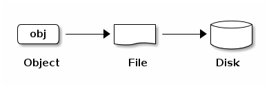

> 数据可分片为 2MB、4MB 或自定义大小的对象，每个对象是文件系统中的一个文件。

分布式存储集群在数据存储过程中会涉及到多种逻辑概念，通过相互关联承载数据存储流程，逻辑架构图如下：


* 一个集群可逻辑上划分为多个 Pool ，Pool 是一个命名空间，客户端存储数据时需指定一个 Pool；
* 一个 Pool 包含若干个逻辑 PG（Placement Group），可定义 Pool 内的 PG 数量和对象副本数量；
* PG 是对象和 OSD 的中间逻辑分层，写对象数据时会首先计算要存储的 PG ；

* 一个物理文件会被切分为多个 Object ，每个 Object 会被映射到一个 PG ，一个 PG 包含多个 Object ；
* 一个 PG 可映射到一组 OSD ，其中第一个 OSD 为主 ，其它 OSD 为从，Object 会被均匀分发至一组 OSD 上进行存储；
* 承载相同 PG 的 OSD 间相互监控存活状态，支持多个 PG 同时映射到一个 OSD ；

在存储集群的机制中，承载相同 PG 的主从 OSD 间需要彼此交换信息，确保彼此的存活状态。客户端首次访问会首先从监视器获取映射关系的数据，存储数据时会与 OSD 对比映射关系数据的版本。由上图示意图得知，一个 OSD 可同时承载多个 PG ，每个 PG 通常为 3 个 OSD ，OSD 间信交换在某一时刻可能达到数千次，交换次数由集群中的 OSD 及 PG 数量决定。如上图所示，数据寻址流程分为三个映射阶段：

1. 将用户要操作的文件映射为存储集群可处理的 Object ，即利用 [**数据条带化**](#_3134-数据条带化) 将文件按照对象大小进行分片处理，数据条带化与 RAID 的条带化概念一致；
2. 将所有文件分片的 Object 映射到 PG ；
3. 将 PG 映射到数据实际存储的 OSD 中 。

> 分布式存储集群的 Pool 的大小、副本数量、CRUSH 算法规则、PG 数量会决定存储集群如何存储数据。

 <span id="_3133-多副本机制"></span>

#### 3.1.3.3 多副本机制

多副本机制是指将写入的数据保存多份的数据冗余技术，并由存储系统保证多副本数据的一致性。UCloudStack 分布式存储系统采用多副本数据备份机制，写入数据时先向主副本写入数据，由主副本负责向其他副本同步数据，并将每一份数据的副本跨磁盘、跨服务器、跨机柜、跨数据中心分别存储于不同磁盘上，多维度保证数据安全。副本数据仅作为数据安全的保证，存储客户端在读取数据时不感知副本的存在。

UCloudStack 分布式存储系统通过多副本、写入确认机制及副本分布策略等措施，最大限度保障数据安全性和可用性。多副本机制存储数据，将自动屏蔽软硬件故障，磁盘损坏和软件故障，导致副本数据丢失，系统自动检测到并自动进行副本数据备份和同步，不会影响业务数据的存储和读写，保证数据安全性和可用性。本章节以**三副本**为例，具体描述多副本的工作机制：

**（1）三副本**

用户通过客户端写入分布式存储的数据，会根据 Pool 设置的副本数量 `3`  写入三份，并按照副本分布策略，分别存储于不同物理主机的磁盘上。分布式存储保证数据安全的副本数量至少为 2 份，以便存储集群可以在降级状态下运行，保证数据安全。


**（2）写入确认机制**

如上图所示，三副本在写入过程中，只有三个写入过程全部被确认，才返回写入完成，确保数据写入的强一致性。

客户端将对象写入到目标 PG 的主 OSD 中，然后主 OSD 通过 GRUSH 映射关系图定位用于存储对象副本的第二个和第三个 OSD ，并将对象数据复到 PG 所对应的两个从 OSD ，最后响应客户端确认对象写入成功。

**（3）副本分布策略**

分布式存储支持副本数据落盘分布策略，使用 CRUSH 算法根据存储设备的权重值分配数据对象，尽量确保对象数据的均匀分布。平台通过定义存储桶类型，可将副本数据分布在不同磁盘、不同主机、不同机柜、不同机房甚至不同数据中心，避免因单主机、单机柜、单机房及单数据中心整体故障造成数据丢失或不可用的故障，保证数据的可用性和安全性。

为保证存储数据的访问时延，通常建议最多将数据副本保存至不同的机柜，若将数据三副本保存至不同的机房，由于网络延时等原因，可能会影响云硬盘的 IO 性能。


如上图所示，客户端通过分布式存储系统写入 ABC 三个对象数据，根据 CRUSH 规则定义的副本分布策略，需要将三个对象的副本分别存储于不同的机柜。以 A 对象为例，存储系统提前设置副本分布策略，尽量保证对象副本分布在不同柜柜的服务器 OSD 中，即定义机柜和主机存储桶。当分布式存储系统计算出写入对象的 PG 及对应的 OSD 位置时，会优先将 A 写入到机柜 1 的服务器 OSD 中，同时通过主 OSD 复制副本 A‘ 至机柜 2 的服务器 OSD 中，复制 A''  至机柜 3 的服务器 OSD 中 ，数据全部复制写入成功，即返回客户端对象 A 写入成功。

在存储节点无网络中断或磁盘故障等异常情况时，对象副本数据始终保持为 3 副本，不区分主副本和备副本。仅当节点发生异常时，副本数量少于 3 时，存储系统会自动进行数据副本重建，以保证数据副本永久为三份，为虚拟化存储数据安全保驾护航。

<span id="_3134-数据条带化"></span>

#### 3.1.3.4 数据条带化

数据条带化是与 RAID 模式类似的数据存储技术，指将一块连续的数据切分为多个小数据块，并发的存储至不同物理磁盘上，实现数据读写的高 I/O 并发能力，提升存储系统的吞吐量和性能。

UCloudStack 分布式存储系统的数据条带化能力与 RAID0 一致，提供像 RAID0 一样吞吐量及 N 路 RAID 镜像一样的可靠性及数据恢复速度，避免由服务器及存储设备吞吐量限制影响分布式存储系统的性能。通过条带化处理的数据可以并发写入到 RAID0 的所有磁盘，由于并发执行 I/O 操作，总线带宽得到充分利用，因此数据经过条带化处理的写入性能是单个磁盘的 n 倍。如下 RAID0 条带化图所示：

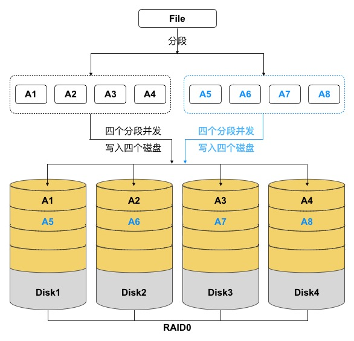

分布式存储客户端将展现给用户的数据格式转换为可存储于存储池内的对象（Object），即数据以对象的方式存储于集群。

UCloudStack 分布式存储支持数据条带化特性，客户端将数据写入存储集群前会先进行条带化处理，即将数据切分为多个数据小块——【条带单元】，并将条带单元并行写入一组对象集（Object-Set），对象集写满后会使用新的对象集来存储后续的条带单元。由于 Object 被映射到不同的 PG 并进一步映射到不同 OSD 磁盘，可以分别以最大写入速度以并发 I/O 的方式写入到一组 OSD 设备中，结合多磁盘设备的吞吐量达到更高的读/写性能。

* **条带单元**

  数据条带化后的数据块，多个条带单元组成一个对象。

* **条带大小**

  条带单元的单位大小（如 1MB），除最后一个条带单元，通常对象中条带单元大小相同。

* **条带数**

  指一个对象集上的对象数量，客户端把多个条带单元写入由条带数量确定的对象集上。

* **对象集**

  一组对象，由多个对象组成，一起表示数据的一个连续部分，集合中的对象数量与条带数相同。

* **对象大小**

  用于标识对象集中一个对象的大小，对象大小是条带大小的整倍数，通常为 2MB 或 4MB 。

文件的数据被分成条带单位，连续的条带单位存储在对象集中的对象上。对象集中的对象数量与条带数相同，存储的文件数据的对象可能会超过对象集，因此在对象集写满后，将使用新的对象集存储后续文件数据。

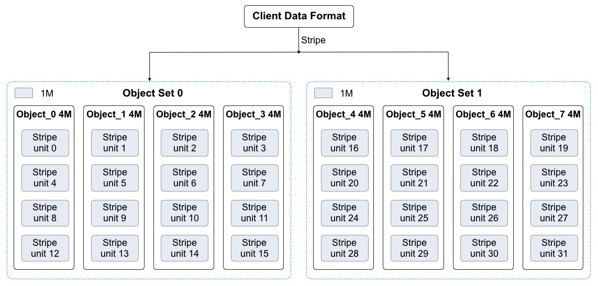

在分布式存储系统中，三个重要参数决定系统如何条带化数据，包括对象大小、条带大小、条带数量。假设对象大小为 4M 、条带单元大小为 1M 、条带数量为 4 ，即一个对象集中有 4 个对象，每个对象可写入 4 个条带单元。

如上图所示，客户端将数据条带化到对象集 `Object Set 0` ，由于他包含 4 个对象，条带单元会以 4 个为一个循环，依次写入到 4 个对象中。如条带单元 `Stirpe unit 0` 会写入到 `Object_0` ， `Stirpe unit 3` 会按顺序写入到 `Object_3` ，写入完成后，客户端会确认对象集 `Object Set 0` 是否已满。

* 若对象集未满，客户端会再从第一个对象起写入条带，如条带单元 `Stirpe unit 4` 会写入到 `Object_0` ，`Stirpe unit 6` 会按顺序写入到 `Object_2` ；
* 若对象集已满，客户端会创建新对象集，按照同样的方式写第二个对象集。如上图中的  `Object Set 1` 对象集，然后在新的对象集中的第一个对象 `Object_4` 开始写入第一个条带 `Stirpe unit 16` ，直到条带单元写完为止。
* 条带化处理写入数据的过程中，条带单元会以条带数量为循环并发写入不同的对象中，即会以最大写入速度并发写入至一组 OSD 中，整体提高分布式存储的读写性能。

分布式存储客户端将数据拆分为条带单元并映射到对象后，在通过 CRUSH 算法将对象映射到 PG ，并进一步映射到存储单元 OSD ，以对象文件的形式存储到硬盘上。由于多副本机制的存在，存储至 OSD 的对象会通过多副本分布策略，复到多份副本数据至其它 OSD ，以保证数据的安全性。通过条带化和多副本机制技术的结合，文件数据写入到分布式存储的路径为：客户端>条带化>PG>OSD>副本复制>写入完成，文件数据变化为：文件数据>条带单元>对象/对象副本 。

!> 注意：条带化与多副本机制无关，多副本是对条带化处理过的 Object 进行复制。 由于条带化会影响数据的存储的流程，数据被条带化至存储池后无法进行条带化调整。

#### 3.1.3.5 数据重均衡

UCloudSack 云平台分布式存储集群在写入数据时，会通过数据条带化、CRUSH 映射关系及多副本分布策略尽量保证数据对象在存储池中的均衡。随着存储集群的长期运行及对平台的运维管理，可能会导致存储池内的数据失衡，如存储节点和磁盘扩容、存储部分数据被删除、磁盘和主机故障等。

* 存储节点及磁盘扩容后，平台总存储容量增加，新增容量未承载数据存储，导致集群数据失衡；
* 用户删除虚拟机或云硬盘数据，导致集群内出现大量空闲空间；
* 磁盘和主机故障下线后，部分数据对象副本会重建至其它磁盘或主机，故障恢复后处于空闲状态。

为避免扩容及故障导致存储集群数据分布失衡，UCloudStack 分布式存储系统提供数据重均衡能力，在存储集群及磁盘数据发生变更后，通过 CRUSH 规则及时对数据的部分对象进行重新分发和均衡，使存储池中的对象数据尽量均衡，避免产生数据热点及资源浪费，提升存储系统的稳定性及资源利用率。

**（1）集群扩容重均衡**

平台支持水平扩展存储节点或在线向存储节点中增加磁盘的方式扩容存储集群的容量，即分布式存储集群支持在运行时增加 OSD 进行存储池扩容 。当集群容量达到阈值需要扩容时，可将新磁盘添加为集群的 OSD 并加入到集群的 CRUSH 运行图，平台会按照新 CRUSH 运行图重新均衡集群数据分布，将一些 PG 移入/移出多个 OSD 设备，使集群数据回到均衡状态。如下图所示：

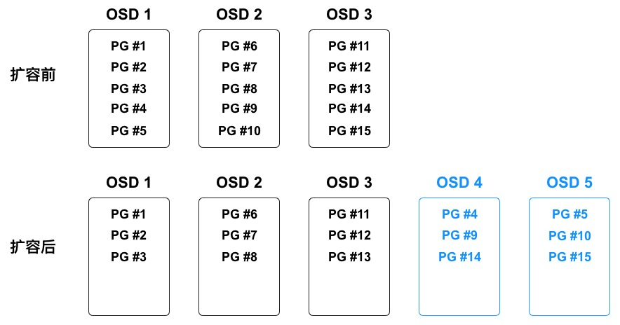

在数据均衡过程中，仅会将现有 OSD 中的部分 PG 到迁移到新的 OSD 设备，不会迁移所有 PG ，尽量让所有 OSD 均腾出部分容量空间，保证所有 OSD 的对象数据分布相对均衡。如上图中新增 `OSD 4` 和 `OSD 5` 后，有三个 PG（PG #4、PG #9、PG #14） 迁移到 `OSD 4 `，三个 PG （PG #5、PG #10、PG #15）迁移到  `OSD 5 ` ，使五个 OSD 中映射的 PG 均为 3 个。为避免 PG 迁移导致集群性能整体降低，**存储系统会提高用户读写请求的优先级**，在系统空闲时间进行 PG 迁移操作。

> PG 在迁移过程中，原 OSD 会继续提供服务，直到 PG 迁移完成才将数对象写入新 OSD 设备。

**（2）集群容量缩减重均衡**

存储集群在运行过程中可能需要缩减集群容量或替换硬件，平台支持在线删除 OSD 及节点下线，用于缩减集群容量或进入运维模式。当 OSD 被在集群中被删除时，存储系统会根据 CRUSH 运行图重新均衡集群数据分布，将被删除的 OSD 上的 PG 迁移至其它相对空闲的 OSD 设备上，使集群回到均衡状态。如下图所示：


在数据均衡过程中，仅会将被删除 OSD 上的 PG 迁移至相对空闲的 OSD 设备，尽量保证所有 OSD 的对象数据分布相对均衡。如上图中即将被删除的  `OSD 4` 和 `OSD 5` 上共映射 6 个 PG ，删除后分别分有 2 个 PG 会被迁移至剩余 3 个 OSD 中，使 3 个 OSD 中映射的 PG 均为 5 个。

**（3）故障数据重均衡**

分布式存储在长期运行中会存在磁盘、节点的物理损坏、系统崩溃及网络中断等故障，均会中断节点的存储服务。存储集群提供容错方法来管理软硬件，PG 作为对象与 OSD 的中间逻辑层，可保证数据对象不会直接绑死到一个 OSD 设备，意味着集群可在“降级”模式下继续提供服务。详见[数据故障重建](#_3136-数据故障重建)。

!> **通过数据重均衡机制，可支持分布式存储集群平滑扩容，包括横向扩容和纵向扩容，即可以在线添加存储节点及存储磁盘。**

 <span id="_3136-数据故障重建"></span>

#### 3.1.3.6 数据故障重建

根据多副本机制，存储集群在把数据对象通过 CRUSH 写入到指定 OSD 后，OSD 会通过运行图计算副本位置，并将数据副本写入到指定 OSD 设备中，通常数据对象会被分配至不同故障域中，保证数据安全性和可用性。

当磁盘损坏或节点故障时，即代表节点部分/全部 OSD 设备下线或无法为 PG 内对象提供存储服务，同时也表示有部分对象数据的副本数量不完整，如 3 副本可能因为磁盘损坏变为 2 副本。故障时对象数据的 PG 被置为“降级”模式继续提供存储服务，并开始进行数据副本重建操作，按照最新 CRUSH 运行图将故障节点或磁盘上的对象数据重映射到其它 OSD 设备上，即重新复制对象数据的副本至其它  OSD 设备，保证副本数量与存储池设置一致。

故障数据的副本重建时会遵循存储集群多副本分布策略，选择存储桶中定义的 OSD 作为对象副本的位置，尽量让同一对象数据的多副本间位置互斥，避免多副本位于同一个故障域，保证数据安全性。同时为提高故障数据的重建速度，多个副本重建任务的 I/O 会并发进行，实现故障数据的快速重建。

故障节点或磁盘恢复后，OSD 被重新加入至集群的 CRUSH 运行图，平台会按照新 CRUSH 运行图重新均衡集群数据分布，将一些 PG 移入/移出多个 OSD 设备，使集群数据回到均衡状态。为保证存储集群的运营性能，副本数据恢复及迁移时，会限制恢复请求数、线程数、对象块尺寸，**并提高用户读写请求的优先级**，保证集群可用性和运行性能。

#### 3.1.3.7 数据清洗

分布式存储集群在长期运行及数据重平衡的过程中，可能会产生一些脏数据、缺陷文件及系统错误数据。如一块 OSD 磁盘损坏，集群在重均衡后重建数据至其它 OSD 设备，当故障 OSD 设备恢复后可能还存储着之前数据的副本，这些副本数据在集群重新平衡时需及时进行清洗。

分布式存储的 OSD 守护进程可进行 PG 内对象的清洗，即 OSD 会比较 PG 内不同 OSD 的各对象副本元数据，如果发现有脏数据、文件系统错误及磁盘坏扇区，会对其进行深度清洗，以确保数据的完整性。

#### 3.1.3.8 可用性和可扩展性

为构建全平台高可用的分布式存储服务，保证虚拟化计算数据存储的可用性和可靠性，分布式存储系统从多方面保证存储服务的稳健运行。

* **消除集中控制网关**

  使客户端直接和存储单元 OSD 守护进程交互，自动在各存储节点上创建数据副本确保数据安全性和可用性。

* **CRUSH 算法**

  为消除中央集权控制带来的问题，分布式存储客户端和 OSD 守护进程均使用 CRUSH 算法按需计算对象的位置信息，同时让大部分数据管理任务在客户端和 OSD 处理，提高平台的可伸缩性。

* **集群映射图**

  监视器维护存储集群中  Object、PG 及 OSD 间的映射图，包括集群成员、状态、变更、以及存储集群的整体健康状况。

* **高可用监视器**

  支持监视器集群，当一个监视器因为延时或错误导致状态不一致时，存储系统会通过算法将集群内监视器状态达成一致。

* **超大规模扩展**

  智能程序支撑超大规模扩展，支持 EB 级存储能力。OSD 和客户端能直接感知集群中的其它 OSD 及监视器信息，使客户端和 OSD 可按需直接和其它 OSD 及监视器进行交互。这种机制使得 OSD 能够充分利用每个节点的 CPU/RAM ，将中心化的任务分摊到各个节点去完成，支持大规模集群扩展。

  （1）OSD 直接服务于客户端，消除中央控制器，提升整体集群的性能和可扩展性。

  （2）OSD 之间相互监测彼此的健康状态，并主动更新状态给监视器，使监视器可以更轻量化。

  （3）OSD 守护进程可以比较副本元数据，并清理缺陷或错误文件。

  （4）OSD 使用 CRUSH 算法，用于计算数据副本的位置，包括数据重平衡。

* **多副本机制**

  凭借执行数据副本复制的能力，OSD 进程可减轻存储客户端的负担，同时确保高数据可用性和数据安全性。副本复制能力详见[多副本机制](#_3133-多副本机制)。

* **集群水平扩容**

  支持存储节点水平扩展、增量扩容及数据自动平衡性，保证存储系统的高扩展性和可用性。

* **SLA 保证**

  支持不间断数据存储和访问服务，SLA 为 99.95% ，保证存储系统的高可用性。

* **SPDK 解决方案**

  结合 SPDK 技术支持高性能块存储服务，IOPS 和吞吐量随存储容量规模线性增长，保证响应时延。

* **高可用物理网络**

  全万兆底层存储堆叠网络，保证数据读写的 IO 性能及吞吐率，同时保证存储服务的高可用性。

#### 3.1.3 9 块存储服务

UCloudStack 基于分布式存储系统为云平台租户提供块设备，即云硬盘服务，为计算虚拟化的虚拟机提供持久化存储空间的块设备。具有独立的生命周期，支持随意绑定/解绑至多个虚拟机使用，并能够在存储空间不足时对云硬盘进行扩容，基于网络分布式访问，为云主机提供高安全、高可靠、高性能及可扩展的数据磁盘。

为提高性能，分布式存储将块设备映像条带化到存储集群内的多个对象，映射到多个 PG 并分布至集群底层的 OSD 设备中，整体提升块设备的性能。

云平台为租户提供普通和高性能两种类型的云硬盘，普通云硬盘使用 SATA/SAS 磁盘作为存储介质，性能型云硬盘使用 SSD/NVME 磁盘作为存储介质。普通云硬盘和高性能云硬盘均通过条带化、PG映射及三副本机制进行存储，并在分布式存储系统的基础之上通过块存储系统接口为用户提供云硬盘资源及全生命周期管理。

支持组建多个存储集群，如 SATA 存储集群和 SSD 存储集群，并支持虚拟机跨集群挂载集群上的块存储服务。

* 分布式块存储服务直接通过物理网络进行挂载，无需通过 overlay 网络进行挂载和传输。
* 通过 libvirt 融合分布式存储 rbd 和 qemu ，qemu 通过 librbd 操作分布式存储。
* 虚拟化进程与分布式存储进程通过本机 & 跨物理机内网进行通信。

不同存储集群间，对象数据的存储完全隔离。一个存储集群中不同块存储设备的存储策略完全隔离，互不干扰。分布式存储系统为虚拟机系统盘、镜像及云硬盘提供统一存储及管理，提高虚拟机与系统盘、云硬盘的数据传输入效率，实现虚拟机快速创建及恢复，并支持系统盘和云硬盘的在线快速扩容和迁移。 

在本地可通过备份及快照技术，将本地数据定时增量备份服务器或对象存储服务。在数据丢失或损坏时，可通过快照和备份快速恢复本地业务的数据，实现业务分钟级恢复，包括数据库数据、应用数据及文件目录数据等。

#### 3.1.3.10 自动精简配置

自动精简配置（Thin Provisioning），又称【超额申请】或【运行时空间】，是一种利用虚拟化技术减少物理存储部署的技术。通过自动精简配置，可以用较小的物理容量提供较大容量的虚拟存储空间，且真实的物理容量会随着数据量的增长及时扩展，可最大限度提升存储空间的利用率，并带来更大的投资回报。

UCloudStack 云平台分布式存储系统支持自动精简配置，在创建块存储服务时，分配逻辑虚拟容量呈现给用户，当用户向逻辑存储容量中写入数据时，按照存储容量分配策略从物理空间分配实际容量。如一个用户创建的云硬盘为 1TB 容量，存储系统会为用户分配并呈现 1TB 的逻辑卷，仅当用户在云硬盘中写入数据时，才会真正的分配物理磁盘容量。若用户在云硬盘上存储的数据为 100GB ，则云硬盘仅使用存储池的 100GB 容量，剩余的 900GB 容量可以供其它用户使用。

云平台分布式存储系统支持对真实物理容量的监控，可提供真实物理可用容量及已使用容量。通常建议真实使用容量超过总容量的 80% 时对存储集群进行扩容。自动精简配置类似 CPU 超分的概念，即可供租户创建使用的存储容量可大于物理总容量，自动按需分配物理存储空间给块存储设备，消除已分配但未使用的存储空间浪费。

通过自动精简配置，平台管理员无需对业务存储规模进行细化且准确预判，更不需提前为每个业务做精细的空间资源规划和准备，配合逻辑存储卷的容量分配策略，有效提升运维效率及存储空间的整体利用率。

#### 3.1.3.11 性能指标

虚拟化存储为虚拟化计算平台提供高可靠、高扩展、高安全及高性能的基础存储资源及存储服务。通常采用吞吐量、IOPS 及 IO 时延 3 个指标数据衡量存储系统及服务的性能。

* **IOPS（Input/Output Operations Per Second）：每秒读写次数，用于计算机存储设备性能测试的量测方式，根据不同测试倾向性，主要包括 4 种类型的 IOPS 指标。**
  * 随机读 IOPS ：每秒平均随机读取次数。
  * 随机写 IOPS ：每秒平均随机写入次数。
  * 顺序读 IOPS ：每秒平均顺序读取次数。
  * 顺序写 IOPS ：每秒平均顺序写入次数。

- **吞吐量：每秒读写 IO 流量，磁盘在单位时间内能成功传递的平均数据量，单位通常为 MB/s 或 MBps** 。
- **IO时延：IO 提交到 IO 完成的时间，指一次 IO 请求发出，到该 IO 请求完成所耗费的时间。**

在性能指标数据中， IOPS 与吞吐量越大性能越好，时延越低性能越好。UCloudStack 平台分布式存储可提供普通云盘和 SSD 云盘两种类型的块存储产品。SSD 云盘底层以 SSD 固态硬盘作为存储介质，普通云盘底层以 HDD 机械磁盘作为存储介质。两种产品的云盘性能对比数据如下表所示：

| 参数       | SSD 云盘                                            | 普通云盘                                              |
| ---------- | --------------------------------------------------- | ----------------------------------------------------- |
| 单盘 IOPS  | 读 22000 ，写 1800                                  | 读 5000 ，写 600                                      |
| 单盘吞吐量 | 读 2100MBps ，写 650MBps                            | 读 1000MBps ，写 600MBps                              |
| 平均时延   | 0.3~2ms                                             | 1~3ms                                                 |
| 测试环境   | 30 块 OSD ，每 OSD 为一块 SSD 盘<br/>1TB SSD 云硬盘 | 30 块 OSD ，每 OSD 为一块 SATA 盘<br/>1TB SATA 云硬盘 |

SSD 云盘的性能会随着磁盘容量增加而线性增长，平台支持配置块存储设备的 QoS ，如读 IOPS 、写 IOPS 、读吞吐、写吞吐，用于避免用户间争取存储资源性能，保证存储集群所有块存储设备的可用性。

性能测试数据的工具为 [fio ](https://github.com/axboe/fio) 软件，并采用 libaio 引擎进行测试 ，虚拟机系统版本 CentOS7.4（ 2 核 4G ），常见测试用例如下：

（1）时延性能测试：

```bash
#读时延：  
fio -direct=1 -iodepth=1 -rw=read -ioengine=libaio -bs=4k -size=200G -numjobs=1 -runtime=200 -group_reporting -name=test -filename=/dev/vdb   
#写时延：  
fio -direct=1 -iodepth=1 -rw=write -ioengine=libaio -bs=4k -size=200G -numjobs=1 -runtime=200 -group_reporting -name=test -filename=/dev/vdb
```

（2）吞吐性能测试：

```bash
#读带宽：  
fio -direct=1 -iodepth=32 -rw=read -ioengine=libaio -bs=256k -size=200G -numjobs=4 -runtime=200 -group_reporting -name=test -filename=/dev/vdb  
#写带宽：   
fio -direct=1 -iodepth=32 -rw=write -ioengine=libaio -bs=256k -size=200G -numjobs=4 -runtime=200 -group_reporting -name=test -filename=/dev/vdb
```

（3）IOPS性能测试 (4k，4*32队列，随机读写)：

```bash
#读IOPS：  
fio -direct=1 -iodepth=32 -rw=randread  -ioengine=libaio -bs=4k -size=200G -numjobs=4 -runtime=200 -group_reporting -name=test -filename=/dev/vdb  
#写IOPS：    
fio -direct=1 -iodepth=32 -rw=randwrite -ioengine=libaio -bs=4k -size=200G -numjobs=4 -runtime=200 -group_reporting -name=test -filename=/dev/vdb
```


### 3.1.4 网络虚拟化

网络是虚拟化计算和分布式存储为云平台提供服务时不可或缺的核心部分，通常可采用硬件定义的 UnderLay 网络或软件定义的 OverLay 网络与虚拟化计算对接，为云平台提供多应用场景的网络及信息传输服务。

* **UnderLay 网络**

  传统 IT 架构中硬件方式定义的单层物理网络，由物理设备和物理链路组成，即当前数据中心物理基础转发架构层——物理底层承载网，包括一切现有的传统网络技术，负责互联互通。常见的物理设备有交换机、路由器、负载均衡、防火墙、IDS/IPS 等。

* **OverLay 网络**

  虚拟网络，基于底层 UnderLay 网络架构上叠加隧道技术构建的逻辑网络，实现网络资源虚拟化，以软件的方式在虚拟化平台上完整再现物理网络的功能。

  OverLay 网络的核心是隧道技术，只负责虚拟化计算资源的网络通信，具有独立的控制面和转发面（SDN 的核心理念）。对于连接到 OverLay 的终端设备（例如服务器）来说，物理网络是透明的，从而可以实现承载网络和业务网络的分离。

作为云计算核心技术之一的虚拟化计算已被数据中心普遍应用，UnderLay 网络和 OverLay 网络均可为虚拟化计算提供网络服务。随着业务规模的增长，虚拟机数量的快速增长和迁移已成为一个常态性业务，如果采用传统 IT 架构中硬件方式定义的 UnderLay 网络，可能会给云平台带来一些问题：

- **网络隔离能力限制**

  UnderLay 主流的网络隔离技术是 VLAN ，由于IEEE 802.1Q 中定义的 `VLAN ID ` 为 12 比特，仅能实现 4096 个 VLAN ，无法满足大二层网络中标识大量租户或租户群的需求。同时由于 Vlan 技术会导致未知目的广播数据在整网泛滥，无节制消耗网络交换能力与带宽，仅适合小规模的云计算虚拟化环境。

- **虚拟机迁移范围受网络架构限制**

  为保证虚拟机热迁移，需保持虚拟机的 IP 地址和 MAC 地址保持不变，即要求业务网络为二层网络且需具备多路径的冗余备份和可靠性。传统物理网络 STP、设备虚拟化等技术部署反锁且不适合大规模网络，限制虚拟机的网络扩展性，通常仅适用于数据中心内部网络。

  为大规模网络扩展的 TRILL/SPB/FabricPath/VPLS 等技术，虽可解决规模问题，但均需网络中的软硬件进行升级而支持此类新技术，增加云计算平台的部署成本。

- **虚拟机规模受网络规格限制**

  在传统二层网络环境下，数据报文是通过查询 MAC 地址表进行二层转发，而网络设备 MAC 地址表的容量限制了虚拟机的数量。若选择适配较大容量 MAC 地址表的网络设备，则会提升网络建设成本。

* **部署缓慢且僵化**

  虚拟化计算快速部署及灵活扩展特性上，均需网络提供强有力的支撑。传统网络中虚拟机部署业务及上线，均需对系统及网络设备进行繁琐的配置，甚至需要改变物理设备部署位置，降低业务发布效率的同时，难以快速响应新业务灵活部署及发布。

基于上述的问题和场景，可在 UnderLay 网络基础架构上采用 OverLay 网络解决方案，构建大二层虚拟网络，实现业务系统间网络隔离，并通过 NFV 实现网络中所需的各类网络功能和资源，按需灵活的调度资源，功能功能所见即所得，从而实现云计算平台中的网络虚拟化，满足虚拟化计算对网络的能力需求。

* **网络隔离能力**

  OverLay 网络虚拟化提供多种隧道隔离技术，如 VXLAN 、GRE、NVGRE、STT 等，均引入类似 Vlan 的用户隔离标识，并对隔离标识进行极大扩展，如 VXLAN 支持 24 比特，可支持千万级以上的网络隔离标识。

* **隧道路由网络**

  OverLay 通过隧道技术，将二层以太报文封装在三层 IP 报文之上，通过路由的方式在网络中分发传输。路由网络本身无特殊网络结构限制，具备大规模扩展能力和高性能转发能力，同时路由三层网络会缩小二层广播域，大幅降低网络广播风暴的风险，具备很强的故障自愈能力和负载均衡能力。通过 OverLay 技术的路由网络，虚拟机迁移不受网络架构限制，企业部署的现有网络便可用于支撑新的云计算业务。

* **大规模虚拟机规模**

  虚拟机发出的数据包封装在 IP 数据包中，对网络只表现为封装后的网络参数，即隧道端点的地址。因此极大的降低大二层网络（UnderLay）对 MAC 地址表容量的需求，可支撑大规模虚拟机场景。

* **快速灵活部署**

  基础网络不感知虚拟网络业务变化，OverLay 网络中应用部署的位置将不受限制，网络功能所见即所得，支持即插即用、自动配置下发及自动运行，可快速并灵活的部署业务，并支持业务在虚拟网络中进行迁移和变更。

网络虚拟化通过结合软件定义网络（SDN Software Defined Network）和网络功能虚拟化（NFV Network Function Virtualization）提供服务。SDN 是一种全新的网络架构，核心思想是通过标准化技术（如 openflow ）将网络控制面和数据转发面进行分离，由控制器统一计算并下发流表，进而实现对网络流量集中化、灵活化、细粒度的控制。NFV 是指具体网络设备的虚拟化，使用通用服务器和软件实现并运行网络功能，如虚拟网卡、虚拟交换机、虚拟防火墙等，实现网络功能灵活配置、快速部署及定制编程能力。

SDN 和 NFV 是高度互补关系，各有侧重，分别从不同角度提供解决方案满足不同虚拟化场景的网络需求。SDN 通过将控制平台和数据转发面分离实现集中的网络控制，而 NFV 技术是通过软硬件分离，实现网络功能虚拟化。二者的关系如下：

* SDN 技术在流量路由方面所提供的灵活性，结合 NFV 的虚拟化架构，可更好地提升网络的效率，提高网络整体的敏捷性。
* NFV 不依赖 SDN ，可在无 SDN 的情况下进行虚拟化部署，但 SDN 中控制和数据转发分离可改善 NFV 网络性能、易用性及可维护性，可实现 NFV 的快速部署及网络构建。

UCloudStack 通过 `OVS+VXLAN `  的 OverLay 网络及软件定义的 SDN 控制器，构建大二层虚拟网络，实现业务系统间网络隔离；并通过 NFV 实现网络中所需的各类网络功能和资源，用于对接 KVM 虚拟化计算服务，结合分布式网络架构为平台提供高可用、高性能且功能丰富的网络虚拟化能力及管理。

#### 3.1.4.1 分布式网络

UCloudStack 基于 [OVS](http://www.openvswitch.org/)（ Open vSwitch）组件，通过 [VXLAN](https://tools.ietf.org/html/rfc7348) 隧道封装技术实现隔离的虚拟网络，并结合软件定义的 SDN 控制器，为虚拟化计算平台提供一套纯软件定义、可运行于 x86 通用服务器的高性能、高可用、高可靠、易管理及较低成本的分布式网络解决方案。

作为云平台的核心组成部分，为云平台所有虚拟资源提供全方位的网络转发及通信能力，提供与物理网络相同的功能特性和性能保证，且通过虚拟化提供网络资源分配、灵活部署及自动恢复等自动化运维能力，满足网络功能的虚拟化的同时，保证网络的可靠性。

分布式网络通过纯软件定义的方式在 x86 通用服务器上提供云计算所有网络功能，无需网络硬件设备支撑 SDN 或 OverLay 特性，即所有虚拟网功能特性及业务流量转发均由计算节点中的虚拟网络组件提供，物理网络交换机设备仅承载平台物理节点间通信的数据转发，因此物理网络仅需支持 Vlan、Trunk、LACP、IPV6、堆叠等特性即可。

平台虚拟化网络功能所见即所得，用户无需关第底层设备类型及网络架构，即可在云平台构建使用虚拟网络服务，如虚拟私有网络 VPC 、子网、弹性网卡、外网 IP、NAT 网关、负载均衡、防火墙及 VPN 等。云平台用户像使用物理网络一样的方式使用虚拟网络，如将虚拟机加入一个隔离网络、分配 IP 地址、配置外网 IP 访问外网，或者通过 NAT 网关使多台虚拟机通过一个 外网 IP 地址访问外网等。云平台管理员可以像物理网络的管理员一样，对全局网络资源进行统一配置、监控及管理，如 IP 地址规划、外网 IP 地址池管理、网络设备资源管理及 QoS 配置等。

#### 3.1.4.2 分布式架构

UCloudStack 采用 OVS 作为虚拟交换机，VXLAN 隧道作为 OverLay 网络隔离手段，通过三层协议封装二层协议，用于定义虚拟私有网络 VPC 及不同虚拟机 IP 地址之间数据包的封装和转发。

私有网络（ VPC ——Virtual Private Cloud ）是一个属于用户的、逻辑隔离的二层网络广播域环境。在一个私有网络内，用户可以构建并管理多个三层网络，即子网（ Subnet ），包括网络拓扑、IP 网段、IP 地址、网关等虚拟资源作为租户虚拟机业务的网络通信载体。

私有网络 VPC 是虚拟化网络的核心，为云平台虚拟机提供内网服务，包括网络广播域、IP 网段、IP 地址等，是所有 NVF 虚拟网络功能的基础。VPC 网络基于 VXLAN 协议，不同网络之间二层完全隔离。

* 平台通过 VXLAN 定义并封装的 VPC 网络使用 VXLAN 头部 **VNI ( VXLAN Network Identifier， 3 字节)** 字段作为全局唯一网络标识符，即 VPCID （类似物理网络中的 VlanID）。
* 根据 [VXLAN RFC 7348](https://tools.ietf.org/html/rfc7348) 的描述，VNI 字段包含一个由 3 个 8 位字节组成的数字封装器，用于验证和标识 VXLAN 数据包的来源 。
* VNI 字段长度为 24 位，每一个 VXLAN 隧道号对应一个 VPC网络，即平台可支持 1600 （ 2^24^ ）万个 VPC 网络。

 UCloudStack OverLay 网络数据面组件以分布式的方式部署于每个计算节点服务器，结合自研的 SDN 虚拟网络控制器下发流表，提供虚拟网络及 NFV 组件的实现、隔离、流表分发、数据封装及数据传输等功能，实现可弹性、高安全、高可靠及绝对隔离的虚拟化网络。如下图所示：


OVS 是虚拟网络数据通路的核心路径，每个计算节点开始提供服务时，SDN 控制器会自动下发属于当前节点的流表到虚拟交换机，告知每个虚拟资源的网络应该如何通信。VXLAN 则提供虚拟网络跨物理主机访问时的数据封装及网络隧道。OVS 在所有计算节点上为分布式结构，[SDN 控制器 ](#_3144-SDN-控制器)所属的管理控制模块为集群架构，结合物理网络及链路的冗余架构，整体提升虚拟网络的可用性。

如上图所示，云平台 OverLay 网络组件分布式运行在所有计算节点，即每个计算节点均部署 `OVS+VXLAN `  等组件：

- 虚拟网络流表分发服务为高可用架构，仅做流表分发不透传生产网络传输。
- 分布式架构，无集中网络转发节点，所有生产网络仅在计算节点上传输，无需通过管理服务或流表分发服务进行转发，避免集中网络转发节点成为性能瓶颈。
- 每个计算节点仅承载运行在本机的虚拟机网络转发和传输，单节点故障，不影响其它节点的虚拟网络通信。
- 管理服务和流表分发服务故障，不影响已部署好的虚拟资源运行及通信。

* 分布式存储直接通过物理网络进行挂载，无需通过 OverLay 网络进行挂载和传输，提升存储性能和可用性。
  - 通过 libvirt 融合分布式存储 rbd 和 qemu ，qemu 通过 librbd 操作分布式存储；
  - 虚拟化进程与分布式存储进程通过本机 & 跨物理机内网进行通信。

如物理集群章节所描述，云平台管理服务仅作为管理角色，不承担网络组件部署及生产网络传输。分布式网络架构将业务数据传输分散至各个计算节点，除业务逻辑等北向流量需要管理服务外，所有虚拟化资源的业务实现等南向流量均分布在计算节点或存储节点上，即平台业务扩展并不受管理节点数量限制。

#### 3.1.4.3 通信机制

云平台通过 VXLAN 隧道及分布式网络架构提供完全隔离的虚拟网络，通过定义虚拟私有网络为虚拟化计算提供与物理网络 VLAN 类似的网络功能，具体通信原理如下：

* 相同 VPC 网络中，同一个物理主机上的虚拟资源可直接通过 OVS 进行网络数据通信；
* 相同 VPC 网络中，跨物理主机虚拟资源间的数据均通过 VXLAN 隧道封装送至物理网络上进行传输；
* 不同 VPC 间使用的隧道 ID 不同，在网络上处于两个逻辑的路由平面，使 VPC 间的网络天然隔离，即不同 VPC  网络间虚拟资源不可通信；
* 不同 VPC 网络间资源内网不通，需通过【**弹性网卡**】的路由功能将不同 VPC 间的网络打通。

如分布式网络架构图所示，假设 VM1、VM3、VM4 属于同一个 VPC 网络 ，VM2 属于独立的 VPC 网络。则虚拟机内网和外网通信机制如下：

**（1）内网络通信及限制**

* VM1 和 VM2 属于不同 VPC 网络，由于 VPC 网络的隔离性，VM1 无法和 VM2 进行网络通信。
* VM3 和 VM4 属于同一个 VPC 网络且在同一台物理主机，可以直接通过 `Open vSwitch` 的流表进行通信。
* VM1 和 VM3/VM4 属于同一个 VPC 网络，默认可进行网络通信，但由于 VM1 与其它两个 VM 不在同一台物理主机，则需要借助 VXLAN 隧道进行数据封装，并通过物理网络进行传输，具体过程如下：
  * VM1 发送数据至 Compute1  的 OVS ，OVS 查询流表 VPC 信息，得知目的虚拟机 VM3 位于 Compute2 节点；
  * OVS 将数据包发送至 `Compute1-vtep0` 设备，对数据包进行 VXLAN 三层封装，并在两个节点 `vtep0` 间建立 VXLAN 隧道；
  * VXLAN 封装数据报文后，根据此 IP 包的目的地址及路由信息，将报文通过 Compute1 的网络接口及物理网络 `Switch` 送达 Compute2 节点；
  * `Compute2-vtep0`  设备通过物理网络收到 VXLAN 报文后，对数据包进行 VXLAN 解封装；
  * 数据报文解封装后，通过 OVS 流表 VPC 信息，将报文转发至 VM3/VM4 ；
* VM2 和 VM3/VM4 属于不同 VPC 网络，由于 VPC 网络隔离性无法直接进行网络通信。

**（2）外网络通信及限制**

如上图所示，本文假设  VM1 已绑定一个外网 IP 地址，通过外网 IP 访问外网为例进行描述，VM 通过 NAT 网关进行外网访问可参照【NAT 网关】。

* 用户通过云平台申请外网 IP 并绑定至虚拟机 VM1 时，云平台系统直接将外网 IP 及网关相关信息配置至虚拟机默认外网虚拟网卡  `eth1`  接口；
* 虚拟机需要访问外网时将数据包发送至 OVS ，OVS 查询流表外网 IP 路由相关信息，将数据包直接发送至 Compute1 外网网卡，通过物理网络配置的路由或 Vlan 与互联网进行通信；
* 外网需要访问 VM1 时，数据包会通过物理网络 Compute1 的外网网卡发送至 OVS ，OVS 查询流表外网 IP 路由相关信息，将数据包直接发送至 VM1 外网虚拟网卡  `eth1`  接口。

!> 网络通信会受安全组规则的限制，即在流量进出虚拟网卡时均会根据安全组规则再次进行筛选。

 <span id="_3144-SDN-控制器"></span>

#### 3.1.4.4 SDN 控制器

SDN 控制器即 OverLay 虚拟网络的控制面，负责虚拟网络流表生成及下发管理，通过控制器可自动对云平台的虚拟网络功能和组件进行参数及流表规则配置，无需人工干预，提升平台网络管控能力及运维效率。

每个计算节点开始提供服务时，控制器会自动生成并下发属于当前节点的流表到节点虚拟交换机，告知每个虚拟资源的网络应该如何通信。网络控制器和智能调度系统一样，由【Schedule Manager 核心调度及管理模块】提供虚拟网络控制及管理，支持集群架构，结合物理网络及链路的冗余架构，整体提升虚拟网络的可用性。

* 每一个地域仅需部署一套高可用（主备模式）的 Schedule Manager ，可在两台或多台节点上进行部署。
* 当部署网络控制模块所在的主计算节点服务器物理故障时，部署调度模块的备计算节点将自动接替调度服务，保证核心调度及流表控制服务的可用性。
* 网络控制器仅承载流表分发和控制服务，不透传生产网络传输。

网络控制器高可用架构全部故障，仅影响新建虚拟资源的流表下发及管理，不影响已部署的虚拟资源运行及通信。由于网络控制器及云管理服务不承载生产网络转发和传输，均由分布在所有计算节点的 OVS 组件进行所属虚拟机的网络传输，所以计算节点在水平扩展的同时，承载生产流量的虚拟网络也同步进行了扩展，整体提升平台的可用性和可靠性。

#### 3.1.4.5 网络功能简介

UCloudStack 通过软件定义网络 （ SDN ）对传统数据中心物理网络进行虚拟化，虚拟化网络功能所见即所得，用户无需关第底层设备类型及网络架构，即可在云平台构建使用虚拟网络服务，包括私有网络 VPC 、网络隔离、弹性网卡、外网 IP、物理 IP、NAT 网关、负载均衡、防火墙（安全组）及 VPN 连接等网络服务，承载云平台上虚拟资源的网络通信及安全。

* **VPC 网络**

  软件定义虚拟专有网络，用于租户间数据隔离。提供自定义 VPC 网络、子网规划及网络拓朴，可将虚拟机加入私有网络和子网，为虚拟机提供二层网络服务。

* **网络隔离能能力**

  由 VPC 提供的逻辑隔离的二层网络广播域环境，为云平台用户或子帐号提供网络隔离能力，不同 VPC 网络间网络完全隔离，不可进行通信。

* **弹性网卡**

  一种可随时附加到虚拟机的弹性网络接口，支持绑定和解绑，可在多个虚拟机间灵活迁移，为虚拟机提供高可用集群搭建能力，同时可实现精细化网络管理及廉价故障转移方案。

* **外网 IP**

  用于 VM、负载均衡及 NAT 网关等资源的互联网接入。支持多运营商线路接入并可调整外网 IP 的带宽上限。

* **物理 IP**

  物理网络的 Vlan IP 地址，用于虚拟机、NAT 网关、负载均衡等资源的物理网络接入，提供云平台与 IDC 数据中心的混合接入，用于打通虚拟网络和物理网络的通信。

* **NAT 网关**

  企业级 VPC 网关，为云平台资源提供 SNAT 和 DNAT 代理，支持外网和物理网两种网络地址转换能力，并支持普通和白名单两种资源网络出口模式。

* **负载均衡**

  基于 TCP/UDP/HTTP/HTTPS 协议将网络访问流量在多台虚拟机间自动分配的控制服务，类似于传统物理网络的硬件负载均衡器.用于多台虚拟机间实现流量负载及高可用，提供内外网 4 层和 7 层监听及健康检查服务。

* **安全组**

  虚拟防火墙，提供出入双方向流量访问控制规则，定义哪些网络或协议能访问资源，用于限制虚拟资源的网络访问流量，支持 TCP 、UDP 、ICMP 及多种应用协议，为云平台提供必要的安全保障。

* **VPN**

  VPN 网关服务，提供可容灾的高可用 VPN 服务，配合 VPC、本地网关及公网服务三者共同使用。 用户可选用多种加密及认证算法，保证隧道的可靠性。

云平台虚拟网络为用户提供丰富的网络功能，同时也提升平台可运营及可运维性，为云平台管理员提供网络规划配置、监控、QoS 限制及网络资源管理，让管理员可以像管理物理网络一样管理虚拟网络。

* **网络规划配置**

  支持平台管理员对私有网络 IP 地址池、外网 IP 地址池、物理网络混合接入等进行对接及配置管理。

* **监控**

  支持平台管理员监控平台所有 IP 及网络资源的使用率、流量及可用性，保证平台的可用性。

* **网络 QoS**

  支持平台管理员配置网络 QoS ，用于控制和限制内/外网络的带宽，用于避免用户间争取网络资源性能，保证所有虚拟网络组件的可用性。

* **网络资源管理**

  支持平台管理员查看并管理平台所有的网络资源，包括物理网络资源和虚拟网络资源。

#### 3.1.4.6 性能指标

虚拟化网络为虚拟化计算平台提供高可靠、高性能、高可用的网络服务，通常采用入带宽和出带宽 2 个指标数据衡量虚拟网络的内外和外网性能。

* **入带宽：每秒下行的数据流量。**
* **出带宽：每秒上行的数据流量。**

在性能指标数据中，带宽指越大性能越好。UCloudStack 虚拟化网络可提供 VPC 内网和外网两种基础虚拟网络产品。性能指标数据如下表所示：

| 参数   | 内网       | 普通云盘     |
| ------ | ---------- | ------------ |
| 入带宽 | 3.89Gbit/s | 286.31Mbit/s |
| 出带宽 | 3.89Gbit/s | 73.85Mbit/s  |

平台支持配置内/网的 QoS ，如外网下载带宽、内网入口带宽、内网出口带宽，用于避免用户间争取网络资源性能，保证所有虚拟网络组件的可用性。

（1）内网性能测试数据的工具为 iperf3 ，常见测试用例如下：

* 服务端 (10.93.123.4)

  ```sh
  iperf3 -s
  ```

* 客户端 (10.93.123.6)

  ```sh
  iperf3 -c 10.93.123.4
  ```


（2）外网性能测试数据的工具为 speedtest-cli  ，在一台绑定外网 IP 地址的虚拟机上安装工具并进行测试。

## 3.2 复用公有云

UCloudStack 云平台基于 UCloud 公有云平台，复用公有云虚拟化核心组件，包括操作系统内核、KVM、QEMU 及 OVS 等组件。

## 3.3 核心功能概念

### 3.3.1 地域

地域 ( Region ) 指 UCloudStack 云平台物理数据中心的地理区域，如上海、北京、杭州等。

* 不同地域间完全物理隔离，云平台资源创建后不能更换地域；
* 不同域域间网络完全隔离，资源内网不能互通，可通过公网或专线进行网络通信；
* 私有网络 VPC 和负载均衡服务支持相同地域跨可用区部署。

### 3.3.2 可用区

可用区 ( Availibility Zone )指在同一地域内，电力和网络互相独立的物理区域，如上海地域可用区 A 、可用区 B ，用于业务故障隔离。

* 一个可用区一般为一个机房或多个机房的一部分组合；
* 一个区域可包含多个可用区，不同可用区间一般相隔 30 公里左右；
* 同一地域可用区与可用区内网通过 DWDM 链路互通，保证网络延时；
* 私有网络 VPC 支持同一地域跨可用区部署，同一个 VPC 下的可用区资源之间内网互通；
* 私有网络负载均衡服务支持同一地域跨可用区部署：
  * 若业务对容灾要求较高，可将虚拟机部署在同一地域的不同可用区，实现跨可用区容灾；
  * 若业务虚拟机间要求较小的的网络时延，可将虚拟机部署在同一可用区内。

### 3.3.3 集群

集群 ( Set ) 是 UCloudStack 物理资源的逻辑划分，用于区分不同配置规格及不同存储类型的服务器节点。区域、可用区、集群、物理服务器的逻辑关系如下：

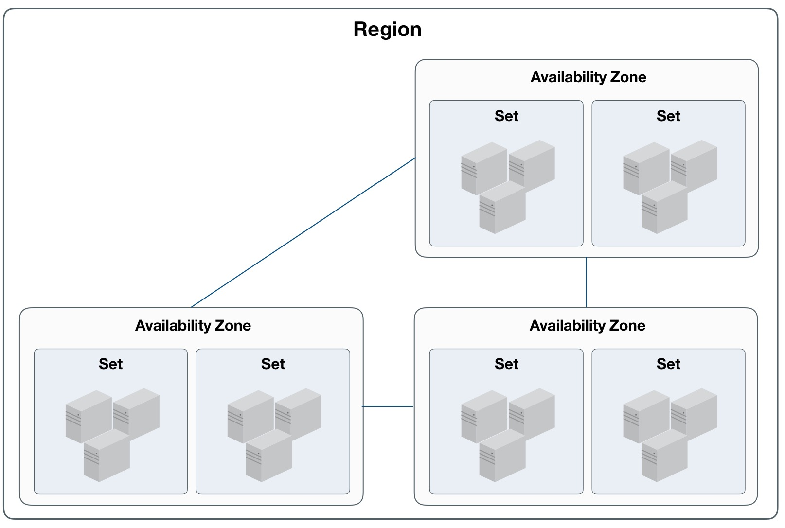

* 一个可用区可包含多个集群，云资源支持跨集群调度；
* 一个集群至少由 3 台服务器节点组成，集群内服务器须具有相同的 CPU/内存、磁盘类型及操作系统；
  * 服务器为计算&存储融合节点时，不同磁盘类型的节点划分为一个集群，如 SSD 计算节点集群；
  * 服务器为独立存储节点时，不同磁盘类型的节点划分为一个集群，如 SATA 存储节点集群；
* 通常一个集群的服务器建议接入同一组接入交换机，业务数据网络仅在集群内进行传输；
* 若采用独立存储节点，可将其与计算节点划分为一个集群进行磁盘挂载；
* 虚拟机仅支持跨集群挂载分布式块存储设备，用于数据存储。

集群中独立存储节点可直接挂载并使用磁盘阵列柜中的磁盘作为分布式存储系统的存储池，同时支持挂载 NFS 、NAS 等多种类型存储。

### 3.3.4 业务组

业务组是 UCloudStack 云平台为用户提供的业务资源分类的标识，通过业务组可以有效的对不同业务的虚拟资源进行分类。

* 支持通过业务组进行计费帐单筛选和统计；
* 每个虚拟资源都必须属于一个业务组，每个业务组可包含多种虚拟资源；
* 业务组可虚拟机进行业务分类，同时支持通过业务组进行均衡部署；
  * 将多个虚拟机加入同一个业务组，智能调度系统自动将虚拟机打散部署于不同的物理服务器上；
  * 提供统一服务的业务虚拟机加入同一个业务组打散部署后，可有效提高服务的可用性；
* 支持创建业务组、删除业务组、移除资源、移入资源等生命周期管理；
* 将虚拟机从业务组移除后，智能调度系统将会在发生故障时，重新将虚拟机调度至健壮的服务器节点。

## 3.4 虚拟机

虚拟机是 UCloudStack 云平台的核心服务，提供可随时扩展的计算能力服务，包括 CPU 、内存、操作系统等最基础的计算组件，并与网络、磁盘、安全等服务结合提供完整的计算环境。通过与负载均衡、数据库、缓存、对象存储等服务结合共同构建 IT 架构。

* UCloudStack 云平台通过 KVM ( Kernel-based Virtual Machine ) 将物理服务器计算资源虚拟化，为虚拟机提供计算资源；
* 一台虚拟机的计算资源只能位于一台物理服务器上，当物理服务器负载较高或故障时，自动迁移至其它健康的物理服务器；
* 虚拟机计算能力通过虚拟 CPU ( vCPU ) 和虚拟内存表示，存储能力通过云存储容量和性能体现；
* 虚拟机管理程序通过控制 vCPU、内存及磁盘的 QoS ，用于支持虚拟机资源隔离，保证多台虚拟机在同一台物理服务器上互不影响。

虚拟机是云平台用户部署并运行应用服务的基础环境，与物理计算机的使用方式相同，提供创建、关机、断电、开机、重置密码、重装系统、升降级等完全生命周期功能；支持 Linux、Windows 等不同的操作系统，并可通过 VNC 、SSH 等方式进行访问和管理，拥有虚拟机的完全控制权限。虚拟机运行涉及资源及关联关系如下：


如图所示，实例规格、镜像、VPC 网络是运行虚拟机必须指定的基础资源，即指定虚拟机的 CPU 内存、操作系统、虚拟网卡及 IP 信息。在虚拟机基础之上，可绑定云硬盘、弹性IP 及安全组，为虚拟机提供数据盘、公网 IP 及网络防火墙，保证虚拟机应用程序的数据存储和网络安全。

### 3.4.1 实例规格

实例规格是对虚拟机 CPU 内存的配置定义，为虚拟机提供计算能力。CPU 和内存是虚拟机的基础属性，需配合镜像、VPC 网络、云硬盘、安全组及密钥，提供一台完整能力的虚拟机。

* 默认提供 1C2G 、2C4G 、4C8G 、8C16G 、16C32G 等实例规格；
* 支持自定义实例规格，提供多种 CPU 内存组合，以满足不同应用规模和场景的负载要求；
* 支持升降级虚拟机 CPU 和内存配置，可通过更改实例规格进行调整；
* 实例规格变更后，需重启虚拟机生效；
* 实例规格与虚拟机生命周期一致，虚拟机被销毁时，实例规格即被释放。

UCloudStack 提供虚拟机实例规格全生命周期的管理和维护，包括创建、删除、更新、查看。

### 3.4.2 镜像

镜像（ Image ）是虚拟机实例运行环境的模板，通常包括操作系统、预装应用程序及相关配置等。虚拟机管理程序通过指定的镜像模板作为启动实例的系统盘，生命周期与虚拟机一致，虚拟机被销毁时，系统盘即被销毁。平台虚拟机镜像分为基础镜像和自制镜像。

#### 3.4.2.1 基础镜像

基础镜像是由 UCloudStack 官方提供，包括多发行版 Centos 、Ubuntu 及 Windows 等原生操作系统。
* 操作系统版本包括 Centos 6.5 64 、Centos 7.4 64 、Windows 2008r2 64 、Windows 2012r2 64 、Ubuntu 14.04 64 、Ubuntu 16.04 64 ；
* 基础镜像均经过系统化测试，并定期更新维护，确保镜像安全稳定的运行和使用；
* 基础镜像为系统默认提供的镜像，仅支持查看及通过镜像运行虚拟机，不支持修改、创建、删除；
* Linux 镜像默认系统盘为 20GB ，Windows 镜像默认系统盘为 40GB ，支持系统盘容量扩容。

支持重装系统，即更换虚拟机镜像，Linux 虚拟机仅支持更换 Centos 和 Ubuntu 操作系统，Windows 虚拟机仅支持更换 Windows 其它版本的操作系统；

> **Windows 操作系统镜像为微软官方提供，需自行购买 Lincense 激活。**

#### 3.4.2.2 自制镜像

自制镜像由云平台用户通过虚拟机自行导出的自有镜像，可用于创建虚拟机，仅用户本人有权限查看和管理。
* 支持虚拟机在线和离线状态下自制镜像，在线状态下自制的镜像无法保存内存中的数据；
* 支持通过虚拟机自制镜像、从镜像创建主机、上线、下线、修改名称、查看镜像及删除镜像等生命周期管理；
* 自制镜像整个生命周期包括制作中、可用、下线中、不可用、上线中、已删除等状态，状态流转如下图所示：

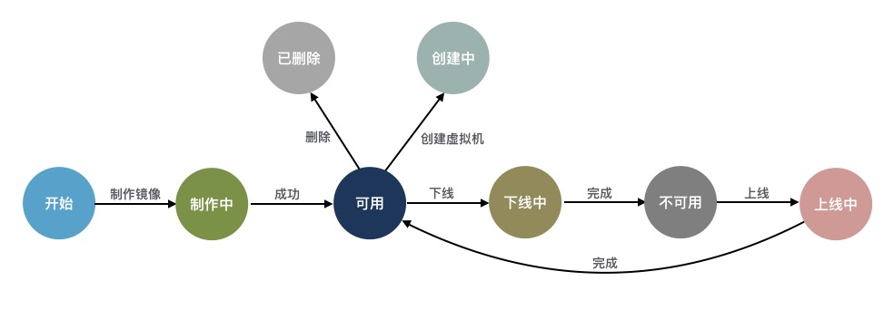

#### 3.4.2.3 镜像存储

基础镜像和用户自制镜像默认均存储于分布式存储系统，保证性能的同时通过三副本保证数据安全。

* 镜像支持 RAW 格式，可将 QCOW2 、VMDK 等格式镜像转换为 RAW 格式文件，用于 V2V 迁移场景；
* 所有镜像均存储于分布式存储系统，即镜像文件会分布在底层计算存储超融合节点磁盘上；
* 若为独立存储节点，则分布存储于独立存储节点的所有磁盘上；
* 镜像默认在多可用区级别进行同步，不支持跨地域同步，即通过在一个地域中虚拟机导出的镜像会自动同步至本地域所有可用区中；
* 一个地域的镜像只能创建本地域的虚拟机，不支持跨 Region 镜像创建虚拟机。

### 3.4.3 虚拟网卡

虚拟网卡（ Virtual NIC ）是虚拟机与外部通信的虚拟网络设备，创建虚拟机时随 VPC 网络默认创建的虚拟网卡。虚拟网卡与虚拟机的生命周期一致，无法进行分离，虚拟机被被销毁时，虚拟网卡即被销毁。有关 VPC 网络详见 [VPC 网络](#_36-私有网络) 。

* 虚拟网卡基于 Virtio 实现，QEMU 通过 API 对外提供一组 Tun/Tap 模拟设备，将虚拟机的网络桥接至宿主机网卡，通过 OVS 与其它虚拟网络进行通信；
* 每个虚拟机默认会生成 2 块虚拟网卡，分别承载虚拟机内外网通信；
* 在虚拟机启动时，根据选择的 VPC 子网自动发起 DHCP 请求以获取内网 IP 地址，并将网络信息配置在一块虚拟网卡上，为虚拟机提供内网访问；
* 虚拟机启动后，可申请公网 IP （外网 IP）绑定至虚拟机，提供互联网访问服务；
  * 绑定的 外网 IP 会自动将公网 IP 信息配置在另一块虚拟网卡上，为虚拟机提供外网访问；
  * 一个虚拟机仅支持绑定一个 外网 IP ，详见 [外网 IP](#_37-外网-IP) 。
* 不支持修改虚拟网卡的 IP 地址，手动修改的 IP 地址将无法生效；
* 每块虚拟网卡支持绑定一个安全组，提供网卡级别安全控制，详见[安全组](#_345-安全组) ；
* 支持虚拟网卡 QoS 控制，提供自定义设置虚拟网卡的出/入口带宽；

平台默认提供 2 块虚拟网卡，若业务有 2 块以上网卡需求可通过绑定 [弹性网卡](#_344-弹性网卡) ，为虚拟机提供多网络服务。

<span id="_344-弹性网卡"></span>

### 3.4.4 弹性网卡

弹性网卡（ Elastic Network Interface, ENI ）是一种可随时附加到虚拟机的弹性网络接口，支持绑定和解绑，可在多个虚拟机间灵活迁移，为虚拟机提供高可用集群搭建能力，同时可实现精细化网络管理及廉价故障转移方案。


* 弹性网卡与虚拟网卡的实现方式相同，区别在于弹性网卡的具有独立的生命周期；
* 弹性网卡支持绑定和解绑，可在多个虚拟机间自由迁移；
* 虚拟机被销毁时，弹性网卡将自动解绑，可绑定至另一台虚拟机使用；
* 一块弹性网卡仅支持绑定至一个虚拟机，一个虚拟机最多可绑定 **6** 块弹性网卡；
* 支持弹性网卡 QoS 控制，提供自定义设置弹性网卡的出/入口带宽；

弹性网卡具有可用区、VPC、子网、IP 及安全组等属性，支持创建、绑定、解绑、绑定安全组、解绑安全组及删除弹性网卡等生命周期管理，有关 VPC 网络详见 [VPC 网络](#_36-私有网络) 。

* 可用区：弹性网卡仅支持绑定至相同可用区的虚拟机；
* 子网：一块弹性网卡仅支持加入至一个子网，创建后无法修改 VPC 和子网；
* IP地址：支持手动指定和 DHCP 自动获取弹性网卡在子网内的 IP 地址，一块弹性网卡仅支持 1 个私有 IP 地址，创建后无法修改 IP 地址；
* 安全组：每块弹性网卡支持绑定一个安全组，提供网卡级别安全控制，详见[安全组](#_345-安全组) ；
* MAC 地址：每块弹性网卡拥有全局唯一 MAC 地址；

弹性网卡整个生命周期包括创建中、未绑定、绑定中、已绑定、解绑中、已删除等状态，状态流转如下图所示：


<span id="_345-安全组"></span>

### 3.4.5 安全组

安全组（ Security Group ）是一种类似 [IPTABLES](https://en.wikipedia.org/wiki/Iptables) 的虚拟防火墙，提供出入双方向流量访问控制规则，定义哪些网络或协议能访问资源，用于限制虚拟资源的网络访问流量，为云平台提供必要的安全保障。

#### 3.4.5.1 实现机制

UCloudStack 安全组基于 Linux Netfilter 子系统，通过在 [OVS]( http://www.openvswitch.org/) 流表中添加流表规则实现，需开启宿主机 IPV4 包转发功能；每增加一条访问控制规则会根据网卡作为匹配条件，生成一条流表规则，用于控制进入 OVS 的流量，保证虚拟资源的网络安全。安全组仅可作用于**同一个 Region** 内具有相同安全需求的虚拟机、负载均衡及 NAT 网关，工作原理如下图所示：


安全组具有独立的生命周期，可以将安全组与虚拟机、负载均衡、NAT 网关绑定在一起，提供安全访问控制。与之绑定的虚拟资源销毁后，安全组将自动解绑。

* 安全组对虚拟机的安全防护针对的是一块网卡，即安全组是与虚拟网卡/弹性网卡绑定在一起，分别设置访问控制规则，限制每块网卡的出入网络流量；
* 如安全组原理图所示，安全组与提供 外网 IP 服务的虚拟网卡绑定，通过添加出入站规则，对虚拟机互联网的访问流量进行过滤；
* 安全组与提供私有网络服务的虚拟网卡或弹性网卡绑定，通过添加出入站规则，控制虚拟机间及弹性网卡间网络访问；
* 安全组与公网类型的负载均衡关联，通过添加出入站规则，可对进出公网负载均衡的 外网 IP 流量进行限制和过滤，保证公网负载均衡器的安全；
* 安全组与 NAT 网关绑定，通过添加出入站规则，可对进入 NAT 网关的流量进行限制，保证 NAT 网关的可靠性和安全性；
* 一个安全组支持同时绑定至多块弹性网卡、NAT 网关及负载均衡实例；
* 一块虚拟网卡或弹性网卡仅支持绑定一个安全组；
* 一个外网负载均衡实例仅支持绑定一个安全组，一个 NAT 网关实例仅支持绑定一个安全组；

创建虚拟机时必须指定安全组，每个虚拟机至少属于一个安全组，支持随时修改安全组的出入站规则，新规则生成时立即生效，可根据需求调整安全组出/入方向的规则。支持安全组全生命周期管理，包括安全组创建、修改、删除、绑定资源、解绑资源及安全组规则的创建、修改、删除等生命周期管理。

#### 3.4.5.2 安全组规则

安全组规则可控制允许到达安全组关联资源的入站流量及出站流量，支持对 TCP、UPD、ICMP、GRE 等协议数据包进行有效过滤和控制。每个安全组支持配置多条规则，根据优先级对资源访问依次生效。规则为空时，安全组将默认接受 ( All Accept ) 所有流量；规则不为空时，除已生成的规则外，默认拒绝其它访问流量。

每条安全组规则由协议、端口、地址、动作、优先级及方向六个元素组成：

* 协议：支持 TCP、UDP、ICMP、GRE 四种协议数据包过滤；
  * 可选择 ALL 指定所有协议，ALL TCP 选择所有 TCP 端口，ALL UDP 选择所有 UDP 端口；
  * 支持快捷协议指定，如 FTP、HTTP、HTTPS、PING、OpenVPN、PPTP、RDP、SSH 等；
* 端口：源地址所访问的本地虚拟资源的 TCP/IP 端口；
  * TCP 和 UDP 协议的端口范围为 1~65535 ；
  * ICMP 和 GRE 不支持配置端口；
* 地址：访问云平台资源的网络数据包来源地址或目标地址；
  * 支持 CIDR 表示法的 IP 地址及网段，如 `120.132.69.216` 或 `0.0.0.0/0` ；
  * 若规则的方向是入站规则，则地址代表数据包的来源地址；
  * 若规则的方向是出站规则，则地址代表数据包的目标地址；
* 动作：安全组生效时，对数据包的处理策略，包括 “接受” 和 “拒绝” 两种动作；
* 优先级：安全组内规则的生效顺序，包括高、中、低三档规则；
  * 安全组按照优先级高低依次生效，优先生效优先级高的规则；
  * 同优先级的规则，优先生效精确规则；
* 方向：安全组规则所对应的流量方向，包括出站流量和入站流量；

**UCloudStack 安全组支持数据流表状态，规则允许某个请求通信的同时，返回数据流会被自动允许，不受任何规则影响。即安全组规则仅对新建连接生效，对已经建立的链接默认允许双向通信。**如一条入方向规则允许任意地址通过互联网访问虚拟机弹性 IP 的 80 端口，则访问虚拟机 80 端口的返回数据流（出站流量）会被自动允许，无需为该请求添加出方向允许规则。

> 注：通常建议设置简洁的安全组规则，可有效减少网络故障；

### 3.4.6 SSH 密钥

为保证虚拟机安全性，Linux 虚拟机提供密码和 SSH 密钥两种登录方式。SSH 密钥是通过 RSA 加密算法生成的一对密钥，分别为**公钥**和**私钥**。公钥是对外界公开的密钥，私钥是自己保留的密钥，传输数据时通过公钥加密的数据，只能用私钥解密并查看。通过 SSH 密钥与 Linux 虚拟机进行连接，相对密码登录更加安全。

UCloudStack 支持将用户生成的公钥上传至已绑定的虚拟机，并通过 SSH 密钥登录虚拟机，具体流程如下：

1. 用户将自己本地生成的 SSH 公钥上传至云平台，绑定公钥到虚拟机后，在本地通过 SSH 登录虚拟机；
2. SSH 客户端向虚拟机发出登录请求，虚拟机收到请求后，查找并读取用户有效的公钥信息；
3. 虚拟机验证公钥的有效性后生成一串随机数，使用公钥对其加密后返回给 SSH 客户端；
4. 客户端使用私钥对返回的加密数据进行解密，若解密成功，则将解密后的原文信息重新发送给虚拟机；
5. 虚拟机对 SSH 客户端返回信息进行比对，若比对成功，表示认证通过，SSH 客户端可以登录虚拟机；

云平台仅存储用户上传的公钥数据，拥有私钥的客户端才可以登录虚拟机，为保证虚拟机安全，需考虑私钥存储位置的安全性。SSH 密钥拥有独立的生命周期，包括创建、绑定、解绑、删除等功能管理，虚拟机销毁时将自动解除已绑定的 SSH 密钥。

* SSH 密钥具有 Region 属性，仅支持绑定至同一个 Region 内的虚拟机；
* 一个SSH 密钥可同时绑定至多个虚拟机，即一个 SSH 密钥可同时登录多个虚拟机；
* 一个虚拟机可同时绑多个密钥，即支持多个 SSH 密钥客户端可同时登录一个虚拟机；
* 绑定 SSH 密钥后，可同时使用 SSH 密钥和密码登录虚拟机；
* 支持修改 SSH 密钥的名称及备注，用于标识不同的 SSH 公有密钥；

### 3.4.7 VNC 登录

VNC（ Virtual Network Console ）是 UCloudStack 为用户提供的一种通过 WEB 浏览器连接虚拟机的登录方式，适应于无法通过远程登录客户端（如 SecureCRT、PuTTY 等）连接虚拟机的场景。通过 VNC 登录连到虚拟机，可以查看虚拟机完整启动流程，并可以像 SSH 及 远程桌面一样管理虚拟机操作系统及界面，支持发送各种操作系统管理指令，如  `CTRL+ALT+DELETE` 及 `CTRL+C` 、`CTRL+V` 等。

### 3.4.8 生命周期        

UCloudStack 为虚拟机提供完整生命周期管理，用户可自助创建虚拟机，并对虚拟机进行关机、断电、开机、重置密码、重装系统、升降级配置、制作镜像、修改业务组、修改名称/备注、修改告警模板及删除等基本操作；同时支持与虚拟机相关联资源的绑定和解绑管理，包括弹性网卡、云硬盘、 外网  IP 、安全组、 SSH 密钥等。

* 关机是对虚拟机操作系统的正常关机，断电是将虚拟机强制关机；
* 重装系统即更换虚拟机镜像，Linux 仅支持更换 Linux 类型镜像，Windows 仅支持更换 Windows 类型镜像；
* 升降级配置是对虚拟机的规格配置进行升级或降级的变更操作；
* 销毁虚拟机会自动删除实例规格、系统盘及默认虚拟网卡，同时会自动解绑相关联的虚拟资源；
* 一个虚拟机支持绑定多个云硬盘、弹性网卡、安全组及 SSH 密钥；
* 一个虚拟机仅支持绑定一个 外网 IP 资源；

UCloudStack 虚拟机完整生命周期包括启动中、运行、关机中、断电中、关机、启动中、重装中、删除中及已删除等资源状态，各状态流转如下图所示：

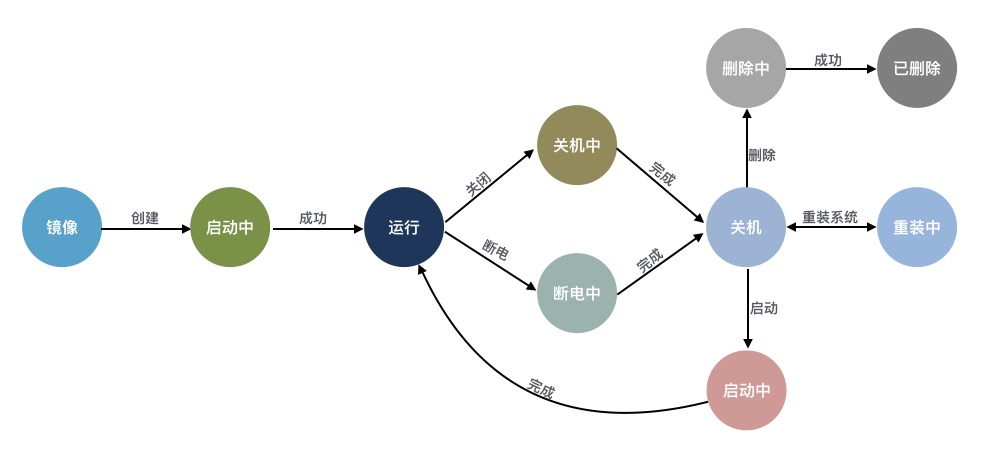

## 3.5 云硬盘

### 3.5.1 云硬盘概述

云硬盘是一种基于分布式存储系统为虚拟机提供持久化存储空间的块设备。具有独立的生命周期，支持随意绑定/解绑至多个虚拟机使用，并能够在存储空间不足时对云硬盘进行扩容，基于网络分布式访问，为云主机提供高安全、高可靠、高性能及可扩展的数据磁盘。


分布式存储系统为虚拟机系统盘、镜像及云硬盘提供统一存储及管理，提高虚拟机与系统盘、云硬盘的数据传输入效率，实现虚拟机快速创建及恢复，并支持系统盘和云硬盘的在线快速扩容和迁移。在本地可通过快照技术，对云硬盘及数据进行快照备份，在数据丢失或损坏时，可通过快照快速恢复数据，包括数据库数据、应用数据及文件目录数据等，可实现分钟级恢复。

### 3.5.2 功能与特性

云平台为租户提供普通和高性能两种类型的云硬盘，普通云硬盘使用 SATA/SAS 磁盘作为存储介质，性能型云硬盘使用 SSD/NVME 磁盘作为存储介质。普通云硬盘和高性能云硬盘均通过条带化、PG映射及三副本机制进行存储，并在分布式存储系统的基础之上通过块存储系统接口为用户提供云硬盘资源及全生命周期管理。

* 云硬盘容量是由统一存储的从存储集群容量中分配的，所有云硬盘共享整个分布式存储池的容量及性能；
* 支持云硬盘创建、挂载、卸载、磁盘扩容、删除等生命周期管理；
* 支持在线和离线的方式扩容磁盘容量，磁盘扩容后需要在虚拟机的操作系统进行磁盘容量的扩容操作；
* 为保证数据安全，目前云硬盘不支持磁盘缩容；
* 云硬盘最小支持 10G 的容量，步长为 10GB ，可自定义控制单块云硬盘的最大容量；
* 云硬盘具有独立的生命周期，可自由挂载到任意虚拟机上 ，支持秒级创建与删除云硬盘； 
* 每个虚拟机支持挂载多个云硬盘，虚拟机删除后，已挂载至虚拟机的云硬盘将自动卸载，可重新挂载虚拟机；
* 单块云硬盘同时仅能挂载一台虚拟机；
* 支持对全局分布式存储及整体云硬盘进行 I/O 的 QoS 限制；
* 支持对每一块云硬盘的 QoS 进行配置，可根据不同业务模式调整磁盘的性能，以平衡平台整体性能；

高性能型云硬盘的性能与容量的大小成线性关系，容量越大，提供的 IO 性能越高，如果对IO性能有强烈需求，可考虑扩容性能型云硬盘。UCloudStack 云硬盘完整生命周期包括创建中、可用、挂载中、已挂载、卸载中、扩容中、已删除等资源状态，各状态流转如下图所示：


### 3.5.3 应用场景

* 普通云硬盘
  * 适用于对容量要求较高且数据不被经常访问或 I/O 负载低的应用场景；
  * 需要低成本并且有随机读写 I/O 的应用环境，如大型视频、音乐、离线文档存储等；
* 高性能云硬盘
  * 适用于 I/O 负载高且数据经常被读写的应用场景；
  * 中大型关系数据库；
  * 中大型开发测试环境；
  * 中大型实时响应服务类环境；

<span id="_36-私有网络"></span>

## 3.6 私有网络

### 3.6.1 VPC 概述

UCloudStack 通过软件定义网络 （ SDN ）对传统数据中心物理网络进行虚拟化，采用 OVS 作为虚拟交换机，VXLAN 隧道作为 OverLay 网络隔离手段，通过三层协议封装二层协议，用于定义虚拟私有网络 VPC 及不同虚拟机 IP 地址之间数据包的封装和转发。

私有网络（ VPC ——Virtual Private Cloud ）是一个属于用户的、逻辑隔离的二层网络广播域环境。在一个私有网络内，用户可以构建并管理多个三层网络，即子网（ Subnet ），包括网络拓扑、IP 网段、IP 地址、网关等虚拟资源作为租户虚拟机业务的网络通信载体。

私有网络 VPC 是虚拟化网络的核心，为云平台虚拟机提供内网服务，包括网络广播域、子网（IP 网段）、IP 地址等，是所有 NVF 虚拟网络功能的基础。私有网络是子网的容器，不同私有网络之间是绝对隔离的，保证网络的隔离性和安全性。

用户可通过将虚拟机、负载均衡、弹性网卡、NAT 网卡等虚拟资源加入至私有网络的子网中，提供类似传统数据中心交换机的功能，支持自定义规划网络，并可通过安全组实现同 VPC 子网间的安全防护。

> 可通过专线、VPN、混合云物理 IP 接入等方式将 VPC 与传统数据中心组成一个按需定制的混合云网络环境。

VPC 网络具有地域属性，每个私有网络只能属于一个地域，地域间网络完全隔离，资源默认内网不通；同时租户内和租户间 VPC 网络默认不通，从不同维度保证租户网络和资源的隔离性。

### 3.6.2 VPC 逻辑结构

一个 VPC 网络主要由私有网络网段和子网两部分组成，如下图所示：

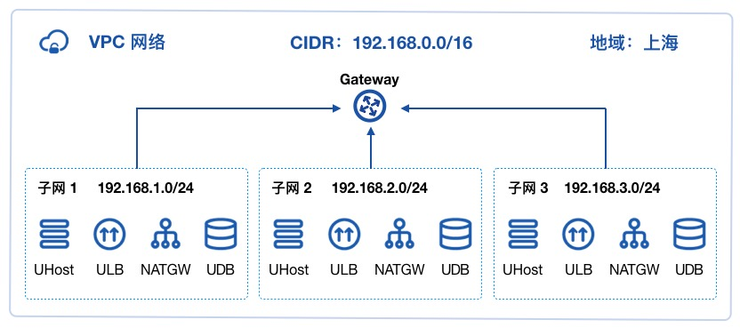

**（1）私有网络网段**

VPC 网络所属的 CIDR  网段，作为 VPC 隔离网络的私网网段。关于 CIDR 的相关信息，详见 [CIDR](https://en.wikipedia.org/wiki/Classless_Inter-Domain_Routing) 。创建 VPC 网络需指定私有网段，UCloudStack 私有网络 CIDR 支持的网段范围如下: 

| 网段           | 掩码范围 | IP 地址范围                   |
| -------------- | -------- | ----------------------------- |
| 10.0.0.0/8     | 8 ~ 29   | 10.0.0.0 - 10.255.255.255     |
| 172.16.0.0/12  | 12 ~ 29  | 172.16.0.0 - 172.31.255.255   |
| 192.168.0.0/16 | 16 ~ 29  | 192.168.0.0 - 192.168.255.255 |

!> 由于 DHCP 及相关服务需占用 IP 地址，私有网络 CIDR 网段不支持 `30` 位掩码的私有网段。

**（2）子网**

子网（ Subnet ）是 VPC 私有网络的基础网络地址空间，用于虚拟资源间内网连接。

* 一个私有网络至少由一个子网组成，子网的 CIDR 必须在 VPC 的 CIDR 网段内；
* 同一私有网络内子网间通过`公共网关`连接，资源默认内网互通，可部署虚拟机、负载均衡、NAT 网关等；
* 子网内虚拟资源支持跨可用区部署，实现跨可用区故障隔离，提高资源及应用的灾备能力及可用性；
* 同一个私有网络内子网间默认通过公共网关进行互通，
* 子网 CIDR 网段拔码最小为 `29` 位，不支持 `30` 、`32` 位掩码的子网网段； 
* 每个子网中，使用第一个可用 IP 地址作为网关，如 `192.168.1.0/24` 的网关地址是 `192.168.1.1` 。

> 当子网中存在虚拟资源时，不允许销毁子网及私有网络资源。

### 3.6.3 VPC 连接

UCloudStack 云平台对常用网络设备均进行软件定义及组件抽像，通过将 VPC 网络与虚拟机、弹性网卡、外网 IP、安全组、NAT 网关、负载均衡、VPC 互通、VPN、专线、托管网关等组件连接，可快速构建和配置繁杂的网络环境及混合云场景，如下图所示：


* 虚拟机的弹性网卡加入不同的 VPC 网络及子网，实现精细化网络管理及廉价故障转移方案。
* 虚拟机弹性网卡可直接绑定 外网 IP 实现 Internet 访问，并通过安全组保障网络安全。
* 将虚拟机弹性网卡和 UDB 网卡加入同一个 VPC 网络，满足业务应用和数据库连通场景。
* 将多台虚拟机加入同一个子网，并通过 ULB 连接，提供虚拟机内网负载均衡服务，如子网 2 。
* 将多台虚拟机加入同一个子网，并通过 ULB 及 外网 IP 连接，提供外网负载均衡服务，如子网 4 。
* 将多台虚拟机加入同一个子网，并通过 NATGW 及 外网 IP 连接，共享 外网 IP 访问 Internet ，如子网 3 。
* 通过 VPC 互通服务可实现不同 VPC 网络间资源内网互通。
* 采用 VPN 和专线将私有网络与本地 IDC 数据中心及第三方云平台连通，实现互联网安全访问资源。
* 混合云网关（物理 IP）服务可将私有网络中虚拟机与本地 IDC 数据中心内网打通，实现内网服务混合接入。
* 将安全组服务与弹性网卡绑定，通过安全组规则多维度保障私有网络及虚拟资源的安全。

### 3.6.4 功能与特性

平台 VPC 网络提供基于租户控制台和 API 提供隔离网络环境、自定义子网、子网通信及安全防护等功能，并可结合硬件及 DPDK 等技术特性提供高性能的虚拟网络。

* 隔离的网络环境

  私有网络基于 [OVS](http://www.openvswitch.org/)（ Open vSwitch）组件，通过 [VXLAN](https://tools.ietf.org/html/rfc7348) 隧道封装技术实现隔离的虚拟网络。每一个 VPC 网络对应一个 VXLAN 隧道号，作为全局唯一网络标识符，为租户提供一张独立且完全隔离的二层网络，可通过在私有网络中划分多个子网作为虚拟资源的通信载体，用于连通多个虚拟资源。不同的 VPC 网络间完全隔离，无法直接通信。

* 自定义子网

  支持在一个 VPC 网络内进行三层网络规划，即划分一个或多个子网。提供自定义 IP 网段范围、可用 IP 网段及默认网关，可在子网中通过虚拟机部署应用程序和服务。支持在子网中增加多个弹性网卡，分别指定子网中的 IP 地址，并绑定至部署应用程序的虚拟机，用于精细化管理应用服务的网络访问。

* 子网通信

  每一个子网都属于一个广播域，VPC 网络默认提供网关服务，同一个 VPC 内不同子网通过网关进行通信。

* 安全防护

  云平台提供内网安全组和外网防火墙，通过协议、端口为虚拟资源提供多维度安全访问控制，同时基于虚拟网卡及虚拟实例的网络流量进行上下行的 QoS 控制，全方位提高 VPC 网络的安全性。安全组为有状态安全层，仅需设置单方向安全规则，即可控制并过滤进出子网及弹性 外网 IP 的数据流量。

* 高性能虚拟网络

  SDN 网络分布式部署于所有计算节点，节点间通过 10GE 冗余链路进行通信，并通过所有计算节点负载内网流量，为云平台提供高可靠及高性能的虚拟网络。同时 UCloudStack 支持对接并兼容 [DPDK](https://www.dpdk.org/ ) ，通过 DPDK 对数据包的转发处理，理论性能接近物理 10GE 的网卡性能，实现超高性能的 VPC 虚拟网络。

平台支持租户和子帐号创建、修改、删除私有网络和子网，并提供私有网络的操作审计日志。用户创建虚拟机、NAT 网关、负载均衡等虚拟资源时可指定需加入的 VPC 网络和子网。VPC 网络具有地域、网段、子网数量等属性，分别代表 VPC 网络所属地域、VPC 网络的 CIDR 网段及已规划的子网数量。

> UCloudStack 为每个租户和子帐号提供默认的 VPC 网络和默认子网，每个租户的都可分配一定的 VPC 配额，可通过云平台管理员在管理控制台进行配置。

 <span id="_37-外网-IP"></span>

## 3.7 外网 IP

外网弹性 IP（ Elastic IP Address ，简称 EIP ），是 UCloudStack 为用户的虚拟机、NAT 网关及负载均衡等虚拟资源提供的互联网外网 IP 地址，可通 EIP 资源，虚拟机、NAT 网关、负载均衡直接提供互联网外网服务，同时互联网用户也可通过 IP 地址直接访问虚拟机、NAT 网关及负载均衡资源。

EIP 资源支持独立申请和拥有外网 IP 地址资源，用户可通过控制台或 API 申请 EIP ，并将 EIP 绑定至虚拟机、负载均衡或 NAT 网关上，为业务提供互联网通道。

EIP 资源位于 UCloudStack 公网网关上并被配置在平台数据库中，SDN 控制器通过调用数据库中可用的公网 IP 地址，直接绑定在所需的虚拟资源网卡上，如直接绑定至虚拟机中用于提供外网的默认的网卡上，因此绑定了 EIP 的虚拟机可以直接使用这个 IP 地址进行公网通信。

- EIP 具有弹性绑定的特性，支持随时绑定至所需的资源上，在不需要时，可随时解绑并绑定至其它资源。
- 支持配置公网 IP 地址的带宽上限，可根据业务需要修改 IP 地址的峰值带宽并即时生效。
- EIP 具有地域属性，被绑定的资源必须与 EIP 在同一个地域才可进行绑定并使用。

外网 IP 为浮动 IP ，可随故障虚拟机恢复漂移到健康节点，继续为虚拟机或其它虚拟资源提供外网互联网服务。如下图所示：


当一台虚拟机所在的物理主机发生故障时，智能调度系统会自动对故障主机上的虚拟机进行宕机迁移操作，即故障虚拟机会在其它健康的主机上重新拉起并提供正常业务服务。若虚拟绑定了外网 IP 地址，智能调度系统会将外网 IP 地址及相关流表信息一起漂移至虚拟迁移后所在的物理主机，并保证网络通信可达。

## 3.8 NAT 网关

### 3.8.1 产品概述

NAT 网关（ NAT Gateway ）是一种类似 [NAT](https://zh.wikipedia.org/wiki/网络地址转换) 网络地址转换协议的 VPC 网关，为云平台资源提供 SNAT 和 DNAT 代理，支持外网和物理网两种网络地址转换能力，并支持普通和白名单两种资源网络出口模式。

用户可通过 NAT 网关让 VPC 子网中未绑定公网 IP 或物理 IP 的虚拟机访问外网或物理网，同时可配置端口转发规则使虚拟机对外提供服务。

- NAT 网关作为一个虚拟网关设备，需要绑定外网 IP 或物理 IP 作为 NAT 网关的默认统一出口；
- 支持普通和白名单两种网络出口模式；
  - 普通模式：NAT 网关指定子网中所有未绑定外网 IP 或物理 IP 的云资源，均可通过 NAT 网关访问外网或物理网；
  - 白名单模式：NAT 网关指定子网中且在白名单中定义的云资源，才可通过 NAT 网关访问外网或物理网；
  - 白名单资源：支持白名单资源添加和删除管理；
- NAT 网关支持 SNAT 能力： 
  - NAT 网关支持未关联弹性 IP 地址的虚拟机通过 NAT 网关出外网；
  - NAT 网关支持未关联物理 IP 地址的虚拟机通过 NAT 网关访问物理网络；
- NAT 网关支持 DNAT 能力；
  - NAT 网关支持配置端口转发，将 VPC 内的云资源内网端口映射到 NAT 网关，对外网或物理网提供服务；
  - 支持 TCP 和 UDP 两种协议的端口转发，支持对端口转发规则进行生命周期管理；
- NAT 网关支持同地域同 VPC 下多子网虚拟资源的地址转发服务；
- 支持查看并配置 NAT 网关的流量监控信息、报警及操作日志；
- 支持双机热备、自动容灾，单机出故障自动切换，业务无感知，为业务稳定运行提供保障。

### 3.8.2 应用场景

用户在 UCloudStack 平台使用虚拟机部署应用服务时，有访问外网或通过外网访问虚拟机的应用场景，通常我们会在每一台虚拟机上绑定一个外网 IP 或物理 IP 用于和互联网或物理网络进行通信。真实环境和案例中，可能无法分配足够的公网 IP 或物理 IP ，即使公网 IP 足够也需要在每一台需要访问外网的虚拟机绑定公网 IP。NAT 网关服务的应用场景如下：

- 共享 EIP ：通过 SNAT 代理，使多台 VPC 内网虚拟机共享 1 个 公网 IP 地址访问公网；
- 共享物理 IP：通过 SNAT 代理，使多台 VPC 内网虚拟机共享 1 个 物理 IP 地址访问物理网络；
- 屏蔽真实 IP ：通过 SNAT 代理，多台 VPC 内网虚拟机使用代理 IP 地址通信，自动屏蔽真实 IP 地址；
- VPC 内网虚拟机提供公网服务：通过 DNAT 代理，配置 IP 及端口转发，对外提供业务服务；
- VPC 内网虚拟机提供物理网络服务：通过 DNAT 代理，配置 IP 及端口转发，对物理网络区域的主机提供业务服务。

### 3.8.3 逻辑架构

UCloudStack 平台产品服务底层资源统一，NAT 网关产品通过“虚拟机”进行 NAT 路由搭建，封装高可用的 NAT 网关服务为租户虚拟机提供 SNAT 和 DNAT 代理。

在产品层面，租户通过申请一个 NAT 网关，指定 NAT 网关可允许通信的子网，通过绑定【外网 IP】或【物理 IP】使多子网下虚拟机与互联网/物理网进行通信，具体逻辑架构图如下：

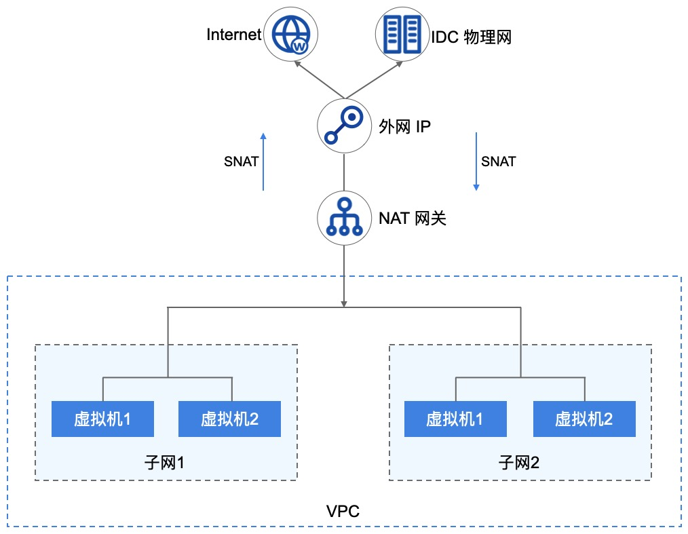

- 平台支持同 VPC 多子网虚拟机使用 NAT 网关访问外网或物理网；
- 当多个子网中未绑定外网 IP/物理 IP 的虚拟机关联 NAT 网关时，平台将自动在虚拟机中下发访问外网或物理网的路由；
- 虚拟机通过下发的路由，将访问公网或物理网的数据通过 NAT 网关透传至已绑定的【公网 IP】或【物理 IP】；
- 透传至公网 IP 或物理 IP 的数据通过平台 OVS 及物理网卡将数据包发送至物理交换机，完成数据 SNAT 的通信；
- 当外网或物理网需要访问 VPC 中的虚拟机服务时，可通过 NAT 网关端口转发，使互联网或物理网通过 NAT 网关已绑定的 IP+端口 访问 VPC 内网服务；

NAT 网关支持白名单模式，即仅支持多子网中已添加至白名单的虚拟机通过 NAT 网关提供 SNAT 和 DNAT 的服务。

### 3.8.4 使用流程

在使用 NAT 网关服务前，需根据业务需求规划 NAT 网关的 VPC 网络及外网 IP/物理 IP 网络，并根据业务需求将多台虚拟机绑定至 NAT 网关。具体流程如下：

1. 租户根据需求创建 VPC 和 子网，并在多个子网中创建虚拟机；
2. 租户根据需求创建 外网 IP 或 物理 IP 地址；
3. 租户根据需求通过 API 或控制台指定网络类型、关联子网及绑定的出口 IP 地址，创建一个 NAT 网关；

4. 若 NAT 网关的网络出口模式为默认，则关联子网中所有未绑定公网 IP 或物理 IP 的虚拟机可通过 NAT 网关访问外网或物理网；
5. 若 NAT 网关的网络出口模式为白名单，则关联子网中所有未绑定公网 IP 或物理 IP 且添加至白名单列表中的虚拟机可通过 NAT 网关访问外网或物理网；
6. 租户可通过 NAT 网关的端口转发功能，配置需要通过外网访问 VPC 网络中未绑定公网 IP 或物理 IP 的虚拟机及服务。

### 3.8.5 功能特性

云平台提供 NAT 网关全生命周期管理，包括 NAT 网关的增删改查、模式设置、DNAT 端口转发及资源绑定等。

#### 3.8.5.1 多子网绑定

NAT 网关服务的核心价值是为平台虚拟机提供 SNAT 和 DNAT 的功能，节省 IP 地址的同时提升部署效率。

一个 VPC 支持多个子网，NAT 网关可为指定的多个子网同时提供地址转换服务，使【**多个子网**】中的虚拟机均通过 NAT 网关与外网/ 物理网进行通信。

* 用户可将一个 VPC 中的一个子网绑定至 NAT 网关，也可将一个 VPC 中的部分子网绑定至 NAT 网关。
* 支持用户将一个 VPC 中的所有子网绑定至 NAT 网关，同时支持用户移除部分子网。

指定子网变更后，若 NAT 网关为普通模式，则子网下所有未绑定物理 IP 或公网 IP 的虚拟机可通过 NAT 网关与外界通信，若为白名单模式，则子网下未绑定物理IP或公网 IP 且在白名单中的虚拟机可通过 NAT 网关与外界通信。

#### 3.8.5.2 多网络出口模式

NAT 网关支持多种网络出口模式，包括普通模式和白名单模式。

* 普通模式下 NAT 网关指定子网中所有未绑定外网 IP 或物理 IP 的云资源，均可通过 NAT 网关访问外网或物理网。

* 白名单模式下 NAT 网关指定子网中且在白名单中定义的云资源，才可通过 NAT 网关访问外网或物理网，仅支持添加未绑定外网 IP 或物理 IP 的虚拟机。

支持修改出口模式，从普通模式切换到白名单模式，则白名单生效。若从白名单模式切换到普通模式，则白名单失效，网关所关联的子网中的虚拟机均可通过 NAT 网关与外界通信。

#### 3.8.5.3 SNAT 能力

NAT 网关支持 SNAT（Source Network Address Translation 源地址转换），即 VPC 子网 IP 地址转换为外网 IP 或物理 IP 地址进行网络访问。通过 SNAT 功能，关联 NAT 网关的虚拟机可在不绑定外网 IP 的情况下，与外网进行通信。

* NAT 绑定的外网 IP 将作为所有关联虚拟机的网络出口，共享外网 IP 地址访问互联网信息和服务。

* NAT 绑定的物理 IP 将作为所有关联虚拟机的网络出口，共享物理 IP 地址访问物理网络区域的主机和服务。

#### 3.8.5.4 DNAT 能力

DNAT 网关支持 DNAT（Destination Network Address Translation 目的地址转换），也称为端口转发或端口映射，即将外网 IP 或 物理 IP 地址转换为 VPC 子网的 IP 地址提供网络服务。用户可通过端口转发为 NAT 网关配置端口映射，将 VPC 子网内虚拟机内网端口映射到 NAT 网关，使虚拟机可对外网或物理网提供服务。

- 支持 TCP 和 UDP 两种协议的端口转发，支持对端口转发规则进行生命周期管理；
- 支持批量进行多端口转发规则配置，即支持映射端口段，如 TCP:1024~TCP:1030 ；
- NAT 网关绑定外网 IP 时，端口转发规则为 VPC 子网内的虚拟机提供互联网外网服务，可通过外网访问子网内的虚拟机服务；
- NAT 网关绑定物理 IP 时，端口转发规则为 VPC 子网内的虚拟机提供物理网服务，可通过物理网访问子网内的虚拟机服务；

#### 3.8.5.5 监控告警

平台支持对 NAT 网关进行监控数据的收集和展示，通过监控数据展示每一个 NAT 网关的指标数据，同时支持为每一个监控指标设置阈值告警及通知策略。NAT 网关支持的监控指标如下：

- 网络入口（bps） 
- 网络出口（bps）
- 入口流量（Byte）
- 出口流量（Byte）
- 入包量（个/s）
- 出包量（个/s）

UCloudStack 云平台支持查看一个 NAT 网关多时间维度的监控数据，包括 1 小时、6 小时、12 小时、1 天、7 天、15 天及自定义时间的监控数据。默认查询数提成为 1 小时的数据，最多可查看 1 个月的监控数据。

#### 3.8.5.6 NAT 网关安全

NAT 网关的网络访问控制可以关联安全组给予安全保障，通过安全组的规则可控制到达 NAT 网关 所绑定外网 IP 或物理 IP 的入站流量及出站流量，支持 TCP、UDP、ICMP、GRE 等协议数据包的过滤和控制。

安全组及安全组的规则支持对已关联安全组的 NAT 网关的流量进行限制，仅允许安全组规则内的流量透传安全组到达目的地。

### 3.8.6 NAT 网关隔离性

- 资源隔离
  - NAT 网关资源在主/子帐号间相互隔离，相互不可查看和使用；
  - 主帐号可查看帐号下及归属子帐号的所有NAT 网关资源；
  - 一个租户或子帐号的 NAT 网关资源，仅支持绑定自己帐号内同地域 VPC 子网；
  - 一个租户或子帐号的 NAT 网关资源，仅支持绑定自己帐号内同地域的外网 IP 或物理 IP；
  - 不同地域间 NAT 网关资源物理隔离。
- 网络隔离
  - 不同地域间 NAT 网关资源网络相互物理隔离；
  - 同地域 NAT 网关的网络隔离采用 VPC 进行隔离；
  - 归属不同 VPC 的 NAT 网关资源无法相互通信；
  - NAT 网关绑定的 EIP 网络隔离取决于运营商；
  - NAT 网关绑定的 物理 IP 网络隔离取决于用户物理网络的 Vlan 。

### 3.8.7 NAT 网关高可用

NAT 网关实例支持高可用架构，即至少由 2 个虚拟机实例构建，支持双机热备。

- 当一个 NAT 网关的实例发生故障时，支持自动在线切换到另一个虚拟机实例，保证 NAT 代理业务正常；
- 支持物理机宕机， EIP 和物理 IP 漂移功能， 保证 SNAT 网关出口及 DNAT 入口的可用性。

## 3.9 负载均衡

### 3.9.1 负载均衡概述

负载均衡（ Load Balance ）是由多台服务器以对称的方式组成一个服务器集合，每台服务器都具有等价的地位，均可单独对外提供服务而无须其它服务器的辅助。UCloudStack 负载均衡服务是基于 TCP/UDP/HTTP/HTTPS 协议将网络访问流量在多台虚拟机间自动分配的控制服务，类似于传统物理网络的硬件负载均衡器。

通过 UCloudStack 平台负载均衡服务提供的虚拟服务地址，将同一地域添加至负载均衡的虚拟机虚拟构建为一个高性能、高可用、高可靠的应用服务器池，并根据负载均衡的转发规则，将来自客户端的请求均衡分发给服务器池中最优的虚拟机进行处理。

UCloudStack 负载均衡服务简称 ULB ，支持内外网两种访问入口类型的负载均衡器，适应多种网络架构及高并发的负载应用场景。提供四层和七层协议的转发能力及多种负载均衡算法，支持会话保及健康检查等特性，可自动隔离异常状态虚拟机，并有效提高整体业务的可用性及服务能力。

同时 ULB 支持收集并展示负载流量各种网络指标的监控数据，并可根据告警模板进行监控报警及通知，保证业务的正常运行。为满足多种业务需求，ULB 为接入的虚拟机服务池提供基于报文转发和 NAT 代理两种分发方式。

* 报文转发模式下，所有的请求经过 ULB 后，由后端的业务虚拟机返回业务请求，类似 [LVS](http://www.linuxvirtualserver.org/) 的 DR 模式。
* NAT 代理模式下，所有业务的请求和返回数据都必须经过 ULB ，类似 LVS 的 NAT 工作模式。

### 3.9.2 应用场景

UCloudStack 平台提供公网和内网两种类型的负载均衡服务，分别对应不同互联网服务和内网服务两种场景。用户可根据业务需求，选择创建对外公开或对内私有的负载均衡实例，平台会根据负载均衡类型分别分配公网 IP 地址、物理 IP 地址或 VPC 私网 IP 地址，即负载均衡的服务访问地址。

- 公网 IP 负载均衡使用场景：
  - 部署在平台的业务服务需要构建虚拟机集群，且需对公网提供统一访问入口。
  - 业务服务需要为不同线路或运营商用户提供就近服务并需要 CDN 加速。
- 物理 IP 负载均衡使用场景：
  - 部署在平台的业务服务需要构建虚拟机集群，且需对物理网提供统一访问入。
  - 业务服务需要为混合云接入的 IDC 数据中心业务提供云高可用业务。
- 内网负载均衡使用场景：
  - 部署在平台的业务服务需要构建虚拟机集群，且仅需对 VPC 内网提供统一访问入口。
  - 部署在 VPC 私有网络的虚拟机集群需要对其它用户或服务屏蔽真实 IP 地址，对客户端提供透明化服务。

> 用户也可将负载均衡服务分配的 IP 地址与自有域名绑定在一起，通过域名访问后端应用服务。

### 3.9.3 逻辑架构

一个提供服务的负载均衡服务，主要由 ULB 实例（ LoadBalancer ）、虚拟服务器（ VServer ）、后端服务器（ Backend Real Server ）三部分组成。如下 ULB 架构图所示：


- UCloudStackLoadBalancer（ ULB ）：UCloudStack 负载均衡器，结合内外网 IP 地址，根据 VServer 配置的监听器，将虚拟机加入到 Backend 成为 Real Server ，以实现流量均衡与服务容错的功能。
- Virtual Server（ VServer ）：监听器，每个监听器是一组负载均衡端端口配置，包含协议、端口、负载算法、会话保持、客户端超时及健康检查等配置项。
- Backend Server Pool ：后端一组虚拟机服务器池，用于实际处理请求，其中服务器池中的每一台虚拟机都称为 “RealServer” ，即真实部署业务的虚拟机实例。
- 外网 IP（ EIP ）：弹性 IP 地址，外网弹性 IP 地址，绑定在 ULB 实例上以提供外网访问地址及带宽。
- 物理 IP （PIP）：物理网络 IP 地址，绑定在 ULB 实例上以提供物理网络访问地址。
- Private IP（ PIP ）：内网 IP 地址，内网负载均衡提供服务的访问地址，通常是由创建内网负载均衡器时指定的 VPC 自动分配。

UCloudStack 负载均衡服务的基本工作原理：当 ULB 接受到来自客户端的请求后，会将请求路由到一个或多个可用区的后端虚拟机进行业务处理。

- ULB 最核心的功能是由 VServer 负责监听 ULB 实例入口地址上的服务请求，并通过一系列负载均衡算法将请求分发到 Backend 的 Real Server 进行请求处理，在报文转发模式和 NAT 代理模式下，请求均由 ULB 进行接受并分发；
- 不同的负载均衡算法，会使用不同的依据条件进行流量转发，如轮询则是请求按照顺序将请求依序转发给后端虚拟机；
- VServer 监听器通过配置会话保持功能，在请求会话的生命周期内，可以将同一个客高腰端的请求转发至同一个虚拟机进行处理，适用于 TCP 长连接等应用场景；
- VServer 监哭的器通过配置健康检查功能，健康检查会监控后端 RealServer 的运行状况，确保只将流量分发至正常运行的虚拟机上；
  - 当 ULB 检测到后端虚拟机运行状况不佳时，会停止向该虚拟机分发负载流量；
  - 当再次检测到虚拟机恢复正常后，会重新向该虚拟机分发负载流量；
- 默认情况下，后端 RealServer 虚拟机处理请求后，会将请求返回给 ULB ，由 ULB 将结果返回给客户端；
- 当监听器监听的协议为 TCP 时，支持两种报文转发和请求代理两种服务模式；
  - 当服务模式为报文转发时，后端 RealServer 会直接将请求结果返回给客户端，提高服务性能；
  - 当服务模式为 NAT 代理时，请求处理结果会返回给 ULB ，由 ULB 将结果返回给客户端。

ULB 默认支持同地域多可用区高可用，即在一个地域部署的 ULB 服务，会自动同步至同地域的所有可用区，并通过 OSPF 和 ECMP 等协议保证网络路由的可靠性和可用性。

### 3.9.4 使用流程

在使用 ULB 服务前，需要根据业务需求规划负载均衡的网络类型及监听类型，并根据业务需求在地域或多个可用区部署并配置好业务虚拟机服务池，具体流程如下：

1. 根据业务需求和规划，选择相应地域，在单个可用区或多个可用区分别创建并部署多台业务服务虚拟机，并保证业务在单台虚拟机上的可用性；
2. 根据业务需求，选择 ULB 的网络类型及入口 IP 类型（外网 IP 或物理 IP），在云平台选择地域并部署 ULB 负载均衡实例；
3. 进入已创建的 ULB 实例，根据需求配置监听器 VServer ，包括服务的协议、端口、负载均衡算法、会话保持及健康检查等参数；
4. 为已配置的 VServer 添加服务节点来确定负载均衡入口请求路由的目标，即第 1 步部署并创建的业务虚拟机实例；
5. 通过负载均衡服务提供的统一访问 IP 地址，检测并访问应用服务。

### 3.9.5 功能特性

UCloudStack 负载均衡服务提供四层和七层负载均衡，支持内网和外网两种网络入口，在多种负载调度算法基础之上支持会话保持、健康检查、请求超时、域名转发等功能，保证后端服务的高可用和高可靠。

- 支持公网和内网两种类型的负载均衡器，满足虚拟机 VPC 内网负载均衡及互联网服务负载均衡应用场景；
- 外网负载均衡支持互联网和物理网两种类型，分别可提供外网 IP 和 物理 IP 地址的访问入口；
- 提供负载均衡集群服务，支持同地域多可用区负载均衡的高可用，实现负载均衡器故障自动切换，提高接入负载均衡服务的可用性，提高资源利用率；
- 支持 TCP、UDP、HTTP、HTTPS 等协议的监听器，支持四层和七层业务的负载均衡服务；
- 负载均衡算法：支持轮询、加权轮询、最小连接数和源基于源地址的的负载调度算法：
  - 轮询： ULB 接收到新的连接后, 依次转给每个后端虚拟机；
  - 源地址：ULB 根据连接的源地址，利用一定的哈希算法将请求其转给某台主机，用户下次以相同的 IP 访问，如虚拟机数量不变时，访问会分发给该台虚拟机进行处理；
  - 加权轮询：ULB 接收到新的连接后，根据用户指定的后端虚拟机权重，按照概率分发流量到各虚拟机；
  - 最小连接数：ULB 接收到新的连接后，会实时统计 ULB 到后端虚拟机的连接数，选择连接数最低的虚拟机建立新的连接并发送数据；
- 支持会话保持功能，可以在轮询等负载均衡算法下，保证同一个源的请求，由相同的后端虚拟机进行处理。会话保持针对四层和七层的实现方式不同：
  - 四层会话保持：针对 TCP 协议的报文转发模式或 UDP 协议时（四层服务），基于 IP 地址保证会话保持，ULB 会将来自同一 IP 地址的访问请求转发到同一台后端虚拟机进行处理；TCP协议的请求代理模式，不支持会话保持。
  - 七层会话保持 ：针对 HTTP 协议、HTTPS 协议（七层服务）ULB 基于 Cookie 支持会话保持功能。用户在配置时可以选择开启会话保持功能。会话保持支持两种方式：
    - Cookie 插入：选择自动生成 key ，客户端的 cookie 插入操作均由 ULB 来分配和管理；
    - 用户指定 Cookie 插入：用户可自定义 key ，ULB 使用自定义的 key 进行分配和管理 Cookie 插入；
- 健康检查：根据规则对后端业务服务器进行健康检查，可自动检测并隔离服务不可用的虚拟机，一旦发现问题，迅速将故障虚拟机切换，确保服务可用性；
- 监控数据：负载均衡级别提供每秒新建连接数、入带宽、出带宽；后端服务器级别提供每秒连接数、入带宽、出带宽；
- 请求超时：支持客户端空闲连接超时设置，通过修改超时连接时间参数，可自定义用户的空闲超时时间。
  - 对客户端向 ULB 发送的请求，ULB 维护两个连接，一个指向客户端，另一个指向后端 RealServer ；
  - 超过连接空闲超时期限后，如果没有发送或接收任何数据，ULB 将关闭连接；
  - ULB 默认打开连接保持，默认连接保持时间为 60 秒，例如在第一次发包后连接将会保持 60 秒，如果距上一次发包 60 秒内没有新的数据包，连接将会断开；
  - 用户可以根据自己的业务需要设置连接空闲超时的阈值，目前具有连接空闲超时的协议有 HTTP、HTTPS 、TCP 的请求代理模式。

### 3.9.6 ULB 安全

ULB 的网络访问控制可以关联安全组给予安全保障，通过安全组的规则可控制到达 NAT 网关 所绑定外网 IP 或物理 IP 的入站流量及出站流量，支持 TCP、UDP、ICMP、GRE 等协议数据包的过滤和控制。

安全组及安全组的规则支持对已关联安全组的 NAT 网关的流量进行限制，仅允许安全组规则内的流量透传安全组到达目的地。

### 3.9.7 负载均衡高可用

ULB 为用户提供业务级别的高可用方案，可以将业务应用同时部署至同一个可用区及至多个可用区的虚拟机中，通过负载均衡设置流量均衡转发，实现多业务级别的流量负载均衡；

- 当大并发流量通过 ULB 访问虚拟机业务时，可通过轮询、最小连接数、加权轮询等算法，将请求转发给 ULB 后端池中最健壮的虚拟机进行处理；
- 虚拟机处理完请求后，根据负载均衡的模式，将请求返回给 ULB 或直接将请求返回给客户端，从一定程度上保证业务业务的可用性和可靠性；
- 建议用户跨多个可用区配置负载均衡器的后端虚拟机实例，当一个可用区故障时，负载均衡器会将流量路由到其他可用区正常运行的虚拟机，屏蔽可用区故障引起的服务中断问题。

> 用户可通过智能 DNS 服务，将两个地域的 ULB 实例同时绑定至一个域名，使用 DNS 实现多 ULB 实例高可用及跨地域高可用方案。

### 3.9.8 负载均衡隔离性

- 资源隔离
  - 负载均衡资源在主/子帐号间相互隔离，相互不可查看和使用；
  - 主帐号可查看帐号下及归属子帐号的所有负载均衡资源；
  - 一个租户或子帐号的负载均衡资源，仅支持绑定自己帐号内同地域 VPC 子网；
  - 一个租户或子帐号的负载均衡资源，仅支持绑定自己帐号内同地域的外网 IP 或物理 IP；
  - 不同地域间负载均衡资源物理隔离。
- 网络隔离
  - 不同地域间负载均衡资源网络相互物理隔离；
  - 同地域负载均衡的网络隔离采用 VPC 进行隔离；
  - 归属不同 VPC 的负载均衡资源无法相互通信；
  - 负载均衡绑定的 EIP 网络隔离取决于运营商；
  - 负载均衡绑定的 物理 IP 网络隔离取决于用户物理网络的 Vlan 。


# 4 服务等级协议

TODO


# 5 用户服务支持

## 5.1 实施支持 

* 提供技术支持⼈员远程指导部署实施服务。
* 提供技术支持人员现场部署实施服务。
* 提供专有云平台部署及故障处理的培训和支持服务。
* 提供全套专有云平台部署调试文档及相关资料。

## 5.2 技术服务

* 拥有运维千万级云平台系统的运维的经验和支持团队。
* 提供平台测试⾄终验后的技术⽀持服务，期间提供7×24⼩小时的技术支持。
* 在技术⽀持服务期间，承诺在系统发⽣故障的情况下，派技术⼈员赶赴现场。
* 在服务期内对系统有所修改或版本升级，均免费提供甲方使⽤。

## 5.3 故障响应

1）服务期内，对于系统出现的问题首先通过 24 小时的热线电话解决，如通过电话无法解决，则技术⼈员应到现场指导处理。响应时间要求如下：

| 故障等级 |   响应时间   | 恢复故障时间  |
| :------: | :----------: | :-----------: |
| 一级故障 |   立即响应   | 2 小时内恢复  |
| 二级故障 |   立即响应   | 4 小时内恢复  |
| 三级故障 | 6 小时内响应 | 12 小时内恢复 |
| 四级故障 | 6 小时内响应 | 24 小时内恢复 |

**故障等级分类如下：**

| 故障等级 | 说明                                       |
| :------: | :----------------------------------------- |
| 一级故障 | 因平台故障造成整个系统瘫痪                 |
| 二级故障 | 因平台故障严重影响系统运行                 |
| 三级故障 | 因平台故障影响系统的效率，系统仍然可以运行 |
| 四级故障 | 不影响业务的运行及管理功能故障             |

2）故障排除后，技术人员应针对本次故障出现的原因和故障排除⽅法对⽤户进行现场培训。

3）服务期外，应按照已同意及签定的售后协议书或售后服务条款上的要求提供服务。  

## 5.4 培训计划

**1）培训目标**

在云平台的实施过程中，技术培训的完成情况将直接影响到云平台建设能否如期顺利完成。通过培训将达到如下两个目标：

* 保证云平台的顺利实施，通过培训使得维护技术人员能够切实对系统的整体结构和系统运行模式有清晰的了解，具有独立的系统管理及⽇常维护能⼒，解决常见的故障。
* 确保网络系统能正常运行，提⾼对故障的处理能力及系统的综合处理能⼒。


顺利完成系统平台交接，通过培训帮助技术⼈员了解平台基本情况、⽹络基本情况、 业务运⾏现状、维护技能等，顺利实施平台交接⼯作。

**2）培训形式**

针对云平台的具体情况，将采取集中培训与现场培训相结合的方式。

**现场培训**

系统平台测试和实施中，现场实施工程师到达现场与技术人员一起完成系统平台具体实施和部署。现场实施工程师将对用户现场的技术人员进行一次现场培训。现场培训主要的内容包括云平台基础模块的情况介绍、实施步骤等；

**集中培训**

与用户协商负责安排集中培训，在集中培训过程中，将组织用户技术人员参加 UCloud 认可的培训班，培训采用投影仪、教学软件等培训设备，以电子白板的形式进行培训教学。培训包括授课和实际操作两种方式，培养维护和构建云平台系统的技术人员。

**3）师资力量**

作为国内的专业的云平台提供商及 IaaS 虚拟化技术的研究团队，拥有一批教学丰富的培训教师，他们会针对特定的技术课程和技术主题授课。

对所提供系统方案的原理和技术性能、操作维护方法、安装调测、排除故障及软件结构、定制和升级等等各个方面，提供全套培训教材和培训课程计划表。同时还会针对特殊情况，请直接参于云平台系统设计、开发、实施的高级工程技术人员，为学员详细剖析案例，使学会自己对系统有整体和细致的理解。

# 6 灾备服务

UCloudStack 云平台通过分布式存储系统保证本地数据的安全性，同时通过远程数据备份服务，为用户提供远程数据备份和容灾备服务，可以将本地云端数据统一归档、备份至远程云平台，保证本地发生重大灾难时，可通过远端数据中心快速恢复业务。容灾方案需考虑两个核心的指标：

- **RTO（RecoveryTime Object）**： 恢复时间目标，指数据中心发生灾难后，应用系统从宕机到业务恢复所需的时间，即业务恢复的及时性体现，代表可以容忍业务最长恢复时间。RTO 值越小，代表需越快恢复业务，相对成本也较高；
- **RPO（Recovery Point Object）**：恢复点目标，指数据中心发生灾难后，灾备系统恢复的数据对应的时间点，即应用发生故障时，可以容忍的最大数据丢失量。RPO 值越小，代表数据越重要，需提高对数据备份的频率，相对成本也较高；

RTO 和 RPO 的标准与容灾方案的成本为线性关系，对于 RTO 和 RPO 的需求，需考虑业务系统本身特征及成本等方面因素，详见 [信息安全技术信息系统灾难恢复规范](http://www.djbh.net/webdev/file/webFiles/File/jsbz/2012323104843.pdf)。

UCloudStack 灾备服务支持本地灾备、异地灾备、公有云灾备、两地三中心等多种服务方式，可根据业务特点和需求，灵活选择灾备方式，保证业务的 RTO 和 RPO。

## 6.1 本地灾备

UCloudStack 平台通过分布式存储系统、RAID5 及多副本机制，自动屏蔽软硬件故障，磁盘损坏和软件故障，系统自动检测到并自动进行副本数据备份和迁移，保证本地数据安全性。详见[分布式存储](#2.3.5 分布式存储)。同时平台支持将本地虚拟机、镜像、云硬盘、数据库等数据定时增量备份至对象存储服务。本地灾备架构如下图所示：

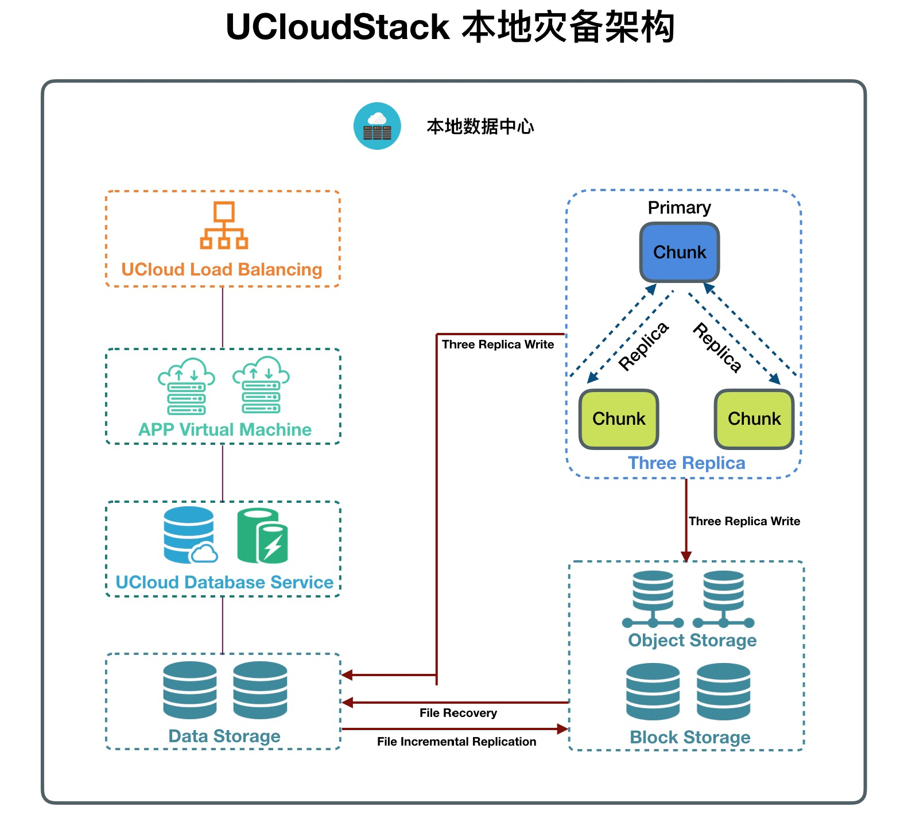

- 平台支持灵活的备份和恢复策略，可通过不同时间维度，全量或增量的方式备份数据，
- 当本地数据损坏或误删时，可将本地备份数据还原至平台，恢复业务数据及业务运行；
- 当本地数据中心发生灾难时，可通过异地灾备、公有云灾备等方式重建数据中心并恢复业务；

## 6.2 异地灾备服务

UCloudStack 云平台在保证本地数据中心的业务数据安全的同时提供异地灾备服务，将云业务镜像及数据通过专线、SD-WAN、VPN 或互联网连接以增量的方式复制到异地对象存储服务，确保业务数据 RPO 指标。当本地数据中心发生灾难时，可快速通过异地数据恢复业务。

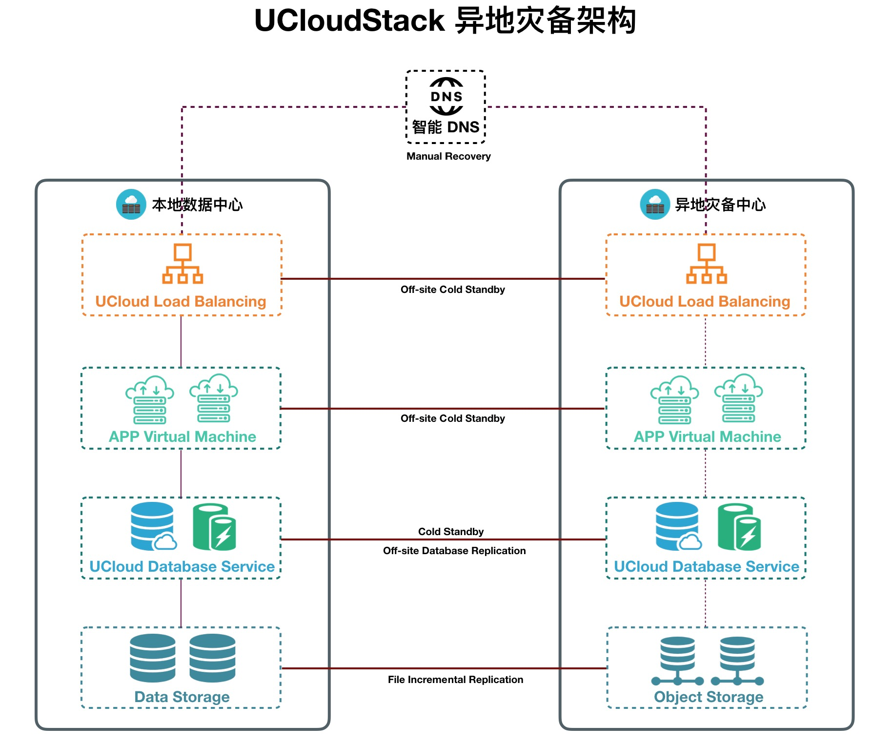

异地灾备服务支持多种业务部署方式，为云平台业务提供不同 RTO 指标，控制云平台业务灾备成本。

**（1）RTO 指标高，业务恢复时间长，成本低**

- 业务部署：在异地灾备中心仅部署对象存储服务，将本地数据中心云业务镜像、业务数据及数据库以全/增量的方式复制到对象存储服务中；
- 业务恢复：通过将异地灾备中心对象存储服务的备份数据还原至本地，在本地恢复云业务及数据，重建本地数据中心；

**（2）RTO 指标低，业务恢复时间长，成本高**

- 业务部署：所有业务应用、数据库、负载均衡分别部署在本地数据中心和异地灾备中心；
  - 本地数据中心为 Active 模式，异地灾备中心为 Cold Standby 模式；
  - 负载均衡：每个业务的负载均衡实例均在灾备中心各部署一套；
  - 虚拟机：针对业务对 RTO 不同需求，灾备中心可部署相同配置或降级配置的虚拟机；
    - 对于 RTO 要求较高的应用，在灾备中心需部署与生产中心相同配置的虚拟机，用于满足业务切换时，可快速恢复业务，并保证业务运行环境的性能；
    - 对于 RTO 要求较低的应用，在灾备中心可部署降级配置的虚拟机，以节省资源和成本；
  - 数据库：针对每个业务在灾备中心部署一套相同的数据库服务，灾备中心数据库均为只读模式，两地数据库采用异步方式进行数据复制；
  - 存储：灾备中心部署对象存储服务，灾备中心数据库直接连接对象存储进行数据读写；
  - 智能 DNS ：通过智能 DNS 服务，将业务域名 A 记录配置为本地数据中心 LB 的 IP 地址；
- 数据复制：针对业务对 RPO 的不同需求，两个数据中心采用多种网络互联；
  - 数据库服务将数据通过异步方式复制到灾备中心对象存储服务；
  - 虚拟机镜像、业务数据、文件数据以全/增量的方式，从本地数据中心复制到灾备中心对象存储；

- 业务恢复：当本地数据中心发生灾难或需要业务切换时，修改业务域名 A 记录和数据库状态；
  - 通过智能 DNS 将业务域名 A 记录手动修改为灾备中心业务 LB 的 IP 地址，实现故障切换和业务恢复；
  - 将灾备中心业务应用数据库服务修改为读写状态，业务应用数据库直接读写对象存储中的数据；

异地灾备中心与本地数据中心网络互联方式，会影响业务数据备份的频率和完整性；由于异地网络延时的影响，不建议两地数据中心均为 Active 模式。

## 6.3 公有云灾备服务

UCloudStack 云平台提供本地数据中心到公有云平台的灾备服务，将云业务镜像及数据通过专线、SD-WAN、VPN 或互联网连接以增量的方式复制到第三方公有云平台对象存储服务，确保业务数据 RPO 指标。当本地数据中心发生灾难时，可快速在公有云上恢复业务，同时也可将公有云上的业务数据备份还原至本地，重新本地数据中心。

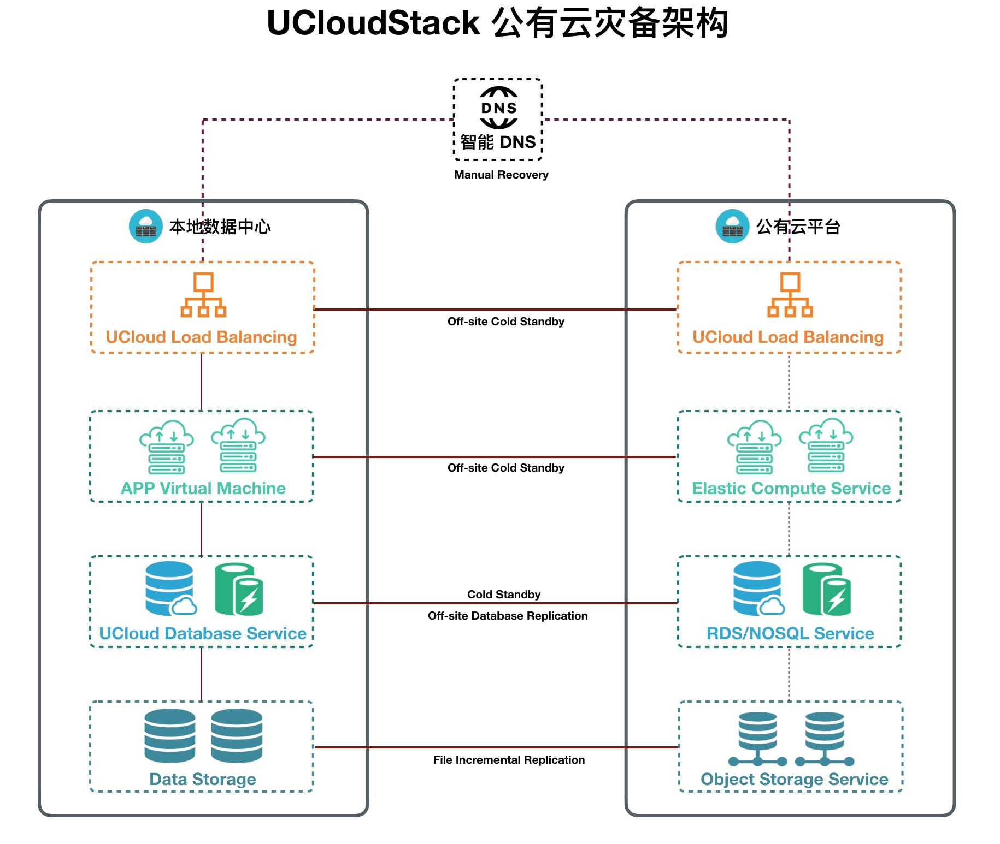

公有云灾备服务支持多种业务部署方式，为云平台业务提供不同 RTO 指标，控制云平台业务灾备成本。

**（1）RTO 指标高，业务恢复时间长，成本低**

- 业务部署：在公有云平台仅申请对象存储服务，将本地数据中心云业务镜像、业务数据及数据库以全/增量的方式复制到对象存储服务中；
- 业务恢复
  - 通过将公有云对象存储服务的备份数据还原至本地，在本地恢复业务，重新本地数据中心；
  - 使用对象存储备份数据，在公有云平台直接部署业务云主机、负载均衡、数据库等服务，恢复业务；

**（2）RTO 指标低，业务恢复时间长，成本高**

- 业务部署：所有业务应用、数据库、负载均衡分别部署在本地数据中心和公有云平台；
  - 本地数据中心为 Active 模式，公有云平台为 Cold Standby 模式；
  - 负载均衡：每个需要负载均衡的业务均在公有云申请一个负载均衡实例，并将业务云主机加入后端；
  - 云主机：针对业务对 RTO 不同需求，公有云可部署与本地数据中心相同或降级配置的云主机；
    - 对于 RTO 要求较高的应用，公有云需部署与生产中心相同配置的云主机，用于满足业务切换时，可快速恢复业务，并保证业务运行环境的性能；
    - 对于 RTO 要求较低的应用，公有云可部署降级配置的云主机，以节省资源和成本；
  - 数据库服务：针对每个业务在公有云平台部署一套相同的数据库服务，云平台数据库服务均为只读模式，两地数据库采用异步方式进行数据复制；
  - 对象存储服务：公有云平台部署对象存储服务，公有云平台业务应用数据库直连对象存储进行数据读写；
  - 智能 DNS ：通过智能 DNS 服务，将业务域名 A 记录配置为本地数据中心 LB 的 IP 地址；
- 数据复制：针对业务对 RPO 的不同需求，本地数据中心和公有云平台间采用多种网络互联；
  - 数据库服务将数据通过异步方式复制到公有云平台对象存储服务；
  - 虚拟机镜像、业务数据、文件数据以全/增量的方式，从本地数据中心复制到公有云平台对象存储服务；
- 业务恢复：当本地数据中心发生灾难或需要业务切换时，修改业务域名 A 记录和数据库状态；
  - 通过智能 DNS 将业务域名 A 记录手动修改为公有云平台业务 LB 的 IP 地址，实现故障切换和业务恢复；
  - 将公有云平台业务应用数据库服务修改为读写状态，业务应用数据库直接读写对象存储中的数据；

异地灾备中心与公有云平台网络互联方式，会影响业务数据备份的频率和完整性；由于网络延时的影响，不建议公有云平台业务为 Active 模式。

## 6.4 两地三中心灾备服务

两地三中心指同城双中心加异地灾备的容灾解决方案，兼具高可用性和灾难备份的能力。两地指同城和异地；三中心指本地数据中心、同城灾备中心、异地灾备中心。同城双中心具备基本等同的业务处理能力并通过高速链路实时同步数据，通常同时分担业务运行和业务访问，并可进行切换运行；异地灾备中心用于同城双中心的数据备份。

UCloudStack 云平台提供两地三中心灾备服务，支持在同城双活数据中心基础上，增加一个异地灾备中心，并与同城双活实现同步；当同城双中心均发生自然灾害等原因发生故障时，异地灾备中心可以实现数据恢复，进一步提高业务 RTO 及 RPO 指标。

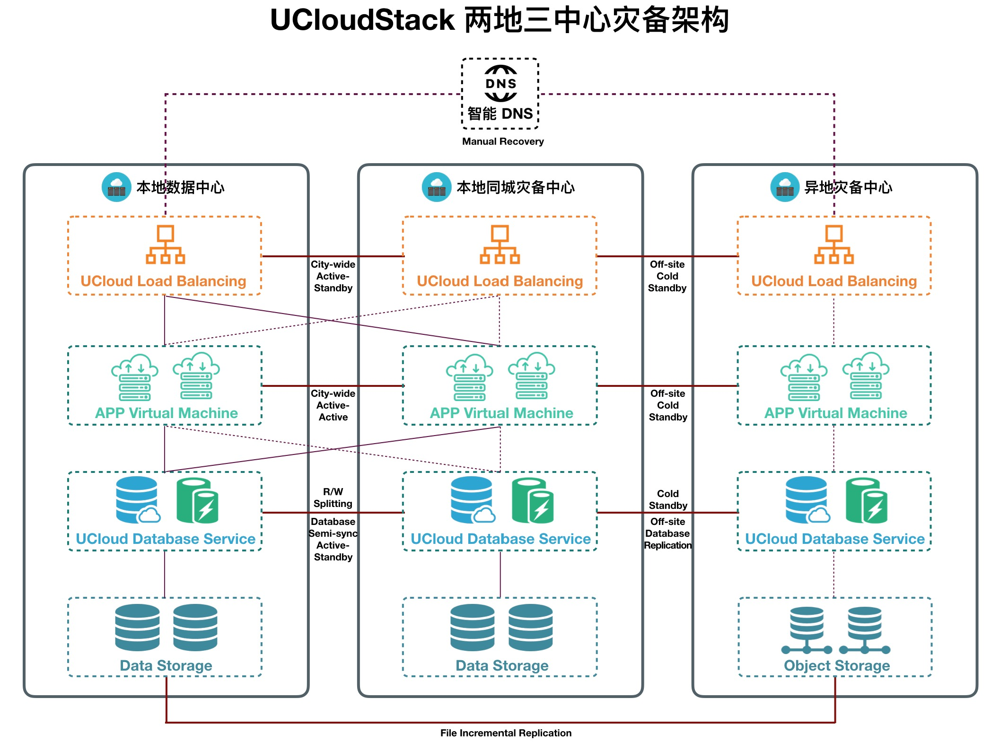

UCloudStack 云平台将同城双中心分别作为一个区域（Region）的两个可用区（Availability Zone），即生产可用区和同城灾备可用区。两个可用区间距离为 30 公里左右，**使用 DWDM 通道将两个可用区内网直接互连**，具备二层网络打通和网络负载均衡条件，满足同城双活网络时延小于 2ms 。

### 6.4.1 业务部署

两地三中心灾备模式下，同城双中心在一个网络中，为达到双活高可用的目标，业务部署区别于异地灾备服务。同城双中心部署由 UCloudStack 提供多可用区负载均衡、数据库提供跨可用区高可用；异地灾备中心部署根据业务对 RPO 需求部署云服务。

**同城双中心（ACtive-Active）**

- 生产可用区和同城灾备区均为 Active 模式，同城双中心均接受并处理业务访问；
- 负载均衡：
  - UCloudStack 负载均衡采用集群架构，基于跨可用区分布式部署，利用 BGP+ECMP 实现集群自动容灾，保证业务可用区级别灾难的 RTO 指标；
  - 在同城 Region 中部署的负载均衡服务实例，会分别分布在生产可用区和灾备可用区中，保证服务可靠性；支持将同城双中心的所有云主机作为后端服务器，达到同城双活的目标；
  - 针对每个需要负载均衡的业务，同城双中心仅需在生产中心申请 **1** 个负载均衡服务实例，UCloudStack 平台自动会在同城灾备中心部署一个负载均衡服务实例，用于同城负载均衡灾备；
  - 将同城双中心的同一个业务的虚拟机均加入至生产中心的负载均衡实例后端，请求会被分别负载到同城双中心的业务虚拟机上，实现同城双活请求入口；
  - 通常业务请求会通过生产中心负载均衡服务实例进行负载转发，同城灾备中心仅在生产中心发生灾难时进行自动切换；
- 虚拟机：针对每种业务分别在同城双中心部署一定数量的虚拟机和数据盘，如生产中心 4 台，同城灾备中心 2 台，并将 6 台虚拟机均加入到一个负载均衡服务实例后端；
- 数据库：
  - UCloudStack 数据库服务提供容灾方案，支持跨可用区高可用实例，可基于多可用区进行容灾实例部署；
  - 针对每种业务在生产中心部署一套数据库服务，系统将自动在同城灾备中心部署一套相同的数据库实例；
  - 同城双中心数据库通过半同步的方式进行数据同步，应用访问同一数据库实例，数据在生产可用区和同城灾备可用区各存储一份；
  - 也可在业务级别将同城双中心的数据库进行读写分离，生产中心数据库为读写模式，同城灾备中心数据库为只读模式；
- 智能 DNS ：通过智能 DNS 服务，将业务域名 A 记录配置为本地数据中心 LB 的 IP 地址；

**异地灾备中心（Cold Standby）**

异地灾备服务支持多种业务部署方式，为云平台业务提供不同 RTO 指标，控制云平台业务灾备成本。

- **RTO 指标高，业务恢复时间长，成本低**

  在异地灾备中心仅部署对象存储服务，将本地数据中心云业务镜像、业务数据及数据库以全/增量的方式复制到对象存储服务中；

- **RTO 指标低，业务恢复时间长，成本高**

  - 负载均衡：每个需要负载均衡的业务均在异地灾备中心部署负载均衡实例，并将业务虚拟机加入后端；
  - 云主机：针对业务对 RTO 不同需求，公有云可部署与本地数据中心相同或降级配置的云主机；
    - 对于 RTO 要求较高的应用，公有云需部署与生产中心相同配置的云主机，用于满足业务切换时，可快速恢复业务，并保证业务运行环境的性能；
    - 对于 RTO 要求较低的应用，公有云可部署降级配置的云主机，以节省资源和成本；
  - 数据库服务：针对每个业务在异地灾备中心部署一套相同的数据库服务，两地数据库异步方式复制数据；

  - 对象存储服务：异地灾备中心部署对象存储，灾备中心业务应用数据库直连对象存储进行数据读写；

### 6.4.2 数据复制

针对业务对 RPO 的不同需求，同城双中心和异地灾备中心采用多种网络互联。

- 同城双中心
  - 同城双中心数据库通过半同步的方式进行数据同步，应用访问同一数据库实例，数据在生产可用区和同城灾备可用区各存储一份；
  - 每种业务在同城双中心同时部署虚拟机和存储，云平台自动将生产中心虚机镜像复制到同城灾备中心；

- 异地灾备中心
  - 数据库服务将数据通过异步方式复制到灾备中心对象存储服务；
  - 虚拟机镜像、业务数据、文件数据以全/增量的方式，从本地数据中心复制到灾备中心对象存储；

### 6.4.3 业务恢复

- 同城双中心为 Active-Active 模式，当生产中心业务发生故障或灾难时：
  - 跨可用区负载均衡通过内部 DNS 自动将业务请求切换到同城灾备中心，可在分钟级恢复业务；
  - 数据库容灾实例自动切换到灾备中心数据库实例，对用户透明；
- 异地灾备中心为 Cold-Standby 模式，当同城双中心均发生灾难或业务故障时：
  - 通过智能 DNS 将业务域名 A 记录手动修改为异地灾备中心业务 LB 的 IP 地址，实现故障切换；
  - 将异地灾备中心业务应用数据库服务修改为读写状态，业务应用数据库直接读写对象存储；
  - 若采用成本较低的异地灾备方案：
    - 可在异地直接通过虚机镜像、数据库备份及相关备份数据重建业务；
    - 通过将异地灾备中心的数据还原至本地，重新本地数据中心，恢复业务；

## 6.5 灾备网络架构

UCloudStack 灾备服务网络分别同城双中心网络和异地灾备网络，不同灾备服务构建方式，通过不同的网络链路进行互联互通。生产中心与异地灾备中心可通过 SD-WAN、专线、VPN、互联网等方式进行网络联通和数据复制，可根据业务对 RPO 的需求，选择不同的网络连接方案。

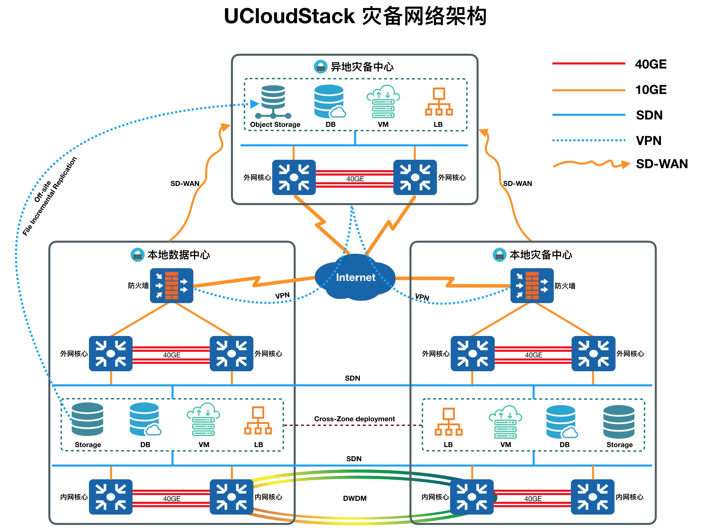

- 同城双中心
  - 本地数据中心和同城灾备中心通过 [DWDM](https://en.wikipedia.org/wiki/Wavelength-division_multiplexing) 链路，将同城双中心内网核心进行物理互联，并通过三层将双中心二层网络打通，保证网络负载均衡条件，网络时延小于 2ms ；
  - 同城双中心分别通过 WAN 链接与互联网连通，承载同城双中心的外网接入；
  - 同城双中心的负载均衡、VPC、虚拟机、数据库及存储跨可用区部署，并保证跨可用区高可用；
- 异地灾备中心
  - 异地灾备中心与同城双中心通过多种方式进行网络联通，用于数据复制和数据库复制；
  - 异地灾备网络互联方式包括 SD-WAN、专线、VPN、互联网等，可根据业务对 RPO 的需求及对于成本的考虑进行网络互联方案选择；
  - SD-WAN /专线
    - 通过 SD-WAN 、专线的方式将同城双中心的外网核心与异地灾备外网进行互联；
    - 线路质量好，数据复制和同步速度较快，异地灾备业务 RPO 可以得到保证；
    - RPO 指标低，成本高；
  - Internet / VPN
    - 直接通过 Internet 或 VPN 的方式将同城双中心的外网和异地灾备外网互联；
    - 网络质量无法保证，数据复制和同步速度较慢，异地灾备业务 RPO 不能得到保证；
    - RPO 指标高，成本低；

## 6.6 灾备切换

UCloudStack 灾备服务根据业务场景分为计划内和计划外切换；根据灾备服务方式分为同城和异地切换。

- 计划内指业务灾备演练和云平台运维，生产中心并未发生灾难或故障，多用于验证灾备服务能力；
- 计划外指生产中心发生大规模灾难，如地震、电子故障、病毒攻击等，生产中心已彻底损坏；
- 同城切换指同城双中心中的某个数据中心发生灾难的业务切换，合理部署业务可实现同城双中心自动容灾，无需用户介入切换，业务自动恢复；
- 异地切换指同城双中心均发生灾难，无法提供服务，需手工进行业务恢复和切换；
- 通常情况下，同城双中心自动进行业务灾备切换，无需人工介入，下文仅对异地灾备切换进行描述；

### 6.6.1 计划内切换

- 数据比对：人工介入比对同城双中心和异地灾备中心业务数据和资源数据的一致性及完整性；
- 停止生产中心业务、网络、负载均衡或关闭硬件设施电源等；
- 检查异地灾备中心业务虚拟机中业务运行状态，并检查虚拟机是否在业务负载均衡实例的后端；
- 修改灾备中心业务数据库状态为读写状态，测试通过负载均衡服务地址，访问业务服务地址的状态；
- 通过智能 DNS 将业务域名 A 记录手动修改为异地灾备中心业务 LB 的 IP 地址，测试业务服务状态；

若异地灾备中心仅部署对象存储服务，即仅有生产中心业务数据的备份，需要在异地灾备中心或生产中心准备运行业务的基础 IaaS 及 PaaS 环境 ，通过备份数据逐个还原业务虚拟机、负载均衡、数据库、存储等。

### 6.6.2 计划外切换

- 检查并确认同城双中心均已故障或不可用；
- 检查异地灾备中心业务虚拟机中业务运行状态，并检查虚拟机是否在业务负载均衡实例的后端；
- 修改灾备中心业务数据库状态为读写状态，测试通过负载均衡服务地址，访问业务服务地址的状态；
- 通过智能 DNS 将业务域名 A 记录手动修改为异地灾备中心业务 LB 的 IP 地址，测试业务服务状态；
- 修复生产中心或在异地重新同城灾备中心，并部署相关服务，对数据和业务进行同步及复制；

若异地灾备中心仅部署对象存储服务，即仅有生产中心业务数据的备份，需要在异地灾备中心准备运行业务的基础 IaaS 及 PaaS 环境 ，通过备份数据逐个还原业务虚拟机、负载均衡、数据库、存储等。

### 6.6.3 灾备回切

生产中心或同城双中心故障恢复或重新后，将异地新生产中心业务切回至原生产中心，即本地数据中心。灾备回切属于计划内，切换流程与计划内切换一致。

# 7 术语解释

* **虚拟机**：一种资源管理技术，寄生于物理机，是将计算机的各种实体资源（ CPU、内存、磁盘空间、网络适配器等 ），通过虚拟化技术予以抽象、转换，为用户提供模拟的计算环境。
* **KVM**：kernel-based virtual machine，linux 内核中支持虚拟化的模块。
* **QEMU-KVM**：作为 KVM 的补充，运行在用户空间，操作虚拟机的工具集和 IO 虚拟化支持。
* **Ceph**：软件实现的分布式存储平台，可用于为虚拟机提供块存储方案等。
* **OVS**：Open vSwitch，运行在虚拟化平台上的虚拟交换机。
* **区域**：资源的存储位置分类，可以有一个或多个区域， 区域之间相互独立，例如华东，浙江。
* **可用区**：资源的存储位置分类，层级在区域之下，类似于一个数据中心，一个区域下有一个或多个可用区。
* **集群**：资源的存储位置分类，用于区分不同资源在一个数据中心下的分布情况。
* **物理机**：实际提供虚拟化及网络能力的节点。
* **公网IP池**：用于提供Internet访问的 IPv4 地址，可用与虚拟资源的外网 IP 以及管理服务本身使用。
* **基础镜像** ：虚拟机镜像，用于创建虚拟机，如 Centos 7.4， Windows 2012 等。
* **配额**： quota ，某个产品某个地域的数量上限，额度设定在公司级别。
* **计费**：bill ，从购买时刻起，资源就可以进行计费，计费方式分为按小时，按月，按年。
* **回收站**：资源删除后会先进入回收站，可配置资源是否/多久从回收站彻底回收，同样在一定周期内资源也可以恢复资源。
* **超级管理员**： Admin 后台账号，拥有 UCloudStack 最大的管理权限，可管理底层物理资源，用户虚拟资源，用户账户额度，配额，全局配置等等。


