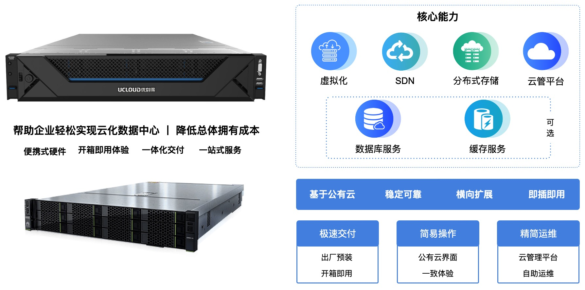
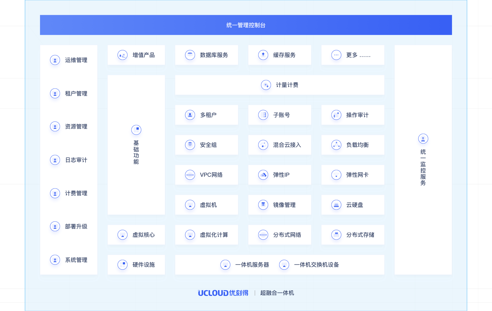

# 超融合一体机

# 1 产品介绍

UCloud 超融合一体机为企业在私有环境下提供全栈云计算能力，开箱即用，软硬一体化交付，实现计算、存储、网络、Paas 资源的融合及横向扩展能力。

# 2 产品优势

- **灵活硬件配置，适配各种业务**

  UCloud超融合一体机支持多种硬件配置，同时支持x86及ARM架构，并支持混合部署，满足不同业务对计算、存储和I/O的弹性要求。3台即可搭建高可用平台，适用于云计算、边缘等应用场景，是云数据中心IT基础设施的理想选择。

-  **成熟架构**

  UCloud超融合一体机的核心架构源自于公有云，经过7年10000+客户验证，稳定可靠，不仅融合计算、存储服务，支持按需集成负载均衡、Nat网关、数据库、分布式缓存等云服务。

- **出厂预装，开箱即用**

  UCloud超融合一体机预安装了UCloudStack云管理软件，实现了一站式交互，开箱即用，运维人员可通过图形化操作界面进行业务部署，实现业务的快速上线，专注于业务创新与发展。

- **统一管理，精简运维**

  UCloud超融合一体机所有的物理机及虚拟(云)资源都可通过统一的图形化操作界面进行管理，多租户体系的引入，使得IT资源需求方可通过图形化操作界面实现自服务，降低对IT管理人员的技能要求和运维负担。平台自带的操作日志、权限管控功能，可满足企业IT安全、审计等要求。

- **分布式存储引擎，解决性能瓶颈**

  采用分布式存储方案，数据采用多副本模式，分布于多台内置硬盘或SSD存储中，不仅避免了单机性能瓶颈，也降低了数据丢失的风险，其容量可以按需动态扩展，降低运维、规划存储架构的负担。

- **安全可靠**

  多种数据安全机制（多副本、故障硬盘自动隔离、快照备份等），数据可靠性高达7个9。支持虚拟机热迁移、热补丁技术，内置负载均衡，有效保障业务高可用。

# 3 产品架构

# 4 典型配置

| 机型       | 计算密集型                                                   |
| :--------- | :----------------------------------------------------------- |
| CPU型号    | Intel® Xeon® Gold 6248R Processor (35.75M Cache, 3.00 GHz, 24 core) * 2 |
| 内存       | DIMM DDR4_32GB_2666MHz *8                                    |
| 系统盘     | SATA3_SSD_240GB_6Gb/s *2                                     |
| 数据盘     | SATA3_SSD_960GB_6Gb/s *8                                     |
| 存储控制器 | HDD Controller 12Gb/s_RAID_Card _1G Cache_SuperCap *1        |
| 网络       | 10GFibre光口_双口(不含SFP+多模模块） *1                      |

| 机型       | 存储密集型                                                   |
| :--------- | :----------------------------------------------------------- |
| CPU型号    | Intel® Xeon® Silver 4210R Processor (13.75M Cache, 2.40 GHz, 10 core) *2 |
| 内存       | DIMM DDR4_16GB_2666MHz *6                                    |
| 系统盘     | SATA3_SSD_240GB_6Gb/s *2                                     |
| 数据盘     | SATA3_HDD_8TB_6Gb/s_7200RPM *12                              |
| 存储控制器 | HDD Controller 12Gb_HBA_Card *1                              |
| 网络       | 10GFibre光口_双口(不含SFP+多模模块） *1                      |

| 机型       | 定制化机型                                                   |
| :--------- | :----------------------------------------------------------- |
| CPU型号    | Intel® Xeon® Silver 4210R、Gold 5218R、 Gold 6248R， AMD 7542等多款CPU |
| 内存       | DDR4 2666MHz，32G*2起，最大可扩展至24                        |
| 系统盘     | SATA3_SSD_240GB_6Gb/s *2                                     |
| 数据盘     | 支持12*2.5"/3.5"数据盘                                       |
| 存储控制器 | 12Gb/s RAID 卡+1G cache+电池/电容                            |
| 网络       | Intel 2口 千兆+Intel 2口 万兆（不含SFP+多模模块）            |

