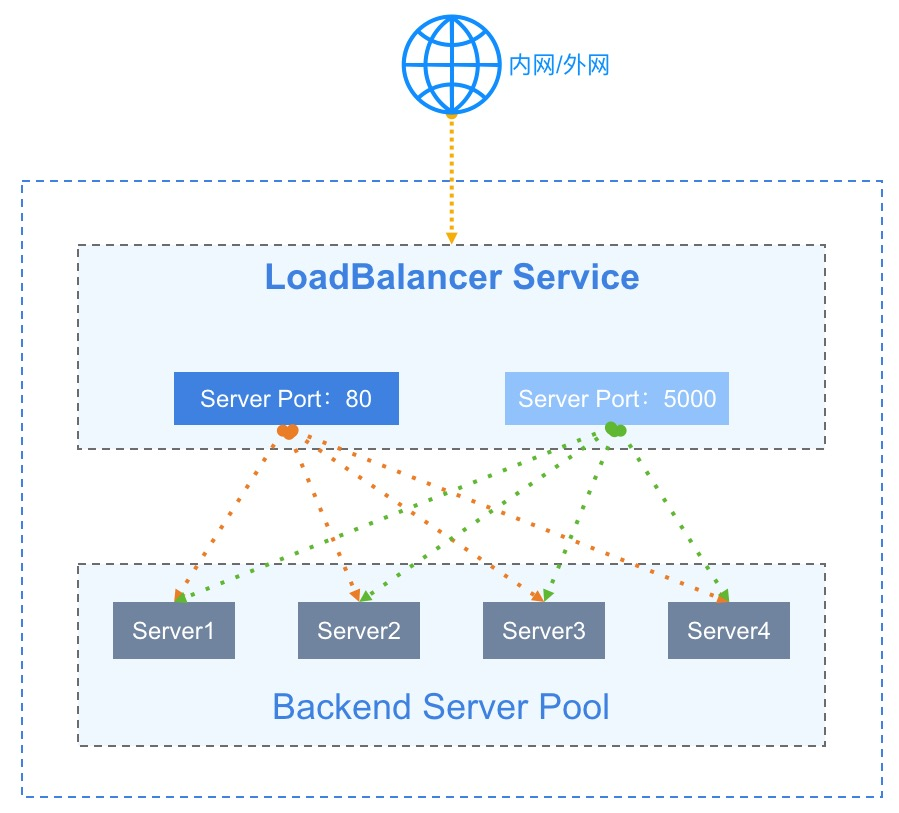
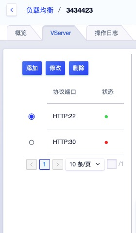
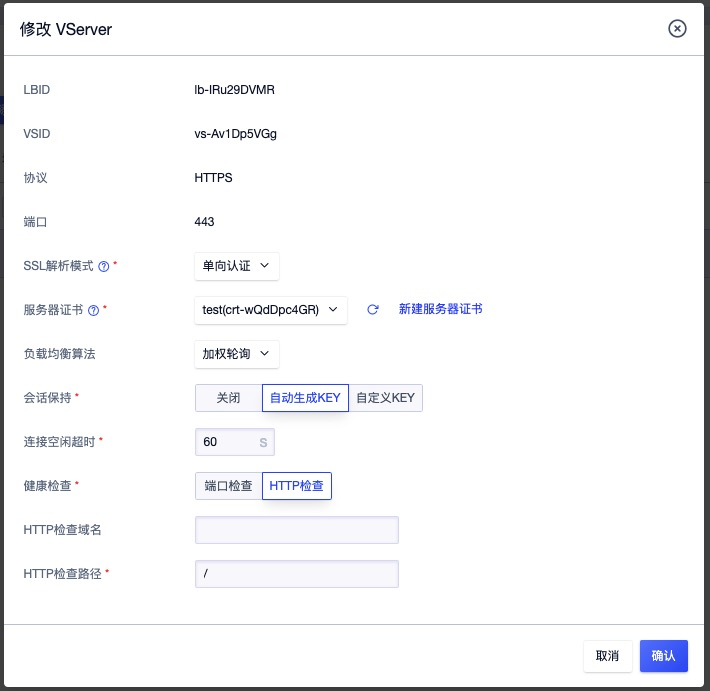
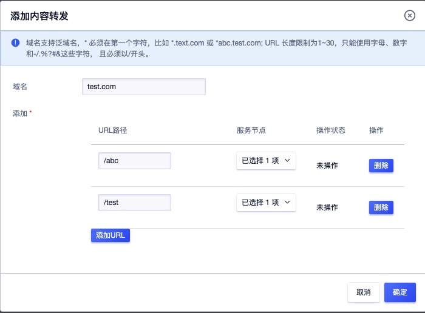

# 10 负载均衡

## 10.1 负载均衡简介

### 10.1.1 概述

负载均衡（ Load Balance ）是由多台服务器以对称的方式组成一个服务器集合，每台服务器都具有等价的地位，均可单独对外提供服务而无须其它服务器的辅助。UCloudStack 负载均衡服务是基于 TCP/UDP/HTTP 协议将网络访问流量在多台虚拟机间自动分配的控制服务，类似于传统物理网络的硬件负载均衡器。

通过平台负载均衡服务提供的虚拟服务地址，将同一地域添加至负载均衡的虚拟机虚拟构建为一个高性能、高可用、高可靠的应用服务器池，并根据负载均衡的转发规则，将来自客户端的请求均衡分发给服务器池中最优的虚拟机进行处理。

UCloudStack 负载均衡服务简称 ULB ，支持内外网两种访问入口类型的负载均衡器，适应多种网络架构及高并发的负载应用场景。提供四层和七层协议的转发能力及多种负载均衡算法，支持会话保及健康检查等特性，可自动隔离异常状态虚拟机，并有效提高整体业务的可用性及服务能力。

同时 ULB 支持收集并展示负载流量各种网络指标的监控数据，并可根据告警模板进行监控报警及通知，保证业务的正常运行。当前 ULB 为接入的虚拟机服务池提供基于 NAT 代理的请求分发方式，在 NAT 代理模式下，所有业务的请求和返回数据都必须经过 ULB ，类似 LVS 的 NAT 工作模式。

### 11.1.2 应用场景

UCloudStack 平台提供公网和内网两种类型的负载均衡服务，分别对应不同互联网服务和内网服务两种场景。用户可根据业务需求，选择创建对外公开或对内私有的负载均衡实例，平台会根据负载均衡类型分别分配公网 IP 地址、物理 IP 地址或 VPC 私网 IP 地址，即负载均衡的服务访问地址。

- 公网 IP 负载均衡使用场景：
  - 部署在平台的业务服务需要构建虚拟机集群，且需对公网提供统一访问入口。
  - 业务服务需要为不同线路或运营商用户提供就近服务并需要 CDN 加速。
- 内网负载均衡使用场景：
  - 部署在平台的业务服务需要构建虚拟机集群，且仅需对 VPC 内网提供统一访问入口。
  - 部署在 VPC 私有网络的虚拟机集群需要对其它用户或服务屏蔽真实 IP 地址，对客户端提供透明化服务。

> 用户也可将负载均衡服务分配的 IP 地址与自有域名绑定在一起，通过域名访问后端应用服务。

### 11.1.3 负载均衡架构

一个提供服务的负载均衡服务，主要由 ULB 实例（ LoadBalancer ）、虚拟服务器（ VServer ）、后端服务器（ Backend Real Server ）三部分组成。如下 ULB 架构图所示：

- UCloudStackLoadBalancer（ ULB ）：UCloudStack 负载均衡器，结合内外网 IP 地址，根据 VServer 配置的监听器，将虚拟机加入到 Backend 成为 Real Server ，以实现流量均衡与服务容错的功能。
- Virtual Server（ VServer ）：监听器，每个监听器是一组负载均衡端端口配置，包含协议、端口、负载算法、会话保持、客户端超时及健康检查等配置项。
- Backend Server Pool ：后端一组虚拟机服务器池，用于实际处理请求，其中服务器池中的每一台虚拟机都称为 “RealServer” ，即真实部署业务的虚拟机实例。
- 外网 IP（ EIP ）：弹性 IP 地址，外网弹性 IP 地址，绑定在 ULB 实例上以提供外网访问地址及带宽。
- Private IP：内网 IP 地址，内网负载均衡提供服务的访问地址，通常是由创建内网负载均衡器时指定的 VPC 自动分配。

UCloudStack 负载均衡服务的基本工作原理：当 ULB 接受到来自客户端的请求后，会将请求路由到一个或多个可用区的后端虚拟机进行业务处理。

- ULB 最核心的功能是由 VServer 负责监听 ULB 实例入口地址上的服务请求，并通过一系列负载均衡算法将请求分发到 Backend 的 Real Server 进行请求处理，在 NAT 请求代理模式下，请求均由 ULB 进行接受并分发；
- 负载均衡服务支持加权轮询、最小连接数及基于源地址的负载均衡算法，不同的负载均衡算法，会使用不同的依据条件进行流量转发，如轮询则是请求按照顺序将请求依序转发给后端虚拟机；
- VServer 监听器通过配置会话保持功能，在请求会话的生命周期内，可以将同一个客户端的请求转发至同一个虚拟机进行处理，适用于 TCP 长连接等应用场景；
- VServer 监哭的器通过配置健康检查功能，健康检查会监控后端 RealServer 的运行状况，确保只将流量分发至正常运行的虚拟机上；
  - 当 ULB 检测到后端虚拟机运行状况不佳时，会停止向该虚拟机分发负载流量；
  - 当再次检测到虚拟机恢复正常后，会重新向该虚拟机分发负载流量；
- 默认情况下，后端 RealServer 虚拟机处理请求后，会将请求返回给 ULB ，由 ULB 将结果返回给客户端。

### 11.1.4 功能特性

UCloudStack 负载均衡服务提供四层和七层负载均衡，支持内网和外网两种网络入口，在多种负载调度算法基础之上支持会话保持、健康检查、请求超时、内容转发等功能，保证后端服务的高可用和高可靠。

- 支持公网和内网两种类型的负载均衡器，满足虚拟机 VPC 内网负载均衡及互联网服务负载均衡应用场景；
- 提供负载均衡集群服务，实现负载均衡器故障自动切换，提高接入负载均衡服务的可用性，提高资源利用率；
- 支持 TCP、UDP、HTTP 等协议的监听器，支持四层和七层业务的负载均衡服务；
- 负载均衡算法：支持加权轮询、最小连接数和源基于源地址的的负载调度算法：
  - 源地址：ULB 根据连接的源地址，利用一定的哈希算法将请求其转给某台主机，用户下次以相同的 IP 访问，如虚拟机数量不变时，访问会分发给该台虚拟机进行处理；
  - 加权轮询：ULB 接收到新的连接后，根据用户指定的后端虚拟机权重，按照概率分发流量到各虚拟机；
  - 最小连接数：ULB 接收到新的连接后，会实时统计 ULB 到后端虚拟机的连接数，选择连接数最低的虚拟机建立新的连接并发送数据；
- 支持会话保持功能，可以在轮询等负载均衡算法下，保证同一个源的请求，由相同的后端虚拟机进行处理。会话保持针对四层和七层的实现方式不同：
  - 四层会话保持：针对 UDP 协议时，基于 IP 地址保证会话保持，ULB 会将来自同一 IP 地址的访问请求转发到同一台后端虚拟机进行处理，支持关闭会话 UDP 会话保持功能；
  - 七层会话保持 ：针对 HTTP 协议，ULB 基于 Cookie 支持会话保持功能。用户在配置时可以选择开启会话保持功能。会话保持支持两种方式：
    - Cookie 插入：选择自动生成 key ，客户端的 cookie 插入操作均由 ULB 来分配和管理；
    - 用户指定 Cookie 插入：用户可自定义 key ，ULB 使用自定义的 key 进行分配和管理 Cookie 插入。
- 健康检查：根据规则对后端业务服务器进行健康检查，支持端口检查和 HTTP 检查，可自动检测并隔离服务不可用的虚拟机，一旦发现问题，迅速将故障虚拟机切换，确保服务可用性；
  - 端口检查：针对四层和七层负载均衡，支持按 IP 地址 + 端口的的方式探测后端服务节点的健康状况，及时剔除不健康的节点；
  - HTTP 检查：针对七层负载均衡，支持按 URL 路径和请求 HOST 头中携带的域名进行健康检查，筛选健康节点。
- 获取客户端真实 IP：HTTP 监听器支持附加 HTTP header 字段，通过 X-Forwarded-For 和 X-Real-IP 获取客户端真实 IP 地址。
- 获取监听器协议：HTTP 监听器支持附加 HTTP header 字段，通过 X-Forwarded-Proto 获取监听器的协议。
- 附加 HTTP HOST：HTTP 监听器支持附加 HTTP header 字段，通过 Host 附加 HOST 域名至 HTTP 请求中，用于适配需要检测 HTTP 头 HOST 字段的业务。
- 监控数据：负载均衡级别提供 LB 每秒连接数、LB 每秒网卡出/入流量、LB 每秒网卡出包数量；VServer 级别提供 VServer 连接数、HTTP 2XX、HTTP 3XX、HTTP 4XX、HTTP 5XX 等。
- 请求超时：支持客户端空闲连接超时设置，通过修改超时连接时间参数，可自定义用户的空闲超时时间。
  - 对客户端向 ULB 发送的请求，ULB 维护两个连接，一个指向客户端，另一个指向后端 RealServer ；
  - 超过连接空闲超时期限后，如果没有发送或接收任何数据，ULB 将关闭连接；
  - ULB 默认打开连接保持，默认连接保持时间为 60 秒，例如在第一次发包后连接将会保持 60 秒，如果距上一次发包 60 秒内没有新的数据包，连接将会断开；
  - 用户可以根据自己的业务需要设置连接空闲超时的阈值，目前具有连接空闲超时的协议有 HTTP、TCP 的请求代理模式。
- 内容转发：针对七层 HTTP 负载均衡，支持基于域名和 URL 路径的流量分发及健康检查能力，可将请求按照域名及路径转发至不同的后端服务节点，提供更加精准的业务负载均衡功能。
- 负载均衡高可用：ULB 为用户提供业务级别的高可用方案，可以将业务应用同时部署至同一个可用区及至多个可用区的虚拟机中，通过负载均衡和 DNS 域名的方案设置流量均衡转发，实现多业务级别的流量负载均衡；
  - 当大并发流量通过 ULB 访问虚拟机业务时，可通过最小连接数、加权轮询等算法，将请求转发给 ULB 后端池中最健壮的虚拟机进行处理；
  - 虚拟机处理完请求后，根据负载均衡的模式，将请求返回给 ULB  或直接将请求返回给客户端，从一定程度上保证业务业务的可用性和可靠性；

> 用户可通过智能 DNS 服务，将两个地域的 ULB 实例同时绑定至一个域名，使用 DNS 实现多 ULB 实例高可用及跨地域高可用方案。

## 11.2 负载均衡管理

### 11.2.1 ULB 使用流程

在使用 ULB 服务前，需要根据业务需求规划负载均衡的网络类型及监听类型，并根据业务需求在地域或多个可用区部署并配置好业务虚拟机服务池，具体流程如下：

1. 根据业务需求和规划，选择相应地域，在单个可用区或多个可用区分别创建并部署多台业务服务虚拟机，并保证业务在单台虚拟机上的可用性；
2. 根据业务需求，选择 ULB 的网络类型及入口 IP ，在云平台选择地域并部署 ULB 负载均衡实例；
3. 进入已创建的 ULB 实例，根据需求配置监听器 VServer ，包括服务的协议、端口、负载均衡算法、会话保持及健康检查等参数；
4. 为已配置的 VServer 添加服务节点来确定负载均衡入口请求路由的目标，即第 1 步部署并创建的业务虚拟机实例；
5. 通过负载均衡服务提供的统一访问 IP 地址，检测并访问应用服务。

### 11.2.2 创建负载均衡

创建负载均衡前需提前规划好地域、负载均衡类型、弹性 IP （公网类型）、VPC 网络、安全组及负载均衡的规格信息。可点击 UCloudStack 控制台导航栏“负载均衡”进入 ULB 资源控制台，通过“**创建负载均衡**”功能进入 ULB 创建向导页面：

> 本文以创建公网类型的负载均衡为例进行描述，内网类型的负载均衡与公网类型创建参数基本相同。

如上图所示，创建 ULB 实例，需要指定地域、可用区、机型、网络类型、 VPC 网络、子网、弹性 IP、安全组及实例名称和备注信息：

- 地域/可用区：指当前创建的负载均衡实例所在的地域及可用区；
- 机型：指当前创建的负载均衡实例所在宿主机的机型，如 x86 机型（机型由管理员在后台进行自定义配置）
- 网络类型：指当前创建的 ULB 实例的网络类型，可选择内网和公网；
  - 选择公网时，需要选择配置弹性 IP 及安全组信息，系统将使用选择的弹性 IP 作为 ULB 访问入口；
  - 选择内网时，仅需要选择并配置 VPC 网络及子网等信息，系统将从选择的子网中自动分配 IP 地址作为 ULB 实例的访问入口；
- VPC 网络/子网：负载均衡实例内网 IP 地址所属的 VPC 网络和子网，即代表负载均衡所服务的 VPC 网络及实例本身所在子网。内网 ULB 和外网 ULB 均需配置 VPC 网络和子网，系统将自动根据所选 VPC 网络和子网为 ULB 实例分配内网 IP 地址；
- 外网 IP ：负载均衡自动绑定的外网 IP 地址，仅当类型为公网时可配置；
- 安全组：负载均衡自动绑定的外网安全组，用于外网访问 ULB 时的访问控制，仅当类型为公网时可配置；
- 实例名称/备注：负载均衡实例的名称及备注信息；

选择并配置以上信息后，可选择购买数量和付费方式，确认订单金额并点击“立即购买” 进行 ULB 实例的创建：

- 购买数量：按照所选配置及参数批量创建多个负载均衡实例；
- 付费方式：选择 ULB 的计费方式，支持按时、按年、按月三种方式，可根据需求选择适合的付费方式；
- 合计费用：用户选择 ULB 资源按照付费方式的费用展示；

确认订单无误后点击立即购买，点击立即购买后，会返回 ULB 资源列表页，在列表页可查看 ULB 的创建过程，通常会先显示“创建中”的状态，分钟内转换为“**有效**”状态，即代表创建成功。

### 11.2.3 查看负载均衡

通过导航栏进入 ULB 资源控制台，可查看当前帐户已有 ULB 资源的列表，同时可通过点击列表上 ULB 的名称，进入ULB 实例的详情页面，用于查看 ULB 的详细信息、监控信息及 VServer 管理等。

#### 11.2.3.1 ULB 列表

ULB 列表页面可查看当前帐号下已拥有的 ULB 资源列表，包括地域/可用区、名称、ID、网络、VPC 网络、子网、安全组、VServer 数量、创建时间、过期时间、计费方式、状态及操作项，如下图所示：

ULB 资源列表显示每个 LB 资源的相关信息，其中：

- 网络：指当前 ULB 对外提供服务的访问地址：
  - 当 ULB 的网络类型为内网时，访问地址为所属子网自动分配的 IP 地址；
  - 当 ULB 的网络类型为外网时，访问地址为所绑定的弹性 IP 地址；
- VServer 数量：指当前 ULB 已创建的监听器 VServer 数量；
- 安全组：指当前 ULB 已绑定的安全组信息，仅当负载均衡类型为外网时展示；
- 创建时间/过期时间：当前 ULB 的创建时间及费用过期时间；
- 计费方式：指当前负载均衡创建时指定的计费方式；
- 状态：当前 ULB 的的运行状态，包括创建中、运行中、删除中、已删除；
- 操作：对单个 ULB 实例的操作项，包括删除、修改告警模板、修改安全组等；
- 可通过搜索框对 ULB 资源列表进行搜索和筛选，支持模糊搜索。

平台支持负载均衡的批量删除操作，方便用户对负载均衡资源进行清理；同时可通过搜索框对负载均衡资源列表进行搜索和筛选，支持模糊搜索。

#### 11.2.3.2 ULB 详情

通过 ULB 资源列表的“**名称**” 可进入 ULB 详情页面，可查看当前 ULB 资源的详细信息，如下图所示，详情页面分为基本信息、监控信息、VServer 管理及操作日志信息：

- 基本信息：当前 ULB 资源的基本信息，包括名称、ID、地域/可用区、创建时间、过期时间、计费类型、状态、告警模板及相关网络信息，其中：
  - 计费类型：指当前 ULB 在创建时指定的计费方式，包括按小时、按月及按月；
  - 网络信息：当前 ULB 的网络入口相关信息，包括 VPC、子网，或 ULB 为外网类型，则额外展示外网 IP及所属的安全组信息；
- 监控信息：当前 ULB 实例相关的监控图表及信息，包括 LB 每秒连接数、LB 每秒网卡出/入流量、LB 每秒网卡出包数量，支持查看 1 小时、6 小时、12 小时、1 天及自定义时间的监控数据；
- VServer 管理：当前 ULB 的监听器生命周期管理，包括 VServer 的添加、查看、修改、删除及后端服务节点和七层内容转发规则的管理，详见 [VServer 管理](#_11.3-VServer 管理) ；
- 操作日志：当前 ULB 资源的全生命周期操作日志，包括 LB 实例、VServer 管理、服务节点管理及内容转发规则管理等操作审计。支持查询 7 天、14 天、一个月及自定义时间的操作日志信息，操作日志信息包括操作时间、操作名称、操作者、失败原因、备注及状态。

### 11.2.4 修改告警模板

修改告警模板是对 ULB 的监控数据进行告警的配置，通过告警模板定义的指标及阈值，可在 ULB 相关指标故障及超过指标阈值时，触发告警，通知相关人员进行故障处理，保证 ULB 及业务的网络通信。通过点击 ULB 资源控制台操作中的“修改告警模板”来进行操作，点击后弹出更改告警模板页面，可选择指定告警模板进行关联。具体参数如下：

- 资源 ID ：当前需要添加或修改告警模板的 ULB  ID ；
- 资源类型：当前需要添加或修改告警模板的资源类型；
- 告警模板：需要变更的告警模板，一次仅可选择一个；

> 若系统提供的默认告警模板无法满足需求时，可前往“告警模板”页面进行添加和配置。

### 11.2.5 修改安全组

修改安全组指修改 ULB 实例外网入口绑定的安全组，仅当 ULB 实例的网络类型为**公网**时才可修改 ULB 的安全组。可通过 ULB 列表操作项中的“**修改安全组**”进入修改安全组向导进行操作，根据页面提示选择适用的安全组，点击确定完成修改操作。

修改安全组后立即，外网负载均衡会以新的安全组策略对进出流量进行限制。

### 11.2.6 修改名称和备注

修改 ULB 资源的名称和备注，在任何状态下均可进行操作。可通过点击 ULB 资源列表页面每个 ULB 名称右侧的“编辑”按钮进行修改。

### 11.2.7 删除负载均衡

用户可通过控制台或 API 的方式删除不需要的 ULB 实例，删除负载均衡时会自动解绑已关联的外网 IP 及后端服务节点，并清除负载均衡已创建的 VServer 信息及内容转发规则策略。

删除负载均衡实例后，即直接销毁，请在删除前确保负载均衡无业务流量的负载请求，否则可能影响业务的正常访问。如下图所示，删除 ULB 时需用户进行确认。

点击确定后，系统自动返回 ULB 列表页面，在列表页面可查看删除过程，待该 ULB 资源被清空时，即成功删除。

## 11.3 VServer 管理

VServer 即负载均衡的监听器，主要承载 ULB 业务网络的四层和七层监听，通过 ULB  IP 地址的请求仅能访问被监听的协议和端口。监听器包括监听协议、端口、负载均衡算法、会话保持、健康检查及内容转发规则等配置，一个 ULB 支持多个 VServer 监听器，每个监听器对应一个应用负载均衡服务。

- 监听协议指 ULB 业务的网络协议，ULB 提供四层 TCP、UDP 及七层 HTTP 协议的负载均衡服；
- 端口指 ULB 业务对外或对内提供服务时用来接收请求并向 RealServer 服务池进行请求转发的应用端口；
- 负载均衡算法指 ULB 接收到请求后，合理分发请求至后端 RealServer 的调度计算方法；
- 会话保持指保证同一个源的请求，由相同的后端 RealServer 进行处理；
- 健康检查是根据规则对后端服务节点进行健壮性检查，可自动检测并隔离服务不可用的后端服务节点；
- 内容转发规则是指在七层 HTTP 负载均衡服务模式下，根据请求的域名和 URL 进行精准的请求分地，请匹配的 URL 转发至规则指定的服务节点。

### 11.3.1 添加 VServer

用户可通过负载均衡详情页面中的 VServer 管理进入 VServer 资源控制台，通过“**添加**”功能进入创建向导页面：

如上图所示，添加 VServer 监听器需要指定协议、端口、负载均衡算法、会话保持、连接空闲超时、健康检查等信息：

- 协议：当前需要添加 VServer 的协议，目前支持 TCP 、UDP 和 HTTP 协议；（本文以 HTTP 为例）
- 端口：当前需要添加的监听器需要监听的业务端口，端口范围为 `1~65535` ，其中 323、9102、9103、9104、9105、60909、60910 被占用且不可使用；
- 负载均衡算法：当前监听器的负载调度算法，目前支持加权轮询、最小连接数和源地址；
- 支持会话保持：可以在轮询等负载均衡算法下，保证同一个源的请求，由相同的后端虚拟机进行处理。会话保持针对四层和七层的实现方式不同：
  - 四层会话保持：针对 UDP 协议时，基于 IP 地址保证会话保持，ULB 会将来自同一 IP 地址的访问请求转发到同一台后端虚拟机进行处理，支持关闭会话 UDP 会话保持功能；
  - 七层会话保持 ：针对 HTTP 协议，ULB 基于 Cookie 支持会话保持功能。用户在配置时可以选择开启会话保持功能。会话保持支持两种方式：
    - Cookie 插入：选择自动生成 key ，客户端的 cookie 插入操作均由 ULB 来分配和管理；
    - 用户指定 Cookie 插入：用户可自定义 key ，ULB 使用自定义的 key 进行分配和管理 Cookie 插入。
- 连接空闲超时：负载均衡的连接空闲超时时间，单位为秒，默认值为 60s ；
- 健康检查：根据规则对后端业务服务器进行健康检查，支持端口检查和 HTTP 检查，可自动检测并隔离服务不可用的虚拟机，一旦发现问题，迅速将故障虚拟机切换，确保服务可用性；
  - 端口检查：针对四层和七层负载均衡，支持按 IP 地址 + 端口的的方式探测后端服务节点的健康状况，及时剔除不健康的节点；
  - HTTP 检查：针对七层负载均衡，支持按 URL 路径和请求 HOST 头中携带的域名进行健康检查，筛选健康节点。
    - HTTP 健康检查的路径。仅当健康检查类型为 HTTP 检查时可配置。
    - HTTP 健康检查时校验请求的 HOST 字段中的域名。仅当健康检查类型为 HTTP 检查时可配置。

点击确定后，返回 VServer 资源列表，可查看创建监听器的过程，通常会状态会显示“启动中”，待状态转换为“有效”时，即代表创建成功。

> HTTP健康检查中的域名作用：某些应用服务器会对请求中的host字段做校验，即要求请求头中必须存在 host字段。若在健康检查中配置了域名，则 ULB 会将域名配置到 host 字段中，并在健康检查时携带域名对后端服务节点进行检查，若健康检查请求被服务节点拒绝，则健康检查失败，即代表服务节点状态为异常。若应用服务器需要校验请求的host字段，则需要配置相关域名，确保健康检查正常工作。

### 11.3.2 查看 VServer

通过 ULB 详情页面进入 VServer 资源控制台，可查看当前 ULB 实例中已拥有 VServer 资源的列表，同时可通过点击列表上 的名称，进入 VServer 的详情页面，用于查看 VServer 的详细信息、监控信息、服务节点管理及内容转发管理（针对 HTTP 协议）。

#### 11.3.2.1 VServer 列表

VServer 列表页面可查看当前 ULB 实例中已拥有的 VServer 资源列表，包括协议端口和状态，如下图所示：

- 协议端口：当前 VServer 监听器协议和端口，是 ULB 处理请求的入口依据；
- 状态：当前 VServer 监听器的服务状态，包括绿色、黄色和红色；
  - 绿色：VServer 中添加的所有服务节点的健康状态均为正常；
  - 黄色：VServer 中添加的部分服务节节异常；
  - 红色：VServer 中添加的所有服务节点健康状态为异常，即代表 VServer 停止工作。

在列表页可对 VServer 进行添加、修改及删除操作，通过点击 VServer 可在右侧查看当前 VServer 的详细信息，点击状态按钮可显示状态描述。

#### 11.3.2.2 VServer 详情

通过 VServer 资源列表的“**协议端口**” 可在右侧查看 VServer 详情页面，可查看当前 VServer 资源的详细信息，如下图所示，详情页面分为基本信息、VServer 监控信息、服务节点管理及内容转发信息：

- 基本信息：当前 VServer 的基本信息，包括ID、协议端口、均衡算法、会话保持、会话保持 Key(若有)、连接空闲超时、健康检查、HTTP 检查路径(若有)、HTTP 检查域名(若有)、运行状态、VS 状态、告警模板及创建时间等信息，其中：
  - 协议端口：当前 VServer 创建时指定的监听协议和端口；
  - 负载均衡算法：当前 VServer 创建时指定的负载均衡算法，包括最小连接数、源地址、加权轮询；
  - 会话保持：会话保持的开关和类型；
    - 当监听器协议为 UDP 时，展示为开启或关闭；
    - 当监听器协议为 HTTP 时 ，展示为关闭、自动生成KEY 、自定义 KEY ；
    - 当监听器协议为 TCP 时，不显示会话保持信息。
  - 会话保持 KEY ：HTTP 协议时选择并配置的会话保持 KEY ，仅当协议为 HTTP 时展示；
  - 连接空闲超时： 负载均衡的连接空闲超时时间，单位为秒，默认值为 60s ；
  - 健康检查：负载均衡的健康检查类型，当前 VServer 创建时指定的健康检查类型，包括端口检查和 HTTP 检查；
  - HTTP 检查路径：HTTP 健康检查的路径。
  - HTTP 检查域名：HTTP 健康检查时校验请求的 HOST 字段中的域名。
  - 运行状态：当前 VServer 监听器的服务状态，包括全部异常、部分异常、全部正常；
  - VS 状态：当前 VServer 监听器资源的状态，包括可用、更新中、已删除；
  - 告警模板：当前 VServer 绑定的监控告警模板，若未绑定则展示为空。
- 监控信息：当前 VServer 实例相关监控图表及信息，包括连接数、HTTP 2XX 、HTTP 3XX 、HTTP 4XX 、HTTP 5XX ，支持查看 1 小时、6 小时、12 小时、1 天及自定义时间的监控数据；
- 服务节点：当前 VServer的服务节点生命周期管理，包括服务节点的添加、查看、启用、禁用及删除等；
- 内容转发规则：当前 VServer 配置的内容转发规则生命周期管理，包括转发规则的添加、查看、修改及删除。

### 11.3.3 修改 VServer

平台支持修改已创建的 VServer 监听器配置，可修改项包括负载均衡算法、会话保持、连接空闲超时及健康检查配置信息。可通过 VServer 列表上的 “修改” 按钮对一个 VServer 进行修改操作，如下图所示：

修改配置与创建 VServer 时一致，修改成功后，平台会立即根据新配置重新对服务节点进行健康检查，同时会根据新修改的调度算法分发到达负载均衡的请求。

点击确定后，平台会返回至 VS 列表及详情页面，VS 状态由 “运行” 变更为 “更新中” ，更新成功后流转为 “运行” ，即代表更新成功，可通过详情页面查看新修改的配置。

> 修改 VServer 的调度算法、会话保持、连接空闲超时，仅对新连接生效，不影响已建立连接的服务。

### 11.3.4 修改告警模板

修改告警模板是对 VServer 的监控数据进行告警的配置，通过告警模板定义的指标及阈值，可在 VServer 相关指标故障及超过指标阈值时，触发告警，通知相关人员进行故障处理，保证 VServer 及业务的网络通信。通过点击 VServer 资源控制台操作中的“修改告警模板”来进行操作，点击后弹出更改告警模板页面，可选择指定告警模板进行关联。具体参数如下：

- 资源 ID ：当前需要添加或修改告警模板的 VServer ID ；
- 资源类型：当前需要添加或修改告警模板的资源类型；
- 告警模板：需要变更的告警模板，一次仅可选择一个；

> 若系统提供的默认告警模板无法满足需求时，可前往“告警模板”页面进行添加和配置。

### 11.3.5 删除 VServer

用户可通过控制台或 API 的方式删除不需要的 VServer 资源，仅当 VServer 中不存在后端 RealServer 资源时才可进行删除操作。VServer 成功删除后不可恢复，在删除时请检查并确认是否有必要删除 VServer 资源。在控制台 VServer 列表页面可查看删除过程，待被删除的 VServer 资源被清空时，代表删除成功。

## 11.4 服务节点管理

服务节点指 ULB 架构中的后端 RealServer ，是用来提供真正业务并处理业务请求的服务池，一般是由多台虚拟机集群构成。

- 通常添加服务节点是需要在 VServer 监听器创建完成后才可进行添加；
- 服务节点添加后， ULB 即通过健康检查 Check 服务节点的业务是否正常；
- 若业务节点无法正常处理 VServer 发送的请求，平台会提示服务节点状态为失效，需检测服务节点中部署的业务状况；
- 若业务节点可正常处理 Check 请求，即服务节点状态为有效，则代表 ULB 可正常工作。

### 11.4.1 添加服务节点

添加服务节点前，需确保服务节点上业务正常运行且可进行正常访问。用户可通过 VServer 详情页面进入“**服务节点**”资源控制台，点击“**添加服务节点**”进行后端 RealServer 的添加。添加服务节点时，仅可选择与 ULB 实例在相同 地域及相同 VPC 网络的虚拟机。如下图所示：

* 虚拟机：即需要添加至负载均衡当前 VServer 服务节点的虚拟机，支持指定服务节点暴露的端口及权重；
* 端口：后端服务节点暴露的服务端口，如 VServer 监听 80 ，服务节点监听 8080 端口，则在端口处输入 8080 即可，负载均衡会将到达 VServer 80  端口的请求分发至服务节点的 8080 端口；
* 权重：后端服务节点的权重，范围为 1~100 。数字越大即代表权重越高，负载均衡会优先将请求分发至权重较高的服务节点，默认值为 1 。

> 支持添加同一个虚拟机的多个端口到 VServer 的服务节点，即将 VServer 监听器端口的请求分别转发至同一个服务节点的多个端口上，满足不同应用场景的负载分发需求。

添加服务节点后，可在服务节点资源列表页面查看添加服务节点过程，待服务节点的状态为“有效”或“无效”时，即代表添加服务节点成功。若服务节点状态为无效，则需要检测服务节点中业务的运行状态，服务状态“有效”的前提是通过虚拟机的网络地址及健康检查方式可正常访问业务。

**UCLoudStack 的 ULB 服务的服务模式为 NAT 请求代理模式，若添加虚拟机至提供公网的 ULB 后端，无需在后端服务节点上做任何处理即可通过外网直接访问至服务节点**

### 11.4.2 查看服务节点

通过 VServer 详情页面的"服务节点"标签进入服务节点控制台，可查看当前 VServer 监听器后端已添加的服务节点资源列表。服务节点资源列表页面可查看当前 VServer 后端已添加的服务节点列表，包括服务节点 ID、资源ID、内网 IP、端口、权重、节点模式、节点状态及操作项，如下图所示：

- 服务节点：当前服务节点的全局 RS 唯一标识符；
- 资源ID：当前服务节点已绑定的虚拟机名称和 ID；
- IP/端口：当前服务节点的内网 IP 地址及配置的服务端口；
- 权重：当前服务节点配置的转发权重；
- 节点模式：当前服务节点的启用和禁用模式；
- 状态：当前服务节点的业务负载状态，包括有效、无效；
  - 有效：指当前服务节点中的业务服务正常运行且可通过网络进行访问，即服务节点为健康；
  - 无效：指当前服务节点中的业务服务未正常运行或无法通过网络进行访问，即代表服务节点不不健康；
- 操作：对单个服务节点的删除操作，包括启用、禁用、修改、删除等操作；

支持服务节点的批量启用、批量禁用及批量删除操作，同时可通过搜索框对服务节点的资源列表进行搜索和筛选，支持模糊搜索。

### 11.4.3 启用/禁用

用户可以对添加至负载均衡 VServer 的服务节点进行启用和禁用操作，且支持多台批量操作。

* 禁用：禁用一台服务节点，禁用后负载均衡将停止向该服务节点分发请求，并停止对其健康检查；
* 启用：启用一台服务节点，启用后负载均衡将对其进行健康检查，若健康检查通过则分根据调度算法，分发新的请求至该服务节点；
* 仅当节点模式为启用时才可进行禁用操作，仅当节点模式为禁用时，才可进行启用操作。

### 11.4.4 修改服务节点

用户可对一个添加至负载均衡 VServer 服务节点的服务端口及权重进行修改，如下图所示：

修改端口和权重不会影响已建立的业务连接，仅对新负载均衡新分发请求生效。点击确定后，即返回至服务节点列表页面，节点状态由 “有效” 或 “无效” 流转为“更新中” ，待修改成功后，重新流转回“有效”或“无效” ，有效则代表健康检查成功，服务节点可正常提供服务。

### 11.4.5 删除服务节点

若需要对一个服务节点的业务进行变更或需从 ULB 后端服务节点下线，可以通过删除服务节点功能进行下线操作，下线后不影响虚拟机本身的运行和使用。用户可通过服务节点列表操作项中的“删除”进行服务节点的删除，删除后可重新添加至 ULB 实例。

> 若负载均衡 VServer 的监听协议为 HTTP 且已配置内容转发规则 ，则删除服务节点时，会自动解绑内容转发规则。

## 11.5 内容转发规则管理

平台支持为 HTTP 监听器添加转发规则，支持为域名+ URL 路径的请求分发至不同的服务节点，满足精准负载分发业务需求。仅当负载均衡的 VServer 监听协议为 HTTP 时，才可进行内容转发规则的配置，包括内容转发规则的添加、查看、修改及删除。

### 11.5.1 添加内容转发规则

用户可通过 VServer 详情页面进入“**内容转发**”资源标签页，点击“**添加内容转发**”进行内容转发规则的添加。平台会自动生成一条默认内容转发规则，即代表所有请求默认转发至所有已添加的服务节点。

内容转发规则中的服务节点，仅可从当前 VServer 已存在的服务节点中选择，支持为一个域名添加多个 URL 路径，如下图所示：

* 域名：内容转发规则匹配的域名，代表请求该域名时及 URL 时，将请求转发至 URL 配置的服务节点。
  * 域名值可以为空，代表无域名请求，仅匹配路径，即通过 IP 地址+ URL 路径的方式；
  * 支持泛域名，如 `*.test.com` 或 `*abc.test.com`；
* URL 路径：内容转发规则匹配的 URL 路径，URL 必须属于一个域名；
  * URL 长度限制为 1~30 个字母、数字和` -/.%?#&`这些字符， 且必须以 `/` 开头 ；
  * URL 可以为 `/` ，代表请求该域名的根目录时，转发请求至匹配的服务节点；
* 服务节点：当前内容转发规则所对应的服务节点，即当请求匹配 域名+路径 时，将请求转发发配置的服务节点

> 内容转发规则中的服务节点必须为 VServer 中已添加的服务节点。

点击确定后，返回内容转发规则的列表，可查看创建内容转发规则的过程，待添加的内容转发规则状态由 “创建中” 流转为 “有效” 时，即代表创建成功。

### 11.5.2 查看内容转发规则

通过 VServer 详情页面的"内容转发"标签进入内容转发规则管理控制台，可查看当前 VServer 监听器已添加的内容转发规则列表，同时可对内容转发规则进行添加、修改及删除操作。

内容转发规则列表页面可查看当前 VServer 已添加的内容转发规则信息，包括域名、URL 路径、转发节点、节点数量、规则状态及操作项，如下图所示：

* 域名：内容转发规则匹配的域名，代表请求该域名时及 URL 时，将请求转发至 URL 配置的服务节点。
* URL 路径：内容转发规则匹配的 URL 路径，URL 必须属于一个域名。
* 转发节点：匹配当前内容转发规则时，请求分发的服务节点。
* 节点数量：当前转发规则已添加的服务节点数量。
* 状态：当前转发规则的状态，包括创建中、有效和删除中。
* 操作：对域名或单条转发规则的修改及删除操作。

点击域名右侧的修改和删除，即修改和删除整个域名及包括的所有转发规则；点击单条 URL 规则的修改和删除，即仅对单条规则进行删除和修改操作。

> 默认转发规则仅支持查看，不支持修改和删除，默认转发规则的节点数量即 VServer 中所包含的所有服务节点数量。

### 11.5.3 修改内容转发规则

用户可对一个域名或所包含的 URL 规则进行修改，包括域名、 URL 路径、转发的服务节点，如下图所示：

修改内容转发规则仅对新负载分发请求生效，不影响已建立并在处理的业务请求。点击确定后，即返回至内容转发规则列表页面，内容转发规则由 “有效” 流转为 “更新中” ，待修改成功后，重新流转回“有效” ，则代表新的匹配规则请求会直接分发到规则所配置的服务节点。

### 11.5.4 删除内容转发规则

用户可通过控制台或 API 的方式删除不需要的内容转发规则，删除内容转发规则会自动解绑已关联的后端服务节点。内容转发规则被删后，即即直接销毁，请在删除前确保负载均衡转发规则无业务流量的负载请求，否则可能影响业务的正常访问。如下图所示，删除域名时即直接删除该域名下所包括的所有 URL 规则信息：

