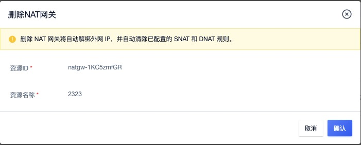
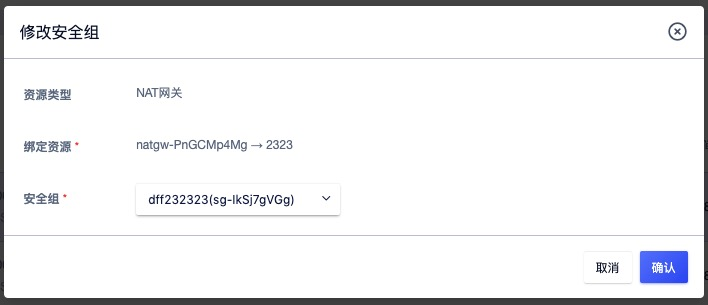
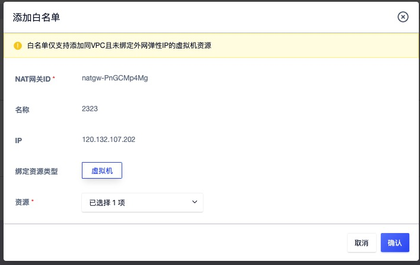
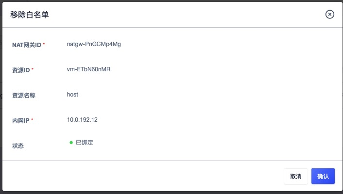

# 11 NAT 网关

## 11.1 NAT 网关简介

### 11.1.1 概述

NAT 网关（ NAT Gateway ）是一种类似 [NAT](https://zh.wikipedia.org/wiki/网络地址转换) 网络地址转换协议的 VPC 网关，为云平台资源提供 SNAT 和 DNAT 代理，支持互联网地址转换能力，并支持普通和白名单两种资源网络出口模式。

用户可通过 NAT 网关让 VPC 子网中未绑定外网 IP 的虚拟机访问外网，同时可配置端口转发规则使虚拟机、数据库 MySQL 及 Redis 服务对外提供服务。作为一个虚拟网关设备，需要绑定外网 IP 作为 NAT 网关的默认统一出口，支持普通和白名单两种网络出口模式。

- 普通模式下，NAT 网关指定子网中所有未绑定外网 IP  的云资源，均可通过 NAT 网关访问互联网或 IDC 数据中心的物理网络。
- 白名单模式下，NAT 网关指定子网中且在白名单中定义的云资源，才可通过 NAT 网关访问互联网或 IDC 数据中心的物理网络。

同时网关提供 DNAT 能力，支持配置基于 TCP 和 UDP 两种协议的端口转发，将 VPC 内的云资源内网端口映射到 NAT 网关所绑定的外网 IP，对互联网或 IDC 数据中心网络提供服务。NAT 网关具有地域（数据中心）属性，仅支持相同数据中心下同 VPC 虚拟资源的 SNAT 和 DNAT 转发服务，

虚拟机通过 NAT 网关可访问的网络取决于绑定的外网 IP 所属网段在物理网络上的配置，若所绑定的外网 IP 可通向互联网，则虚拟机可通过 NAT 网关访问互联网；若所绑定的外网 IP 可通向 IDC 数据中心的物理网络，则虚拟机通过 NAT 网关访问 IDC 数据中心的物理网络。

### 11.1.2 应用场景

用户在平台使用虚拟机部署应用服务时，有访问外网或通过外网访问虚拟机的应用场景，通常我们会在每一台虚拟机上绑定一个外网 IP 用于和互联网或 IDC 数据中心网络进行通信。真实环境和案例中，可能无法分配足够的公网 IP ，即使公网 IP 足够也无需在每一台需要访问外网的虚拟机上绑定外网 IP 地址。

- 共享 EIP ：通过 SNAT 代理，使多台 VPC 内网虚拟机共享 1 个 外网 IP 地址访问互联网或 IDC 数据中心的物理网络。
- 屏蔽真实 IP ：通过 SNAT 代理，多台 VPC 内网虚拟机使用代理 IP 地址通信，自动屏蔽真实 IP 内网地址。
- VPC 内网虚拟机提供外网服务：通过 DNAT 代理，配置 IP 及端口转发，对互联网或 IDC 数据中心的网络提供业务服务。

### 11.1.3 架构原理

平台产品服务底层资源统一，NAT 网关实例为主备高可用集群架构，可实现 NAT 网关故障自动切换，提高 SNAT 和 DNAT 服务的可用性。同时结合外网 IP 地址，根据 NAT 配置为租户虚拟资源提供 SNAT 和 DNAT 代理。

在产品层面，租户通过申请一个 NAT 网关，指定 NAT 网关可允许通信的子网，通过绑定【外网 IP】使多子网下虚拟机与互联网或 IDC 数据中心物理网进行通信，具体逻辑架构图如下：

- 平台支持同 VPC 多子网虚拟机使用 NAT 网关访问互联网或 IDC 数据中心网络。
- 当多个子网中未绑定外网 IP 的虚拟机关联 NAT 网关时，平台将自动在虚拟机中下发访问外网的路由。
- 虚拟机通过下发的路由，将访问外网的数据通过 NAT 网关透传至已绑定的【外网 IP】。
- 透传至外网 IP 的数据通过平台 OVS 及物理网卡将数据包发送至物理交换机，完成数据 SNAT 的通信。
- 当外网需要访问 VPC 中的虚拟机或 MySQL 服务时，可通过 NAT 网关端口转发，使互联网或 IDC 物理网通过 NAT 网关已绑定的 IP+端口 访问 VPC 内网服务。

NAT 网关 SNAT 功能支持白名单模式，即仅支持多子网中已添加至白名单的虚拟机通过 NAT 网关提供 SNAT 地址转换服务。

### 11.1.4 功能特性

云平台提供 NAT 网关全生命周期管理，包括 NAT 网关的增删改查、模式设置、DNAT 端口转发及资源绑定等。

* **多子网绑定**

  NAT 网关服务的核心价值是为平台虚拟机提供 SNAT 和 DNAT 的功能，节省 IP 地址的同时提升部署效率。一个 VPC 支持多个子网，NAT 网关可为指定的多个子网同时提供地址转换服务，使【**多个子网**】中的虚拟机均通过 NAT 网关与外网或 IDC 物理网进行通信。

  * 用户可将一个 VPC 中的一个子网绑定至 NAT 网关，也可将一个 VPC 中的部分子网绑定至 NAT 网关。
  * 支持用户将一个 VPC 中的所有子网绑定至 NAT 网关，同时支持用户移除部分子网。
  * 指定子网后，子网下未绑定外网 IP 且在白名单中的虚拟机可通过 NAT 网关与外界通信。

* **SNAT 能力**

  NAT 网关支持 SNAT（Source Network Address Translation 源地址转换），即 VPC 子网 IP 地址转换为外网 IP 地址进行网络访问。通过 SNAT 功能，关联 NAT 网关的虚拟机可在不绑定外网 IP 的情况下，与外网通信。

  * 在虚拟机未绑定外网 IP 地址的情况下，NAT 绑定的外网 IP 将作为所有关联虚拟机的默认网络出口，共享外网 IP 地址访问互联网信息和服务。
  * 若虚拟机已添加 NAT 网关白名单在绑定外网 IP 时，默认会将虚拟机从 NAT 网关白名单移除，以虚拟机绑定的外网 IP 地址为虚拟机的默认出口。

* **出口模式：NAT 网关支持多种网络出口模式，包括普通模式和白名单模式。**
  * 普通模式下 NAT 网关指定子网中所有未绑定外网 IP 的虚拟机，均可通过 NAT 网关访问外网或 IDC 数据中心的网络。
  * 白名单模式下 NAT 网关指定子网中且在白名单中定义的云资源，才可通过 NAT 网关访问外网或 IDC 数据中心的网络。
  * 支持修改出口模式，从普通模式切换到白名单模式，则白名单生效。若从白名单模式切换到普通模式，则白名单失效，网关所关联的子网中的虚拟机均可通过 NAT 网关与外界通信。

* **DNAT 能力**

  NAT 网关支持 DNAT（Destination Network Address Translation 目的地址转换），也称为端口转发或端口映射，即将外网 IP 地址转换为 VPC 子网的 IP 地址提供网络服务。

  - 支持 TCP 和 UDP 两种协议的端口转发，支持对端口转发规则进行生命周期管理。
  - 支持批量进行多端口转发规则配置，即支持映射端口段，如 TCP:1024~TCP:1030 。
  - NAT 网关绑定外网 IP 时，端口转发规则为 VPC 子网内的虚拟机提供互联网外网服务，可通过外网访问子网内的虚拟机服务。

* **监控告警**

  平台支持对 NAT 网关进行监控数据的收集和展示，通过监控数据展示每一个 NAT 网关的指标数据，同时支持为每一个监控指标设置阈值告警及通知策略。支持的监控指标包括网络出/带宽、网络出/包量及连接数。

  支持查看一个 NAT 网关多时间维度的监控数据，包括 1 小时、6 小时、12 小时、1 天、7 天、15 天及自定义时间的监控数据。默认查询数提成为 1 小时的数据，最多可查看 1 个月的监控数据。

* **NAT 网关安全**

  NAT 网关的网络访问控制可以关联安全组给予安全保障，通过安全组的规则可控制到达 NAT 网关 所绑定外网 IP 的入站流量及出站流量，支持 TCP、UDP、ICMP、GRE 等协议数据包的过滤和控制。

  安全组及安全组的规则支持对已关联安全组的 NAT 网关的流量进行限制，仅允许安全组规则内的流量透传安全组到达目的地。

* **NAT 网关高可用**

  NAT 网关实例支持高可用架构，即至少由 2 个虚拟机实例构建，支持双机热备。当一个 NAT 网关的实例发生故障时，支持自动在线切换到另一个虚拟机实例，保证 NAT 代理业务正常。同时基于外网 IP 地址的漂移特性，支持在物理机宕机时，保证 SNAT 网关出口及 DNAT 入口的可用性。

* **NAT 网关隔离性**

  - 资源隔离
    - NAT 网关具有数据中心属性，不同数据中心间 NAT 网关资源物理隔离；
    - NAT 网关资源在租户间相互隔离，租户可查看并管理账号及子账号下所有 NAT 网关资源；
    - 一个租户内的 NAT 网关资源，仅支持绑定租户内同数据中心的 VPC 子网资源；
    - 一个租户内的 NAT 网关资源，仅支持绑定租户内同数据中心的外网 IP 资源；
    - 一个租户内的 NAT 网关资源，仅支持绑定租户内同数据中心的安全组资源。
  - 网络隔离
    - 不同数据中心间 NAT 网关资源网络相互物理隔离；
    - 同数据中心 NAT 网关网络采用 VPC 进行隔离，不同 VPC 的 NAT 网关资源无法相互通信；
    - NAT 网关绑定的外网 IP 网络隔离取决于用户物理网络的配置，如不同的 Vlan 等。

## 11.2 使用流程

在使用 NAT 网关服务前，需根据业务需求规划 NAT 网关的 VPC 网络及外网 IP 网络，并根据业务需求将多台虚拟机绑定至 NAT 网关。具体流程如下：

1. 租户根据需求创建 VPC 和 子网，并在多个子网中创建虚拟机；
2. 租户根据需求创建 外网 IP 地址，并通过 API 或控制台指定网络类型、关联子网及绑定的出口 IP 地址，创建一个 NAT 网关；
4. 若 NAT 网关的网络出口模式为默认，则关联子网中所有未绑定公网 IP 的虚拟机可通过 NAT 网关访问外网；
5. 若 NAT 网关的网络出口模式为白名单，则关联子网中所有未绑定公网 IP 且添加至白名单列表中的虚拟机可通过 NAT 网关访问外网；
6. 租户可通过 NAT 网关的端口转发功能，配置需要通过外网访问 VPC 网络中未绑定公网 IP 的虚拟机及服务。

## 11.3 创建 NAT 网关

用户在平台创建 NAT 网关需指定机型、VPC 网络、子网、外网 IP 、安全组及 NAT 网关名称和备注信息。可通过导航栏进入【NAT 网关】资源控制台，通过“创建 NAT 网关”进入创建向导页面，如下图所示：

1. 选择并配置 NAT 网关基础配置及网络设置信息：

- 机型：NAT 网关实例所在宿主机的集群类型，由平台管理员自定义（如 x86 机型）。
- 名称/备注：NAT 网关的名称及备注信息。
- VPC 网络：NAT 网关所服务的 VPC 网络，即 NAT 网关仅为所选择的 VPC 内资源提供 SNAT 和 DNAT 服务，同时在白名单模式下，仅支持添加相同 VPC 网络的虚拟机进入白名单通过 NAT 网关访问外网。
- 子网：NAT 网关实例所在子网，通常建议选择可用 IP 数量充足的子网。
- 外网 IP ：NAT 网关地址所使用的外网 IP 地址，VPC 网络内绑定的资源均通过 NAT 网关所绑定的外网 IP 地址访问互联网或 IDC 物理网络，仅支持绑定有默认路由的外网 IP 地址。
- 安全组：NAT 网关的外网 IP 地址所使用的安全组，控制可进入 NAT 网关的流量。

2. 选择并配置以上信息后，可选择购买数量和付费方式，确认订单金额并点击“立即购买” 进行 NAT 网关创建：

- 购买数量：按照所选配置及参数批量创建 NAT 网关实例，一次仅支持创建 1 个 NAT 网关实例。
- 付费方式：选择 NAT 网关的计费方式，支持按时、按年、按月三种方式，可根据需求选择适合的付费方式。
- 合计费用：用户选择 NAT 网关资源按照付费方式的费用展示。

确认订单无误后点击立即购买，点击立即购买后，会返回 NAT 网关资源列表页，在列表页可查看 NAT 网关的创建过程，通常会先显示“创建中”的状态，创建成功后转换为“**运行**”。

> 允许在一个 VPC 下创建多个 NAT 网关，将 VPC 下的虚拟机分批添加至多个 NAT 网关中，实现 NAT 网关分流，应对大批量虚拟机共享外网 IP 地址访问外网的场景。

## 11.4 查看 NAT 网关

通过导航栏进入 NAT 网关资源控制台，可查看 NAT 网关资源列表，并可通过列表上名称和 ID 进入详情页面查看 NAT 网关的概览及监控信息，同时可切换至白名单标签页对 NAT 网关的白名单进行管理。

### 11.4.1 NAT 网关列表

NAT 网关列表可查看当前账户下所有 NAT 网关的资源信息，包括名称、资源 ID、VPC、子网、安全组、外网 IP、创建时间、过期时间、计费方式、状态及操作项，如下图所示：

- 名称/ID：NAT 网关的名称及全局唯一标识符。
- 外网 IP：NAT 网关所绑定的外网 IP 地址，加入至白名单的虚拟机均通过该 IP 地址访问外网。
- 状态：NAT 网关的运行状态，包括创建中、运行、删除中等。
- 创建时间/过期时间：指当前 NAT 网关的创建时间和费用过期时间。
- 计费方式：指当前 NAT 网关创建时指定的计费方式。

列表上操作项是指对单个 NAT 网关实例的操作，包括删除及修改安全组等，可通过搜索框对 NAT 网关资源列表进行搜索和筛选，支持模糊搜索。

为方便租户对资源的统计及维护，平台支持下载当前用户所拥有的所有 NAT 网关资源列表信息为 Excel 表格；同时支持对 NAT 网关进行批量删除操作。

### 11.4.2 NAT 网关详情

在 NAT 网关资源列表上，点击“**名称**” 可进入概览页面查看当前 NAT 网关实例的详细信息，同时可切换至白名单页面对当前 NAT 网关的白名单进行管理，如概览页所示：

**（1）基本信息**

NAT 网关的基本信息，包括名称、ID、VPC 网络、子网、外网 IP、安全组、状态、计费方式、创建时间、过期时间及告警模板信息，可点击告警模板右侧按钮修改 NAT 网关所关联的告警模板。

**（2）监控信息**

NAT 网关实例相关的监控图表及信息，包括网卡入/出带宽、网卡入/出包量及连接数，支持查看 1 小时、6 小时、12 小时、1 天及自定义时间的监控数据。

**（3）白名单管理**

NAT 网关绑定白名单管理，即可通过 NAT 网关访问外网的虚拟资源管理，包括白名单资源的添加、查看及移除操作等，详见[白名单管理](#_119-白名单管理)。

## 11.5 修改告警模板

修改告警模板是对 NAT 网关的监控数据进行告警的配置，通过告警模板定义的指标及阈值，可在 NAT 网关相关指标故障及超过指标阈值时，触发告警，通知相关人员进行故障处理，保证 NAT 网关及业务的网络通信。

用户可通过 NAT 网关详情概览页的操作项进行告警模板修改操作，在修改告警模板向导中选择新 NAT 网关告警模板进行修改。

## 11.6 删除 NAT 网关

用户可通过控制台或 API 的方式删除不需要的 NAT 网关实例，删除时会自动解绑已绑定的外网 IP 地址，并清除NAT 网关已添加的白名单资源及路由策略等。

NAT 网关被删除后即直接销毁，请在删除前确保 NAT 网关无业务流量访问外网请求，否则可能影响业务访问。

## 11.7 修改名称和备注

修改 NAT 网关资源的名称和备注，在任何状态下均可进行操作。可通过点击 NAT 网关资源列表页面每个 NAT 网关名称右侧的“编辑”按钮进行修改。

## 11.8 修改安全组

绑定至 NAT 网关的安全组策略作用于 NAT 网关出口的外网 IP ，用于限制通过 NAT 网关出口流量。支持修改 NAT 网关的安全组，用户可通过 NAT 网关列表操作项中的“**修改安全组**”进行修改操作，如下图所示：

一个 NAT 网关仅支持绑定一个安全组，修改成功安全组即时生效，平台会以新的安全组策略对进出 NAT 网关的流量进行限制，用户可通过 NAT 网关列表及详细信息查看已修改的安全组信息。

## 11.9 白名单管理

白名单是指通过 NAT 网关绑定的外网 IP 地址访问互联网或 IDC 数据中心网络的虚拟机资源集合，支持一台或多台虚拟机资源。若一台虚拟机已被添加至一个 NAT 网关白名单，则不允许在添加至其它 NAT 网关白名单中。

白名单仅支持 SNAT 功能，不对 DNAT 端口转发能力进行限制，即添加至白名单的虚拟机可通过 NAT 网关访问外网或 IDC 物理网；无论虚拟机是否添加至白名单，均可通过添加 DNAT 端口转发规则，使外网通过 NAT 网关的外网 IP 访问虚拟机部署的业务服务。

### 11.9.1 添加白名单

NAT 网关白名单仅支持添加未绑定外网 IP 地址的虚拟机资源，添加白名单前需确保虚拟机和 NAT 网关在同一个 VPC 网络中且状态必须为运行状态。用户可通过 NAT 网关详情页面 “白名单” 控制台中的“添加白名单”进入白名单添加向导页面，如下图所示：

在向导页面选择需要添加至 NAT 网关白名单，仅支持添加与 NAT 网关相同 VPC 且未绑定网 IP 地址的虚拟机资源。添加过程中，白名单虚拟机资源的状态为“绑定中”，待虚拟机的状态转换为 “已绑定” 时，即代表绑定成功。

同时 NAT 网关会自动下发 NAT 网关外网 IP 所属网段配置的路由到白名单的虚拟机中，使虚拟机可通过 NAT 网关访问互联网或 IDC 数据中心网络，可在虚拟机中查看与互联网的联通性。

> 可通过 netstat -rn  命令在 Linux 虚拟机中查看 NAT 网关自动下发的路由信息。

### 11.9.2 查看白名单

用户通过 NAT 网关详情页面的“白名单列表” 可查看已添加至当前网关的虚拟机列表和信息，包括 NAT 网关、资源 ID、资源名称、内网 IP、状态、创建时间及操作项，如下图所示：

- 资源名称/ID ：已添加至 NAT 网关白名单的虚拟机的名称和全局唯一标识符。
- 内网 IP ：已添加至 NAT 网关白名单的虚拟机内网 IP  地址。
- 创建时间：当前虚拟机绑定至 NAT 网关白名单的时间。
- 状态：当前白名单资源的状态，包括绑定中、已绑定、解绑中。

列表上操作项是指对单条白名单资源的移除操作，为方便租户对资源的统计及维护，平台支持下载当前 NAT 网关所添加的所有白名单资源列表信息为 Excel 表格，同时支持对 NAT 网关白名单资源进行批量移除操作。

### 11.9.3 移除白名单

移除白名单指将一个虚拟机从 NAT 网关白名单解绑，可通过白名单资源列表操作项中的”移除白名单“功能进行虚拟机解绑操作。具体解绑操作如下图所示：

解绑过程中，白名单虚拟机状态为“解绑中”，待列表上解绑的资源被清除即代表解绑成功。解绑后不影响虚拟机本身的正常运行，自动下发的路由将清除，即不可通过 NAT 网关访问外网，可通过重新加入白名单或绑定外网 IP 地址访问外网。