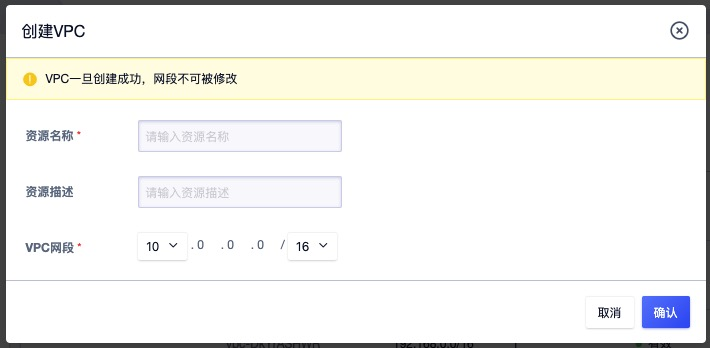
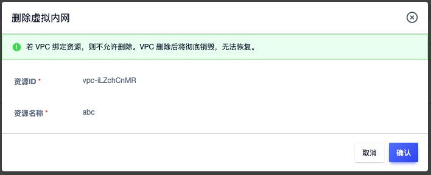
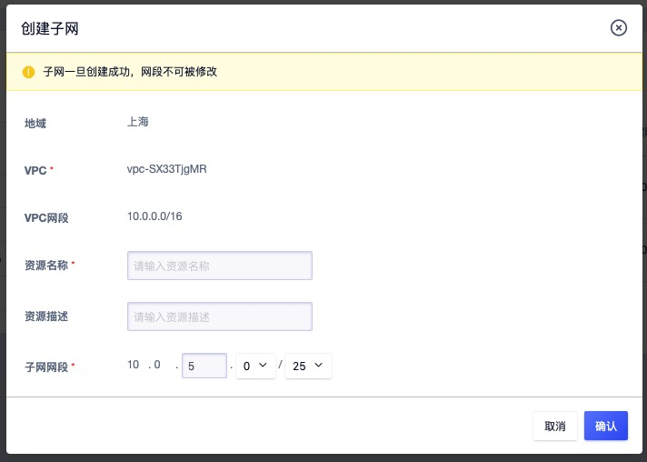
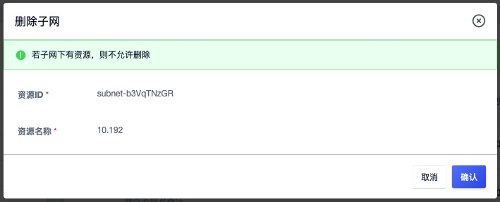

# 7 私有网络

## 7.1 VPC 简介

### 7.1.1 概述

UCloudStack 通过软件定义网络 （ SDN ）对传统数据中心物理网络进行虚拟化，采用 OVS 作为虚拟交换机，VXLAN 隧道作为 OverLay 网络隔离手段，通过三层协议封装二层协议，用于定义虚拟私有网络 VPC 及不同虚拟机 IP 地址之间数据包的封装和转发。

私有网络（ VPC ——Virtual Private Cloud ）是一个属于用户的、逻辑隔离的二层网络广播域环境。在一个私有网络内，用户可以构建并管理多个三层网络，即子网（ Subnet ），包括网络拓扑、IP 网段、IP 地址、网关等虚拟资源作为租户虚拟机业务的网络通信载体。

私有网络 VPC 是虚拟化网络的核心，为云平台虚拟机提供内网服务，包括网络广播域、子网（IP 网段）、IP 地址等，是所有 NVF 虚拟网络功能的基础。私有网络是子网的容器，不同私有网络之间是绝对隔离的，保证网络的隔离性和安全性。

用户可通过将虚拟机、负载均衡、弹性网卡、NAT 网卡等虚拟资源加入至私有网络的子网中，提供类似传统数据中心交换机的功能，支持自定义规划网络，并可通过安全组实现同 VPC 子网间的安全防护。

> 可通过专线、VPN、混合云物理 IP 接入等方式将 VPC 与传统数据中心组成一个按需定制的混合云网络环境。

VPC 网络具有地域属性，每个私有网络只能属于一个地域，地域间网络完全隔离，资源默认内网不通；同时租户内和租户间 VPC 网络默认不通，从不同维度保证租户网络和资源的隔离性。

### 7.1.2 VPC 逻辑结构

一个 VPC 网络主要由私有网络网段和子网两部分组成，如下图所示：

**（1）私有网络网段**

VPC 网络所属的 CIDR  网段，作为 VPC 隔离网络的私网网段。关于 CIDR 的相关信息，详见 [CIDR](https://en.wikipedia.org/wiki/Classless_Inter-Domain_Routing) 。创建 VPC 网络需指定私有网段，平台管理员可通过管理控制台自定义 VPC 私有网络的网段，使租户的虚拟资源仅使用管理员定义网段的 IP 地址进行通信。平台 VPC 私有网络 CIDR 默认支持的网段范围如下表所示：

| 网段           | 掩码范围 | IP 地址范围                   |
| -------------- | -------- | ----------------------------- |
| 10.0.0.0/8     | 8 ~ 29   | 10.0.0.0 - 10.255.255.255     |
| 172.16.0.0/12  | 12 ~ 29  | 172.16.0.0 - 172.31.255.255   |
| 192.168.0.0/16 | 16 ~ 29  | 192.168.0.0 - 192.168.255.255 |

> 由于 DHCP 及相关服务需占用 IP 地址，私有网络 CIDR 网段不支持 `30` 位掩码的私有网段。

**（2）子网**

子网（ Subnet ）是 VPC 私有网络的基础网络地址空间，用于虚拟资源间内网连接。

* 一个私有网络至少由一个子网组成，子网的 CIDR 必须在 VPC 的 CIDR 网段内；
* 同一私有网络内子网间通过`公共网关`连接，资源默认内网互通，可部署虚拟机、负载均衡、NAT 网关、Redis、MySQL 及 IPSecVPN 网关等；
* 同一个 VPC 子网间默认通过公共网关进行互通；
* 子网 CIDR 网段拔码最小为 `29` 位，不支持 `30` 、`32` 位掩码的子网网段； 
* 每个子网中，使用第一个可用 IP 地址作为网关，如 `192.168.1.0/24` 的网关地址是 `192.168.1.1` 。

> 当子网中存在虚拟资源时，不允许删除并销毁私有网络和子网资源。

### 7.1.3 VPC 连接

平台对常用网络设备均进行软件定义及组件抽像，通过将 VPC 网络与虚拟机、弹性网卡、外网 IP、安全组、NAT 网关、负载均衡、VPN 网关、MySQL 数据库、Redis 缓存及专线等组件连接，可快速构建和配置繁杂的网络环境及混合云场景，如下图所示：

* 虚拟机默认内网网卡（创建时自带的虚拟网卡）加入同一个 VPC 网络实现虚拟机间网络通信，并可通过安全组保证虚拟机东西向流量安全。
* 虚拟机默认外网网卡（创建时自带的虚拟网卡）可直接绑定多个外网 IP 地址实现 Internet 访问，同时可绑定与 IDC 物理网络相连的外网 IP 地址实现物理网络打通，结合安全组管控虚拟机南北向流量的同时，构建安全可靠的混合接入环境。
* 虚拟机的弹性网卡加入不同的 VPC 网络及子网，实现精细化网络管理及廉价故障转移方案，同时将安全组与弹性网卡绑定，通过安全组规则多维度保障私有网络及虚拟资源的安全。
* 虚拟机与 UDB、URedis 服务加入同一个 VPC 网络，满足业务应用和数据库、缓存服务连通场景。
* 相同 VPC 网络的虚拟机可通过 NAT 网关及外网 IP 连接，共享外网 IP 访问 Internet 或 IDC 数据中心网络，并可通过 DNAT 端口映射对外提供业务服务。
* 相同 VPC 网络的虚拟机加入至内网 ULB 后端服务节点，提供 VPC 网络内负载均衡服务。
* 相同 VPC 网络的虚拟机加入到外网 ULB 后端服务节点，结合 ULB 关联的外网 IP ，提供外网负载均衡服务。
* 相同 VPC 网络的虚拟机通过 IPSecVPN 网关可与不同 VPC 网络的虚拟机进行内网互联，实现 VPC 间互通。
* 通过 IPSecVPN 网关打通不同 VPC 间的网络，使两个 VPC 间的虚拟机可直接进行内网通信。
* 采用 IPSecVPN 网关或专线将平台与本地 IDC 数据中心及第三方云平台连通，构建安全可靠的混合云环境。

> 外网 IP 可用于打通 IDC 数据中心的物理网络，应用与虚拟机直接与物理机进行内网通信的场景；IPSecVPN 网关用于打通第三方云平台或 IDC 数据中心的虚拟网络，应用于不同云平台间通过 VPN 安全连接场景。

### 7.1.4 功能与特性

平台 VPC 网络基于租户控制台和 API 提供隔离网络环境、自定义子网、子网通信及安全防护等功能，并可结合硬件及 DPDK 等技术特性提供高性能的虚拟网络。

* 隔离的网络环境

  私有网络基于 [OVS](http://www.openvswitch.org/)（ Open vSwitch）组件，通过 [VXLAN](https://datatracker.ietf.org/doc/rfc7348/) 隧道封装技术实现隔离的虚拟网络。每一个 VPC 网络对应一个 VXLAN 隧道号（VNI），作为全局唯一网络标识符，为租户提供一张独立且完全隔离的二层网络，可通过在私有网络中划分多个子网作为虚拟资源的通信载体，用于连通多个虚拟资源。不同的 VPC 网络间完全隔离，无法直接通信。

* 自定义子网

  支持在一个 VPC 网络内进行三层网络规划，即划分一个或多个子网。提供自定义 IP 网段范围、可用 IP 网段及默认网关，可在子网中通过虚拟机部署应用程序和服务。支持在子网中增加多个弹性网卡，分别指定子网中的 IP 地址，并绑定至部署应用程序的虚拟机，用于精细化管理应用服务的网络访问。

* 子网通信

  每一个子网都属于一个广播域，VPC 网络默认提供网关服务，同一个 VPC 内不同子网通过网关进行通信。

* 安全防护

  云平台提供内网安全组和外网防火墙，通过协议、端口为虚拟资源提供多维度安全访问控制，同时基于虚拟网卡及虚拟实例的网络流量进行上下行的 QoS 控制，全方位提高 VPC 网络的安全性。安全组为有状态安全层，可分别设置出入方向的安全规则，用于控制并过滤进出子网 IP 的数据流量。

* 高性能虚拟网络

  SDN 网络分布式部署于所有计算节点，节点间通过 20GE 冗余链路进行通信，并通过所有计算节点负载内网流量，为云平台提供高可靠及高性能的虚拟网络。

云平台在保证网络隔离、网络规模、网络通信及安全的同时，为租户和子帐号提供 VPC 子网的创建、修改、删除及操作审计日志等全生命周期管理。用户创建虚拟机、NAT 网关、负载均衡、VPN 网关、MySQL 及  Redis 等虚拟资源时可指定需加入的VPC 网络和子网，并可查询每个子网的可用 IP 数量。

VPC 网络具有数据中心属性，不同数据中心之间的虚拟资源默认内网不互通，同数据中心内不同 VPC 间默认内网不互通，同一个 VPC 的所有子网和资源默认内网互通。仅支持指定相同数据中心的虚拟资源到 VPC 网络中，且每个 VPC 网络的子网网段必须在 VPC 网络的 CIDR 网段中。

平台会通过管理员配置的 VPC 网络，为每个租户和子账号提供默认的 VPC 网络和子网资源，方便用户登录云平台快速部署业务。

## 7.2 创建 VPC

用户可通过指定 VPC 名称和 [CIDR](https://en.wikipedia.org/wiki/Classless_Inter-Domain_Routing) 网段一键添加一个 VPC 网络，用于搭建不同业务的网络环境。VPC 创建成功网段即不可修改，创建 VPC 网络需提前规划网络，如规划业务 IP 网段及 IP 地址。

通过导航栏进入 “VPC 网络”资源列表页面，即可创建 VPC 网络，如下图所示：

选择并配置 VPC 网络的名称及网段信息：

- VPC 名称：当前需要创建的 VPC 网络的名称标识；
- VPC 网段：VPC 网络所包含的 IP 网段，创建成功后无法修改，VPC 下所有子网共享该网段 IP 地址。

VPC 网络创建时状态为“创建中”，待状态转换为“有效”时，即代表 VPC 网络创建成功，通常可在 5 秒内完成 VPC 网络的创建，用户可通过 VPC 列表查看已创建的 VPC 资源信息。

## 7.3 查看私有网络

通过导航栏进入 VPC 网络控制台，可查看 VPC 网络资源的列表，并可通过列表上 VPC 名称可进入详情页面查看 VPC 网络及子网资源的详情信息。

### 7.3.1 私有网络列表

VPC 网络列表页可查看当前帐户下 VPC 资源的列表及相关信息，包括名称、资源 ID、网段、子网数量、状态、创建时间及操作项，如下图所示：

- 名称/ID ：VPC 私有网络的名称及全局唯一标识符；
- 网段：当前 VPC 网络在创建时指定的 CIDR 网段信息；
- 子网数量：当前 VPC 网络包含的子网数量；
- 状态：当前 VPC 网络的状态，一般为有效；
- 创建时间：当前 VPC 网络资源的创建时间；

列表上的操作项是可对单个 VPC 网络进行删除操作，可通过搜索框对 VPC 列表进行搜索和筛选，支持模糊搜索。

为方便租户对硬盘资源的统计及维护，平台支持下载当前用户所拥有的所有 VPC 网络资源列表信息为 Excel 表格；同时支持对 VPC 网络进行批量删除操作。

### 7.3.2 私有网络详情

在 VPC 网络列表上，点击 VPC 名称或 ID 可进入概览页面查看当前 VPC 网络的详情及子网信息，同时可切换至操作日志页面查看当前 VPC 网络及子网的操作日志信息，如下图概览页所示：

**（1）基本信息**

VPC 网络的基本信息，包括资源 ID、资源名称、地域（数据中心）、网段、创建时间及状态。

**（2）子网管理**

VPC 详情页面展示当前 VPC 网络中已创建的子网资源列表，包括名称、资源 ID、网段、状态、创建时间及对子网的操项，其中网段指当前子网的网段，包含在 VPC 网络的网段中。

子网列表上的操作项是可对单个子网进行删除操作，仅支持删除未被资源使用的子网资源。为方便租户对子网资源的维护，平台支持子网的批量删除操作。

## 7.4 修改名称和备注

修改 VPC 私有网络的名称和备注，在任何状态下均可进行操作。可通过 VPC 私有网络列表页面每个 VPC 名称右侧的“编辑”按钮进行修改。

## 7.5 删除私有网络

支持用户删除并释放未被任何资源占用 IP 地址的 VPC 网络。VPC 网络删除后会被彻底销毁，删除前须保证已清空 VPC 网络已创建的资源。删除操作如下图所示：

## 7.6 添加子网

添加子网是指为一个 VPC 网络添加子网，即三层网络，用于组建属于用户业务的私有网段，每一个网段是一个独立的广播域。子网的 CIDR 网段必须在 VPC 的 CIDR 网段内，同一子网内的资源默认内网互通，同一 VPC 下的所有子网默认互通。

用户可通过指定子网名称、子网 CIDR 网段为一个 VPC 网络添加一个或多个子网，用于构建内网不同的业务网络。创建子网前需保证 VPC 网络 CIDR 内有充足的 IP 网段，可通过 VPC 网络详情页面子网列表的“**创建子网**”进入创建向导页面，如下图所示

- 名称/描述：当前需要创建的子网的名称和描述信息；
- 子网网段：当前需要创建的子网的 CIDR 网段，子网网段必须在 VPC 的 CIDR 网段内，可以与 VPC CIDR 网段相同，即代表该子网包括 VPC 下所有的网络 IP 地址。

子网创建时状态为“创建中”，子网创建成功后，子网的状态转换为“有效”，可用于资源创建。

> 注：若子网网段的与 VPC 网段相同，则当前私有网络仅支持一个子网。

## 7.7 删除子网

用户可通过子网列表上的“**删除**”功能删除当前子网资源，被删除的子网将被直接销毁。删除子网前须保证子网内的资源已被清空，包含回收站的资源，否则不允许删除当前子网，如下图所示：

## 7.8 修改子网名称

修改子网的名称和备注，在任何状态下均可进行操作。可通过点击子网列表页面每个子网名称右侧的“编辑”按钮进行修改。

