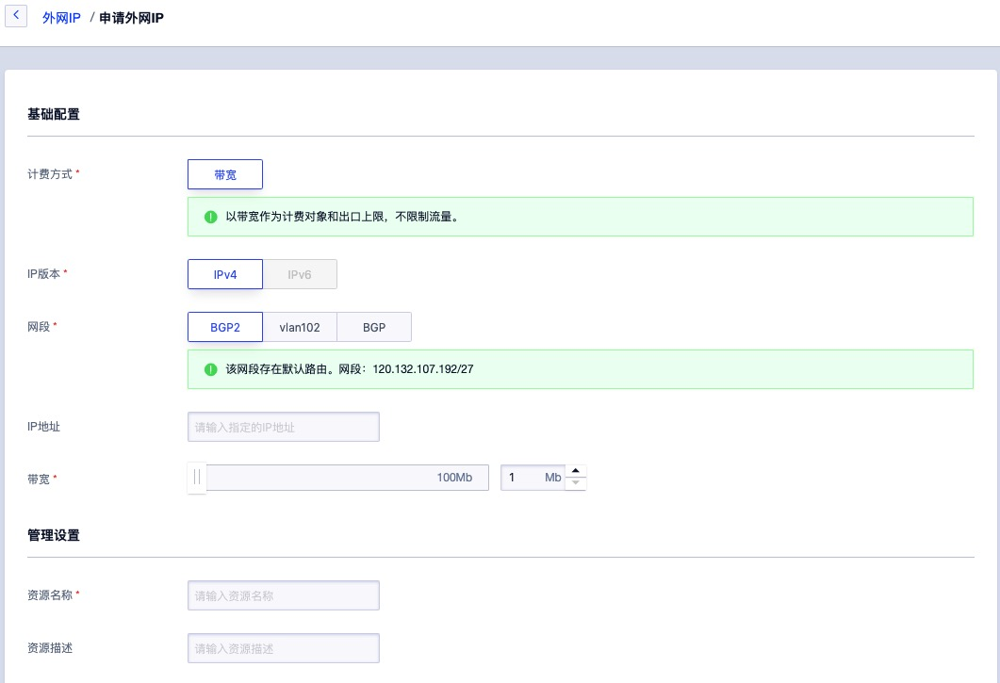

# 8 外网弹性 IP

##  8.1 EIP 简介

### 8.1.1 概述

外网弹性 IP（ Elastic IP Address ，简称 EIP ），是平台为用户的虚拟机、NAT 网关、VPN 网关及负载均衡等虚拟资源提供的外网 IP 地址，为虚拟资源提供平台 VPC 网络外的网络访问能力，如互联网或 IDC 数据中心物理网络，同时外部网络也可通过 EIP 地址直接访问平台 VPC 网络内的虚拟资源。

EIP 资源支持独立申请和拥有，用户可通过控制台或 API 申请 IP 网段资源池中的 IP 地址，并将 EIP 绑定至虚拟机、 NAT 网关、负载均衡、VPN 网关上，为业务提供外网服务通道。

### 8.2.2 物理架构

在私有云平台中，允许平台管理员自定义平台外网 IP 资源池，即由平台管理员自定义平台访问外网的方式，外网 IP 网段资源池在添加至云平台前，需要通过物理网络设备下发至计算节点连接的交换机端口。

如上图物理架构示意图所示，所有计算节点需要连接网线至物理网络的外网接入交换机，并在物理网络的交互机上配置所连接端口允许透传 Vlan 的网络访问方式，使运行在计算节点上虚拟机可通过外网物理网卡直接与外部网络进行通信：

* 若通过外网 IP 访问互联网，需要物理网络设备上将自定义的外网 IP 网段配置为可直通或 NAT 到互联网；
* 若通过外网 IP 访问 IDC 数据中心的物理网络，需要在物理网络设备上将自定义的外网 IP 网段配置为可与 IDC 数据中心网络通信，如相同的 Vlan 或 Vlan 间打通等。

> 物理网络架构为高可用示意图，实际生产环境架构可进行调整，如内外网接入交换机可合并为一组高可用接入交换机，通过不同的 Vlan 区分内外网等。

### 8.2.3 逻辑架构

物理网络架构及配置确认后，在平台层面需要分别添加互联网 IP 网段和 IDC 物理网段至云平台 IP 网段资源池中，租户可申请不同网段的 EIP 地址，并将通往不同网络的 EIP 地址绑定至虚拟机默认外网网卡，使虚拟机可通过外网 IP 地址同时访问互联网和 IDC 数据中心物理网络。

如逻辑架构图所示，用户在平台中分别添加通往 Internet (Vlan200) 和通往 IDC 物理网络（Vlan100）的网段至云平台。网段举例如下：

* Vlan200 的网段为`106.75.236.0/25` ，配置下发默认路由，即虚拟机绑定网段的 EIP 将会自动下发目标地址为 0.0.0.0/0 的默认路由；
* Vlan100 的网段为`192.168.1.0/24` ，仅下发当前网段路由，即虚拟机绑定网段的 EIP 仅下发目标地址为 192.168.1.0/24 的指定路由。

租户可分别申请 Vlan200 和 Vlan100 的 EIP 地址，并可将两个 EIP 同时绑定至虚拟机。平台会将 EIP 地址及下发路由直接配置至虚拟机外网网卡，并通过 SDN 控制器下发流表至虚拟机所在的物理机 OVS ，物理机 OVS 通过与物理机外网网卡接口及交换机进行互联，通过交换机设备与互联网或 IDC 物理网络进行通信。

当虚拟机需要访问互联网或物理网络时，数据会通过虚拟机外网网卡直接透传至物理机的 OVS 虚拟交换机，并通过 OVS 流表将请求转发至物理机外网网卡及物理交换机，经由物理交换机的 Vlan 或路由配置将数据包转发至互联网或 IDC 物理网络区域，完成通信。

如上图 VPC1 网络的虚拟机同时绑定了 Vlan100 和 Vlan200 网段的 EIP 地址，Vlan100 EIP 为 `192.168.1.2` ，Vlan200 EIP 为 `106.75.236.2` 。平台会直接将两个 IP 地址直接配置至虚拟机的外网网卡，通过虚拟机操作系统可直接查看配置到外网网卡的 EIP 地址；同时自动下发两个 IP 地址所属网段需要下发的路由到虚拟机操作系统中，虚拟机的默认路由指定的下一跳为 Vlan200 互联网网段的网关，使虚拟机可通过 `106.75.236.2`  IP 地址与互联网进行通信，通过 `192.168.1.2`  与物理网络区域的 Oracle 及 HPC 高性能服务器进行内网通信。

整个通信过程直接通过虚拟机所在物理机的物理网卡进行通信，在物理网卡和物理交换机性能保障的前提下，可发挥物理网络硬件的最佳转发性能，提升虚拟机对外通信的转发能力。同时所有外网 IP 流量均可通过平台安全组在平台内进行流量管控，保证虚拟机访问平台外部网络的安全性。

### 8.2.4 功能特性

EIP 为浮动 IP ，可随故障虚拟机恢复漂移至健康节点，继续为虚拟机或其它虚拟资源提供外网访问服务。

当一台虚拟机所在的物理主机发生故障时，智能调度系统会自动对故障主机上的虚拟机进行宕机迁移操作，即故障虚拟机会在其它健康的主机上重新拉起并提供正常业务服务。若虚拟机已绑定外网 IP ，智能调度系统会同时将外网 IP 地址及相关流表信息一起漂移至虚拟迁移后所在的物理主机，并保证网络通信可达。

* 支持平台管理员自定义外网 IP 资源池，即自定义外网 IP 网段，并支持配置网段的路由策略。租户申请网段的外网 IP 绑定至虚拟资源后，下发目的路由地址的流量自动以绑定的外网 IP 为网络出口。
* 外网 IP 网段支持下发默认路由和指定路由，下发默认路由代表默认所有流量均以绑定的外网IP为出口，指定路由为管理员指定目的地址的流量以绑定的外网IP为出口。
* **提供 IPv4/IPv6 双栈能力，管理员可自定义管理 IPv4 和 IPv6 网段资源池，并支持同时绑定 IPv4/IPv6 地址到虚拟机，为虚拟机提供双栈网络通信服务。**

- 支持外网 IP 网段的权限管控，可指定所有租户或部分租户使用，未被指定的租户无权限申请并使用网段 EIP。
- EIP 具有弹性绑定的特性，支持随时绑定至虚拟机、NAT 网关、负载均衡、VPN 网关等虚拟机资源，并可随时解绑绑定至其它资源。
- 虚拟机支持绑定 10 个外网 IPv4 和 10 个外网 IPv6 地址，以第一个有默认路由的外网 IP 作为虚拟机的默认网络出口。
- 提供外网 IP 网段获取服务，支持租户手动指定 IP 地址申请  EIP，并提供 IP 地址冲突检测，方便用户业务网络地址规划。
- 平台管理员可自定义外网 IP 网段的带宽规格，租户可在带宽规格范围内配置外网 IP 的带宽上限。

外网 IP 具有数据中心属性，仅支持绑定相同数据中心的虚拟资源。用户可通过平台自定义申请 EIP ，并对 EIP 进行绑定、解绑、调整带宽等相关操作。

## 8.2 申请外网 IP 

申请 EIP 是指租户通过控制台从管理员自定义的外网 IP 网段中申请一个 IPv4 或 IPv6 的外网 IP 地址，并将 IP 地址绑定至虚拟机、负载均衡、NAT 网关、VPN 网关、MySQL 及 Redis 等资源，为虚拟资源提供外网访问能力。

申请 EIP 时需指定 IP 版本、所属网段、IP 地址、资源名称及带宽上限等信息，可通过导航栏进入【外网 IP】资源控制台，通过“申请外网 IP” 进入向导页面，如下图所示：

1. 选择并配置所申请外网 IP 基础配置及管理设置信息：

* 名称/描述：申请外网 IP 的名称和描述，申请时必须指定名称。

- 计费方式：资源的计费方式，目前仅支持带宽计费，即以带宽作为计费对象和出口上限，不限制流量。
- IP 版本：外网 IP 地址的 IP 版本，支持 IPv4 和 IPv6 。
  - 选择 IPv4 时，则网段仅展示 IPv4 的网段；
  - 选择 IPv6 时，则网段仅展示 IPv6 的网段，若平台管理员未定义 IPv6 网段，则 IP 版本仅支持 IPv4 。
- 网段：所申请外网 IP 的所属网段，由平台管理员自定义，同时会展示该网段的 IP 网段，手动指定的 IP 地址必须在网段 IP 地址范围内。
- IP 地址：用户手动指定 IP 地址申请 EIP ，指定的 IP  地址必须在所选网段的 IP 范围内。
- 带宽：所申请 EIP 资源的带宽出口上限，规格范围由平台管理员自定义，单位为 Mbps 。

2. 选择购买数量和付费方式，确认订单金额并点击“立即购买” 进行 EIP 的申请和创建。

- 购买数量：按照所选配置及参数批量创建多个 EIP 地址，当前支持批量创建 10 个 EIP ；
- 付费方式：选择 EIP 的计费方式，支持按时、按年、按月三种方式，可根据需求选择适合的付费方式；
- 合计费用：用户选择 EIP 资源按照付费方式的费用展示；
- 立即购买：点击立即购买后，会返回 EIP 资源列表页，在列表页可查看 EIP 的申请过程，通常会先显示“申请中”的状态，几秒内转换为“未绑定”状态，即代表申请成功。

## 8.3 查看外网 IP

通过导航栏进入外网 IP 控制台，可查看外网 IP 资源列表，并可通过列表上名称和 ID 进入详情页面查看外网 IP 的详细信息及操作日志等。

### 8.3.1 外网 IP 列表

外网 IP 列表可查看当前账户下所有 EIP 资源的列表信息，包括名称、资源 ID、IP、IP 版本、带宽、绑定资源、路由类型、计费方式、创建时间、过期时间、状态及操作项，如下图所示：

- 名称/ID：EIP 资源的名称及全局唯一标识符。
- IP 地址：EIP 资源的 IP 地址及网段名称，若 IP 版本为 IPv6 则显示为 IPv6 地址。
- IP 版本：EIP 地址的 IP 版本，如 IPv4 或 IPv6 。
- 带宽：EIP 资源申请时指定的带宽出口上限。
- 绑定资源：EIP 已绑定的资源名称和资源 ID ，资源类型可以为虚拟机、NAT 网关、负载均衡及 VPN 网关。
- 路由类型：EIP 地址所属网段定义的路由类型，包括默认路由和非默认路由（指定路由或未指定路由）。
  - 默认路由绑定至虚拟资源，会自动下发目标地址为 0.0.0.0/0 的路由，即默认路由；
  - 非默认路由绑定至虚拟资源，仅会下发用户指定目标地址的路由。
- 计费方式：EIP 地址的付费方式，包括按时、按年、按月。
- 创建时间/过期时间：EIP 资源的创建时间和费用过期时间。
- 状态：EIP 资源的状态，包括申请中、未绑定、绑定中、已绑定、解绑中、修改带宽中、删除中等状态。

列表上的操作项是指对单个外网 IP 地址的操作，包括绑定、解绑、修改带宽及删除等，可通过搜索框对外网 IP 列表进行搜索和筛选，支持模糊搜索。

为方便租户对资源的统计及维护，平台支持下载当前用户所拥有的所有外网 IP 资源列表信息为 Excel 表格；同时支持对外网 IP 进行批量解绑和批量删除操作。

### 8.3.2 外网 IP 详情

在外网 IP 资源列表上，点击名称或 ID 可进入概览页面查看当前外网 IP 的详细信息，同时可切换至操作日志页面查看当前外网 IP 的操作日志，如概览页所示：

- 基本信息：外网 IP 地址的基本信息，包括名称、ID、IP 地址、IP 版本、带宽、绑定资源、状态、创建时间及告警模板信息。

  - 可点击名称右侧按钮修改外网 IP 的名称和备注信息；
  - 可点击告警模板右侧按钮修改外网 IP 所关联的告警模板，虚拟机默认会绑定 Default 告警模板。

  > 仅当外网 IP 被绑定至虚拟机资源时，才可修改告警模板。

- 监控信息：当前外网 IP 地址的监控信息，包括网卡出带宽使用率、出/入带宽及出/入包量。

- 操作日志：操作日志页面展示当前外网 IP 的操作日志。可提供自定义时间级别的日志展示，同时可对日志进行模糊搜索，默认提供两周内的操作日志，可通过切换日期周期查看不同时间周期的操作日志。

## 8.4 绑定外网 IP

绑定外网 IP 是指将 EIP 地址绑定至虚拟机、NAT 网关、负载均衡、VPN 网关或 Redis、MySQL 服务，为虚拟资源提供外网服务能力。

* 虚拟机支持绑定 10 个 IPv4 和 10 个 IPv6 外网 IP 地址，默认以第一个有默认路由的 IP 地址作为虚拟机的默认网络出口。
* 虚拟机绑定外网 IP 地址后，系统会将外网 IP 地址及所属网段下发路由直接配置至虚拟机自带的默认外网网卡，通过虚拟机操作系统可直接查看所有绑定至虚拟机的外网 IP 地址及相关路由信息。
* NAT 网关仅支持绑定一个外网 IPv4 地址，不支持绑定 IPv6 外网 IP 地址。
* VPN 网关仅支持绑定一个外网 IPv4 地址，不支持绑定 IPv6 外网 IP 地址。
* 负载均衡仅支持绑定一个外网 IPv4 地址，不支持绑定 IPv6 外网 IP 地址。

一个外网 IP 同时仅支持绑定一个虚拟资源，仅支持未绑定状态的外网 IP 进行绑定操作，且被绑定的资源必须处于运行中、有效或关机状态。用户可通过外网 IP 资源列表操作项的“绑定”进入外网 IP 绑定向导页面，进行资源绑定操作，如下图所示：

绑定时需选择被绑定资源的类型及绑定资源对象：

* 资源类型：指被绑定对象的资源类型，支持绑定给虚拟机、负载均衡、NAT 网关、VPN 网关。
* 资源对象：指被绑定的资源对象，不同的资源类型可选的资源对象不同。
  * 虚拟机：可根据虚拟机名称及内网 IP 地址选择需绑定的虚拟机资源，不可选择至已绑定 10 个 IPv4 或 10 个 IPv6 地址的虚拟机；
  * 负载均衡：可根据名称和 ID 选择需绑定的负载均衡资源，仅支持选择未绑定外网 IP 地址且类型为外网的负载均衡实例；
  * NAT 网关：可根据名称和 ID 选择需绑定的 NAT 网关资源，仅支持选择未绑定外网 IP 地址的 NAT 网关；
  * VPN 网关：可根据名称和 ID 选择需绑定的 VPN 网关资源，仅支持选择未绑定外网 IP 地址的 VPN 网关。

绑定过程中外网 IP 地址的状态为“**绑定中**”，待状态变更为“**已绑定**”即代表绑定成功，用户也可通过被绑定资源查看绑定外网 IP 地址的信息。通常绑定会即时完成，可通过 `ping `  外网 IP 或相关网络工具测试绑定是否生效。

## 8.5 解绑外网 IP

解绑外网 IP 是指将 EIP 地址从一个虚拟资源上分离出来，并可重新绑定至其它虚拟资源。仅支持解绑已绑定状态的外网 IP 资源。用户可通过外网 IP 列表操作项进行外网 IP 的解绑操作，如下图所示：

解绑时，外网 IP 的状态转换为“解绑中”，待外网 IP 地址的状态转为换 “未绑定” ，即代表解绑成功，被解绑的资源网络或服务可能会受到影响。

* 虚拟机的外网 IP 地址被解绑后，不会影响虚拟机本身的内网通信。若解绑的外网 IP 地址为虚拟机默认网络出口，则系统会自动选择下一个有默认路由的外网 IP 作为虚拟机的默认网络出口。
* NAT 网关的外网 IP 地址被解绑后，会影响 NAT 网关的网络服务，所有 SNAT 及 DNAT 服务失效，即加入 NAT 网关的虚拟机无法通过 NAT 网关访问外网或对外提供服务，需重新绑定一个外网 IP 地址才可正常生效。
* 负载均衡的外网 IP 地址被解绑后，会影响负载均衡的网络服务，用户无法通过原外网 IP 地址负载访问服务节点中部署的服务。
* VPN 网关的外网 IP 地址被解绑后，会影响 VPN 网关的网络服务，IPSecVPN 两端内网无法进行通信，需重新绑定外网 IP 地址，并在对端平台或数据中心 VPN 网关处修改对端网关的 IP 地址为新绑定的 EIP 才可正常进行连接。

## 8.6 调整带宽

调整带宽是指对一个外网 IP 的带宽上限进行升级或降级，以适应业务对带宽的不同需求。可调整的带宽规格由云平台管理员在管理控制台上自定义，不同外网 IP 资源池支持不同的带宽规格配置。

支持在线或离线调整带宽，即可在不停止服务的情况下实时调整外网 IP 的带宽，且不会影响已绑定资源的网络通信。根据不同的付费方式，带宽调整可能会对费用及生效时间产生影响。

- 按小时付费的的弹性IP，升降带宽，下个付费周期生效；
- 按年，按月付费的弹性IP，升级带宽，即时生效，并自动补差价；
- 按年，按月付费的弹性IP，直到当前付费周期的最后一天才允许降级带宽，下个付费周期生效。

用户可通过外网 IP 资源列表操作项 “**调整带宽**” 进入修改向导页面，进行带宽调整，如下图所示：

修改带宽中 EIP 状态转换为 “调整带宽中” ，成功后转换为 “未绑定”或“已绑定”状态。在私有云环境中，外网 IP 地址可以由“内网 IP 地址” 模拟，即管理员在物理网络上为云平台下发的外网 IP 网段为一个 NAT 后的内网 IP 地址段，则外网 IP 地址的真正带宽，是控制在物理网络层面。

平台的带宽调整仅作为一个 IP 地址可通信的带宽上限，如果外网 IP 地址网段是作为与 IDC 数据中心物理网络进行纯内网通信时，可将带宽规格设置为内网最大带宽，如 10000Mbps 。

## 8.7 修改告警模板

修改告警模板是对外网 IP 的监控数据进行告警的配置，通过告警模板定义的指标及阈值，可在外网 IP 相关指标故障及超过指标阈值时，触发告警，通知相关人员进行故障处理，保证外网 IP 网络通信正常。

用户可点击外网 IP 详情概览页中告警模板右侧的按钮进行告警模板修改操作，在修改告警模板向导中选择新外网 IP 告警模板，点击确定立即生效。

> 仅当外网 IP 地址被绑定至虚拟资源后，才可进行告警模板的修改。

## 8.8 修改外网 IP 名称

修改外网 IP 资源的名称和备注，在任何状态下均可进行操作。可通过点击外网 IP 资源列表名称右侧的“编辑”按钮进行修改。

## 8.9 删除外网 IP

用户可在控制台删除账户内未绑定虚拟资源的外网 IP 地址，支持批量删除。仅支持删除未绑定状态的外网 IP 资源。被删除的外网 IP 会自动进入“**回收站**”，可进行恢复和彻底销毁等操作。

可通过外网 IP 列表操作项中的“删除”进行操作，如下图所示：

