# 用户指南    <div style="float:right;color:black" align="right"><b style="font-size: 18px">&nbsp;[查看 PDF](UserGuide.pdf ':ignore title')</b></div>  

---


#### 版权声明

版权所有 ©  优刻得科技股份有限公司 2020 保留一切权利。

非经本公司书面许可，任何单位和个人不得擅自摘抄、复制本文档内容的部分或全部，并不得以任何形式传播。

UCloudStack 商标和 UCloud 商标为优刻得科技股份有限公司所有。对于本手册中可能出现的其它公司的商标及产品标识，由各自权利人拥有。

注意您购买的产品、服务或特性等应受优刻得科技股份有限公司商业合同和条款约束，本文档中描述的全部或部分产品、服务或特性可能不在您的购买或使用权利范围之内。除非合同另有约定，优刻得科技股份有限公司对本文档内容不做任何明示或暗示的声明或保证。

由于产品版本升级或其它原因，本文档内容会不定期更新，除非另有约定，本文档仅作为使用指导，本文档中的所有陈述、信息和建议不构成任何明示或暗示的担保。


# 1 产品简介

## 1.1 产品概述

UCloudStack 是一个企业专有云 IaaS+PaaS 平台，提供虚拟化、SDN 网络、分布式存储、数据库缓存等核心服务的统一管理、资源调度编排、多租户管理、监控日志及云运营运维管理控制台和 APIs 等一整套云资源管理能力，帮助更多企业数字化转型。


UCloudStack 定位为新一代轻量级企业专有云平台，1 台服务器可 POC 验证，3 台服务器即可构建生产环境，提供纯软件交付、软硬一体交付及超融合一体机交付等解决方案，针对受安全或合规限制，短期无法使用公有云，但有云化或虚拟化需求的用户场景。

平台具有安全稳定、便捷高效、智能可靠、异构兼容四大特性，用户可通过管理控制台或 APIs 快速安全的构建和部署业务资源及数据中心，支持与 UCloud 公有云无缝打通，灵活调用公有云能力，帮助用户构建一个安全可靠的混合云架构。

UCloudStack 基于多年公有云基础架构，通过纯软件定义实现高稳定、高可用及高兼容性的云平台，兼容 x86 和 ARM 架构，不强行绑定硬件及品牌，支持已有设备及传统商业存储的异构及统一管理，有效降低用户管理维护成本；同时产品通过与国产化飞腾芯片、华为鲲鹏及银河麒麟操作系统的兼容性测试，为用户提供一套安全可靠且自主可控的云服务平台。

本文档描述 UCloudStack （v1.13.0）云平台的功能说明和操作指南，适用于需深入了解平台并使用控制台管理资源的租户，开发者可参考 UCloudStack API 开发者文档。

## 1.2 产品架构


UCloudStack 平台整体产品架构由基础硬件设施、虚拟核心引擎、智能调度系统、核心产品资源、统一云管平台及运维管理平台组成，为用户、管理员及运营人员提供云平台管理和服务。

- **基础设施**：用于承载 UCloudStack 平台的服务器、交换机及存储设备等。
  
  - 平台支持并兼容通用 x86 及 ARM 架构硬件服务器，不限制服务器和硬件品牌；
  - 支持 SSD 、SATA 、SAS 等磁盘存储，同时支持计算存储超融合节点及对接磁盘阵列设备，无厂商锁定；
  - 支持华为、思科、H3C 等通用交换机、路由器网络设备接入，所有网络功能均通过 SDN 软件定义，仅需物理交换机支持 Vlan、Trunk、IPV6、端口聚合、堆叠等特性；
  - 支持混合云接入并适配客户现有硬件资源，充分利用资源的同时，无缝对接现有资源服务。
- **虚拟核心引擎**：承载平台核心虚拟化计算、存储、网络的实现和逻辑。
    - 虚拟化计算：通过 KVM 、Libvirt 及 Qemu 实现计算虚拟化 ；
  - 分布式网络 SDN ：通过 OVS + GRE 实现 SDN 虚拟网络，提供网络隔离，支持 VPC 、弹性 IP 、NAT 网关 、负载均衡、安全组、混合云接入及网络拓朴等网络功能；
  - 分布式存储 SDS ：基于 Ceph 实现分布式高性能存储，为平台提供块存储服务，具有三副本特性，保证性能和数据安全性。
- **智能调度系统**
  - 支持反亲和性调度部署策略，保证业务的高可用性和高可靠性；
  - 支持在线迁移技术，实时感知物理机状态和负载信息；
  - 物理主机故障或超过负载时，自动迁移虚拟机至低负载物理主机；
  - 创建虚拟机时，根据业务调度策略，自动启动虚拟机至低负载健康的物理主机；
  - 支持计算额度分配和资源抢占，保障公平的前提下，有效共享物理资源；
  - 支持平台虚拟资源的网络流表控制及下发，保证分布式网络架构的性能及可用性。
- **核心产品资源**
  - **地域/可用区**：指资源部署的物理位置分类。区域之间相互独立，如华东、华南、浙江等；一个区域下可分为多个可用区，一个可用区类似一个数据中心；
  - **集群**：用于区分不同资源在一个数据中心下的分布情况，如 x86 计算集群、 SSD 存储集群 及 SATA 存储集群，一个可用区可以部署多个集群；
  - **多租户**：平台支持多租户模式，提供租户隔离功能、子帐号、权限控制、配额配置及价格配置等功能；
  - **子帐号及权限**：支持一个租户拥有多个子帐号，支持资源隔离并可对子帐号进行资源管理的权限控制；
  - **计量计费**：支持按需、按月、按年三种计费方式，支持过期续费及回收策略，同时提供完整的计费订单及消费明细；
  - **弹性计算**：运行在物理主机上的虚拟机，支持从镜像创建、重启/关机/启动、删除、VNC登陆、重装系统、重置密码、加入 VPC网络和安全组、挂载数据盘、快照及反亲和策略部署等虚拟机全生命周期功能；
  - **镜像**：虚拟机运行时所需的操作系统，提供 CentOS 、Windows 、Ubuntu 等常用基础操作系统镜像；支持将虚拟机导出为镜像，通过自制镜像重建虚拟机；
  - **外网 IP**：用于虚拟机、负载均衡及NAT 网关等资源的外网 IP 接入。支持多运营商线路接入并可调整弹性 IP 的带宽上限；
  - **物理IP**：物理网络的 Vlan IP 地址，用于虚拟机、NAT 网关、负载均衡等资源的物理网络接入，提供云平台与 IDC 数据中心的混合接入，用于打通虚拟网络和物理网络的通信；
  - **弹性网卡**：一种可随时附加到虚拟机的弹性网络接口，支持绑定和解绑，可在多个虚拟机间灵活迁移，为虚拟机提供高可用集群搭建能力，同时可实现精细化网络管理及廉价故障转移方案；
  - **云硬盘**：一种基于分布式存储系统为虚拟机提供持久化存储空间的块设备。具有独立的生命周期，支持随意绑定/解绑至多个虚拟机使用，并能够在存储空间不足时对云硬盘进行扩容，基于网络分布式访问，为云主机提供高安全、高可靠、高性能及可扩展的数据磁盘；
  - **VPC 网络**：软件定义虚拟专有网络，用于租户间数据隔离。提供自定义 VPC 网络、子网规划及网络拓朴;
  - **NAT 网关**：企业级 VPC 网关，为云平台资源提供 SNAT 和 DNAT 代理，支持外网和物理网两种网络地址转换能力，并支持普通和白名单两种资源网络出口模式；
  - **负载均衡**：基于 TCP/UDP/HTTP/HTTPS 协议将网络访问流量在多台虚拟机间自动分配的控制服务，类似于传统物理网络的硬件负载均衡器.用于多台虚拟机间实现流量负载及高可用，提供内外网 4 层和 7 层监听及健康检查服务；
  - **安全组**：虚拟防火墙，提供出入双方向流量访问控制规则，定义哪些网络或协议能访问资源，用于限制虚拟资源的网络访问流量，支持 TCP 、UDP 、ICMP 及多种应用协议，为云平台提供必要的安全保障；
  
  - **监控告警**：支持虚拟机、磁盘、弹性 IP 、物理 IP、负载均衡、MySQL、Redis 等资源各维度监控数据收集及展示；同时可通过告警模板快速配置资源监控指标的告警策略和通知规则；
  - **回收站**：资源删除后暂存的位置，支持回收资源、恢复资源及彻底删除资源等操作；
  - **操作日志**：云平台所有资源及云平台自身的操作和审计日志，支持多时间跨度的日志收集和展示，提供操作失败原因；
- **网络/磁盘 QoS**：用于控制和限制内外网络 IP 地址的带宽上限及磁盘的 IOPS ； 
  - **数据库服务**：企业级 MySQL 数据库服务，提供双主热备高可用集群方案，支持对数据库集群的快速部署、容灾、监控、备份恢复、归档、帐号权限、扩容及迁移等功能；
  - **缓存服务：**a企业级 Redis 缓存服务，提供多主多从高可用集群架构，支持主从热备、容灾切换、备份恢复、故障迁移、扩容、数据归档、帐号权限、数据持久化及监控告警等全套缓存解决；
  
- **统一云管平台**
  - UCloudStack 平台提供 Web 控制台 和 API 接口两种方式接入和管理云平台；
  - 通过 WEB 控制台用户可快捷的的使用并管理云平台资源，如虚拟机、弹性 IP 、负载均衡 、计费等；
  - 开发者可通过 APIs 自定义构建云平台资源，支持无缝迁移上云。
- **运维管理平台**：为云平台管理员提供的运维运营管理平台，包括租户管理、资源管理、帐务管理、监控告警、日志审计、系统管理及部署升级等功能模块。
  - **租户管理**：用于管理整个云平台的租户及帐号信息，提供创建/冻结租户及充值功能，支持查看租户拥有资源信息、订单记录、交易记录及配额价格等信息，同时支持修改租户的资源配额及产品价格；
  - **资源管理**：支持查看并管理平台所有物理资源和虚拟资源；
    - 物理资源包括物理地域、可用区、集群、宿主机资源、存储资源、网络/IP资源及镜像资源等；
    - 虚拟资源包括所有租户及子帐号所拥有的资源，包括虚拟机、VPC 、负载均衡、外网 IP 、物理 IP、NAT 网关、MySQL、Redis、监控告警、安全组、回收站等；
  - **帐务管理**：支持查看平台所有订单记录、交易记录、充值记录及全局产品价格，支持配置平台整体产品价格，同时支持财务报表导出；
  - **平台监控告警**：提供 UCloudStack 自身物理设备、组件及所有虚拟资源的监控数据，并支持自定义监控报警和通知；
  - **日志事件**：提供平台所有租户、子帐号及管理员的操作日志和审计信息，可进行多维度的筛选和搜索；
  - **系统管理**：提供云平台全局配置和配额管理功能。
    - 全局配置包含通知邮件配置、回收站策略、产品功能开关、全局磁盘 IO 配置、带宽全局配置等；
    - 全局配额支持查看并修改全局每个地域虚拟资源的配额值；
  - **部署升级**：平台支持自动化脚本安装物理服务器节点，包括操作系统、云平台组件及管理服务等。
- **基础监控服务**：云平台基础硬件资源的外围监控服务，包括云平台接入的所有网络设备、服务器、磁盘阵列等硬件设备的运行状态和性能指标进行监控告警，同时也可对集群中 MySQL、Redis、MongoDB 等常用服务进行监控和告警。

# 2 主帐号注册登录

UCloudStack 云平台支持多租户模式，提供自助注册流程，用户可通过注册链接，自动化的进行注册并使用云平台。如 UCloudStack 在线 POC 测试环境的注册链接为：http://console.poc.ucloudstack.com/sso/#register，可点击进入页面，进行简单的帐号注册。

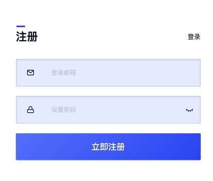

1. 如上图注册界面所示，注册需要的信息如下。
   * 登录邮箱：用于登录云平台的邮箱帐号，邮箱帐号需要支持接收验证邮件；
   * 登录密码：密码须包含有大小写字母、数字、符号中的两种，密码长度为6-20个字符；
2. 提交注册后，平台会给邮箱帐号发送激活邮件，您可以登录邮箱完成激活操作。
3. 点击邮箱中 “UCloudStack 激活帐户” 邮件的链接后，完成注册，如下图所示。


4. 通过注册的邮件和密码登录 UCloudStack 云平台，本文使用  [UCloudStack 在线 POC 环境](http://console.poc.ucloudstack.com/sso/#login) 作为示例。
5. 登录成功后，会为用户展示 UCloudStack 云平台的概览页面，如下图所示：


> 概览页具体详情介绍，请参考 [概览页面](#_18-概览页面) 。

# 3 虚拟机

## 3.1 概述

虚拟机是 UCloudStack 云平台的核心服务，提供可随时扩展的计算能力服务，包括 CPU 、内存、操作系统等最基础的计算组件，并与网络、磁盘、安全等服务结合提供完整的计算环境。通过与负载均衡、数据库、缓存、对象存储等服务结合共同构建 IT 架构。

- UCloudStack 云平台通过 KVM ( Kernel-based Virtual Machine ) 将物理服务器计算资源虚拟化，为虚拟机提供计算资源；
- 一台虚拟机的计算资源只能位于一台物理服务器上，当物理服务器负载较高或故障时，自动迁移至其它健康的物理服务器；
- 虚拟机计算能力通过虚拟 CPU ( vCPU ) 和虚拟内存表示，存储能力通过云存储容量和性能体现；
- 虚拟机管理程序通过控制 vCPU、内存及磁盘的 QoS ，用于支持虚拟机资源隔离，保证多台虚拟机在同一台物理服务器上互不影响；

虚拟机是云平台用户部署并运行应用服务的基础环境，与物理计算机的使用方式相同，提供创建、关机、断电、开机、重置密码、重装系统、升降级等完全生命周期功能；支持 Linux、Windows 等不同的操作系统，并可通过 VNC 、SSH 等方式进行访问和管理，拥有虚拟机的完全控制权限。虚拟机运行涉及资源及关联关系如下：


如图所示，实例规格、镜像、VPC 网络是运行虚拟机必须指定的基础资源，即指定虚拟机的 CPU 内存、操作系统、虚拟网卡及 IP 信息。在虚拟机基础之上，可绑定云硬盘、弹性IP 及安全组，为虚拟机提供数据盘、公网 IP 及网络防火墙，保证虚拟机应用程序的数据存储和网络安全。

## 3.2 创建虚拟机

云平台用户可以通过指定地域、可用区、规格、镜像、云硬盘、VPC 网络、公网 IP、安全组及虚拟机相关基础信息一键创建一个虚拟机，用于部署自己的应用和服务。

### 3.2.1 前提条件

* 在创建虚拟机前，已为用户创建一个 UCloudStack 云平台帐号，并已为帐号充值金额；
* 确认该用户所指定区域及帐户的配额足够；若配额不足，需向云平台管理申请资源配额；
* 如果不使用系统提供的默认安全组，需要在目标地域创建一个安全组并添加能满足用户业务需求的安全规则。

### 3.2.2 创建操作

1. 在左侧导航栏选择虚拟机，进入虚拟机控制台，点击“创建虚拟机” ，弹出虚拟机创建向导；

   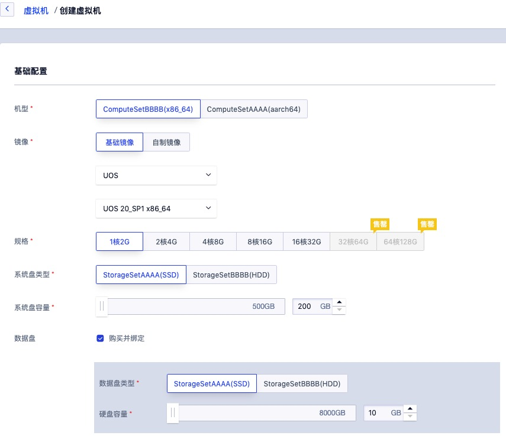

2. 选择虚拟机运行的目标地域和可用区，一旦创建无法修改。

3. 选择虚拟机的机型和规格，确定虚拟机的配置信息。

  * 机型是虚拟机运行的宿主机类型，可由管理员自定义，如 x86 机型、GPU 机型、ARM 机型等；
  * 规格是对虚拟机 CPU 内存的配置定义，为虚拟机提供计算能力，可由管理员自定义；
  * CPU 机型默认提供 1C2G 、2C4G 、4C8G 、8C16G 、16C32G 等虚机规格；
  * GPU 机型默认提供最高 64C128G 虚机规格，并支持最高配置 4 颗 GPU 芯片

4. 选择虚拟机运行的镜像，即虚拟机实例运行环境的模板，可以选择基础镜像和自制镜像。

  * 基础镜像是由平台官方默认提供，包括多发行版 Centos 、Ubuntu 及 Windows 等原生操作系统；
  * 自制镜像由用户通过虚拟机自行导出的自有镜像，可用于创建虚拟机，仅用户本人有权限查看和管理；

5. 选择并配置虚拟机的系统盘和数据盘，可分别配置系统盘和云硬盘的容量。

  * 系统盘：Linux 镜像默认系统盘为 20GB ，Windows 镜像默认系统盘为 40GB ；
  * 数据盘：一种基于分布式存储系统为虚拟机提供持久化存储空间的弹性块设备，创建虚拟机支持同时创建一块云盘并自动绑定至虚拟机，同时会对硬盘进行自动格式化及挂载操作。
      * 默认数据盘挂载路径为 `/data` ；
      * 用户也可以在虚拟机创建后再添加数据云硬盘，可由管理员自定义数据盘的容量范围；
      * 最小支持 10 GB 容量，步长为 10GB ，即容量应为 10GB 的倍数。

6. 配置网络相关设置，包括虚拟机需要加入的 VPC 网络、子网、内网 IP 地址、内网安全组、外网 IP 及外网安全组等选项：

  * VPC 网络是一个属于用户的、逻辑隔离的二层网络广播域环境。在一个私有网络内，用户可以构建并管理多个三层网络，即子网（ Subnet ），私有网络是子网的容器，不同私有网络之间是绝对隔离的；
      * 必须选择 VPC 网络和所属子网，即选择虚拟要加入的网络及 IP 地址段；
      * 默认会从子网的 IP 地址段中为虚拟机自动分配 IP 地址，可通过在内网 IP 选项中手动指定虚拟机的 IP 地址；
  * 安全组是虚拟防火墙，提供出入双方向流量访问控制规则，定义哪些网络或协议能访问资源；
      * 外网安全组用于虚拟机公网 IP 的流量控制，内网安全组于用虚拟机网卡之间的安全访问控制；
      * 默认必须绑定一个外网安全组，内网安全组默认为暂不绑定，可在创建虚拟机后在进行绑定；
      * 系统提供默认安全组，若无法满足需求，用户可以自行创建安全组。
  * 外网 IP 为虚拟机提供的弹性互联网出口服务，支持创建虚拟机时申请并绑定至虚拟机，同时支持在虚拟机创建成功后再进行绑定。

7. 选择并配置虚拟机基础管理配置，包括虚拟机名称、登录方式及登录密钥和密码等。

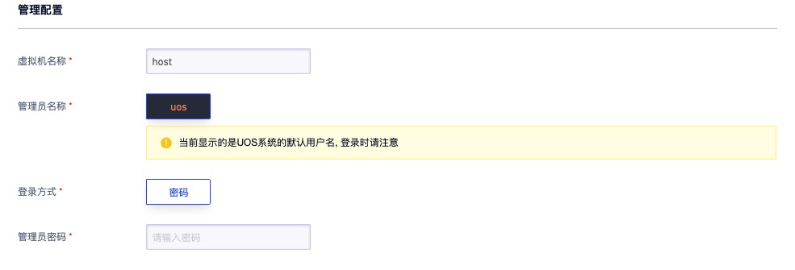

  * 虚拟机名称：平台默认配置名称为 `host` ，用户可自定义虚拟机名称，可通过名称进行搜索和筛选；
  * 登录方式：为虚拟机设置登录凭证，即登录虚拟机的密码。
      * CentOS 的管理员为 `root` ，Ubuntu 的管理员为 `ubuntu` ，Windows 系统的管理员名称为  `administrator` ；
      * Linux 操作系统可在虚拟机创建成功后，通过 SSH 密钥的方式进行登录及管理。

9. 选择购买数量和付费方式，如下图所示确认订单并点击“立即购买” 进行虚拟机创建操作。


  * 购买数量：按照所选配置及参数批量创建多台虚拟机，最多可批量创建 10 台虚拟机；
  * 付费方式：选择虚拟机的计费方式，支持按时、按年、按月三种方式，可根据需求选择适合的付费方式；
  * 合计费用：用户选择虚拟机 CPU、内存、数据盘等资源按照付费方式的费用展示；
  * 立即购买：点击立即购买后，会返回虚拟机资源列表页，在列表页可查看该台主机的创建过程，通常会先显示“启动中”的状态，在1~2分钟内即可创建完成。

## 3.3 查看虚拟机

通过导航栏进入虚拟机控制台，可查看虚拟机资源的列表，可通过点击列表上虚拟机名称，进入虚拟机及周边资源的详细信息。

### 3.3.1 虚拟机列表

虚拟机列表页可查看当前帐户下已有的虚拟机资源列表，包括主机名称、资源 ID、机型、配置、 IP、状态、操作等，同时用户也可通过“自定义列表”按钮，自定义列表所需信息，如下图所示：

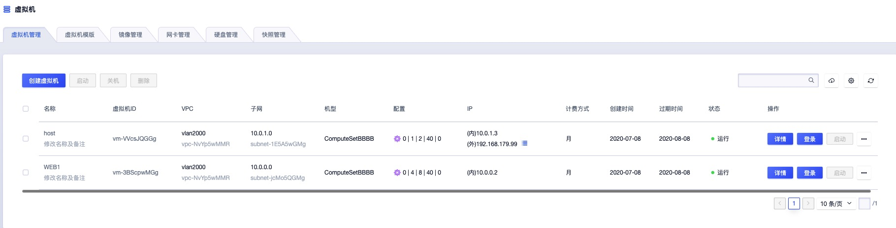

* 地域/可用区：虚拟机所在的地域和可用区；
* 主机名称：虚拟机的名称；
* 资源 ID：虚拟机的全局唯一 ID；
* 所属 VPC/子网：虚拟机创建时所指定的 VPC 网络和子网；
* IP 地址：虚拟机的 IP 地址，包括内网 IP 和外网 IP (若有)；
* 机型：虚拟机所运行物理机的机型，代表不同型号的 CPU 或不同的存储类型等；
* 配置：虚拟机的 CPU 和内存的规格；
* 状态：虚拟机当前的运行状态，包括启动中、运行、关机中、断电中、关机、启动中、重装中、删除中等；
* 创建时间/过期时间：虚拟机的创建时间和计费过期时间；
* 计费方式：虚拟机创建时指定的付费方式，包括按时、按月、按年；
* 操作：对单台虚拟机的更多操作，包括详情、登录、启动、关闭、删除、断电、重启、修改告警模板、制作镜像、重置密码、重装系统、绑定外网 IP、修改安全组及修改系统配置；

可通过搜索框对虚拟机列表进行搜索和筛选，支持模糊搜索；同时支持下载当前用户所拥有的所有虚拟机资源列表信息为 Excel  表格。

为方便租户对虚拟机进行维护和操作，平台支持对虚拟机的批量操作，包括批量启动、关闭及批量删除操作，可通过选中多个虚拟机，点击批量操作按钮进行批量操作，如下图所示：


### 3.3.2 虚拟机详情信息

在虚拟机列表上，点击虚拟机的名称可查看当前虚拟机的详细信息及监控信息，同时用户也可以从虚拟机详情页切换到网络、操作日志页面查看虚拟机绑定的网络资源及操作日志信息。虚拟机详细信息如下图所示：


**1）详情页面展示基本信息、监控图表两种类型的信息：**

* 基本信息：
  * 包括资源ID、资源名、可用区、状态、告警模板、机型、镜像、CPU、内存、系统盘容量、数据盘容量；
  * 可点击告警模板右侧按钮修改虚拟机所关联的告警模板；
  * 数据盘容量为当前虚拟机所关联所有云硬盘的容量之和；
* 监控图表：包括 CPU 使用率、空间使用率、内存使用率、平均负载、网卡的出/入带宽、网卡的出/入包量、磁盘的读/写吞吐、磁盘的读/写次数、 TCP 连接数和阻塞进程数量；

**2）磁盘页面展示当前虚拟机的系统盘和数据盘信息：**

* 系统盘信息包括系统盘的资源 ID、资源名称、磁盘类型、挂载点及容量信息；
* 数据盘信息包括已挂载每块数据盘的资源 ID、名称、磁盘类型、挂载点及容量信息：
  * 磁盘类型可由管理员自定义，如 SSD 磁盘或 容量型磁盘；
  * 挂载点为数据盘在虚拟机中真实的盘符，如 `/dev/vdb` ；
  * 容量信息为每块数据盘的当前容量大小。

**3）网络页面展示当前虚拟机的内网网卡和外网网卡信息：**

* 内网网卡信息包括每张内网网卡所属的 VPC 网络及子网，同时展示内网 IP、网卡 ID、网卡 MAC 地址及所属绑的内网安全组信息（若有）；
* 外网网卡信息包括网卡 ID、外网 IP地址、MAC 地址及所绑定的外网安全组信息。

**4）操作日志页面展示当前虚拟机的操作日志：**

可提供自定义时间级别的日志展示，同时可对日志进行模糊搜索，默认提供一周内的操作日志，可通过切换日期周期查看不同时间周期的操作日志。操作日志内容包括操作时间、操作名称、操作者、失败原因、备注、操作状态。

## 3.4 VNC 登录

VNC（ Virtual Network Console ）是 UCloudStack 为用户提供的一种通过 WEB 浏览器连接虚拟机的登录方式，适应于无法通过远程登录客户端（如 SecureCRT、PuTTY 等）连接虚拟机的场景。通过 VNC 登录连到虚拟机，可以查看虚拟机完整启动流程，并可以像 SSH 及 远程桌面一样管理虚拟机操作系统及界面，支持发送各种操作系统管理指令，如  `CTRL+ALT+DELETE` 及 `CTRL+C` 、`CTRL+V` 等。

用户通过点击虚拟机列表操作中的“**登录**”按钮，可通过 VNC 链接登录当前虚拟机，提供如同显示器的功能，可登入虚拟机操作系统，对虚拟机进行系统级别的操作和管理。如下图所示：


> 登录虚拟机的前提条件是拥有操作系统帐号和密码，VNC 登录适合虚拟机没有公网 IP 地址的场景。

## 3.5 启动/关机/断电/重启

用户可以对虚拟机进行关闭、启动、断电及重启等基本操作，且均支持多台 API 批量操作。如下图所示：


* 关机
  * 你可以使用系统命令进行关机，如 Windows 系统下的关机和 Linux 系统下的 shudown 命令；
  * 也可以通过控制台点击“关机”操作进行，关机时虚拟机的状态必须为启动状态；
  * 虚拟机关机时，状态会从运行转换为关机中，最后转换为已关机；
  * 关机后，虚拟机的内存信息丢失，所有磁盘的数据都将被保留；
  * 关机后可进行制作镜像、修改告警模板、修改系统配置、重装系统、删除主机、绑定外网 IP、修改安全组及启动等操作。
* 启动
  * 用户可通过控制台点击“启动”按钮开启虚拟机，仅在虚拟机状态为已关机时可用；
  * 虚拟机开启时，状态会从已关机转换为开机中，最后转换为运行；
  * 运行的虚拟机可执行关闭、登录、断电及重置密码等操作。
* 断电
  * 断电是将虚拟机强行关机，与物理机直接断电操作相同，断电操作可能导致丢失数据甚至损坏操作系统；
  * 断电操作适用于虚拟机死机及极端测试的场景，可通过虚拟机列表操作中的“断电”按钮，对虚拟机进行强强关机操作；
  * 强行关机时，虚拟机直接会进入已关机状态，可再次进行开机操作。
* 重启
  * 重启是将虚拟机的操作系统进行正常的重新启动，与物理机操作系统重启操作一致；
  * 虚拟机重启时，状态会从运行转换为重启中，最后转换为运行；
  * 重启后，虚拟机的内存信息丢失，所有磁盘的数据都将被保留。

## 3.6 制作镜像

自制镜像由云平台用户通过虚拟机自行导出的自有镜像，可用于创建虚拟机，仅用户本人有权限查看和管理。目前仅支持**虚拟机离线状态下自制镜像**，即虚拟机在已关机状态下才可进行镜像制作。

用户可通过点击虚拟机控制台操作中的“制作镜像” 按钮进行镜像制作，需输入镜像名称及镜像描述，如下图所示：

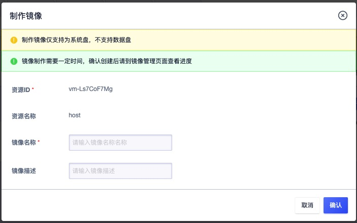

* 虚拟机名称：当前需要制作镜像的虚拟机名称和标识；
* 镜像名称：自制镜像的名称和标识；
* 镜像描述：自制镜像的描述和备注信息，可选项；

制作镜像过程中，请勿对虚拟机进行停止、启动、断电、重装系统或修改配置等操作，以免影响镜像制作过程。

> 通过虚拟机自制镜像时，仅导出系统盘的数据和信息。

## 3.7 重装系统

重装系统是重置虚拟机的操作系统，即更换虚拟机镜像，Linux 虚拟机仅支持更换 Centos 和 Ubuntu 操作系统，Windows 虚拟机仅支持更换 Windows 其它版本的操作系统。重装系统的前提是虚拟机必须为已关机状态。

虚拟机关机后，通过虚拟机控制台操作中的“重装系统”按钮更换虚拟机的镜像，如下图所示：


重装系统时，虚拟机的状态自动转换为重装中，重装成功后转换为“关机”，可以通过启动操作开启虚拟机，虚拟机启动时，会使用新的镜像运行虚拟机。

> 注：重装系统后，虚拟机之前镜像保留的内容将被清空，挂载的云硬盘不受影响。

## 3.8 重置密码

重置密码是指在线修改虚拟机操作系统的登录密码，适应于忘记登录密码或想通过控制台快速修改密码的场景。

Linux 操作系统是修改 root 帐号的密码，Windows 操作系统是修改 administrator 帐号的密码。重置密码的前提是虚拟机必须运行状态。用户通过点击虚拟机控制台操作中的“重置密码”按钮进行密码的重置，如下图所示：


* 虚拟机名称：当前需要修改密码的虚拟机名称和标识；
* 管理员密码/确认密码：需要修改的新密码；
* 如果用户主动修改了虚拟机操作系统的管理员帐号，则无法进行密码重置；

> 请勿在制作镜像过程中重置密码，用户也可以通过登录操作系统，使用操作系统命令或界面进行密码修改。

## 3.9 修改虚拟机配置

修改虚拟机配置即更改虚拟机的 CPU  和内存规格，适应于业务发生变化需调整虚拟机配置的场景。修改配置前需将虚拟机进行关机，即必须在关机状态下进行配置修改操作；配置变更后，需重新启动虚拟机才可生效；升降级配置时，可能会对虚拟机费用产生影响。

虚拟机降级配置，下个付费周期按新配置扣费。按小时付费的虚拟机，升级配置下个付费周期按新配置扣费；按年按月付费的虚拟机，升级配置即时生效，并按比例自动补差价。用户可点击虚拟机控制台操作中的“修改虚拟机配置” 进行虚拟机 CPU 内存的调整，如下图所示：


* 虚拟机 ID 和名称：当前需要变更规格配置的虚拟机名称和全局唯一 ID 标识；
* 目前规格：当前虚拟机变更前的 CPU 内存配置；
* 计费方式：当前虚拟机的付费方式；
* 预计收费：变更配置后，系统预计需要扣除的费用；
* 规格：当前虚拟机需要变更的新规格配置；

点击确定后，虚拟机依然处于关机状态，下次启动时，会使用新变更的配置运行虚拟机；开机后，可登录操作系统查看变更后的配置。

## 3.10 热升级

虚拟机支持热升级，用户可以在虚拟机运行状态下升级 CPU 和内存。在了解热升级前，需先熟悉基本概念：

* 修改配置： 即在虚拟机关机状态下，升级或者降级虚拟机的CPU、内存；
* 热升级： 即在虚拟机为running状态下，支持升级虚拟机的CPU、内存；
* Base镜像：即基础镜像，用户可以通过Base镜像启动一台虚拟机，并基于该虚拟机制作一个自定义镜像。

> 注：目前仅支持 Base 镜像为Centos7.4 的虚拟机热升级。

平台支持热升级的虚拟机，在列表上会自动显示支持热升级，如下图所示：


（1）当用户看到热升级提示后，可通过列表操作项中的 “**热升级**” 对该虚拟机进行在线状态的配置调整，如下图：


（2）在热升级的向导中，可以对虚拟机的 CPU 进行热升级操作，热升级后立即生效，按小时购买的虚拟机下个付费周期按新配置扣费，按年按月购买的虚拟机按比例自动补差价，如下图所示：


> 若用户自定义镜像，其 Base 镜像是基于 Centos7.4 制作的，则也允许热升级。

## 3.11 修改告警模板

修改告警模板是对虚拟机的监控数据进行告警的配置，通过告警模板定义的指标及阈值，可在虚拟机相关指标故障及超过指标阈值时，触发告警，通知相关人员进行故障处理，保证虚拟机及业务的正常运行。通过点击虚拟机控制台操作中的“修改告警模板”来进行操作，点击后返回更改告警模板向导，如下图所示：


* 资源 ID ：当前需要添加或修改告警模板的虚拟机 ID ；
* 资源类型：当前需要添加或修改告警模板的资源类型；
* 告警模板：需要变更的告警模板，一次仅可选择一个；

> 若系统提供的默认告警模板无法满足需求时，可前往“告警模板”页面进行添加和配置；

## 3.12 绑定外网 IP

绑定外网 IP 是指将一个外网 IP 地址绑定至虚拟机，为虚拟机提供互联网出口。虚拟机必须处理运行或关机状态才可进行外网 IP 绑定。可通过虚拟机管理控制台列表上的“绑定外网 IP” 按钮，进行外网 IP 绑定操作。

绑定操作需指定要绑定的外网 IP 地址，仅支持绑定一个公网 IP 地址。若虚拟机已绑定外网 IP 地址，则不可进行绑定外网 IP 地址的操作。绑定成功后，会返回虚拟机列表页，通过列表页可查看已绑定的外网 IP 地址信息，也可通过虚拟机的网络信息查看已绑定的外网 IP 地址。

> 仅支持绑定同一地域的外网 IP 地址，被绑定的外网 IP 必须处于未绑定状态。

## 3.13 修改外网安全组

修改外网安全组是指修改虚拟机的外网 IP 所关联的安全组，即为虚拟机更换外网防火墙。可通过虚拟机管理控制台列表上的“修改外网安全组”按钮进行修改。如下图所示：


选择需修改的的外网安全组，一台虚拟机仅支持绑定一个外网安全组。修改成功后，会返回虚拟机列表页，用户可通过虚拟机的网络信息查看已修改的外网网卡安全组信息。

## 3.14 修改内网安全组

平台支持在虚拟机的视角修改内网安全组，同时支持配置 “暂不绑定” 用于解绑内网安全组。内网安全组策略绑定至虚拟机的内网网卡上，用于防护虚拟机与虚拟机间的流量安全。用户可通过虚拟机管理控制台列表上的“修改内网安全组”进行修改，如下图所示：


选择需要修改的内网安全组，一台虚拟机仅支持绑定一个内网安全组。修改成功后，会返回虚拟机列表页，用户可通过虚拟机的网络信息查看已修改的内网网卡安全组信息。

> 内网安全组和外网安全组支持配置为相同的安全组，即内外网安全组使用相同的安全组及策略。

## 3.15 修改名称和备注

修改虚拟机的名称和备注，在任何状态下均可进行操作。点击虚拟机列表页面每台虚拟机名称右侧的按钮却可进行修改，如下图所示：

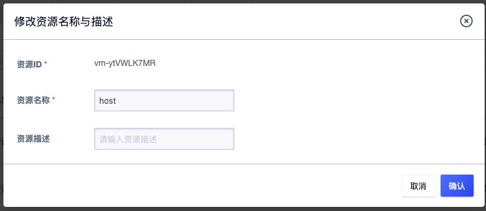

## 3.16 删除虚拟机

平台支持删除一台或多台虚拟机，被删除的虚拟机，会自动进入“**回收站**”中，可通过回收站进行还原和彻底销毁。

- 删除虚拟机的前提是虚拟机必须处于关机状态；
- 删除虚拟机时将会自动解绑外网 IP 、物理 IP、弹性网卡、云盘等资源，同时若虚拟机为 NAT 网关白名单或负载均衡服务节点，也会自动进行解绑操作。虚拟机被删除后：
  * 随虚拟机创建的 2 块默认网卡（一块内网、一块外网）及系统盘将被自动删除；
  * 与虚拟机绑定在一起的云硬盘、弹性网卡、外网 IP、物理 IP等资源将自动被解绑，并可随时绑定至其它虚拟机；
  * 虚拟机删除前产生在系统盘中的数据将被清空；
- 若虚拟机到期，在允许时间内未续费成功，则虚拟机会被自动删除，进入回收站

* 用户可通过虚拟机控制台的“删除”功能进行虚拟机的释放，如下图所示：


## 3.17 远程登录

远程登录是指通过远程管理客户端软件通过网络远程登录并管理虚拟机，针对 Linux 和 Windows 的虚拟机分别提供不同的方式进行远程登录。远程登录的前提条件为虚拟机必须绑定外网 IP 地址，并可通过外网正常访问服务器的远程登录端口（ Linux SSH 为 22 、Windows 远程桌面为 3389 ）。

### 3.17.1 远程登录 Linux

为方便验证，本手册假设本地用的客户端操作系统为 Linux 或 Mac OS ，即默认自带 SSH 客户端，可通过命令行直接使用 SSH 命令登录远端 SSH 服务端。具体操作步骤为：

1. 为需要远程登录的虚拟机绑定公网 IP 地址且外网安全组允许 SSH 22 端口访问，如下图所示：


2. 用户打开系统自带的终端 （Terminal）并输入 SSH 命令登录：`ssh root@虚拟机的公网 IP 地址` ,如下例：

```bash
# ssh root@106.75.234.31
```

3. 输入虚拟机的登录密码，即可直接登录 Linux 服务器，如下图所示即代表登录成功。


### 3.17.2 远程登录 Windows

为方便验证，本手册假设本地用的客户端操作系统为 Mac OS ，使用微软远程桌面连接 MAC 版程序 [RDC](http://downinfo.myhostadmin.net/RDC.dmg) 进行登录，操作步骤同 Windows 远程桌面相同，仅需要在工具输入 Windows 的公网 IP 地址即可连接，如下图所示：


> 远程桌面连接的前提是虚拟机必须绑定公网 IP 地址，且绑定的外网安全组允许 3389 端口通行，若在操作系统内部修改了远程桌面的默认端口，则安全组需允许修改后的端口通行。

# 4 自制镜像管理

自制镜像由云平台用户通过虚拟机自行导出的自有镜像，可用于创建虚拟机，仅用户本人有权限查看和管理。支持通过虚拟机自制镜像、从镜像创建主机、修改名称、查看镜像及删除镜像等生命周期管理。自制镜像整个生命周期包括创建中、可用、不可用、销毁中、使用中、删除中及已删除状态。

## 4.1 查看自制镜像

通过导航栏进入虚拟机控制台，切换至镜像管理页面可查看自制镜像资源的列表。自制镜像列表页可查看当前帐户下已创建的自制镜像列表，包括地域、镜像名称、镜像 ID、基础镜像、创建时间、状态及操作。


* 地域：自制镜像所在的地域；

- 镜像名称/ID：当前自制镜像的名称及全局唯一 ID 标识；
- 基础镜像：代表导出当前镜像的基础镜像，即当前镜像是由哪个基础镜像制作的；
- 创建时间：代表当前自制镜像的创建时间；
- 状态：自制镜像当前的状态，包括创建中、可用、不可用、销毁中、使用中、删除中及已删除等；
- 操作：对单个自制镜像的操作，包括从镜像创建主机及删除；
- 可通过搜索框对自制镜像的列表进行搜索和筛选，支持模糊搜索。

## 4.2 从镜像创建主机

从镜像创建主机指通过自制的镜像重新创建一台虚拟机，创建的虚拟机使用自制镜像启动，虚拟机中的程序及数据保持自制镜像的创建时的状态。用户可通过虚拟机控制台中进入镜像管理控制台页面，点击“从镜像创建主机”按钮进行创建，如下图所示，虚拟机创建向导自动为用户选择指定的自制镜像。


使用自制镜像创建虚拟机的过程与基础镜像相同，可根据提示进行操作。

## 4.3 删除自制镜像

UCloudStack 支持通过控制台删除自制镜像，被删除的自制镜像会自动进入“**回收站**”中，可进行还原和彻底销毁。

* 删除自制镜像的前提是自制镜像必须处于可用状态；

- 自制镜像被删除后，不会影响已创建好的虚拟机；

用户可通过自制镜像管理控制台的“删除”功能进行自制镜像的删除，删除后可到回收站中查看已删除的自制镜像。

## 4.4 修改名称和备注

修改自制镜像的名称和备注，在任何状态下均可进行操作。可通过点击自制镜像列表页面每个镜像名称右侧的“编辑”按钮进行修改。

# 5 弹性网卡

弹性网卡（ Elastic Network Interface, ENI ）是一种可随时附加到虚拟机的弹性网络接口，支持绑定和解绑，可在多个虚拟机间灵活迁移，为虚拟机提供高可用集群搭建能力，同时可实现精细化网络管理及廉价故障转移方案。

- 弹性网卡与虚拟网卡的实现方式相同，区别在于弹性网卡的具有独立的生命周期；
- 弹性网卡支持绑定和解绑，可在多个虚拟机间自由迁移；
- 虚拟机被销毁时，弹性网卡将自动解绑，可绑定至另一台虚拟机使用；
- 一块弹性网卡仅支持绑定至一个虚拟机，一个虚拟机最多可绑定 **6** 块弹性网卡；
- 支持弹性网卡 QoS 控制，提供自定义设置弹性网卡的出/入口带宽；

弹性网卡具有地域、可用区、VPC、子网、IP 及安全组等属性，支持创建、绑定、解绑及删除弹性网卡等生命周期管理。

- 地域/可用区：弹性网卡仅支持绑定至相同地域和可用区的虚拟机；
- 子网：一块弹性网卡仅支持加入至一个子网，创建后无法修改 VPC 和子网；
- IP地址：支持手动指定和 DHCP 自动获取弹性网卡在子网内的 IP 地址，一块弹性网卡仅支持 1 个私有 IP 地址，创建后无法修改 IP 地址；
- 安全组：每块弹性网卡支持绑定一个安全组，提供网卡级别安全控制；
- MAC 地址：每块弹性网卡拥有全局唯一 MAC 地址；

## 5.1 创建网卡

云平台用户可通过指定网卡名称、地域、所属 VPC、子网及 IP 地址一键创建一个弹性网卡，用于扩展虚拟机的网络接口。创建弹性网卡的前提是必须拥有至少一个 VPC 网络及子网，操作步骤如下：

1. 用户通过虚拟机控制台切换至“网卡管理”页面，通过点击“**创建网卡**”按钮进入创建弹性网卡向导页面：


2. 选择并配置弹性网卡的名称、地域、VPC、子网、 IP 地址及安全组，完成弹性网卡的创建

* 名称：当前需要创建弹性网卡的名称及标识；
* 地域/可用区：当前所需要创建弹性网卡所在的地域及可用区；
* 所属 VPC/子网：需创建弹性网卡需要加入的网络及 IP 地址段，必选项；
* IP 地址：当前网卡的 IP 地址，默认会从子网的 IP 地址段中自动分配 IP 地址，如需自定义 IP 地址，可在 IP 地址栏中输入指定的 IP 地址。
* 点击确定后，会返回弹性网卡列表页面，在列表页面可查看弹性网卡的创建过程。

弹性网卡创建成功后，默认为未绑定状态，即代表可将此网卡绑定至一个虚拟机。

## 5.2 查看网卡

通过导航栏进入虚拟机控制台，切换至网卡管理页面可查看弹性网卡资源的列表及信息。弹性网卡列表页可查看当前帐户下已创建的弹性网卡列表，包括地域、可用区、 ID、名称、网卡类型、绑定资源、 VPC、子网、安全组、状态、创建时间及操作信息，如下图所示：


* 地域/可用区：弹性网卡所在的地域及可用区；
* 名称/ID：弹性网卡的名称及全局唯一标识符；
* 网卡类型：弹性网卡的类型，目前仅支持内网网卡类型，同时会显示网卡所分配或指定的 IP 地址；
* 绑定资源：弹性网卡已绑定的虚拟机资源名称或 ID ，或未指定则显示为空；
* VPC/子网：当前弹性网卡创建时指定的所属 VPC  及子网；
* 安全组：当前弹性网卡绑定的安全组名称或 ID；
* 状态：弹性网卡的当前状态，包括创建中、未绑定、绑定中、已绑定、解绑中、已删除等状态，状态流转如下图所示：


* 创建时间：当前弹性网卡的创建时间；
* 操作：对单块弹性网卡的操作，包括绑定、解绑、删除；
* 可通过搜索框对弹性网卡的列表进行搜索和筛选，支持模糊搜索。

## 5.3 绑定资源

绑定资源指将一块在未绑定状态的弹性网卡绑定至一台虚拟机，用于扩展虚拟机的网络接口。弹性网卡必须处于未绑定状态，才可进行绑定。可通过弹性网卡管理控制台弹性网卡列表上的“**绑定**”按钮，进行资源绑定，如下图所示：


* 网卡 ID ：当前需要绑定资源的网卡标识符；
* 地域/可用区：当前需绑定资源网卡所属的地域和可用区，仅支持绑定相同地域和可用区的虚拟机资源；
* 网卡类型：当前需要绑定资源的网卡类型；
* 绑定资源：选择弹性网卡需要绑定的虚拟机，一次仅支持选择一个。

点击绑定后，会返回弹性网卡列表页面，通过列表页可查看绑定过程，同时可查看已绑定的资源名称。绑定过程中弹性网卡的状态为“绑定中”，待状态变更为“**已绑定**”即代表绑定成功。用户也可通过虚拟机的网络信息查看已绑定的网卡信息。

> 一台虚拟机最多可绑定 6 个弹性网卡，仅支持绑定同一地域的虚拟机，被绑定的虚拟机必须处于关机或运行状态，才可正常绑定弹性网卡。

## 5.4 解绑资源

解绑资源是指将弹性网卡从虚拟机上分离出来，解绑的弹性网卡可重新绑定至其它虚拟机。弹性网卡必须处于已绑定状态，才可进行解绑操作。用户可通过弹性网卡管理控制台弹性网卡列表上的“**解绑**”按钮，进行资源解绑操作，解绑后会保留弹性网卡的 IP 地址及安全组等信息。解绑操作如下图所示：


解绑时，虚拟机的状态必须处于关机或运行状态。解绑操作执行过程中，弹性网卡的状态会转换为“解绑中”；状态转换为“未绑定”，即代表解绑成功。

## 5.5 修改安全组

支持在弹性网卡的视角修改弹性网卡的安全组，同时支持配置 “暂不绑定”用于解绑安全组。安全组作用的最小单位是网卡，若弹性网卡被绑定至虚拟机，弹性网卡的安全组策略仅对当前网卡的流量出入进行限制，不影响虚拟机默认网卡及其它弹性网卡的流量出入。

用户可通过弹性网卡管理控制台列表上的“修改安全组”进行修改，仅支持未绑定状态的网卡修改安全组，如下图所示：


选择需要修改的安全组信息，一块网卡仅支持绑定一个安全组。修改成功后，会返回弹性网卡列表页，用户可通过弹性网卡列表信息查看已修改的安全组信息。

## 5.6 删除网卡

平台支持通过控制台删除不需要的弹性网卡资源，被删除的弹性网卡会自动进入“**回收站**”中，可进行还原及销毁。

* 删除弹性网卡的前提是弹性网卡必须处于“未绑定”状态；

- 删除弹性网卡后，自动解绑与之关联的安全组；

用户可通过弹性网卡管理控制台的“删除”功能删除弹性网卡，删除后可到回收站中查看已删除的弹性网卡资源。

# 6 云硬盘

## 6.1 云硬盘概述

云硬盘是一种基于分布式存储系统为虚拟机提供持久化存储空间的块设备。具有独立的生命周期，支持随意绑定/解绑至多个虚拟机使用，并能够在存储空间不足时对云硬盘进行扩容，基于网络分布式访问，为云主机提供高安全、高可靠、高性能及可扩展的数据磁盘。


### 6.1.1 功能与特性

云平台为租户提供普通和高性能两种类型的云硬盘，普通云硬盘使用 SATA/SAS 磁盘作为存储介质，性能型云硬盘使用 SSD/NVME 磁盘作为存储介质。普通云硬盘和高性能云硬盘均通过条带化、PG映射及三副本机制进行存储，并在分布式存储系统的基础之上通过块存储系统接口为用户提供云硬盘资源及全生命周期管理。

* 云硬盘容量是由统一存储的从存储集群容量中分配的，所有云硬盘共享整个分布式存储池的容量及性能；
* 支持云硬盘创建、挂载、卸载、磁盘扩容、删除等生命周期管理；
* 支持在线和离线的方式扩容磁盘容量，磁盘扩容后需要在虚拟机的操作系统进行磁盘容量的扩容操作；
* 为保证数据安全，目前云硬盘不支持磁盘缩容；
* 云硬盘最小支持 10G 的容量，步长为 10GB ，可自定义控制单块云硬盘的最大容量；
* 云硬盘具有独立的生命周期，可自由挂载到任意虚拟机上 ，支持秒级创建与删除云硬盘； 
* 每个虚拟机支持挂载多个云硬盘，虚拟机删除后，已挂载至虚拟机的云硬盘将自动卸载，可重新挂载虚拟机；
* 单块云硬盘同时仅能挂载一台虚拟机；
* 支持对全局分布式存储及整体云硬盘进行 I/O 的 QoS 限制；
* 支持对每一块云硬盘的 QoS 进行配置，可根据不同业务模式调整磁盘的性能，以平衡平台整体性能；

高性能型云硬盘的性能与容量的大小成线性关系，容量越大，提供的 IO 性能越高，如果对IO性能有强烈需求，可考虑扩容性能型云硬盘。UCloudStack 云硬盘完整生命周期包括创建中、可用、挂载中、已挂载、卸载中、扩容中、已删除等资源状态，各状态流转如下图所示：


在部署上，节点自带 SSD 磁盘构建为高性能的存储池； SATA/SAS 磁盘构建为普通性能存储池。在本地可通过快照技术，对云硬盘及数据进行快照备份，在数据丢失或损坏时，可通过快照快速恢复数据，包括数据库数据、应用数据及文件目录数据等，可实现分钟级恢复。

### 6.1.2 应用场景

- 普通云硬盘
  - 适用于对容量要求较高且数据不被经常访问或 I/O 负载低的应用场景；
  - 需要低成本并且有随机读写 I/O 的应用环境，如大型视频、音乐、离线文档存储等；
- 高性能云硬盘
  - 适用于 I/O 负载高且数据经常被读写的应用场景；
  - 中大型关系数据库；
  - 中大型开发测试环境；
  - 中大型实时响应服务类环境；

## 6.2 创建云硬盘

用户可通过指定地域、可用区、类型、容量及名称一键添加一块云硬盘，可挂载至虚拟机用于虚拟机的数据盘。创建云硬盘前请确认用户的磁盘配额及帐户余额充足，操作步骤如下：

1. 用户通过虚拟机控制台切换至“磁盘管理”页面，通过点击“**创建硬盘**”功能，进入下图云硬盘创建向导页面：

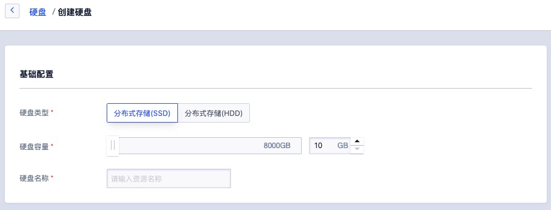

2. 选择并配置地或、基础配置及管理设置等参数：

* 地域/可用区：需要创建的云硬盘所在的地域和可用区；
* 类型：即云硬盘类型，如普通云盘和 SSD 高性能云盘；
* 容量：需要创建的云硬盘容量，默认最小 10GB  ，步长为 10GB ；
* 云硬盘名称：需要创建的云硬盘名称；

> 云平台管理员可在管理控制台自定义磁盘的类型及磁盘规格，可根据需求定制云盘。

3. 选择购买数量和付费方式，如下图所示确认订单并点击“立即购买” 进行云硬盘购买及创建操作：


- 购买数量：按照所选配置及参数批量创建多块云硬盘；
- 付费方式：选择虚拟机的计费方式，支持按时、按年、按月三种方式，可根据需求选择适合的付费方式；
- 合计费用：用户选择创建云硬盘资源按照付费方式的费用展示；
- 立即购买：点击立即购买后，会返回云硬盘资源列表页，在列表页可查看云硬盘的创建过程，创建成功后，云硬盘状态显示为“未绑定”。

## 6.3 查看云硬盘

通过导航栏进入虚拟机控制台，切换至云硬盘管理页面查看云硬盘资源的列表，云硬盘列表可查看当前帐户下已有的云硬盘列表，列表信息包括名称、 ID、磁盘类型、容量、绑定资源、创建时间、过期时间、计费方式、状态、及操作等，如下图所示：

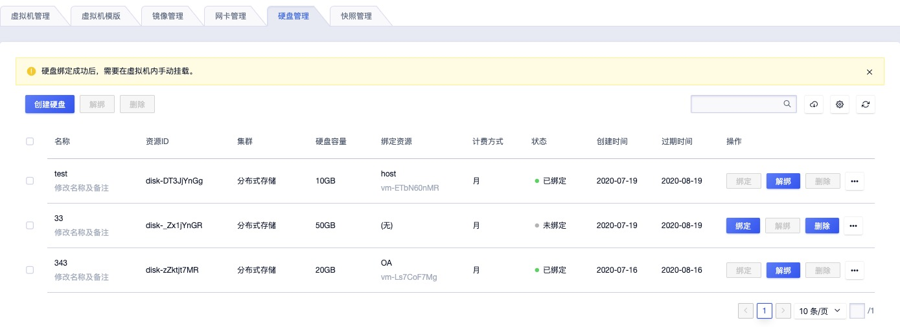

* 名称/ID：云硬盘的名称和全局唯一标识符；
* 磁盘类型：即云硬盘类型，如普通云盘和 SSD 高性能云盘；
* 容量：云硬盘的容量，GB 为单位；
* 绑定资源：云硬盘已绑定的虚拟机名称或 ID ，未绑定时为空；
* 创建时间/过期时间：云硬盘的创建时间和费用过期时间；
* 计费方式：云硬盘在创建时指定的计费方式；
* 状态：云硬盘的当前状态，包括创建中、未绑定、挂载中、已挂载、解绑中、扩容中等；
* 操作：对单块云硬盘的操作，包括绑定、解绑、删除、升级；
* 可通过搜索框对密钥对列表进行搜索和筛选，支持模糊搜索，同时支持云硬盘的批量删除操作。

为方便租户对硬盘进行维护和操作，平台支持对硬盘的批量删除操作，可通过选中多个硬盘，点击批量操作按钮进行批量操作。

## 6.4 绑定云硬盘

绑定是指将一块云硬盘绑定至一台虚拟机，为虚拟机添加数据磁盘，用于数据存储。绑定云硬盘的前需要保证云硬盘的状态必须为未绑定，同时需保证要绑定的虚拟机必须为关闭或运行中的状态。

* 为保证数据安全，一块云硬盘同一时间仅支持绑定至一台虚拟机；
* 云硬盘仅支持绑定至同一个地域的虚拟机实例上；
* 一个虚拟机最多支持绑定 6 块云硬盘。

用户可通过点击云硬盘管理页面的云硬盘列表上的“**绑定**”功能，进入绑定云硬盘向导页面，如下图所示：

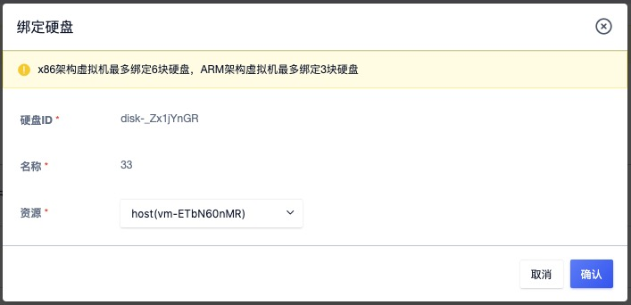

* 资源：指当前云硬盘的资源 ID 或名称；
* 虚拟机：指需要挂载的虚拟机名称或标识符，仅支持绑定至一台虚拟机；

点击确定后，即返回至云硬盘列表页面，在列表页面可查看绑定云硬盘的过程，通常云硬盘的状态会变更为“绑定中”，绑定成功后，即转换为“已绑定”状态。同时可通过虚拟机详情页面的磁盘标签，查看已绑定的数据盘信息、容量及挂载点等。

云硬盘绑定后，默认不进行格式化（如需）和系统挂载操作，需用户登录已挂载的虚拟机操作系统，根据需求对云盘进行格式化及挂载(`mount`) 操作。

## 6.5 解绑云硬盘

解绑云硬盘是指将云硬盘从虚拟上分离出来，解绑的云硬盘可重新绑定至其它虚拟机，解绑后云硬盘的数据不会丢失，重新挂载新虚拟机后，可直接使用云硬盘上的数据。云硬盘必须必于已绑定状态，才可进行解绑操作。

用户可通过云硬盘控制台资源列表上的“**解绑**”按钮，进行云硬盘解绑操作，解绑后会保留云硬盘上的数据。具体解绑操作如下图所示：


解绑时，虚拟机的状态必须处于关机或运行状态。解绑操作执行过程中，云硬盘的状态会转换为“解绑中”；状态转换为“未绑定”，即代表解绑成功。

> 为保存数据完整性，解绑操作前建议暂停对当前硬盘所有文件系统的读写操作，并进入操作系统进行 `umount`或脱机操作（Linux 系统需确认已 `umount` 硬盘所对应的文件系统； Windows 系统需确认至磁盘管理中进行磁盘下线操作），避免因强制解绑云硬盘卖到文件系统损坏或丢失。

## 6.6 格式化并挂载数据盘

云硬盘成功挂载到虚拟机后，需要格式化后才可正常读写数据。本章节主要描述如何用一块新的云硬盘创建一个单分区的数据盘。Linux 的虚拟机和 Windows 的虚拟机使用云硬盘的方式不同，Linux 虚拟机格式化后，需要挂载到文件系统的一个目录中使用；Windows 的虚拟机首先需要初始化磁盘，进行分区并格式化后即可正常使用。

> 格式化和分区磁盘具有一定的风险，格式化后云硬盘中的数据将被清空，请慎重操作。

### 6.6.1 Linux 虚拟机

Linux 虚拟机挂载的云硬盘设备名是由系统默认分配的，从 `/dev/vdb` 递增排列，包括`/dev/vdb 到 /dev/vdz`。本示例挂载一块 100GB 的云硬盘至 Linux 虚拟机，设备名为 `/dev/vdb` 。具体操作步骤如下：

1. 创建云硬盘，并挂载至一台 Linux 的虚拟机，并通过 SSH 远程连接并登录虚拟机；
2. 使用 `fdisk -l ` 命令查看虚拟机上的云硬盘，检测是否挂载成功，如下图所示挂载的数据盘为 100GB `/dev/vdb` 设备；


3. 创建文件系统，使用 `mkfs.ext4 /dev/vdb` 命令进行格式化并新建一个文件系统，分区格式化可选择`ext3`、`ext4   `等文件系统的格式，示例采用 `ext4 ` 格式；

```bash
[root@localhost ~]# mkfs.ext4 /dev/vdb
mke2fs 1.41.12 (17-May-2010)
文件系统标签=
操作系统:Linux
块大小=4096 (log=2)
分块大小=4096 (log=2)
Stride=0 blocks, Stripe width=0 blocks
6553600 inodes, 26214400 blocks
1310720 blocks (5.00%) reserved for the super user
第一个数据块=0
Maximum filesystem blocks=4294967296
800 block groups
32768 blocks per group, 32768 fragments per group
8192 inodes per group
Superblock backups stored on blocks: 
	32768, 98304, 163840, 229376, 294912, 819200, 884736, 1605632, 2654208, 
	4096000, 7962624, 11239424, 20480000, 23887872

正在写入inode表: 完成                            
Creating journal (32768 blocks): 完成
Writing superblocks and filesystem accounting information: 完成
```

4. 挂载数据盘，创建挂载点 `/data` 目录，使用 `mount /dev/vdb /data` 命令挂载新分区，并使用 `df -h` 验证云硬盘是否挂载成功；

```bash
[root@localhost ~]# mkdir /data
[root@localhost ~]# mount /dev/vdb /data
[root@localhost ~]# df -h
Filesystem      Size  Used Avail Use% Mounted on
/dev/vda1        20G  874M   18G   5% /
tmpfs           1.9G     0  1.9G   0% /dev/shm
/dev/vdb         99G  188M   94G   1% /data
```

5. 配置开机自动挂载，添加云硬盘的挂载信息至 `/etc/fstab` ，如下：

```bash
echo '/dev/vdb /data ext4 defaults 0 0' >> /etc/fstab
```

6. 挂载成功，即可正常使用云硬盘，若云硬盘在控制台被解绑，重新绑定至虚拟机后，需要重复执行 `mount /dev/vdb /data` 命令，或者需要重启虚拟机进行自动挂载；
7. 若云硬盘在控制台被解绑，重新绑定至其它 Linux 虚拟机后，需要按照第 4~5 步骤执行挂载操作。 

### 6.6.2 windows 虚拟机

Windwos 虚拟机挂载云硬盘后，需要进行初始化及格式化分与等操作，才可正常使用。Windows 操作系统可进入 “磁盘管理” 界面进行分区与格式化操作，本章节以 Windows 2012 R2 为例进行格式化与分区操作，如下：

1. 创建云硬盘，并挂载至一台 windows 的虚拟机，通过 VNC 或远程桌面远程连接并登录虚拟机；
2. 点击【开始】—【管理工具】—【计算机管理】—【磁盘管理】，打开“磁盘管理” 界面，查看已挂载的云硬盘，如下图所示的磁盘 1 ：


3. 在磁盘 1 上右键单击，选择【联机】，如下图所示：


4. 在磁盘 1 上右键单击，选择【初始化磁盘】，进入磁盘初始化向导界面，如下图所示：


5. 根据分区形式的不同，选择【GPT】或【MBR】，单击【确定】按钮；

* MBR 目前仍是最常用的分区形式，支持处理不大于 2 TB 的数据盘，仅支持分 4 个主区，如果您要将磁盘分成更多的区，需要将某个主区作为扩展区并在其中创建逻辑分区。
* GPT 是一种新的分区形式，早期版本的 Windows 不能识别这种分区形式。GPT 能处理的数据盘容量由操作系统和文件系统决定。在 Windows 操作系统里，GPT 最多可以支持 128 个主分区。

6. 磁盘分区，右键点击磁盘 1 右侧【未分配】的区域，选择【新建简单卷】，进入新建简单卷向导，如下图：


7. 点击下一步，输入分区所需的磁盘大小，若只需一个分区，使用默认值，单击下一步；


8. 分配驱动器号和路径，选择一个驱动器号（即盘符），如本示例中选择 D，单击 **下一步**；


9. 格式化分区，选择格式化设置，包括文件系统、分配单元大小和卷标，确认是否 **执行快速格式化** 和 **启用文件和文件夹压缩**，这里使用默认设置，单击 **下一步**；


10. 点击完成，开始创建新简单卷，返回磁盘管理工具，磁盘 1 的状态良好，如下图所示：


## 6.7 升级云硬盘

### 6.7.1 升级云盘容量

平台支持用户升级云硬盘的容量，适应于业务发生变化需扩容磁盘容量的场景。平台仅支持扩容磁盘容量，不支持磁盘容量的缩容。磁盘容量扩容范围即当前硬盘类型的规格，默认为 10GB~8000GB ，平台管理员可至平台管理后台全局配置中，进行磁盘规格配置。

在升级场景上，平台支持在线升级硬盘和离线升级硬盘，在线升级是指对运行状态虚拟机上绑定的云盘进行容量升级；离线升级是指对未绑定至虚拟机或关机状态虚拟机上绑定的云盘进行容量升级。容量扩容后成功后，需进入挂载的虚拟机操作系统进行分区扩展或新建分区操作。

升级硬盘容量会对虚拟机费用产生影响，按小时付费的硬盘，升级容量下个付费周期按新配置扣费；按年按月付费的硬盘，升级容量即时生效，并按比例自动补差价。用户可点击云硬盘控制台操作中的“**升级**” 进行硬盘容量升级操作，如下图所示：


* ID 和名称：当前需要升级容量的硬盘名称和全局唯一 ID 标识；
* 硬盘类型：当前需升级容量硬盘的集群类型；
* 硬盘原始容量：当前硬盘升级前的容量，如 20GB ；
* 预计收费：变更配置后，系统预计需要扣除的费用；
* 硬盘容量：当前硬盘需要扩容的新存储容量；

点击确定后，硬盘容量即扩容成功，可将硬盘挂载至虚拟机并登入虚拟机操作系统，通过 `fdsik` 或 磁盘管理工具查看扩容后的容量是否生效。

> 为保证数据完整性，容量扩容前建议暂停对当前硬盘的所有文件系统读写操作，并进入操作系统进行 `umount ` 或`脱机` 操作。

由于 MBR 格式分区不支持大于 2TB 的磁盘容量。在升级云硬盘时，若待扩容的硬盘采用 MBR 分区格式且需要扩容到 2TB 及以上容量时，建议重新创建并挂载一块硬盘，使用 GPT 分区方式并将数据拷贝至新硬盘中。

### 6.7.2 磁盘分区扩容

升级硬盘容量后，需要进入操作系统对磁盘分区进行扩容，即需对文件系统进行扩容，才可使操作系统正常使用已扩容的磁盘容量。针对不同的操作系统分区扩容操作有所不同，如 Linux 通常通过 `fdisk` 或`parted`  工具；Windows 通常使用自带的磁盘管理工具进行扩容操作。根据不同磁盘扩容场景，分区扩容大致分为如下场景：

* 裸磁盘扩容（Linux）
* 单分区磁盘扩容（Linux）
* 单分区磁盘扩容（Windows）
* 多分区磁盘扩容（Linux）
* 多分区磁盘扩容（Windows）
* 2TB 硬盘分区扩容（Linux）
* 2TB 硬盘分区扩容（Windows）

#### 6.7.2.1 裸磁盘扩容（Linux）

裸磁盘是指未进行分区的云硬盘，即创建的云硬盘挂至主机后，直接对磁盘进行格式化进行使用，用户可通过对硬盘升级容量后，进入操作系统对裸磁盘进行扩容操作。

> 裸磁盘直接格式化使用，仅适用于 Linux ，Windows 必须进行格式化并分区才可进行挂载使用。

本示例以 CentOS 6.5 操作系统（内核版本为 2.6.32-431.el6.x86_64  ）为示例环境版本，云硬盘大小为 40GB ，扩容至 50GB ，挂载点为 `/dev/vdb` ，实际环境中需根据实际情况进行操作。

* 查看当前磁盘的信息，包括挂载点、文件系统类型及分区情况。

  

  注：结果显示 vdb 磁盘为 ext4 分区且磁盘下无分区，为裸磁盘，可按照本文档所述方案扩容；若 vdb 下有分区，需参考单分区扩容或多分区扩容章节内容。

* 通过控制台或 API 对硬盘进行容量升级操作，并在操作系统中查看磁盘的容量，如下图所示，升级至50GB；

  

* umount 磁盘，进行文件系统扩容操作，不同的文件系统扩容命令操作不同，本文分别以 ext4 及 xfs 文件系统为例进行扩容操作；

* ext4 文件系统扩容，执行 `resize2fs /dev/vdb`  进行系统磁盘扩容操作，最后重新 mount 挂载磁盘即可；

  

  如上图所示，扩容并挂载磁盘后，`/data` 目录所显示的容量为扩容后的 50GB 。

* 若磁盘为 xfs 文件系统，则需要执行 `xfs_growfs /data/` 命令进行磁盘扩容操作

> 注意：xfs 文件系统的磁盘扩容，需要在操作系统中将磁盘 `mount` 后操作。

#### 6.7.2.2 单分区扩容（Linux）

单分区磁盘是指云盘在扩容之前已被挂载过虚拟机且只划分过 1 个分区，用户可通过对硬盘升级容量后，进入操作系统对单分区磁盘进行分区扩容操作。单分区扩容在 Linux 及 Windows 操作系统上的操作不同，本章节为 Linux 单分区扩容操作指南。

本示例以 CentOS 6.5 操作系统（内核版本为 2.6.32-431.el6.x86_64  ）为示例环境版本，云硬盘大小为 10G 单分区，扩容至 20GB ，挂载点为 `/dev/vdb1` ，实际环境中需根据实际情况进行操作。若磁盘上划分多个分区，可参考多分区扩容章节。

> 本操作示例默认磁盘容量小于 2TB ，若磁盘容量大于 2TB 请参考《2TiB磁盘分区扩容（Linux）》章节。

* 通过 `lsblk` 查看当前磁盘的信息，包括挂载点、文件系统类型及分区情况；

  

  注：结果显示 vdb 下只有一个 10GB 的分区，分区格式为 ext4 ，挂载至 `/mnt` 目录 。

* 通过控制台或 API 对硬盘进行容量升级操作，并在操作系统中通过 fdisk 或 lsblk 查看扩容后的磁盘容量；

* 在操作系统中 umount 磁盘，使用 `fdisk /dev/vdb` 命令删除原来的分区并创建新分区；

  

  > 注：删除分区不会造成磁盘内数据丢失。

* 检查文件系统并进行文件系统扩容操作，不同的文件系统扩容命令操作不同，本文分别以 ext4 及 xfs 文件系统为例进行扩容操作；

* ext4 文件系统扩容，执行 `e2fsck -f /dev/vdb1` 和  `resize2fs /dev/vdb1` 进行检查和扩容操作；

  

  如上图所示，扩容分区扩容成功后，重新 mount 分区，并查看分区大小及相关信息。

* 若磁盘为 xfs 文件系统，则先执行 `xfs_repair /dev/vdb1` 检查文件系统，如下图所示：

  

  最后使用 mount 重新挂载磁盘，并执行 `xfs_growfs /mnt` 对磁盘分区进行扩容操作。

#### 6.7.2.3 单分区扩容（Windows）

单分区磁盘是指云盘在扩容之前已被挂载过虚拟机且只划分过 1 个分区，用户可通过对硬盘升级容量后，进入操作系统对单分区磁盘进行分区扩容操作。单分区扩容在 Linux 及 Windows 操作系统上的操作不同，本章节为 windows 单分区扩容操作指南。

本示例以 Windows Server 2012R2 操作系统为示例环境版本，云硬盘大小为 10GB ，扩容至 20GB ，挂载点为 Disk1 ，实际环境中需根据实际情况进行操作。具体操作如下：

> 本操作示例默认磁盘容量小于 2TB ，若磁盘容量大于 2TB 请参考《2TiB磁盘分区扩容（Windows）》章节。

* 查看当前磁盘的分区及挂载信息，确认磁盘是当前需要扩容的磁盘，如下图所示：

  

* 在操作系统中对磁盘进行脱机操作，并通过控制台及 API 对当前磁盘进行容量升级操作，并通过操作系统磁盘管理工具查看扩容后的磁盘大小，如下图所示：

  

* 右键单击新分区 D 空白处，选择扩展卷（Extend Volume），并在弹出的对话框中，对磁盘分区进行扩展操作，如以下图示：

  

  

  

  

  

* 分区扩展成功后，查看扩容后分区信息，如下图所示：

  

#### 6.7.2.4 多分区扩容（Linux）

多分区磁盘是指云盘在扩容之前已被挂载过虚拟机且划分过多个分区，用户可通过对硬盘升级容量后，进入操作系统对多分区磁盘进行分区扩容操作。由于新扩容的空间是附加在虚拟云盘的末端，对于多分区的场景，只支持对排在最后的分区进行扩容操作。

多分区扩容在 Linux 及 Windows 操作系统上的操作不同，本章节为 Linux 多分区扩容操作指南。本示例以 CentOS 6.5 操作系统为示例环境版本，云硬盘大小为 20G ，两个分区分别 10GB ，挂载点分别为 `/dev/vdb1`和`/dev/vdb2` ，扩容至 30GB ，即将最后一个分区扩容为 20GB ，实际环境中需根据实际情况进行操作。

> 本操作示例默认磁盘容量小于 2TB ，若磁盘容量大于 2TB 请参考《2TiB磁盘分区扩容（Linux）》章节。

* 通过 `lsblk` 及 `df` 查看当前磁盘的信息，包括挂载点、文件系统类型及分区情况；

  

  结果显示 vdb 下有两个 10GB 的分区（vdb1 和 vdb2），且分别挂载至 /mnt 及 /data 目录下，扩容操作仅可对 vdb2 分区进行扩容操作，即将 vdb2 扩容为 20GB 。

* 通过控制台或 API 对硬盘进行容量升级操作，并在操作系统中通过 fdisk 或 lsblk 查看扩容后的磁盘容量；

* 在操作系统中 umount 磁盘，使用 `fdisk /dev/vdb` 命令删除最后一个分区（vdb2）并创建新分区；

  

  > 注：删除分区不会造成磁盘内数据丢失，以上示例为删除 vdb2 ，即磁盘的最后一个分区。

* 检查文件系统并进行文件系统扩容操作，不同的文件系统扩容命令操作不同，本文分别以 ext4 及 xfs 文件系统为例进行扩容操作；

* ext4 文件系统扩容，执行 `e2fsck -f /dev/vdb2 ` 和  `resize2fs /dev/vdb2` 进行检查和扩容操作，扩容分区扩容成功后，重新 mount 分区，并查看分区大小及相关信息；

* 若磁盘为 xfs 文件系统，则先执行 `xfs_repair /dev/vdb2` 检查文件系统后，使用 mount 将磁盘重新挂载至 `/data`目录，最后使用 `xfs_growfs  /data` 命令对 vdb2 磁盘分区进行扩容操作。

#### 6.7.2.5 多分区扩容（Windows）

多分区磁盘是指云盘在扩容之前已被挂载过虚拟机且划分过多个分区，用户可通过对硬盘升级容量后，进入操作系统对多分区磁盘进行分区扩容操作。由于新扩容的空间是附加在虚拟云盘的末端，对于多分区的场景，只支持对排在最后的分区进行扩容操作。

多分区扩容在 Linux 及 Windows 操作系统上的操作不同，本章节为 Windows 多分区扩容操作指南。本示例以 Windows Server 2012R2 操作系统为示例环境版本，云硬盘大小为 10G ，两个分区分别 5GB ，挂载点 Disk1 ，扩容至 20GB ，即将最后一个分区扩容为 15GB ，实际环境中需根据实际情况进行操作。

> 本操作示例默认磁盘容量小于 2TB ，若磁盘容量大于 2TB 请参考《2TiB磁盘分区扩容（Linux）》章节。

* 查看当前磁盘的分区及挂载信息，确认磁盘是当前需要扩容的磁盘，如下图所示：

  

* 在操作系统中对磁盘进行脱机操作，并通过控制台及 API 对当前磁盘进行容量升级操作，并通过操作系统磁盘管理工具查看扩容后的磁盘大小，如下图所示：

  

* 右键点击新分区 E （最后一个分区）空白处，选择扩展卷（Extend Volume），对分区进行扩容；

  

  通过点击下一步及相关配置，完成新分区的容量扩容；

* 完成扩容后，查看扩容后分区情况，如下图所示：

  

  如结果显示，E 盘被扩展为 15GB ，即在原来的基础之上扩容 10GB 的容量。

#### 6.7.2.6 2TB 磁盘分区扩容（Linux）

当一块磁盘的容量大于 2TB 时，在 linux 下无法通过 fdisk 工具命令对对进行分区，需通过 parted 命令进行分区及扩容操作。2TB 以上磁盘在 Linux 及 Windows 操作系统上的操作不同，本章节为 Linux 下大于 2TB 磁盘扩容操作指南。

本示例以 CentOS 6.5 操作系统为示例环境版本，云硬盘大小为 2TB  ，挂载点为 `/dev/vdb` ，扩容至 2.1TB ，即将云盘及分区扩容为 100GB ，实际环境中需根据实际情况进行操作。具体操作如下：

（1）若磁盘为新创建，则需要通过 parted 工具先进行分区，具体操作如下图：

* 通过输入 `parted /dev/vdb` 进行分区操作，其中 `mklabel gpt` 是将磁盘分区设置为 GPT 格式；

  

* 分区后，可通过 lsblk 查看磁盘分区是否成功，并通过 mkfs.ext4  /dev/vdb1 将分区进行格式化并进行挂载才可正常使用，如下图所示：

  

* 格式化成功后，通过挂载并查看磁盘的信息，如下图所示 `/dev/vdb1` 被挂载至 `/mnt` ，容量为 2TB 。

  

（2）扩容大于 2TB 磁盘的具体操作如下：

* 通过 `lsblk` 及 `df` 查看当前磁盘的信息，包括挂载点、文件系统类型及分区情况；

* 通过控制台或 API 对硬盘进行容量升级操作，并在操作系统中通过 fdisk 或 lsblk 查看扩容后的磁盘容量，本示例中将磁盘扩容为 2.1TB ，即 2100GB ，如下图所示：

  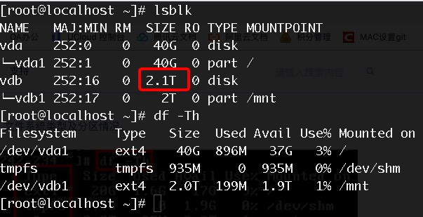

* 在操作系统中 umount 磁盘，使用 `parted /dev/vdb` 命令删除原来分区并创建新分区，同时使用 `lsblk` 命令查看 vdb1 分区信息。若为多分区则删除最后一个分区并创建新分区；

  

  如图所示，其中`unit s 代表将显示和操纵单位变成 sector ` ；`rm 1` 是删除当前分区；` mkpart test 2048s 100% ` 是创建一个名称为 test ，起始扇区为 2048s ，使用磁盘全部空间的新分区 。注：删除当前分区不会造成磁盘内数据丢失。

* 执行`e2fsck -f /dev/vdb1`命令检查文件系统，并使用 `resize2fs /dev/vdb1` 对分区进行扩容操作；

  

* 重新 mount  磁盘并查看磁盘情况，检查扩容是否成功

  

#### 6.7.2.7 2TB 磁盘分区扩容（Windows）

当一块磁盘的容量大于 2TB 时，在 Windows 下无法使用 MBR 分区形式，需要使用 GPT 分区表形式进行磁盘初始化，并通过磁盘管理工具进行分区及扩容操作。2TB 以上磁盘在 Linux 及 Windows 操作系统上的操作不同，本章节为 Windows 下大于 2TB 磁盘扩容操作指南。

本示例以 Windwos Server 2012R2 操作系统为示例环境版本，云硬盘大小为 2TB  ，挂载点为 Disk1（磁盘1） ，扩容至 2.1TB ，即将云盘及分区扩容为 100GB ，实际环境中需根据实际情况进行操作。具体操作如下：

（1）若磁盘为新创建，则需要磁盘管理工具对磁盘进行联机并初始化操作，具体操作如下：

* 当在控制台创建一台 2T 的硬盘挂载至 Windows 虚拟机后，在磁盘管理工具会出现类似 磁盘1 或 Disk1 的磁盘，并且磁盘的状态为脱机；

  

* 如上图所示，右键点击磁盘1 右边空白处，单击联机，将磁盘置为联机状态；

* 磁盘联机后，磁盘状态为 “没有初始化” ，可点击磁盘空白处，点击初始化磁盘；

  

* 在初始化磁盘界面，选择 “GPT（GUID分区表）” 选项，进行磁盘初始化操作；

  

* 磁盘初始化成功后，右键点击磁盘1 未分配区域，点击单建简单卷进行分区及格式化操作；

  

* 在新建简单卷导向中，选择卷大小、驱动器号及格式化选项后，成功创建新的分区，如下图所示：

  

（1）若要扩容 Windows 上 2T 的磁盘，可按如下操作进行扩容：

* 通过控制台或 API 对磁盘 1 进行扩容，扩容后可通过 Windows 操作系统的磁盘管理工具"重新扫描磁盘"查看新扩容磁盘信息，如下图所示磁盘1多出来 100GB 的未分配空间；

  ]

* Windows 扩容分区，可将多余的 100GB 单独划分一个分区，也支持将 100GB 空间扩容至已有分区中，本示例演示将 100GB 未分配的容量扩容至已有分区 D 盘中；

* 右键点击已有分区的空白处（本示例为 D 盘），单击扩展卷，通过扩展卷向导将未分配容量扩展至 D 盘中；

  

* 在扩展卷向导中，选择磁盘1，并输需扩展的容量，通常系统已默认选择所有未分配容量，并确认扩展卷操作

  

* 扩展成功后，未分配容量已成功扩容至已有分区 D 盘中，如上图所示，磁盘总容量为 2.1T ；

  

## 6.8 硬盘克隆

硬盘克隆是指将云硬盘内的数据复制到某个新的云硬盘。硬盘大小及类型必须与原硬盘一致。云硬盘必须处于卸载（可用）状态且云硬盘必须为数据盘才可进行磁盘克隆操作。在硬盘克隆中，源硬盘及目标硬盘不能执行“挂载”、“删除”、“克隆”、”扩容“等操作；

用户可通过云硬盘控制台资源列表上的“**克隆**”按钮，进行云硬盘克隆操作。具体克隆操作如下图所示：


* 源硬盘：需要进行克隆的硬盘名称及标识符；
* 源硬盘容量：需要进行克隆操作硬盘的容量，即源硬盘容量；
* 目标硬盘名称：新克隆的硬盘名称。

选择购买数量和付费方式，如上图所示确认订单并点击“确认” 进行云硬盘克隆操作：

- 购买数量：按照所选配置及参数批量创建多块云硬盘，目前仅支持同时克隆一块硬盘。
- 付费方式：选择硬盘的计费方式，支持按时、按年、按月三种方式，可根据需求选择适合的付费方式；
- 合计费用：用户选择创建云硬盘资源按照付费方式的费用展示；
- 确认：点击确认购买后，会返回云硬盘资源列表页，在列表页可查看云硬盘的克隆过程，克隆成功后，云硬盘状态显示为“可用”。

> 硬盘克隆可用于硬盘数据的备份及快照等应用场景，克隆出的硬盘与源硬盘数据完全一致。

## 6.9 快照管理

云平台分布式存支持磁盘快照能力，可降低因误操作、版本升级等导致的数据丢失风险，是平台保证数据安全的一个重要措施。

### 6.9.1 快照概述

快照是某一时间点一块云盘的数据状态文件，可以理解云硬盘某个时刻的数据备份，云硬盘的数据写入和修改不会对已创建的快照造成影响。

- **定时快照策略：** 定时快照策略是指一个可周期性执行的自动创建快照的策略，快照策略与快照分离，拥有独立的生命周期；
- **快照链：** 快照链是一块云硬盘所有快照的集合，一块云硬盘有且只有 1 个快照链。快照链的引入主要用于快照安全管理和快照额度管理，一条快照链最多包含 512条 快照，其中自动快照和手动快照各 256 条，由于快照采用增量机制，除了第一块快照为全量快照外，后续快照只保留前一块快照的变化数据。当用户删除中间某个快照后，只会删除该快照中未被后序快照引用的 Block，被引用部分的 Block 将记录到后续快照。

在实际应用中，磁盘快照可降低因误操作、版本升级等导致的数据丢失风险，可大致应用于以下业务场景：

- **容灾备份：** 定时为云硬盘制作快照，当系统出现问题时，可快速回退，避免数据丢失。
- **版本回退：** 在业务做重大升级时，建议预先做好快照，当升级版本出现系统问题无法修复时，可通过快照恢复到历史版本。

平台支持对已绑定虚拟机的系统盘及数据盘进行快照操作，同时支持将快照回滚操作，即将快照数据回滚到关联的云硬盘，以满足数据恢复的应用场景。

### 6.9.2 创建快照

用户可在云硬盘列表页面，为某块云硬盘创建快照；若硬盘已挂载虚拟机，用户也可通过虚拟机详情页面的硬盘信息列表对硬盘进行快照操作。

为保证数据及磁盘的安全，仅支持未绑定及已绑定的硬盘进行快照操作，若硬盘在升级或快照中，无法进行创建快照操作。

* 创建快照时，不可进行磁盘挂载/卸载及修改虚拟机状态（如开机或关机），否则可能会导致快照创建异常；
* 快照仅捕获已写入硬盘的数据，不包含应用程序或操作系统缓存在内存中的数据，建议在快照暂停对硬盘的 I/O 操作后进行快照制作，如可以先进行关机或卸载硬盘。

本示例中演示通过云硬盘列表页为云硬盘创建快照操作，如下图所示


在创建快照的向导页面中，用户可通过核验所需创建的硬盘信息，并输入快照名称，进行快照创建操作，如下图：


同一时间仅支持对一个硬盘创建一个快照，点击确认后，会返回至硬盘列表（若在虚拟机详情中，则会返回至虚拟机硬盘列表页面），通过硬盘列表页面可查看硬盘的状态转换为 “快照中” ，待快照创建成功后，转换至“未绑定”或“已绑定” 状态，用户可通过快照资源控制台列表页面查看已创建的快照信息及状态。

### 6.9.3 查看快照信息

快照创建成功后，用户可通过虚拟机控制台，切换至快照管理页面查看快照资源列表信息。列表信息可查看当前账号中所有快照资源，列表信息包括资源名称、资源 ID、磁盘、虚拟机、磁盘属性、状态、创建时间及操作项待，如下图所示：


* 资源名称/ID ：代表当前快照的名称及全局唯一标识符；
* 磁盘：代表当前快照对应的磁盘，即代表该快照是由该磁盘创建；
* 虚拟机：代表当前快照所属硬盘已挂载的虚拟机，若未绑定则为空；
* 磁盘属性：代表当前快照所属硬盘的属性，包括数据盘和系统盘；
* 状态：代表当前快照的运行状态，包括创建中、正常、回滚中、删除中，其中回滚中代表当前快照正在进行回滚操作；
* 创建时间：当前快照的创建时间；
* 操作项：对当前快照的操作项，包括回滚及删除。

### 6.9.4 回滚快照

回滚快照是将某一时刻的快照数据回滚到关联的云硬盘，解决快照数据恢复的应用场景。

* 回滚时云硬盘必须处于卸载或其主机处于关机状态；
* 仅支持正常状态的快照进行回滚操作；

用户可通过点击快照列表操作项中的 “回滚” 对快照进行回滚操作，仅支持回滚快照至所属硬盘，如下图所示：


点击确认后，即返回快照列表页面，快照及所属硬盘均转换为 “回滚中” 状态，待回滚成功后，硬盘转换为 “未绑定” 状态，快照转换为 “正常” 状态。

快照回滚成功后，所属父硬盘上回滚操作前的数据将被清除，由快照中的数据覆盖，即父硬盘中的数据与当前快照上捕获的数据一致。

### 6.9.5 删除快照

平台支持用户通过控制台快照列表页面，对某个快照进行删除操作，快照删除后将彻底销毁。仅支持状态为正常的快照进行删除操作。用户可通过快照管理控制台的“删除”功能删除快照，如下图所示：


## 6.10 删除云硬盘

平台支持通过控制台删除不需要的云硬盘资源，被删除的云硬盘会自动进入“**回收站**”中，可进行还原及销毁。删除云硬盘的前提是云硬盘必须处于“未绑定”状态 。用户可通过云硬盘管理控制台的“删除”功能删除云硬盘，删除后可到回收站中查看已删除的云硬盘资源。

已创建快照的云硬盘不允许删除操作，若云硬盘已创建快照，为保证数据安全，平台会提示不允许删除，如图示：


# 7 私有网络

## 7.1 VPC 简介

### 7.1.1 概述

UCloudStack 通过软件定义网络 （ SDN ）对传统数据中心物理网络进行虚拟化，采用 OVS 作为虚拟交换机，GRE 隧道作为 OverLay 网络隔离手段，通过三层协议封装二层协议，用于定义虚拟私有网络 VPC 及不同虚拟机 IP 地址之间数据包的封装和转发。

私有网络（ VPC ——Virtual Private Cloud ）是一个属于用户的、逻辑隔离的二层网络广播域环境。在一个私有网络内，用户可以构建并管理多个三层网络，即子网（ Subnet ），包括网络拓扑、IP 网段、IP 地址、网关等虚拟资源作为租户虚拟机业务的网络通信载体。

私有网络 VPC 是虚拟化网络的核心，为云平台虚拟机提供内网服务，包括网络广播域、子网（IP 网段）、IP 地址等，是所有 NVF 虚拟网络功能的基础。私有网络是子网的容器，不同私有网络之间是绝对隔离的，保证网络的隔离性和安全性。

用户可通过将虚拟机、负载均衡、弹性网卡、NAT 网卡等虚拟资源加入至私有网络的子网中，提供类似传统数据中心交换机的功能，支持自定义规划网络，并可通过安全组实现同 VPC 子网间的安全防护。

> 可通过专线、VPN、混合云物理 IP 接入等方式将 VPC 与传统数据中心组成一个按需定制的混合云网络环境。

VPC 网络具有地域属性，每个私有网络只能属于一个地域，地域间网络完全隔离，资源默认内网不通；同时租户内和租户间 VPC 网络默认不通，从不同维度保证租户网络和资源的隔离性。

### 7.1.2 VPC 逻辑结构

一个 VPC 网络主要由私有网络网段和子网两部分组成，如下图所示：


**（1）私有网络网段**

VPC 网络所属的 CIDR  网段，作为 VPC 隔离网络的私网网段。关于 CIDR 的相关信息，详见 [CIDR](https://en.wikipedia.org/wiki/Classless_Inter-Domain_Routing) 。创建 VPC 网络需指定私有网段，UCloudStack 私有网络 CIDR 支持的网段范围如下: 

| 网段           | 掩码范围 | IP 地址范围                   |
| -------------- | -------- | ----------------------------- |
| 10.0.0.0/8     | 8 ~ 29   | 10.0.0.0 - 10.255.255.255     |
| 172.16.0.0/12  | 12 ~ 29  | 172.16.0.0 - 172.31.255.255   |
| 192.168.0.0/16 | 16 ~ 29  | 192.168.0.0 - 192.168.255.255 |

!> 由于 DHCP 及相关服务需占用 IP 地址，私有网络 CIDR 网段不支持 `30` 位掩码的私有网段。

**（2）子网**

子网（ Subnet ）是 VPC 私有网络的基础网络地址空间，用于虚拟资源间内网连接。

* 一个私有网络至少由一个子网组成，子网的 CIDR 必须在 VPC 的 CIDR 网段内；
* 同一私有网络内子网间通过`公共网关`连接，资源默认内网互通，可部署虚拟机、负载均衡、NAT 网关等；
* 子网内虚拟资源支持跨可用区部署，实现跨可用区故障隔离，提高资源及应用的灾备能力及可用性；
* 同一个私有网络内子网间默认通过公共网关进行互通，
* 子网 CIDR 网段拔码最小为 `29` 位，不支持 `30` 、`32` 位掩码的子网网段； 
* 每个子网中，使用第一个可用 IP 地址作为网关，如 `192.168.1.0/24` 的网关地址是 `192.168.1.1` 。

> 当子网中存在虚拟资源时，不允许销毁子网及私有网络资源。

### 7.1.3 VPC 连接

UCloudStack 云平台对常用网络设备均进行软件定义及组件抽像，通过将 VPC 网络与虚拟机、弹性网卡、外网 IP、安全组、NAT 网关、负载均衡、VPC 互通、VPN、专线、托管网关等组件连接，可快速构建和配置繁杂的网络环境及混合云场景，如下图所示：


* 虚拟机的弹性网卡加入不同的 VPC 网络及子网，实现精细化网络管理及廉价故障转移方案。
* 虚拟机弹性网卡可直接绑定 外网 IP 实现 Internet 访问，并通过安全组保障网络安全。
* 将虚拟机弹性网卡和 UDB 网卡加入同一个 VPC 网络，满足业务应用和数据库连通场景。
* 将多台虚拟机加入同一个子网，并通过 ULB 连接，提供虚拟机内网负载均衡服务，如子网 2 。
* 将多台虚拟机加入同一个子网，并通过 ULB 及 外网 IP 连接，提供外网负载均衡服务，如子网 4 。
* 将多台虚拟机加入同一个子网，并通过 NATGW 及 外网 IP 连接，共享 外网 IP 访问 Internet ，如子网 3 。
* 通过 VPC 互通服务可实现不同 VPC 网络间资源内网互通。
* 采用 VPN 和专线将私有网络与本地 IDC 数据中心及第三方云平台连通，实现互联网安全访问资源。
* 混合云网关（物理 IP）服务可将私有网络中虚拟机与本地 IDC 数据中心内网打通，实现内网服务混合接入。
* 将安全组服务与弹性网卡绑定，通过安全组规则多维度保障私有网络及虚拟资源的安全。

### 7.1.4 功能与特性

平台 VPC 网络提供基于租户控制台和 API 提供隔离网络环境、自定义子网、子网通信及安全防护等功能，并可结合硬件及 DPDK 等技术特性提供高性能的虚拟网络。

* 隔离的网络环境

  私有网络基于 [OVS](http://www.openvswitch.org/)（ Open vSwitch）组件，通过 [VXLAN](https://datatracker.ietf.org/doc/rfc7348/) 隧道封装技术实现隔离的虚拟网络。每一个 VPC 网络对应一个 VNI ，作为全局唯一网络标识符，为租户提供一张独立且完全隔离的二层网络，可通过在私有网络中划分多个子网作为虚拟资源的通信载体，用于连通多个虚拟资源。不同的 VPC 网络间完全隔离，无法直接通信。

* 自定义子网

  支持在一个 VPC 网络内进行三层网络规划，即划分一个或多个子网。提供自定义 IP 网段范围、可用 IP 网段及默认网关，可在子网中通过虚拟机部署应用程序和服务。支持在子网中增加多个弹性网卡，分别指定子网中的 IP 地址，并绑定至部署应用程序的虚拟机，用于精细化管理应用服务的网络访问。

* 子网通信

  每一个子网都属于一个广播域，VPC 网络默认提供网关服务，同一个 VPC 内不同子网通过网关进行通信。

* 安全防护

  云平台提供内网安全组和外网防火墙，通过协议、端口为虚拟资源提供多维度安全访问控制，同时基于虚拟网卡及虚拟实例的网络流量进行上下行的 QoS 控制，全方位提高 VPC 网络的安全性。安全组为有状态安全层，仅需设置单方向安全规则，即可控制并过滤进出子网及弹性 外网 IP 的数据流量。

* 高性能虚拟网络

  SDN 网络分布式部署于所有计算节点，节点间通过 10GE 冗余链路进行通信，并通过所有计算节点负载内网流量，为云平台提供高可靠及高性能的虚拟网络。同时 UCloudStack 支持对接并兼容 [DPDK](https://www.dpdk.org/ ) ，通过 DPDK 对数据包的转发处理，理论性能接近物理 10GE 的网卡性能，实现超高性能的 VPC 虚拟网络。

平台支持租户和子帐号创建、修改、删除私有网络和子网，并提供私有网络的操作审计日志。用户创建虚拟机、NAT 网关、负载均衡、MySQL 及  Redis 等虚拟资源时可指定需加入的 VPC 网络和子网。VPC 网络具有地域、网段、子网数量等属性，分别代表 VPC 网络所属地域、VPC 网络的 CIDR 网段及已规划的子网数量。

> UCloudStack 为每个租户和子帐号提供默认的 VPC 网络和默认子网，每个租户的都可分配一定的 VPC 配额，可通过云平台管理员在管理控制台进行配置。

## 7.2 创建私有网络

用户可通过指定 VPC 名称、地域、 [CIDR](https://en.wikipedia.org/wiki/Classless_Inter-Domain_Routing) 网段及备注一键添加一个 VPC 网络，用于搭建不同业务的网络环境。创建 VPC 网络前需规划网络，如规划业务 IP 网段及IP 地址。具体操作步骤如下：

1. 用户通过导航栏进入“私有网络”控制台页面，点击“添加 VPC”功能，进入 VPC 创建向导页面：


2. 选择并配置 VPC 网络的名称、备注、地域及网段信息：

- VPC 名称/备注：代表当前需要创建的 VPC 网络的名称及备注信息；
- 地域：VPC 具有地域属性，不同地域之间的云产品默认内网不互通，同地域中不同 VPC 间默认内网不互通，同一个 VPC 的所有子网和资源默认内网互通；
- 网段：当前创建的 VPC 网络所包含的 IP 网段。创建成功后无法修改，VPC 下所有子网共享该网段 IP 地址；

3. 点击确定按钮，返回 VPC 网络列表页面，在 VPC 列表可查看刚才创建的 VPC 网络资源信息。

## 7.3 查看私有网络

通过导航栏进入私有网络控制台，可查看私有网络资源的列表，可通过点击列表上私有网络名称，进入 VPC 及所包含子网资源的详细信息。

### 7.3.1 私有网络列表

私有网络列表页可查看当前帐户下已有的 VPC 资源列表，包括名称、ID、地域、网段、子网数量、创建时间、状态及操作项等，如下图所示：

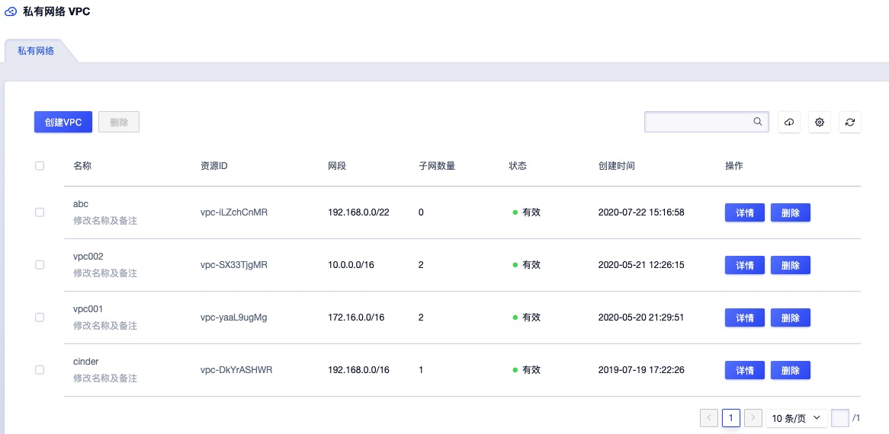

- 名称/ID ：当前 VPC 私有网络的名称及全局唯一标识符；
- 地域：当前 VPC  私有网络所在的区域；
- 网段：当前 VPC 网络在创建时指定的 IP 网段信息；
- 子网数量：当前 VPC 网络包含的子网数量；
- 创建时间：当前 VPC 网络资源的创建时间；
- 状态：当前 VPC 网络的状态，一般为有效；
- 操作：对单个 VPC 网络的操作，包括详情、删除等；
- 可通过搜索框对私有网络的列表进行搜索和筛选，支持模糊搜索。

### 7.3.2 私有网络详情

在 VPC 私有网络资源列表上，点击 VPC 名称可查看当前 VPC 网络的详细信息及包含的子网信息，如下图所示，详情页面分为基本信息及已创建的子网列表两部分信息：


- 基本信息：VPC 网络的基本信息，包括 ID、名称、地域、网段、创建时间及状态；
- 子网列表信息：VPC 详情页面展示当前 VPC 网络中已创建的子网资源列表，子网列表信息包括地域、名称、ID、网段、创建时间、状态及对子网的操作；
  - 地域：指当前子网所在的地域；
  - 名称/ID：当前子网的名称和全局唯一 ID ；
  - 网段：当前子网的网段，该网段是 VPC 网段的其中一部分；
  - 创建时间：指当前子网的创建时间；
  - 状态：当前子网的状态；
  - 操作：指对单个子网的操作，包括删除；
  - 可通过搜索框对子网的列表进行搜索和筛选，支持模糊搜索。

## 7.4 删除私有网络

用户可通过 VPC 网络资源列表上的 “删除” 功能进行 VPC 网络的资源释放。被成功删除的 VPC 网络会被彻底销毁，删除 VPC 网络前必须保证已清空 VPC 网络中的所有子网已被删除。

## 7.5 修改名称和备注

修改 VPC 私有网络的名称和备注，在任何状态下均可进行操作。可通过点击私有网络列表页面每个 VPC 名称右侧的“编辑”按钮进行修改。

## 7.6 添加子网

添加子网是指为一个 VPC 网络添加子网，即三层网络，用于组建属于用户业务的私有网段，每一个网段是一个独立的广播域，有一段属于自己的 IP 网段。子网的 CIDR 网段必须在 VPC 的 CIDR 网段内，同一子网内的资源默认内网互通，同一 VPC 下的所有子网默认互通。

用户可通过指定子网名称、子网 CIDR 网段及备注为一个 VPC 网络添加一个或多个子网，用于构建内网不同的业务网络。创建子网前需保证 VPC 网络 CIDR 内有充足的 IP 网段及 IP 地址。具体操作步骤如下：

1. 通过私有网络列表页面，进入需添加子网的 VPC 网络详情，点击“**添加子网**”功能，进入子网创建向导页面：


2. 根据向导页面选择并配置子网名称、备注及最关键的子网网段：

- 子网名称/备注：当前需要创建的子网的名称和备注信息；
- 子网网段：当前需要创建的子网的 CIDR 网段，子网网段必须在 VPC 的 CIDR 网段内，可以与 VPC CIDR 网段相同，即代表该子网包括 VPC 下所有的网络 IP 地址；

3. 点击确定后，返回至私有网络详情页面，通过详情页面的子网列表可查看新建的子网信息，并可对子网进行相关管理和操作。
4. 子网创建时，子网的状态会转换为“创建中”，子网创建成功后，子网的状态将转换为“有效” 。

> 注：若子网网段的与 VPC 网段相同，则当前私有网络仅支持一个子网。

## 7.7 删除子网

用户可通过子网列表上的“**删除**”功能删除当前子网资源，被删除的子网将被直接销毁。删除子网前须保证子网内的资源已被清空，包含回收站的资源，否则不允许删除当前子网。具体操作如下图所示：


点击确定后，子网列表上会展示当前子网被删除的过程，子网状态将会转换为“删除中”，待子网在列表中清空时，代表删除子网成功。

## 7.8 修改子网名称

修改子网的名称和备注，在任何状态下均可进行操作。可通过点击子网列表页面每个子网名称右侧的“编辑”按钮进行修改。

# 8 外网弹性 IP

## 8.1 弹性 IP 简介

外网弹性 IP（ Elastic IP Address ，简称 EIP ），是 UCloudStack 为用户的虚拟机、NAT 网关及负载均衡等虚拟资源提供的互联网外网 IP 地址，可通 EIP 资源，虚拟机、NAT 网关、负载均衡直接提供互联网外网服务，同时互联网用户也可通过 IP 地址直接访问虚拟机、NAT 网关及负载均衡资源。

EIP 资源支持独立申请和拥有的 IP 地址资源，用户可通过控制台或 API 申请 EIP ，并将 EIP 绑定至虚拟机、负载均衡或 NAT 网关上，为业务提供互联网通道。

EIP 资源位于 UCloudStack 公网网关上并被配置在平台数据库中，SDN 控制器通过调用数据库中可用的公网 IP 地址，直接绑定在所需的虚拟资源网卡上，如直接绑定至虚拟机中用于提供外网的默认的网卡上，因此绑定了 EIP 的虚拟机可以直接使用这个 IP  地址进行公网通信。

- EIP 具有弹性绑定的特性，支持随时绑定至所需的资源上，在不需要时，可随时解绑并绑定至其它资源。
- 支持配置公网 IP 地址的带宽上限，可根据业务需要修改 IP 地址的峰值带宽并即时生效。
- EIP 具有地域属性，被绑定的资源必须与 EIP 在同一个地域才可进行绑定并使用。

外网 IP 为浮动 IP ，可随故障虚拟机恢复漂移到健康节点，继续为虚拟机或其它虚拟资源提供外网互联网服务。如下图所示：


当一台虚拟机所在的物理主机发生故障时，智能调度系统会自动对故障主机上的虚拟机进行宕机迁移操作，即故障虚拟机会在其它健康的主机上重新拉起并提供正常业务服务。若虚拟绑定了外网 IP 地址，智能调度系统会将外网 IP 地址及相关流表信息一起漂移至虚拟迁移后所在的物理主机，并保证网络通信可达。

## 8.2 申请弹性 IP 

申请 EIP 是指为用户创建一个公网 IP 地址，用于绑定至虚拟机、负载均衡或 NAT 网关上，为资源提供互联网访问能力。UCloudStack 平台用户可通过指定 EIP 的计费方式、地域、线路、带宽及名称申请一个 EIP 地址，具体操步骤如下：

1. 用户通过导航栏 "外网弹性 IP" 进入弹性 IP 资源控制台，通过 “**申请弹性 IP**”功能，进入 EIP 申请向导页面：


2. 选择并配置 EIP 资源的计费方式、地域、线路、带宽及名称信息：

- 计费方式：当前需创建公网 IP 资源的计费方式，包括带宽计费和流量计费，本示例仅支持带宽计费，即以带宽作为计费对象和出口上限，不限制流量；
- 地域：指当前申请的 EIP 资源所在的地域，仅支持绑定至同地域的资源，创建后无法修改；
- 线路：指当前申请的 EIP 资源的线路，包括 BGP、联通、电信、移动等，本示例仅支持 BGP 线路；
- 带宽：指当前 EIP 资源的带宽出口上限，可选择 1Mbps ~ 100Mbps （可根据实际链路在后台进行调整）；
- 名称：当前申请的 EIP 资源的名称标识。

> 线路及带宽规格可由管理员在管理控制台进行配置，本示例中均为系统默认配置。

3. 选择购买数量和付费方式，确认订单金额并点击“立即购买” 进行 EIP 的申请和创建。

- 购买数量：按照所选配置及参数批量创建多个 EIP 地址，当前支持批量创建 10 个 EIP ；
- 付费方式：选择 EIP 的计费方式，支持按时、按年、按月三种方式，可根据需求选择适合的付费方式；
- 合计费用：用户选择 EIP 资源按照付费方式的费用展示；
- 立即购买：点击立即购买后，会返回 EIP 资源列表页，在列表页可查看 EIP 的申请过程，通常会先显示“申请中”的状态，几秒内转换为“未绑定”状态，即代表申请成功。

## 8.3 查看弹性 IP

通过导航栏进入弹性 IP 资源控制台，可查看 EIP 资源的列表，可通过点击列表上 EIP 名称，进入 EIP 的详情页面，可查看 EIP 的基本信息、监控信息及操作日志等。

### 8.3.1 EIP 列表

EIP 列表页面可查看当前帐户下已有的弹性公网 IP 资源，列表信息包括地域、名称、ID、IP 地址、带宽、绑定资源、状态、计费方式、创建时间、过期时间及 EIP 资源的操作项等，如下图所示：


- 地域：当前 EIP 资源所在的地域；
- 名称/ID：当前 EIP 资源的名称及全局唯一标识符；
- IP 地址：当前 EIP 资源的 IP 地址及线路，IP 地址为公网 IP 地址；若使用私有 IP 地址模拟公网 IP 地址，则 IP 地址栏显示的为私有 IP 地址。
- 带宽：指当前 EIP 资源的带宽出口上限；
- 绑定资源：当前 EIP 已绑定的资源名称及 ID ，资源类型可以为虚拟机、NAT 网关及负载均衡；
- 状态：当前公网 IP 地址的状态，包括申请中、未绑定、绑定中、已绑定、解绑中、删除中等状态；
- 计费方式：当前公网 IP 地址的付费方式，包括按时、按年、按月；
- 创建时间/过期时间：当前 EIP 资源的创建时间和费用过期时间；
- 操作：对单个 EIP 资源的操作项，包括详情、绑定、调整带宽、删除 EIP、修改告警模板；

平台支持 EIP 的批量操作，包批量创建（10 个）、批量删除及批量解绑操作，方便用户对 IP 地址的管理；同时可通过搜索框对 EIP 资源列表进行搜索和筛选，支持模糊搜索。

### 8.3.2 EIP 详情

在 EIP 资源列表上，点击 EIP 名称可查看当前弹性公网 IP 地址的详细信息，如下图所示，详情页面分为基本信息、监控信息及操作日志三部分：


- 基本信息：弹性 IP 地址的基本信息，包括名称、ID、IP地址、已绑定资源名称、状态、已绑定的告警模板及基础带宽信息；
- 监控信息：当前弹性 IP 地址的监控信息，包括网卡出带宽使用率、出/入带宽及出/入包量。
- 操作日志：展示当前 EIP 的详细操作日志，可提供自定义时间级别的日志展示，同时可对日志进行模糊搜索，默认提供一周内的操作日志，可通过切换日期周期查看不同时间周期的操作日志。操作日志内容包括操作时间、操作名称、操作者、失败原因、备注及操作状态。

## 8.4 绑定资源

绑定资源是指将弹性 IP 地址绑定给一个资源，为资源提供互联网访问能力。可支持绑定的资源包括虚拟机、负载均衡及 NAT 网关。

* 绑定资源即时生效，一个 EIP 同一时间仅支持绑定一个资源；
* 仅支持未绑定状态的 EIP 进行绑定操作；
* 被绑定的资源必须处于运行中或有效状态。

租户可通过 EIP 资源列表页面，点击需要绑定资源的 EIP 操作项中的 “**绑定**”按钮进入绑定资源向导页面，进行资源绑定操作：

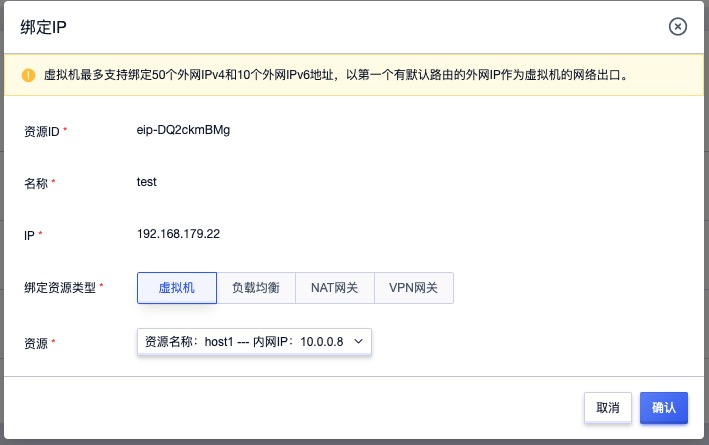

如上图所示，绑定资源时会展示当前 EIP 资源的信息，并需用户选择相关联资源的属性：

- EIP 名称：当前需要绑定资源的 EIP 名称；
- IP 地址：当前需要绑定资源的 EIP 公网 IP 地址及线路；
- 绑定资源类型：需绑定的资源类型，可选择虚拟机、NAT 网关、负载均衡；
  - 仅可选择未绑定 EIP 及运行状态为运行或有效状态的资源；
  - 若资源在创建时已指定 EIP ，则无法绑定；
  - 若需更改资源 EIP ，可先解绑 EIP ，在进行新 EIP 的绑定。
- 资源：需绑定的资源名称和标识，包括虚拟机资源、NAT 网关资源及负载均衡资源；
  - 虚拟机：仅支持选择未绑定 EIP 的虚拟机，且虚拟机必须为运行状态；
  - NAT 网关：仅支持选择未绑定 EIP 的 NAT 网关，且 NAT 网关的必须为运行中状态；
  - 负载均衡：仅支持选择未绑定 EIP 的负载均衡，且负载均衡实例必须为有效状态；
  - 已进入回收站中的虚拟机不可进行 EIP 绑定操作。

点击确定后，会返回 EIP 列表页面，在 EIP 列表页可查看当前绑定的过程，通常绑定会即时完成，待 EIP 资源状态为 “已绑定” 时，即代表绑定成功。可通过 `ping `  EIP  或相关网络工具测试绑定是否生效。

## 8.5 解绑资源

解绑资源是指将一个 EIP 地址从一个资源上分离出来，解绑的 EIP 可与其它资源进行绑定，同时解绑成功的 EIP 才可进行释放和删除。仅当 EIP 状态为已绑定时才可进行解绑操作，通过 EIP 资源列表页面，点击需要绑定资源的 EIP 操作项中的 “**解绑**”按钮进入解绑资源向导页面，进行资源解绑操作：

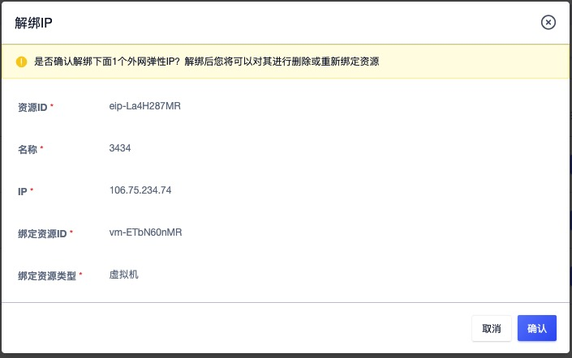

点击解绑后，会返回 EIP 列表页面，在 EIP 列表页可查看当前解绑的过程，通常 EIP 的状态会转换为 “解绑中”，待解绑成功后，将自动转换为 “未绑定” 状态。

## 8.6 调整带宽

调整带宽是指对一个 EIP 的带宽上限进行升级或降级，以适应业务对带宽的不同需求。支持在线或离线调整带宽，即可在不停止服务的情况下实时调整 EIP 的带宽，且不会影响已绑定资源的网络通信；根据不同的付费方式，带宽调整可能会对费用及生效时间产生影响。

- 按小时付费的的弹性IP，升降带宽，下个付费周期生效；
- 按年，按月付费的弹性IP，升级带宽，即时生效，并自动补差价；
- 按年，按月付费的弹性IP，直到当前付费周期的最后一天才允许降级带宽，下个付费周期生效。

通过 EIP 资源列表页面，点击需要绑定资源的 EIP 操作项中的 “**调整带宽**”按钮进入解绑资源向导页面：


如上图所示，配置需要升级或降级的带宽值，点击确定返回 EIP 资源列表页。在列表页可查看调整过程，正在调整带宽的 EIP 状态转换为 “调整带宽中” ，成功后转换为 “未绑定”或“已绑定”状态。

## 8.7 修改告警模板

修改告警模板是对弹性 IP 的监控数据进行告警的配置，通过告警模板定义的指标及阈值，可在弹性 IP 地址相关指标故障及超过指标阈值时，触发告警，通知相关人员进行故障处理，保证 EIP 及业务的网络通信。通过点击 EIP 资源控制台操作中的“修改告警模板”来进行操作，点击后弹出更改告警模板页面，可选择指定告警模板进行关联。具体参数如下：

- 资源 ID ：当前需要添加或修改告警模板的弹性公网 IP 地址的 ID ；
- 资源类型：当前需要添加或修改告警模板的资源类型；
- 告警模板：需要变更的告警模板，一次仅可选择一个；

> 若系统提供的默认告警模板无法满足需求时，可前往“告警模板”页面进行添加和配置。

## 8.8 修改 EIP 名称

修改 EIP 资源的名称和备注，在任何状态下均可进行操作。可通过点击 EIP 资源列表页面每个 EIP 名称右侧的“编辑”按钮进行修改。

## 8.9 删除 EIP 

云平台支持释放并删除 EIP 资源，被删除的 IP 将会自动进入“**回收站**”，可进行恢复和彻底销毁等操作。仅当 EIP 资源在“未绑定”状态时才可进行删除操作。可通过 EIP 资源列表页面操作项中的“删除”按钮进行 EIP 资源的删除，具体操作图如下：


点击确定后，EIP 资源列表会展示当前 EIP 被删除的过程，EIP 状态会转换为“删除中”，成功删除后当前 EIP 资源在列表中被清空，可到回收站中查看已删除的 EIP 资源。

# 9 物理 IP

## 9.1 简述

### 9.1.1 背景

用户使用 UCloudStack 私有云部署并管理应用运行所需的基础设施及中间件等服务，可能会存在某些应用服务（如 Oracle 及 HPC 应用）无法进行虚拟化或云化部署，需要将这些服务部署于物理机或者用户的环境中存在 VMware 及其它相关的虚拟化环境。

这些应用服务及 VMWare 环境上运行的应用需要与部署在 UCloudStack VPC 网络中的应用服务进行内网通信，需 UCloudStack 平台提供一种灵活简捷、稳定可靠且高性能的链路用于 UCloudStack 与物理网络环境直接通信。

物理网络打通是指 UCloudStack 云平台的虚拟网络（VPC/子网）与用户的物理网络进行内网通信，如云平台的虚拟机与用户 IDC 环境的 Oracle 物理机集群进行内网通信及访问。通过打通物理网络，可以将用户的数据中心与 UCloudStack 组成一个内网互通的混合云，为用户提供灵活便捷的应用环境上云及服务器利旧方案，有效除低成本的同时提升资源管理效率。

UCloudStack 与物理网络打通采用“网络直通”的方式进行通信，使用方式与 UCloudStack 弹性公网 IP 一致，需要用户申请一个物理网络的 IP 地址，并将 IP 地址绑定至一台虚拟机，则虚拟机可以直接通过物理网络与物理机进行通信。

### 9.1.2 物理 IP 概述

物理 IP 是指在虚拟机上绑定并配置一个物理网络的 IP 地址，使虚拟机可以直接使用物理网络的 IP 地址直接与物理网络环境中的主机应用进行通信。

通过绑定物理 IP 地址，虚拟机会通过物理 IP 地址、 OVS 的网桥及物理链路等通道与物理网络区域的主机内网打通，同时用户可将物理 IP 地址绑定至 NAT 网关、负载均衡等服务，用于提供不同应用场景的物理网络接入：

- 将物理 IP 地址绑定至虚拟机，一台虚拟机可直接通过物理 IP 与物理网络通信；
- 将物理 IP 地址绑定至 NAT 网关，关联 NAT 网关的虚拟机均通过该 IP 地址与物理网络进行通信（暂未上线）
- 将物理 IP 地址绑定至负载均衡，物理网络区域的主机通过物理 IP 地址访问关联至负载均衡服务的后端虚拟机；（暂未上线）

平台需支持 物理 IP 地址的全生命周期管理，包括物理 IP 地址的创建、修改、查看、删除、绑定、解绑、监控告警、操作日志及删除的恢复和销毁。支持物理IP带宽默认不限制（最大带宽等同于宿主网卡带宽），不受限于同机EIP带宽。

### 9.1.3 物理网络架构

在物理连接上，需要用户将物理网络与 UCloudStack 的外网交换机进行互联，并分配一段物理 IP 地址给云平台，用于租户申请并绑定至虚拟机，具体物理拓扑图如下：


- 物理网络设备与 UCloudStack 网络设备的接入可根据实际环境进行调整，若无核心交换机设备，则需要将物理网络设备接入至外网接入交换机；
- 通常均需接入至 UCloudStack 平台的外网网关设备，即外网 Vlan 及 IP 地址段配置的网络设备；
- 物理网络设备与 UCloudStack 网络设备连接方式为二层互联：
  - 物理网络划分一个 Vlan ，提供二层互联、IP地址段及网关；
  - UCloudStack 网络设备接入接口配置为物理网络提供的 Vlan ，与用户的物理网络处于二层互联；
  - 连接方式也可以选择二层聚合、三层聚合、L3 ECMP 、L3 A/S 等互连模式。

### 9.1.4 逻辑架构

在产品逻辑层面，租户通过申请一个物理网络（如 Vlan100 192.168.0.0/23）的 IP 地址，并将该 IP 地址绑定至一台虚拟机，使虚拟机可以通过 Vlan100 的网络访问物理网络区域的物理机，如 Oracle、HPC及 APP 等物理服务器，具体逻辑架构图如下：


- 用户分发的物理网络 Vlan IP 地址段默认被配置到 UCloudStack 物理网络接入（虚拟外网）的数据库中；
- 当用户申请一个物理 IP 地址并绑定至一台虚拟机时，平台会将 IP 地址直接配置至虚拟机外网网卡，并通过控制器下发流表至虚拟机所在的物理机 OVS ，指定已绑定的物理 IP 地址的路由等信息；
- 物理机 OVS 通过与物理机外网网卡接口及交换机进行互联，通过物理交换机设备与物理网络区域进行通信；
- 当虚拟机需要访问物理网络区域物理机时：
  - 数据会通过虚拟机外网网卡透传至 OVS 虚拟交换机；
  - 通过 OVS 的流表将请求通过物理机外网网卡及物理交换机；
  - 物理交换机通过 Vlan 信息将数据包转发至物理网络区域的物理机，完成通信。

### 9.1.5 使用流程

物理网络打通时，需先保证物理网络可达，在通过物理 IP 的绑定实现虚拟机与物理服务器的内网通信。

1. 根据需求完成物理网络设备的接入和配置；
2. 通过 Admin 管理控制台或后台配置的方式，配置物理网络的名称及 IP 地址段到 UCloudStack 虚拟外网数据库中，即管理员后台添加物理网络；
3. 租户通过控制台或 API 的方式在虚拟外网中选择物理网络，申请一个物理网络的 IP 地址；
4. 租户将申请的物理网络 IP 地址绑定至虚拟机；
5. 虚拟机可通过绑定的 IP 地址与物理网络区域的物理机进行通信。


### 9.1.6 功能特性

UCloudStack 平台支持物理 IP 全生命周期的管理，包括申请物理 IP、查看物理 IP、绑定/解绑资源、删除物理 IP、 IP 监控、IP 操作日志、IP 安全防护等功能，同时支持平台管理员配置物理 IP 地址池、查看物理 IP 使用率、设置物理 IP 的配额 、权限等。

物理 IP 完整生命周期包括创建中、未绑定、绑定中、已绑定、解绑中、已删除、已销毁等资源状态，各状态流转如下图所示：


* 物理 IP 支持绑定至虚拟机，为虚拟机提供物理 IP 网络接入；
  * 一个虚拟机仅支持绑定一个物理 IP ，一个物理 IP 仅支持绑定一种资源；
  * 虚拟机支持同时绑定一个 外网 IP 和 一个物理 IP。
* 平台支持对物理 IP 地址进行监控数据的收集和展示，通过监控数据展示每一个物理 IP 地址的指标数据，同时支持为每一个物理 IP 的监控指标设置阈值告警及通知策略。
* 物理 IP 地址的网络访问控制可以关联安全组给予安全保障，通过安全组的规则可控制到达物理 IP 地址的入站流量及出站流量，支持 TCP、UDP、ICMP、GRE 等协议数据包的过滤和控制。安全组及安全组的规则支持对已关联安全组的物理 IP 地址的流量进行限制，仅允许安全组规则内的流量透传安全组到达目的地。
* 支持管理员配置并管理全物理 IP 地址在全局及单个租户内的配额 ，租户可查询当前物理 IP 的配额信息，包括配额总数量及已使用数量。
* 支持主帐号对子帐号物理 IP 产品进行权限控制，即控制子帐号对物理 IP 每个功能的开启和关闭，包括申请物理 IP、查看物理 IP、绑定物理IP、解绑物理 IP、删除物理 IP、修改告警模板、修改名称和备注等。

- 资源隔离
  - 物理 IP 地址在主/子帐号间相互隔离，相互不可查看和使用；
  - 主帐号可查看帐号下及归属子帐号的所有物理 IP 资源；
  - 一个 物理 IP 被一个租户申请，不可在被另一个租户申请。
- 网络隔离
  - 物理 IP 在 UCloudStack 平台无隔离性保证，网络隔离由物理网络进行管理；
  - 若两个物理 IP 在物理网络中归属为一个 Vlan ，则任何情况下都可进行通信；
  - 若两个物理 IP 在物理网络中归属不同的 Vlan，则不可进行通信；
  - 若两个归属不同 Vlan 的物理 IP 需要通信，则需要物理网络进行 Vlan 间打通。

> 在使用物理 IP 地址前，需平台管理员在管理控制台增加物理 IP 地址的线路及地址池，并配置物理 IP 地址的相关 Vlan 、网关、路由、带宽上限等参数，以供租户使用物理 IP 地址打通物理网络。

## 9.2 申请物理 IP 

申请物理 IP 是指为用户创建一个物理 IP 地址，用于绑定至虚拟机，为资源提供物理网络混合接入访问能力。平台用户可通过指定 物理 IP 的地域、线路及名称申请一个物理 IP 地址，具体操步骤如下：

1. 用户通过导航栏 "虚拟外网" 进入物理 IP 资源控制台，通过 “**申请物理 IP**”功能，进入申请向导页面：


2. 选择并配置物理 IP 资源的名称、地域及线路信息：

- 名称：当前申请的物理 IP 资源的名称标识。
- 地域：指当前申请的物理 IP 资源所在的地域，仅支持绑定至同地域的资源，创建后无法修改；
- 线路：指当前申请的物理 IP 资源的线路，由管理员在进行混合云接入时在管理控制台进行线路的配置，本示例以“办公网”为线路示例；

> 线路可由管理员在管理控制台进行配置，本示例中均为系统默认配置。

3. 点击确定后，会返回物理 IP 资源列表页，在列表页可查看物理 IP 的申请过程，通常会先显示“申请中”的状态，秒内转换为“未绑定”状态，即代表申请成功。

## 9.3 查看物理 IP 

通过导航栏进入物理 IP 资源控制台，可查看物理 IP 资源的列表，可通过点击列表上物理 IP 名称，进入物理 IP 的详情页面，可查看物理 IP 的基本信息、监控信息及操作日志等。

### 9.3.1 物理 IP 列表

列表页面可查看当前帐户下已有的物理 IP 资源，列表信息包括地域、名称、ID、IP 地址、绑定资源、状态、创建时间、更新时间及物理 IP 资源的操作项等，如下图所示：


- 地域：当前物理 IP 资源所在的地域；
- 名称/ID：当前物理 IP 资源的名称及全局唯一标识符；
- IP 地址：当前物理 IP 资源的 IP 地址及线路，IP 地址由管理员在后台配置的物理网段中生成；
- 绑定资源：当前物理 IP 已绑定的资源名称及 ID ，资源类型目前仅支持虚拟机；
- 状态：当前物理 IP 地址的状态，包括申请中、未绑定、绑定中、已绑定、解绑中、删除中等状态；
- 创建时间/更新时间：当前物理 IP 资源的创建时间和更新时间；
- 操作：对单个物理 IP 资源的操作项，包括详情、绑定、删除 及修改告警模板。

平台支持物理 IP 的批量操作，包括批量删除及批量解绑操作，方便用户对 IP 地址的管理；同时可通过搜索框对 物理 IP 资源列表进行搜索和筛选，支持模糊搜索。

### 9.3.2 物理 IP 详情

在 EIP 资源列表上，点击物理 IP 名称可查看当前物理 IP 地址的详细信息，如下图所示，详情页面分为基本信息、监控信息及操作日志三部分，其中：

- 基本信息：物理 IP 地址的基本信息，包括地域、名称、ID、IP地址/线路、已绑定资源名称、状态及已绑定的告警模板信息；
- 监控信息：当前物理 IP 地址的监控信息，包括网卡出带宽使用率、出/入带宽及出/入包量。
- 操作日志：展示当前物理 IP 的详细操作日志，可提供自定义时间级别的日志展示，同时可对日志进行模糊搜索，默认提供一周内的操作日志，可通过切换日期周期查看不同时间周期的操作日志。操作日志内容包括操作时间、操作名称、操作者、失败原因、备注及操作状态。

## 9.4 绑定资源

绑定资源是指将物理 IP 绑定给一个资源，为资源提供 IDC 物理网络混合云接入访问能力。目前仅支持支持绑定虚拟机资源。

* 绑定资源即时生效，一个物理 IP 同一时间仅支持绑定一个资源；
* 仅支持未绑定状态的物理 IP 进行绑定操作；
* 被绑定的资源必须处于运行中或有效状态。

租户可通过物理 IP 资源列表页面，点击需要绑定资源的物理 IP 操作项中的 “**绑定**”按钮进入绑定资源向导页面，进行资源绑定操作：


如上图所示，绑定资源时会展示当前物理 IP 资源的信息，并需用户选择相关联资源的属性：

- 物理 IP 名称：当前需要绑定资源的 EIP 名称；
- IP 地址：当前需要绑定资源的物理 IP 地址；
- 绑定资源类型：需绑定的资源类型，目前仅支持选择虚拟机；
  - 仅可选择未绑定物理 IP 及运行状态为运行或有效状态的虚拟机；
  - 若虚拟机在创建时已指定物理 IP  ，则无法绑定；
  - 若需更改资源物理 IP ，可先解绑物理 IP  ，在进行新物理 IP 的绑定。
- 资源：需绑定的虚拟机资源名称和标识，仅支持选择未绑定物理 IP 的虚拟机，且虚拟机必须为运行状态。

点击确定后，会返回物理 IP 列表页面，在列表页可查看当前绑定的过程，通常绑定会即时完成，待物理 IP 资源状态为 “已绑定” 时，即代表绑定成功。可通过 `ping ` 物理 IP 或相关网络工具测试绑定是否生效。

## 9.5 解绑资源

解绑资源是指将一个物理 IP 地址从一个资源上分离出来，解绑的物理 IP 可与其它资源进行绑定，同时解绑成功的 物理 IP 才可进行释放和删除。仅当物理 IP 状态为已绑定时才可进行解绑操作，通过物理 IP 资源列表页面，点击需要绑定资源的物理 IP 操作项中的 “**解绑**”按钮进入解绑资源向导页面，进行资源解绑操作：


点击解绑后，会返回物理 IP 列表页面，在列表页可查看当前解绑的过程，通常物理 IP 的状态会转换为 “解绑中”，待解绑成功后，将自动转换为 “未绑定” 状态。

## 9.6 修改告警模板

修改告警模板是对物理 IP 的监控数据进行告警的配置，通过告警模板定义的指标及阈值，可在物理 IP 地址相关指标故障及超过指标阈值时，触发告警，通知相关人员进行故障处理，保证物理 IP 及业务的网络通信。通过点击 物理 IP 资源控制台操作中的“修改告警模板”来进行操作，点击后弹出更改告警模板页面，可选择指定告警模板进行关联。具体参数如下：

- 资源 ID ：当前需要添加或修改告警模板的物理 IP 地址的 ID ；
- 资源类型：当前需要添加或修改告警模板的资源类型；
- 告警模板：需要变更的告警模板，一次仅可选择一个；

> 若系统提供的默认告警模板无法满足需求时，可前往“告警模板”页面进行添加和配置。

## 9.7 修改物理 IP 名称

修改物理 IP 资源的名称和备注，在任何状态下均可进行操作。可通过点击物理 IP 资源列表页面每个物理 IP 名称右侧的“编辑”按钮进行修改。

## 9.8 删除物理 IP 

云平台支持释放并删除物理 IP 资源，被删除的物理 IP 将会自动进入“**回收站**”，可进行恢复和彻底销毁等操作。仅当物理 IP 资源在“未绑定”状态时才可进行删除操作。可通过物理 IP 资源列表页面操作项中的“删除”按钮进行资源的删除，具体操作图如下：


点击确定后，物理 IP 资源列表会展示当前物理 IP 被删除的过程，物理 IP 状态会转换为“删除中”，成功删除后当前 物理 IP 资源在列表中被清空，可到回收站中查看已删除的物理 IP  资源。

# 10 安全组

## 10.1 安全组简介

安全组（ Security Group ）是一种类似 [IPTABLES](https://en.wikipedia.org/wiki/Iptables) 的虚拟防火墙，提供出入双方向流量访问控制规则，定义哪些网络或协议能访问资源，用于限制虚拟资源的网络访问流量，为云平台提供必要的安全保障。

### 10.1.1 安全组概述

UCloudStack 安全组基于 Linux Netfilter 子系统，通过在 [OVS](http://www.openvswitch.org/) 流表中添加流表规则实现，需开启宿主机 IPV4 包转发功能；每增加一条访问控制规则会根据网卡作为匹配条件，生成一条流表规则，用于控制进入 OVS 的流量，保证虚拟资源的网络安全。安全组仅可作用于**同一个 Region** 内具有相同安全需求的虚拟机、负载均衡及 NAT 网关，工作原理如下图所示：


安全组具有独立的生命周期，可以将安全组与虚拟机、弹性网卡、负载均衡、NAT 网关绑定在一起，提供安全访问控制。与之绑定的虚拟资源销毁后，安全组将自动解绑。

- 安全组对虚拟机的安全防护针对的是一块网卡，即安全组是与虚拟网卡/弹性网卡绑定在一起，分别设置访问控制规则，限制每块网卡的出入网络流量；
- 如安全组原理图所示，安全组与提供 EIP 服务的虚拟网卡绑定，通过添加出入站规则，对虚拟机互联网的访问流量进行过滤；
- 安全组与提供私有网络服务的虚拟网卡或弹性网卡绑定，通过添加出入站规则，控制虚拟机间及弹性网卡间网络访问；
- 安全组与公网类型的负载均衡关联，通过添加出入站规则，可对进出公网负载均衡的 EIP 流量进行限制和过滤，保证公网负载均衡器的安全；
- 安全组与 NAT 网关绑定，通过添加出入站规则，可对进入 NAT 网关的流量进行限制，保证 NAT 网关的可靠性和安全性；
- 一个安全组支持同时绑定至多块弹性网卡、NAT 网关及负载均衡实例；
- 一块虚拟网卡或弹性网卡仅支持绑定一个安全组；
- 一个外网负载均衡实例仅支持绑定一个安全组，一个 NAT 网关实例仅支持绑定一个安全组；

创建虚拟机时必须指定外网安全组，每个虚拟机至少属于一个安全组，支持随时修改安全组的出入站规则，新规则生成时立即生效，可根据需求调整安全组出/入方向的规则。支持安全组全生命周期管理，包括安全组创建、修改、删除、绑定资源、解绑资源及安全组规则的创建、修改、删除等生命周期管理。

### 10.1.2 安全组规则

安全组规则可控制允许到达安全组关联资源的入站流量及出站流量，支持对 TCP、UPD、ICMP、GRE 等协议数据包进行有效过滤和控制。每个安全组支持配置多条规则，根据优先级对资源访问依次生效。规则为空时，安全组将默认接受 ( All Accept ) 所有流量；规则不为空时，除已生成的规则外，默认拒绝其它访问流量。

每条安全组规则由协议、端口、地址、动作、优先级及方向六个元素组成：

- 协议：支持 TCP、UDP、ICMP、GRE 四种协议数据包过滤；
  - 可选择 ALL 指定所有协议，ALL TCP 选择所有 TCP 端口，ALL UDP 选择所有 UDP 端口；
  - 支持快捷协议指定，如 FTP、HTTP、HTTPS、PING、OpenVPN、PPTP、RDP、SSH 等；
- 端口：源地址所访问的本地虚拟资源的 TCP/IP 端口；
  - TCP 和 UDP 协议的端口范围为 1~65535 ；
  - ICMP 和 GRE 不支持配置端口；
- 地址：访问云平台资源的网络数据包来源地址或目标地址；
  - 支持 CIDR 表示法的 IP 地址及网段，如 `120.132.69.216` 或 `0.0.0.0/0` ；
  - 若规则的方向是入站规则，则地址代表数据包的来源地址；
  - 若规则的方向是出站规则，刚地址代表数据包的目标地址；
- 动作：安全组生效时，对数据包的处理策略，包括 “接受” 和 “拒绝” 两种动作；
- 优先级：安全组内规则的生效顺序，包括高、中、低三档规则；
  - 安全组按照优先级高低依次生效，优先生效优先级高的规则；
  - 同优先级的规则，优先生效精确规则；
- 方向：安全组规则所对应的流量方向，包括出站流量和入站流量；

**UCloudStack 安全组支持数据流表状态，规则允许某个请求通信的同时，返回数据流会被自动允许，不受任何规则影响。即安全组规则仅对新建连接生效，对已经建立的链接默认允许双向通信。**如一条入方向规则允许任意地址通过互联网访问虚拟机弹性 IP 的 80 端口，则访问虚拟机 80 端口的返回数据流（出站流量）会被自动允许，无需为该请求添加出方向允许规则。

> 注：通常建议设置简洁的安全组规则，可有效减少网络故障；

## 10.2 安全组管理

### 10.2.1 创建安全组

若系统默认提供的安全组无法满足需求时，可通过指定名称、地域并添加相关安全组规则，即可快速创建一个属于用户独立的安全组，可关联或绑定至相关资源，为相关资源提供内网或外网的访问控制，保证网络访问的安全性。

用户通过导航栏进入安全组资源控制台，通过控制台的“**创建安全组**”可进入安全组创建向导页面，如下图所示：


可根据向导页面的提示，选择并配置安全组名称、地域，并根据需求配置安全组规则，包括协议类型、端口、地址、动作、优先级及方向等。

- 安全组名称：当前需要创建的安全组的名称标识；
- 地域：当前需要创建的安全组所属地域，一旦创建无法修改；
- 添加规则：增加安全组相应的入和出的流量规则，可批量增加多条，也可在安全组创建后在进行规则的添加；
  - 协议：需要添加规则控制的网络协议，支持 TCP、UDP、ICMP、GRE 四种协议数据包过滤；
    - 可选择 ALL 指定所有协议，ALL TCP 选择所有 TCP 端口，ALL UDP 选择所有 UDP 端口；
    - 支持快捷协议指定，如 FTP、HTTP、HTTPS、PING、OpenVPN、PPTP、RDP、SSH 等；
  - 端口：需要添加规则控制的网络端口，即源地址所访问的本地虚拟资源的 TCP/IP 端口。TCP 和 UDP 协议的端口范围为 1~65535 ，ICMP 和 GRE 不支持配置端口。
  - 地址：访问已关联安全组资源的网络数据包来源地址或目标地址；
    - 支持 CIDR 表示法的 IP 地址及网段，如 `120.132.69.216` 或 `0.0.0.0/0` ；
    - 若规则的方向是入站规则，则地址代表数据包的来源地址；
    - 若规则的方向是出站规则，刚地址代表数据包的目标地址；
  - 动作：安全组生效时，新建规则对数据包的处理策略，包括 “接受” 和 “拒绝” 两种动作；
  - 优先级：安全组内规则的生效顺序，包括高、中、低三档规则；
    - 安全组按照优先级高低依次生效，优先生效优先级高的规则；
    - 同优先级的规则，优先生效精确规则，如优先生效
  - 方向：当前创建的安全组规则所对应的流量方向，包括出站流量和入站流量。

点击确定后，自动返回至安全组列表页面，在列表页面可查看新建安全组的创建过程，待安全组的状态由“创建中”转换为“有效”时，即代表创建成功。

### 10.2.2 查看安全组

通过导航栏进入安全组资源控制台，可查看当前帐户已有安全组资源的列表，同时可通过点击列表上安全组的名称，进入安全组的详情页面，用于查看安全组的详细信息、安全组规则及已绑定的资源等信息。

#### 10.2.2.1 安全组列表

安全组列表页面可查看当前帐号下已有的安全组资源，列表信息包括地域、名称、ID、规则数量、绑定资源数量、创建时间、状态及操作项等，如下图所示：


- 地域：安全组所在的地域，一个地域的安全组仅可绑定或关联同一个地域的资源；
- 名称/ID ：当前安全组的名称及全局唯一标识符；
- 规则数量：当前安全组已添加的安全组规则数量，一般以数字表示；
- 绑定资源数量：当前安全组已绑定的资源数量，一般以数字表示，未绑定时显示为 0 ；
- 创建时间：当前安全组的创建时间；
- 状态：当前安全组的运行状态，包括有效、创建中、删除中等；
- 操作：对单个安全组的操作项，包括编辑安全组及删除；
- 可通过搜索框对 安全组 资源列表进行搜索和筛选，支持模糊搜索。

平台支持安全组的批量删除操作，方便用户对无用的安全组进行批量管理；同时可通过搜索框对安全组资源列表进行搜索和筛选，支持模糊搜索。

#### 10.2.2.2 安全组详情

在安全组资源列表上，点击安全组名称可查看当前安全组的详情，如下图所示，详情页面分为基本信息、安全组规则管理及已绑定的资源三部分内容，如下图所示：


- 基本信息：当前安全组的基本信息，包括名称、ID、规则数量、已绑定资源数量及创建时间等信息；
- 安全组规则管理：当前安全组的访问控制规则管理，包括新建、查看、编辑、删除等，详见[安全组规则管理](#10.3 安全组规则管理)；
- 已绑定资源：当前安全组已绑定资源的列表信息，详见[已绑定资源](#10.2.2.3 已绑定资源)；

#### 10.2.2.3 已绑定资源

已绑定资源指安全组已绑定资源的列表信息，可通过列表信息查看当前安全组已经绑定或关联的虚拟资源信息。用户可通过安全组详情页面进入“**资源**”子页面，查看已绑定的资源信息。


如上图列表图所示，已绑定资源的列表信息包括地域、可用区、资源名称、资源类型、资源ID等信息，其中资源类型包括网卡、虚拟机、NAT 网关、负载均衡。

### 10.2.3 修改安全组名称

修改安全组资源的名称和备注，在任何状态下均可进行操作。可通过点击安全组资源列表页面每个安全组名称右侧的“编辑”按钮进行修改。

### 10.2.4 删除安全组

用户可删除不需要的安全组资源，被删除的安全组将会自动进入“**回收站**”，可进行恢复和彻底销毁等操作。仅支持删除未绑定资源的安全组，若安全组已绑定资源，可进行安全组变更后，在进行删除操作。可通过安全组列表页面操作项中的“删除”进行安全组的删除。

## 10.3 安全组规则管理

### 10.3.1 新建规则

安全组为已绑定资源提供网络安全访问控制的主要手段是制定合理的安全组规则。每个安全组支持配置多条规则，根据优先级对资源访问依次生效。规则为空时，安全组将默认接受 ( All Accept ) 所有流量；规则不为空时，除已生成的规则外，默认拒绝其它访问流量。

用户可指定规则的协议类型、端口、地址、动作、优先级、方向等信息进行规则的添加，通过安全组详情页面的“**新建规则**”即可进入新建规则向导页面，具体操作与 [创建安全组](#10.2.1 创建安全组) 中的添加规则相同，可根据具体业务网络安全控制需求，新建安全组规则。

### 10.3.2 查看规则

通过安全组详情页面的规则列表可查看当前安全组已生成的规则信息，并可通过列表的操作项对已有规则进行编辑和删除等操作。规则列表信息包括协议类型、端口、地址、动作、优先级、方向及操作项等，如下图所示：


### 10.3.3 编辑规则

若已有安全组规则不能满足业务需求时，可通过安全组规则列表操作项中的“**编辑**”进行修改及变更操作，修改项与新建规则时指定的参数相同，可根据实际情况修改指定参数。

- 当协议类型为 ALL 或 ICMP 时，端口不可选择并显示为`“/”` ；
- 地址支持 IP 地址和 CIDR IP 网段格式，若需指定所有地址可配置为 `0.0.0.0/0` ；

规则编辑后即时生效，同时会对已绑定的资源网络访问产生影响，请慎重操作。

### 10.3.4 删除规则

若已有安全组规则需被删除时，可通过安全组规则列表操作项中的“**删除**”操作，删除的规则会被即时销毁，为避免影响业务，建议删除前确认安全组规则是否有必要删除。删除安全组规则后，安全组信息中的规则数量会重新统计，显示最新的规则数量。

# 11 负载均衡

## 11.1 负载均衡简介

### 11.1.1 概述

负载均衡（ Load Balance ）是由多台服务器以对称的方式组成一个服务器集合，每台服务器都具有等价的地位，均可单独对外提供服务而无须其它服务器的辅助。UCloudStack 负载均衡服务是基于 TCP/UDP/HTTP 协议将网络访问流量在多台虚拟机间自动分配的控制服务，类似于传统物理网络的硬件负载均衡器。

通过平台负载均衡服务提供的虚拟服务地址，将同一地域添加至负载均衡的虚拟机虚拟构建为一个高性能、高可用、高可靠的应用服务器池，并根据负载均衡的转发规则，将来自客户端的请求均衡分发给服务器池中最优的虚拟机进行处理。

UCloudStack 负载均衡服务简称 ULB ，支持内外网两种访问入口类型的负载均衡器，适应多种网络架构及高并发的负载应用场景。提供四层和七层协议的转发能力及多种负载均衡算法，支持会话保及健康检查等特性，可自动隔离异常状态虚拟机，并有效提高整体业务的可用性及服务能力。

同时 ULB 支持收集并展示负载流量各种网络指标的监控数据，并可根据告警模板进行监控报警及通知，保证业务的正常运行。当前 ULB 为接入的虚拟机服务池提供基于 NAT 代理的请求分发方式，在 NAT 代理模式下，所有业务的请求和返回数据都必须经过 ULB ，类似 LVS 的 NAT 工作模式。

### 11.1.2 应用场景

UCloudStack 平台提供公网和内网两种类型的负载均衡服务，分别对应不同互联网服务和内网服务两种场景。用户可根据业务需求，选择创建对外公开或对内私有的负载均衡实例，平台会根据负载均衡类型分别分配公网 IP 地址、物理 IP 地址或 VPC 私网 IP 地址，即负载均衡的服务访问地址。

- 公网 IP 负载均衡使用场景：
  - 部署在平台的业务服务需要构建虚拟机集群，且需对公网提供统一访问入口。
  - 业务服务需要为不同线路或运营商用户提供就近服务并需要 CDN 加速。
- 内网负载均衡使用场景：
  - 部署在平台的业务服务需要构建虚拟机集群，且仅需对 VPC 内网提供统一访问入口。
  - 部署在 VPC 私有网络的虚拟机集群需要对其它用户或服务屏蔽真实 IP 地址，对客户端提供透明化服务。

> 用户也可将负载均衡服务分配的 IP 地址与自有域名绑定在一起，通过域名访问后端应用服务。

### 11.1.3 负载均衡架构

一个提供服务的负载均衡服务，主要由 ULB 实例（ LoadBalancer ）、虚拟服务器（ VServer ）、后端服务器（ Backend Real Server ）三部分组成。如下 ULB 架构图所示：


- UCloudStackLoadBalancer（ ULB ）：UCloudStack 负载均衡器，结合内外网 IP 地址，根据 VServer 配置的监听器，将虚拟机加入到 Backend 成为 Real Server ，以实现流量均衡与服务容错的功能。
- Virtual Server（ VServer ）：监听器，每个监听器是一组负载均衡端端口配置，包含协议、端口、负载算法、会话保持、客户端超时及健康检查等配置项。
- Backend Server Pool ：后端一组虚拟机服务器池，用于实际处理请求，其中服务器池中的每一台虚拟机都称为 “RealServer” ，即真实部署业务的虚拟机实例。
- 外网 IP（ EIP ）：弹性 IP 地址，外网弹性 IP 地址，绑定在 ULB 实例上以提供外网访问地址及带宽。
- Private IP：内网 IP 地址，内网负载均衡提供服务的访问地址，通常是由创建内网负载均衡器时指定的 VPC 自动分配。

UCloudStack 负载均衡服务的基本工作原理：当 ULB 接受到来自客户端的请求后，会将请求路由到一个或多个可用区的后端虚拟机进行业务处理。

- ULB 最核心的功能是由 VServer 负责监听 ULB 实例入口地址上的服务请求，并通过一系列负载均衡算法将请求分发到 Backend 的 Real Server 进行请求处理，在 NAT 请求代理模式下，请求均由 ULB 进行接受并分发；
- 负载均衡服务支持加权轮询、最小连接数及基于源地址的负载均衡算法，不同的负载均衡算法，会使用不同的依据条件进行流量转发，如轮询则是请求按照顺序将请求依序转发给后端虚拟机；
- VServer 监听器通过配置会话保持功能，在请求会话的生命周期内，可以将同一个客户端的请求转发至同一个虚拟机进行处理，适用于 TCP 长连接等应用场景；
- VServer 监哭的器通过配置健康检查功能，健康检查会监控后端 RealServer 的运行状况，确保只将流量分发至正常运行的虚拟机上；
  - 当 ULB 检测到后端虚拟机运行状况不佳时，会停止向该虚拟机分发负载流量；
  - 当再次检测到虚拟机恢复正常后，会重新向该虚拟机分发负载流量；
- 默认情况下，后端 RealServer 虚拟机处理请求后，会将请求返回给 ULB ，由 ULB 将结果返回给客户端。

### 11.1.4 功能特性

UCloudStack 负载均衡服务提供四层和七层负载均衡，支持内网和外网两种网络入口，在多种负载调度算法基础之上支持会话保持、健康检查、请求超时、内容转发等功能，保证后端服务的高可用和高可靠。

- 支持公网和内网两种类型的负载均衡器，满足虚拟机 VPC 内网负载均衡及互联网服务负载均衡应用场景；
- 提供负载均衡集群服务，实现负载均衡器故障自动切换，提高接入负载均衡服务的可用性，提高资源利用率；
- 支持 TCP、UDP、HTTP 等协议的监听器，支持四层和七层业务的负载均衡服务；
- 负载均衡算法：支持加权轮询、最小连接数和源基于源地址的的负载调度算法：
  - 源地址：ULB 根据连接的源地址，利用一定的哈希算法将请求其转给某台主机，用户下次以相同的 IP 访问，如虚拟机数量不变时，访问会分发给该台虚拟机进行处理；
  - 加权轮询：ULB 接收到新的连接后，根据用户指定的后端虚拟机权重，按照概率分发流量到各虚拟机；
  - 最小连接数：ULB 接收到新的连接后，会实时统计 ULB 到后端虚拟机的连接数，选择连接数最低的虚拟机建立新的连接并发送数据；
- 支持会话保持功能，可以在轮询等负载均衡算法下，保证同一个源的请求，由相同的后端虚拟机进行处理。会话保持针对四层和七层的实现方式不同：
  - 四层会话保持：针对 UDP 协议时，基于 IP 地址保证会话保持，ULB 会将来自同一 IP 地址的访问请求转发到同一台后端虚拟机进行处理，支持关闭会话 UDP 会话保持功能；
  - 七层会话保持 ：针对 HTTP 协议，ULB 基于 Cookie 支持会话保持功能。用户在配置时可以选择开启会话保持功能。会话保持支持两种方式：
    - Cookie 插入：选择自动生成 key ，客户端的 cookie 插入操作均由 ULB 来分配和管理；
    - 用户指定 Cookie 插入：用户可自定义 key ，ULB 使用自定义的 key 进行分配和管理 Cookie 插入。
- 健康检查：根据规则对后端业务服务器进行健康检查，支持端口检查和 HTTP 检查，可自动检测并隔离服务不可用的虚拟机，一旦发现问题，迅速将故障虚拟机切换，确保服务可用性；
  - 端口检查：针对四层和七层负载均衡，支持按 IP 地址 + 端口的的方式探测后端服务节点的健康状况，及时剔除不健康的节点；
  - HTTP 检查：针对七层负载均衡，支持按 URL 路径和请求 HOST 头中携带的域名进行健康检查，筛选健康节点。
- 获取客户端真实 IP：HTTP 监听器支持附加 HTTP header 字段，通过 X-Forwarded-For 和 X-Real-IP 获取客户端真实 IP 地址。
- 获取监听器协议：HTTP 监听器支持附加 HTTP header 字段，通过 X-Forwarded-Proto 获取监听器的协议。
- 附加 HTTP HOST：HTTP 监听器支持附加 HTTP header 字段，通过 Host 附加 HOST 域名至 HTTP 请求中，用于适配需要检测 HTTP 头 HOST 字段的业务。
- 监控数据：负载均衡级别提供 LB 每秒连接数、LB 每秒网卡出/入流量、LB 每秒网卡出包数量；VServer 级别提供 VServer 连接数、HTTP 2XX、HTTP 3XX、HTTP 4XX、HTTP 5XX 等。
- 请求超时：支持客户端空闲连接超时设置，通过修改超时连接时间参数，可自定义用户的空闲超时时间。
  - 对客户端向 ULB 发送的请求，ULB 维护两个连接，一个指向客户端，另一个指向后端 RealServer ；
  - 超过连接空闲超时期限后，如果没有发送或接收任何数据，ULB 将关闭连接；
  - ULB 默认打开连接保持，默认连接保持时间为 60 秒，例如在第一次发包后连接将会保持 60 秒，如果距上一次发包 60 秒内没有新的数据包，连接将会断开；
  - 用户可以根据自己的业务需要设置连接空闲超时的阈值，目前具有连接空闲超时的协议有 HTTP、TCP 的请求代理模式。
- 内容转发：针对七层 HTTP 负载均衡，支持基于域名和 URL 路径的流量分发及健康检查能力，可将请求按照域名及路径转发至不同的后端服务节点，提供更加精准的业务负载均衡功能。
- 负载均衡高可用：ULB 为用户提供业务级别的高可用方案，可以将业务应用同时部署至同一个可用区及至多个可用区的虚拟机中，通过负载均衡和 DNS 域名的方案设置流量均衡转发，实现多业务级别的流量负载均衡；
  - 当大并发流量通过 ULB 访问虚拟机业务时，可通过最小连接数、加权轮询等算法，将请求转发给 ULB 后端池中最健壮的虚拟机进行处理；
  - 虚拟机处理完请求后，根据负载均衡的模式，将请求返回给 ULB  或直接将请求返回给客户端，从一定程度上保证业务业务的可用性和可靠性；

> 用户可通过智能 DNS 服务，将两个地域的 ULB 实例同时绑定至一个域名，使用 DNS 实现多 ULB 实例高可用及跨地域高可用方案。

## 11.2 负载均衡管理

### 11.2.1 ULB 使用流程

在使用 ULB 服务前，需要根据业务需求规划负载均衡的网络类型及监听类型，并根据业务需求在地域或多个可用区部署并配置好业务虚拟机服务池，具体流程如下：

1. 根据业务需求和规划，选择相应地域，在单个可用区或多个可用区分别创建并部署多台业务服务虚拟机，并保证业务在单台虚拟机上的可用性；
2. 根据业务需求，选择 ULB 的网络类型及入口 IP ，在云平台选择地域并部署 ULB 负载均衡实例；
3. 进入已创建的 ULB 实例，根据需求配置监听器 VServer ，包括服务的协议、端口、负载均衡算法、会话保持及健康检查等参数；
4. 为已配置的 VServer 添加服务节点来确定负载均衡入口请求路由的目标，即第 1 步部署并创建的业务虚拟机实例；
5. 通过负载均衡服务提供的统一访问 IP 地址，检测并访问应用服务。

### 11.2.2 创建负载均衡

创建负载均衡前需提前规划好地域、负载均衡类型、弹性 IP （公网类型）、VPC 网络、安全组及负载均衡的规格信息。可点击 UCloudStack 控制台导航栏“负载均衡”进入 ULB 资源控制台，通过“**创建负载均衡**”功能进入 ULB 创建向导页面：


> 本文以创建公网类型的负载均衡为例进行描述，内网类型的负载均衡与公网类型创建参数基本相同。

如上图所示，创建 ULB 实例，需要指定地域、可用区、机型、网络类型、 VPC 网络、子网、弹性 IP、安全组及实例名称和备注信息：

- 地域/可用区：指当前创建的负载均衡实例所在的地域及可用区；
- 机型：指当前创建的负载均衡实例所在宿主机的机型，如 x86 机型（机型由管理员在后台进行自定义配置）
- 网络类型：指当前创建的 ULB 实例的网络类型，可选择内网和公网；
  - 选择公网时，需要选择配置弹性 IP 及安全组信息，系统将使用选择的弹性 IP 作为 ULB 访问入口；
  - 选择内网时，仅需要选择并配置 VPC 网络及子网等信息，系统将从选择的子网中自动分配 IP 地址作为 ULB 实例的访问入口；
- VPC 网络/子网：负载均衡实例内网 IP 地址所属的 VPC 网络和子网，即代表负载均衡所服务的 VPC 网络及实例本身所在子网。内网 ULB 和外网 ULB 均需配置 VPC 网络和子网，系统将自动根据所选 VPC 网络和子网为 ULB 实例分配内网 IP 地址；
- 外网 IP ：负载均衡自动绑定的外网 IP 地址，仅当类型为公网时可配置；
- 安全组：负载均衡自动绑定的外网安全组，用于外网访问 ULB 时的访问控制，仅当类型为公网时可配置；
- 实例名称/备注：负载均衡实例的名称及备注信息；

选择并配置以上信息后，可选择购买数量和付费方式，确认订单金额并点击“立即购买” 进行 ULB 实例的创建：

- 购买数量：按照所选配置及参数批量创建多个负载均衡实例；
- 付费方式：选择 ULB 的计费方式，支持按时、按年、按月三种方式，可根据需求选择适合的付费方式；
- 合计费用：用户选择 ULB 资源按照付费方式的费用展示；

确认订单无误后点击立即购买，点击立即购买后，会返回 ULB 资源列表页，在列表页可查看 ULB 的创建过程，通常会先显示“创建中”的状态，分钟内转换为“**有效**”状态，即代表创建成功。

### 11.2.3 查看负载均衡

通过导航栏进入 ULB 资源控制台，可查看当前帐户已有 ULB 资源的列表，同时可通过点击列表上 ULB 的名称，进入ULB 实例的详情页面，用于查看 ULB 的详细信息、监控信息及 VServer 管理等。

#### 11.2.3.1 ULB 列表

ULB 列表页面可查看当前帐号下已拥有的 ULB 资源列表，包括地域/可用区、名称、ID、网络、VPC 网络、子网、安全组、VServer 数量、创建时间、过期时间、计费方式、状态及操作项，如下图所示：


ULB 资源列表显示每个 LB 资源的相关信息，其中：

- 网络：指当前 ULB 对外提供服务的访问地址：
  - 当 ULB 的网络类型为内网时，访问地址为所属子网自动分配的 IP 地址；
  - 当 ULB 的网络类型为外网时，访问地址为所绑定的弹性 IP 地址；
- VServer 数量：指当前 ULB 已创建的监听器 VServer 数量；
- 安全组：指当前 ULB 已绑定的安全组信息，仅当负载均衡类型为外网时展示；
- 创建时间/过期时间：当前 ULB 的创建时间及费用过期时间；
- 计费方式：指当前负载均衡创建时指定的计费方式；
- 状态：当前 ULB 的的运行状态，包括创建中、运行中、删除中、已删除；
- 操作：对单个 ULB 实例的操作项，包括删除、修改告警模板、修改安全组等；
- 可通过搜索框对 ULB 资源列表进行搜索和筛选，支持模糊搜索。

平台支持负载均衡的批量删除操作，方便用户对负载均衡资源进行清理；同时可通过搜索框对负载均衡资源列表进行搜索和筛选，支持模糊搜索。

#### 11.2.3.2 ULB 详情

通过 ULB 资源列表的“**名称**” 可进入 ULB 详情页面，可查看当前 ULB 资源的详细信息，如下图所示，详情页面分为基本信息、监控信息、VServer 管理及操作日志信息：


- 基本信息：当前 ULB 资源的基本信息，包括名称、ID、地域/可用区、创建时间、过期时间、计费类型、状态、告警模板及相关网络信息，其中：
  - 计费类型：指当前 ULB 在创建时指定的计费方式，包括按小时、按月及按月；
  - 网络信息：当前 ULB 的网络入口相关信息，包括 VPC、子网，或 ULB 为外网类型，则额外展示外网 IP及所属的安全组信息；
- 监控信息：当前 ULB 实例相关的监控图表及信息，包括 LB 每秒连接数、LB 每秒网卡出/入流量、LB 每秒网卡出包数量，支持查看 1 小时、6 小时、12 小时、1 天及自定义时间的监控数据；
- VServer 管理：当前 ULB 的监听器生命周期管理，包括 VServer 的添加、查看、修改、删除及后端服务节点和七层内容转发规则的管理，详见 [VServer 管理](#_11.3-VServer 管理) ；
- 操作日志：当前 ULB 资源的全生命周期操作日志，包括 LB 实例、VServer 管理、服务节点管理及内容转发规则管理等操作审计。支持查询 7 天、14 天、一个月及自定义时间的操作日志信息，操作日志信息包括操作时间、操作名称、操作者、失败原因、备注及状态。

### 11.2.4 修改告警模板

修改告警模板是对 ULB 的监控数据进行告警的配置，通过告警模板定义的指标及阈值，可在 ULB 相关指标故障及超过指标阈值时，触发告警，通知相关人员进行故障处理，保证 ULB 及业务的网络通信。通过点击 ULB 资源控制台操作中的“修改告警模板”来进行操作，点击后弹出更改告警模板页面，可选择指定告警模板进行关联。具体参数如下：

- 资源 ID ：当前需要添加或修改告警模板的 ULB  ID ；
- 资源类型：当前需要添加或修改告警模板的资源类型；
- 告警模板：需要变更的告警模板，一次仅可选择一个；

> 若系统提供的默认告警模板无法满足需求时，可前往“告警模板”页面进行添加和配置。

### 11.2.5 修改安全组

修改安全组指修改 ULB 实例外网入口绑定的安全组，仅当 ULB 实例的网络类型为**公网**时才可修改 ULB 的安全组。可通过 ULB 列表操作项中的“**修改安全组**”进入修改安全组向导进行操作，根据页面提示选择适用的安全组，点击确定完成修改操作。

修改安全组后立即，外网负载均衡会以新的安全组策略对进出流量进行限制。

### 11.2.6 修改名称和备注

修改 ULB 资源的名称和备注，在任何状态下均可进行操作。可通过点击 ULB 资源列表页面每个 ULB 名称右侧的“编辑”按钮进行修改。

### 11.2.7 删除负载均衡

用户可通过控制台或 API 的方式删除不需要的 ULB 实例，删除负载均衡时会自动解绑已关联的外网 IP 及后端服务节点，并清除负载均衡已创建的 VServer 信息及内容转发规则策略。

删除负载均衡实例后，即直接销毁，请在删除前确保负载均衡无业务流量的负载请求，否则可能影响业务的正常访问。如下图所示，删除 ULB 时需用户进行确认。


点击确定后，系统自动返回 ULB 列表页面，在列表页面可查看删除过程，待该 ULB 资源被清空时，即成功删除。

<span id="_11_3-概览页面"></span>

## 11.3 VServer 管理

VServer 即负载均衡的监听器，主要承载 ULB 业务网络的四层和七层监听，通过 ULB  IP 地址的请求仅能访问被监听的协议和端口。监听器包括监听协议、端口、负载均衡算法、会话保持、健康检查及内容转发规则等配置，一个 ULB 支持多个 VServer 监听器，每个监听器对应一个应用负载均衡服务。

- 监听协议指 ULB 业务的网络协议，ULB 提供四层 TCP、UDP 及七层 HTTP 协议的负载均衡服；
- 端口指 ULB 业务对外或对内提供服务时用来接收请求并向 RealServer 服务池进行请求转发的应用端口；
- 负载均衡算法指 ULB 接收到请求后，合理分发请求至后端 RealServer 的调度计算方法；
- 会话保持指保证同一个源的请求，由相同的后端 RealServer 进行处理；
- 健康检查是根据规则对后端服务节点进行健壮性检查，可自动检测并隔离服务不可用的后端服务节点；
- 内容转发规则是指在七层 HTTP 负载均衡服务模式下，根据请求的域名和 URL 进行精准的请求分地，请匹配的 URL 转发至规则指定的服务节点。

### 11.3.1 添加 VServer

用户可通过负载均衡详情页面中的 VServer 管理进入 VServer 资源控制台，通过“**添加**”功能进入创建向导页面：


如上图所示，添加 VServer 监听器需要指定协议、端口、负载均衡算法、会话保持、连接空闲超时、健康检查等信息：

- 协议：当前需要添加 VServer 的协议，目前支持 TCP 、UDP 和 HTTP 协议；（本文以 HTTP 为例）
- 端口：当前需要添加的监听器需要监听的业务端口，端口范围为 `1~65535` ，其中 323、9102、9103、9104、9105、60909、60910 被占用且不可使用；
- 负载均衡算法：当前监听器的负载调度算法，目前支持加权轮询、最小连接数和源地址；
- 支持会话保持：可以在轮询等负载均衡算法下，保证同一个源的请求，由相同的后端虚拟机进行处理。会话保持针对四层和七层的实现方式不同：
  - 四层会话保持：针对 UDP 协议时，基于 IP 地址保证会话保持，ULB 会将来自同一 IP 地址的访问请求转发到同一台后端虚拟机进行处理，支持关闭会话 UDP 会话保持功能；
  - 七层会话保持 ：针对 HTTP 协议，ULB 基于 Cookie 支持会话保持功能。用户在配置时可以选择开启会话保持功能。会话保持支持两种方式：
    - Cookie 插入：选择自动生成 key ，客户端的 cookie 插入操作均由 ULB 来分配和管理；
    - 用户指定 Cookie 插入：用户可自定义 key ，ULB 使用自定义的 key 进行分配和管理 Cookie 插入。
- 连接空闲超时：负载均衡的连接空闲超时时间，单位为秒，默认值为 60s ；
- 健康检查：根据规则对后端业务服务器进行健康检查，支持端口检查和 HTTP 检查，可自动检测并隔离服务不可用的虚拟机，一旦发现问题，迅速将故障虚拟机切换，确保服务可用性；
  - 端口检查：针对四层和七层负载均衡，支持按 IP 地址 + 端口的的方式探测后端服务节点的健康状况，及时剔除不健康的节点；
  - HTTP 检查：针对七层负载均衡，支持按 URL 路径和请求 HOST 头中携带的域名进行健康检查，筛选健康节点。
    - HTTP 健康检查的路径。仅当健康检查类型为 HTTP 检查时可配置。
    - HTTP 健康检查时校验请求的 HOST 字段中的域名。仅当健康检查类型为 HTTP 检查时可配置。

点击确定后，返回 VServer 资源列表，可查看创建监听器的过程，通常会状态会显示“启动中”，待状态转换为“有效”时，即代表创建成功。

> HTTP健康检查中的域名作用：某些应用服务器会对请求中的host字段做校验，即要求请求头中必须存在 host字段。若在健康检查中配置了域名，则 ULB 会将域名配置到 host 字段中，并在健康检查时携带域名对后端服务节点进行检查，若健康检查请求被服务节点拒绝，则健康检查失败，即代表服务节点状态为异常。若应用服务器需要校验请求的host字段，则需要配置相关域名，确保健康检查正常工作。

### 11.3.2 查看 VServer

通过 ULB 详情页面进入 VServer 资源控制台，可查看当前 ULB 实例中已拥有 VServer 资源的列表，同时可通过点击列表上 的名称，进入 VServer 的详情页面，用于查看 VServer 的详细信息、监控信息、服务节点管理及内容转发管理（针对 HTTP 协议）。

#### 11.3.2.1 VServer 列表

VServer 列表页面可查看当前 ULB 实例中已拥有的 VServer 资源列表，包括协议端口和状态，如下图所示：


- 协议端口：当前 VServer 监听器协议和端口，是 ULB 处理请求的入口依据；
- 状态：当前 VServer 监听器的服务状态，包括绿色、黄色和红色；
  - 绿色：VServer 中添加的所有服务节点的健康状态均为正常；
  - 黄色：VServer 中添加的部分服务节节异常；
  - 红色：VServer 中添加的所有服务节点健康状态为异常，即代表 VServer 停止工作。

在列表页可对 VServer 进行添加、修改及删除操作，通过点击 VServer 可在右侧查看当前 VServer 的详细信息，点击状态按钮可显示状态描述。

#### 11.3.2.2 VServer 详情

通过 VServer 资源列表的“**协议端口**” 可在右侧查看 VServer 详情页面，可查看当前 VServer 资源的详细信息，如下图所示，详情页面分为基本信息、VServer 监控信息、服务节点管理及内容转发信息：


- 基本信息：当前 VServer 的基本信息，包括ID、协议端口、均衡算法、会话保持、会话保持 Key(若有)、连接空闲超时、健康检查、HTTP 检查路径(若有)、HTTP 检查域名(若有)、运行状态、VS 状态、告警模板及创建时间等信息，其中：
  - 协议端口：当前 VServer 创建时指定的监听协议和端口；
  - 负载均衡算法：当前 VServer 创建时指定的负载均衡算法，包括最小连接数、源地址、加权轮询；
  - 会话保持：会话保持的开关和类型；
    - 当监听器协议为 UDP 时，展示为开启或关闭；
    - 当监听器协议为 HTTP 时 ，展示为关闭、自动生成KEY 、自定义 KEY ；
    - 当监听器协议为 TCP 时，不显示会话保持信息。
  - 会话保持 KEY ：HTTP 协议时选择并配置的会话保持 KEY ，仅当协议为 HTTP 时展示；
  - 连接空闲超时： 负载均衡的连接空闲超时时间，单位为秒，默认值为 60s ；
  - 健康检查：负载均衡的健康检查类型，当前 VServer 创建时指定的健康检查类型，包括端口检查和 HTTP 检查；
  - HTTP 检查路径：HTTP 健康检查的路径。
  - HTTP 检查域名：HTTP 健康检查时校验请求的 HOST 字段中的域名。
  - 运行状态：当前 VServer 监听器的服务状态，包括全部异常、部分异常、全部正常；
  - VS 状态：当前 VServer 监听器资源的状态，包括可用、更新中、已删除；
  - 告警模板：当前 VServer 绑定的监控告警模板，若未绑定则展示为空。
- 监控信息：当前 VServer 实例相关监控图表及信息，包括连接数、HTTP 2XX 、HTTP 3XX 、HTTP 4XX 、HTTP 5XX ，支持查看 1 小时、6 小时、12 小时、1 天及自定义时间的监控数据；
- 服务节点：当前 VServer的服务节点生命周期管理，包括服务节点的添加、查看、启用、禁用及删除等；
- 内容转发规则：当前 VServer 配置的内容转发规则生命周期管理，包括转发规则的添加、查看、修改及删除。

### 11.3.3 修改 VServer

平台支持修改已创建的 VServer 监听器配置，可修改项包括负载均衡算法、会话保持、连接空闲超时及健康检查配置信息。可通过 VServer 列表上的 “修改” 按钮对一个 VServer 进行修改操作，如下图所示：


修改配置与创建 VServer 时一致，修改成功后，平台会立即根据新配置重新对服务节点进行健康检查，同时会根据新修改的调度算法分发到达负载均衡的请求。

点击确定后，平台会返回至 VS 列表及详情页面，VS 状态由 “运行” 变更为 “更新中” ，更新成功后流转为 “运行” ，即代表更新成功，可通过详情页面查看新修改的配置。

> 修改 VServer 的调度算法、会话保持、连接空闲超时，仅对新连接生效，不影响已建立连接的服务。

### 11.3.4 修改告警模板

修改告警模板是对 VServer 的监控数据进行告警的配置，通过告警模板定义的指标及阈值，可在 VServer 相关指标故障及超过指标阈值时，触发告警，通知相关人员进行故障处理，保证 VServer 及业务的网络通信。通过点击 VServer 资源控制台操作中的“修改告警模板”来进行操作，点击后弹出更改告警模板页面，可选择指定告警模板进行关联。具体参数如下：

- 资源 ID ：当前需要添加或修改告警模板的 VServer ID ；
- 资源类型：当前需要添加或修改告警模板的资源类型；
- 告警模板：需要变更的告警模板，一次仅可选择一个；

> 若系统提供的默认告警模板无法满足需求时，可前往“告警模板”页面进行添加和配置。

### 11.3.5 删除 VServer

用户可通过控制台或 API 的方式删除不需要的 VServer 资源，仅当 VServer 中不存在后端 RealServer 资源时才可进行删除操作。VServer 成功删除后不可恢复，在删除时请检查并确认是否有必要删除 VServer 资源。在控制台 VServer 列表页面可查看删除过程，待被删除的 VServer 资源被清空时，代表删除成功。

## 11.4 服务节点管理

服务节点指 ULB 架构中的后端 RealServer ，是用来提供真正业务并处理业务请求的服务池，一般是由多台虚拟机集群构成。

- 通常添加服务节点是需要在 VServer 监听器创建完成后才可进行添加；
- 服务节点添加后， ULB 即通过健康检查 Check 服务节点的业务是否正常；
- 若业务节点无法正常处理 VServer 发送的请求，平台会提示服务节点状态为失效，需检测服务节点中部署的业务状况；
- 若业务节点可正常处理 Check 请求，即服务节点状态为有效，则代表 ULB 可正常工作。

### 11.4.1 添加服务节点

添加服务节点前，需确保服务节点上业务正常运行且可进行正常访问。用户可通过 VServer 详情页面进入“**服务节点**”资源控制台，点击“**添加服务节点**”进行后端 RealServer 的添加。添加服务节点时，仅可选择与 ULB 实例在相同 地域及相同 VPC 网络的虚拟机。如下图所示：


* 虚拟机：即需要添加至负载均衡当前 VServer 服务节点的虚拟机，支持指定服务节点暴露的端口及权重；
* 端口：后端服务节点暴露的服务端口，如 VServer 监听 80 ，服务节点监听 8080 端口，则在端口处输入 8080 即可，负载均衡会将到达 VServer 80  端口的请求分发至服务节点的 8080 端口；
* 权重：后端服务节点的权重，范围为 1~100 。数字越大即代表权重越高，负载均衡会优先将请求分发至权重较高的服务节点，默认值为 1 。

> 支持添加同一个虚拟机的多个端口到 VServer 的服务节点，即将 VServer 监听器端口的请求分别转发至同一个服务节点的多个端口上，满足不同应用场景的负载分发需求。

添加服务节点后，可在服务节点资源列表页面查看添加服务节点过程，待服务节点的状态为“有效”或“无效”时，即代表添加服务节点成功。若服务节点状态为无效，则需要检测服务节点中业务的运行状态，服务状态“有效”的前提是通过虚拟机的网络地址及健康检查方式可正常访问业务。

**UCLoudStack 的 ULB 服务的服务模式为 NAT 请求代理模式，若添加虚拟机至提供公网的 ULB 后端，无需在后端服务节点上做任何处理即可通过外网直接访问至服务节点**

### 11.4.2 查看服务节点

通过 VServer 详情页面的"服务节点"标签进入服务节点控制台，可查看当前 VServer 监听器后端已添加的服务节点资源列表。服务节点资源列表页面可查看当前 VServer 后端已添加的服务节点列表，包括服务节点 ID、资源ID、内网 IP、端口、权重、节点模式、节点状态及操作项，如下图所示：


- 服务节点：当前服务节点的全局 RS 唯一标识符；
- 资源ID：当前服务节点已绑定的虚拟机名称和 ID；
- IP/端口：当前服务节点的内网 IP 地址及配置的服务端口；
- 权重：当前服务节点配置的转发权重；
- 节点模式：当前服务节点的启用和禁用模式；
- 状态：当前服务节点的业务负载状态，包括有效、无效；
  - 有效：指当前服务节点中的业务服务正常运行且可通过网络进行访问，即服务节点为健康；
  - 无效：指当前服务节点中的业务服务未正常运行或无法通过网络进行访问，即代表服务节点不不健康；
- 操作：对单个服务节点的删除操作，包括启用、禁用、修改、删除等操作；

支持服务节点的批量启用、批量禁用及批量删除操作，同时可通过搜索框对服务节点的资源列表进行搜索和筛选，支持模糊搜索。

### 11.4.3 启用/禁用

用户可以对添加至负载均衡 VServer 的服务节点进行启用和禁用操作，且支持多台批量操作。

* 禁用：禁用一台服务节点，禁用后负载均衡将停止向该服务节点分发请求，并停止对其健康检查；
* 启用：启用一台服务节点，启用后负载均衡将对其进行健康检查，若健康检查通过则分根据调度算法，分发新的请求至该服务节点；
* 仅当节点模式为启用时才可进行禁用操作，仅当节点模式为禁用时，才可进行启用操作。

### 11.4.4 修改服务节点

用户可对一个添加至负载均衡 VServer 服务节点的服务端口及权重进行修改，如下图所示：


修改端口和权重不会影响已建立的业务连接，仅对新负载均衡新分发请求生效。点击确定后，即返回至服务节点列表页面，节点状态由 “有效” 或 “无效” 流转为“更新中” ，待修改成功后，重新流转回“有效”或“无效” ，有效则代表健康检查成功，服务节点可正常提供服务。

### 11.4.5 删除服务节点

若需要对一个服务节点的业务进行变更或需从 ULB 后端服务节点下线，可以通过删除服务节点功能进行下线操作，下线后不影响虚拟机本身的运行和使用。用户可通过服务节点列表操作项中的“删除”进行服务节点的删除，删除后可重新添加至 ULB 实例。

> 若负载均衡 VServer 的监听协议为 HTTP 且已配置内容转发规则 ，则删除服务节点时，会自动解绑内容转发规则。

## 11.5 内容转发规则管理

平台支持为 HTTP 监听器添加转发规则，支持为域名+ URL 路径的请求分发至不同的服务节点，满足精准负载分发业务需求。仅当负载均衡的 VServer 监听协议为 HTTP 时，才可进行内容转发规则的配置，包括内容转发规则的添加、查看、修改及删除。

### 11.5.1 添加内容转发规则

用户可通过 VServer 详情页面进入“**内容转发**”资源标签页，点击“**添加内容转发**”进行内容转发规则的添加。平台会自动生成一条默认内容转发规则，即代表所有请求默认转发至所有已添加的服务节点。

内容转发规则中的服务节点，仅可从当前 VServer 已存在的服务节点中选择，支持为一个域名添加多个 URL 路径，如下图所示：


* 域名：内容转发规则匹配的域名，代表请求该域名时及 URL 时，将请求转发至 URL 配置的服务节点。
  * 域名值可以为空，代表无域名请求，仅匹配路径，即通过 IP 地址+ URL 路径的方式；
  * 支持泛域名，如 `*.test.com` 或 `*abc.test.com`；
* URL 路径：内容转发规则匹配的 URL 路径，URL 必须属于一个域名；
  * URL 长度限制为 1~30 个字母、数字和` -/.%?#&`这些字符， 且必须以 `/` 开头 ；
  * URL 可以为 `/` ，代表请求该域名的根目录时，转发请求至匹配的服务节点；
* 服务节点：当前内容转发规则所对应的服务节点，即当请求匹配 域名+路径 时，将请求转发发配置的服务节点

> 内容转发规则中的服务节点必须为 VServer 中已添加的服务节点。

点击确定后，返回内容转发规则的列表，可查看创建内容转发规则的过程，待添加的内容转发规则状态由 “创建中” 流转为 “有效” 时，即代表创建成功。

### 11.5.2 查看内容转发规则

通过 VServer 详情页面的"内容转发"标签进入内容转发规则管理控制台，可查看当前 VServer 监听器已添加的内容转发规则列表，同时可对内容转发规则进行添加、修改及删除操作。

内容转发规则列表页面可查看当前 VServer 已添加的内容转发规则信息，包括域名、URL 路径、转发节点、节点数量、规则状态及操作项，如下图所示：


* 域名：内容转发规则匹配的域名，代表请求该域名时及 URL 时，将请求转发至 URL 配置的服务节点。
* URL 路径：内容转发规则匹配的 URL 路径，URL 必须属于一个域名。
* 转发节点：匹配当前内容转发规则时，请求分发的服务节点。
* 节点数量：当前转发规则已添加的服务节点数量。
* 状态：当前转发规则的状态，包括创建中、有效和删除中。
* 操作：对域名或单条转发规则的修改及删除操作。

点击域名右侧的修改和删除，即修改和删除整个域名及包括的所有转发规则；点击单条 URL 规则的修改和删除，即仅对单条规则进行删除和修改操作。

> 默认转发规则仅支持查看，不支持修改和删除，默认转发规则的节点数量即 VServer 中所包含的所有服务节点数量。

### 11.5.3 修改内容转发规则

用户可对一个域名或所包含的 URL 规则进行修改，包括域名、 URL 路径、转发的服务节点，如下图所示：


修改内容转发规则仅对新负载分发请求生效，不影响已建立并在处理的业务请求。点击确定后，即返回至内容转发规则列表页面，内容转发规则由 “有效” 流转为 “更新中” ，待修改成功后，重新流转回“有效” ，则代表新的匹配规则请求会直接分发到规则所配置的服务节点。

### 11.5.4 删除内容转发规则

用户可通过控制台或 API 的方式删除不需要的内容转发规则，删除内容转发规则会自动解绑已关联的后端服务节点。内容转发规则被删后，即即直接销毁，请在删除前确保负载均衡转发规则无业务流量的负载请求，否则可能影响业务的正常访问。如下图所示，删除域名时即直接删除该域名下所包括的所有 URL 规则信息：


# 12 NAT 网关

## 12.1 简介

### 12.1.1 概述

NAT 网关（ NAT Gateway ）是一种类似 [NAT](https://zh.wikipedia.org/wiki/网络地址转换) 网络地址转换协议的 VPC 网关，为云平台资源提供 SNAT 和 DNAT 代理，支持互联网地址转换能力，并支持普通和白名单两种资源网络出口模式。

用户可通过 NAT 网关让 VPC 子网中未绑定公网 IP 的虚拟机访问外网，同时可配置端口转发规则使虚拟机对外提供服务。

- NAT 网关作为一个虚拟网关设备，需要绑定外网 IP 作为 NAT 网关的默认统一出口；
- 支持普通和白名单两种网络出口模式；
  - 普通模式：NAT 网关指定子网中所有未绑定外网 IP  的云资源，均可通过 NAT 网关访问外网；（即将上线）
  - 白名单模式：NAT 网关指定子网中且在白名单中定义的云资源，才可通过 NAT 网关访问外网；
  - 白名单资源：支持白名单资源添加和删除管理；
- NAT 网关支持 SNAT 能力： NAT 网关支持未关联弹性 IP 地址的虚拟机通过 NAT 网关出外网；
- NAT 网关支持 DNAT 能力；（即将上线）
  - NAT 网关支持配置端口转发，将 VPC 内的云资源内网端口映射到 NAT 网关，对外网提供服务；
  - 支持 TCP 和 UDP 两种协议的端口转发，支持对端口转发规则进行生命周期管理；
- NAT 网关支持同地域同 VPC 下多子网虚拟资源的地址转发服务；
- 支持查看并配置 NAT 网关的流量监控信息、报警及操作日志；
- 支持双机热备、自动容灾，单机出故障自动切换，业务无感知，为业务稳定运行提供保障。

### 12.1.2 应用场景

用户在 UCloudStack 平台使用虚拟机部署应用服务时，有访问外网或通过外网访问虚拟机的应用场景，通常我们会在每一台虚拟机上绑定一个外网 IP 用于和互联网络进行通信。真实环境和案例中，可能无法分配足够的公网 IP ，即使公网 IP 足够也可能需要在每一台需要访问外网的虚拟机绑定公网 IP。NAT 网关服务的应用场景如下：

- 共享 EIP ：通过 SNAT 代理，使多台 VPC 内网虚拟机共享 1 个 公网 IP 地址访问公网；
- 屏蔽真实 IP ：通过 SNAT 代理，多台 VPC 内网虚拟机使用代理 IP 地址通信，自动屏蔽真实 IP 地址；
- VPC 内网虚拟机提供公网服务：通过 DNAT 代理，配置 IP 及端口转发，对外提供业务服务。

### 12.1.3 逻辑架构

UCloudStack 平台产品服务底层资源统一，NAT 网关产品通过“虚拟机”进行 NAT 路由搭建，封装高可用的 NAT 网关服务为租户虚拟机提供 SNAT 和 DNAT 代理。

在产品层面，租户通过申请一个 NAT 网关，指定 NAT 网关可允许通信的子网，通过绑定【外网 IP】或【物理 IP】使多子网下虚拟机与互联网/物理网进行通信，具体逻辑架构图如下：

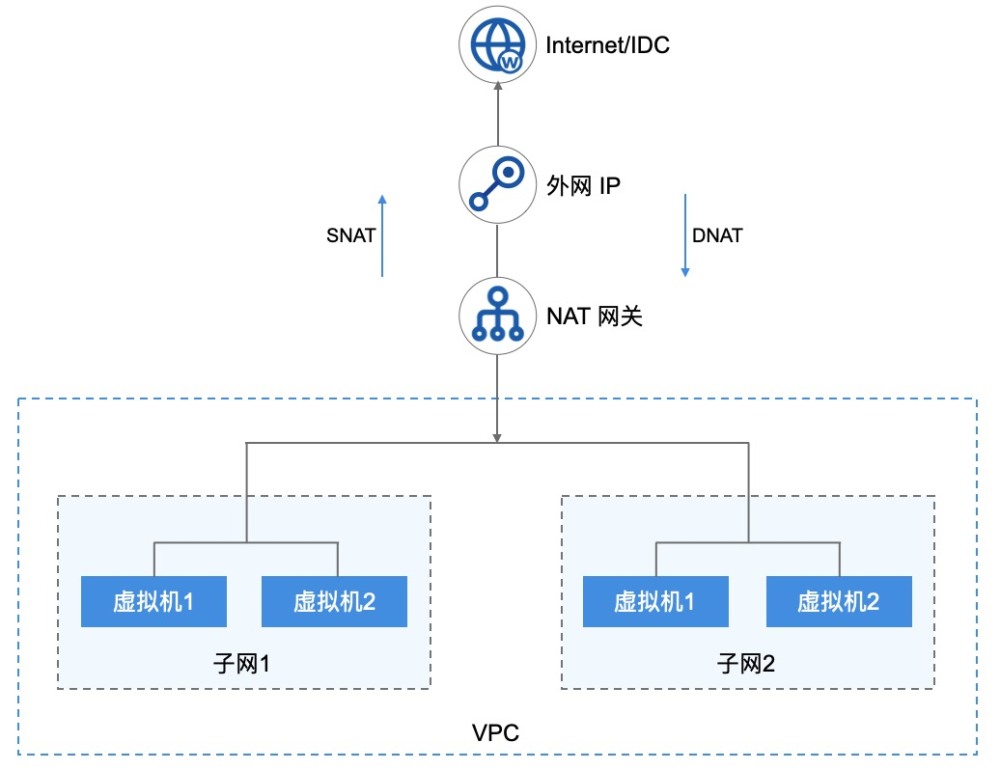

- 平台支持同 VPC 多子网虚拟机使用 NAT 网关访问外网；
- 当多个子网中未绑定外网 IP 的虚拟机关联 NAT 网关时，平台将自动在虚拟机中下发访问外网的路由；
- 虚拟机通过下发的路由，将访问公网的数据通过 NAT 网关透传至已绑定的【公网 IP】；
- 透传至公网 IP 的数据通过平台 OVS 及物理网卡将数据包发送至物理交换机，完成数据 SNAT 的通信；
- 当外网需要访问 VPC 中的虚拟机服务时，可通过 NAT 网关端口转发，使互联网或物理网通过 NAT 网关已绑定的 IP+端口 访问 VPC 内网服务。

NAT 网关支持白名单模式，即仅支持多子网中已添加至白名单的虚拟机通过 NAT 网关提供 SNAT 和 DNAT 的服务。

### 12.1.4 使用流程

在使用 NAT 网关服务前，需根据业务需求规划 NAT 网关的 VPC 网络及外网 IP 网络，并根据业务需求将多台虚拟机绑定至 NAT 网关。具体流程如下：

1. 租户根据需求创建 VPC 和 子网，并在多个子网中创建虚拟机；
2. 租户根据需求创建 外网 IP 地址；
3. 租户根据需求通过 API 或控制台指定网络类型、关联子网及绑定的出口 IP 地址，创建一个 NAT 网关；
4. 若 NAT 网关的网络出口模式为默认，则关联子网中所有未绑定公网 IP 的虚拟机可通过 NAT 网关访问外网；（即将上线）
5. 若 NAT 网关的网络出口模式为白名单，则关联子网中所有未绑定公网 IP 且添加至白名单列表中的虚拟机可通过 NAT 网关访问外网；
6. 租户可通过 NAT 网关的端口转发功能，配置需要通过外网访问 VPC 网络中未绑定公网 IP 或物理 IP 的虚拟机及服务。（即将上线）

### 12.1.5 功能特性

云平台提供 NAT 网关全生命周期管理，包括 NAT 网关的增删改查、模式设置、DNAT 端口转发及资源绑定等。

* **多子网绑定**

  NAT 网关服务的核心价值是为平台虚拟机提供 SNAT 和 DNAT 的功能，节省 IP 地址的同时提升部署效率。一个 VPC 支持多个子网，NAT 网关可为指定的多个子网同时提供地址转换服务，使【**多个子网**】中的虚拟机均通过 NAT 网关与外网/ 物理网进行通信。

  * 用户可将一个 VPC 中的一个子网绑定至 NAT 网关，也可将一个 VPC 中的部分子网绑定至 NAT 网关。
  * 支持用户将一个 VPC 中的所有子网绑定至 NAT 网关，同时支持用户移除部分子网。
  * 指定子网变更后，则子网下未绑定公网 IP 且在白名单中的虚拟机可通过 NAT 网关与外界通信。

* **SNAT 能力**

  NAT 网关支持 SNAT（Source Network Address Translation 源地址转换），即 VPC 子网 IP 地址转换为外网 IP 地址进行网络访问。通过 SNAT 功能，关联 NAT 网关的虚拟机可在不绑定外网 IP 的情况下，与外网进行通信。NAT 绑定的外网 IP 将作为所有关联虚拟机的网络出口，共享外网 IP 地址访问互联网信息和服务。

* **监控告警**

  平台支持对 NAT 网关进行监控数据的收集和展示，通过监控数据展示每一个 NAT 网关的指标数据，同时支持为每一个监控指标设置阈值告警及通知策略。NAT 网关支持的监控指标如下：网络入口（bps） 、网络出口（bps）、入口流量（Byte）、出口流量（Byte）、入包量（个/s）、出包量（个/s）。

* **NAT 网关安全**

  NAT 网关的网络访问控制可以关联安全组给予安全保障，通过安全组的规则可控制到达 NAT 网关 所绑定外网 IP 或物理 IP 的入站流量及出站流量，支持 TCP、UDP、ICMP、GRE 等协议数据包的过滤和控制。

  安全组及安全组的规则支持对已关联安全组的 NAT 网关的流量进行限制，仅允许安全组规则内的流量透传安全组到达目的地。

* **NAT 网关高可用**

  NAT 网关实例支持高可用架构，即至少由 2 个虚拟机实例构建，支持双机热备。

  - 当一个 NAT 网关的实例发生故障时，支持自动在线切换到另一个虚拟机实例，保证 NAT 代理业务正常；
  - 支持物理机宕机， EIP 和物理 IP 漂移功能， 保证 SNAT 网关出口及 DNAT 入口的可用性。

## 12.2 创建 NAT 网关

创建 NAT 网关前需提前规划好地域/可用区、机型、VPC 网络、子网、外网 IP 、安全组及 NAT 网关名称和备注信息。可点击 UCloudStack 控制台导航栏“ NAT 网关”进入 NAT 网关资源控制台，通过“创建 NAT 网关” 功能进入创建向导页面：

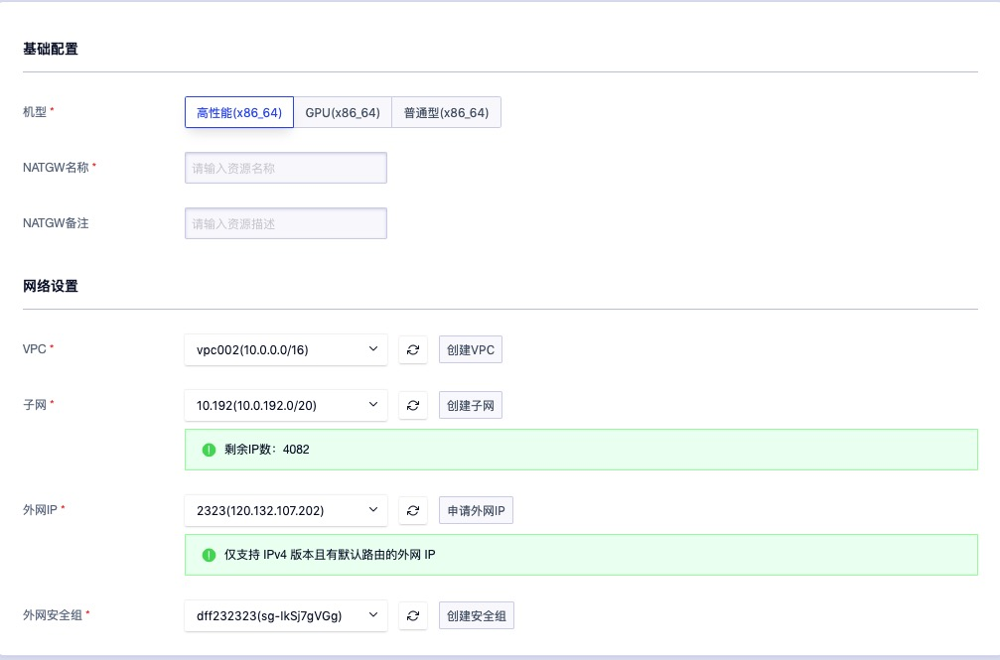

- 地域/可用区：NAT 网关所在的地域和可用区；
- 名称/备注：NAT 网关的名称及备注信息；
- VPC 网络/子网：NAT 网关服务及实例所在 VPC 网络和子网，同时 VPC 为 NAT 网关所服务的 VPC 网络。创建后无法修改，仅支持绑定相同 VPC 内的资源至 NAT 网关白名单；
- 外网 IP ：NAT 网关地址所使用的公网 IP 地址，VPC 网络内网绑定的资源均通过 EIP 访问互联网；
- 安全组：NAT 网关 EIP 地址所使用的安全组，控制可进入 NAT 网关的流量；

选择并配置以上信息后，可选择购买数量和付费方式，确认订单金额并点击“立即购买” 进行 NAT 网关创建：

- 购买数量：按照所选配置及参数批量创建多个负载均衡实例；
- 付费方式：选择 NAT 网关的计费方式，支持按时、按年、按月三种方式，可根据需求选择适合的付费方式；
- 合计费用：用户选择 NAT 网关资源按照付费方式的费用展示；

确认订单无误后点击立即购买，点击立即购买后，会返回 NAT 网关资源列表页，在列表页可查看 NAT 网关的创建过程，通常会先显示“启动中”的状态，创建成功后转换为“**运行中**”。

## 12.3 查看 NAT 网关

通过导航栏进入 NAT 网关资源控制台，可查看当前帐户已有 NAT 网关的列表，同时可通过点击列表上 NAT 网关名称，进入网关实例的详情页面，用于查看 NAT 网关的详细信息、监控信息及绑定资源的管理等。

### 12.3.1 NAT 网关列表

NAT 网关列表页面可查看当前帐号下已拥有网关列表，包括地域/可用区、名称、ID、VPC、子网、外网 IP、状态、创建时间、过期时间、计费方式及操作项。


如上图所示，NAT 网关资源列表显示每个 NAT 网关资源的相关信息，其中：

- VPC ：当前 NAT 网关实例服务的 VPC 网络，仅支持添加相同 VPC 的虚拟机进入 NAT 网关白名单，通过 NAT 网关访问外网，同时 NAT 网关实例运行在 VPC 的子网中。
- 子网：当前 NAT 网关实例所在的子网，即 NAT 网关实例虚拟机真正的网络信息。
- 外网 IP：当前 NAT 网关所绑定的外网 IP 地址，加入至白名单的虚拟机均通过该 IP 地址访问外网。
- 状态：当前 NAT 网关的运行状态，包括启动中、运行中、删除中、已删除等；
- 创建时间/过期时间：指当前 NAT 网关的创建时间和费用过期时间；
- 计费方式：指当前 NAT 网关创建时指定的计费方式；
- 操作：对单个 NAT 网关的操作项，包括修改告警模板及删除等；
- 可通过搜索框对资源列表进行搜索和筛选，支持模糊搜索。

为方便管理，平台 NAT 网关的的批量删除操作，同时可通过搜索框对 NAT 网关资源列表进行搜索和筛选，支持模糊搜索。

### 12.3.2 NAT 网关详情

通过 NAT 网关资源列表的“名称”进入 NAT 网关的详情页面，可查看当前 NAT 网关的详细信息，如下图所示，详情页面分为基本信息、监控信息、白名单管理及操作日志信息：

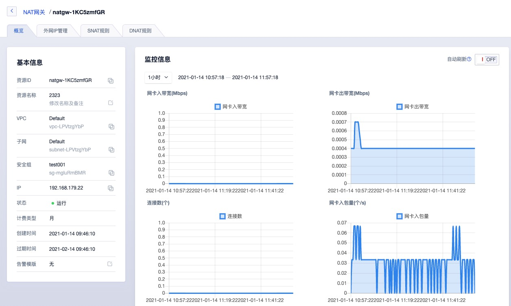

- 基本信息：当前 NAT 网关的基本信息，包括名称、ID、地域/可用区、VPC 网络、子网、外网 IP地址、安全组、创建时间、过期时间、计费方式、状态及告警模板信息。
  - 安全组：当前 NAT 网关绑定的安全组信息；
  - 告警模板信息：当前 NAT 网关绑定的告警模板信息。
- 监控信息：当前 NAT 网关实例相关的监控图表及信息，包括网卡入/出带宽、网卡入/出包量及连接数，支持查看 1 小时、6 小时、12 小时、1 天及自定义时间的监控数据；
- 白名单管理：当前 NAT 网关绑定白名单管理，即可通过 NAT 网关访问外网的虚拟资源管理，包括白名单资源的添加、查看及移除操作等，详见【白名单管理】。
- 操作日志：当前 NAT 网关资源及白名单的全生命周期操作日志，支持查询 7 天、14 天、一个月及自定义时间的操作日志信息，操作日志信息包括操作时间、操作名称、操作者、失败原因、备注及状态。

## 12.4 修改告警模板

修改告警模板是对 NAT 网关的监控数据进行告警的配置，通过告警模板定义的指标及阈值，可在 NAT 网关相关指标故障及超过指标阈值时，触发告警，通知相关人员进行故障处理，保证 NAT 及业务的网络通信。通过点击 NAT 网关资源控制台操作中的“修改告警模板”来进行操作，点击后弹出更改告警模板页面，可选择指定告警模板进行关联。具体参数如下：

- 资源 ID ：当前需要添加或修改告警模板的 NAT 网关 ID ；
- 资源类型：当前需要添加或修改告警模板的资源类型；
- 告警模板：需要变更的告警模板，一次仅可选择一个；

> 若系统提供的默认告警模板无法满足需求时，可前往“告警模板”页面进行添加和配置。

## 12.5 删除 NAT 网关

用户可通过控制台或 API 的方式删除不需要的 NAT 网关实例，删除时会自动解绑已绑定的外网 IP 地址，并清除NAT 网关已添加的白名单资源及路由策略等。

删除 NAT 网关实例后，即直接销毁，请在删除前确保 NAT 网关无业务流量访问外网请求，否则可能影响业务的正常访问。如下图所示，删除 ULB 时需用户进行确认。


点击确定后，系统自动返回 NAT 网关列表页面，在列表页面可查看删除过程，待该 NAT 网关资源被清空时，即成功删除。

## 12.6 修改安全组

支持修改 NAT 网关的安全组，同时支持配置 “暂不绑定”用于解绑安全组。绑定至 NAT 网关的安全组策略作用于 NAT 网关出口的 EIP ，用于限制通过 NAT 网关出口流量。用户可通过 NAT 网关管理控制台列表上的“修改安全组”进行修改，如下图所示：


选择需要修改的安全组信息，一个 NAT 网关仅支持绑定一个安全组。修改成功安全组即时生效，同时页面会返回 NAT 网关列表页，用户可通过 NAT 网关列表及详细信息查看已修改的安全组信息。

## 12.7 修改名称和备注

修改 NAT 网关资源的名称和备注，在任何状态下均可进行操作。可通过点击 NAT 网关资源列表页面每个 NAT 网关名称右侧的“编辑”按钮进行修改。

## 12.8 白名单管理

白名单是指通过 NAT 网关绑定的外网 IP 地址访问互联网的虚拟机资源集合，支持一台或多台虚拟机资源。

### 12.8.1 添加白名单

 NAT 网关白名单仅支持添加未绑定物理 IP 或外网 IP 地址的虚拟机资源，添加白名单前需确保虚拟机和 NAT 网关在同一个 VPC 网络中且状态必须为运行状态。用户可通过 NAT 网关详情页面中的 “白名单列表” 进入资源控制台，通过 “添加白名单”进入白名单添加向导页面，如下图所示：


绑定操作确认后，可在白名单列表页面查看白名单添加过程，通常正在添加白名单的资源状态为 “绑定中”，待虚拟机的状态转换为 “已绑定” 时，即代表绑定成功，可在虚拟机中查看与互联网的联通性。

白名单添加成功后， NAT 网关会自动发下默认路由至白名单的虚拟机中，使虚拟机通过 NAT 网关访问互联网。

> 可通过 netstat -rn  命令在 Linux 虚拟机中查看 NAT 网关自动下发的路由信息。

### 12.8.2 查看白名单

用户通过 NAT 网关详情页面的“白名单列表” 可查看已添加至当前网关的虚拟机列表和信息，列表信息包括资源 ID、资源名称、内网 IP、创建时间、状态及操作项，如下图所示：

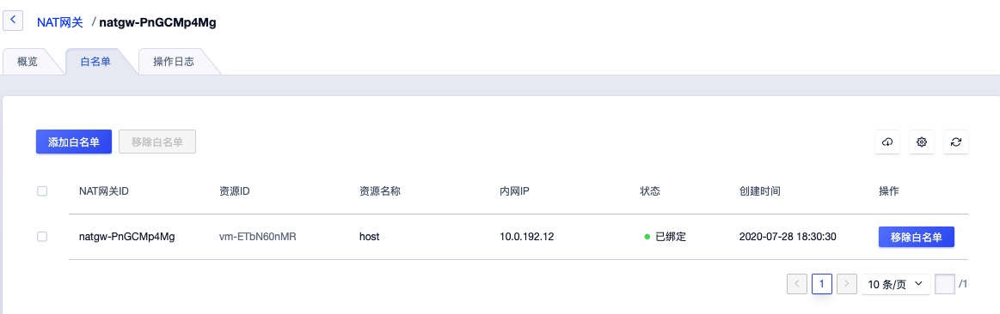

- 资源名称/ID ：当前已绑定至 NAT 网关虚拟机的名称和全局唯一 ID ；
- 内网 IP ：当前已绑定 NAT 网关白名单的虚拟机内网 IP  地址；
- 创建时间：当前虚拟机绑定至 NAT 网关白名单的时间；
- 状态：当前白名单资源的状态，包括绑定中、已绑定、解绑中；
- 操作项：对单个已绑定虚拟机的解绑操作。

为方便平台用户对 NAT 网关白名单的维护管理，平台支持对白名单资源的批量移除操作，可通过选中多个白名单资源，并点击批量操作中移除白名单进行批量操作。

### 12.8.3 移除白名单

移除白名单指将一个虚拟机从 NAT 网关白名单解绑，可通过白名单资源列表操作项中的”移除白名单“功能进行虚拟机解绑操作。解绑后不影响虚拟机本身的正常运行，可通过绑定弹性 IP 地址或重新绑定至 NAT 网关访问互联网。具体解绑操作如下图所示：


确认解绑操作后，在白名单列表中可查看解绑过程，通常虚拟机状态为“解绑中”，解绑成功在列表被清除。解绑后虚拟机即不可通过 NAT 网关访问外网，自动下发的路由将自动清除。虚拟机需通过重新加入白名单或绑定外网 IP 地址才可进行互联网的访问。

# 13 监控告警

监控告警是 UCloudStack 平台全线产品的运维监控及告警服务，提供全线资源实时监控数据及图表信息，可根据监控数据批量为资源设置告警策略，并在资源故障或监控指标超过告警阈值时，以短信、邮件及电话的方式给予通知及预警；同时监控告警服务还为用户提供历史资源告警记录，让用户实时、精准掌控业务和各云产品的健康状况，全方位保障业务的可靠性和安全性。

监控告警服务提供监控图表、告警模板、通知组及告警记录四大架构功能，整体架构功能均以监控数据为基准：

- 云平台通过智能化数据采集系统，对虚拟机、云硬盘、弹性网卡、EIP 、负载均衡、NAT 网关等资源指定的监控指标数据进行完整挖掘；
- 将采集来的监控数据存储至数据库中，并根据指定规则对数据进行检索及统计，通过指定的时间维度及数据粒度以图形化的方式显示监控图表；
- 基于已有的监控数据，用户可通过配置告警模板，为指定的监控指标指定告警阈值及告警设置，可通过设置告警重复频次，判定区分不同等级的告警及通知；
- 为告警模板配置通知组，指定在发生告警时通知事件的通知人及通知方式；
- 在告警期间或故障结束后，可通过告警记录查询历史告警记录信息，以判断故障的发生时间和发生频率。

## 13.1 监控图表

监控图表指平台将智能化采集的资源运行数据，根据指定的资源及指标等筛选规则进行检索并统计，通过指定的数据粒度及时间维度以图形化的方式显示监控图表。通过监控图表，用户可以直观的查看并了解平台上已运行虚拟资源的性能、容量及网络状态等状态，及时了解资源的健康状况及故障节点。

平台为用户构建的虚拟机、弹性 EIP 、负载均衡及 NAT 网关分别提供多种监控指标的实时和历史监控图表，并可根据监控指标项配置相关告警模板，用于阈值超标时给予告警及通知。

- 虚拟机监控图表：通过虚拟机详情页面的监控信息栏可查看单台虚拟机的监控信息，包括 网卡出/入带宽、网卡出/入包量、磁盘读/写吞吐、磁盘读/写次数、平均负载、空间使用率、内存使用率、CPU使用率；
- 弹性 EIP 监控图表：通过 EIP 详情页面的监控信息可查看单个 EIP 资源的监控信息，包括网卡出带宽使用率、入带宽、出带宽、入包量、出包量；
- 物理 PIP 监控图表：通过 PIP 详情页面的监控信息可查看单个 PIP 资源的监控信息，包括入带宽（Mbps）、出带宽（Mbps）、网卡带宽使用率（%）、入包量（个/s）、出包量（个/s）
- 负载均衡监控图表：通过负载均衡详情页面的监控信息可分别查看负载均衡实例和VServer监听器的监控信息，监控图表包括LB每秒连接数、LB每秒网卡出/入流量、LB每秒网卡出包数量、VServer 连接数、HTTP 2XX、HTTP 3XX、HTTP 4XX、HTTP 5XX；
- NAT 网关监控图表：通过 NAT 网关详情页面的监控信息可查看单个 NAT 网关的监控信息，包括网卡入带宽、网卡出带宽、连接数、网卡入包量、网卡出包量。
- MySQL 服务监控图表：通过 MySQL 服务详情页面的监控信息可查看单个 MySQL 服务的监控信息，包括CPU使用率、内存使用率、磁盘使用率、TPS、网卡出/入带宽、表锁、QPS、DeletePS、InsertPS、全表扫描、SelectPS、UpdatePS、连接数、慢查询、线程活跃数、连接线程数等。
- Redis 服务监控图表：通过 Redis 服务详情页面的监控信息可查看单个 Redis 服务的监控信息，包括内存使用量、内存使用率、连接数量、QPS、RedisKeys、RedisExpiredKeys、RedisEvictedKeys、命中数量、未命中数量、命中率、网卡出/入带宽等。

监控图表可根据时间维度展示实时监控数据，同时支持查看 1 小时、6 小时、12 小时、1 天及自定义时间的监控数据及图表信息。

## 13.2 告警模板

告警模板是 UCloudStack 平台监控告警服务为用户提供的一种批量设置资源告警的功能，通过预先定义模板中的告警规则及通知规则，将模板中定义的规则应用到虚拟资源；若虚拟资源的监控指标数据达到或超过告警规则中设定的阈值及条件，则根据通知规则中定义的通知方式发送告警通知到指定的通知联人。

根据不同的资源类型，可定制不同监控指标及阈值的告警规则，并可选择将监控指标应用至关联资源的单个网卡或磁盘设备，满足多种应用场景下的监控报警需求。

- 告警模板是由多条告警规则及关联资源构成的；
- 一个告警模板仅支持绑定一种类型资源，包括虚拟机、外网弹性 IP、物理 IP、NAT 网关、负载均衡、Redis、MySQL 等；
- 每个告警模板可包含多条告警规则，每条告警规则包含监控对象、设备名称、对比方式、告警阈值、探测周期、触发周期、收敛策略及通知组；
- 每个告警模板仅支持绑定一个通知组，每个通知组可包含 多个通知人，支持短信和邮件的通知方式。

### 13.2.1 创建告警模板

用户可指定资源类型、模板名称及备注快速创建一个告警模板，在告警规则管理中创建配置适用于业务需求的告警规则，最后将告警模板关联至虚拟资源，完成监控告警的配置。用户可通过控制台导航栏“监控”进入监控告警配置控制台，通过“告警模板”页面的“**创建**“按钮进入告警模板创建向导页面，如下图所示：


- 资源类型：告警模板需绑定资源的类型，包括虚拟机、外网弹性 IP、物理 IP、NAT 网关、负载均衡、Redis、MySQL 等，一个告警模板仅支持一种资源类型；
- 模板名称/备注：告警模板的名称标识及全局唯一标识符；

点击确定后，向导页面即返回告警模板列表，通过告警模板列表即可查看已创建的资源列表及信息。

### 13.2.2 查看告警模板

用户可通过导航栏进入告警模板资源控制台查看告警模板的资源列表，同时可通过点击列表上告警模板的名称进入模板详情页面，用于查看告警模板的详细信息、告警规则管理及绑定资源的管理。

#### 13.2.2.1 告警模板列表

告警模板列表页面可查看当前帐号下已拥有的模板列表，包括名称、ID、资源类型、绑定资源数量及操作项，如下图所示：


- 名称/ID ：当前告警模板的名称和全局唯一标识符；
- 资源类型：当前告警模板创建时所指定的资源类型；
- 绑定资源数量：当前告警模板已关联的资源数量；
- 操作：对单个告警模板的操作项，包括详情、查看资源及删除；
- 可通过搜索框对资源列表进行搜索和筛选，支持模糊搜索。

#### 13.2.2.2 告警模板详情

通过告警模板列表的“名称”进入模板详情页面，可查看当前告警模板的详情信息，如下图所示，详情页面分为基本信息、告警规则管理及资源绑定管理：


- 基本信息：当前告警模板的基本信息，包括名称、ID、资源类型、已绑定的资源数量等信息，其中已绑定的资源数量若为空时，显示为 “0” ；
- 告警规则管理：当前告警模板的告警规则管理，包括告警规则的创建、查看、更新、删除等，具体管理操作详见：[告警规则管理](#13.2.5 告警规则管理) ；
- 资源绑定管理：当前告警模板关联资源的管理，即告警模板中的规则可生效的资源，包括绑定资源、已绑定资源查看及解绑资源，具体管理操作详见：[绑定资源管理](#13.2.6 绑定资源管理) 。

### 13.2.3 查看资源

查看资源指查看当前告警模板已绑定资源的信息，点击后可进入 [绑定资源管理](#13.2.6 绑定资源管理) 。

### 13.2.4 删除告警模板

仅当告警模板中未绑定任何资源时才可进行删除操作，被成功删除的告警模板将直接被销毁。用户可通过监控告警模板资源控制台中的“**删除**”进行模板的删除操作，如下图所示：


删除告警模板操作被确认后，系统自动返回至告警模板列表页面，在列表页面可查看删除过程，待该资源被清空时即成功删除。

### 13.2.5 告警规则管理

告警规则是告警模板的核心，每个告警模板均由 1 条或多条告警规则组成。被绑定至告警模板的资源监控指标数据会根据告警规则中定义的阈值触发相关告警策略，并通过告警规则中的通知方式进行告警信息的通知，以便快速入处理告警或故障。

#### 13.2.5.1 创建规则

用户可通过告警模板详情页面的“**创建**”功能进行告警规则的创建，创建告警规则时需指定监控对象、设备名称、对比方式、告警阈值、探测周期、触发周期、收敛策略及通知组等参数，如图所示：

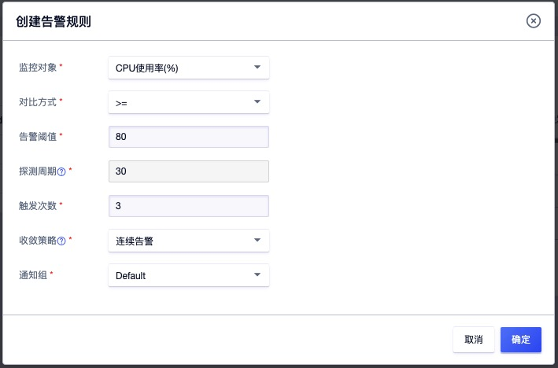

- 监控对象：即监控指标，仅可选择告警模板资源类型所包含的监控指标，一条告警规则仅支持一个监控指标：
- 对比方式：指监控指标的实际数据与告警阈值的比较方式，代表当前告警规则的告警逻辑，包括 `>=` 或 `<=` ：
  - 当选择 `>=` 时，即代表监控数据大于或等于阈值时触发一次告警周期；
  - 当选择 `<=` 时，即代表监控数据小于或等于阈值时触发一次告警周期；
- 告警阈值：指监控指标数据的临界值，与监控指标数据进行对比，符合对比方式即触发一次告警周期，如 CPU 使用率的告警阈值为 80，对比方式为大于等于，即 CPU 使用率大于等于 80% 即触发一次告警周期；
- 探测周期：对监控指标的数据检测的最小周期，即每隔多长时间收集一次监控数据，默认值为 30s ；
- 触发周期：监控数据达到阈值条件的连续周期，即监控指标数据连续 N 次符合阈值条件即触发一次告警周期；若触发周期为 1 次，即代表触发一次告警周期就进行告警；
- 收敛策略：发生告警后发送通知给通知组的频率，可选择连续告警、指数递增、单次告警：
  - 连续告警：即每次到达触发周期即发送告警通知；
  - 指数递增：即以 2^N 时间递增告警延迟；
  - 单次告警：触发告警周期后，仅告警并通知一次，告警恢复后重新激活；
- 通知组：即触发告警周期且需要发送通知时，发送告警通知的方式及联系人。

选择并配置完成后，点击确定可返回告警模板详情页面，通过告警规则列表可查看已创建成功的告警规则。

#### 13.2.5.2 查看规则

可通过告警模板详情页面查看当前模板包含的规则列表，列表信息包括监控对象、设备名称、对比方式、告警阈值、探测周期、触发周期、收敛策略、通知对象及操作项，如下图所示：


其中操作项是指对单条通知规则的操作，包括更新及删除，分别指对单条告警规则的修改和删除。

#### 13.2.5.3 更新规则

更新规则是指对单条告警规则的修改，修改项的选择与配置与创建告警规则相同，可参考 [创建规则](#13.2.5.1 创建规则) 。

#### 13.2.5.4 删除规则

删除告警规则指对单条告警规则的删除。规则被删除后即直接销毁，可重新添加该监控指标的告警规则。

### 13.2.6 查看绑定资源

通过告警模板详情的资源标签，进入告警模板资源绑定管理页面，可查看已绑定资源的列表及信息，包括绑定资源的 ID、类型、地址、可用区等，如下图所示：


## 13.3 通知组管理

通知组是指监控报警发送告警通知的方式及联系人信息，通过对用户邮箱电话信息的收集，将不同资源告警通过邮件或短信的方式通知给通知人，以便划分全责，精细化处理告警通知。

- 通知组是一组通知人的组合，可以包含一个或多个联系人；
- 同一个联系人，可以加入多个通知组；
- 通知方式包括邮件通知、短信和邮件通知。

在使用监控告警模板时，需要先创建一个通知组，添加相关联系人信息，并设置通知组的通知方式，以便关联告警模板，通知组具体管理详见下文。

### 13.3.1 创建通知组

用户可通过控制台导航栏“监控”进入监控告警配置控制台，切换至“**通知组**”页面进行通知组管理页面的“**创建**”按钮进入通知组的创建向导页面，如下图所示指定通知组名称及通知方式进行创建操作：


- 通知组名称：当前需要创建的通知组名称及标识；
- 通知方式：当前需要创建的通知组通知方式，即触发告警通知时通过什么渠道通知用户，包括邮件通知和短信通知等方式；

点击确定后，进入通知组列表页面，可查看已创建的通知组信息，并对通知组进行相关操作及管理。

### 13.3.2 查看通知组

用户可通过监控告警控制台进入通知组页面查看通知组列表信息，同时可通过点击列表上通知组的 ID 进入详情页面，用于查看通知组的详细信息及通知人的管理。

#### 13.3.2.1 通知组列表

通知组列表页面可查看当前帐号下已拥有的通知组列表，列表信息包括 ID、名称、通知方式及对单个通知组的操作项，如下图所示：


- 名称/ID ：通知组的名称标识及全局唯一标识符；
- 通知方式：当前通知组的通知方式；
- 操作：对单个通知组的操作项，包括详情、更新、删除等。

#### 13.3.2.2 通知组详情

通过通知组列表的 `ID` 进入通知组详情页面，可查看当前通知组的基本信息，并可通过通知人管理进行通知联系人的管理，如下图所示：


- 基本信息：当前通知组的基本信息，包括通知组 ID、名称及通知方式；
- 通知人管理：当前通知组的通知联系人管理，包括通知人的创建、查看、更新及删除，详见[通知人管理](#13.3.5 通知人管理) 。

### 13.3.3 更新通知组

更新通知组是指对单个通知组的修改，修改项的选择与配置与创建通知组相同，可参考 [创建通知人](#13.3.1 创建通知组) 。

### 13.3.4 删除通知组

删除通知组前需确认通知组未被绑定至任何一个告警规则中，若已被添加至一个告警规则，则无法删除。被成功删除的通知组即被销毁，需用户确认才可成功删除。用户可通过通知组控制台列表操作项中的“删除”进行通知组删除，如下图所示：

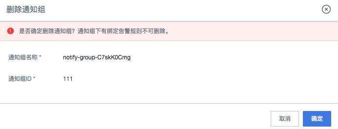

### 13.3.5 通知人管理

通知人是指告警规则发送通知的具体联系人，包括联系人姓名、手机、邮箱等信息。每个通知组可添加 1 个或多个通知人，根据通知组通知方式的不同，在资源发生告警时会发送邮件或短信至所有通知人。

#### 13.3.5.1 添加通知人

用户可通过通知组详情页面的“**创建**”功能进行通知人的添加，创建通知人时需指定通知人姓名、电话、邮箱等参数，如下图所示：


- 通知人名称：指当前需要创建的联系人姓名或昵称；
- 通知人邮箱：指当前需要创建的联系人邮箱地址；
- 通知人电话：指当前需要创建的联系人手机号码。

点击确定后，即可成功创建一个通知联系人，可通过通知组详情的通知人列表查看联系人信息。

#### 13.3.5.2 更新通知人信息

更新通知人信息是指对单个通知人的信息进行修改，睡改项的配置与创建通知人规则相同，可参考[创建通知人](#13.3.5.1 添加通知人)。

#### 13.3.5.3 删除通知人

删除通知人指对单个通知人进行删除，通知人删除后即直接销毁，可重新添加联系人信息。

## 13.4 告警记录

告警记录是指当前帐户所有告警记录及信息，通过告警记录可查看 1 小时、6 小时、12 小时、1 天、7 天、15 天及自定义时间周期的历史告警信息：


如上图所示，告警记录列表信息包括告警的 ID、指标名称、资源ID、资源类型、地域、可用区、告警时间、恢复时间、阈值及当前值：

- 告警 ID ：指当前告警记录的全局唯一标识符；
- 指标名称：触发当前告警记录的资源监控指标项，即数据来源；
- 资源类型/资源：触发当前告警记录的资源类型及资源；
- 地域/可用区：触发当前告警记录的资源所在地域和可用区；
- 告警时间：即当前告警记录的告警触发时间：
  - 当前值达到阈值条件时，则展示具体告警时间；
  - 当前值未达到阈值条件，即告警恢复后，告警时间展示“**解除告警**”；
- 恢复时间：即当前告警记录资源监控指标数据恢复正常的时间：
  - 当前值达到阈值条件，即告警中时，显示为“告警”；
  - 当告警恢复后，则展示资源监控指标数据恢复正常的时间；
- 阈值：触发当前告警记录的资源告警规则中设置的阈值；
- 当前值：即触发告警或恢复告警时当前告警记录监控指标的数据值。

# 14 操作日志

操作日志是指用户在控制台或 API 对资源进行的操作行为及登录登出平台的审计信息。操作日志会记录用户在 UCloudStack 平台中的所有资源操作，提供操作记录查询及筛选，通过操作日志可实现安全分析、资源变更追踪以及合规性审计。操作日志根据资源类型不同在控制台可分为资源操作日志及全局操作日志：

- 资源操作日志：用户通过每种资源控制台的详情页面，查看每一个资源实例的操作日志；
- 全局操作日志：租户通过操作日志资源控制台，查看平台内属于自己的所有资源操作日志及平台登录登出审计日志等。

租户可通过操作日志控制台或 API 查看 7 天内、14 天内、1 个月内及 1 年内自定义时间的操作审计日志，操作日志包括资源的操作、用户登录审计及资源续费操作等信息。

> **操作日志不记录用户在虚拟机内部进行的操作**。

## 14.1 资源操作日志

资源操作日志是指用户通过资源控制台详情的操作日志控制台查看单个资源实例的操作日志，同时也可通过 API 查询单个资源实例的操作日志信息。资源操作日志支持查看 7 天内、14 天内、1 个月内及 1 年内自定义时间的日志信息，具体信息包括操作时间、操作（API）名称、操作者、失败（码）原因、备注及状态：

- 操作时间：指当前资源操作日志的操作触发时间，可通过操作时间进行排序；
- 操作（API）名称：当前操作日志的操作名称或 API 名称，即指具体的操作，如创建虚拟机、绑定弹性 IP 等；
- 操作者：指当前操作项的操作者邮箱，可由操作邮箱追溯操作联系人；
- 状态：当前操作项的操作结果状态，可为成功或失败；若为失败时，则会在失败（码）原因处显示失败原因或失败码；
- 失败（码）原因：当前操作项操作失败后的原因及失败代码：
  - 若操作成功，则失败原因为空；
  - 若操作失败，刚失败原因为具体的操作原因或失败码；
- 备注：当前操作项的操作备注，如自动续费时备注系统自动续费。

UCloudStack 平台资源操作日志可支持单独查看日志的资源包括虚拟机、负载均衡（ 包括负载均衡实例及 VServer ）、私有网络、弹性 IP 及 NAT 网关等，具体信息如下：

- 虚拟机操作日志：


- 负载均衡实例操作日志：


- 负载均衡 VServer 监听器操作日志：


- 私有网络操作日志：


- 弹性 IP 操作日志：


- NAT 网关操作日志：


如上资源操作日志示例图所示，资源操作日志支持搜索筛选功能，可通过搜索框对操作日志进行搜索和筛选，支持模糊搜索。

## 14.2 全局操作日志

全局操作日志是指租户通过操作日志控制台查看整个平台属于用户所有的资源操作日志及平台登录登出审计日志等，同时用户也可通过 API 查询租户内所有资源的操作日志及审计信息。

全局操作日志支持查看 7 天内、14 天内、1 个月内及 1 年内自定义时间的日志信息，具体信息包括操作时间、资源 ID、操作（API）名称、操作者、失败（码）原因、备注及状态，其中资源 ID 指一条操作日志信息对应的资源全局唯一标识符，如下图所示：

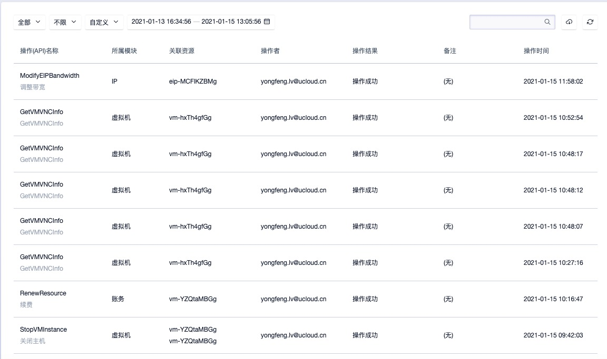

全局操作日志支持根据资源类型及状态进行日志的筛选，同时支持日志的搜索检索：

- 资源类型包括所有、虚拟机、磁盘、安全组、帐户、监控、服务节点、VServer、负载均衡、弹性 IP、VPC、子网、镜像、NAT 网关、Redis、MySQl 服务等，其中：
  - 所有是指不限资源类型，默认展示所有资源类型的操作审计日志信息；
  - 帐户是指筛选出有关帐户登录登出、修改密码等相关日志信息；
- 状态包括成功、失败及不限，其中不限是指展示所有状态的日志信息；
- 可通过搜索框对操作日志进行搜索和筛选，支持模糊搜索。

# 15 回收站

## 15.1 回收站概述

回收站是指资源删除或欠费自动释放的暂时保留区，用户删除的资源包括虚拟机、磁盘、EIP、安全组、自制镜像、弹性网卡及 Redis/MySQL 等资源，会在删除后自动进入回收站中。

进入回收站中的资源会默认保留一个时间，UCloudStack 默认保留时间为 360000 秒，可通过云平台管理员进行自定义保留时间的设置。**保留期间可对资源进行恢复、续费及销毁操作，保留时间到期后，资源会被彻底销毁，不可恢复。**

## 15.2 查看回收站资源

UCloudStack 云平台资源被用户手动删除及费用过期时，会自动进入回收站暂时留存。在留存期间可到回收站控制台查看已进入回收站的资源列表，如下图所示：

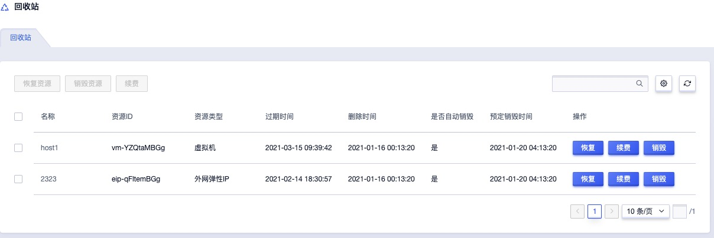

通过回收站资源列表可查看当前帐户下已被删除或释放的留存资源信息，包括地域、可用区、资源 ID、资源名称、资源类型、过期时间、删除时间、是否自动销毁、销毁时间及操作项：

- 地域/可用区：当前留存资源所在的地域和可用区，回收站默认展示所有地域和可用区的回收资源；
- 资源名称/ID：当前留存资源的名称及全局唯一标识符；
- 资源类型：当前留存资源的资源类型，包括虚拟机、磁盘、VPC 网络、EIP、安全组、自制镜像、弹性网卡及MySQL 和  Redis 资源等；
- 过期时间：指当前资源的费用过期时间，仅当资源类型为需计费的资源时有效，如虚拟机、磁盘、EIP 、MySQL 和  Redis等；
- 删除时间：指当前留存资源被手动删除或费用过期进入回收站的时间；
- 是否自动销毁：指当前留存资源是否会在留存期间自动销毁，可通过云平台管理控制台设置保留期后是否自动销毁资源：
  - 若云平台全局配置为回收站资源自动销毁，则到达保留期后，将自动销毁资源；
  - 若云平台全局配置为回收站资源不自动销毁，则资源将永久留存在回收站，可通过手动恢复或销毁资源；
- 销毁时间：指当前留存资源将被自动销毁的时间，仅当云平台全局配置为回收站资源自动销毁时有效；
- 操作项：对单个留存资源的操作项，包括恢复、续费及立即销毁等，其中续费操作仅在资源类型为需计费的资源时有效；

平台支持对进入回收站的资源进行批量操作，包括批量恢复资源和批量销毁资源，同时回收站资源支持搜索筛选功能，可通过搜索框对资源列表进行搜索和筛选，支持模糊搜索。

## 15.3 恢复资源

恢复资源是指手动恢复被误删而进入回收站的资源。

- 若资源被用户手动删除且无欠费的情况下，可直接通过恢复资源操作进行恢复；
- 若资源因帐户欠费而自动进入回收站，则恢复资源时，需联系云平台管理员对帐号进行充值后，通过“**续费**”操作对资源进行续费后，在进行资源恢复；
- 若全局未开启资源自动续费且帐户余额充足，资源过期后会自动进入回收站，恢复资源时，需要先通过“**续费**”操作对资源进行续费后，在进行资源恢复。

用户可通过回收站留存资源列表的“**恢复**”操作项进行资源的恢复，若资源资源费用已过期，需要先进行续费才可进行恢复操作。具体恢复操作如下图所示：


点击确定后，当前资源会自动恢复至被删除前的资源列表，可通过相关资源列表进行查看。若资源为欠费状态，则界面会提示用户，资源已欠费，需要先进行充值或续费，才可进行资源恢复。

## 15.4 续费资源

续费资源是指对资源的费用周期进行续费，仅支持需计费的资源进行“**续费**”操作。因欠费或费用到期自动进入回收站的资源被成功续费后，才可进行恢复操作。资源续费的周期根据计费方式会有所区别：

- 资源按按小时计费时：一次续费操作可续费 1 个小时，N 次续费操作即续费 N 个小时；
- 资源按月计费时：一资续费操作可续费 1 个月，N 次续费操作即续费 N 个月；
- 资源按年计费时：一资续费操作可续费 1 年，N 次续费操作即续费 N 年的费用周期。

用户可通过回收站留存资源列表的“**续费**”操作项进行资源续费操作，若帐户已欠费，需先联系管理员对帐户进行充值后在进行续费操作。具体续费操作如下图所示：


点击确定后，返回至回收站留存资源列表，在列表页可查看被续费资源的过期时间被延长一个计费周期。

## 15.5 销毁资源

销毁资源是指手动销毁留存在回收站的资源，资源被销毁后无法恢复，需确认是否有必要销毁资源。具体操作如下图所示：

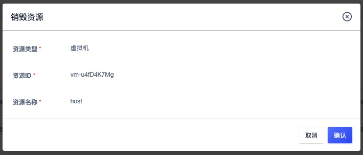

点击确定后，该资源将从留存资源列表清空，无法恢复，请慎重操作。

# 16 帐号管理

帐号管理是 UCloudStack 平台基于多租户为用户提供的用户身份管理与资源访问控制服务。通过帐号管理服务，可管理帐号及子帐号并配置帐号的安全认证，同时通过子帐号管理集管理租户内的用户（子帐号），控制并管理子帐号对资源的访问和操作权限，适用于企业多用户协同、按需资源分配的场景，从而降低企业信息安全风险。

- UCloudStack 云平台支持多租户模式，可同时创建多个租户并共享整个云平台的资源；多租户间通过认证及权限实现资源访问控制，通过 VPC 网络实现多租户间的网络隔离；
- 帐号管理服务提供主帐号及子帐号的管理，支持查看帐号的基本信息且可对帐号的登录密码及登录授权进行配置及管理；
- 在主帐号控制台中，可进行子帐号全生命周期的管理，包括子帐号的添加、查看、冻结及资源权限管理；

UCloudStack 帐号根据角色不同，分为云平台管理员、租户管理员和普通成员：

- 云平台管理员：指整个云平台的管理员，可管理整个云平台的物理管理、虚拟资源管理、平台运维及运营等相关，可登录并管理云平台管理控制台及租户控制台，是整个云平台的超级管理员，有关平台管理员的详情介绍及使用指南可参考【 UCloudStack 管理员手册】；
- 租户管理员：指一个主帐号，即通过平台自助注册或平台管理员创建的租户帐号；
  - 通过租户管理员，可创建并使用配额内的虚拟资源，并可通过子帐号管理添加属于主帐号的子帐号，实现企业级精细化权限控制；
  - 租户管理员支持充值，平台管理员通过管理控制台的租户管理中，可对租户进行充值及管理；
- 普通成员：子帐号，即租户管理员通过用户控制台子帐号管理创建的普通帐号；
  - 通过主帐号权限配置及管理，子帐号可独立登录云平台，进行权限范围内的资源管理及操作；
  - 所有子帐号共享主帐号（租户管理员）的帐户余额、免费余额及信用余额；
  - 所有子帐号共享主帐号（租户管理员）的资源配额；
  - 所有子帐号间默认相互隔离，主帐号可查看并管理所有子帐号创建的资源。

## 16.1 帐号信息

帐号信息可以查看帐号或子帐号的基本信息，包括登录帐号、手机号码、帐户余额、免费余额及信用余额等信息。可通过 UCloudStack 用户控制台导航栏“**帐户**”进入帐户控制台进行查看，如下图所示：

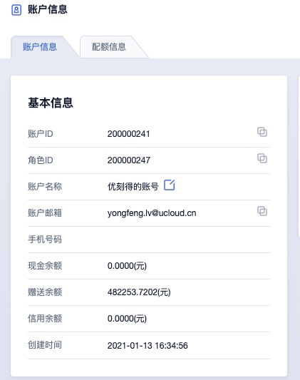

- 登录帐号：当前登录平台帐号的邮箱地址；
- 手机号码：当前登录平台帐号的手机号码；
- 帐户余额：指通过支付宝、微信、银行及新浪支付充值的金额；
- 免费余额：指优惠券及其它渠道赠送的余额，一般由平台管理员进行充值。

## 16.2 帐户安全

帐户安全是指平台为用户帐户安全提供的登录保护，可通过帐户安全修改登录密码，同时可开通二次身份认证授权服务，保证登录帐号的安全。

对于 API 用户，帐户安全为开发者提供 API 公钥和私钥信息，可通过复制密钥信息用于操作 API 指令，可参考 API 开发者手册。

### 16.2.1 修改登录密码

平台支持用户修改帐号登录密码，可通过帐号控制台【帐号安全】登录密码的“**修改**”进行密码修改。


> 修改密码必须使用旧密码，若忘记旧密码，可联系管理员进行修改。

### 16.2.2 开通登录保护

UCloudStack 提供免费的基于 TOTP（Time-Based One-Time Password Algorithm）登录二次认证服务，开通本服务后，用户每次登录控制台均需通过授权认证。 为了降低用户账号密码泄漏造成的风险，建议您开通账号登录二次认证。开通登录保护的前提条件如下：

- 开通对象为独立主账号或子账号；
- 移动设备上安装有 Google Authenticator 或其他基于 TOTP 技术的令牌工具；
- 推荐使用 Google Authenticator ；

#### 16.2.2.1 开通步骤

1. 登录控制台并进入帐号控制台，点击帐号安全“**开通**” 按钮；
2. 检查移动设备上是否安装 Google Authenticator ；
   - 页面提供IOS和Android用户工具下载地址，若您未安装 Google Authenticator 可通过扫码下载；
   - 安卓手机用户也可以通过手机品牌商提供的应用商店搜索和下载 Google Authenticator ；
3. 点击下一步后，打开 Google Authenticator 工具，扫码获取授权码，也可手动输入密钥获取授权码；
4. 在页面方框内输入获取到的授权码，完成绑定，如下图所示：


#### 16.2.2.2 关闭登录保护

1. 登录控制台并进入帐号控制台，点击帐号安全“**关闭**” 按钮；
2. 按照页面提示获取并输入授权码即可关闭二次认证功能。

#### 16.2.2.3 功能应用

二次认证服务开通后，账号密码登录平台时会要求输入认证码，系统判断认证码有效后，即可成功登录平台。


#### 16.2.2.4 登录保护 FAQ

Q：Google Authoriticator 怎么下载？

A：账号绑定页面提供 ISO 和 Android 工具下载链接，可选择通过移动设备扫码下载。若使用的是基于 Android 系统的移动设备，可通过移动设备本身提供的应用下载市场搜索和下载 Google 身份认证器。

------

Q：Google Authoriticator 无法扫描获取授权码怎么办？

A：可切换至手动获取，手动输入账号密钥绑定并获取授权码。

------

Q：是否可以用其他工具绑定账号？

A：若使用的是 Google 身份认证方式，可以用基于 TOTP 算法的其他动态令牌工具绑定账号，如 FortiToken 、微信小程序“二次验证码”等。为安全起见，推荐使用谷歌官方 “Google Authoriticator” 。

------

Q：同一个账号是否支持绑定多个终端工具？

A：支持。您只需要使用多个终端绑定同一账号（扫码或输入密钥）即可。建议您在绑定工具时妥善保存系统提供的密钥，方便后续添加绑定新的终端

### 16.2.3 API 密钥

通过帐户安全租户可查看属于当前账号的 API 密钥 ，用于管理并使用 API 接口，如处图所示：


可通过点击复制按钮进行公私密钥的信息复制，以方便 API 指令的调用。

## 16.3 子帐号管理

子帐号管理是指通过租户管理员进行子帐号的生命周期及权限管理，包括添加帐户、查看帐户、冻结帐户及资源权限管理等。子帐号对应某一个操作实体，如操作人员或应用程序，可通过创建新的子帐号并授权相关资源访问管理权限启用一个子帐号。

> 子帐号登录 UCloudStack 云平台时，不可进行子帐号管理

### 16.3.1 添加帐户

用户通过帐户资源控制台的“添加帐户”，指定子帐号的邮箱、密码及确认密码，即可快带为主帐号创建一个子帐号，如下图所示：


- 邮箱：新建子帐号的电子邮件地址，必须实际有效的邮箱地址；
- 密码/确认密码：新建子帐号的登录密码，密码须包含有大小写字母、数字、符号中的两种，密码长度为 `6-20` 个字符。

点击确定后，即返回子帐号列表页面，可查看当前主帐号已拥有的子帐号信息。

### 16.3.2 查看帐户

用户通过帐户控制台可查看子帐号列表信息，同时可通过点击子帐号 ID 或 邮箱地址进入子帐号详情页面，用于查看子帐号的基本信息及资源权限管理。

#### 16.3.2.1 子帐号列表

子帐号列表页面可查看当前主帐号下已拥有的所有子帐号列表（包含主帐号本身），列表信息包括 ID、邮箱、角色、状态、手机号、创建时间及操作项，如下图所示：


- ID ：当前帐号在云平台全局的唯一标识符；
- 邮箱：当前帐号的登录邮箱地址；
- 角色：当前帐号的角色，包括管理员和普通成员，主帐号为租户管理员，子帐号为普通成员；
- 状态：当前帐号的状态，包括使用中、冻结中：
  - 使用中的用户可登录控制台，并可使用并管理资源；
  - 冻结中的用户无法登录控制台，并禁使使用并管理资源；
- 手机号码：当前帐号的手机号码，仅当帐号为租户管理员（主帐号）时有效；
- 创建时间：当前帐号的创建时间；
- 操作项：对单个帐号的操作项，包括冻结和解冻。

#### 16.3.2.2 子帐号详情

通过子帐号列表的 “ID” 或 邮箱地址可进入帐号的详情页面，可查看当前帐号的详细信息，如下图所示，详情页面分为基本信息及资源权限管理：

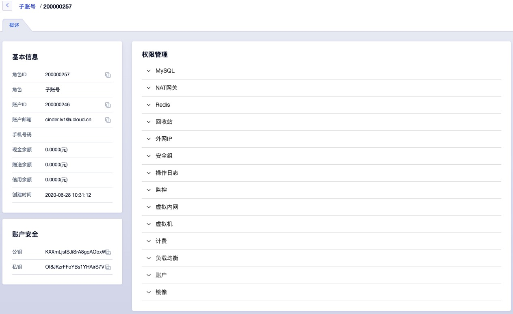

- 基本信息：当前子帐号的基本信息，包括 ID、手机号码、邮箱、状态及创建时间；
- 资源权限管理：当前子帐号的资源访问及管理的权限控制，可控制的资源包括 NAT 网关、业务组、回收站、安全组、弹性 IP 、操作日志、监控、私有网络、虚拟机、计费、负载均衡、帐户及镜像等，具体权限管理详见：[权限管理](#16.3.5 权限管理) 。

### 16.3.3 冻结帐户

冻结帐户是指将一个子帐号进行锁定，被成功冻结的用户，将不允许登录控制台，且禁止控制并管理相关资源。仅支持状态为“**使用中**”的帐号进行冻结操作，用户可点击子帐号列表操作项中的“冻结”进入冻结帐户向导页面：

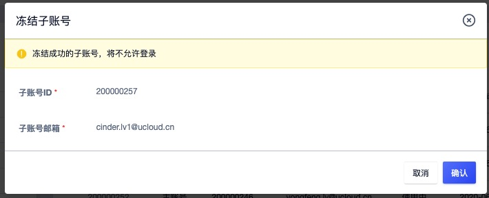

如上图所示，冻结帐户需要管理员进行确认。成功锁定子帐号后，帐号的状态变更为冻结中，在冻结中状态的子帐号支持解冻操作。

> 不支持对角色为管理员的租户管理员帐号进行冻结和解冻操作。

### 16.3.4 解冻帐户

解冻帐户是指解冻一个已冻结的帐号，被成功解冻的的用户，可登录管理控制台且可进行相关资源使用和管理。仅支持状态为“**冻结中**”的帐号进行解冻操作，用户可点击子帐号列表操作项中的“解冻”进入解冻帐户向导页面：

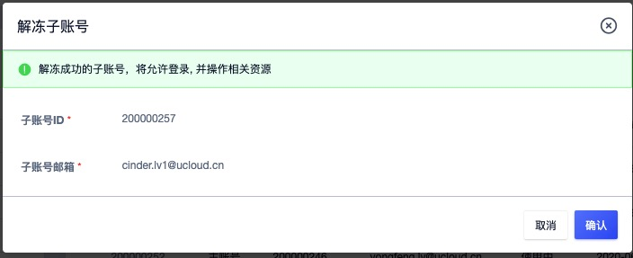

如上图所示，解结一个已锁定的帐号需要管理员进行确认。成功解锁的子帐号状态将变更为“使用中”，在使用中状态的子帐号支持冻结操作。

### 16.3.5 权限管理

子帐号权限管理是指租户管理员对每个子帐号对云平台资源的控制及管理配置，通过权限管理可以为子帐号开启或关闭云平台资源及生命周期管理的功能，实现企业精细化权限管控及资源合理分配的场景。

子帐号权限管理可管控的资源包括 NAT 网关、业务组、回收站、安全组、弹性 IP、操作日志、监控、私有网络、虚拟机、计费、负载均衡、MySQL、Redis、帐户及镜像等，对于不同的虚拟资源，分别提供不同的权限管控项，如下图所示：

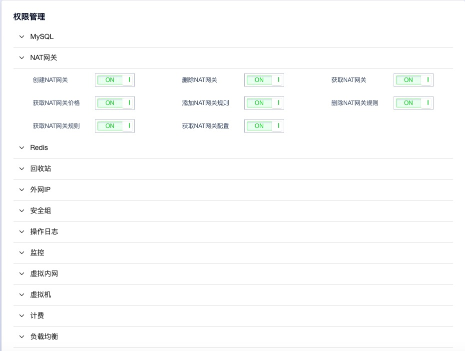

如权限管理示意图所示，根据不同的资源可为子帐号开启或关闭不同的管理权限，具体管理项信息如下：

- NAT 网关：创建 NAT 网关、删除 NAT 网关、获取 NAT 网关、获取 NAT 网关价格、添加 NAT 网关规则、删除 NAT 网关规则、获取 NAT 网关规格、获取 NAT 网关配置；
- 回收站：获取回收站资源、销毁资源；
- 安全组：创建安全组、获取安全组、编辑安全组、删除安全组、获取安全组资源、新建安全组规则、更新安全组规则、删除安全组规则；
- 弹性 IP：调整带宽、绑定弹性 IP、解绑弹性 IP、释放弹性 IP、申请弹性 IP、获取弹性 IP、获取弹性 IP 价格、获取网络线路、获取带宽；
- 操作日志：获取操作日志；
- 监控：
  - 添加告警模板、绑定告警模板、删除告警模板、解绑告警模板、更新告警模板、获取告警模板；
  - 获取支持配置的告警模板资源类型、获取资源绑定的模板、获取告警记录；
  - 获取监控指标、获取资源告警模板、删除告警通知组、更新通知组、获取通知组；
  - 添加告警联系人、删除告警联系人、更新告更联系人、添加告警联系人、获取联系人；
  - 添加告警模板规则、获取资源监控指标、删除告警规则、更新告警规则、获取支持的告警指标；
- 私有网络：创建 VPC 、删除 VPC、获取 VPC、创建子网、删除子网、获取子网、获取子网资源；
- 虚拟机：获取修改配置后的差价、修改虚拟机配置、获取虚拟机配置信息、重装系统、关闭主机、启动主机、创建虚拟机、删除虚拟机、获取虚拟机配置信息、重启主机、获取虚拟机信息、获取虚拟机价格、断电主机、修改名称备注、销毁主机、申请 VNC 会话、更改安全组、重置主机密码；
- 计费：获取订单信息、获取交易记录、获取订单详情、获取交易记录；
- 负载均衡：绑定 IP、获取负载均衡价格、恢复资源、获取负载均衡配置、添加服务节点、创建 VServer、删除 VServer、获取 VServer 信息、创建负载均衡、删除负载均衡、删除服务节点、获取负载均衡信息、获取服务节点信息、更新负载均衡安全组；
- 帐户：获取概览页数据、获取配额、绑定密保、获取帐户余额、解绑密保、获取 TOTP 信息、获取用户信息、TOTP 登录、更改密码、登录、查询二维码绑定状态、检查验证码、获取 TOTP 绑定状态等；
- 镜像：获取镜像、制作虚拟机镜像、删除主机镜像；
- MySQL：创建MySQL配置文件、删除MySQL配置文件、获取 MySQL配置文件、更新MySQL配置文件、获取MySQL配置参数、删除MySQL备份、查询MySQL备份策略、创建MySQL备份、修改MySQL密码、查询MySQL备份、创建MySQL备份策略、创建MySQL、删除 MySQL、查询MySQL信息、查询MySQL价格、查询MySQL配置信息；
- Redis：创建 Redis 、 删除 Redis、查询 Redis、获取 Redis价格、创建 Redis备份、删除 Redis 备份、查询 Redis备份、获取 Redis 配置信息、下载 Redis 备份、更新 Redis 密码、创建 Redis 配置文件、 删除 Redis 配置、查询 Redis 配置文件、更新 Redis  配置项、查询 Redis 配置项、更新 Redis 备份策略、查询 Redis 备份策略等。

权限管理配置中，为子帐号开启一个资源的功能开关，子帐号登录控制台后，即可使用当前功能；若为子帐号关闭一个资源的功能开关，子帐号登录控制台后，即显示该功能“**权限不足**”，如下图所示：


> 权限管理的配置即时生效，在变更子帐号资源权限时需谨慎操作。

## 16.4 查看配额

配额（quota）是一个租户（包含子帐号）针对每种虚拟资源在一个地域下可创建的数量限制。通过限制每个帐户拥有的资源配额，可有效共享并合理分配云平台物理资源，提升资源利用率的同时，满足云平台上每一个帐户的资源需求。

UCloudStack 云平台全局提供每种资源在每个地域及全部地域的默认配额，即每个租户创建时默认提供的资源配额模板，可通过云平台管理员分别自定义每个租户的资源配额。租户管理员及所拥有的子帐号不可自定义修改酱肉 源配额数量，仅提供查看配额。

子帐号和租户管理员（主帐号）共享资源配额，即每种资源配额为主帐号和所包含的所有子帐号可创建的资源数量之和。如租户对于云硬盘的配额为 10 ，则租户及所有子帐号可创建的云硬盘数量上限不可超过 10 个。

租户和子帐号可通过帐号管理控制台"**配额**"配额控制台查看当前帐号拥有的资源配额列表，并根据地域分别展示配额信息，如下图所示： 


- 产品：当前配额信息的资源类型，平台支持的资源配额包括云硬盘、弹性网卡、安全组、虚拟机、弹性 IP、物理 IP、镜像、VPC、负载均衡、NAT 网关、MySQL、Redis等；
- 地域：当前配额信息的地域信息，代表一个地域可创建的资源配额，支持某个地域或全部地域；
- 数量：当前配额项在一个地域或全部地域可创建的资源数量；
- 创建时间：当前配额项的创建时间；
- 更新时间：当前配额项的修改更新时间。

> 子帐号与主帐号的配额信息及数量一致，若主帐号和子帐号创建的资源数量超过配额，则平台自动禁止主帐号和子帐号创建当前资源。

# 17 计费管理

计费管理为用户资源分配和使用提供计量计费服务，需计费的资源均支持按时、按年、按月三种计费方式，支持资源的计费、扣费、续费、过期回收及退费等订单管理操作，同时基于基于帐户提供充值、扣费、退费等交易管理。子账号共享主账号的账户余额，通过子账号创建的资源可直接通过共享余额进行扣费，并可通过主账号或子账号查看账户的交易流水及订单明细。

平台资源计费均为预付费模式，即无论按时、按年、按月付费，在资源创建时都需保证帐户余额可满足一个计费周期的扣费，下一个计费周期开始前即进行扣费。

- 按时计费：一小时为一个计费周期，资源按照每小时的单价进行预扣费；
- 按月计费：一个月（非自然月）为一个计费周期，资源按照每个月的单价进行预扣费；
- 按年计费：一年（顺延年）为一个计费周期，资源按照每年的单进行预扣费；

> 按年按月购买的资源支持随时升降级配置并在升级配置后自动补齐差价。

帐户余额不足下一个计费周期时，资源即会自动进入回收站，需要对资源帐号及资源进行续费操作后，才可恢复使用；对于 NAT 网关和负载均衡资源，账户余额不足下一个计费周期时，资源会自动进行删除。

云平台管理员在全局开启"**资源自动续费**"且**帐户余额充足时**，则资源在下一个计费周期会进行自动续费操作；若云平台管理员在全局关闭"**资源自动续费**"且**帐户余额充足时**，则资源在下一个计费周期会自动进入回收站，需在回收站对资源进行续费操作，并恢复资源。

资源在创建时，所有计费资源的计费计价均会通过资源计价器按照计费方式进行展示，用于确认订单的费用。每个计费周期内的资源均支持释放和删除，当资源在回收站被成功销毁时，将按照计费周期所剩余额进行退费。当帐户余额不足时，可通过云平台管理员进行充值。

## 17.1 资源计价器

资源计价器为用户提供资源付费方式的选择，并展示付费模式下所有资源的费用信息及资源的"**购买**"确认按钮，如下图示例所示：


- 计价器中付费方式支持用户选择时、月、年，分别代表按时计费、按月计费、按年计费，其中选择月和年时，可以选择购买的月份数量和年份数量。
  - 月份可选择 1 ~ 11 ，分别代表 1 个月或 11 个月；
  - 年份可选择 1~ 5 ，分别代表 1 年或 5 年；
- 合计费用指当前订单中所有计费资源一个计费周期的费用合计，如一个虚拟机订单中，包括指定的 CPU 内存、云盘(若有)、EIP(若有)等资源按照付费方式的费用合计。

点击立即购买后，即从帐号余额扣除合计费用金额，并产生一个新购订单及一笔扣费的交易流水；若帐号余额不足一个计费周期时，无法点击立即购买，需要先对帐号进行充值，才可进行购买和创建资源操作。

## 17.2 订单管理

订单管理是平台为用户提供的订单查询及统计服务，通过订单管理可以查看平台帐号及子帐号所有订单记录，支持查看 7 天、14 天、1 个月及自定义时间的历史订单记录。对资源进行创建、续费或变更配置时，会分别产生新购、续费及升级等类型订单，如下图所示：


- 订单号：指当前订单的全局唯一标识符；
- 资源 ID ：产生当前订单的资源标识符；
- 地区：当前订单资源所在的区域；
- 订单类型：当前订单的类型，包括新购、续费及升级三种类型；
  - 新购是指用户新创建的计费资源，包括虚拟机、云硬盘、弹性 IP、 NAT 网关及负载均衡等；
  - 续费是指预付费资源每一个计费周期续费时产生的订单，包括手动续费和系统自动续费；
  - 升级是指按月按年计费的资源变更配置时产生的续费订单，如升级带宽、升级虚拟机配置等；
- 订单金额：当前订单金额，即订单在新购所付的费用或升级时补的差价；
- 创建时间：当前订单记录的生成时间，如图上所示，一个按时计费的资源，每小时产生一条续费订单；

> 主帐号与所有子帐号的订单管理及数据相同，可通过一个帐号查看所有订单记录。

## 17.3 交易管理

交易管理是平台为用户提供的帐号金额相关的收支明细，包括扣费、充值、退费及统计服务。通过交易管理可查看平台帐号及子帐号所有交易流深水记录，支持查看 7 天、14 天、1 个月及自定义时间的历史交易记录，如下图：


- 交易单号：当前交易记录在全局唯一的 ID 标识符，一般扣费以 `trans` 开头，充值以 `trade` 作为开头；
- 交易类型：当前交易记录的类型，根据平台对资源的不同操作，分别包括充值和扣费：
  - 充值指平台管理员通过后台为租户进行的充值操作；
  - 扣费指系统针对每个资源的计费方式，在每个计费周期自动从帐号余进行的扣费操作，如按小时计费的虚拟机，每小时按照单价进行一次扣费；
- 支出：当前交易记录所扣费的金额，仅当交易类型为扣费时有效，充值类型显示为 `0.00` ；
- 收入：当前交易记录进帐的金融，仅当交易类型为充值时有效，扣费类型显示为`0.00` ；
- 免费余额：当前帐户在当前交易记录发生后的当前余额；
- 交易时间：当前交易记录发生时间。

> 主帐号与所有子帐号的交易流水记录相同，可通过一个帐号查看租户的整体收支记录。

<span id="_18-概览页面"></span>

# 18 概览页面

云平台用户登录控制台会默认进入概览页面，概览是当前登录账号的帐户信息和资源的综合统计信息，包括登录账号信息、账户余额、免费余额、最近一小时的告警记录信息、资源利用率统计信息及账号配额使用状况信息等，并可对平台进行登出操作，具体页面如下图：


- 登录账号信息展示当前登录平台的账户属性及邮箱地址，若使用子账号登录平台，则展示为子账号及邮箱。
- 最近一小时告警记录信息展示当前账号拥有资源最近一小时的告警记录，方便快速查看资源健康状况。
- 资源利用率统计信息：当前帐号 CPU 、内存、磁盘、宽带的平均使用率，如上图 CPU 平台使用率为 2% 。
- 配额使用状况信息：当前帐号各种资源的配额及占用信息，包括虚拟机、镜像、硬盘、网卡、VPC、外网IP、物理 IP、安全组、NAT 网关、负载均衡、Redis 及 MySQL 等资源配额，资源配额值可通过管理员控制台进行配置，并可通过账号信息查看当前租户的资源配额。

通过点击概览页面帐户名可进入账户详情信息页面，查看当前账户的详细信息、子账号及配额相关信息。点击告警记录的可进入告警历史记录页面，查看更多告警记录。


