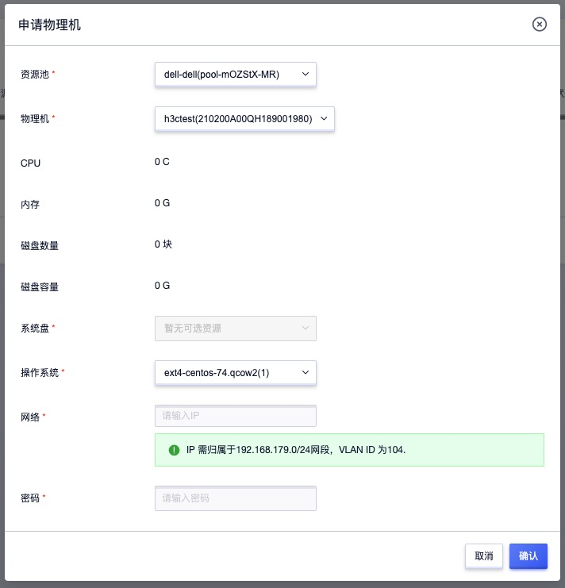

# 16 裸金属服务

## 16.1 产品简介

### 16.1.1 概述

裸金属服务（Bare Metal Server）是平台为用户应用提供专属物理服务器的服务，可保证核心数据库、关键应用系统、高性能计算业务及暂时无法云化业务的高性能和稳定性。

结合云平台对资源的弹性管理，可实现物理机的按需分配、灵活申请、自动安装操作系统，同时结合 IPMI 和 PXE 可支持裸金属设备的批量部署，并通过自动化系统配置，实现远程批量启动和部署。支持自定义安装裸金属设备的操作系统及网络自助配置，并提供物理服务器生命周期管理，包括服务器的启动、关机及释放等。

平台通过部署服务器提供 PXE 远程自助装机服务，引导相同网络中多台物理服务器由 PXE 网络启动，通过部署服务器下载并安装操作系统软件包为物理机安装操作系统，并根据操作系统配置的网络模板信息，配置服务器网络信息，将服务器与平台外网网络打通，结合平台统一管理服务，使用户通过平台即可自助申请并管理物理服务器。具体价值举例如下：

* 通过裸金属服务，平台租户可将虚拟机和物理机混合部署，构建异构基础设施的统一管理和灵活组网，物理机的网络可与平台虚拟机的外网网络互通，满足虚拟机业务与物理机互访等场景的诉求。
* 租户可根据需求自助申请平台管理者提供的物理机，并独享物理服务器的计算、网络及本地磁盘资源，可充分满足对高性能、稳定性、数据安全性的要求；结合物理服务器的独享网络，可满足对网络的低时延和高吞吐业务场景。

租户通过申请平台的裸金属物理机，可应用于核心数据库、大数据服务及关键应用等应用场景，如可将数据库集群 OracleRAC 部署于裸金属服务，将业务应用部署于平台虚拟机，并使用虚拟机的外网 IP 与物理机直接通过物理设备进行互联，提升业务性能和稳定性的同时提升资源管理的便捷性。

### 16.1.2 使用流程

在使用裸金属服务前，必须提前准备好裸金属设备，并根据需求将裸金属服务器的 IPMI 网络及业务网络与平台网络进行打通，在通过平台录入设备信息，将设备分配给租户，由租户自助申请后，自动安装操作系统并配置服务器网络。裸金属服务的使用流程分为【平台管理员流程】和【租户流程】两大部分，其中前 6 步为平台管理员进行操作，具体如下：

1. **硬件环境装备**

   准备好硬件环境，配置物理网络交换机及服务器 IPMI 网络，使平台物理网络与 IPMI 网络可互相通信。

2. **管理物理机资源池**

   由【平台管理员】创建并管理物理机资源池，用于定义一批物理机服务器操作系统使用的网段及 Vlan 信息，同时也用于定义网卡配置模板。

3. **管理网卡配置模板**

   由【平台管理员】创建并管理网卡配置模板，用于定义一批物理机服务器操作系统具体的网卡配置信息，如双网卡聚合及网卡使用的 Vlan 和 CIDR 网段，可在安装操作系统时根据模板自动配置网卡并配置 IP 等信息。

4. **为资源池添加物理机**

   由【平台管理员】为物理机资源池添加物理机信息，包括服务器的 SN 序列号、IPMI 用户名、密码及服务器操作系统的网卡模板，支持批量导入物理机信息。

5. **PXE 引导初始化**

   物理机信息录入后，如果 IPMI 网络及登录信息可正常访问，平台将通过 IPMI 和 PXE 自动引导录入的物理机重新启动并进行平台准备好的部署系统并对服务器进行初始化。初始化过程中物理机的状态为【准备中】，待服务器初始化成功后，服务器的状态置为【正常】，此时可在物理机的详情中查看物理服务器的详细硬件配置，如 CPU、内存、磁盘信息、网卡信息等。

6. **物理服务器分配**

   由【平台管理员】将已初始化的裸金属设备分配给租户，一个物理机同一时间仅支持分配给一个租户，有权限的租户可至控制台自助申请物理机并安装操作系统。

7. **租户申请物理机**

   由【平台租户】通过控制台物理机功能，根据需求自助申请有权限的物理机，可指定需要申请的特定物理机，并可指定物理机的系统盘、操作系统、IP 地址及管理员登录密码。

8. **自动化装机**

   平台根据用户指定的系统盘及操作系统，通过 PXE 远程自动安装操作系统，并在系统安装成功后，根据申请时指定的配置信息自动配置网络及密码，使用户可管理已安装好的物理机。

9. **裸金属物理机管理**

   由【平台租户】对已申请的物理机进行全生命周期管理，支持重装系统、关机、开机，并可在不用物理机时将设备重新释放给平台，由平台重新分配给其它租户。

平台租户在使用裸金属服务的前提是物理机准备好并分配给租户，租户只需要简单的申请，即可便捷的使用平台提供的裸金属设备，并可灵活部署业务系统至裸金属，组建混合异构的基础设施环境。

## 16.2 申请物理机

在平台已提供裸金属服务并已分配物理机给租户时，租户的主账号和子账号可在平台上直接申请有权限的物理机进行装机使用。用户可登录控制台，通过控制台导航栏【物理机】中的申请物理机操作进入向导页面，如下图所示：

* 资源池：选择需要申请的物理机所属的物理机资源池，即代表物理机操作系统的网络所属网段和 Vlan 。
* 物理机：选择需要申请的物理机，可通过物理机名称和序列号定位需要的物理机，同时也可通过物理机配置信息查看物理机的 CPU、内存、磁盘数量及磁盘容量配置。
* 系统盘：选择物理机操作系统安装的系统盘，如 sda(hdd) 。
* 操作系统：选择需要安装的操作系统，如 Centos 7.4 ，不同型号的物理机需要适配操作系统略有区别。
* 网络：输入物理机需要配置的 IP 地址，IP 地址必须在物理机所属资源池网络中，并且不可与物理网络中的其它 IP 地址冲突，在使用前需先检测 IP 地址的可用性。
* 密码：输入物理机操作系统的登录密码。

仅在平台管理员为租户分配物理机时才可进行申请，申请提交后列表将生成一条【申请中】的物理机信息，待申请成功后，会置为【已完成】状态，此时用户可使用安装操作系统触发平台自动安装操作系统。

## 16.3 查看物理机

租户的主账号和拥有权限的子账号可通过物理机列表及详情查看账号下已申请的物理机列表及相关详细信息，并可查看物理机的详细配置及当前状态，如下图所示：

* 名称/资源 ID：物理机的名称和全局资源唯一标识符。
* SN：物理机的整机序列号。
* IP：物理机的 IP 地址。
* 配置：物理机的硬件配置信息，包括 CPU、内存及磁盘容量。
* 申请时间：物理机的申请时间。
* 状态：当前物理机的资源状态，如申请中、装机中、运行中、开机中、关机中、已关机等。
* 电源状态：当前物理机的电源状态。

列表上的操作项中可对单台物理机进行开机、关机、装机及删除等操作，支持批量删除物理机，其中删除为将物理机释放至云平台，可重新进行申请或分配给其它租户。

租户也可通过列表上物理机的名称进入物理机的详情页面，查看物理机的详细信息，包括基本信息和配置信息：

* 基本信息包括：物理机的名称、ID、IP 地址、SN 序列号、申请时间、状态及电源状态。
* 配置信息包括：物理机的 CPU 架构、 CPU 核数、内存规格、系统盘规格、数据盘规格及操作系统版本等。

## 16.4 物理机开机/关机

平台支持租户对已申请的物理机进行关机和启动操作，用于维护和管理物理机的生命周期。电源状态为已开启时，才可执行关机操作；电源状态为已关机时，才可执行开机操作。

物理机开启过程中，物理机的状态为开机中，待开机成功后流转为运行中；当用户触发关机时，物理机的状态为关机中，待关机成功后流转为已关机。

## 16.5 物理机装机

租户可对物理机进行重装操作，仅当物理机为【运行中】时支持装机操作。用户触发装机操作后，需要用户目标操作系统，并会根据新的目标操作系统，重新通过 PXE 安装物理机的操作系统。

物理机重装时使用的网络和密码与申请物理机时相同，可在重装完成后登录物理机修改登录密码。

## 16.6 删除物理机

平台支持租户删除已申请的物理机，即租户将物理机释放至云平台，可重新进行申请或由平台管理员重新分配给其它租户，物理机被删除后，会直接进行释放，不会进入回收站。

物理机删除并不会真正从平台删除物理资源池的物理机，仅会将物理机从租户控制台进行释放，同时不影响物理机内已运行的操作系统及业务服务。

