# 13 IPSecVPN 服务 

## 13.1 产品简介

### 13.1.1 背景

用户在使用云平台部署并管理应用服务时，会有部分业务部署于 IDC 数据中心环境的内网或第三方公/私有云平台上，如 Web 服务部署于公有云平台，应用和数据库等应用部署于私有云，构建公有云和私有云混合部署环境。

在混合云的应用场景中，可以可通过专线的方式将两端网络的内网直接打通，且较好的保证网络可靠性和性能。但由于专线成本较高，仅适用于部分对网络时延要求较高的业务，为节省成本并与第三方平台建立点对点的网络通信，云平台提供 VPN 网关-IPsecVPN 连接的服务能力，允许平台侧 VPC 子网的资源直接与第三方平台内网的主机进行通信，同时也可为平台不同 VPC 网络间提供连接服务。

### 13.1.2 概述

IPsec VPN 是一种采用 IPsec 协议加密的隧道技术，由 Internet Engineering Task Force（[IETF](https://ietf.org/)）定义的安全标准框架，在互联网上为两个私有网络提供安全通道，通过加密保证连接的安全。有关 IPsec 可参考 [RFC2409](https://tools.ietf.org/html/rfc2409) （IKE—Internet Key Exchange 因特网密钥交换协议）和 [RFC4301](https://tools.ietf.org/html/rfc4301) （IPsec 架构）。

云平台 IPsecVPN 服务是基于 Internet 的网络连接服务，采用 IPsec（**I**nternet **P**rotocol **Sec**urity）安全加密通道实现企业数据中心、办公网络与平台 VPC 私有网络的安全可靠连接，同时也可使用 VPN 网关在 VPC 之间建立加密内网连接。网关服务为可容灾的高可用架构，同时支持用户选择多种加密及认证算法，并提供 VPN 连接健康检测及连接日志，保证隧道连接的可靠性、安全性及管理便捷性。

通过 IPsecVPN 服务，用户可将本地数据中心、企业分支机构与私有云平台的 VPC 私有网络通过加密通道进行连接，也可将用于不同 VPC 之间的加密连接。对端设备或系统仅需支持 IPsec 的 IKEv1 或 IKEv2 ，即可通过配置与平台的 VPN 网关进行互连，如通用网络设备或配置 IPsecVPN 的服务器。

### 13.1.3 逻辑架构

VPN 网关 IPsecVPN 服务由 VPN 网关、对端网关及 VPN 隧道连接三部分组成。


- VPN 网关

  平台侧 VPC 网络建立 IPsecVPN 连接的出口网关，通过关联 VPC 和外网 IP 与对端网关的 IPsecVPN 进行连接，用于平台私有网络和外部网络（如 IDC、公有云、私有云）之间建立安全可靠的加密网络通信。

- 对端网关

  运行于外部网络端 IPsecVPN 网关的公网 IP 地址，即与私有云平台 VPN 网关进行隧道连接的网关 IP 地址，支持 NAT 转发的网关地址。

- VPN 隧道

  连接 VPN 网关和对端网关的加密隧道，结合相应的加密认证算法及策略，为平台 VPC 私有网络和外部私有网络建立加密通信的隧道连接。

一个 VPN 网关有且必须关联 1 个 VPC 网络和 1 个外网 IP 地址，与对端网关相对应，通过 VPN 隧道进行连接。IPsecVPN 支持点到多点的连接特性，使得 VPN 网关与对端网关可以为一对一或一对多的连接关系，即一个 VPN 网关可以同时与多个对端网关建立隧道。VPN 隧道支持平台多个 VPC 子网与对端网络的多个网段通过隧道进行加密通信，平台 VPC 子网的网段与对端网络的网络不可重叠（本端与对端子网重叠会影响网络的正常通信）。


如上图案例所示，在云平台中的 VPC 网络已拥有 2 个子网，分别为 subnet1（`192.168.1.0/24`）和 subnet2（`192.168.2.0/24`）。在远端 IDC 数据中心下有 2 个内网网段，分别为 subnet3（`192.168.3.0/24`）和 subnet4（`192.168.4.0/24`）。

- 私有云平台 VPN 网关绑定 VPC 子网，并使用外网 IP 地址作为网络出口及远端数据中心的对端网关。
- 远端数据中心的平台的网关绑定数据中心子网，并使用另一个公网 IP 地址作为网络出口及私有云平台的的对端网关。
- 两端 VPN 网关分别建立 IPsecVPN 隧道，使用相同的预共享密钥及加密认证策略，经过第一阶段的 IKE 认证及第二阶段的 IPsec 认证，建立 VPN 连接通道。
- 两端网络的子网分别通过 VPN 隧道与对端网络的子网进行通信，打通跨数据中心、跨云平台的内网，构建混合云环境。

> IPsecVPN 通道在 Internet 网络中构建并运行，公网的带宽、网络阻塞、网络抖动会直接影响 VPN 网络通信的质量。

### 13.1.4 VPN 隧道建立

在建立 IPsecVPN 安全通道时，需要先在两个网关间建立 SA（Security Association 安全联盟）。SA 是 IPsec 的基础，是通信网关间对连接条件的约定，如网络认证协议（AH、ESP）、协议封装模式、加密算法（DES、3DES 和 AES）、认证算法、协商模式（主模式和野蛮模式）、共享密钥及密钥生存周期等。**SA 安全联盟的建立需要在两端网关上均约定并配置相同的条件，以确保 SA 可以对两端网关进行双向数据流通信保护。**

标准 IPsecVPN 建立 SA 的方式有手工配置和 IKE 自动协商两种，**私有云平台 VPN 网关服务使用 IKE 协议来建立 SA** 。IKE 协议建立在由 ISAKMP（Internet Security Association and Key Management Protocol，互联网安全联盟和密钥管理协议）定义的框架上，具有一套自保护机制，可在不安全的网络上安全地认证身份、交换及密钥分发，为 IPsec 提供自动协商交换密钥并建立 SA 服务。

- 身份认证：支持预共享密钥（pre-shared-key）认证，确认通信两端的身份，并在密钥产生之后对身份数据进行加密传送，实现对身份数据的安全保护。
- 交换及密钥分发：DH（Diffie-Hellman，交换及密钥分发）算法是一种公共密钥算法，通信两端在不传输密钥的情况下通过交换一些数据，计算出共享的密钥。

**IKE 通过两个阶段为 IPsec 进行密钥协商并建立 SA ：**

1. 第一阶段：通信两端彼此间建立一个已通过身份认证和安全保护的通道，即建立一个 IKE SA ，作用是为两端之间彼此验证身份，并协商出 IKE SA ，保护第二阶段中 IPsec SA 协商过程。支持 IKE V1 和 V2 版本，其中 V1 版本支持主模式（Main Mode）和野蛮模式（Aggressive Mode）两种 IKE 交换方法。

2. 第二阶段：用第一阶段建立的 IKE SA 为 IPsec 协商安全服务，即为 IPsec 协商具体的 SA ，建立用于最终的 IP 数据安全传输的 IPsec SA 。

IKE 为 IPsec 协商建立 SA，并将建立的参数及生成的密钥交给 IPsec ，IPsec 使用 IKE 协议建立的 SA 对最终 IP 报文加密或认证处理。通过 IKE 协议可为 IPsecVPN 提供端与端之间的动态认证及密钥分发，通过自动建立 IPsec 参数，降低手工配置参数的复杂度；同时由于 IKE 协议中每次 SA 的建立均需运行 DH 交换过程，可有效保证每个 SA 所使用密钥的互不相关，增加 VPN 通道的安全性。

**VPN 隧道成功建立连接后，将自动为所属 VPC 关联的本端子网下发到对端子网的路由，使本端子网访问远端私有网络的请求通过 VPN 网关及隧道进行转发，完成整个链路的打通。**

### 13.1.5 VPN 隧道参数

IPsecVPN 隧道 SA 协商建立需要配置相应的参数信息，包括隧道的基本信息、预共享密钥、IKE 策略及 IPsec 策略配置信息。两端的 VPN 在建立的过程中，需保证预共享密钥、IKE 策略及 IPsec 策略配置一致，IKE 策略指定 IPSec 隧道在协商阶段的加密和认证算法，IPSec 策略指定 IPSec 在数据传输阶段所使用的协议及加密认证算法。具体参数信息如下表所示：

**（1）基本信息**

* **名称/备注**：VPN 隧道连接的名称和备注。
* **VPN 网关**：VPN 隧道挂载的 VPN 网关，即隧道运行在云平台端的所属 VPN 网关。
* **对端网关**：VPN 隧道挂载的对端网关，即对端网关的互联网出口 IP 地址，如 IDC 数据中心的 VPN 网关。
* **本端网段**：VPN 网关所在 VPC 网络内需要和对端网络（如 IDC 数据中心）互通的子网，如 192.168.1.0/24 。本端网段用于第二阶段协商，不可与对端网段重叠。
* **对端网段**：IDC 数据中心或第三方云平台中需要与本端网段 VPN 通信的子网，如 192.168.2.0/24 。对端网段用于第二阶段协商，不可与本端网段重叠。

**（2）预共享密钥**

* **Pre Shared Key** ：IPsecVPN 连接的秘钥，用于 VPN 连接的协商，在 VPN 连接协商过程中，需保证本端与对端的密钥一致。

**（3）IKE 策略**

* **版本**：IKE 密钥交换协议的版本，支持 V1 和 V2 。V2 版对 SA 的协商过程进行简化且更加适应多网段场景，推荐选择 V2 版本。
* **认证算法**：为 IKE 协商过程中的报文提供认证，支持 md5、sha1 和 sha2-256 三种认证算法。
* **加密算法**：为 IKE 协商过程中的报文提供加密保护，支持 3des、aes128、aes192、aes256 四种加密算法。
* **协商模式**：IKE v1 的协商模式，支持主模式（main）和野蛮模式（aggressive）。
  * 主模式在 IKE 协商时需经过 SA 交换、密钥交换、身份验证三个双向交换阶段（6 个消息），而野蛮模式仅需要经过 SA 生成/密钥交换和身份验证两次交换阶段 （3 个消息）。
  * 由于野蛮模式密钥交换与身份认证一起进行无法提供身份保护，因此主模式的协商过程安全性更高，协商成功后信息传输安全性一致。
  * 主模式适用于两端设备的公网 IP 固定的场景，野蛮模式适用于需要 NAT 穿越及 IP 地址不固定的场景。

* **DH 组**：指定 IKE 交换密钥时使用的 Diffie-Hellman 算法，密钥交换的安全性及交换时间随 DH 组的扩大而增加，支持 1、2、5、14、24 。
  * 1：采用 768-bit 模指数（Modular Exponential，MODP ）算法的 DH 组。
  * 2：采用 1024-bit MODP 算法的 DH 组。
  * 5：采用 1536-bit MODP 算法的 DH 组。
  * 14：采用 2048-bit MODP 算法的 DH 组。
  * 24：带 256 位的素数阶子群的 2048-bit MODP算法 DH 组。
* **本端标识**：VPN 网关的标识，用于 IKE 第一阶段协商。支持 IP 地址和 FQDN（全称域名）。
* **对端标识**：对端网关的标识，用于 IKE 第一阶段协商。支持 IP 地址和 FQDN（全称域名）
* **生存周期**：第一阶段 SA 的生存时间，在超过生存周期后， SA 将被重新协商，如 86400 秒。

**（4）IPSec 策略**

* **安全传输协议：**IPSec 支持 AH 和 ESP 两种安全协议，AH 只支持数据的认证保护，ESP 支持认证和加密，推荐使用 ESP 协议。
* **IPSec 认证算法：**为第二阶段用户数据提供的认证保护功能，支持 md5 和 sha1 两种认证算法。
* **IPSec 加密算法：**为第二阶段用户数据提供的加密保护功能，支持 3des、aes128、aes192 和 aes256 四种加密算法 ，使用 AH 安全协议时不可用。
* **PFS DH 组：**PFS （Perfect Forward Secrecy，完善的前向安全性）特性是一种安全特性，指一个密钥被破解，并不影响其他密钥的安全性。PFS 特性为第二阶段协商的 Diffie-Hellman密钥交换算法，支持的 DH 组为支持 1、2、5、14、24 与关闭（Disable），Disable 适用于不支持 PFS 的客户端 。
* **生存周期：**第二阶段 SA 的生存时间，在超过生存周期后， SA 将被重新协商，如 86400 秒。

### 13.1.6 应用场景

VPN 网关 IPsecVPN 服务是基于 Internet 的网络连接服务，通过 IPsec 安全加密通道实现企业数据中心、办公网络与平台 VPC 私有网络的安全可靠连接，同时用户也可使用 VPN 网关在 VPC 之间建立加密内网连接。网关服务为可容灾的高可用架构，同时支持用户选择多种加密及认证算法，并提供 VPN 连接健康检测及连接日志，可满足不同的应用场景。

- VPC 到本地数据中心的连接：通过 IPsecVPN 服务将本地数据中心的内网主机和 VPC 网络的虚拟资源进行连接，构建混合云服务模式。
- VPC 到公有云 VPC 的连接：通过 IPsecVPN 服务将第三方公有云 VPC 私有网络和私有云 VPC 网络的虚拟资源进行连接，构建多云混合服务模式。
- VPC 到第三方私有云内网的连接：通过 IPsecVPN 服务将第三方私有云的 VPC 私有网络和 UCloudStack VPC 网络的虚拟资源进行连接，构建多云混合服务模式。
- VPC 到 VPC 的连接：通过 IPsecVPN 服务将 VPC 与的另一个 VPC 网络进行连接，实现 VPC 打通的场景。

## 13.2 使用流程

使用 VPN 网关 IPsec 服务前，需要明确场景并根据不同场景部署 VPN 及连接：

- 租户根据需要创建本端 VPC 网络及子网，并在子网中部署虚拟机。
- 租户根据需求指定 VPN 网关所在的 VPC 网络外网 IP 地址、安全组等参数创建高可用 VPN 网关。
- 租户根据对端网关的 IP 地址创建对端网关。
- 租户根据需求指定 VPN 隧道基本参数、预共享密钥、IKE 策略及 IPsec 策略部署 IPsev VPN 隧道。
- 用户使用一致的 VPN 隧道参数对远端网关设备的 VPN 进行配置。（远端网关设备指 IDC 数据中心的 VPN 路由设备、不同于本端 VPC 的 VPN 网关或第三方云平台的 VPN 网关等）
- 根据需求配置 VPC 私有网络中需要通信主机的路由，若可以自动下发路由，则无需配置路由。
- 测试网络连通性，如本端 VPC 子网中虚拟机 `ping` 远端私有网络中的 IP 地址，验证通信是否正常。

通常情况下，IKE 协议采用 UDP 的 500 和 4500 端口进行通信，IPsec 的 AH 和 ESP 协议分别使用 51 或 50 号协议来工作，因此为保障 IKE 和 IPsec 的正常运行，需要确保应用 IKE 和 IPsec 配置的网关设备或防火墙已开放以上端口和协议的流量。

> **IPSecVPN 服务是基于互联网的加密通信服务，在使用 IPSecVPN 前需确认两端网关均有固定或 NAT 后的互联网 IP 地址。**

## 13.3 VPN 网关

用户根据网络规划需求创建 VPN 网关，用于和对端网关建立 IPSecVPN 隧道连接，提供安全加密的 VPN 专属网络通道。

## 13.3.1 创建 VPN 网关

创建 VPN 网关时需指定机型、VPC 网络、子网、外网 IP、安全组及 VPN 网关名称和备注信息，可通过导航栏 "IPSecVPN" 进入【 VPN 网关】资源控制台，通过“创建 VPN 网关”进入创建向导页面，如下图所示：

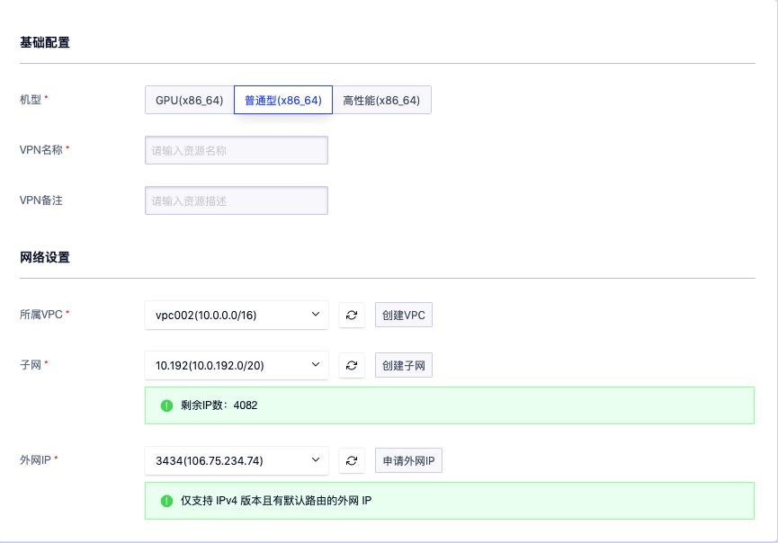

1. 选择并配置 VPN 网关基础配置及网络设置信息：

- 机型：VPN 网关实例所在宿主机的集群类型，由平台管理员自定义，如 x86 机型和 ARM 机型，通过 ARM 机型创建的实例为 ARM 版 IPsecVPN 网关实例，已适配国产芯片、服务器及操作系统。
- 名称/备注：VPN 网关的名称及备注信息。
- VPC 网络：VPN 网关所服务的 VPC 网络，即 VPN 网关仅为所选择的 VPC 内资源提供 IPSecVPN 通信服务，仅支持添加相同 VPC 网络的子网到关联隧道的本端网关。
- 子网：VPN 网关实例所在子网，通常建议选择可用 IP 数量充足的子网。
- 外网 IP ：VPN 网关所使用的外网 IP 地址，即对端网关建立 IPSecVPN 隧道的本端网关地址，仅支持绑定相同数据中心且有默认路由的外网 IP 地址。

2. 选择并配置以上信息后，可选择购买数量和付费方式，确认订单金额并点击“立即购买” 进行 VPN 网关创建：

- 购买数量：按照所选配置及参数批量创建 VPN 网关实例，一次仅支持创建 1 个 VPN 网关实例。
- 付费方式：选择 VPN 网关的计费方式，支持按时、按年、按月三种方式，可根据需求选择适合的付费方式。
- 合计费用：用户选择 VPN 网关资源按照付费方式的费用展示。

确认订单无误后点击立即购买，点击立即购买后，会返回 VPN 网关资源列表页，在列表页可查看 VPN 网关的创建过程，通常会先显示“创建中”的状态，创建成功后转换为“**运行**”。

> 允许在一个 VPC 下创建多个 VPN 网关，将 VPC 下子网分别与不同的对端网关建立隧道，实现同 VPC 下不同子网与对端不同子网建立隧道的通信场景。

### 13.3.2 查看 VPN网关

通过导航栏进入 VPN 网关资源控制台，可查看 VPN 网关资源列表，并可通过列表上名称和 ID 进入详情页面查看 VPN 网关的概览及监控信息。

### 13.3.2.1 VPN 网关列表

VPN 网关列表可查看当前账户下所有 VPN 网关的资源信息，包括名称、资源 ID、VPC、子网、外网 IP、隧道数量、创建时间、过期时间、计费方式、状态及操作项，如下图所示：

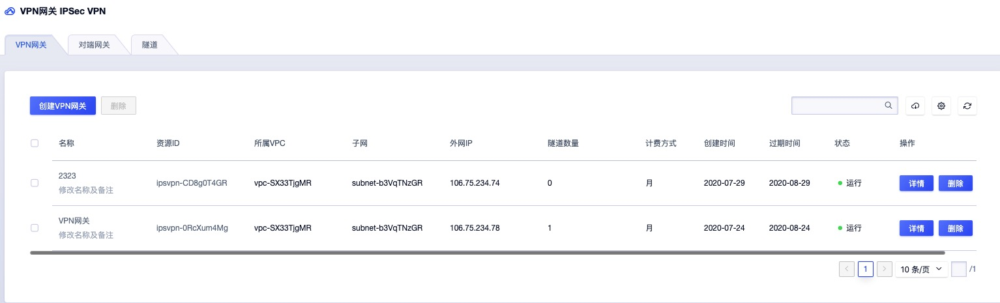

* 名称/ID：VPN 网关的名称及全局唯一标识符。
* VPC 网络：VPN 网关所服务的 VPC 网络，即 VPN 网关仅为所选择的 VPC 内资源提供 IPSecVPN 通信服务，仅支持添加相同 VPC 网络的子网到关联隧道的本端网关。
* 子网：VPN 网关实例所在子网。
* 外网 IP：VPN 网关所使用的外网 IP 地址，即对端网关建立 IPSecVPN 隧道的本端网关地址。以远端数据中心或云平台与当前网关建立隧道时必须指定该 IP 地址或 SNAT 后的地址作为对端网关 IP 地址。
* 隧道数量：当前 VPN 网关上已创建的隧道数量。
* 状态：VPN 网关的运行状态，包括创建中、运行、删除中等。

列表上操作项是指对单个 VPN 网关实例的删除操作，可通过搜索框对负载均衡资源列表进行搜索和筛选，支持模糊搜索。

为方便租户对资源的统计及维护，平台支持下载当前用户所拥有的所有 VPN 网关资源列表信息为 Excel 表格；同时支持对 VPN 网关进行批量删除操作。

### 13.3.2.2 VPN 网关详情

在 VPN 网关资源列表上，点击“**名称**” 可进入概览页面查看当前 VPN 网关实例的详细信息，如概览页所示：


**（1）基本信息**

VPN 网关的基本信息，包括名称、ID、VPC 网络、子网、外网 IP、隧道数量、计费方式、状态、创建时间、过期时间及告警模板信息，可点击告警模板右侧按钮修改 VPN 网关所关联的告警模板。

**（2）监控信息**

VPN 网关实例相关的监控图表及信息，包括网卡入/出带宽、网卡入/出包量及 VPN 网关的出带宽使用率，支持查看 1 小时、6 小时、12 小时、1 天及自定义时间的监控数据。

### 13.3.3 修改名称和备注

修改 VPN 网关资源的名称和备注，在任何状态下均可进行操作。可通过点击 VPN 网关资源列表页面每个 VPN 网关名称右侧的“编辑”按钮进行修改。

### 13.3.4 修改告警模板

修改告警模板是对 VPN 网关的监控数据进行告警的配置，通过告警模板定义的指标及阈值，可在 VPN 网关相关指标故障及超过指标阈值时，触发告警，通知相关人员进行故障处理，保证 VPN 网关及业务的网络通信。

用户可通过 VPN 网关网关详情概览页的操作项进行告警模板修改操作，在修改告警模板向导中选择新 VPN 网关告警模板进行修改。

### 13.3.5 删除 VPN 网关

用户可通过控制台或 API 的方式删除不需要的 VPN 网关实例，删除时会自动解绑已绑定的外网 IP 地址。仅支持删除未关联任何 VPN 隧道的网关，删除前需将 VPN 网关已关联的隧道连接进行删除。

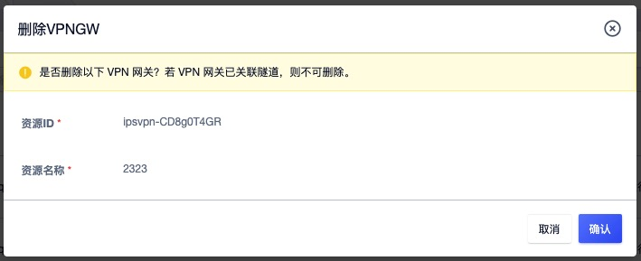

VPN 网关被删除后即直接销毁，请在删除前确保 VPN 网关无业务流量访问请求，否则可能影响业务访问。

### 13.3.6 VPN 网关续费

支持用户手动对 VPN 网关进行续费，续费操作只针对资源本身，不对资源额外关联的资源进行续费，如绑定的外网 IP 资源。额外关联的资源到期后，会自动从 VPN 网关进行解绑，为保证业务正常使用，需及时对相关资源进行续费操作。

VPN 网关续费时会按照续费时长收取费用，续费时长与资源的计费方式相匹配，当 VPN 网关的计费方式为【小时】，则续费时长可选择 1 至 24 小时；当 VPN 网关的计费方式为【按月】，则续费时长可选择 1 至 11 月；当 VPN网关的计费方式为【按年】，则续费时长为 1 至 5 年。

## 13.4 对端网关

运行于外部网络端 IPsecVPN 网关的公网 IP 地址，即与私有云平台 VPN 网关进行隧道连接的网关。对端网关可以认为是与当前平台建立 VPN 连接的第三方私有云平台、IDC 数据中心及公有云平台的 VPN 网关 IP 地址。

### 13.4.1 创建对端网关

创建对端网关需指定对端网关的公网 IP 地址。由于 **IPSecVPN 服务是基于互联网的加密通信服务，在使用前需确认两端网关均有固定或 NAT 后的互联网 IP 地址。**用户在输入正确定的 IP 地址后即可创建对端网关，用于创建隧道连接。

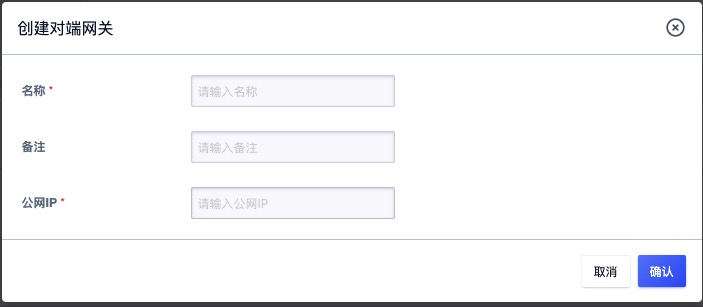

若远端网络 VPN 网关使用的是内网地址，需提供内网地址被 SNAT 后的固定公网 IP 地址。**若远端网络 SNAT 后的地址为非固定公网 IP 地址，如 IP 地址池，则将对端网关录入为 `0.0.0.0` ，即代表和任意的对端网关 IP 地址建立隧道连接，在认证算法、密钥、本端子网和对端子网都一致的情况下，连接即可建立，使两端网络透传 NAT 进行 IPSecVPN 通信。**

### 13.4.2 查看对端网关

在 VPN 网关资源控制台可切换至对端网关查看当前账户下所有对端网关的资源信息，包括名称、ID、公网 IP 地址、隧道数量、创建时间及操作项，如下图所示：

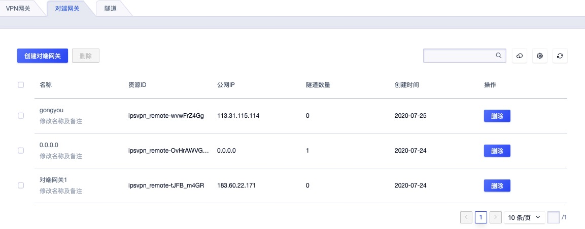

* 公网 IP 地址：指对端网关的公网 IP 地址，指定对端网关创建的隧道将以该 IP 地址为对端 IP 地址发起 VPN 连接请求，需确保该 IP 地址为正确定的远端 VPN 网关 IP 地址。
* 隧道数量：当前对端网关上已创建的隧道数量。

列表上操作项是指对单个对端网关实例的删除操作，可通过搜索框对对端网关资源列表进行搜索和筛选，支持模糊搜索。

为方便租户对资源的统计及维护，平台支持下载当前用户所拥有的所有对端网关资源列表信息为 Excel 表格；同时支持对对端网关进行批量删除操作。

### 13.4.3 修改名称和备注

修改对端网关资源的名称和备注，在任何状态下均可进行操作。可通过点击对端网关资源列表页面每个对端网关名称右侧的“编辑”按钮进行修改。

### 13.4.4 删除对端网关

用户可通过控制台或 API 的方式删除不需要的对端网关实例，仅支持删除未关联任何 VPN 隧道的对端网关，删除前需将对端网关已关联的隧道连接进行删除。


对端网关被删除后即直接销毁，请在删除前确保对端网关无业务流量访问请求，否则可能影响业务访问。

## 13.5 VPN 隧道

连接 VPN 网关和对端网关的加密隧道，结合相应的加密认证算法及策略，为平台 VPC 私有网络和外部私有网络建立加密通信的隧道连接，**单个 VPN 网关或对端网关最多可创建 20 条 VPN 隧道**。在使用 VPN 隧道与远端网关进行连接时，需要具备一些前提条件：

* 远端数据中心或云平台的网关设备需支持 IKEv1 和 IKEv2 版本的协议，如华为、华三、山石、深信服、Cisco ASA、Juniper 等品牌的路由器或防火墙设置，也可以为使用 Linux 系统搭建的 IPSecVPN 服务器。
* 远端数据中心、云平台的网关或 IPSecVPN 服务器必须配置有固定或经过 SNAT 转换的公网 IP 地址。
* 远端数据中心和本端云平台必须在网络上放通 UDP 500、UDP 4500、UDP 50 及 UDP 51 端口，保障 IKE 和 IPSec 的正常通信。
* 云平台需要和远端数据中心打通 VPN 的网段不可重复且不可重叠。

### 13.5.1 VPN 隧道配置流程

1. 在本端云平台创建 VPN 网关和对端网关；
2. 在本端云平台使用已创建的 VPN 网关和对端网关创建 VPN 隧道；
3. 配置远端数据中心、第三方云平台或公有云平台上的 VPN 网关及相关隧道配置；
4. 等待两端网关进行 SA 协商并建立 VPN 连接；
5. 在本端云平台上创建一台与 VPN 网关相同 VPC 且被指定本端网段的虚拟机，通过虚拟机 Ping 远端网络内网的一台主机，验证网络的连通性。

### 13.5.2 创建 VPN 隧道

用户创建 VPN 隧道用于连接 VPN 网关和对端网关，并支持配置 IKE 及 IPsec 策略。创建时需指定 VPN 隧道的基本配置、预共享密钥、IKE 策略及 IPSec 策略，通常用户仅需指定基本配置及预共享密钥，即可快速创建。

可通过 IPSecVPN 资源控制台进入 【VPN 隧道】标签页，进行 VPN 隧道的创建操作，创建隧道向导页面的基本配如下图所示：


1. 选择亲配置 VPN 隧道的基本配置及预共享密钥信息：

* **名称/备注**：VPN 隧道连接的名称和备注。
* **VPN 网关**：VPN 隧道挂载的 VPN 网关，即隧道运行在云平台端的所属 VPN 网关，也可称为本地网关。
* **对端网关**：VPN 隧道挂载的对端网关，即对端网关的互联网出口 IP 地址，如 IDC 数据中心的 VPN 网关。
* **本端网段**：VPN 网关所在 VPC 网络内需要和对端网络（如 IDC 数据中心）互通的子网，如 192.168.1.0/24 。本端网段用于第二阶段协商，不可与对端网段重叠，仅可选择 VPN 网关归属 VPC 包含的子网网段。
* **对端网段**：IDC 数据中心或第三方云平台中需要与本端网段 VPN 通信的子网，如 192.168.2.0/24 。对端网段用于第二阶段协商，不可与本端网段重叠，支持配置多个网段，每个网段间用逗号进行分隔，最多支持 20 个对端网段。
* **预共享密钥**：IPsecVPN 连接的秘钥，用于 VPN 连接的协商，在 VPN 连接协商过程中，**需保证本端与对端的密钥一致**。由a-z, A-Z, 数字，特殊字符组成，但是不能包含'?'和空格，长度为128 个字符。

> 注意：在对端建立隧道配置时，由于从对端网关设备的角度出发，在配置网段时需将本端网段和对端网段调换进行配置。

2. 根据需求配置用于 VPN 隧道连接协商一阶段的 IKE 策略及二阶段的 IPSec 策略。**在建立连接时，需保证两端的 IKE 策略必须保持一致（本端和对端标识在对端配置相反）**。通常选择默认值即可创建隧道，只需要在对端建立隧道配置时，使用相同的配置参数即可将两条隧道通过两端网关进行连接。

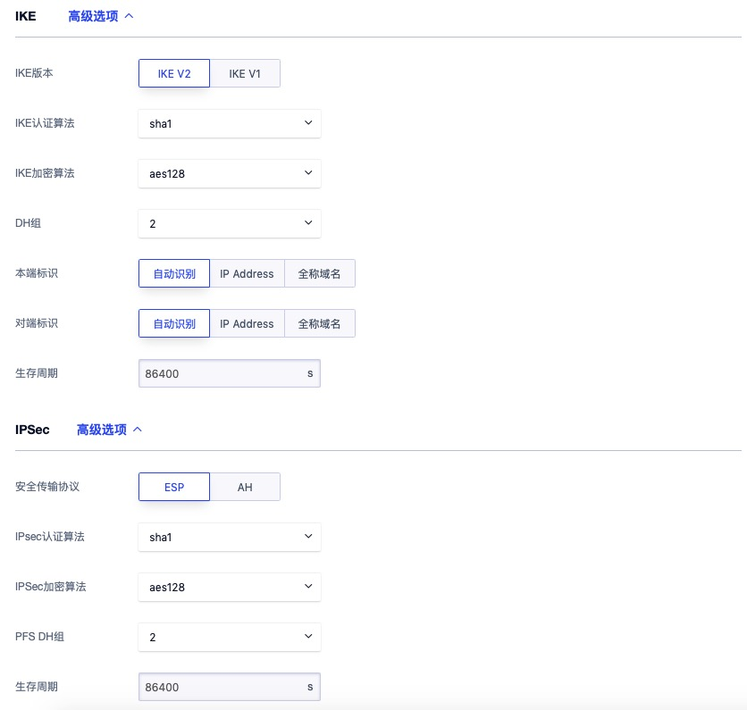

**IKE 策略：**

* **版本**：IKE 密钥交换协议的版本，支持 V1 和 V2 。V2 版对 SA 的协商过程进行简化且更加适应多网段场景，推荐选择 V2 版本。若对端 VPN 设备仅支持 V1 ，则必须选择 V1 版本进行创建。
* **认证算法**：为 IKE 协商过程中的报文提供认证，支持 md5、sha1 和 sha2-256 三种认证算法，默认为 sha1。
* **加密算法**：为 IKE 协商过程中的报文提供加密保护，支持 3des、aes128、aes192、aes256 四种加密算法，默认算法为 aes128 。
* **协商模式**：IKE v1 的协商模式，支持主模式（main）和野蛮模式（aggressive）。
  * 主模式在 IKE 协商时需经过 SA 交换、密钥交换、身份验证三个双向交换阶段（6 个消息），而野蛮模式仅需要经过 SA 生成/密钥交换和身份验证两次交换阶段 （3 个消息）。
  * 由于野蛮模式密钥交换与身份认证一起进行无法提供身份保护，因此主模式的协商过程安全性更高，协商成功后信息传输安全性一致。
  * 主模式适用于两端设备的公网 IP 固定的场景，野蛮模式适用于需要 NAT 穿越及 IP 地址不固定的场景。
* **DH 组**：指定 IKE 交换密钥时使用的 Diffie-Hellman 算法，密钥交换的安全性及交换时间随 DH 组的扩大而增加，支持 1、2、5、14、24 ，默认值为 2 ，值越大所占用的计算性能越高。
  * 1：采用 768-bit 模指数（Modular Exponential，MODP ）算法的 DH 组。
  * 2：采用 1024-bit MODP 算法的 DH 组。
  * 5：采用 1536-bit MODP 算法的 DH 组。
  * 14：采用 2048-bit MODP 算法的 DH 组。
  * 24：带 256 位的素数阶子群的 2048-bit MODP算法 DH 组。
* **本端标识**：VPN 网关的标识，用于 IKE 第一阶段协商，支持 IP 地址和 FQDN（全称域名），默认为 VPN 网关的外网 IP 地址。
* **对端标识**：对端网关的标识，用于 IKE 第一阶段协商。支持 IP 地址和 FQDN（全称域名），默认为对端网关的 IP 地址。若对端为 NAT 透传模式（对端网关的 IP 地址为 0.0.0.0） ，需要将标识 IP 修订为真正的对端网关 IP 地址，即在对端 VPN 网关设备中配置的本端网关 IP 地址。
* **生存周期**：第一阶段 SA 的生存时间，在超过生存周期后， SA 将被重新协商，取值范围为 3600~86400 ，默认值为 86400 秒。

> 注意：在对端建立隧道配置时，由于从对端网关设备的角度出发，在配置标识时需将本端标识和对端标识调换进行配置。

**IPSec 策略**

* **安全传输协议：**IPSec 支持 AH 和 ESP 两种安全协议，AH 只支持数据的认证保护，ESP 支持认证和加密，推荐使用 ESP 协议。
* **IPSec 认证算法：**为第二阶段用户数据提供的认证保护功能，支持 md5 和 sha1 两种算法，默认为 sha1。
* **IPSec 加密算法：**为第二阶段用户数据提供的加密保护功能，支持 3des、aes128、aes192 和 aes256 四种加密算法 ，默认为 aes128 ，使用 AH 安全协议时不可用。
* **PFS DH 组：**PFS （Perfect Forward Secrecy，完善的前向安全性）特性是一种安全特性，指一个密钥被破解，并不影响其他密钥的安全性。PFS 特性为第二阶段协商的 Diffie-Hellman密钥交换算法，支持的 DH 组为支持 1、2、5、14、24 与关闭（Disable），默认值为 2  ，Disable 适用于不支持 PFS 的客户端 。
* **生存周期：**第二阶段 SA 的生存时间，在超过生存周期后， SA 将被重新协商，取值范围为 3600~86400 ，默认值为 86400 秒。

3. 选择并配置以上信息后，点击“立即创建” 进行 IPSecVPN 隧道的创建，可返回至隧道列表页面查看隧道的创建过程及 VPN 连接过程。

创建过程中，VPN 隧道的资源状态为“创建中”，待隧道创建成功后，资源状态流转为“运行” 。创建成功后平台会根据隧道所配置的参数与对端网关进行 VPN 连接，即进行 IPSecVPN 两个 SA 的阶段协商，VPN 隧道的连接状态为“连接中”  ，待连接状态流转为“已连接” 后，证明 VPN 隧道已连接成功。若 VPN 隧道连接失败，则会进行重试，3 次重试依然失败，则显示阶段 1 失败或阶段 2 失败，系统会在连接失败后，每隔 12 秒重新进行连接尝试。

**VPN 隧道的连接状态处在已连接时，平台会根据隧道配置的对端网段，在关联的本端 VPC 子网中包含虚拟机里自动下发到对端网段的网络路由，保证网络连通性。**

### 13.5.2 查看 VPN 隧道

VPN 隧道创建成功后，用户可通过导航栏进入【VPN 网关】控制台，切换至 VPN 隧道标签页可查看隧道的资源列表，并可通过列表上名称和 ID 进入详情页面查看 VPN 隧道的详细配置信息及监控信息。

#### 13.5.2.1 VPN 隧道列表

VPN 隧道列表可查看当前账户下所有隧道的资源列表信息，包括名称、资源 ID、VPN 网关、对端网关、创建时间、资源状态、连接状态及操作项，如下图所示：


* 名称/ID：VPN 隧道的名称及全局唯一标识符。
* VPN 网关：VPN 隧道所关联的 VPN 网关名称及 IP 地址。
* 对端网关：VPN 隧道所关联的对端网关名称及 IP 地址。
* 创建时间：VPN 隧道的创建时间。
* 资源状态：VPN 隧道的资源运行状态，包括创建中、运行、删除中等。
* 连接状态：VPN 隧道的连接状态，包括连接中、已连接、阶段 1 失败及阶段 2 失败。
  * 阶段 1 失败代表 VPN 隧道在协商第一阶段 IKE SA 时失败，需要检查两端隧道的 VPN 网关 IP、对端网关 IP、对端网段、本端网段、预共享密钥及 IKE 配置参数是否一致；
  * 阶段 2 失败通常代表第 1 阶段的 IKE SA 已协商成功，但第 1 阶段的 IPSec SA 协商失败，需要检查两端隧道的第二阶段的 IPSec 配置参数是否一致。

列表上操作项是指对单个隧道的操作，包括下载隧道配置及删除操作，可通过搜索框对隧道资源列表进行搜索和筛选，支持模糊搜索。

为方便租户对资源的统计及维护，平台支持下载当前用户所拥有的所有隧道资源列表信息为 Excel 表格；同时支持对隧道进行批量删除操作。

#### 13.5.2.2 VPN 隧道详情

在 VPN 隧道资源列表上，点击“**名称**” 或 ID 可进入概览页面查看当前 VPN 隧道的详细配置信息和监控信息：

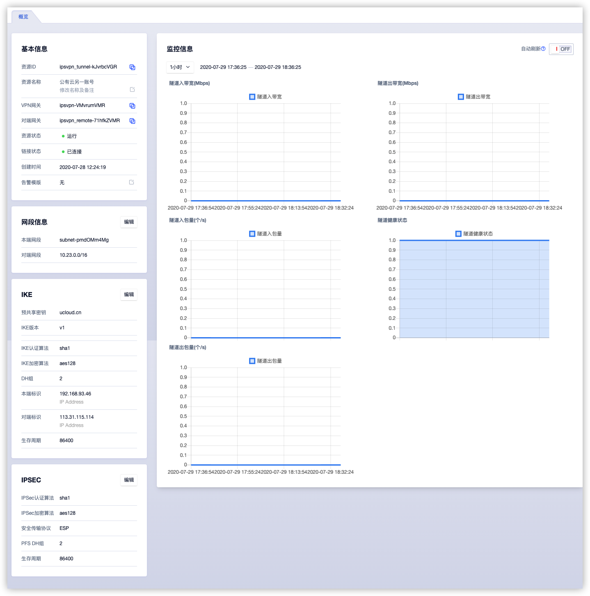

**（1）基本信息**

VPN 隧道基本信息，包括资源 ID、名称、VPN 网关、对端网关、资源状态、连接状态、创建时间及告警模板信息，可点击告警模板右侧按钮修改负载均衡所关联的告警模板。

**（2）网段信息**

VPN 隧道已配置的网段匹配信息，包括本端网段和对端网段，仅展示网段间可通过 VPN 隧道建立的连接进行通信。可通过编辑按钮对本端和对端网段进行修改，详见[修改隧道网段策略](#_1354-修改隧道网段策略) 。

**（3）IKE 配置信息**

VPN 隧道的 IKE 配置信息，包括预共享密钥、IKE 版本、协商模式、IKE 认证算法、IKE 加密算法、DH 组、本端标识、对端标识及生存周期等信息。可通过编辑按钮对 IKE 配置信息进行修改，详见[修改 IKE 策略](#_1355-修改-IKE-策略配置) 。

**（4）IPSec 配置信息**

VPN 隧道的 IPSec 配置信息，包括安全传输协议、IPSec 认证算法、IPSec 加密算法、PFS DH 组及生存周期等信息。可通过编辑按钮对 IKE 配置信息进行修改，详见[修改 IPSec 策略](#_1356-修改-IPsec-策略配置) 。

**（5）监控信息**

负载均衡实例相关的监控图表及信息，包括隧道出/入带宽、隧道出/入包量及隧道健康状态，支持查看 1 小时、6 小时、12 小时、1 天及自定义时间的监控数据。

用户也可直接通过隧道健康状态的监控图表查看隧道的连接状态，若图表数据全为 1 代表已连接，为 0 代表连接中或连接失败国。

### 13.5.3 下载 VPN 隧道配置

支持用户下载隧道的配置信息至本地，可参照下载的配置文件进行远端数据中心或云平台的 VPN 隧道配置。下载的配置文件为 `conf` 格式，包括整个 VPN 隧道 VPN 网关、对端网关、本端网段、对端网关、预共享密钥及 IKE 和 IPsec 的策略相关配置信息。

可通过隧道列表上的【下载隧道配置】按钮进行配置文件的下载，点击后会直在本地下载一个 `.conf` 的文件，在文件中会列举当前隧道的相关配置：

```
conn ipsvpn_tunnel-MQcK-cVMR
    keyingtries=3
    authby=psk
    auto=start
    type=tunnel
    pfs=no

    keyexchange=ikev2

    # IPSecProtocol

    esp=aes128-sha1-modp1024!

    ike=aes128-sha1-modp1024!
    ikelifetime=86400s
    lifetime=86400s
    left=192.168.93.46
    leftid=192.168.93.46
    leftsubnet=172.16.1.0/24
    leftnexthop=%defaultroute
    right=106.75.234.78
    rightid=106.75.234.78
    rightsubnet=10.0.192.0/20
    rightnexthop=%defaultroute
    dpdaction=hold
    dpddelay=8s
    dpdtimeout=13s
```

* keyexchange 代表当前隧道使用的 IKE 版本为 V2 。
* IKE 及 esp 分别代表 IKE 策略和 IPSec 策略的认证及加密算法。
* left 和 right 分别代表 VPN 网关和对端网关的外网 IP 地址，示例配置文件中 VPN 网关使用的是内网地址，通过 SNAT 与对端网关 106.75.234.78 进行通信。
* leftid 和 rightid 代表 IKE 配置项中的本端标识和对端标识。
* leftsubnet 和 rightsubnet 分别代表本端网段和对端网段。

如果用户需要根据此配置文件进行远端数据中心或云平台的 VPN 配置，从对端网关设备的角度出发，本端网关和本端网段指自己的网关设备和网段，对端网关和对端网段指私有平台的 VPN 网关及 VPC 子网，故在配置对端网关时需要分别将将 VPN 网关&对端网关、本端网段&对端网关、本端标识&对端标识进行对调。

### 13.5.4 修改隧道网段策略

用户可根据业务需求对隧道的网段策略进行修改，如增加本端网段或减少对端网段。通过隧道详情概览页面的网段信息可进行网段策略的修改，如下图所示：


支持自定义修改本端网段和对端网段，本端网段和对端网段不允许重复且不允许重叠。

* 本端网段仅允许选择 VPN 网关所属 VPC 内包含的子网网段。
* 支持输入多个对端网段，每行一个网段，必须符合网段的输入规范。
* 同一个隧道内最多支持 20 个对端网段。

确认修改后，平台会自动对隧道进行重新连接，即隧道的连接状态为连接中，待状态流转至已连接，代表配置修改成功，此时平台会自动下发对端网段为目标的路由至关联子网的虚拟机中，使虚拟机可以和对端网段进行通信。

> 在同一个 VPC 下，本端网段和对端网段的对应规则仅允许存在一条，即两个相同 VPC 的 VPN 网段关联的隧道不可有相同的网段策略，否则可能会影响路由下发导致网络中断。

### 13.5.5 修改 IKE 策略配置

当网络配置发生变更或隧道连接状态为阶段 1 失败时，可通过校验并修改 IKE 策略配置，重新进行连接。通过隧道详情概览页面的 IKE 可进行 IKE 策略的修改，如下图所示：

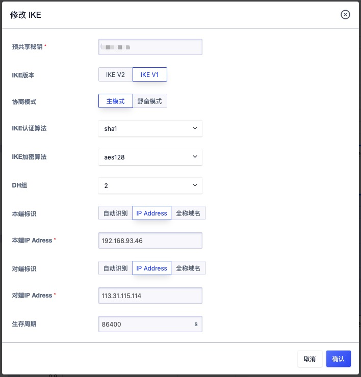

支持修改预共享密钥 及 IKE 策略的所有配置参数，两端隧道的预共享密钥 、IKE 版本、协商模式（IKEv1）、认证算法、加密算法、DH 组、本端标识、对端标识必须保持一致，生存周期可以不一致。

在本端标识处通常建议使用本端网关和对端网关的 IP 地址，若对端网关使用的是 `0.0.0.0` 时，通常建议配置对端网关的内网 IP 地址，只要两端配置的标识是一致的就可以正常连接。

确认修改后，平台会自动对隧道进行重新连接，即隧道的连接状态为连接中，待状态流转至已连接，代表 IKE 策略修改成功。

### 13.5.6 修改 IPSec 策略配置

当网络配置发生变更或隧道连接状态为阶段 2 失败时，可通过校验并修改 IPSec 策略配置，重新进行连接。通过隧道详情概览页面的 IPSec 可进行 IPSec 策略的修改，如下图所示：

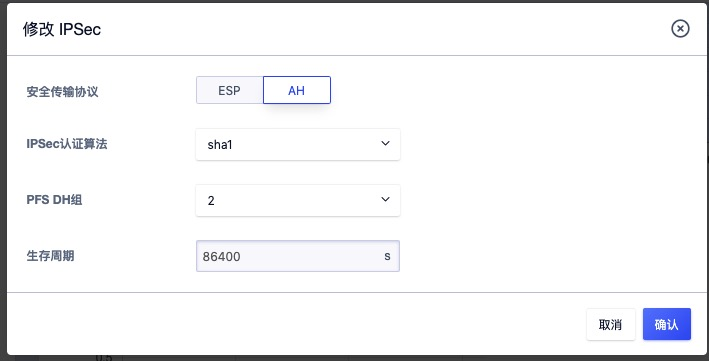

支持修改 IPSec 策略的所有配置参数，两端隧道的安全传输协议、认证算法、加密算法及 PFS DH 组必须保持一致，生存周期可以不一致。

确认修改后，平台会自动对隧道进行重新连接，即隧道的连接状态为连接中，待状态流转至已连接，代表 IPSec 策略修改成功。

### 13.5.7 修改名称和备注

修改 VPN 隧道资源的名称和备注，在任何状态下均可进行操作。可通过点击 VPN 隧道资源列表页面每个 VPN 隧道名称右侧的“编辑”按钮进行修改。

### 13.5.8 修改告警模板

修改告警模板是对 VPN 隧道的监控数据进行告警的配置，通过告警模板定义的指标及阈值，可在 VPN 隧道相关指标故障及超过指标阈值时，触发告警，通知相关人员进行故障处理，保证 VPN 网关及业务的网络通信。

用户可通过 VPN 隧道详情概览页的操作项进行告警模板修改操作，在修改告警模板向导中选择新 VPN 隧道告警模板进行修改。

### 13.5.9 删除 VPN 隧道

用户可通过控制台或 API 的方式删除不需要的 VPN 隧道，删除后 VPN  隧道会自动中断，同时会清除已配置在本端子网虚拟机中的路由。

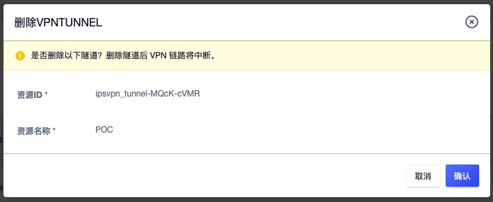

VPN 隧道被删除后即直接销毁，请在删除前确保 VPN 隧道无业务流量访问请求，否则可能影响业务访问。

## 13.6 VPN 管理员指南

在私有云平台端 VPN 网关和隧道创建成功后，还需要管理员配置远端 VPN 设备或网络平台，实现远端数据中心或云平台的内网与本端私有云平台的 VPC 子网互联互通。

远端 VPN 设备或网络平台即本端 UCloudStack 私有云平台标记的对端网关，可以是物理硬件或和软件系统，如路由器、防火墙、VPN 设备或使用 `OpenSwan`和`StrongSwan`搭建在 Linux 系统上的 VPN 服务器系统；同样也可以是其它云平台的 VPN 服务，如 UCloud 公有云 VPN 网关服务或阿里云的 IPSecVPN 连接等。

为演示方便，本文主要通过以下几种示例环境与 UCloudStack IPsecVPN 网关建立连接：

* UCloud 公有云 IPSecVPN 
* Cisco 防火墙配置
* StrongSwan 配置
* VPC 到 VPC 的 VPN 连接

### 13.6.1 UCloud 公有云 IPSecVPN

通过在 UCloud 公有云和 UCloudStack 之间建立  IPSecVPN 连接，实现私有云和公有云混合构建及数据传输。

UCloud 公有云  IPSecVPN 目前仅支持 IKEv1 ，本文描述在私有云和 UCloud 公有云间建立基于 IKEv1 版本的 IPSecVPN 连接。

#### 13.6.1.1 前提条件

在建立 IPSecVPN 连接进行通信前，需确认两端要建立 IPSecVPN 连接的网络拓扑关系及配置参数信息。

| 网络配置和配置参数   | UCloudStack 私有云              | UCloud 公有云                   |
| -------------------- | ------------------------------- | ------------------------------- |
| VPN 网关公网 IP 地址 | 106.75.234.78                   | 113.31.115.114                  |
| VPC 网段             | 10.0.192.0/20                   | 10.23.0.0/16、10.25.0.0/16      |
| 客户虚拟机 IP        | 10.0.192.32                     | 10.23.228.173                   |
| 预共享密钥           | ucloud.1231                     | ucloud.1231                     |
| IKE 版本             | V1——协商模式为主模式            | V1——协商模式为主模式            |
| IKE 策略             | 认证 SHA1、加密 AES128、DH 组 2 | 认证 SHA1、加密 AES128、DH 组 2 |
| IPSec 安全传输协议   | ESP                             | ESP                             |
| IPSec 策略           | 认证 SHA1、加密 AES128、PFSDH 2 | 认证 SHA1、加密 AES128、PFSDH 2 |

> 本文假设已在 UCloudStack 私有云上部署 VPN 网关和对端网关，并已通过以上配置参数创建 VPN 隧道，等待 UCloud 公有云配置好 VPN 隧道后，即可进行 VPN 连接。

#### 13.6.1.2 配置公有云网关

UCloud 公有云 IPSecVPN 服务与 UCloudStack VPN 服务的配置过程相同，均需创建 VPN 网关、客户网关，并建立配置 VPN 隧道进行 VPN 连接。

确保配置前已创建 VPC 网络的子网为 10.23.0.0/16 和 10.25.0.0/16 ，并已在 VPC 内创建云主机 10.23.228.173。

1. 使用 113.31.115.114 外网 IP 地址创建 VPN 网关，如下图所示：

   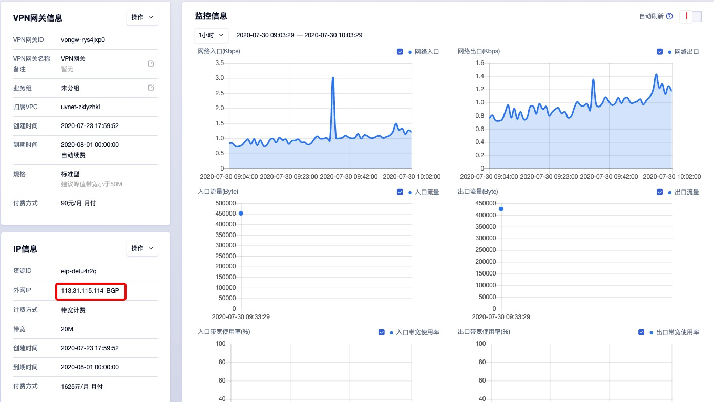

2. 使用 UCloudStack 侧 VPN 网关的公网 IP 地址创建客户网关，本示例假设 UCloudStack 环境 VPN 网关的出口 IP 为固定公网 IP 地址，如下图所示：

   

   > 注意：如果 UCloudStack 侧 VPN 网关使用的公网 IP 地址为 SNAT 后的地址池，即 VPN 网关的出口非固定公网 IP ，则需要将对端网关创建为 0.0.0.0 ，使 UCloud 公有云可以通过任意地址连接 UCloudStack 侧的 VPN 网关并建立 VPN 连接。

3. 使用已创建的 VPN 网关和客户网关，采用前提条件中的 IKE 和 IPSec 策略创建 VPN 隧道，如下图所示：

   

   * 本端网段和对端网段与 UCloudStack 平台侧隧道正好相反，UCloudStack 平台侧隧道配置的本端网段为`10.0.192.0/20` ，对端网段为`10.23.0.0/16 ` 和 `10.25.0.0/16`  。
   * 本端 ID 和对端 ID 即对应 UCloudStack 平台侧的本端标识和对端标识，如图所示与 UCloudStack 侧的配置正好相反，UCloudStack 侧配置的本端标识为 `106.75.234.78` ，对端标识为 `113.31.115.114` 。
   * IKE 策略的版本、加密算法、认证算法、预共享密钥 、DH 组 均与 UCloudStack 侧保持一致。
   * IPSec 策略安全协议、加密算法、认证算法、PFS DH 组与 UCloudStack 侧保持 一致。

4. 分别查看 UCloudStack 侧和 UCloud 公有云侧的 VPN 隧道连接状态，等待隧道自动连接。UCloudStack 侧可通过列表上连接状态直接查看隧道是否已连接，UCloud 公有云侧需进入隧道详情页面查看"VPN 隧道状态"的监控，如下图所示：

   

5. 在 UCloud 公有云的隧道监控中查看 VPN 隧道状态已变为 1 ，代表 VPN 已连接，同时在 UCloudStack 中隧道的连接状态流转为“已连接” ，如下图所示：

   

#### 13.6.1.3 配置验证

在已连接状态时，UCloudStack 侧会自动下发对端网段为目标地址的路由至本端网段内的虚拟机中，可登入提前准备的本端虚拟机查看相关网络及路由配置信息。

如下图所示，本端虚拟机的 IP 地址为 `10.0.192.32` ，下发的路由为 `10.23.0.0/16`  及 `10.25.0.0/16` ，即代表虚拟机可与 UCloud 公有云侧的两个网段进行通信。


可通过 ping 命令检测与 UCloud 公有云虚拟机的网络连通性，如下图代表两端内网的虚拟机网络互通。

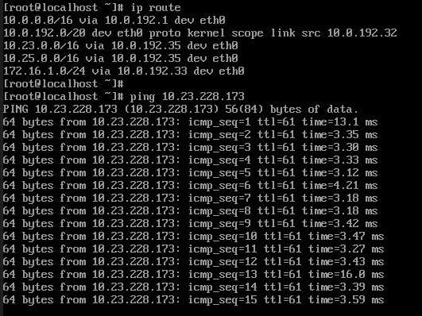

根据以上的配置过程，即可通过 IPSecVPN 的方式将 UCloudStack 和与 UCloud 公有云内网打通。

### 13.6.2 Cisco 防火墙配置

通过在 IDC 数据中心的 Cisco 防火墙与 UCloudStack 之间建立  IPSecVPN 连接，实现私有云和 IDC 数据中心网络互通和数据交互。

Cisco 防火墙支持 IKEv1 和 IKEv2 ，本文仅介绍私有云平台和 Cisco 防火墙建立基于 IKEv2 的 IPSecVPN 连接。

#### 13.6.2.1 前提条件

在建立 IPSecVPN 连接进行通信前，需确认两端要建立 IPSecVPN 连接的网络拓扑关系及配置参数信息。

| 网络配置和配置参数   | UCloudStack 私有云              | Cisco 防火墙                    |
| -------------------- | ------------------------------- | ------------------------------- |
| VPN 网关公网 IP 地址 | 106.75.234.78                   | 1.1.1.1                         |
| VPC 网段/本地网段    | 10.0.192.0/24                   | 192.168.1.0/24                  |
| 客户虚拟机 IP        | 10.0.192.32                     | 192.168.1.2                     |
| 预共享密钥           | ucloud.1231                     | ucloud.1231                     |
| IKE 版本             | V2                              | V2                              |
| IKE 策略             | 认证 SHA1、加密 AES128、DH 组 2 | 认证 SHA1、加密 AES128、DH 组 2 |
| IPSec 安全传输协议   | ESP                             | ESP                             |
| IPSec 策略           | 认证 SHA1、加密 AES128、PFSDH 2 | 认证 SHA1、加密 AES128、PFSDH 2 |

> 本文假设已在 UCloudStack 私有云上部署 VPN 网关和对端网关，并已通过以上配置参数创建 VPN 隧道，等待数据中心的 Cisco 防火墙配置好 VPN 隧道后，即可进行 VPN 连接。

#### 13.6.2.2 配置防火墙

1. 配置 IKE 第一阶段算法。

   ```
   crypto ikev2 proposal test 
   encryption aes-cbc-128
   integrity sha1
   group 2
   ```

2. 配置 IKEv2 策略并应用至 proposal 。

   ```
   crypto ikev2 policy ipsecpro64_v2
   proposal test
   ```

3. 配置预共享密钥。

   ```
   crypto ikev2 keyring ipsecpro64_v2 
   peer vpngw 
   address 106.75.234.78
   pre-shared-key 0 ucloud.1231
   ```

4. 配置身份认证。

   ```
   crypto ikev2 profile ipsecpro64_v2
   match identity remote address 106.75.234.78 255.255.255.255
   identity local address 192.168.1.1 
   authentication remote pre-share     
   authentication local pre-share 
   keyring local ipsecpro64_v2
   ```

5. 配置 IPSec 安全协议。

   ```
   crypto ipsec transform-set ipsecpro64_v2 esp-aes esp-sha-hmac
   mode tunnel
   ```

6. 配置 ACL ，定义需要 VPN 保护并透传的数据流，即本端网段和对端网段。若有多个网段，则需要分别对多个网段添加 ACL 策略，以确保 VPN 可透传网段流量。

   ```
   access-list 200 permit ip 192.168.1.0 0.0.0.255 10.0.192.0/24 0.0.0.255
   ```

7. 配置 IPSec 策略并应用 IPSec 策略

   ```
   crypto map ipsecpro64_v2 10 ipsec-isakmp
   set peer 106.75.234.78
   set transform-set ipsecpro64_v2 
   set ikev2-profile ipsecpro64_v2
   match address 200
   
   interface g0/1
   crypto map ipsecpro64_v2
   ```

   > interface g0/1 代表防火墙网关公网 IP 地址的接口，即防火墙的公网接口。

8. 配置静态路由

   ```
   ip route 10.0.192.0 255.255.255.0 106.75.234.78
   ```

#### 13.6.2.3 配置验证

通过 IDC 数据中心防火墙下 `192.168.1.0/24` 网段的主机 `Ping` 云平台的虚拟机`10.0.192.32` ，测试连通性。

### 13.6.3 StrongSwan 配置

通过在任意有公网 IP 地址的 Linux 主机上安装并配置 StrongSwan 与 UCloudStack 之间建立  IPSecVPN 连接，实现私有云和安装 IPSec 软件的主机对接，使相同网段的客户主机通过 IPSec 主机与 UCloudStack 平台虚拟机进行通信。

#### 13.6.3.1 前提条件

在建立 IPSecVPN 连接进行通信前，需确认两端要建立 IPSecVPN 连接的网络拓扑关系及配置参数信息。

| 网络配置和配置参数   | UCloudStack 私有云              | IDC 侧 StrongSwan                   |
| -------------------- | ------------------------------- | ----------------------------------- |
| VPN 网关公网 IP 地址 | 106.75.234.78                   | 113.31.113.78（内网 10.23.228.173） |
| VPC 网段/本地网段    | 10.0.192.0/20                   | 10.23.0.0/16                        |
| 客户虚拟机 IP        | 10.0.192.32                     | 10.23.112.177                       |
| 预共享密钥           | ucloud.1231                     | ucloud.1231                         |
| IKE 版本             | V2                              | V2                                  |
| IKE 策略             | 认证 SHA1、加密 AES128、DH 组 5 | 认证 SHA1、加密 AES128、DH 组 5     |
| IPSec 安全传输协议   | ESP                             | ESP                                 |
| IPSec 策略           | 认证 SHA1、加密 AES128、PFSDH 5 | 认证 SHA1、加密 AES128、PFSDH 5     |

> 本文假设已在 UCloudStack 私有云上部署 VPN 网关和对端网关，并已通过以上配置参数创建 VPN 隧道，等待数据中心的 StrongSwan 配置好 VPN 隧道后，即可进行 VPN 连接。

#### 13.6.3.2 配置 StrongSwan

本节介绍安装配置 StrongSwan 软件，安装环境为 Centos 7.4 。

1. 安装 StrongSwan

   ```
   yum install strongswan
   strongswan version
   ```

2. 开启操作系统数据转发配置并进行相关网络配置

   ```
   echo 'net.ipv4.ip_forward = 1' >> /etc/sysctl.conf
   echo 'net.ipv4.conf.default.rp_filter = 0' >> /etc/sysctl.conf
   echo 'net.ipv4.conf.all.accept_redirects = 0' >> /etc/sysctl.conf
   echo 'net.ipv4.conf.all.send_redirects = 0' >> /etc/sysctl.conf
   echo 0 > /proc/sys/net/ipv4/conf/lo/rp_filter
   echo 0 > /proc/sys/net/ipv4/conf/eth0/rp_filter
   echo 0 > /proc/sys/net/ipv4/conf/eth1/rp_filter
   echo 0 > /proc/sys/net/ipv4/conf/all/rp_filter
   sysctl -a | egrep "ipv4.*(accept|send)_redirects" | awk -F "=" '{print$1"= 0"}' >> /etc/sysctl.conf
   
   sysctl -p     //执行命令，生效转发配置命令
   ```

3. 配置 StrongSwan 参数

   ```
   vi /etc/strongswan/ipsec.conf           //编辑ipsec.conf文件
                        
   conn test                               //定义连接名称为 test
     authby=psk
     type=tunnel                           //开启隧道模式
   	keyexchange=ikev2                     // ike密钥交换方式为版本2	
     auto=start
     leftid=113.31.113.78                         //本端标识ID
     left=10.23.228.173                        //本地IP，nat场景选择真实的主机地址
     leftsubnet=10.23.0.0/16               //本地子网  
     rightid=106.75.234.78                   //远端标识ID
     right=106.75.234.78                     //远端VPN网关IP
     rightsubnet=10.0.192.0/20               //远端子网
     ike=aes128-sha1-modp1024               //按照对端配置定义ike阶段算法和group
     esp=aes128-sha1-modp1024             //按照对端配置定义ipsec阶段算法和group
     ikelifetime=86400s                             // ike阶段生命周期
     lifetime=86400s                                //二阶段生命周期 
     dpdaction=restart
     dpddelay=8s
     dpdtimeout=13s
   ```

> 本文搭建 StrongSwan 的主机是通过 NAT 网关模式，即使用 NAT 网关的 IP 地址访问互联网，或真实的搭建环境中 StrongSwan 主机有真实的公网 IP 地址，则 left 的值为真实公网 IP 地址。

4. 配置 ipsec.secrets 文件，定义预共享密钥

   ```
   vi /etc/strongswan/ipsec.secrets
   
   113.31.113.78 106.75.234.78 : PSK ucloud.1231
   ```

5. 启动 StrongSwan  并加入开机启动

   ```
   systemctl enable strongswan
   systemctl start strongswan
   ```

#### 13.6.3.3 配置验证

1. 通过 `strongswan statusall` 命令查询 strongswan 的连接状态，若出现类似  `ESTABLISHED 6 minutes ago`的信息，证明已连接成功，如下所示：

```
[root@10-23-228-173 ~]# strongswan statusall
Status of IKE charon daemon (strongSwan 5.7.2, Linux 3.10.0-957.27.2.el7.x86_64, x86_64):
  uptime: 6 minutes, since Jul 30 19:13:57 2020
  malloc: sbrk 2666496, mmap 0, used 609168, free 2057328
  worker threads: 11 of 16 idle, 5/0/0/0 working, job queue: 0/0/0/0, scheduled: 5
  loaded plugins: charon pkcs11 tpm aesni aes des rc2 sha2 sha1 md4 md5 mgf1 random nonce x509 revocation constraints acert pubkey pkcs1 pkcs7 pkcs8 pkcs12 pgp dnskey sshkey pem openssl gcrypt fips-prf gmp curve25519 chapoly xcbc cmac hmac ctr ccm gcm curl attr kernel-netlink resolve socket-default farp stroke vici updown eap-identity eap-sim eap-aka eap-aka-3gpp eap-aka-3gpp2 eap-md5 eap-gtc eap-mschapv2 eap-dynamic eap-radius eap-tls eap-ttls eap-peap xauth-generic xauth-eap xauth-pam xauth-noauth dhcp led duplicheck unity counters
Listening IP addresses:
  10.23.228.173
Connections:
        test:  10.23.228.173...106.75.234.78  IKEv2, dpddelay=8s
        test:   local:  [113.31.113.78] uses pre-shared key authentication
        test:   remote: [106.75.234.78] uses pre-shared key authentication
        test:   child:  10.23.0.0/16 === 10.0.192.0/20 TUNNEL, dpdaction=restart
Security Associations (1 up, 0 connecting):
        test[1]: ESTABLISHED 6 minutes ago, 10.23.228.173[113.31.113.78]...106.75.234.78[106.75.234.78]
        test[1]: IKEv2 SPIs: 8285787a9e1b8ae2_i* 22543e6225ea8e59_r, pre-shared key reauthentication in 23 hours
        test[1]: IKE proposal: AES_CBC_128/HMAC_SHA1_96/PRF_HMAC_SHA1/MODP_1024
        test{1}:  INSTALLED, TUNNEL, reqid 1, ESP in UDP SPIs: c22520e2_i c30646c8_o
        test{1}:  AES_CBC_128/HMAC_SHA1_96, 35364 bytes_i (421 pkts, 1s ago), 35364 bytes_o (421 pkts, 1s ago), rekeying in 23 hours
        test{1}:   10.23.0.0/16 === 10.0.192.0/20
```

2. 在 IDC 数据中心 StrongSwan下 `10.23.0.0/16` 网段的主机内添加到达 UCloudStack 侧网段的路由，使两端主机可以互相通信。

   ```
   ip route add 10.0.192.0/20 via 10.23.228.173
   ```

3. 通过 IDC 数据中心 StrongSwan下 `10.23.0.0/16` 网段的主机 `Ping` 云平台的虚拟机`10.0.192.32` ，测试连通性。

   

### 13.6.4 VPC 到 VPC 的 VPN 连接

通过 VPN 网关将 UCloudStack 平台建立 VPC 到 VPC 的 VPN 连接，实现两个 VPC 内虚拟机互问及数据传输入。

平台  IPSecVPN 支持 IKEv1 和 IKIEv2 ，本文描述在两个 VPC 网络间建立基于 IKEv2 版本的 IPSecVPN 连接。

#### 13.6.4.1 前提条件

本操作以同一个账号下的两个 VPC 网络为例，在建立 IPSecVPN 连接进行通信前，需确认两端要建立 IPSecVPN 连接的网络拓扑关系及配置参数信息。

| 网络配置和配置参数   | UCloudStack 私有云 VPC1         | UCloudStack 私有云 VPC2         |
| -------------------- | ------------------------------- | ------------------------------- |
| VPN 网关公网 IP 地址 | 106.75.234.78                   | 106.75.234.74                   |
| VPC 网段             | 10.0.192.0/20                   | 192.168.0.0/16                  |
| 客户虚拟机 IP        | 10.0.192.32                     | 192.168.0.16                    |
| 预共享密钥           | ucloud.1231                     | ucloud.1231                     |
| IKE 版本             | V2                              | V2                              |
| IKE 策略             | 认证 SHA1、加密 AES128、DH 组 2 | 认证 SHA1、加密 AES128、DH 组 2 |
| IPSec 安全传输协议   | ESP                             | ESP                             |
| IPSec 策略           | 认证 SHA1、加密 AES128、PFSDH 2 | 认证 SHA1、加密 AES128、PFSDH 2 |

#### 13.6.4.2 配置 VPN 网关和隧道

本操作需要在两个 VPC 内分别创建 VPC 网关，并针对两个 VPC 的网关分别创建对应的对端网关和隧道，即需要创建  VPN 网关-VPC1、 VPN 网关-VPC2、对端网关1、对端网关 2、VPN 隧道 1、VPN 隧道 2，并使 VPN 隧道 1 和 隧道 2 建立连接。

1. 分别在 VPC1 和 VPC2 中创建 VPN 网关，并确认两个网关地址分别为 `106.75.234.78` 和 `106.75.234.74`，如下图所示；

   

2. 分别针对两个 VPN 网关创建对应的对端网关，VPN 网关-VPC1 的对端网关 IP 为  `106.75.234.74` ，VPN 网关-VPC2 的对端网关 IP 为  `106.75.234.78` ，如下图所示：

   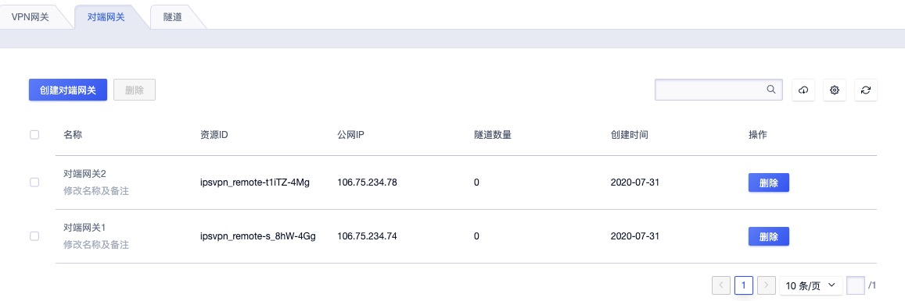

3. 使用 VPN 网关-VPC1 和 对端网关 1 结合前提条件中的网段信息及参数配置创建 VPN 隧道 1 ，如下图所示：

   

4. 使用 VPN 网关-VPC2 和 对端网关 2 结合前提条件中的网段信息及参数配置创建 VPN 隧道 2 ，需确保网段信息与 隧道1 匹配，同时保证 IKE 策略、IPSec 策略与隧道 1 保持一致才可正常建立连接，如下图所示：

   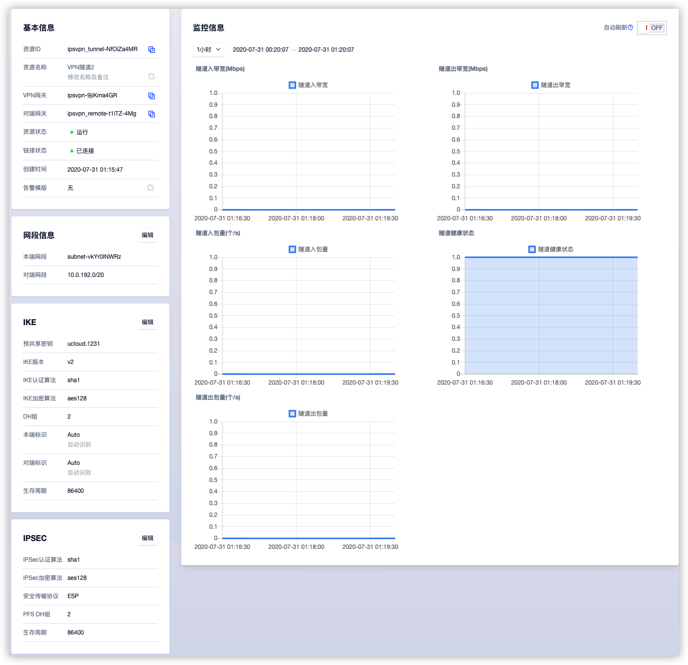

   如图所示，隧道 2 的对端网段为 隧道的本端网段，IKE 及 IPSec 策略配置均和 隧道 1 一致，均使用 IKEv2 版本，IKE 策略均为：认证 SHA1、加密 AES128、DH 组 2 ，IPSec 策略均为：认证 SHA1、加密 AES128、PFSDH 2。

5. 查看两个隧道的连接状态，等待隧道连接成功后，即可进行连通性验证，如下图所示两个隧道均已连接，且已向所选择了子网的虚拟机中下发路由，如下图所示：

   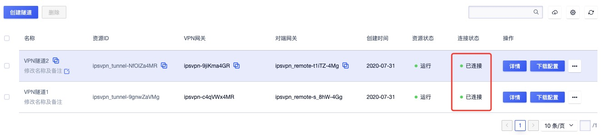

#### 13.6.4.3 配置连接验证

在已连接状态时，平台会分别对两个隧道所关联的本端子网虚拟机中下发对端网段为目标地址的路由，可登入个 VPC 的客户虚拟机中查看相关网络及路由配置信息：


* VPC1 的客户虚拟机 IP 地址为 `10.0.192.32` ，下发的目标路由为 `192.168.0.0/16` 

* VPC2 的客户虚拟机 IP 地址为 `192.168.0.16` ，下发的目标路由为 `10.0.192.0/20` 

如上图所示通过 Ping 命令检测到不同 VPC 虚拟机可相互通信，代表 VPC1 和 VPC2 在 VPN 网关中指定的子网已通过 IPSecVPN 打通网络。

## 13.7 常见问题

1. **是否可以通过 VPN 网关绑定的外网 IP 访问互联网或外网 IP 通向的其它外网？**

   不可以，通过 VPN 网关建立的 VPN 隧道，仅可透传隧道内指定的本端网段和对端网段的流量，不提供互联网访问能力。

2. **远端数据中心通过平台的 IPSecVPN 服务打通 VPC 网络的前提条件是什么？**

   远端数据中心或平台必须具有固定公网 IP 或 通过 NAT 提供公网 IP 的 网关设备，且网关设备必须支持 IKEv1 或 IKEv2 协议的 IPSecVPN，在建立 VPN 隧道时两端需要互通的网段不可重复且不可重叠。

3. **每个 VPN 网关可以建立多少个 VPN 隧道连接？**

   每个 VPN 网关最多可支持 20 个 VPN 隧道连接。

4. **每个 VPN 隧道支持多少个本端网段和对端网段？**

   每个 VPN 隧道支持配置 20 个本端网段和 20 个对端网段。

5. **可以在一个 VPC 内创建两个 VPN 网关用于构建不同流量透传的隧道吗？**

   可以，平台支持在一个 VPC 内创建多个 VPN 网关，但相同 VPC 网关上建立隧道的本端网段和对端网端匹配规则不可相同，否则可能导致影响路由下发及网络通信。

6. **VPN 隧道连接状态为“阶段 1 失败” ，应该如何处理？**

   阶段 1 失败，通常是因为两端 VPN 隧道在建立连接协商 IKE SA 时的配置参数不一致导致，可能原因及解决方案如下：

   （1）预共享密钥不一致：两端设置一致的共享密钥。

   （2）IKE 版本不一致及协商模式不一致：两端设置一致的 IKE 版本，若 IKE 版本为 V1 ，则需保证两端配置的协商模式一致。

   （3）本端标识和对端标识不一致：两端设置一致的本端标识和对端标识，并且保证两端的本端标识和对端标识位置对调，如左侧的本端标识和对端标识分别为 192.168.1.1 & 172.16.1.1 ，则右侧的本端标识和对端标识分别为 172.16.1.1 & 192.168.1.1 。

   （4）加密/认证算法/DH 组不一致：两端设置一致的加密算法、认证算法及一致的 DH 组。

   （5）对端网关未响应：确认与对端网关的网络是否异常，若对端网关的公网 IP 为 NAT 地址，需确保对端网关的公网 IP 地址为固定 IP 地址。若对端网关公网 IP 地址为非固定 IP 地址，则建立隧道时需要使用 IP 地址为 0.0.0.0 的对端网关。

7. **VPN 隧道连接状态为“阶段 2 失败” ，应该如何处理？**

   阶段 1 失败，通常是因为两端 VPN 隧道在建立连接协商 IPSec SA 时的配置参数不一致导致，可能原因及解决方案如下：

   （1）本端网段和对端网段不一致：两端调置一致的本端网段和对端网段，并且保证两端的本端网段和对端网段位置对调，如左侧的本端网段和对端网段分别为 192.168.1.0/24 & 172.16.0.0/16，则右侧的本端网段和对端网段分别为 172.16.0.0/16 & 192.168.1.0/24 。（ StrongSwan 报错 received INVALID_ID_INFORMATION error notify）

   （2）IPSec 参数的安全传输协议不一致：两端设置一致的安全传输协议，如 ESP 或 AH 。

   （3）IPSec 参数的加密/认证算法及 HD 组不一致：两端设置一致的 IPSec 加密算法、认证算法及 DH 组。

8. **VPN 隧道连接状态一直为“连接中” ，应该如何处理？**

   连接中代表 VPN 隧道正在初始化并准备连接对端网关和隧道，若一直卡在连接中，可能需要检测两端网关的网络通信，并确保两端网络已放通 UDP 4500 、UDP 500 、UDP 50  及 UDP51 等端口。

   若有一端环境存在 NAT 透传，通常需要 NAT 端主动发起请求，才可正常建立连接。

9. **两端 VPN 隧道连接状态为“已连接” ，VPC 内的虚拟机无法与对端网段内的主机进行通信，如何处理？**

   平台侧会自动下发路由至 VPC 内的虚拟机，需检查 VPC 虚拟机路由配置，若本端虚拟机路由正常，需要检测是否为对端网关下的内网主机下发路由。
