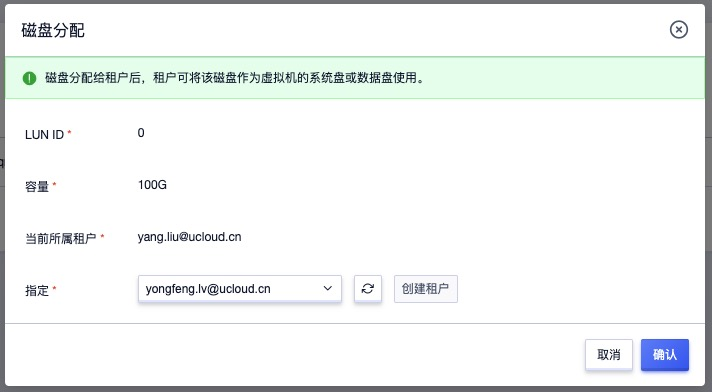
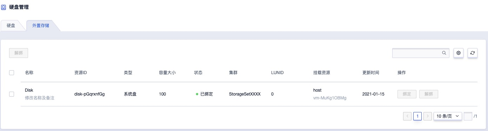

# 7 外置存储

## 7.1 产品简述

### 7.1.1 概述

云平台默认提供分布式存储作为虚拟化的后端存储，为云平台用户提供高可用、高性能、高可靠及高安全的存储服务。同时云平台虚拟化支持对接商业存储设备，如 IPSAN 等存储阵列，为云平台虚拟机提供集群中高性能块存储服务，同时可利旧企业用户的集中存储设备，整体节省信息化转型的总拥有成本。

外置存储服务是云平台为企业用户提供的商业存储服务，通过 ISCSI 协议对接商业存储，将商业存储作为虚拟化后端存储池，提供存储池管理及逻辑卷分配，可直接作为虚拟机的系统盘及数据盘进行使用，即只要支持 ISCSI 协议的存储设备均可作为平台虚拟化的后端存储，适应多种应用场景。

平台支持存储设备的对接和管理，并支持将存储设备中的 LUN 分配给租户，由租户将 LUN 分配或挂载至虚拟机的系统盘或数据盘，进行数据的读写，具体功能特性如下：

* 支持存储设备资源池的录入管理，并支持一键扫描 ISCSI 设备中已创建的 LUN 存储卷信息。
* 支持将已扫描的 LUN 存储卷分配给平台租户，使租户有权限使用磁盘作为虚拟机的系统盘或数据盘。
* 支持租户将有权限的 LUN 存储卷信息作为虚拟机的系统盘，使虚拟机直接运行直商业存储中，提升性能。
* 支持租户将有权限的 LUN 存储卷信息作为虚拟机的数据盘。
* 支持将存储卷重新分配给平台其它租户。

基于以上功能特性，平台可支持直接使用商业存储设备作为虚拟化的后端存储，为虚拟机提供传统商业存储设备的存储空间，同时不影响商业存储中的其它 LUN 为其它业务提供存储服务。

平台基于 ISCSI 协议对接商业存储，在对接中需要将存储设备的 LUN 映射到平台计算节点，使平台计算节点上运行的虚拟机可直接使用映射的 LUN ；同时为保证虚拟机的高可用，需要将 LUN 同时映射到一个集群内的所有计算节点，即所有计算节点均可挂载并使用映射的存储卷，以保证宕机迁移时可在每个计算节点挂载该存储卷信息。

* 当虚拟机所在的计算节点故障时，平台会自动触发虚拟机宕机迁移，即将虚拟机迁移至计算集群内正常的计算节点上，使虚拟机可正常提供服务。
* 虚拟机使用的 LUN 存储卷已被映射到集群内所有计算节点，当虚拟机在集群内迁移至新节点后，可直接使用已映射的 LUN 存储启动虚拟机的系统盘或数据盘，并正常挂载至虚拟机，保证虚拟机迁移后业务正常。

平台仅将商业存储的 LUN 作为存储卷进行使用，不对存储卷本身进行管理，如 LUN 的创建、映射、扩容、快照、备份、回滚、克隆等。

### 7.1.2 使用流程

在使用外置存储前，需要平台管理者或存储设备管理者，将外置存储与平台的计算节点网络打通，使计算节点可与存储设备间直接内网可互相通信。

物理存储设备及网络准备好后，即可与平台进行对接并使用平台提供的外置存储服务，整个对接过程需要存储设备管理员、平台管理员及平台租户三个角色进行操作，其中与平台相关的为平台管理员和平台租户的操作，如下图流程所示：

1. **存储设备管理员管理存储卷**

   所有存储卷的管理均由存储设备管理员自行在商业存储的管理系统上进行操作，包括存储卷（Lun）的创建和映射，同时包括存储卷的扩容、快照、备份及删除等相关生命周期管理。

2. **存储设备管理员映射存储卷至集群计算节点**

   创建好的 Lun ，由存储设备管理员在存储设备上映射到所有计算节点（如果新增计算节点，需再次进行映射），同时也可进行多路径映射。

3. **平台管理员录入并管理存储设备**

   存储卷 LUN 映射成功后，由【平台管理员】在管理控制台“外置存储集群”中进行 ISCSI 存储池或存储设备的录入，录入时需要指定存储设备的 ISCSI 地址，如 172.18.12.8:8080 。

4. **平台管理员扫描已映射的 LUN 信息**

   录入的存储设备后，由【平台管理员】在存储设备中一键扫描 ISCSI 存储设备中已被映射至集群节点上的存储卷设备及信息。

5. **平台管理员为租户分配 LUN 设备**

   由【平台管理员】将扫描成功的 LUN 存储卷设备指定给租户，一个存储卷同一时间仅支持分配给一个租户，分配后租户在外置存储设备中即可查询已分配的存储卷设备，并可进行创建虚拟机或挂载虚拟机。

6. **平台租户使用 LUN 存储卷设备**

   平台租户通过控制台外置存储可直接查询已分配的存储卷，并在创建虚拟机时指定系统盘类型为外置存储，或者也可直接将 LUN 存储卷直接挂载给已有虚拟机，作为虚拟机的数据盘进行使用。

平台租户使用外置存储服务的前提是存储卷已映射并分配给租户，租户只需要简单的绑定即可便捷的使用平台提供的外置存储设备，并可进行弹性绑定和解绑。

## 7.2 查看外置存储设备

在平台已提供外置存储服务并已分配存储卷 LUN 设备给租户时，租户的主账号和子账号可在平台上直接查询有权限的存储卷设备，并可将存储卷设备挂载至虚拟机进行数据存储。管理员分配存储卷如下图所示：

用户可登录控制台，通过控制台导航栏【硬盘】进入【外置存储】资源控制台，通过外置存储列表查看已有权限的 LUN 存储卷信息，包括名称、资源 ID、类型、容量大小、状态、集群、LUNID、挂载资源及操作项，如图所示：

* 名称/资源ID：当前存储卷的名称及全局唯一标识符。
* 类型：存储卷的类型，包括系统盘和数据盘，当创建虚拟机选择外置存储卷作为系统盘时类型为系统盘；当存储卷绑定给虚拟机时类型为数据盘。
* 容量大小：存储卷的容量大小，由存储设备管理员创建时指定的大小。
* 状态：存储卷的状态，包括未绑定、已绑定。
* 集群：存储卷的所属存储池集群。
* LUNID：当前存储卷在商业存储中的 LUNID 。
* 挂载资源：当前存储卷已挂载的虚拟机名称和 ID 。

列表上的操作项是指对存储卷的绑定和解绑操作，支持批量解绑操作，同时列表上支持对存储卷设备进行搜索，支持模糊搜索。

## 7.3 外置存储作为系统盘

平台支持将一块 LUN 存储卷设备作为虚拟机的系统盘，当租户被分配外置存储卷时，会自动在外置存储卷列表中获取到有权限的 LUN 设备，同时创建虚拟机时系统盘类型可选择有权限的存储卷的存储池集群。

用户只需要创建虚拟机时选择系统盘类型为平台管理员录入的【存储池名称】，并选择存储池中有权限的存储卷设备作为虚拟机的系统盘，即可将一台虚拟机的系统盘直接运行在外置存储卷设备上。

如上图所示，选择 EMCPowerStore 商业存储中的一个外置存储卷作为系统盘，即可将外置存储卷作为虚拟机的系统盘。作为虚拟机的系统盘后，可通过虚拟机详情【外置存储】中查看已使用的外置存储卷信息。

> 作为虚拟机系统盘的外置存储 LUN 设备与虚拟机的生命周期一致，不支持解绑操作。

## 7.4 外置存储作为数据盘

平台支持将一块 LUN 存储卷设备作为虚拟机的数据盘，当租户被分配外置存储卷时，会自动在外置存储卷列表中获取到有权限的 LUN 设备，LUN 存储卷作为数据盘的使用方式与平台默认的云硬盘一致，只需要简单的绑定操作即可。

用户只需要在外置存储设备列表上将 LUN 设备直接绑定至虚拟机，即可将一块 LUN 存储卷作为虚拟机的数据盘进行使用，仅支持绑定状态为【未绑定】状态的存储卷设备，同时平台支持用户随时将存储卷从虚拟机上解绑。

## 7.5 解绑外置存储

平台支持将已挂载至虚拟机 LUN 存储卷进行解绑，重新绑定至其它虚拟机。仅支持解绑状态为【已绑定】状态的存储卷，解绑操作不影响虚拟机系统盘的正常访问，同时不影响存储卷设备中的数据。

