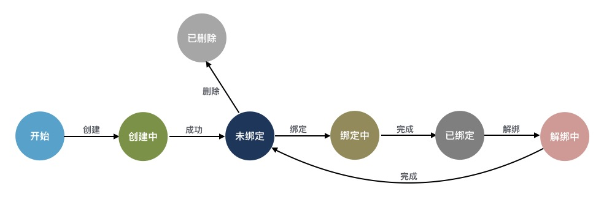
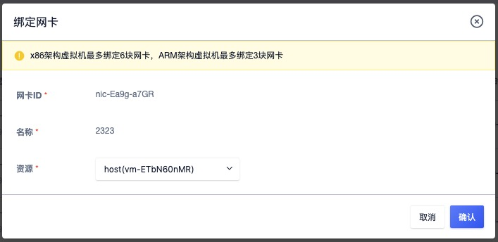
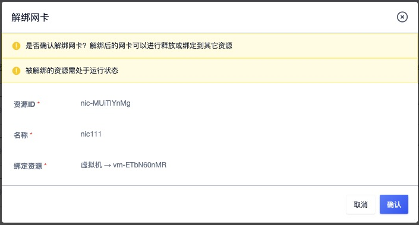
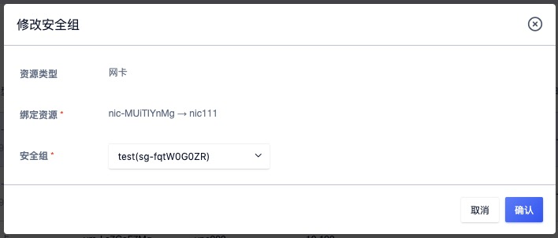
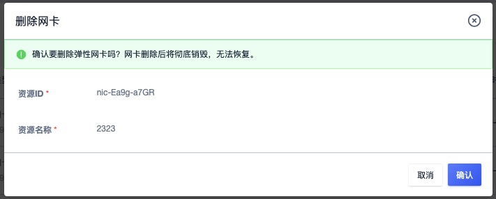

# 5 弹性网卡

弹性网卡（ Elastic Network Interface, ENI ）是一种可随时附加到虚拟机的弹性网络接口，支持绑定和解绑，可在多个虚拟机间灵活迁移，为虚拟机提供高可用集群搭建能力，同时可实现精细化网络管理及廉价故障转移方案。

弹性网卡与虚拟机自带的默认网卡（一个内网网卡和一个外网网卡）均是为虚拟机提供网络传输的虚拟网络设备，同时会从所属 VPC/子网中为网卡分配 IP 地址、网关、子网掩码等网络信息。

* 默认内网网卡所属的网络即创建虚拟机时指定的 VPC 和子网；
* 每块弹性网卡在创建时均可指定所属 VPC 和子网，即可为每块弹性网卡自定义所属网络及 IP 地址。

> 为虚拟机绑定一块不同 VPC 的弹性网卡，虚拟机即可与不同 VPC 网络的虚拟机进行通信。

弹性网卡具有独立的生命周期，支持绑定和解绑管理，可在多个虚拟机间自由迁移；虚拟机被销毁时，弹性网卡将自动解绑，可绑定至另一台虚拟机使用。

弹性网卡具有地域（数据中心）属性，仅支持绑定相同数据中心的虚拟机。**一块弹性网卡仅支持绑定至一个虚拟机，一个虚拟机最多可绑定 6 块弹性网卡。**用户可通过平台自定义创建网卡，并对网卡进行绑定、解绑及修改安全组等相关操作。

## 5.1 创建弹性网卡

云平台用户可通过指定网卡名称、所属 VPC、子网创建一个弹性网卡，用于扩展虚拟机的网络接口。创建弹性网卡前需保证账户至少拥有一个 VPC 网络和子网。

用户导航栏进入虚拟机控制台，切换至网卡管理页面，点击“**创建网卡**”按钮进入弹性网卡创建向导弹窗，如下图：

* 名称：当前需要创建弹性网卡的名称及标识；

* 所属 VPC：弹性网卡需要加入的 VPC 网络，创建时必须指定；
* 所属子网：弹性网卡需要加入 VPC 的 IP 地址段，需选择可用 IP 数量充足的子网；
* IP 地址：当前网卡的 IP 地址，默认会从子网的 IP 地址段中自动分配 IP 地址，如需自定义 IP 地址，可在 IP 地址栏中输入指定的 IP 地址。
* 安全组：当前网卡需要绑定的安全组，用于管控进出弹性网卡的网络流量；支持暂不绑定操作，即当前网卡暂不绑定安全组。

> 弹性网卡绑定的安全组与虚拟机绑定的内网安全组互不影响，弹性网卡的绑定的安全组仅对关联的弹性网卡流量进行安全管控。

弹性网卡创建时状态为“创建中”，待状态转换为“未绑定” 时，即代表网卡创建成功，可进行绑定虚拟机操作，同时可修改弹性网卡的安全组。

## 5.2 查看网卡

通过导航栏进入虚拟机控制台，切换至网卡管理页面可查看弹性网卡资源的列表及相关信息，包括网卡的名称、资源 ID、绑定资源、所属 VPC、所属子网、安全组、状态、创建时间及操作项，如下图所示：

* 名称/ID：弹性网卡的名称及全局唯一标识符；
* 网卡类型：弹性网卡的类型，目前仅支持内网网卡类型，同时会显示网卡所分配或指定的 IP 地址；
* 绑定资源：弹性网卡已绑定的虚拟机资源名称和 ID ，若未指定则为空；
* VPC/子网：弹性网卡创建时指定的所属 VPC  及子网，网卡从所属 VPC 子网中分配 IP 地址及网络配置；
* 安全组：弹性网卡绑定的安全组名称或 ID，若未指定则为空，可通过修改安全组绑定安全组；
* 创建时间：当前弹性网卡的创建时间；
* 状态：弹性网卡的当前状态，包括创建中、未绑定、绑定中、已绑定、解绑中、已删除等状态，状态流转如下图所示：

列表上的操作项是指对单块弹性网卡的操作，包括绑定、解绑、修改安全组及删除等，可通过搜索框对弹性网卡列表进行搜索和筛选，支持模糊搜索。

为方便租户对弹性网卡资源的统计及维护，平台支持下载当前用户所拥有的所有弹性网卡资源列表信息为 Excel  表格；同时支持对弹性网卡进行批量解绑和批量删除操作。

## 5.3 绑定网卡

绑定网卡是指将一块弹性网卡绑定至一台虚拟机，用于扩展虚拟机的网络接口。

* 一块弹性网卡仅支持绑定至一个虚拟机，仅支持绑定相同数据中心且处于关机或运行状态的虚拟机；
* **X86 架构虚拟机最多可绑定 6 块弹性网卡，ARM 架构虚拟机最多支持绑定 3 块弹性网卡；**

可通过弹性网卡资源列表操作项的“**绑定**”按钮，进行虚拟机绑定操作，如下图所示：

绑定时需选择需要绑定网卡的虚拟机，绑定过程中弹性网卡的状态为“绑定中”，待状态变更为“**已绑定**”即代表绑定成功，用户也可通过虚拟机的网络信息查看已绑定的网卡资源及信息。

## 5.4 解绑网卡

解绑网卡是指将弹性网卡从虚拟机上分离出来，并可重新绑定至其它虚拟机，仅支持解绑已绑定状态的弹性网卡资源。用户可通过弹性网卡列表或已绑定虚拟机详情网络页面进行弹性网卡的解绑操作，如下图所示：

解绑时，虚拟机的状态必须处于关机或运行状态。解绑操作执行过程中，弹性网卡的状态会转换为“解绑中”，待网卡状态转换为“未绑定”，即代表解绑成功。解绑后弹性网卡的 IP 地址及安全组信息保持不变，可将网卡绑定至其它虚拟机。

## 5.5 修改安全组

支持在弹性网卡的视角修改弹性网卡的安全组，同时支持配置 “暂不绑定”用于解绑安全组。

安全组作用的最小单位是网卡，若弹性网卡被绑定至虚拟机，弹性网卡的安全组策略仅对当前网卡的流量出入进行限制，不影响虚拟机默认网卡及其它弹性网卡的流量出入。用户可通过弹性网卡管理控制台列表上的“修改安全组”进行修改，如下图所示：

一块网卡仅支持绑定一个安全组，修改成功后用户可通过弹性网卡列表信息查看已修改的安全组信息。

> 仅当弹性网卡已绑定安全组时，才可通过“暂不绑定“解绑已绑定的安全组。

## 5.6 删除网卡

支持用户删除未绑定状态的弹性网卡资源，即仅支持删除 ”未绑定“状态的弹性网卡。删除弹性网卡后，会自动解绑与之关联的安全组。用户可通过弹性网卡列表进行弹性网卡的删除操作，支持批量删除。

## 5.7 修改名称和备注

修改弹性网卡的名称和备注，在任何状态下均可进行操作。可通过弹性网卡列表页面每个弹性网卡名称右侧的“编辑”按钮进行修改。

