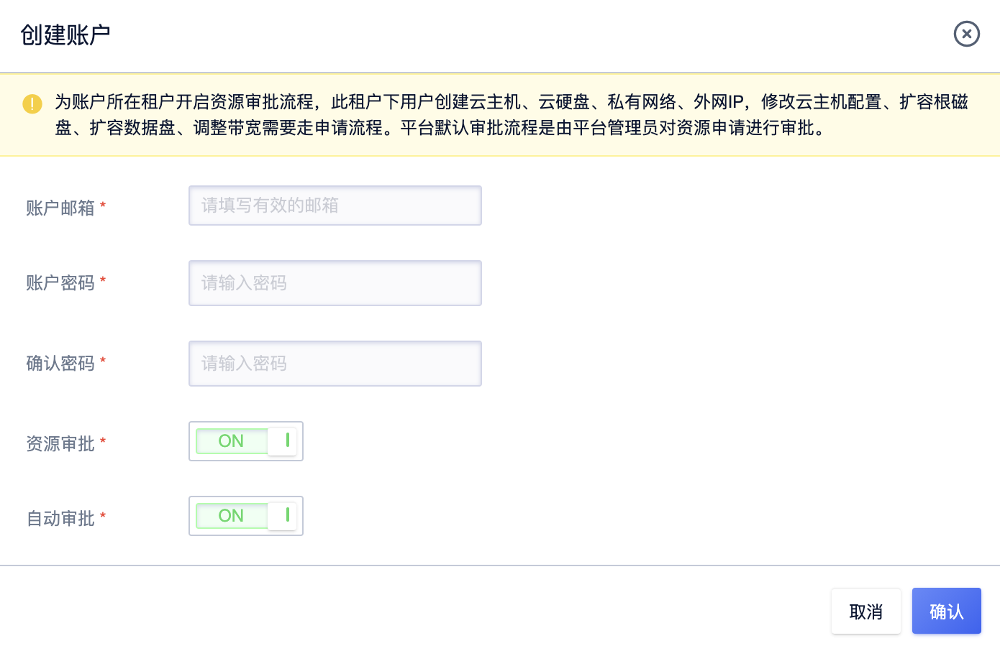
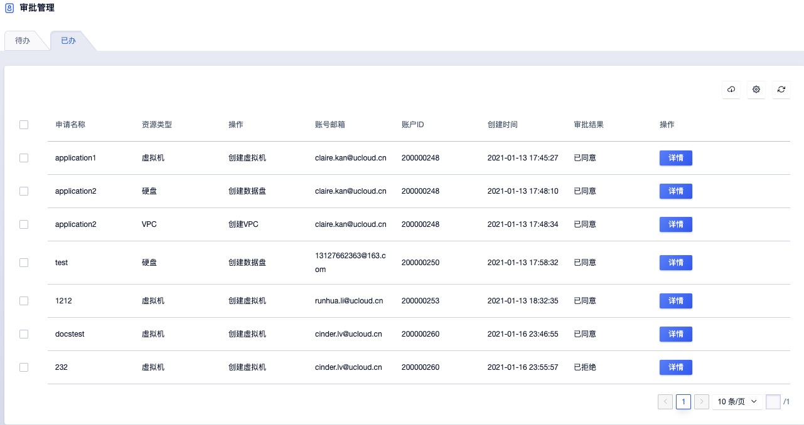
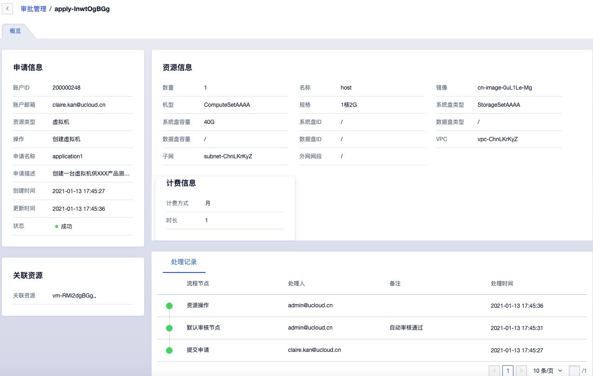
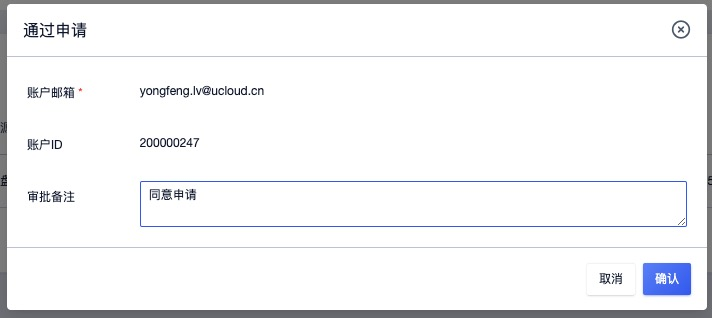
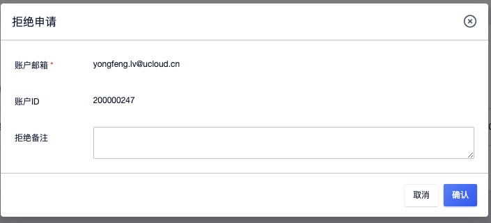

# 8 审批管理

## 8.1 概述

### 8.1.1 产品简介

随着信息化数字转型在政企、教育、金融、制造等行业的实践和应用，企业对资源管理的标准化、流程化管理需求日益旺盛，对于云化资源同样需要设置标准的审批流程，满足平台资源的申请、审批的业务使用流程的需求。

针对企业云化资源的管理，云平台为为企业管理者提供的自助模式的资源审批服务，用于制定信息系统云化资源的标准使用流程，在租户或子账号需要使用或管理资源时，按照流程中定义的审批人和审批层级完成审批后，由平台自动化交付用户需要业务资源。

平台审批流程由平台管理员进行定义和发布，并由平台管理者设置是否为一个租户设置开通审批流程，支持手动审批和自动审批。

* 手动审批：租户下主账号和子账号进行虚拟资源操作时需要走申请、审批流程，待审批通过后，平台会自动为用户创建或操作所需资源，并生一条审批记录用于追溯。
* 自动审批：租户下主账和子账号进行虚拟资源操作无需人工介入，系统将自动审批通过，并自动生成一条审批记录用于保留相关申请记录和审批记录。

开通资源审批的前提是设置审批流程，用于定义租户申请资源时，需要多少层级的审批，每一层级由谁进行审批，所有层级均通过后才可进行资源的创建和变更操作。为满足企业多种场景的审批业务，平台内置默认审批流程。

默认审批流程提供简单的审批逻辑，仅支持 1 级审批，当平台管理者为租户开启资源审批流程后，租户及子账号下资源的创建及变更申请统一由【平台管理员】进行审批，即平台管理员审批通过后，平台将自动执行资源的变更操作。

审批流程支持多种资源的变更操作，包括虚拟机、云硬盘、VPC 网络、外网 IP 及负载均衡 ，支持的变更如下：

* 虚拟机：创建虚拟机、修改配置、扩容系统盘、扩容数据盘；
* 云硬盘：创建云硬盘、扩容磁盘；
* VPC 网络：创建 VPC ；
* 外网 IP：创建外网 IP、调整带宽；
* 负载均衡：创建负载均衡。

### 8.1.2 审批使用流程

**（1）管理员为租户开启审批流程**

管理员通过租户列表为租户开启审批流程，同时可开自动审批。开启后租户在创建虚拟机时即需要发起审批流程，待管理员进行审批后，平台会自动发起虚拟机的创建操作。

**（2）租户申请变更资源**

由租户在租户控制台发起资源变更操作（本文以申请虚拟机为示例）：

1. 进入虚拟机控制台，通过【创建虚拟机】进入虚拟机创建引导页面；

2. 填写申请名称和申请备注，按照虚拟机的创建要求输入其它必填信息，点击【立即购买】提交申请。

3. 提交申请后，页面会自动跳转至【申请管理】页面，并在申请列表中自动新增一条待审批的申请记录。

**（3）管理员审批**

由平台管理员 admin 账号通过【审批管理】中的待办对租户的申请进行通过或拒绝的审批，完成审批流程。

* 若平台管理员通过申请，则租户的申请状态变更为【已申请】，并会自动执行虚拟机的创建操作，可通过虚拟机列表查看正在创建的虚拟机资源，待资源创建成功后，申请状态变更为【成功】。
* 若平台管理员拒绝申请，则租户的申请状态变更为【已拒绝】，申请的资源变更将不被执行，可联系平台管理员或查看审批备注了解拒绝原因。

审批结束后，管理员可通过审批管理中的已办审批列表查看平台上所有的审批记录及资源详细信息，方便后续针对平台和业务进行审计。

## 8.2 为租户开启审批

平台支持管理员创建租户时为租户开启审批流程，同时支持为已创建的租户开启或关闭审批流程，方便平台的管理和运营。

### 8.2.1 创建租户开启审批

管理员新建租户时，支持为租户开启/关闭审批流程，并支持设置开启/关闭自动审批，如下图所示：

- 资源审批：是否需要为租户开启资源审批，为账户所在租户开启资源审批流程，此租户下用户创建云主机、云硬盘、私有网络、外网IP，修改云主机配置、扩容系统盘、扩容数据盘、调整带宽需要走申请流程。平台默认审批流程是由平台管理员对资源申请进行审批。
- 自动审批：是否需要为租户开启资源的自动审批，开启自动审批后，租户的主/子账号提供资源申请后，将自动进行审批，无需人工干预即可完成资源的审批和创建。

### 8.2.2 已创建租户审批流程

平台支持管理员为已创建的租户开启或关闭审批流程，同时支持开启或关闭自动审批。可通过租户管理页面租户列表的【编辑审批流程】对已创建租户的审批流程进行变更，同时可查看当前租户的审批流程开关状态，如图所示：

## 8.3 审批管理

审批管理为平台管理员提供整个云平台所有的审批流程记录，包括待办和已办两个部分。

* 待办：指租户发起资源变更申请后，需要管理员进行审批的记录。
* 已办：指管理员已经处理过的审批记录，包括通过和拒绝的所有记录。

### 8.3.1 查看审批记录

平台管理可在审批管理列表查看平台所有待办和已办审批记录，已办列表主要展示已由平台管理员审批过的申请记录；代办列表展示尚未被审批的申请记录。

管理员可通过导航栏【审批管理】进入审批管理控制台，通过审批记录的待办和已办列表查看所有的审批记录信息，如下分别为待办和已办的列表：

通过待办和已办列表信息，管理员可分别查看需要处理及已处理的审批记录的列表信息，包括申请名称、资源类型、操作、账号邮箱、账号 ID、创建时间、审批结果及操作项。

- 申请名称：用户提交的申请名称。
- 资源类型：本次申请涉及到的资源类型。
- 操作：本次申请针对资源进行对操作。
- 账号邮箱：申请人的账户邮箱。
- 账户 ID：申请人的账户 ID。
- 创建时间：申请的创建时间。
- 审批结果：已办审批列表可查看审批结果，分为通过和拒绝两种情况。

待办列表的操作项中支持管理员对审批记录进行通过和拒绝操作，同时为方便平台运营支持管理员下载审批管理的待办及已办信息为本地 Excel 文件。

管理员也可通过详情按钮进入审批记录的详请页面，查看本条审批记录对应的申请详情，包括申请的基本信息、资源信息、关联资源以及处理记录，如下图所示：

（1）申请信息：描述本次申请的详细信息，如申请名称、申请资源类型、申请的变更操作及申请的状态及时间。

（2）关联资源：描述本次申请的关联资源信息。**管理员审批通过的申请记录会存在关联资源，被拒绝的申请将不执行资源操作，不会产生关联资源信息。**

（3）资源信息：代表本次申请时提交的资源变更具体配置信息，如申请创建虚拟机时的规格、VPC 网络、镜像等，同时包括资源的申请时的计费信息。

（4）处理记录：当前申请记录的处理记录，并可查看所有处理节点的流程节点、处理人、备注及处理时间。

* 流程节点：指当前申请记录所使用的审批流程的所有节点，如平台默认的审批流程包括提交申请、默认审核节点、资源操作等。
* 处理人：指每一个流程节点的处理人，如提交申请人的邮件地址为 claire.kan@ucloud.cn，默认审核节点的处理人为 admin@ucloud.cn 。
* 备注：指每一流程节点的备注，如平台管理员通过或拒绝申请时给予的说明。
* 处理时间：指每一个流程节点人的处理时间。

### 8.3.2 通过申请

租户发起资源变更申请后，管理员审批管理的待办列表中会生成一条审批记录，支持管理员对租户的申请进行通过操作，即同意用户的资源变更申请。审批通过后将自动为申请租户执行资源操作，下发资源或对资源执行变更。

### 8.3.3 拒绝申请

租户发起资源变更申请后，管理员审批管理的待办列表中会生成一条审批记录，支持管理员对租户的申请进行拒绝操作，即拒绝用户的资源变更申请。审批拒绝后申请将直接结束流程，不再执行资源操作。

