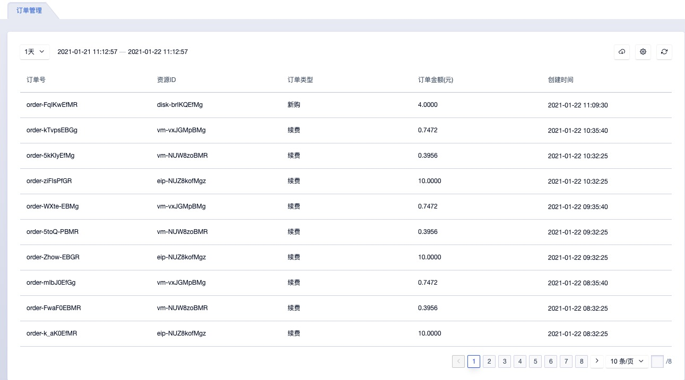
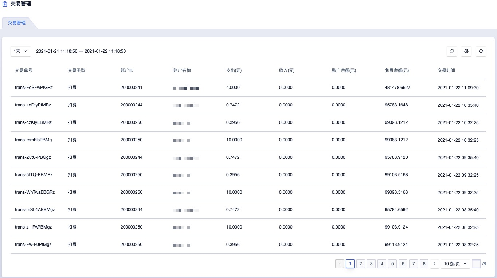
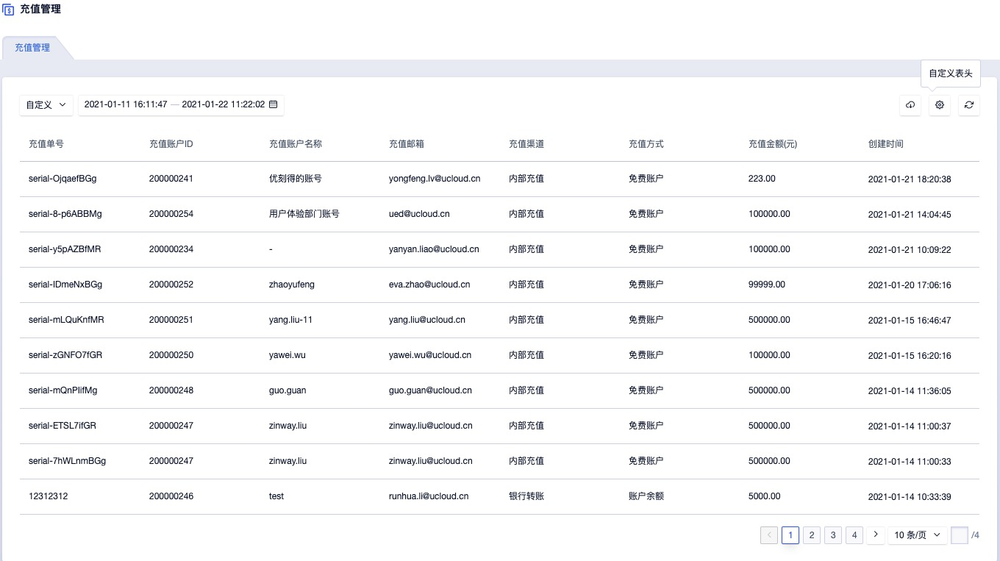
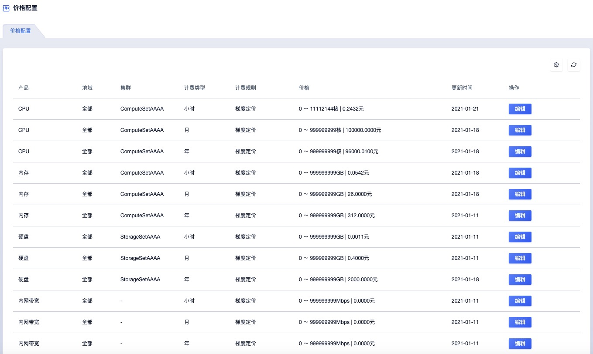
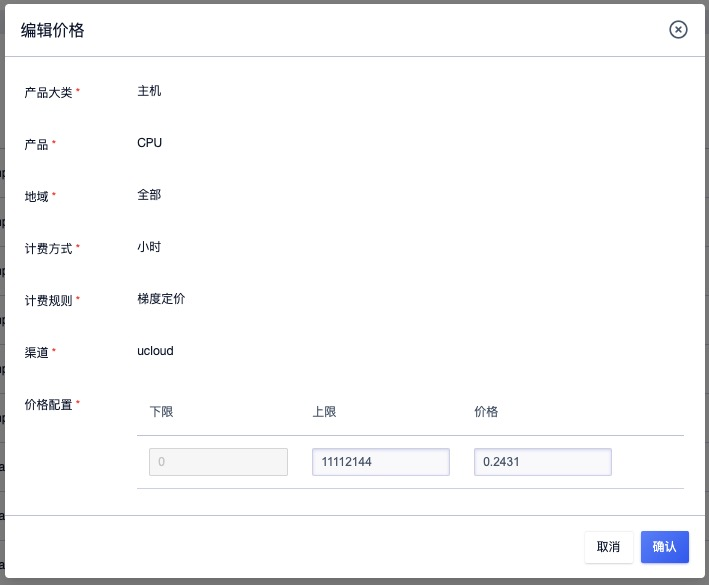
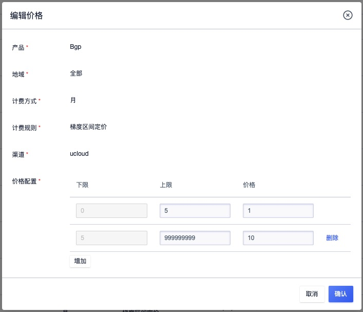

# 9 账务管理

## 9.1 概述

计费管理为用户资源分配和使用提供计量计费服务，需计费的资源均支持按时、按年、按月三种计费方式，支持资源的计费、扣费、续费、过期回收及退费等订单管理操作，同时基于基于账户提供充值、扣费、退费等交易管理。子账号共享主账号的账户余额，通过子账号创建的资源可直接通过共享余额进行扣费，并可通过主账号或子账号查看账户的交易流水及订单明细。

平台资源计费均为预付费模式，即无论按时、按年、按月付费，在资源创建时都需保证账户余额可满足一个计费周期的扣费，下一个计费周期开始前即进行扣费。

- 按时计费：一小时为一个计费周期，资源按照每小时的单价进行预扣费；
- 按月计费：一个月（非自然月）为一个计费周期，资源按照每个月的单价进行预扣费；
- 按年计费：一年（顺延年）为一个计费周期，资源按照每年的单进行预扣费；

> 按年按月购买的资源支持随时升降级配置并在升级配置后自动补齐差价。

账户余额不足下一个计费周期时，资源即会自动进入回收站，需要对资源账号及资源进行续费操作后，才可恢复使用；对于删除不进入回收站的资源，账户余额不足下一个计费周期时，资源会自动进入已过期状态，并在 7 天后自行进行删除。

云平台管理员在全局开启"**资源自动续费**"且**账户余额充足时**，则资源在下一个计费周期会进行自动续费操作；若云平台管理员在全局关闭"**资源自动续费**"且**账户余额充足时**，则资源在下一个计费周期会自动进入回收站，需在回收站对资源进行续费操作，并恢复资源。

资源在创建时，所有计费资源的计费计价均会通过资源计价器按照计费方式进行展示，用于确认订单的费用。每个计费周期内的资源均支持释放和删除，当资源在回收站被成功销毁时，将按照计费周期所剩余额进行退费。当账户余额不足时，可通过云平台管理员进行充值。

平台为管理员提供完整的财务管理能力，包括订单管理、交易管理、充值管理、价格配置四大模块。

- 订单管理：查看平台发生的所有订单记录，或者或者自定义查询时间段对订单记录进行查询。

- 交易管理：查看平台所有交易的扣费记录，或者自定义查询时间段对交易的扣费记录进行查询。

- 充值管理：查看平台所有的充值记录，或者自定义查询时间段对充值记录进行搜索。

- 价格配置：对平台售卖的云服务按照预定义的维度进行定价和定价修改。

## 9.2 订单管理

平台管理员可在订单管理页面，通过自定义查询时间查看云平台在一定时间周期内产生的订单，如下图所示：

- 订单号：订单在云平台的唯一标识符。
- 资源 ID：订单关联资源的资源 ID。
- 订单类型：包括续费和新购两种。
- 订单金额：订单产生的金额。
- 创建时间：订单的发生时间。

支持管理员下载平台所有订单管理记录信息为本地 Excel 文件，为便平台运营管理和报表统计。

## 9.3 交易管理

平台管理员可在交易管理页面，通过自定义查询时间查看云平台在一定时间周期内产生的交易信息，如下图所示：

- 交易单号：交易记录在云平台的唯一标识。
- 交易类型：账户充值和扣费均会生成一次交易记录，因此交易类型包括账户余额充值、免费账户充值及扣费。
- 账户ID：充值的账户 ID。
- 账户名称：充值的账户名称。
- 支出：本次交易支出的费用。
- 收入：本次交易收入的费用。
- 账户余额：本次交易后账户余额。
- 免费余额：本次交易后账户的免费余额。
- 交易时间：本次交易产生的时间。

支持管理员下载平台所有交易记录信息为本地 Excel 文件，为便平台运营管理和报表统计。

## 9.4 充值管理

平台管理员可在充值管理页面，通过自定义查询时间查看云平台在一定时间周期内产生的充值记录信息，如下图所示：

- 充值单号：充值记录在云平台的唯一标识。
- 充值帐户 ID：充值的账号 ID。
- 充值帐户名称：充值帐户名称。
- 充值邮箱：充值的账户邮箱。
- 充值渠道：充值的渠道。
- 充值方式：充值的金额类型，分为账户余额和免费账户余额。
- 充值金额：充值的金额数。
- 创建时间：充值产生的时间。

支持管理员下载平台所有充值记录信息为本地 Excel 文件，为便平台运营管理和报表统计。

## 9.5 价格配置

### 9.5.1 概述

价格配置即平台全局的产品定价，平台支持对 6 个维度的资源项进行定价，包括 CPU、内存、硬盘、外网、GPU。单个云服务的实际出售价格，根据云服务所涉及到的计费资源项进行累加。租户的价格默认继承全全局配置中的价格，可由管理员自定义租户价格的折扣，以适应平台运营的需求。

| 资源项 | 计费类型     | 计费规则                                       |
| ------ | ------------ | ---------------------------------------------- |
| CPU    | 小时、月、年 | 每个集群每 vCPU 价格                           |
| 内存   | 小时、月、年 | 每个集群每 GB 价格                             |
| 硬盘   | 小时、月、年 | 每个集群每 GB 价格                             |
| 外网IP | 小时、月、年 | 每个网段每 Mb 价格，可以定义带宽不同梯度的价格 |
| GPU    | 小时、月     | 每个集群每颗 GPU 价格                          |

平台在初始化时，会对所有计费项进行初始定价，如果需要修改可在管理平台/账务/价格配置中进行调整。如果平台不需要计费，可以将所有计费项的价格设置为 0 。

### 9.5.2 查看全局价格

支持管理员通过价格配置控制台查看当前平台上所有产品（计费资源）的价格信息，包括产品、地域、集群、计费类型、计费规则、价格、更新时间及操作项。

通过操作项，管理员可针对每个产品修改在不同集群的价格，计费资源包括 CPU、内存、硬盘、内网带宽、外网IP 及 GPU，租户创建虚拟资源时，通过计费资源的费用合计按照付费方式进行扣费。

* 针对 CPU、内存、GPU 等计算计费资源在不同的计算集群可定义并展示不同的价格。
* 针对硬盘在不同的存储集群可定义并展示不同的价格和折扣。
* 针对内网带宽可展示并定义全局的价格和折扣。
* 针对不同的外网网段可展示并定义不同的价格和折扣。

管理员可通过租户价格列表查看每种资源在不同集群的基准价格，并支持管理员修改每个计费资源的基准价格。

### 9.5.3 修改全局基准价

管理员可在全局价格配置处对每一个计费资源项的全局基准价格进行配置，价格修改后资源项的价格在全局进行变更；管理员对租户自定义的折扣不变，但最终折扣价会随着租户的折扣率进行变更。

* 全局资源项的小时基准定价被更新后，按小时付费的服务将在下一个计费周期按照新的基准价进行扣费。
* 全局资源项的月、年基准定价被更新后，对于已支付的按月和按年服务无影响，在下一个计费周期将按照新的基准价进行扣费。

管理员可在全局价格配置列表上对计费资源项进行价格更新，支持设置单个资源项针对不同集群的基准价，如下图以修改 CPU 在集群 `ComputeSetAAAA` 的按月付费基准价为例：

管理员可为每个计费资源项修改基准价格，上图以虚拟机 CPU 为例，可设置单核 vCPU 的每小时价格为 0.2431 元，表示单核 vCPU 的小时单价为 0.2431元。同时平台针对外网 IP 的网段，支持按梯度区间定价，如下图所示：

管理员可针对外网网段（如图上 Bgp 网段） IP 带宽进行梯度区间定价，如 `0M~5M` 的全局基准价格为 1 元，5M~99999999M 的全局基准价格为 10 元，提升平台计费的可维护性。

