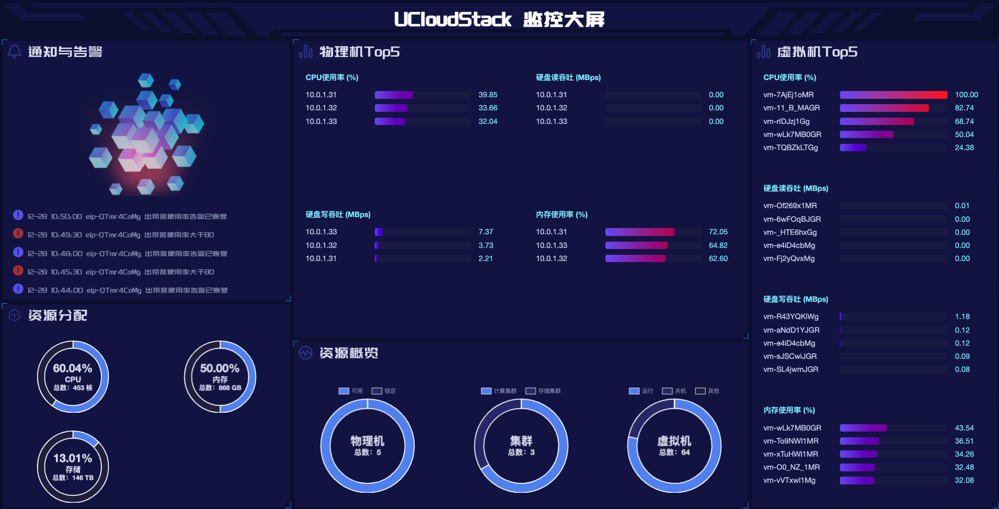

# 12 监控大屏

监控大屏是平台为企业提供的云平台资源可视化大屏，主要展示平台宏观维度的监控数据，帮助企业云平台运营者快速了解平台的整体运行情况，支持自定义拖拽模块及全屏展示，方便管理员进行分屏管理。用户可通过管理员头像左侧的按钮进入监控大屏页面，如下图所示：

通知和告警：展示最近 5 条平台告警信息

物理机 TOP5：展示CPU使用率、硬盘读吞吐、硬盘写吞吐、内存使用率在前 5 名的物理节点 IP 。

虚拟机 TOP5：展示CPU使用率、硬盘读吞吐、硬盘写吞吐、内存使用率在前5名的虚拟机 ID 。

资源分配：展示云平台 CPU、内存、存储的总容量以及已分配容量的百分比。

资源概览：展示物理机总量以及状态分布（可用、锁定）、计算集群和存储集群的数量分布、虚拟机总量以及状态分布（运营、关机、其他）。

