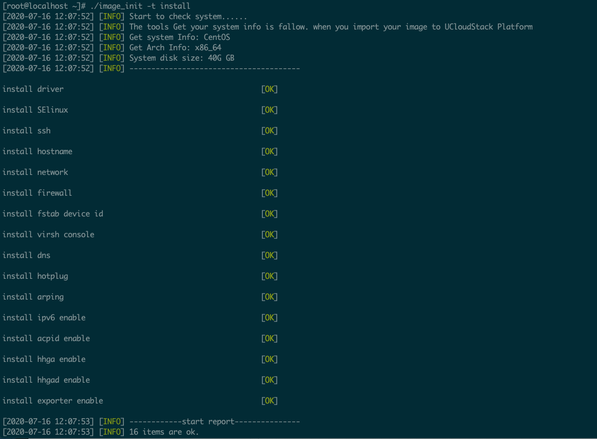
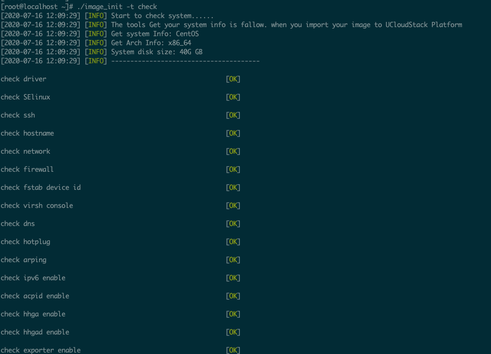
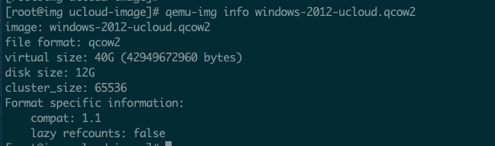
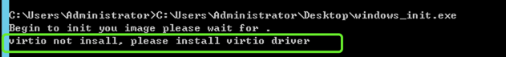
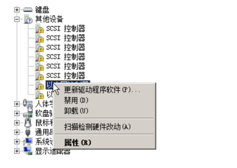

# 1 概述

平台支持用户导入 RAW 格式的自定义镜像，用于业务部署和迁移。在导入镜像前，需要制作自定义镜像，并通过初始化脚本对镜像进行初始化配置，使镜像导入到平台中后可正常运行虚拟机，并可在线对虚拟机进行管理操作，如修改密码及获取监控数据等。平台支持用户导入 Linux 和 Windows 两种类型的自定义镜像：

* Linux 类型：**CentOS 6.5 及以上、Ubuntu 14.04 及以上**
* Windows 类型：**Windows7、Windows2008 及以上**

> 如需导入其它版本及操作系统，请联系平台客户经理或技术支持。

针对 Linux 和 Windows 两种类型的镜像，平台分别提供对应的脚本及制作方式进行镜像的制作及初始化。Linux 镜像制作前需下载【Linux 初始化脚本】 ，Windows 镜像制作前需下载【Windows 初始化脚本】，请到控制台导入镜像处进行脚本下载。

# 2 自定义镜像制作

### 2.1 Linux 镜像制方式

1. 启动第三方平台已安装完成或已有的 Linux 虚拟机；

2. 将下载的 Linux 初始化脚本上传至虚拟任意目录，如 `/root` 目录下；

3. 进入脚本所在目录，输入`./image_init -t install` 执行脚本；

   

4. 执行` ./image_init -t check` 命令检查脚本中每一项任务是否正确安装；

   

5. 如脚本执行报错，请联系技术支持。

### 2.2 Windows 镜像制方式

1. 启动第三方平台已安装完成或已有的 Windows 虚拟机；
2. 将下载的 Windows 初始化脚本上传至虚拟任意目录，如 C 盘根目录下；
3. 进入脚本所在目录，双击 windows_init.exe  运行脚本。

# 3 镜像格式转换

镜像制作完成后，需要将镜像转换为平台可识别的  RAW 格式才可导入并使用。镜像格式转换步骤如下：

1. 镜像制作完成后，关闭执行脚本的虚拟机；

2. 在物理机操作系统上执行 `qemu-img info 镜像名称` 查看虚拟机磁盘信息；

   

   > 不同镜像可能文件格式不同，本指南以 qcow2 格式镜像为例。

3. 执行 `qemu-img convert` 转换磁盘类型类 RAW ，以供平台使用，具体命令如下：    

```bash
命令:
    qemu-img convert -f <qcow2/vmdk/vhd> -O raw <源盘文件> <输出盘文件>
举例:
    qemu-img convert -f qcow2 -O raw windows-2012-ucloud.qcow2 windows-2012-ucloud.raw
```

4. 将转换完成的镜像文件上传并导入到平台，即可使用镜像创建并运行虚拟机。

# 4 FAQ

Windows 安装过程中出现下图提示说明制镜镜像的虚拟机未安装 `virtio` 驱动，安装步骤如下：



> **以下为KVM环境下的解决方案**
* 下载 [virtio 驱动程序](https://fedorapeople.org/groups/virt/virtio-win/direct-downloads/archive-virtio/virtio-win-0.1.149-2/) 中的 `virtio-win-0.1.149.iso` 文件到物理机操作，如 `/root` 目录；

* 在物理机中编辑文件 `virtio_iso.xml` ；

  ```bash
   <disk type='file' device='cdrom'>
       <driver name='qemu' type='raw'/>
       <source file='</root>'/>  // ios 镜像绝对路径,本例以`root`目录为例
       <target dev='hdc' bus='ide'/>
       <readonly/>
   </disk>
  ```

* 将驱动程序 ISO 文件挂载至虚拟机

  ```bash
   virsh attach-device <domain> virtio_iso.xml
  ```

* 创建一个 QCOW 磁盘

  ```bash
   qemu-img create -f qcow2 ./virtio.qcow2 1G
  ```

* 在物理机中编辑文件 `virtio_disk.xml` ；

  ```bash
   <disk type='file' device='disk'>
       <driver name='qemu' type='qcow2'/>
       <source file='<qcow2 file path >'/> // 刚创建的 QCOW 磁盘绝对路径
       <target dev='vdz' bus='virtio'/>
   </disk>
  ```

* 将创建的 QCOW 磁盘挂载至虚拟机   

  ```bash
   virsh attach-device <domain> virtio_disk.xml
  ```

* 在物理机中编辑文件 `virtio_interface.xml` `；

  ```bash
   <interface type='network'>
       <mac address='52:54:00:88:ef:99'/> //mac地址随机取
       <source network='default'/>        //和当前机器网卡类型匹配就行
       <model type='virtio'/> 
   </interface>
  ```

* 添加网卡到虚拟机中；

  ```bash
     virsh attach-device <domain> virtio_interface.xml
  ```

* 在虚拟机操作系统的设备管理器中点击更新带有感叹号的设备驱动程序（以太网控制器 /scsi 控制器为必须更新项)，如下图所示：

  

> **如需从其他平台导入镜像（如vmware等平台），请联系平台客户经理或技术支持。**