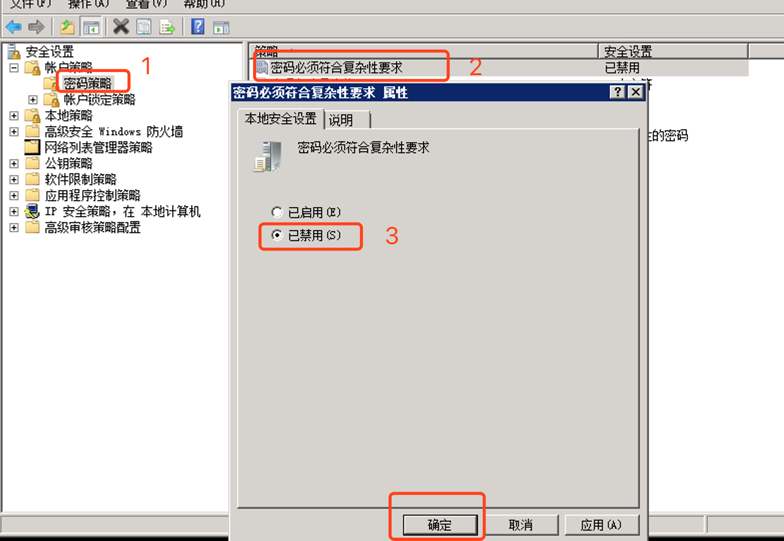
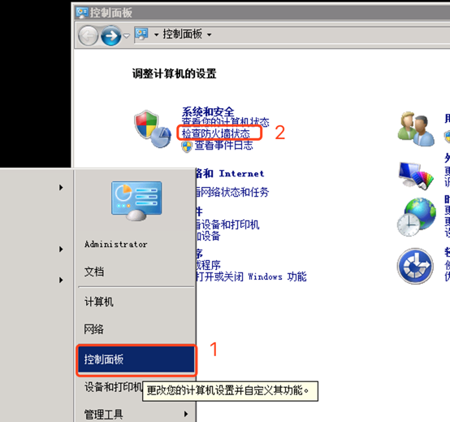
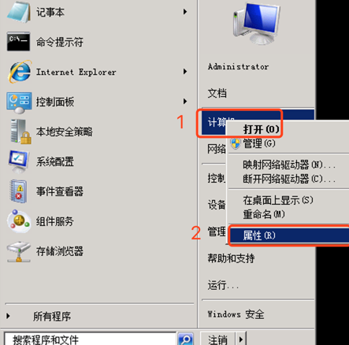

# 操作场景
针对 Linux 和 Windows 两种类型的镜像，平台分别提供对应的工具及制作方式进行镜像的制作及初始化。Linux 镜像制作前需下载 [Linux 初始化工具](http://ucloudstack-image.cn-sh2.ufileos.com/v1.x/linux/image_init) ，Windows 镜像制作前需下载【Windows 初始化工具】。

* 启动第三方已安装或已有的 Linux 或 Windows 虚拟机
* 将下载的初始化工具上传至虚拟机任意目录，如  `/root` 或 `C盘`目录下


## 镜像规范检测

<!-- tabs:start -->
### ** Linux **
* 进入工具所在目录，使用root权限运行工具，进行检测。

```bash
chmod +x image_init
./image_init -t check -c v1 
```

* 等待检测工具的返回信息。

```bash
[2021-09-29 14:29:37] [INFO] Start to check system......
[2021-09-29 14:29:37] [INFO] The tools Get your system info is fallow. when you import your image to UCloudStack Platform
[2021-09-29 14:29:37] [INFO] Get system Info: CentOS
[2021-09-29 14:29:37] [INFO] Get Arch Info: x86_64
[2021-09-29 14:29:37] [INFO] System disk size: 20G GB
[2021-09-29 14:29:37] [INFO] ---------------------------------------

check driver                                               [OK]

check SElinux                                              [OK]

check ssh                                                  [WARNING]

[2021-09-29 14:29:38] [WARN] hostname not equal localhost.

check hostname                                             [WARNING]

check network                                              [OK]

check firewall                                             [OK]

[2021-09-29 14:29:38] [WARN] Failed: not found UUID as device id for the device mounted to (/)root partition. 
    ignore this error if you do not make lvm with boot disk other disk for use.

check fstab device id                                      [WARNING]

check virsh console                                        [WARNING]

check dns                                                  [OK]

check hotplug                                              [FAILED]

check arping                                               [OK]

check ipv6 enable                                          [FAILED]

check acpid enable                                         [OK]

[2021-09-29 14:29:39] [ERROR] Failed: node_exporter not install or enable on your system.

check exporter enable                                      [FAILED]

[2021-09-29 14:29:39] [ERROR] Failed: qemu-ga not install or enable on your system.

check qga enable                                           [FAILED]

[2021-09-29 14:29:39] [INFO] ------------start report---------------
[2021-09-29 14:29:39] [INFO] 7 items are ok.
[2021-09-29 14:29:39] [INFO] 4 items are failed.
[2021-09-29 14:29:39] [INFO] 4 items are warning.
[2021-09-29 14:29:39] [INFO] ------------end report-----------------
[2021-09-29 14:29:39] [INFO] Check details report info from file : /root/image_init_report_2021-09-29_14-29-37.txt

[2021-09-29 14:29:39] [INFO] Please use [ ./image_init install ] to repaire those failed.
```

* 查看检测报告

检测工具的运行结果中，会显示当前的检测信息，也会展示检测报告所在的路径。如本示例中，检测报告所在的路径为 `/root/image_init_report_日期_时间.txt` 。

### ** Windows **
* 使用管理员身份运行工具，进行检测。


 * 依次检测，等待工具的返回信息
 

<!-- tabs:end -->


## 镜像工具安装与检测

<!-- tabs:start -->
### ** Linux **
* 进入工具所在目录，使用root权限运行工具，进行安装。

* 如果需要保持 yum 或 deb 源，请运行
```
    ./image_init -t install -c v1
``` 
* 如果需要重置 yum 或 deb 源，请运行
```
    ./image_init -t install -c v1 -r true
```
* 等待安装工具的返回信息

```bash
[2021-09-29 15:07:52] [INFO] Start to check system......
[2021-09-29 15:07:52] [INFO] The tools Get your system info is fallow. when you import your image to UCloudStack Platform
[2021-09-29 15:07:52] [INFO] Get system Info: CentOS
[2021-09-29 15:07:52] [INFO] Get Arch Info: x86_64
[2021-09-29 15:07:52] [INFO] System disk size: 20G GB
[2021-09-29 15:07:52] [INFO] ---------------------------------------

install driver                                             [OK]

install SElinux                                            [OK]

install ssh                                                [OK]

install hostname                                           [OK]

install network                                            [OK]

install firewall                                           [OK]

install fstab device id                                    [OK]

install virsh console                                      [OK]

install dns                                                [OK]

install hotplug                                            [OK]

install arping                                             [OK]

install ipv6 enable                                        [OK]

install acpid enable                                       [OK]

install exporter enable                                    [OK]

install hhga enable                                        [OK]

install hhgad enable                                       [OK]

reset repo                                                 [OK]

[2021-09-29 15:07:54] [INFO] ------------start report---------------
[2021-09-29 15:07:54] [INFO] 17 items are ok.
[2021-09-29 15:07:54] [INFO] 0 items are failed.
[2021-09-29 15:07:54] [INFO] 0 items are warning.
[2021-09-29 15:07:54] [INFO] ------------end report-----------------
[2021-09-29 15:07:54] [INFO] Check details report info from file : /root/image_init_report_2021-09-29_15-07-52.txt
```

* 查看安装报告

工具安装的运行结果中，会显示当前的安装信息，也会展示安装报告所在的路径。如本示例中，安装报告所在的路径为 `/root/image_init_report_日期_时间.txt` 

* 安装完后再次进行检测
* 进入工具所在目录，使用root权限运行工具，进行检测。

```bash
    ./image_init -t check -c v1 
```

* 等待检测工具的返回信息。

确保检测信息中，无 `error` 出现，表示已安装正常。

>- 如果仍有 `error` 出现，请参照 [检测项和手动安装方式](#check_install_manual) 中的说明进行相对应检查项的安装。

### ** Windows **

* 使用管理员身份运行工具，点击 “repair” 进行安装。
 

* 依次进行安装，等待工具的返回信息
 


> - 如果检测过程中，出现 `virtio` 的检测结果为失败，参照如下步骤进行安装。
* 下载 [Windows virtio 驱动安装工具](http://ucloudstack-image.cn-sh2.ufileos.com/v1.x/windows/windows_virtio.exe) 至虚拟机任意目录，如 `C盘`目录下

* 使用管理员身份运行工具，进行安装。


 
 * 点击 **安装Virtio驱动程序** 进行相应的安装
 
 在安装这个设备软件时，选择始终信任来自"Red Hat, Inc." 的软件，并选择“安装”
 
 * 安装完后，再次运行检测工具，进行检测，直至所有的检查项都为 `success` 为止。

>- 如果仍有 `Failed` 出现，请参照 [检测项和手动安装方式](#check_install_manual) 中的说明进行相对应检查项的安装。
<!-- tabs:end -->


<span id = "check_install_manual"></span>

## 检测项和手动安装方式
<!-- tabs:start -->
### ** Linux **
|检查项           |检查项影响   |检查项目原因  |  达成项目方式 |
|:----------------|:------------|:-------------|:--------------|
|driver  |创建虚拟机无法启动 | UCloudStack 后台使用virtio 驱动存储和网卡, virtio驱动效率会高一些 | 参见[安装Linux virtio驱动](UCloudStack/customimage/linuxvirtio.md) 
|SElinux |创建虚拟机无法正常使用 |selinux是为了最小权限,或影响虚拟机启动功能设置 | 文件: /etc/selinux/config 修改: SELINUX=disabled |
|ssh     |远程ssh连接慢 | 默认 UseDNS/GSSAPIAuthentication 是开启的| 文件: /etc/ssh/sshd_config  关闭: UseDNS no/ GSSAPIAuthentication no|
|console |物理机后台登录有问题|方便后台登录排查原因|参见 [各版本操作系统console开启](#virt_console)|
|firewall|系统无法自动配置一些功能| 默认开启后影响服务访问,平台已在虚拟机网络层面做了防火墙功能|参见 [各个操作系统关系防火墙](#disable_firewall)|
|fstab   |无法正常启动虚拟机| 清理fstab文件，去除文件中不需要的device id，保证使用的device id都在blkid命令的显示结果中| 防止启动时不存在的设备导致系统系统卡主| 对比blkid 和 /etc/fatab 是否匹配,删除多余的配置项|
|DNS     |防止绑定外网后虚拟机无法正常上网| NA | 默认检查 114.114.114.114 如果存在自定义或者其他DNS可以忽略此项自行判断|
|ipv6    |无法正常启动机器 | UCloudStack 虚拟机依赖ipv6管理网来管理和配置虚拟机| 参见[开启管理网络ipv6](#use_ipv6) |
|acpid   |无法执行关机命令| 虚拟机关机依赖 acpid| 参见[安装acpid服务](#install_acpid)|
|arping  | 绑定外网的虚拟机无法访问| 外网绑定成功需要对外发送arp包|参见[arping安装](#install_arping)|
|hotplug | 云硬盘和弹性网卡热插拔后不生效| 系统热插拔设备需要支持 |参见[hotplug配置](#config_hotplug)|
|hhga   |无法正常启动机器| 虚拟机网络配置,改密码等都依赖hhga| 参见[hhga安装](#install_hhga)|
|hhgad   |NA| hhga的守护服务| 参见[hhgad安装](#install_hhgad)|
|exporter   |监控信息无法显示| guest os 监控信息收集| 参见[node exporter安装](#install_node_exporter)|

<span id = "virt_console"></span>

### 各版本操作系统console开启
#### CentOS6.5
    1. 文件  /etc/securetty 添加 ttyS0
        echo "ttyS0" >> /etc/securetty  
    2. 文件 /etc/grub.conf kernel 所在行末加上 console=ttyS0
        kernel /vmlinuz ....省略若干字.... quit console=ttyS0
    3. 文件 /etc/inittab 中添加下面内容
        S0:12345:respawn:/sbin/agetty ttyS0 115200

#### CentOS7
    1.通过命令直接开启
        grubby --update-kernel=ALL --args="console=ttyS0"

#### Ubuntu14
    1. 创建文件 /etc/init/ttyS0.conf 写入下面内容:
        start on stopped rc RUNLEVEL=[2345]  
        stop on runlevel [!2345]  
        respawn  
        exec /sbin/getty -L 115200 ttyS0 vt220 
    2. 修改文件 /etc/default/grub 添加下面内容
        GRUB_CMDLINE_LINUX=" console=tty0 console=ttyS0"
    3. 执行配置生效
        update-grub

<span id = "disable_firewall"></span>

### 各个操作系统关系防火墙
#### CentOS6.5

    //关闭IPv4
    service  iptables stop
    chkconfig iptables off
    //关闭IPv6
    service  ip6tables stop
    chkconfig iptables off
#### CentOS7 以上
    systemctl stop firewalld.service 
    systemctl disable firewalld.service

#### ubuntu 系列
    ufw disable


<span id = "use_ipv6"></span>

### 开启管理网络ipv6
    文件: /etc/sysctl.conf
    添加
    net.ipv6.conf.lo.disable_ipv6=0
    net.ipv6.conf.maneth.disable_ipv6=0

<span id = "install_acpid"></span>

### 安装acpid服务
#### CentOS
    yum install -y acpid 
    
#### ubuntu
    apt-install install -y acpid 


<span id = "install_arping"></span>

### arping 安装
#### CentOS
    yum install -y iputils
    
#### ubuntu
    apt install -y iputils-arping


<span id = "config_hotplug"></span>

### hotplug 配置
    CPU/Memory 自动上线配置:
    /etc/udev/rules.d/40-cpu-mem-hotplug.rules
    # CPU hotAdd request
    SUBSYSTEM=="cpu", ACTION=="add", TEST=="online", ATTR{online}=="0", ATTR{online}="1"
    # Memory hotAdd request
    SUBSYSTEM=="memory", ACTION=="add", ATTR{state}=="offline", ATTR{state}="online"

<span id = "install_hhga"></span>

### hhga安装 （下面安装文件联系服务经理索取）

#### CentOS 6 && Ubuntu 14 (服务配置文件) [CentOS6_hhga](#centos6_hhga) [Ubuntu14_hhga](#ubuntu14_hhga)
    1.拷贝服务二进制文件 hhga 到 /usr/sbin 目录下
    2.将服务配置文件内容拷贝到 /etc/init.d/hhga文件中
    3.添加执行权限
        chmod +x /etc/init.d/hhga
    4.ubuntu 设置开机启动
        update-rc.d hhga defaults
#### CentOS 7 && Ubuntu 16 (服务配置文件) [CentOS7_hhga](#centos7_ubuntu16_hhga) [Ubuntu16_hhga](#centos7_ubuntu16_hhga)
    1. 安装二进制文件hhga到/usr/sbin/目录下面
    2. 安装service文件到/usr/lib/systemd/system/hhga.service文件中
    3. 将hhga server 设置成开启启动方式
        systemctl enable hhga
    
<span id = "install_hhgad"></span>
### hhgad安装
    参考 hhga 安装步骤
    
<span id = "install_node_exporter"></span>
### node exporter安装
    参考 hhga 安装步骤


### ** Windows **

|检查项           |检查项影响   |检查项目原因  |  达成项目方式 |
|:----------------|:------------|:-------------|:--------------|
|PasswordComplexity|创建机器时设置额密码无法使用|N/A| 参见[密码复杂度设置](#set_passwd_complex)|
|Firewall|可能导致机器无法启动|UCloudStack平台已经提供安全组因此可以关闭机器中防火墙|参见[关闭系统防火墙](#win_disable_firewall)|
|Remote Desktop|无法通过远程连接工具连接虚拟机|如果需要远程连接,需要打开远程连接功能|参见[开启远程桌面连接](#enable_remote_desktop)|
|hhga   |无法正常启动机器| 虚拟机网络配置,改密码等都依赖hhga| 参见[hhga安装](#install_hhga)|
|hhgad   |NA| hhga的守护服务| 参见[hhgad安装](#install_hhgad)|
|exporter   |监控信息无法显示| guest os 监控信息收集| 参见[wmi_exporter安装](#install_wmi_exporter)|


<span id = "set_passwd_complex"></span>

### 密码复杂度设置
#### 打开本地安全策略

#### 关闭密码复杂性要求



<span id = "win_disable_firewall"></span>

### 关闭系统防火墙
#### 打开防火墙管理界面

#### 关闭各种类型网络设置防火墙


<span id = "enable_remote_desktop"></span>

### 开启远程桌面连接
#### 打开计算机属性

#### 打开远程桌面选项


<span id = "install_hhga"></span>

### 安装hhga
#### 使用srvany.exe 安装hhga服务
    1. srvany:
        是Microsoft Windows Resource Kits工具集的一个实用的小工具，用于将任何EXE程序作为Windows服务运行。
    2. 将srvany.exe和instsrv.exe拷贝到C:\Windows\System32\后,64位系统需要同时复制到C:\Windows\SysWow64\下
    3. C:\Windows\System32\instsrv.exe hhga C:\Windows\System32\srvany.exe
    4. 安装完毕后，我们需要对srvany.exe进行配置，以便于能够加载我们指定的程序，配置的方法是:
        开始 –> 运行 –> regedit，打开注册表，定位到下面的路径 HKEY_LOCAL_MACHINE\SYSTEM\CurrentControlSet\Services\hhga
    5. 如果该服务名下没有Parameters项目，则对服务名称项目右击新建项，名称为Parameters，然后定位到Parametes    项，新建以下几个字符串值
        名称 Application 值为你要作为服务运行的程序地址。
        名称 AppDirectory 值为你要作为服务运行的程序所在文件夹路径。
        名称 AppParameters 值为你要作为服务运行的程序启动所需要的参数。

<span id = "install_hhgad"></span>

### 安装hhgad
参见[hhga安装](#install_hhga)
    
<span id = "install_wmi_exporter"></span>

### 安装wmi_exporter
参见[hhga安装](#install_hhga)


<!-- tabs:end -->