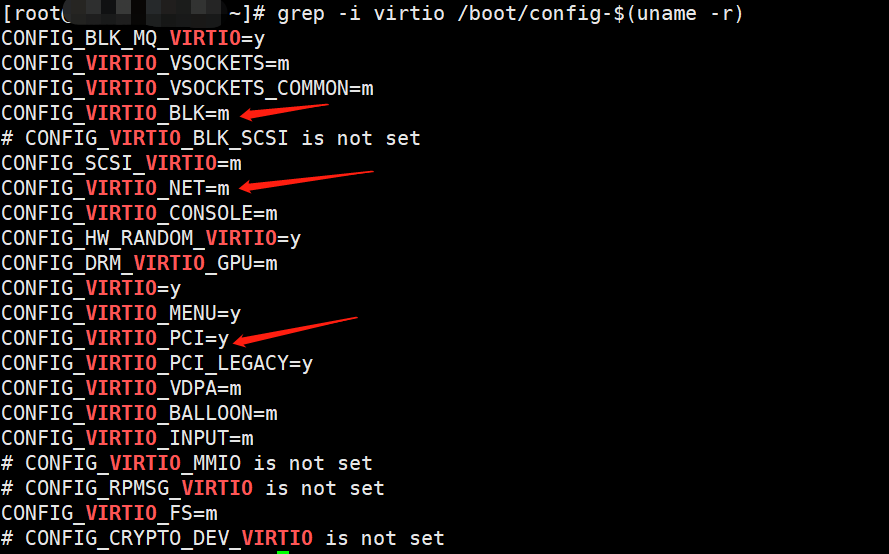
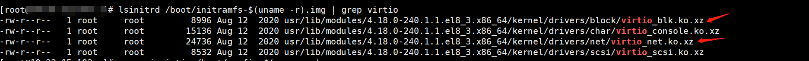
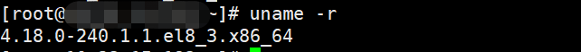
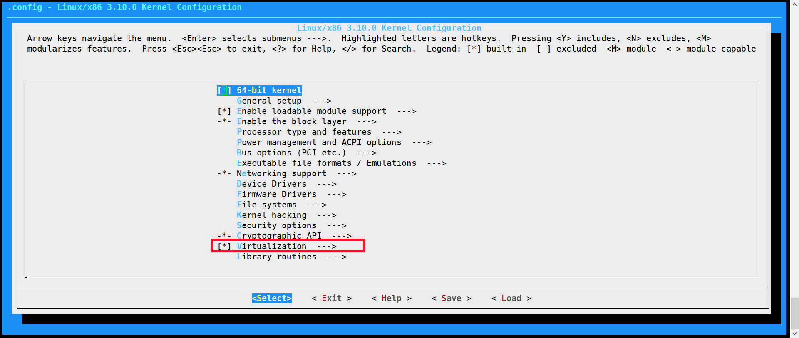
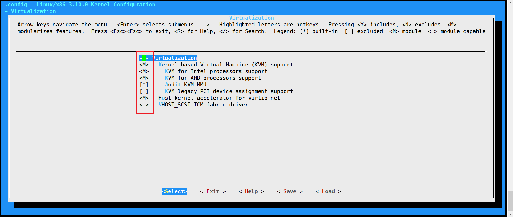
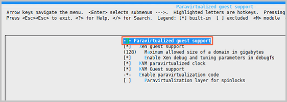
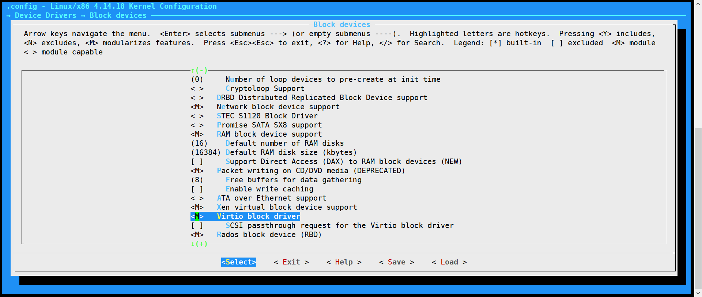
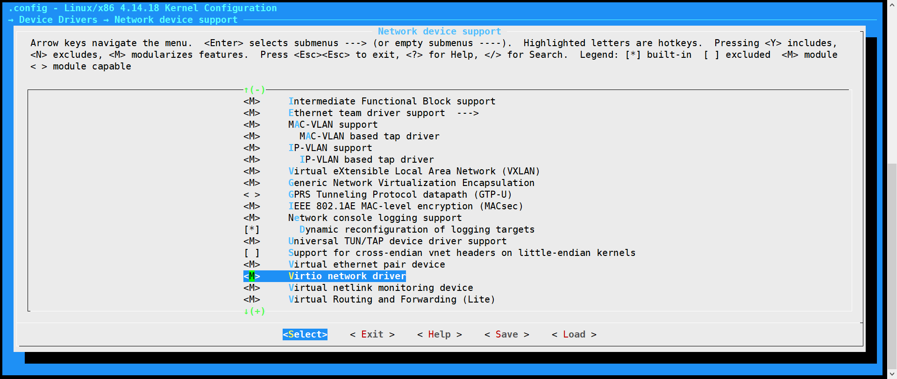

# linux virtio驱动安装

## 操作场景
虚拟机系统内核需要支持 Virtio 驱动才能在平台上正常运行。为避免导入自定义镜像后，创建的虚拟机无法启动，您需要在导入镜像前，检查是否需要在源服务器中检查以及修复镜像中对 Virtio 驱动的支持。

## 操作步骤

<span id = "CheckVirtio"></span>

### 步骤一.检查内核是否安装Virtio驱动

 运行 ` grep -i virtio /boot/config-$(uname -r)` 检查内核是否支持 Virtio 驱动。

返回结果如下类似：

检查结果中的CONFIG_VIRTIO_BLK 、CONFIG_VIRTIO_NET 和 CONFIG_VIRTIO_PCI 参数

|检查结果|说明 |
|:---|:--- |
|参数取值有 m|执行[步骤二](#CheckVirtioForInitramfs) 检查返回为 m 的 返回结果 |
|参数取值都为 y|表示操作系统中已经包含了virtio驱动，请根据 [导入镜像流程](https://docs.ucloud.cn/UCloudStack/customimage/README?id=_3-导入镜像流程)  继续操作 |
|没有这三个参数|表示没有安装virtio相关驱动，不能直接导入云平台。需要编译安装virtio驱动。具体请参见[步骤四](#DownloadKernel) |

<span id = "CheckVirtioForInitramfs"></span>

### 步骤二.检查临时文件系统是否包含Virtio驱动
如果 [步骤一](#CheckVirtio)的执行结果参数取值为 m，则需要进一步检查，确认临时文件系统 initramfs 或者 initrd 是否包含 virtio 驱动。请根据操作系统的不同，执行相应命令：
* CentOS 操作系统：
```
lsinitrd /boot/initramfs-$(uname -r).img | grep virtio

```
* Ubuntu 操作系统：
```
lsinitramfs /boot/initrd.img-$(uname -r) | grep virtio
```
返回类似如下结果：


> - 如上图表明 initramfs已经包含了virtio_blk.ko以及virtio_net.ko，可以根据[导入镜像流程](https://docs.ucloud.cn/UCloudStack/customimage/README?id=_3-导入镜像流程) 继续操作。
> - 如果临时文件系统initramfs没有包含virtio驱动，则需要修复临时文件系统。具体请参见[步骤三](#ReconfigureInitramfs)


<span id = "ReconfigureInitramfs"></span>

### 步骤三.修复临时文件系统
如果 [步骤二](#CheckVirtioForInitramfs) 的执行结果显示临时文件系统 initramfs 或者 initrd 没有包含 virtio 驱动，则需要重新配置临时文件系统，使其包含 virtio 驱动。请根据操作系统的不同，选择相应操作：
* CentOS 操作系统：
```
cp /boot/initramfs-$(uname -r).img /boot/initramfs-$(uname -r).img.bak
mkinitrd -f --with=virtio_blk --with=virtio_pci /boot/initramfs-$(uname -r).img $(uname -r)

```
* Ubuntu 操作系统：
```
echo -e "virtio_pci\nvirtio_blk" >> /etc/initramfs-tools/modules
update-initramfs  -u
```
> 安装完成后，可以根据[导入镜像流程](https://docs.ucloud.cn/UCloudStack/customimage/README?id=_3-导入镜像流程) 继续操作。

<span id = "DownloadKernel"></span>

### 步骤四.下载和内核安装包
#### 下载内核安装包
1. 执行  `yum install -y ncurses-devel gcc make wget` 安装编译内核的必要组件.
2. 执行 `uname -r` 查询当前系统的内核版本。
返回结果类似如下图：

3. 前往[Linux内核列表页面](https://mirrors.edge.kernel.org/pub/linux/kernel/)下载对应的内核版本的源码。

    例如，4.18.0版本的内核下载地址为 `
    https://mirrors.edge.kernel.org/pub/linux/kernel/v4.x/linux-4.18.tar.gz`

4. 执行` cd /usr/src/`命令，切换目录

5. 运行 `wget https://mirrors.edge.kernel.org/pub/linux/kernel/v4.x/linux-4.18.tar.gz` 下载安装包。

6. 运行 `tar -xzf linux-4.4.24.tar.gz` 解压安装包。

7. 运行 `ln -s linux-4.4.24 linux` 建立链接。

8. 运行 `cd /usr/src/linux` 切换目录。
#### 编译内核
1. 执行以下命令，编译内核。
```
make mrproper
cp /boot/config-$(uname -r) ./.config
make menuconfig
```
2. 进入 `Linux Kernel vX.X.XX Configuration` 界面进行virtio相关配置。如下图所示：

* 使用空格勾选Virtualization选项
* 确认是否勾选了 `Kernel-based Virtual Machine （KVM）support` 选项，如下图所示：

* 返回至 `Linux Kernel vX.X.XX Configuration` 界面，进入 `Processor type and features` --> `Paravirtualized guest support` 详情界面。确认是否勾选 `KVM paravirtualized clock` 和 `KVM Guest support` 。如下图所示：

* 返回至 `Linux Kernel vX.X.XX Configuration` 界面，进入 `Device Drivers`--> `Block devices` 详情界面，确认是否勾选了 `Virtio block driver` 。如下图所示：

* 返回至进入 `Device Drivers`--> `Network device support` 详情界面，确认是否勾选了 `Virtio network driver` 。如下图所示：

* 按`ESc` 退出内核配置界面，并根据弹窗提示，选择`YES`, 保存`.config` 文件。
* 参考 [步骤一](#CheckVirtio)，验证Virito驱动是否已经正确配置。
* 运行一下命令查看virtio驱动的安装情况
```
find /lib/modules/"$(uname -r)"/ -name "virtio.*" | grep -E "virtio.*"
grep -E "virtio.*" < /lib/modules/"$(uname -r)"/modules.builtin
```
如果任一命令输出virtio_blk、virtio_pci等文件列表，表明您已经正确安装了virtio驱动。

> 安装完成后，可以根据 [导入镜像流程](https://docs.ucloud.cn/UCloudStack/customimage/README?id=_3-导入镜像流程) 继续操作。