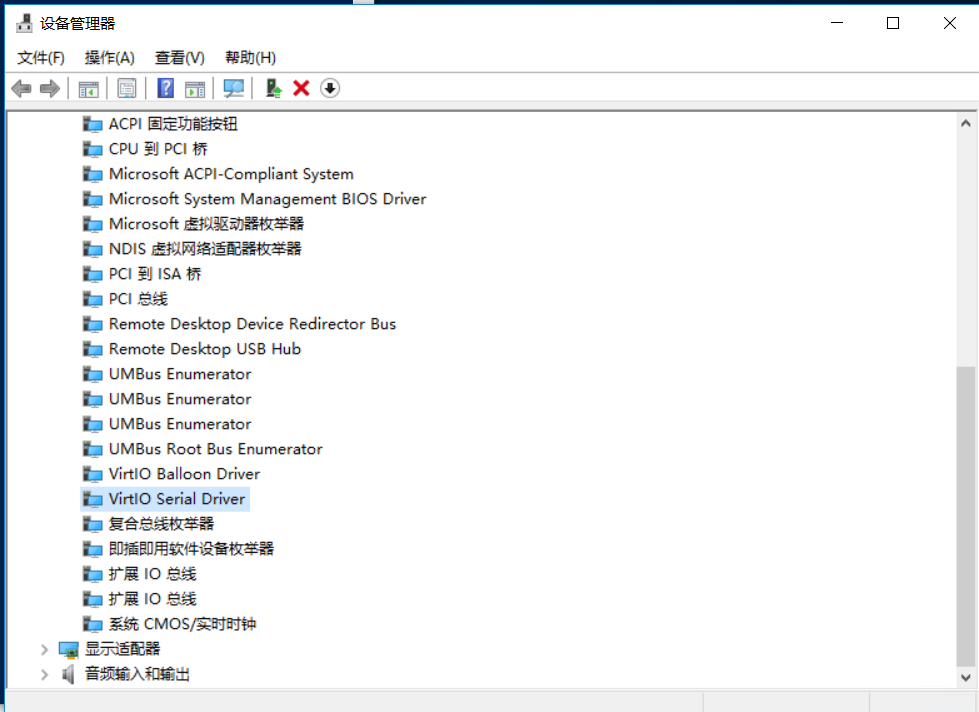

# windows virtoi驱动安装说明

## 操作场景
镜像必须安装虚拟化平台 KVM 的 Virtio 驱动。Windows系统默认未安装 Virtio 驱动，用户需要下载并安装 Windows Virtio 驱动后再根据 根据 [导入镜像流程](https://docs.ucloud.cn/UCloudStack_v2.x/customimage/README?id=_3-导入镜像流程) 继续操作。

## 操作步骤

### 步骤一：下载 virtio 安装包
* 启动虚拟机并连接至图形控制台；
*  登录 Windows 用户会话；
* 下载并安装VirtIO驱动程序，选择最新的iso文件下载到虚拟机，如 C 盘根目录下；
`https://fedorapeople.org/groups/virt/virtio-win/direct-downloads/latest-virtio/`
*  将iso文件进行解压至当前虚拟机。

### 步骤二：安装 virtio 驱动

*  以管理员身份运行 `Windows PowerShell` ，切换至上一步的文件夹目录， 如
`C:\virtio-win-0.1.204\vioserial\2k16\amd64` （此处以安装vioser为例）, 运行 `PnPutil.exe -i -a .\vioser.inf` 进行安装，且安装过程无报错；
*  安装后在 “设备管理器--系统设备” 列表下出现 `VirtIO Serial Driver` 条目则表示安装成功。如图所示：
    

* 按照相同的方式运行并安装 `balloon/NetKVM/viostor` 这几项。

> 安装完成后，可以根据 [导入镜像流程](https://docs.ucloud.cn/UCloudStack/customimage/README?id=_3-导入镜像流程) 继续操作。