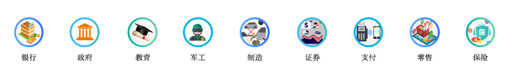

# 应用场景

### 虚拟化&云化

通过将业务系统和内部应用部署至UCloudStack平台，可为企业提供一套集虚拟化、分布式存储、SDN 网络为一体的私有云平台。平台支持多数据中心管理，可将业务部署至多个数据中心构建灾备云或边缘计算，同时支持与公有云无缝打通，灵活调用公有云能力，帮助企业快速构建安全可靠的业务架构。

### 业务快速交付

平台服务所见即所得，可通过自服务云管理平台一键部署并管理业务交付所需的基础设施和中件间，包括在线扩容、负载分发、数据库缓存及监控日志等应用基础环境服务能力；同时平台支持镜像导入导出，可方便快捷将业务系统迁移至云平台，并可对所有业务系统的资源进行统一管理。

### 超融合一体机

平台提供一体机交付模式，多款机型应用不同业务场景，集成UCloudStack私有云平台，出厂预装开箱即用，服务模块热插拔可按需部署，提供虚拟化、网络、存储、数据库、缓存及云管等一系列云服务能力；同时可通过与IDC数据中心互联，构建混合云解决方案。

### 企业专有云

UCloudStack提供租户控制台和管理员控制台，支持多租户、账户注册、计量计费等功能特性，同时为云平台管理者提供运营运维管理功能，包括资源管理、租户管理、价格配置、资源规格配置、部署升级及监控日志等服务，为企业提供行业专有云解决方案。

UCloudStack 轻量级私有云属于 IaaS+PaaS 复合型产品，并可按需搭载大数据、安全屋、AI 等公有云产品，适用于全行业客户需要云化且私有部署的业务应用上云场景，典型行业如下：

* **政府、央企、军工、交通、制造型企业**

  对外承担公共服务职责，内外部业务应用系统和商用软件需要快速交付、资源共享、智能调度及统一管理等上云需求的行业客户。

* **泛互联网行业，如B2B电商、大数据、教育等企业**

  需要构建行业专属云，结合自有SaaS业务为其用户提供整体解决方案的行业客户。

* **人工智能和科研实验室行业**

  需要大量可快速交付且私有化部署的虚拟化环境，用于科研项目和训练系统的快速部署和管理的行业客户。

