#### 版权声明

版权所有 © 优刻得科技股份有限公司 2021 保留一切权利。

本文档中出现的任何文字叙述、文档格式、图片、方法及过程等内容，除另有特别注明外，其著作权或其它相关权利均属于优刻得科技股份有限公司。非经优刻得科技股份有限公司书面许可，任何单位和个人不得以任何方式和形式对本文档内的任何部分擅自进行摘抄、复制、备份、修改、传播、翻译成其它语言、将其全部或部分用于商业用途。

UCloudStack 商标和 UCloud 商标为优刻得科技股份有限公司所有。对于本手册中可能出现的其它公司的商标及产品标识，由各自权利人拥有。

注意您购买的产品、服务或特性等应受优刻得科技股份有限公司商业合同和条款约束，本文档中描述的全部或部分产品、服务或特性可能不在您的购买或使用权利范围之内。除非合同另有约定，优刻得科技股份有限公司对本文档内容不做任何明示或暗示的声明或保证。

由于产品版本升级或其它原因，本文档内容会不定期更新，除非另有约定，本文档仅作为使用指导，本文档中的所有陈述、信息和建议不构成任何明示或暗示的担保。

# 前言

UCloud （优刻得科技股份有限公司）是中立、安全的云计算服务平台，坚持中立，不涉足客户业务领域。公司自主研发 IaaS、PaaS、大数据流通平台、AI 服务平台等一系列云计算产品，并深入了解互联网、传统企业在不同场景下的业务需求，提供公有云、私有云、混合云、专有云在内的综合性行业解决方案。

依托公司在圣保罗、拉各斯、英国（伦敦）等全球部署的 32 大高效节能绿色数据中心，以及国内北、上、广、深、杭等 11 地线下服务站，UCloud 已为全球上万家企业级客户提供云服务支持，间接服务终端用户数量达到数亿人。UCloud 深耕用户需求，秉持产品快速定制、贴身应需服务的理念，推出适合行业特性的产品与服务，业务已覆盖包含互联网、金融、新零售、制造、教育、政府等在内的诸多行业。

公司核心团队来自腾讯、阿里、百度、华为、VMware 等国内外知名互联网和 IT 企业，同时引进传统金融、医疗、零售、制造业等行业精英人才，目前员工总数超过 1000 人。

在云计算之前，企业业务应用上线，需要经历组网规划、容量规划、设备选型、下单、付款、发货、运输、安装、部署、调试的整个完整过程。随着云计算、大数据、人工智能等新技术对各行各业的赋能，以虚拟化和软件定义技术方向构建新一代数据中心为基础，实现业务的集中管理、资源动态调配、业务快速部署及统一运营运维，满足企业关键应用向 x86 及国产化系统迁移时，对资源高性能、高可靠、安全性、高可用及易用性上的要求，同时提高基础架构的自动化管理水平及业务快速交付能力，继而推动企业的数字化转型与业务创新。

UCloud 提供计算、存储、网络、数据库、中间件、云分发、多媒体音视频、大数据、人工智能及云安全防护等产品服务，为多种业务场景提供全方位的公有云计算产品和服务。为帮助企业级客户实现数字化转型，快速构建新一代基于虚拟化的私有数据中心，UCloud 基于多年运营的公有云架构，复用服务器操作系统内核及虚拟化核心组件（KVM、OVS、Qemu、Libvirt），同时优化核心调度系统及管理平台，对公有云平台进行定制重构，缩减部署规模及业务开销，提高云平台的可靠性、可用性及可运营性，提供一套可私有化交付且与公有云用户体验一致的企业专有云平台——UCloudStack 。

通过 UCloudStack 企业专有云平台，企业可在现有数据中心及设备上快速构建一套成熟且完整的私有云及混合云解决方案。为企业简化业务上云过程，提升组织管理和业务管理效率的同时，降低业务转型及信息系统的总体拥有成本，助力企业数字化转型。

# 1 产品简介

## 1.1 产品概述

UCloudStack （优钛）私有云平台，提供虚拟化、SDN 网络、分布式存储、容器及安全等核心服务的统一管理、资源调度、监控日志及运营运维等一整套云资源管理能力，助力政企数字化转型。

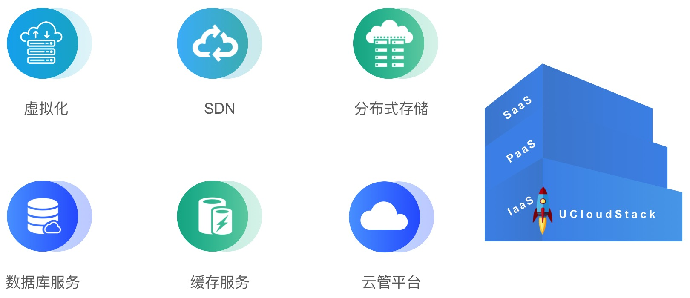

平台基于 UCloud 公有云基础架构，复用内核及核心虚拟化组件，将公有云架构私有化部署，具有自主可控、稳定可靠、持续进化及开放兼容等特点，可通过控制台或 APIs 快速构建资源及业务，支持与公有云无缝打通，灵活调用公有云能力，帮助政企快速构建安全可靠的业务架构。

UCloudStack 定位为轻量级交付，3 节点即可构建生产环境且可平滑扩容，不强行绑定硬件及品牌，兼容 X86 和ARM 架构，并提供统一资源调度和管理，支持纯软件、超融合一体机及一体机柜多种交付模式，有效降低用户管理维护成本，为用户提供一套安全可靠且自主可控的云服务平台。


## 1.2 产品架构


UCloudStack 平台整体产品架构由基础硬件设施、虚拟核心引擎、智能调度系统、核心产品资源、统一云管平台及运维管理平台组成，为平台租户、管理员及运营人员提供云平台管理和服务。

- **基础设施**：用于承载 UCloudStack 平台的服务器、交换机及存储设备等。

  - 平台支持并兼容通用 X86、ARM 及 MIPS 架构硬件服务器，不限制服务器和硬件品牌；
  - 支持 SSD 、SATA 、SAS 等磁盘存储，同时支持计算存储超融合节点及对接磁盘阵列设备，无厂商锁定；
  - 支持华为、思科、H3C 等通用交换机、路由器网络设备接入，所有网络功能均通过 SDN 软件定义，仅需物理交换机支持 Vlan、Trunk、IPv6、端口聚合、堆叠等特性；
  - 支持混合云接入并适配客户现有硬件资源，充分利用资源的同时，无缝对接现有资源服务。
- **虚拟核心引擎**：承载平台核心的操作系统内核、虚拟化计算、存储、网络的实现和逻辑。
  - 内核模块：承载云平台运行的服务器操作系统及内核模块，复用公有云深度优化的 Linux 内核；同时兼容 ARM 生态的 UOS、银河麒麟等操服务器操作系统及内核；
  - 虚拟化计算：通过 KVM 、Libvirt 及 Qemu 实现计算虚拟化，支持标准虚拟化架构，提供虚拟机全生命周期管理，兼容 X86 和 ARM 架构体系，支持热升级、重装系统、CPU 超分、GPU 透传、在线迁移、宕机迁移、反亲和部署等特性，并支持导入导出虚拟机镜像满足业务迁移上云需求；
  - 分布式网络 SDN ：通过 OVS + VXLAN 实现虚拟网络，纯软件定义分布式网络，提升网络转发性能的同时对传统数据中心物理网络进行虚拟化，为云平台资源提供 VPC 隔离网络环境、弹性网卡、外网IP、NAT 网关、负载均衡、防火墙、VPN连接、混合云接入及网络拓扑等网络功能，并支持 IPv4&IPv6 双栈；
  - 分布式存储 SDS ：基于 Ceph 实现分布式高性能存储，为平台提供块存储服务，支持云盘在线扩容、克隆、快照及回滚功能；同时底层数据多副本存储并支持数据重均衡和故障重建能力，保证性能和数据安全性。
- **智能调度系统**
  - 支持反亲和性调度部署策略，保证业务的高可用性和高可靠性；
  - 支持在线迁移技术，实时感知物理机状态和负载信息；
  - 物理主机故障或超过负载时，自动迁移虚拟机至低负载物理主机；
  - 创建虚拟机时，根据业务调度策略，自动启动虚拟机至低负载健康的物理主机；
  - 支持计算额度分配和资源抢占，保障公平的前提下，有效共享物理资源；
  - 支持平台虚拟资源的网络流表控制及下发，保证分布式网络架构的性能及可用性。
- **核心产品资源**
  - **地域（数据中心）**：数据中心指资源部署的物理位置分类，数据中心之间相互独立，如无锡数据中心、上海数据中心等。平台支持多数据中心管理，使用一套管理平台管理遍布各地数据中心的私有云平台；
  - **集群**：用于区分不同资源在一个数据中心下的分布情况，如 x86 计算集群、ARM 计算集群、 SSD 存储集群 及 SATA 存储集群，一个数据中心可以部署多个集群；
  - **多租户**：平台支持多租户模式，提供租户隔离功能、子帐号、权限控制、配额配置及价格配置等功能；
  - **子帐号及权限**：支持一个租户拥有多个子帐号，支持资源隔离并可对子帐号进行资源管理的权限控制；
  - **计量计费**：支持按需、按月、按年三种计费方式，支持过期续费及回收策略，同时提供完整的计费订单及消费明细；
  - **弹性计算**：运行在物理主机上的虚拟机，支持从镜像创建、重启/关机/启动、删除、VNC登陆、重装系统、重置密码、热升级、绑定外网 IP及安全组、挂载数据盘及反亲和策略部署等虚拟机全生命周期功能，同时支持将虚拟机制作为镜像及磁盘快照能力，提供快捷的业务部署及备份能力；
  - **GPU虚拟机**：平台提供 GPU 设备透传能力，支持用户在平台上创建并运行 GPU 虚拟机，让虚拟机拥有高性能计算和图形处理能力；
  - **弹性伸缩**：支持弹性伸缩功能，用户可通过定义弹性伸缩策略，在业务需求增长时自动增加计算资源（虚拟机）以保证计算能力；在业务需求下降时自动减少计算资源以节省成本。基于负载均衡和健康检查机制，可同时适用于请求量波动和业务量稳定的业务场景；
  - **镜像**：虚拟机运行时所需的操作系统，提供 CentOS 、Windows 、Ubuntu 等常用基础操作系统镜像；支持将虚拟机导出为镜像，通过自制镜像重建虚拟机；同时支持镜像的导入导出，便于用户自定义镜像；
  - **云硬盘**：一种基于分布式存储系统为虚拟机提供持久化存储空间的块设备。具有独立的生命周期，支持随意绑定/解绑至多个虚拟机使用，基于网络分布式访问，并支持容量扩容、克隆、快照等特性，为虚拟资源提供高安全、高可靠、高性能及可扩展的磁盘；
  - **快照**：提供磁盘快照及快照回滚能力，可应用于容灾备份及版本回退等业务场景，降低因误操作、版本升级等导致的数据丢失风险；
  - **VPC 网络**：软件定义虚拟专有网络，用于租户间数据隔离，提供自定义 VPC 网络、子网规划及网络拓朴;
  - **外网 IP**：用于虚拟机、负载均衡、NAT 网关及 VPN 网关等资源的外网 IP 接入，用于与平台外网络进行连接，如虚拟机访问互联网或访问 IDC 数据中心的物理机网络；支持同时绑定多个外网 IP 至虚拟资源，并提供 IPv6 网络连接服务；
  - **安全组**：虚拟防火墙，提供出入双方向流量访问控制规则，定义哪些网络或协议能访问资源，用于限制虚拟资源的网络访问流量，支持 TCP 、UDP 、ICMP 及多种应用协议，为云平台提供必要的安全保障；
  - **弹性网卡**：一种可随时附加到虚拟机的弹性网络接口，支持绑定和解绑，可在多个虚拟机间灵活迁移，为虚拟机提供高可用集群搭建能力，同时可实现精细化网络管理及廉价故障转移方案；
  - **NAT 网关**：企业级 VPC 网关，为云平台资源提供 SNAT 和 DNAT 代理，支持自动和白名单两种网络出口模式，并为 VPC 网络提供端口映射代理服务，使外部网络通过 NAT 网关访问虚拟机和 MySQL 。
  - **负载均衡**：基于 TCP/UDP/HTTP/HTTPS 协议将网络访问流量在多台虚拟机间自动分配的控制服务，类似于传统物理网络的硬件负载均衡器.用于多台虚拟机间实现流量负载及高可用，提供内外网 4 层和 7 层监听及健康检查服务；
  - **IPSecVPN**：提供 IPSecVPN 网关服务，通过 IPSec 协议加密的隧道技术，将 UCloudStack 与 UCloud 公有云、IDC 数据中心、第三方公有云的内网打通，在互联网上为两个私有网络提供安全通道，通过加密保证连接的安全；同时 IPSecVPN 服务还可作为 UCloudStack 平台 VPC 间通信的桥梁；
  - **监控告警**：支持虚拟机、弹性伸缩、磁盘、弹性 IP 、NAT网关、负载均衡、IPSecVPN、MySQL、Redis 等资源各维度监控数据收集及展示，同时可通过告警模板快速配置资源监控指标的告警策略和通知规则；
  - **操作日志**：云平台所有资源及云平台自身的操作和审计日志，支持多时间跨度的日志收集和展示，提供操作失败原因；
  - **回收站**：资源删除后暂存的位置，支持回收资源、恢复资源及彻底删除资源等操作；
  - **定时器**：提供定时器任务执行功能，可用来定期执行一系列任务，支持定时创建快照， 可在指定的周期重复执行，也可仅执行一次，且每个任务支持多个资源批量操作。
- **统一云管平台**
  - UCloudStack 平台提供 Web 控制台 和 API 接口两种方式接入和管理云平台；
  - 通过 WEB 控制台用户可快捷的的使用并管理云平台资源，如虚拟机、弹性 IP 、负载均衡 、计费等；
  - 开发者可通过 APIs 自定义构建云平台资源，支持无缝迁移上云。
- **运维管理平台**：为云平台管理员提供的运维运营管理平台，包括租户管理、资源管理、帐务管理、监控告警、日志审计、系统管理及部署升级等功能模块。
  - **租户管理**：用于管理整个云平台的租户及帐号信息，提供创建/冻结租户及充值功能，支持查看租户拥有资源信息、订单记录、交易记录及配额价格等信息，同时支持修改租户的资源配额及产品价格；
  - **资源管理**：支持查看并管理平台所有物理资源和虚拟资源；
    - 物理资源包括物理数据中心、集群、宿主机资源、存储资源、网络IP网段资源池及镜像资源池等；
    - 虚拟资源包括所有租户及子帐号所拥有的资源，包括虚拟机、VPC 、负载均衡、外网 IP 、弹性网卡、弹性伸缩、NAT 网关、MySQL、Redis、IPSecVPN、监控告警、安全组、回收站等；
  - **帐务管理**：支持查看平台所有订单记录、交易记录、充值记录及全局产品价格，支持配置平台整体产品价格，同时支持财务报表导出；
  - **平台监控告警**：提供 UCloudStack 自身物理设备、组件及所有虚拟资源的监控数据，并支持自定义监控报警和通知；
  - **日志事件**：提供平台所有租户、子帐号及管理员的操作日志和审计信息，可进行多维度的筛选和搜索；
  - **系统管理**：提供云平台全局配置、规格配置和配额管理功能。
    - 全局配置包含邮箱设置、回收策略、网络设置、计费、资源管理、配额设置、登录态、控制台及网站设置等；
    - 规格配置支持对虚拟机的 CPU 内存规格、磁盘容量范围、外网 IP 带宽及 MySQL/Redis 内存规格进行自定义配置；
    - 全局配额支持查看并修改全局每个地域虚拟资源的配额值。
  - **部署升级**：平台支持自动化脚本安装物理服务器节点，包括操作系统、云平台组件及管理服务等。
- **基础监控服务**：云平台基础硬件资源的外围监控服务，包括云平台接入的所有网络设备、服务器、磁盘阵列等硬件设备的运行状态和性能指标进行监控告警，同时也可对集群中 MySQL、Redis、MongoDB 等常用服务进行监控和告警。

## 1.3 产品特性

- 自主可控

  基于公有云架构，复用核心虚拟化组件自主研发，可控性高且可靠性经上万家企业验证。

- 稳定可靠

  平台服务高可用，虚拟资源智能调度，数据存储多副本，自愈型分布式网络，为业务保驾护航。

- 简单易用

  3 节点构建生产环境，规模轻量可水平扩展，支持业务平滑迁移，助力政企轻松上云。

- 开放兼容

  不绑定硬件品牌，兼容 X86 和 ARM 架构及生态适配，设备异构搭建统一管理。


## 1.4 技术架构特性

### 1.4.1 API 幂等性

幂等性是指一次和多次请求某一个资源应该具有同样的副作用，保证资源请求无论调用多少次得到的结果始终一致。如多次调用更新虚拟机的 API 请求，返回的结果都是一致的。

UCloudStack 通过分布式锁、业务字段唯一约束及 Token 唯一约束等技术手段保证平台资源 API 幂等性。对虚拟机、云硬盘、VPC 、负载均衡等资源的操作请求（除创建请求）均支持重复提交，并保证多次调用同一个 API 请求返回结果的一致性，同时避免网络中断导致 API 未能获取确切结果，从而导致重复操作的问题；

### 1.4.2 全异步架构

* 云平台使用消息总线进行服务通信连接，在调用服务 API 时，源服务发消息给目的服务，并注册一个回调函数，然后立即返回；一旦目的服务完成任务，即触发回调函数回复任务结果；
* 云平台服务之间和服务内部均采用异步调用方法，通过异步消息进行通信，并结合异步 HTTP 调用机制，保证平台所有组件均实现异步操作；
* 基于异步架构机制，云平台可同时管理数十万以上的虚拟机及虚拟资源，后端系统每秒可并发处理上万条 API 请求；
* UCloudStack 采用的插件机制，每个插件设置相应的代理程序，同时在 HTTP 包头为每个请求设置回调 URL ,插件任务结束后，代理程序发送应答给调用者的 URL ；

### 1.4.3 分布式

**(1) 分布式底层系统**：UCloudStack 核心模块提供计算、存储及调度等分布式底层支持，用于智能调度、资源管理、安全管理、集群部署及集群监控等功能模块。

* 智能调度：基于分布式服务调用和远程服务调用为租户提供智能调度模块。智能调度模块实时监测集群和所有服务节点的状态和负载，当某集群扩容、服务器故障、网络故障及配置发生变更时，智能调度模块将自动迁移被变更集群的虚拟资源到健康的服务器节点，保证云平台的高可靠性和高可用性；
* 资源管理：通过分布式资源管理模块，负责集群计算、存储、网络等资源的分配及管理，为云平台租户提供资源配额、资源申请、资源调度、资源占用及访问控制，提升整个集群的资源利用率；
* 安全管理：分布式底层系统提供安全管理模块，为租户提供身份认证、授权机制、访问控制等功能。通过 API 密钥对和用户名密码等多种方式进行服务间调用及用户身份认证；通过角色权限机制进行用户对资源访问的控制；通过 VPC 隔离机制和安全组对资源网络进行访问控制，保证平台的安全性；
* 集群部署：分布式底层系统为云平台提供自动化部署集群节点的模块，为运维人员提供集群部署、配置管理、集群管理、集群扩容、在线迁移及服务节点下线等功能，为平台管理者提供自动化部署通道；

* 集群监控：监控模块主要负责平台物理资源和虚拟资源信息收集、监控及告警。监控模块在物理机及虚拟资源上部署 Agent ，获取资源的运行状态信息，并将信息指标化展示给用户；同时监控模块提供监控告警规则，通过配置告警规则，对集群的状态事件进行监控及报警，并有效存储监控报警历史记录；

**(2) 分布式存储系统**：UCloudStack 采用高可靠、高安全、高扩展、高性能的分布式存储系统，提供块存储服务，保证本地数据的安全性和可靠性。

- 软件定义分布式存储，将大量通用机器的磁盘存储资源聚合在一起，采用通用的存储系统标准，对数据中心的所有存储进行统一管理；
- 分布式存储系统采用多副本数据备份机制，写入数据时先向主副本写入数据，由主副本负责向其他副本同步数据，并将每一份数据的副本跨磁盘、跨服务器、跨机柜、跨数据中心分别存储于不同磁盘上，多维度保证数据安全；
- 多副本机制存储数据，将自动屏蔽软硬件故障，磁盘损坏和软件故障，系统自动检测到并自动进行副本数据备份和迁移，保证数据安全性，不会影响业务数据存储和使用
- 分布式存储服务支持水平扩展、增量扩容及数据自动平衡性，保证存储系统的高扩展性；
- 支持 PB 级存储容量，总文件数量可支持亿量级；
- 支持不间断数据存储和访问服务，SLA 为 99.95% ，保证存储系统的高可用性；
- 支持高性能云硬盘，IOPS 和 吞吐量随存储容量规模线性增长，保证响应时延；

在部署上，计算节点自带 SSD 磁盘构建为高性能的存储池，计算节点自带的 SATA/SAS 磁盘构建为普通性能存储池。分布式存储系统将块设备内建为弹性块存储，可供虚拟机直接挂载使用，在数据写入时通过三副本、写入确认机制及副本分布策略等措施，最大限度保障数据安全性和可用性。在本地可通过备份及快照技术，将本地数据定时增量备份服务器或对象存储服务，在数据丢失或损坏时，可通过备份快速恢复本地业务的数据，包括数据库数据、应用数据及文件目录数据等，可实现分钟级恢复。

**(3) 分布式网络架构**：采用分布式 Overlay 网络，提供 VPC 、NAT 网关、负载均衡、安全组、外网 IP 等网络功能。

- UCloudStack 云平台 Overlay 网络分布式运行在所有计算节点；
  - 管理服务仅作为管理角色，不承担网络组件部署及生产网络传输；
  - 虚拟网络流表分发服务为高可用架构，仅做流表分发不透传生产网络传输；
  - 所有生产网络仅在计算节点上传输，无需通过管理服务或流表分发服务进行转发；
  - 管理服务和流表分发服务故障，不影响已部署好的虚拟资源运行及通信。
- 超融合计算节点或独立存储节点根据磁盘和业务分不同的集群（Set）；
  - 每个集群最多 45 台节点，控制集群规模；
  - 业务数据网络仅在单集群中进行传输，即在单组交换机中进行传输。
- 分布式存储直接通过物理网络进行挂载，无需通过 overlay 网络进行挂载和传输；
  - 通过 libvirt 融合分布式存储 rbd 和 qemu ，qemu 通过 librbd 操作分布式存储；
  - 虚拟化进程与分布式存储进程通过本机 & 跨物理机内网进行通信；
  - 云平台内网至少使用万兆交换机并做端口聚合，可满足虚拟机和分布式存储的性能需求；

分布式网络架构将业务数据传输分散至各个计算节点，除业务逻辑等北向流量需要管理服务外，所有虚拟化资源的业务实现等南向流量均分布在计算节点或存储节点上，即平台业务扩展并不受管理节点数量限制。

### 1.4.4 高可用

UCloudStack 私有云平台架构，从硬件设施、网络设备、服务器节点、虚拟化组件、分布式存储均提供高可用技术方案，保证整个云平台业务不间断运行：

- 数据中心机柜级别冗余性设计，所有设备均对称部署于机柜，单机柜掉电或故障不影响业务；
- 网络服务区域隔离设计，内网业务和外网业务在物理设备上完全隔离，避免内外网业务相互影响；
- 网络设备扩展性设计，所有网络设备分为核心和接入两层架构，一套核心可水平扩展几十套接入设备；
- 网络设备冗余性设计 ，所有网络设备均为一组两台堆叠，避免交换机单点故障；
- 交换机下联接入冗余性设计，所有服务器双上联交换机的接口均做 LACP 端口聚合，避免单点故障；
- 服务器网络接入冗余性设计，所有服务器节点均做双网卡绑定，分别接入内网和外网，避免单点故障；
- 管理节点冗余性和扩展性设计，多台管理节点均为 HA 部署，并支持横向扩展，避免管理节点单点故障；
- 通过智能调度系统将虚拟机均衡部署于计算节点，可水平扩展计算节点数量；
- 分布式存储冗余性设计，将数据均衡存储于所有磁盘，并三副本、写确认机制及副本分布策略保证数据安全；
- 进行服务器节点及存储扩展时，只需增加相应数量的硬件设备，并相应的配置资源调度管理系统；
- 云平台内各组件均采用高可用架构设计，如管理服务、调度服务、网络流表分发服务等，保证平台高可用；
- 云平台提供的产品服务，如负载均衡、NAT 网关、数据库服务及缓存服务均采用高可用架构构建，保证云平台提供服务的可靠性。


### 1.4.5 业务实现分离

UCloudStack 云平台架构从业务逻辑上分为北向接口和南向接口，将云平台的业务逻辑和业务实现进行分离，业务管理逻辑不可用时，不影响虚拟资源的正常运行，整体提升云平台业务可用性和可靠性。

* 北向接口：仅定义业务逻辑，提供业务接口，负责北向数据落地。业务接口包括帐户认证、资源调度、监控、计费、API 网关及 WEB 控制台等业务服务接口；
* 南向接口：仅定义业务实现，负责将北向接口的业务转换为实现，如虚拟机运行、VPC 网络构建、分布式存储数据存储等；

业务实现分离后，当云平台业务端（如 WEB 控制台）发生故障时，并不影响已运行在云平台上的虚拟机及运行在虚拟机中的业务，一定程度上保证业务高可用。

### 1.4.6 组件化

UCloudStack 将云平台的所有虚拟资源组件化，支持热插拔、编排组合及横向扩展。

* 组件化包括虚拟机、磁盘、网卡、IP、路由器、交换机、安全组等；
* 每种组件均支持热插拔，如将一个 IP 绑定至一个在运行中的虚拟机；
* 每种组件均支持横向扩展，如横向增加虚拟机的磁盘，提升整体云平台的健壮性 。

## 1.5 客户痛点

### 1.5.1 自建私有云的痛点

* 可控性差

  业界基于开源架构封装的私有云核心组件和服务源自社区，可控性差且可靠性未经验证，平台特性升级受限于社区且需专精运维人员，同时开源框架构繁杂，部署实施环节复杂，实施难度大。

* 投入成本大

  OEM 公有云直接部署的专有云平台，所有服务均需独立的服务器集群，起始部署规模较大且通常限制硬件架构及品牌，部署实施需要投入大量基础设施和人力资源；在运维方面通常需要托管运维，建设成本较高。

* 运维复杂

  自建数据中心及通用虚拟化系统，对于业务构建所需的数据库、缓存、负载均衡等一系列应用，需自己通过虚拟机进行搭建并维护，同时还需考虑服务的集群部署、监控、日志、备份、容灾及可靠性和可用性等。

* 兼容性差

  通用数据中心及虚拟化系统，对国产化硬件、操作系统、中间件的适配及兼容性较差。

### 1.5.2 解决之道

* 可控可靠

  UCloudStack 采用非开源架构，基于公有云自主研发，复用内核及核心虚拟化组件，将公有云部署规模重构为可运营、可运维、可快速交付且可私有化交付的云平台，可控性高且可靠性经上万家企业验证。

* 轻量构建

  平台所有产品服务使用统一底层资源池，所有产品无需准备专用服务器集群，3节点即可轻量构建生产环境，规模轻量且可水平扩展，支持自动化一键部署并提供平滑升级能力，一个运维人员即可轻松管理。

* 丰富组件

  公有云一致用户体验的自服务平台，除基础 IaaS 产品外，为政企用户提供高可用、高可靠且可自服务的负载均衡、NAT网关、IPSecVPN、数据库服务及缓存服务等 PaaS 类产品服务。

* 兼容性高

  平台本身不绑定硬件架构及品牌，兼容X86、ARM、MIPS等主流架构，可异构搭建并进行统一资源管理；同时已适配信创体系硬件、操作系统及中件间，如华为泰山加鲲鹏、飞腾加银可麒麟、UOS 及南大通用数据库等。

## 1.6 应用场景

### 1.6.1 虚拟化&云化

通过将业务系统和内部应用部署至UCloudStack平台，可为用户提供一套集虚拟化、分布式存储、SDN 网络为一体的私有云平台。平台支持多数据中心管理，可将业务部署至多个数据中心构建灾备云或边缘计算，同时支持与公有云无缝打通，灵活调用公有云能力，帮助政企快速构建安全可靠的业务架构。

### 1.6.2 业务快速交付

平台服务所见即所得，可通过自服务云管理平台一键部署并管理业务交付所需的基础设施和中件间，包括在线扩容、负载分发、数据库缓存及监控日志等应用基础环境服务能力；同时平台支持镜像导入导出，可方便快捷将业务系统迁移至云平台，并可对所有业务系统的资源进行统一管理。

### 1.6.3 超融合一体机

平台提供一体机交付模式，多款机型应用不同业务场景，集成UCloudStack私有云平台，出厂预装开箱即用，服务模块热插拔可按需部署，提供虚拟化、网络、存储、数据库、缓存及云管等一系列云服务能力；同时可通过与IDC数据中心互联，构建混合云解决方案。

### 1.6.4 政企专有云

UCloudStack提供租户控制台和管理员控制台，支持多租户、账户注册、计量计费等功能特性，同时为云平台管理者提供运营运维管理功能，包括资源管理、租户管理、价格配置、资源规格配置、部署升级及监控日志等服务，为政企提供行业专有云解决方案。


UCloudStack 轻量级私有云属于 IaaS+PaaS 复合型产品，并可按需搭载大数据、安全屋、AI 等公有云产品，适用于全行业客户需要云化且私有部署的业务应用上云场景，典型行业如下：

* **政府、央企、军工、交通、制造型企业**

  对外承担公共服务职责，内外部业务应用系统和商用软件需要快速交付、资源共享、智能调度及统一管理等上云需求的行业客户。

* **泛互联网行业，如B2B电商、大数据、教育等企业**

  需要构建行业专属云，结合自有SaaS业务为其用户提供整体解决方案的行业客户。

* **人工智能和科研实验室行业**

  需要大量可快速交付且私有化部署的虚拟化环境，用于科研项目和训练系统的快速部署和管理的行业客户。

## 1.7 交付模式

UCloudStack定位为轻量级交付，3 节点即可构建生产环境且可平滑扩容，并提供统一资源调度和管理，**支持纯软件、超融合一体机及超融合机柜**多种交付模式，有效降低用户管理维护成本，为用户提供一套安全可靠且自主可控的云服务平台。

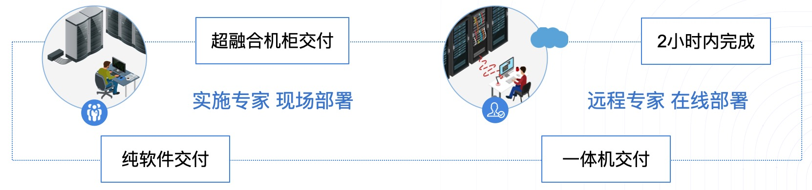

* **纯软件交付**

  客户提供承载云平台运行的硬件服务器、网络设备及相关基础设施，UCloud 优刻得提供 **UCloudStack 轻量级私有云软件**；通常在基础网络设施环境完备的情况下，UCloudStack 软件可在 2 小时内完成部署并交付。

* **超融合一体机**

  客户仅需提供数据中心基础设施，UCloud 优刻得提供**超融合一体机**（出厂预装 UCloudStack ），通常在基础网络设施环境完备的情况下，可在小时内完成初始化并交付。

  

* **超融合机柜**

  客户仅需提供数据中心即可，UCloud 优刻得提供**超融合一体机柜**（包含网络设备、服务器节点&一体机、PDU、线缆及 UCloudStack 软件 ），通常以一个机柜的形式进行交付。

  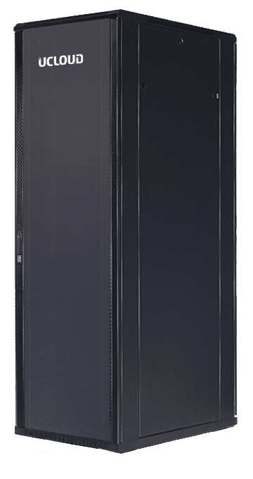
  
  


# 2 平台物理架构

## 2.1 物理集群节点

UCloudStack 云平台系统常见集群节点角色有 4 种，分别是管理节点、计算节点、独立存储节点、基础监控节点。其中计算节点为计算和存储融合节点，如果需要独立的存储区域，可采用独立存储节点。

如需将 UCloudStack 云平台与 IDC 物理环境打通，搭建混合云服务模式，可采用云平台提供的【物理 IP】功能进行接入。

### 2.1.1 管理节点

集群内部署的核心管理服务，承载 UCloudStack 云平台的北向接口服务模块，包括帐户认证、计量计费、资源管理、API-Gateway 及服务监控等服务，提供标准 API 和 WEB 控制台两种接入和管理方式。

* 管理节点负责虚拟资源全生命周期的管理，由于北向业务与南向实现接口分离及分布式网络机制，网络流量通过所在计算节点直接转发，平台业务扩展并不受管理节点数量限制，1 台管理节点可管理上千台计算节点；
* 云平台支持统一的底层资源，基于管理服务仅转发和透传管理流量，**平台支持并推荐将管理服务部署于计算节点的虚拟机中**，通过平台虚拟机的智能调度提供管理能力的高可用。

管理服务与计算服务间通过 TCP/IP 协议进行通信，提供管理服务通过内网或外网与计算节点通信的能力，支持管理服务与计算服务分离部署，如管理服务部署至公有云或其中一个数据中心，计算节点分布在各个数据中心，通过全局云管平台跨机房、跨数据中心及跨地域统一管理。

### 2.1.2 计算节点

集群内宿主机节点，用于运行虚拟机、虚拟网络、分布式存储、数据库服务、缓存服务等资源，同时承载智能调度控制和监控服务。计算节点类型可为计算存储超融合节点或独立计算节点：

* 计算存储融合节点：云平台分布式存储使用所有计算节点的数据磁盘，一台节点仅支持部署一种类型的数据磁盘，如 SATA、SSD、NVME 等；
* 独立计算节点：用于独立运行所有计算和网络资源，通过挂载独立存储节点的磁盘作为云平台的存储资源；
* 一般由几台到几千台服务器组成，生产环境至少部署 3 台以上，保证分布式存储系统的多副本部署及运行；
* 通常建议将相同配置的计算节点服务器放置在一个集群内进行虚拟资源的调度。

在部署上，每台计算节点（以超融合为例）均会部署用于运行计算存储网络的 KVM、Qemu、Libvirt、OVS、Ceph 等核心组件，同时在每个地域中至少有两台计算节点会部署核心调度及管理模块，如下图所示：


其中【Schedule Manager】即为 UCloudStack 云平台的核心调度及管理模块，用于虚拟资源的运行调度及虚拟网络的流表下发管理，每一个地域仅需部署一套高可用的 Schedule Manager 。一般为主备模式，可在两台或多台计算节点上进行部署，当部署调度模块的主计算节点服务器物理故障时，部署调度模块的备计算节点将自动接替调度服务，保证核心调度及流表控制服务的可用性。

每个地域或数据中心的部署的 Schedule Manager 均会开放一个 API 端点，作为管理服务连接并管理数据中心计算资源的统一入口。API 端点支持通过内网和互联网的连接模式，在 TCP/IP 网络通信可达的情况下，管理服务（Cloud Manager Platforms）支持部署于相同数据中心，也可部署于公有云或其它数据中心，并可为多数据中心计算资源提供统一调度和管理，满足云平台多应用场景部署。

> 若为独立计算节点，则无需部署分布式存储，需搭配独立存储节点提供存储服务。

### 2.1.3 独立存储节点

独立存储节点，用于独立承载分布式存储的节点，构建独立存储区域。适合将计算和存储分离，搭建独立存储网络的场景。独立存储节点，使用独立的存储网络接入设备，与计算业务物理或逻辑隔离。

* 部署独立存储节点，可节省计算节点的 CPU、内存等资源；
* 一般由几台和几千台服务器组成，生产环境至少部署 3 台以上，保证分布式系统的正常部署和运行；
* 独立存储节点为【**可选**】节点，如果采用超融合节点，可使用计存存储超融合节点上的数据磁盘作为分布式存储的存储池。

部署存储节点时，建议每个节点均配置相同介质类型的数据磁盘，如全 SSD 存储节点、SATA 存储节点 等，将相同磁盘类型的节点组成一个存储集群，分别作为普通存储和高性能存储资源池。

> 如需对接商业存储设备，需将存储设备与存储节点相连，在存储节点上部署分布式存储系统，将磁盘阵列作为存储资源池。

### 2.1.4 基础监控节点

基础监控节点是用于承载云平台基础硬件资源的监控服务，包括云平台接入的所有网络设备、服务器、磁盘阵列等硬件设备的运行状态和性能指标进行监控告警，同时也可对集群中 MySQL、Redis、MongoDB 等常用服务进行监控和告警。

基础监控节点为【**可选**】节点，一般部署 2 个节点即可，可采用一台物理服务器部署，也可将其中一个节点部署于一个虚拟机中，生产环境中，可根据需求选择部署方案。

### 2.1.5 推荐节点方案

UCloudStack 物理节点方案会根据企业业务需求及应用场景进行调整，通常推荐 3+3 的节点方案，即 3 台 SATA 超融合计算节点 + 3 台 SSD 超融合计算节点，管理服务部署于计算节点的虚拟机中，后续可根据业务规模水平扩展，如将 SATA 超融合计算节点扩容为 9 台。

SSD 和 SATA 节点的配比取决于业务需求，如高存储容量需求较大，则需配置较多的 SATA 节点；若高性能业务需求较多，则需配置较多的 SSD 全闪节点。

最佳实践中，生产环境至少需要 3 台 SATA/SSD 超融合节点部署搭建  UCloudStack 平台，即 UCloudStack 最小生产规模为 3 台服务器。

## 2.2 物理网络架构

为构建高可用、高可靠、高安全的企业专有云平台， UCloudStack 平台均采用高可用冗余性设计。本文以标准网络拓扑图为基础进行物理网络架构描述，本架构设计至少需要 6 台万兆交换机、2 台千兆交换机、 多台计算&存储节点服务器。若有 IPMI 管理及网络设备管理等需求，可根据需求增加 IPMI 和 Management 交换机并接入网络。


UCloudStack 平台网络设计为**核心**、**接入**二层架构，接入交换机双上联到核心，且按计算业务分集群划分。本架构设计从业务场景上提供公网服务，因此整体业务架构分为**内网区域**和**外网区域**两张网络，分别承载云平台内网通信和外网通信，两张网络在网络设备层面物理隔离。

同时标准架构中，通过将用户数据中心的物理网络与云平台【外网区域】物理连接在一起，通过云平台提供的物理 IP 产品，实现平台虚拟机与物理网络进打通的业务场景。

### 2.2.1 架构规模

标准的网络架构为单数据中心网络架构，即单数据中心可支撑 900 ~1000 台规模的节点数量：

- 两台交换机堆叠在一起，称为一组交换机，如一组内网接入交换机或一组外网接入交换机；
- 通常一组接入交换机为 96 个业务接口，堆叠检测及备用占用 3\*2 个接口，可用业务端口为 90 个；
- 每个服务器节点使用两个网卡占用一组接入交换机的 2 个接口，即一组接入交换机可接入 45 台服务器；
- 每增加一组交换机即可扩展 45 个节点，一组核心交换机至少可接入 20 组接入交换机，即至少可支撑 900 个节点服务器。

### 2.2.2 网络区域

网络区域的设备通常包括内网核心交换机、外网核心交换机、内网接入交换机、外网接入交换机。若服务器节点规模较小且暂不考虑扩容，可仅采用内/外网接入交换机。

- 内网核心交换机：采用 2 台 40GE 的三层交换机堆叠作为一组内网核心，用于承载内网接入交换机的汇聚和管理；
- 外网核心交换机：采用 2 台万兆三层交换机堆叠作为一组外网核心，用于承载外网接入交换机的汇聚和管理；
- 内网接入交换机：采用 2 台万兆交换机堆叠作为一组内网接入，用于承载 45 台服务器内网接入；
- 外网接入交换机：采用 2 台千兆交换机堆叠作为一组外网接入 ，用于承载 45 台服务器外网接入；
- 除 Internet 连接外，网络均为大二层环境，采用 LLDP 协议获取网络拓扑信息，所有网络接入均为端口聚合，保证高可用；同时通过控制接口广播报文流量，抑制网络广播风暴；
- 外网核心交换机与 Internet 之间可以为二层聚合、三层聚合、L3 ECMP 、L3 A/S 等互连模式，同时支持串联或旁挂防火墙、IDS、IPS 及防 DDOS 等安全设备；
- 云平台提供的网络功能均采用软件定义的方式实现，物理交换机仅作为网络流量转发设备，即仅使用交换机部分通用能力，如**堆叠、Vlan、Trunk、LACP 及 IPV6** 等，无需采用 SDN 交换机实现虚拟网络的通信。

若云平台虚拟机需要与数据中心的物理服务器进行通信，如标准架构图所示，需要将物理网络与云平台外网交换机进行互联，通过云平台提供的【物理 IP】产品进行绑定并通信。

标准网络架构中，通常推荐至少采用万兆及以上级别的交换机，保证平台节点内网接入、虚拟资源通信及分布式存储的性能及可用性。由于外网接入带宽一般较小，通常推荐采用千兆交换机作为外网接入设备。

### 2.2.3 服务器区域

服务器区域的设备通常包括计算存储超融合节点、独立计算节点、独立存储节点、管理节点及基础监控节点。若直接使用计算节点的虚拟机作为管理节点，即可省去物理管理节点服务器。

- 计算节点**【必选】**：采用 x86/ARM 架构服务器作为计算节点或计算存储超融合节点，用于运行虚拟机、虚拟网络分布式、存储服务及数据库缓存等服务，承载整个云平台的资源核心实现及运行。
  - 采用 2 个 GE 网卡分别上联到两台外网接入交换机 ，并做双网卡 bond ，作为计算节点外网接入；
  - 采用 2 个 10GE 网卡分别上联到两台内网接入交换机 ，并做双网卡 bond ，作为计算节点内网接入；
  - 若为超融合节点，则分布式存储使用所有计算节点上的数据磁盘，所有计算节点上的数据磁盘组成统一分存储资源池，用于构建分布式存储；
  - 若为独立计算节点，则分布式存储使用存储节点上的数据磁盘作为统存储资源池，通过网络跨集群挂载。
- 独立存储节点**【可选】**：若计算存储需要分离部署，可采用 x86/ARM 架构且磁盘较多服务器作为独立存储节点，用于承载独立的分布式存储服务。
  - 存储节点与计算服务通过内网进行通信，仅需 2 个 10GE 网卡分别上联到两台内网接入交换机 ，并做双网卡 bond ，作为存储节点的内网接入；
  - 如需将计算存储网络物理隔离，可采用独立存储接入交换机，存储节点的网卡上联至存储接入交换机；
  - 分布式存储使用存储节点及超融合节点上的所有数据磁盘，三副本保证数据安全；
  - 为保证分布式存储的性能及可用性，存储节点必须采用万兆以上速率的网卡。
- 管理节点【**可选**】：平台默认推荐使用平台虚拟机部署管理服务，如需**物理服务器**承载并运行管理服务，可采用 x86/ARM 服务器作为云平台管理节点，用于承载云平台管理塻块及服务。
  - 采用 2 个 GE 网卡分别上联到两台外网接入交换机 ，并做双网卡 bond ，作为管理节点外网接入；
  - 采用 2 个 10GE 网卡分别上联到两台内网接入交换机 ，并做双网卡 bond ，作为管理节点内网接入。
- 基础监控节点**【可选】**：可采用 x86 服务器接入内网作为基础监控节点，用于监控云平台基础设施。

> 以上网卡 bond 均采用 “ mode=4 ” 模式，即 IEEE 802.3ad 动态链路聚合。

<span id="_224-标准架构扩展"></span>

### 2.2.4 标准架构扩展

在实际项目中，根据用户需求和所提供的环境，可对标准网络架构进行调整，如项目较小规模（ 48 节点内）或仅需一个简单的测试环境或等场景。

（1）如需内外网物理隔离且考虑接入冗余，可采用 2 组共 4 台接入交换机进行业务部署。
- 2 台堆叠用于服务器内网接入，2 台堆叠用于服务器外网接入；
- 每台服务器内外网分别使用 2 个接口绑定接入内外网接入交换机，可支持 48 台服务器节点冗余接入。

（2）如需内外网物理隔离且不考虑接入冗余，可采用 2 台接入交换机进行业务部署；
- 1 台用于服务器内网接入，1 台用于服务器外网接入；
- 每台服务器分别使用 1 个接口接入内网接入交换机及外网接入交换机，支持 48 台服务器节点接入；

（3）若内外网无需物理隔离且考虑接入冗余，可采用 2 台交换机堆叠，通过 Vlan 隔离内外网，如下图所示：


- 方案一：通过在交换机上划分 Vlan ，服务器分别使用 2 个接口绑定接入交换机内外网 Vlan 接口，即每台服务器需 2 组 `bond` (4 个接口)实现内外网业务通信，可支持 24 节点；
- 方案二：通过在服务器操作系统内划分 Vlan（即子接口），服务器分别使用 2 个接口绑定接入交换机 Trunk 接口，即每台服务器仅需 2 个接口绑定实现内外网业务通信，可支持 48 节点；

（4）若内外网无需物理隔离且不考虑接入冗余，可采用 1 台交换机，通过交换机 Vlan 或服务器内划分 Vlan 进行内外网隔离及接入。

（5）若实际环境中需要采用独立的计算节点和独立的存储节点，并需要将计算网络和存储网络进行物理隔离，可以为独立存储节点单独划分一对接入交换机上联至内网核心交换机，实现计算和存储网络进行分离。平台计算虚拟机可通过物理网络挂载多个存储网络的存储集群，采用独立的存储网络设计可将存储节点及分布式存储系统内部同步流量与虚拟机计算读写存储的流量进行分离，提高平台整体的稳定性和性能。

## 2.3 硬件选型

### 2.3.1 推荐配置

**（1）网络设备推荐配置**

| 业务                      | 配置描述                       |
| ------------------------ | ------------------------------ |
| 内网核心交换机           | 40G板卡(16口)*4，64\*40GE |
| 外网核心交换机           |  48\*10GE + 6\*40GE             |
| 内网接入交换机(**必选**) | 48\*10GE + 6\*40GE             |
| 存储接入交换机           | 48\*10GE + 6\*40GE             |
| 外网接入交换机           |  48\*GE + 4\*10GE + 2\*40GE     |

> 交换机型号默认推荐华为 CE 系列，亦可根据配置选择其它品牌同等配置交换机。

**（2）服务器推荐配置**

| 业务             | 配置描述                                                     |
| ---------------- | ------------------------------------------------------------ |
| 计算+SATA节点    | Factor Form：2U<br/>CPU：Intel® Xeon® Gold 6126 Processor 19.25M Cache, 2.60 GHz \*2<br/>DIMM：DDR4_32GB_2666MHz \* 12<br/>OS_HDD：SATA3_SSD_240GB_6Gb/s \*2<br/>Data_HDD：SATA3_HDD_4TB_6Gb/s_7200RPM \*6<br/>NIC: Intel 2口 千兆+Intel 2口 万兆(不含SFP+多模模块)<br/>HDD Controller: 12Gb/s_RAID_Card _1G Cache_SuperCap<br/>PSU: ≥550W 白金版 *2 |
| 计算+SSD节点     | Factor Form：2U<br/>CPU：Intel® Xeon® Gold 6146 Processor 24.75M Cache, 3.20 GHz \*2<br/>DIMM：DDR4_32GB_2666MHz \* 12<br/>OS_HDD：SATA3_SSD_240GB_6Gb/s \*2<br/>Data_HDD：SATA3_SSD_960GB_6Gb/s\*8<br/>NIC: Intel 2口 千兆+Intel 2口 万兆(不含SFP+多模模块)<br/>HDD Controller: 12Gb/s_RAID_Card _1G Cache_SuperCap<br/>PSU: ≥700W 白金版 *2 |
| 管理节点（若有） | Factor Form：2U<br/>CPU：Intel® Xeon® Silver 4110 Processor 11M Cache, 2.10 GHz *2<br/>DIMM：DDR4_32GB_2666MHz *2<br/>OS HDD：SATA3_SSD_240GB_6Gb/s *2 <br/>Data HDD：SATA3_SSD_480G *6<br/>HDD Controller：12Gb/s RAID Card + ≥1G Cache + SuperCap<br/>NIC：Intel 2口 千兆+Intel 2口 万兆(不含SFP+多模模块)<br/>PSU：≥550W白金版电源 *2 |

**（3）独立存储节点推荐配置**

| 业务             | 配置描述                                                     |
| ---------------- | ------------------------------------------------------------ |
| 独立存储SATA节点 | Factor Form：2U<br/>CPU：Intel® Xeon® Gold 4110 Processor 11M Cache, 2.10 GHz *2<br/>DIMM：DDR4_16GB_2666MHz * 6<br/>OS_HDD：SATA3_SSD_240GB_6Gb/s *2<br/>Data_HDD：SATA3_HDD_8TB_6Gb/s_7200RPM *12<br/>NIC: Intel 2口 千兆+Intel 2口 万兆(不含SFP+多模模块)<br/>HDD Controller: 12Gb_HBA_Card<br/>PSU: ≥550W 白金版 *2 |
| 独立存储SSD节点  | Factor Form：2U<br/>CPU：Intel® Xeon® Gold 4110 Processor 11M Cache, 2.10 GHz *2<br/>DIMM：DDR4_16GB_2666MHz * 6<br/>OS_HDD：SATA3_SSD_240GB_6Gb/s *2<br/>Data_HDD：U.2 NVMe 6.4TB *2<br/>NIC: Intel 2口 千兆+Intel 2口 万兆(不含SFP+多模模块)<br/>HDD Controller: 12Gb_HBA_Card<br/>PSU: ≥800W 白金版 *2 |

### 2.3.2 最低配置

用于生产环境的最低主机和网络硬件配置，一般生产环境至少需要 3 台计算节点和 2 台万兆接入交换机。

**（1）服务器最低配置**

| 配置分类 | 配置说明                                                     |
| -------- | ------------------------------------------------------------ |
| CPU      | CPU 不低于 8 核心，且支持 x86 或 ARM 架构的硬件虚拟化特性<br/>通常建议服务器配置相同型号的 CPU |
| 内存     | 单台服务器的内存不低于 64G                                   |
| 网卡     | 最少 2 块千兆以上网卡，建议使用 2 块万兆网卡<br/>如需外网访问，建议内外网各 2 块网卡 |
| 磁盘     | 至少 2 块系统盘做 RAID1<br/>本地数据盘根据业务情况，可使用机械硬盘 SATA 和 SSD 硬盘<br/>若业务对读写性能要求较高，建议采用 SSD 或 NVMe 类型的硬盘 |

**（2）网络设备最低配置**

| 业务 | 网络设备描述                                                 |
| ---- | ------------------------------------------------------------ |
| 内网 | 至少 1~2 台普通二层交换机，做交换机堆叠，保证高可用          |
| 外网 | 如需外网接入，可与内网共用交换机，通过 Vlan 进行逻辑隔离，详见 [标准架构扩展](#_224-标准架构扩展) |

## 2.4 机柜空间规划

网络设备和服务器的物理机柜空间规划如下图所示：


所有设备在机柜中对称部署，实现机柜级冗余，单机柜掉电或故障不影响云平台业务。一个机柜可支撑 15 个节点，根据网络架构设计一组接入交换机支撑 45 个节点，即一组接入交换机支撑 3 个机柜。3 个机柜为 1 组，平均 1 组机柜支撑 45 个节点、1 组内网接入交换机、1 组外网接入交换机、1 台 IPMI 接入交换机。

如上图项目案例中的设备包括 8 台业务交换机、4 台运维管理交换机、21 台服务器设备及 3 个机柜：

- 一组内网核心交换机对称部署于 2 个机柜，即其中两个机柜各部署 1 台；
- 一组内网接入交换机对称部署于 2 个机柜，即其中两个机柜各部署 1 台；
- 一组外网核心交换机对称部署于 2 个机柜，即其中两个机柜各部署 1 台；
- 一组外网接入交换机对称部署于 2 个机柜，即其中两个机柜各部署 1 台；
- 一组管理汇聚交换机对称部署于 2 个机柜，即其中两个机柜各部署 1 台；
- 1 台 IPMI 接入交换机 和 1 台网络设备带外管理交换机部署于 1个机柜；
- 3 台管理节对称部署于 3 个机柜，即每个机柜各部署 1台；
- 12 台计算 & SATA 节点对称部署于 3 个机柜，即每个机柜各部署 4 台；
- 6 台计算 & SSD 节点对称部署于 3 个机柜，即每个机柜各部署 2 台。

> 若服务器分集群部署云平台，建议不同集群的服务器对称部署于多个机柜中。

# 3 平台技术架构

## 3.1 虚拟化核心

UCloudStack 虚拟化核心具备计算虚拟化、智能调度、存储虚拟化、网络虚拟化的基础能力，为专有云平台提供软件定义的计算、存储、网络及资源管理等服务，在保证资源服务性能、可用性及安全性的同时，提供统一资源调度及管理服务，适应企业基础设施服务的多种应用场景。

### 3.1.1 计算虚拟化

云计算技术是虚拟化技术的延伸，计算虚拟化是在硬件之上增加一个 Hypervisor，通过它虚拟出多个完全隔离的主机并可安装不同的操作系统，承载不同的应用程序运行，最大程度上解决了一台物理机被一个系统或一个应用占用的问题，有效的提高资源使用率。


如上图所示，物理机和虚拟机在应用部署及资源占用上有本质区别：

* 物理机环境
  * 操作系统是直接安装在物理机上，通常一台物理机只支持安装一个操作系统；
  * 所有的应用程序和服务均需部署在物理机操作系统上，共享底层硬件资源；
  * 多个应用程序对底层操作系统的及组件要求不一致时，可能会导致应用无法正常运行，需要将两个应用程序分虽部署至一台物理机上，在非业务高峰时资源利用率较低。
* 虚拟机环境
  * 在硬件底层及操作系统之上增加 Hypervisor 层，作为计算虚拟化的引擎；
  * 虚拟化引擎支持将底层硬件虚拟为多个主机，即虚拟机；
  * 每个虚拟机都拥有独立的硬件设施，如 CPU、内存、磁盘、网卡等；
  * 每个虚拟机可以独立安装并运行不同的操作系统（GuestOS），相互完全隔离，彼此不受影响；
  * 每个虚拟机操作系统与物理机的操作系统一致，拥有独立的组件及库文件，可运行专属应用服务；
  * 多个应用程序的虚拟机在完全隔离且彼此不影响的情况下运行在一台物理机上，并共享物理机的资源，提高物理机的资源使用率及管理效率。

UCloudStack 计算虚拟化采用 KVM 和 Qemu 等 Hypervisor 组件及技术，将通用裸金属架构的 x86/ARM 服务器资源进行抽象，以虚拟机的方式呈现给用户。虚拟机将 CPU、 内存、I/O、磁盘等服务器物理资源转化为一组可统一管理、调度和分配的逻辑资源，并基于虚拟机在物理机上构建多个同时运行、相互隔离的虚拟机执行环境，可充分利用硬件辅助的完全虚拟化技术，实现高资源利用率的同时满足应用更加灵活的资源动态分配需求，如快速部署、资源均衡部署、重置系统、在线变更配置及热迁移等特性，降低应用业务的运营成本，提升部署运维的灵活性及业务响应的速度。

UCloudStack 计算虚拟化通过 KVM 硬件辅助的全虚拟化技术实现，**因此需要 CPU 虚拟化特性的支持**，即要求计算节点 CPU 支持虚拟化技术，如 Intel VT 和 AMD V 技术。KVM 属于 Linux Kernel 的一个模块，虚拟化平台可通过加载内核模块的方式启动 KVM ，管理虚拟硬件的设备驱动，用于模拟 CPU 和内存资源，同时需要加载 QEMU 模块模拟 I/O 设备。KVM 虚机包括虚拟内存、虚拟 CPU 和虚机 I/O 设备，其中 KVM 用于 CPU 和内存的虚拟化，QEMU 用于 I/O 设备的虚拟化。

虚拟机不直接感知物理 CPU ，它的计算单元会通过 Hypervisor 抽象的 vCPU 和内存进行呈现，通过与 GuestOS 的结合共同构建虚拟机系统。I/O 设备的虚拟化是 Hypervisor 复用外设资源，通过软件模拟真实硬件进行呈现，为 GuestOS 提供诸如网卡、磁盘、USB 设备等外设。

计算虚拟化是 UCloudStack 企业专有云平台的服务器虚拟化组件，是整个云平台架构的核心组件。在提供基础计算资源的同时，支持 CPU 超分、嵌套虚拟化、RAW 镜像文件、NUMA 优化、GPU 透传、虚拟机异常重启及集群平滑扩容等特性。

#### 3.1.1.1 CPU 超分

UCloudStack 支持平台物理 CPU 超分，即平台可虚拟化的 vCPU 数量可大于 pCPU 数量，在分配给虚拟机的 CPU 资源未全部使用时，共享未使用的部分给其它虚拟机使用，进一步提高平台 CPU 资源使用率。以 1 台双路 CPU 的计算节点服务器为例：

* 双路 CPU 即为 2 颗物理 CPU ，每颗物理 CPU 为 12 核 24 线程；
* 每颗 CPU 为 24 核，两颗 CPU 为 48 核，即可分配 48 vCPU；
* 正常情况下，能提供的虚拟机 vCPU 为 48C ；

若平台管理员开启 CPU 超分，并设置超分比例为 **`1:2`** ，即代表可使用的 vCPU 数量是实际 CPU 数量的 2 倍。服务器（48C ）在开启 2 倍超分后，可实际创建使用的 vCPU 为 96 ，即可创建 96C 的虚拟机。

支持平台管理员在设置并管理 CPU 超分比，并查看平台 CPU 的实际使用量及 vCPU 的使用量。由于开启超分后，可能存在多台虚拟机共用 vCPU 的情况，为不大幅影响虚拟机的性能及可用性，通常建议尽量降低 CPU 超分比例，甚至不建议开启 CPU 超分。

如平台实际共 48 vCPU ，经过超分后可创建 96 vCPU 的虚拟机，在虚拟机业务峰值时可能会真正占满 48 vCPU 的性能，通过超分资源运行的虚拟机性能会极速下降，甚至会影响虚拟机的正常运行。CPU 超分比例需通过长期运行运营的数据进行调整，与平台虚拟机上所运行的业务应用程序有强关联性，需要长期考察平台在峰值业务时需要的 CPU 资源量进行灵活调整。

#### 3.1.1.2 RAW 镜像文件

UCloudStack 平台使用 RAW 格式的镜像作为虚拟机的虚拟磁盘文件，即原始镜像。 

RAW 镜像会直接当作一个块设备提供给虚拟机使用，由宿主机文件系统管理镜像文件的空洞，如创建一个 100GB 的 RAW 的镜像文件，实际占用空间很小。当虚拟机的 GuestOS 读写磁盘时，会以 CHS 变量方式进行运算并寻址，通过 KVM 驱动将值翻译成 RAW 镜像特有格式进行 IO 操作。

RAW 镜像的优势在于启动虚拟机的效率较高，即启动虚拟机速度较快，相比 QCOW2 格式镜像的虚拟机启动速度快 25%，同时 RAW 镜像支持转换为 QCOW2 格式。

RAW 镜像及运行的虚拟机块设备均会存储于统一分布式存储系统中，方便虚拟机的迁移和故障恢复。

#### 3.1.1.3 NUMA 优化

NUMA（非统一内存访问 Non Uniform Memory Access Architecture）是一种用于多处理器的内存存储设计，内存访问时间取决于处理的内存位置。在 NUMA 下，处理器访问它自己在本地内存的速度比非本地内存效率更高。

在物理服务器中，一个物理 CPU 插槽本身直连的内存叫本地内存，其它物理 CPU 插槽直连的内存即为非本地内存。一个物理 CPU 访问非本地内存需经过 QPI 总线，存在一定的时延，如果访问频繁，可能就会加大访问的时延，进而影响部分需大量使用内存做缓存的业务，如 Oracle 数据库服务。

NUMA 优化是指尽量让物理 CPU 访问本地内存，降低访问内存缓存的时延。UCloudStack 的虚拟化实现及迁移等技术已经过 NUMA 技术优化，将虚拟机 CPU 对应的本地内存绑定在节点上，使其尽可能使物理 CPU 访问本地内存，提高业务的访问时延。

#### 3.1.1.4 GPU 透传

UCloudStack 平台支持 GPU 设备透传能力，为平台用户提供 GPU 虚拟机服务，让虚拟机拥有高性能计算和图形处理能力。GPU 虚拟机在科学计算表现中比传统架构性能提高数十倍，可同时搭配 SSD 云硬盘，IO 性能亦在普通磁盘的数十倍以上，可有效提升图形处理、科学计算等领域的计算处理效率，降低IT成本投入。

GPU 虚拟机与标准虚拟机采用一致管理方式，包括内外网 IP 分配、弹性网卡、子网及安全组管理，并可对 GPU 虚拟机进行全生命周期管理，包括重置密码，变更配置及监控等，使用方式与普通的虚拟机一致，支持多种操作系统，如 CentOS、Ubuntu、Windows 等，在不增加额外管理的基础上，为租户提供例捷的 GPU 计算服务。

用户可以自定义需要的 GPU、CPU、内存、硬盘数量，让企业以更具性价比的方式享受GPU带来的高性能计算。为让 GPU 发挥最佳性能，平台对 GPU 、CPU 及内存的组合定义如下：

| GPU  | CPU  | 内存      |
| ---- | ---- | --------- |
| 1颗  | 4核  | 8G，16G   |
|      | 8核  | 16G，32G  |
| 2颗  | 8核  | 16G，32G  |
|      | 16核 | 32G，64G  |
| 4颗  | 16核 | 32G，64G  |
|      | 32核 | 64G，128G |

平台本身不限制 GPU 品牌及型号，即支持任意 GPU 设备透传，已测试并兼容 GPU 型号为 Tesla V100 和 Tesla K80 。

!> 平台默认不支持 GPU 虚拟化，如需 GPU 虚拟化能力，需购买 GPU 虚拟化授权。

#### 3.1.1.5 集群平滑扩容

UCloudStack 平台支持平滑扩容集群内的计算节点，新增的节点不会影响已有节点及虚拟资源的运行。通过平滑扩容云平台管理员可轻松解决平台因业务增长而带来的资源扩展，包括硬件资源不足、高负载主机维护、新业务上线资源扩容等场景。

UCloudStack 集群扩容可保证节点扩展过程中业务不中断，虚拟资源均正常运行，并提供简单快速的部署操作，支持自动化脚本一键部署上线。在扩容后平台支持在线为节点添加磁盘功能，使管理员可在不影响平台稳定运行的情况下，为平台横向及纵向的扩展资源。

平滑扩容成功后，平台原有的虚拟资源会保持原始状态，待平台有新的虚拟资源需要运行和部署时，智能调度平台会将新的虚拟资源（如虚拟机）调度至平滑扩容的节点；若平台有物理机发生故障，原物理机上的虚拟机会根据调度策略迁移至新扩容的节点。支持平台管理员手动将一台虚拟机迁移至新扩容的节点，用于平衡平台整体资源使用率。

### 3.1.2 智能调度

智能调度是 UCloudStack 平台虚拟机资源调度管理的核心，由【Schedule Manager 】模块负责调度任务的控制和管理，支持反亲和性部署策略，用于决策虚拟机运行在哪一台物理服务器上，同时管理虚拟机状态及迁移计划，保证虚拟机可用性和可靠性。

智能调度系统实时监测集群所有计算节点计算、存储、网络等负载信息，作为虚拟机调度和管理的数据依据。当有新的虚拟资源需要部署时，**调度系统会优先选择低负荷节点进行部署**，确保整个集群节点的负载。如下图所示，新创建的虚拟资源将会通过调度检测，自动部署至负载较低的 Node3 节点上。


调度系统在优先选择低负荷节点进行虚拟资源部署的同时，分别提供打散部署、在线迁移、宕机迁移等能力，整体保证云平台的可靠性。UCloudStack 云平台使用分布式存储提供存储服务，如上图所示，虚拟机均运行于分布式存储池之上，且分布式存储池可跨多台物理机构建统一分布式存储资源池。虚拟机的系统盘、镜像文件及挂载的硬盘均存储于统一分布式存储池中，每台计算节点均可通过分布式存储池中的虚拟机的系统盘文件及配置信息注册一个相同的虚拟机进程，可作用于在线迁移或宕机迁移任务。

#### 3.1.2.1 打散部署

打散部署——即虚拟资源反亲和部署策略，指将运行相同应用服务的虚拟资源根据调度策略打散且均衡的分布在底层集群物理服务器上，保障硬件或软件故障等异常情况下服务的高可用性。

UCloudStack 云平台默认支持虚拟机打散部署策略，即一个用户的虚拟机在创建时，会优先选择健壮的节点进行部署，同时会保证一个用户的虚拟机尽量打散部署至底层集群的节点上，保证业务健壮性；同时平台支持手动进行打散标记，用户可通过【业务组】区分不同业务的虚拟资源，同一业务组的虚拟机会根据智能调度策略均衡分布在集群物理服务器，确保业务服务的高可用性。

* 当用户将两台虚拟机标识为同一个业务组，即代表两台虚拟机部署相同或相关联的业务应用服务；
* 平台调度策略会根据业务组标识，将两台虚拟机分别部署在不同的计算节点上，即尽量保证两台虚拟机不会部署在同一台服务器节点；
* 若相同业务的两台虚拟机部署至同一台物理机，当物理机故障时，两台虚拟机均会发生故障，并会同时进行【宕机迁移】，会影响业务应用正常提供服务；
* 若相同业务的两台虚拟机部署至不同的物理机，当其中一台物理机故障时，仅会有一台虚拟机宕机并迁移，不会影响业务应用正常提供服务；

如智能调度图中的 VM1 和 VM5 同属一个业务组，系统自动将 VM1 部署至 Node1 ，VM5 部署至 Node3 ，当 Node1 节点故障时，VM5 会继续提供服务，VM1 将自动迁移至健康且负载正常的计算节点，详见 [宕机迁移](#_3123-宕机迁移) 。

#### 3.1.2.2 在线迁移

在线迁移（虚拟机热迁移）是计划内的迁移操作，即虚拟机不停机的情况下，在不同的物理机之间进行在线跨机迁移。首先是在目标物理机注册一个相同配置的虚拟机进程，然后进行虚拟机内存数据同步，最终快速切换业务到目标新虚拟机。整个迁移切换过程非常短暂，几乎不影响或中断用户运行在虚拟机中的业务，适用于云平台资源动态调整、物理机停机维护、优化服务器能源消耗等场景，进一步增强云平台可靠性。

由于采用分布式统一存储，虚拟机在线迁移时只迁移**【计算】**的运行位置，不涉及**存储**（系统盘、镜像、云硬盘）位置迁移。迁移时仅需通过统一存储内的源虚拟机配置文件在目的主机上注册一个相同配置且状态置为暂停的虚拟机进程，然后反复迁移源虚拟机的内存至目的虚拟机，待虚拟机内存同步一致后，关闭源虚拟机并激活目标虚拟机进程，最后进行网络切换并成功接管源虚拟机业务。

整个迁移任务仅在激活目标虚拟机及网络切换时业务处于短暂中断，由于激活和切换所用时间很短，少于 TCP 超时重传时间，因此源虚拟机业务几乎无感知。同时由于无需迁移虚拟机磁盘及镜像位置，**虚机挂载的云盘迁移后不受影响**，可为用户提供无感知且携带存储数据的迁移服务。具体迁移过程如下：

1. **注册目标虚拟机**
   * 调度系统使用统一分布式存储内的源虚拟机配置文件在目标主机上注册一个相同配置的虚拟机进程；
   * 注册的虚拟机进程为不可提供服务的暂停【paused】状态，并通过监听一个 TCP 端口接收迁移数据；
   * 注册目标虚拟机的阶段为瞬间完成，通常耗时为几毫秒，此时源虚拟机处于正常提供业务的状态。
2. **迁移源虚拟机内存**
   * 在目标虚拟机注册完成的同时，调度系统会立即将源虚拟机的**全量内存数据**迁移至目标虚拟机；
   * 为保证数据迁移的一致性，迁移过程中源虚拟机的内存更新也需要进行同步，因此调度系统通过多次迭代将源虚拟机产生的新内存数据迁移至目标端，耗时与物理机的网络带宽、性能及虚拟机的内存大小有关；
   * 内存迁移时源虚拟机正常提供业务，待内存数据反复迭代迁移完成时立即**暂停**源虚拟机进程，避免产生新的内存数据；
   * 源虚拟机进程暂停后，会再进行一次内存数据的同步，保证源端和目标端的数据一致性。
3. **接管源虚拟机服务**
   * 完成内存同步的收尾工作，调度系统会关闭源虚拟机并**激活**目标虚拟机的进程，实现虚拟机平滑运行；
   * 虚拟机从源主机迁移至目标主机，系统会将虚拟机的网络切换至目标主机（下发流表），通过目标主机的 vSwitch 进行通信，成功接管源虚拟机服务。
   * 若虚拟机有绑定的外网 IP ，外网 IP 地址在网络切换时会自动漂移至目标主机，并通过 OVS 中的流表进行通信。

整个迁移过程中，从源虚拟机暂停至目标虚拟机激活并完成网络切换为停机时间，由于激活虚拟机及网络切换时间非常短暂，通常小于**几百毫秒**，少于 TCP 超时重传时间，对大多数应用服务来说可忽略不计，因此虚拟机业务几乎不会感知到迁移停机。如智能调度图中的 VM6 默认运行在 Node1 上，管理员通过在线迁移功能手动将 VM6 迁移至 Node3 的流程如下：

* 调度系统收到迁移指令后，会立即使用 VM6 的配置文件在 Node3 节点上注册一个暂停状态的虚拟机进程；
* 立即迁移 VM6 的全量进程数据至 Node3 节点的 VM6‘ ，并反复多次迁移更新内存数据；
* 调度系统暂停 Node1 上的 VM6 虚拟机，再次进行内存数据的迁移并关闭 VM6 虚拟机；
* 激活 Node3 节点上的 VM6' 虚拟机进程，完成网络切换并接管 VM6 的业务服务及通信；
* 若 VM6 有挂载的云硬盘，迁移成功后，不影响已云硬盘的挂载信息及配置，可正常读写云硬盘。

> 由于虚拟机不感知物理 CPU ，支持跨不同 CPU 型号的物理服务器之间进行在线迁移。

<span id="_3123-宕机迁移"></span>

#### 3.1.2.3 宕机迁移 

宕机迁移又称离线迁移（Offline Migration）或虚拟机高可用（ High Availability），指平台底层物理机出现异常或故障而导致宕机时，调度系统会自动将其所承载的虚拟资源快速迁移到健康且负载正常的物理机，尽量保证业务的可用性。整体宕机迁移不涉及存储及数据迁移，新虚拟机可快速在新物理机上运行，平均迁移时间为 90 秒左右，可能会影响或中断运行在虚拟机中的业务。

由于采用分布式统一存储，虚拟机的系统盘及写进系统盘的数据均存储在底层分布式存储中，虚拟机宕机迁移只迁移**【计算】**的运行位置，不涉及**存储**（系统盘、镜像、云硬盘）位置迁移，仅需在新物理机上重新启动虚拟机并保证网络通信即可。迁移机制说明如下：

* UCloudStack 调度管理系统会周期性监测物理机的健康状态，间隔时间为 1秒 ；
* 当检测到一台物理机宕机时，调度系统会继续探测试 50 个周期（即 50 秒）；
* 若 50 个周期物理机依然故障则触发二层 Ping 检测，间隔为 400ms ，持续 10 个周期（即 4 秒）；
* 若二层检测依然失败则会触发虚拟机迁移操作，即调度系统在物理机持续故障 54 秒后开始执行迁移任务；
* 调度系统使用分布式存储内故障虚拟机的系统盘及数据重新在新物理机上启动虚拟机，启动过程及状态流转与新建虚拟机一致，平均启动时间为 30 秒左右；
* 虚拟机在新物理机上启动后，会将虚拟机网络切换至新物理机，通过 OVS 中下发的流表进行通信；
* 若虚拟机有绑定的外网 IP ，外网 IP 地址迁移后自动漂移至目标主机，并通过 OVS 中的流表进行通信。

整个迁移过程，从检测到故障至迁移成功平均为 90 秒左右。虚拟机启动时间与源虚拟机的组件及配置有关，如绑定云硬盘、外网 IP 、弹性网卡及操作系统等；同时由于虚拟机规格过大、底层物理资源不足、底层硬件故障等原因可能会导致宕机迁移失败，通常建议尽量保证底层物理资源充足。如智能调度图中的 Node2  节点故障，智能调度系统自动将 VM3 和 VM4 分别迁移至 Node1 和  Node3  节点，具体流程如下：

* 调度系统经过周期性监测及二层检测，判断 Node2  节点故障，VM3/VM4 两台虚拟机不可用，需要进行宕机迁移操作；
* 调度系统根据收集的集群节点信息，使用分布式存储系统中 VM3 的系统盘及数据在 Node1 节点启动 VM3 虚拟机，并在启动后重新下发流表将 VM3 的网络信息切换至 Node1 ；
* 使用分布式存储系统中 VM4 的系统盘及数据在 Node3 节点启动 VM4 虚拟机，并在启动后重新下发流表将 VM4 的网络信息切换至 Node3 ；
* 若 VM3 或 VM4 已绑定外网 IP ，虚拟机启动后外网 IP 地址会分别漂移至 Node1 和 Node3 节点，并通过 OVS 中的流表进行通信。

宕机迁移的前提是集群中至少有 2 台以上的物理服务器，且在迁移过程中需保证健康节点的资源充足及网络连通性。通过宕机迁移技术，为业务系统提供高可用性，极大缩短由于各种主机物理故障或链路故障引起的中断时间。

### 3.1.3 存储虚拟化

云计算平台通过硬件辅助的虚拟化计算技术最大程度上提高资源利用率和业务运维管理的效率，整体降低 IT 基础设施的总拥有成本，并有效提高业务服务的可用性、可靠性及稳定性。在解决计算资源的同时，企业还需考虑适用于虚拟化计算平台的数据存储，包括存储的安全性、可靠性、可扩展性、易用性、性能及成本等。

虚拟化计算 KVM 平台可对接多种类型的存储系统，如本地磁盘、商业化 SAN 存储设备、NFS 及分布式存储系统，分别解决虚拟化计算在不同应用场景下的数据存储需求。

* 本地磁盘：服务器上的本地磁盘，通常采用 RAID 条带化保证磁盘数据安全。性能高，扩展性差，虚拟化环境下迁移较为困难，适用于高性能且基本不考虑数据安全业务场景。
* 商业化存储：即磁盘阵列，通常为软硬一体的单一存储，采用 RAID 保证数据安全。性能高，成本高，需配合共享文件系统进行虚拟化迁移，适用于 Oracle 数据库等大型应用数据存储场景。
* NFS 系统：共享文件系统，性能较低，易用性较好，无法保证数据安全性，适用于多台虚拟机共享读写的场景
* 分布式存储系统：软件定义存储，采用通用分布式存储系统的标准，将大量通用 x86 廉价服务器的磁盘资源聚合在一起，提供统一存储服务。通过多副本的方式保证数据安全，高可靠 、高性能、高安全、易于扩展、易于迁移且成本较低，适用于虚拟化计算的大部分存储场景。

每一种类型的存储系统，在不同的存储场景下均有优劣势，虚拟化计算平台需根据业务特证选择适当的存储系统，用于提供存储虚拟化功能，在某些特定的业务模式下，可能需要同时提供多种存储系统，用于不同的应用服务。

在传统的存储结构中，客户端与单一入口点的集中式存储组件进行通信，可能会限制存储系统的性能和可伸缩性，同时可能带来单点故障。**UCloudStack 平台采用分布式存付系统作为虚拟化存储，用于对接 KVM 虚拟化计算服务，消除集中式网关，使客户端直接与存储系统进行交互，并以多副本机制写入数据，确保数据安全性和可用性。**

#### 3.1.3.1 分布式存储

UCloudStack 云平台基于 [Ceph](https://ceph.io/) 分布式存储系统适配优化，为虚拟化计算平台提供一套纯软件定义、可部署于 x86 通用服务器的高性能、高可靠、高扩展、高安全、易管理且较低成本的虚拟化存储解决方案，同时具有极大可伸缩性。作为云平台的核心组成部分，为用户提供多种存储服务及 PB 级数据存储能力，适用于虚拟机、数据库等应用场景，满足关键业务的存储需求，保证业务高效稳定且可靠的运行。

分布式存储服务通过将大量 x86 通用服务器的磁盘存储资源融合在一起进行【池化】，构建一个无限可伸缩的统一分布式存储集群，实现对数据中心所有存储资源的统一管理及调度，向虚拟化计算层提供【块】存储接口，供云平台虚拟机或虚拟资源根据自身需求自由分配并使用存储资源池中的存储空间。同时存储管理支持 IP-SAN、FC-SAN、NAS 等存储设备的对接，通过不同的适配器与存储节点连接，通过平台虚拟化存储技术对外提供统一的块存储空间。

存储功能所见即所得，用户无需关注存储设备的类型和能力，即可在云平台快捷使用虚拟化存储服务，如虚拟磁盘挂载、扩容、增量快照、监控等，云平台用户像使用 x86 服务器的本地硬盘一样的方式使用虚拟磁盘，如格式化、安装操作系统、读写数据等。云平台管理员可以全局统一配置并管理平台整体虚拟化存储资源，如 QoS 限制、存储池扩容、存储规格及存储策略配置。

分布式存储系统可提供块存储、文件存储及对象存储服务，适用于多种数据存储的应用场景，同时可保证数据的安全性及集群服务的可靠性。在部署上，通常推荐使用同一类型的磁盘构建存储集群，如超融合计算节点和独立存储节点自带 SSD 磁盘构建为高性能的存储集群；超融计算节点和独立存储节点自带的 SATA/SAS 磁盘构建为普通性能存储集群。分布式存储系统将集群内的磁盘设备结合 OSD 内建为弹性块存储服务，可供虚拟机直接挂载使用，在数据写入时通过三副本、写入确认机制及副本分布策略等措施，最大限度保障数据安全性和可用性。逻辑架构如下：	


UCloudStack 分布式存储系统是整个云平台架构不可或缺的核心组件，通过分布式存储集群体系结构提供基础存储资源，并支持在线水平扩容，同时融合智能存储集群、多副本机制、数据条带化、数据重均衡、故障数据重建、数据清洗、自动精简配置及快照等技术，为虚拟化存储提供高性能、高可靠、高扩展、易管理及数据安全性保障，全方面提升存储虚拟化及云平台的服务质量。

#### 3.1.3.2 存储集群

分布式存储集群可包含数千个存储节点，通常至少需要一个监视器、两个 OSD 守护进程才可正常运行及数据复制。其中包括的基础概念如下：

* **OSD**：通常一个 OSD 对应物理机一块磁盘、一个 RAID Group 或者一个物理存储设备，主要负责数据存储、处理数据复制、恢复、回填及数据重均衡，并负责向监视器报告检测信息。单集群至少需要两个 OSD，并在物理架构可划分为多个故障域（机房、机架、服务器），通过策略配置使多副本位于不同的故障域中。
* **监视器 Monitor**：实现存储集群的状态监控，负责维护存储集群的 Object、PG 及 OSD 间的映射关系图，为数据存储提供强一致性决策，同时为客户端提供数据存储的映射关系。

* **客户端**：部署在服务器上，实现数据切片，通过 CRUSH 算法定位对象位置，并进行对象数据的读写。通常包括块设备、对象存储、文件系统等，读/写操作由 OSD 守护进程处理。

* **CRUSH 算法**：用于保证数据均匀分布的伪随机算法，OSD 和客户端均使用 CRUSH 算法来按需计算对象的位置信息，为存储集群动态伸缩、重均衡和自修复功能提供支撑。

**数据存储过程**如下图所示，存储集群从客户端接收数据，并将数据分片存储为存储池内的 Object（对象），客户端程序通过与 OSD 或监视器交互获取映射关系数据，在本地通过 CRUSH 算法计算得出对象存储位置后，直接与对应的 OSD 进行通信，完成数据读写操作。


> 数据可分片为 2MB、4MB 或自定义大小的对象，每个对象是文件系统中的一个文件。

分布式存储集群在数据存储过程中会涉及到多种逻辑概念，通过相互关联承载数据存储流程，逻辑架构图如下：


* 一个集群可逻辑上划分为多个 Pool ，Pool 是一个命名空间，客户端存储数据时需指定一个 Pool；
* 一个 Pool 包含若干个逻辑 PG（Placement Group），可定义 Pool 内的 PG 数量和对象副本数量；
* PG 是对象和 OSD 的中间逻辑分层，写对象数据时会首先计算要存储的 PG ；

* 一个物理文件会被切分为多个 Object ，每个 Object 会被映射到一个 PG ，一个 PG 包含多个 Object ；
* 一个 PG 可映射到一组 OSD ，其中第一个 OSD 为主 ，其它 OSD 为从，Object 会被均匀分发至一组 OSD 上进行存储；
* 承载相同 PG 的 OSD 间相互监控存活状态，支持多个 PG 同时映射到一个 OSD ；

在存储集群的机制中，承载相同 PG 的主从 OSD 间需要彼此交换信息，确保彼此的存活状态。客户端首次访问会首先从监视器获取映射关系的数据，存储数据时会与 OSD 对比映射关系数据的版本。由上图示意图得知，一个 OSD 可同时承载多个 PG ，每个 PG 通常为 3 个 OSD ，OSD 间信交换在某一时刻可能达到数千次，交换次数由集群中的 OSD 及 PG 数量决定。如上图所示，数据寻址流程分为三个映射阶段：

1. 将用户要操作的文件映射为存储集群可处理的 Object ，即利用 [**数据条带化**](#_3134-数据条带化) 将文件按照对象大小进行分片处理，数据条带化与 RAID 的条带化概念一致；
2. 将所有文件分片的 Object 映射到 PG ；
3. 将 PG 映射到数据实际存储的 OSD 中 。

> 分布式存储集群的 Pool 的大小、副本数量、CRUSH 算法规则、PG 数量会决定存储集群如何存储数据。

 <span id="_3133-多副本机制"></span>

#### 3.1.3.3 多副本机制

多副本机制是指将写入的数据保存多份的数据冗余技术，并由存储系统保证多副本数据的一致性。UCloudStack 分布式存储系统采用多副本数据备份机制，写入数据时先向主副本写入数据，由主副本负责向其他副本同步数据，并将每一份数据的副本跨磁盘、跨服务器、跨机柜、跨数据中心分别存储于不同磁盘上，多维度保证数据安全。副本数据仅作为数据安全的保证，存储客户端在读取数据时不感知副本的存在。

UCloudStack 分布式存储系统通过多副本、写入确认机制及副本分布策略等措施，最大限度保障数据安全性和可用性。多副本机制存储数据，将自动屏蔽软硬件故障，磁盘损坏和软件故障，导致副本数据丢失，系统自动检测到并自动进行副本数据备份和同步，不会影响业务数据的存储和读写，保证数据安全性和可用性。本章节以**三副本**为例，具体描述多副本的工作机制：

**（1）三副本**

用户通过客户端写入分布式存储的数据，会根据 Pool 设置的副本数量 `3`  写入三份，并按照副本分布策略，分别存储于不同物理主机的磁盘上。分布式存储保证数据安全的副本数量至少为 2 份，以便存储集群可以在降级状态下运行，保证数据安全。


**（2）写入确认机制**

如上图所示，三副本在写入过程中，只有三个写入过程全部被确认，才返回写入完成，确保数据写入的强一致性。

客户端将对象写入到目标 PG 的主 OSD 中，然后主 OSD 通过 GRUSH 映射关系图定位用于存储对象副本的第二个和第三个 OSD ，并将对象数据复到 PG 所对应的两个从 OSD ，最后响应客户端确认对象写入成功。

**（3）副本分布策略**

分布式存储支持副本数据落盘分布策略，使用 CRUSH 算法根据存储设备的权重值分配数据对象，尽量确保对象数据的均匀分布。平台通过定义存储桶类型，可将副本数据分布在不同磁盘、不同主机、不同机柜、不同机房甚至不同数据中心，避免因单主机、单机柜、单机房及单数据中心整体故障造成数据丢失或不可用的故障，保证数据的可用性和安全性。

为保证存储数据的访问时延，通常建议最多将数据副本保存至不同的机柜，若将数据三副本保存至不同的机房，由于网络延时等原因，可能会影响云硬盘的 IO 性能。


如上图所示，客户端通过分布式存储系统写入 ABC 三个对象数据，根据 CRUSH 规则定义的副本分布策略，需要将三个对象的副本分别存储于不同的机柜。以 A 对象为例，存储系统提前设置副本分布策略，尽量保证对象副本分布在不同柜柜的服务器 OSD 中，即定义机柜和主机存储桶。当分布式存储系统计算出写入对象的 PG 及对应的 OSD 位置时，会优先将 A 写入到机柜 1 的服务器 OSD 中，同时通过主 OSD 复制副本 A‘ 至机柜 2 的服务器 OSD 中，复制 A''  至机柜 3 的服务器 OSD 中 ，数据全部复制写入成功，即返回客户端对象 A 写入成功。

在存储节点无网络中断或磁盘故障等异常情况时，对象副本数据始终保持为 3 副本，不区分主副本和备副本。仅当节点发生异常时，副本数量少于 3 时，存储系统会自动进行数据副本重建，以保证数据副本永久为三份，为虚拟化存储数据安全保驾护航。

<span id="_3134-数据条带化"></span>

#### 3.1.3.4 数据条带化

数据条带化是与 RAID 模式类似的数据存储技术，指将一块连续的数据切分为多个小数据块，并发的存储至不同物理磁盘上，实现数据读写的高 I/O 并发能力，提升存储系统的吞吐量和性能。

UCloudStack 分布式存储系统的数据条带化能力与 RAID0 一致，提供像 RAID0 一样吞吐量及 N 路 RAID 镜像一样的可靠性及数据恢复速度，避免由服务器及存储设备吞吐量限制影响分布式存储系统的性能。通过条带化处理的数据可以并发写入到 RAID0 的所有磁盘，由于并发执行 I/O 操作，总线带宽得到充分利用，因此数据经过条带化处理的写入性能是单个磁盘的 n 倍。如下 RAID0 条带化图所示：

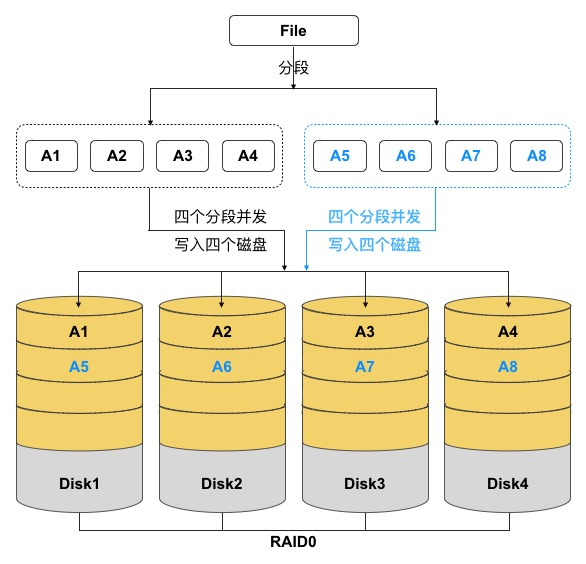

分布式存储客户端将展现给用户的数据格式转换为可存储于存储池内的对象（Object），即数据以对象的方式存储于集群。

UCloudStack 分布式存储支持数据条带化特性，客户端将数据写入存储集群前会先进行条带化处理，即将数据切分为多个数据小块——【条带单元】，并将条带单元并行写入一组对象集（Object-Set），对象集写满后会使用新的对象集来存储后续的条带单元。由于 Object 被映射到不同的 PG 并进一步映射到不同 OSD 磁盘，可以分别以最大写入速度以并发 I/O 的方式写入到一组 OSD 设备中，结合多磁盘设备的吞吐量达到更高的读/写性能。

* **条带单元**

  数据条带化后的数据块，多个条带单元组成一个对象。

* **条带大小**

  条带单元的单位大小（如 1MB），除最后一个条带单元，通常对象中条带单元大小相同。

* **条带数**

  指一个对象集上的对象数量，客户端把多个条带单元写入由条带数量确定的对象集上。

* **对象集**

  一组对象，由多个对象组成，一起表示数据的一个连续部分，集合中的对象数量与条带数相同。

* **对象大小**

  用于标识对象集中一个对象的大小，对象大小是条带大小的整倍数，通常为 2MB 或 4MB 。

文件的数据被分成条带单位，连续的条带单位存储在对象集中的对象上。对象集中的对象数量与条带数相同，存储的文件数据的对象可能会超过对象集，因此在对象集写满后，将使用新的对象集存储后续文件数据。

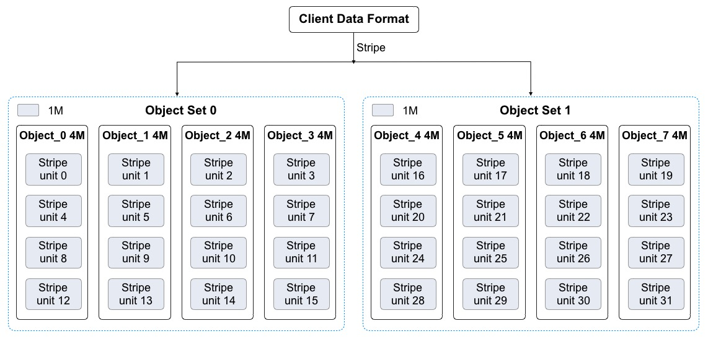

在分布式存储系统中，三个重要参数决定系统如何条带化数据，包括对象大小、条带大小、条带数量。假设对象大小为 4M 、条带单元大小为 1M 、条带数量为 4 ，即一个对象集中有 4 个对象，每个对象可写入 4 个条带单元。

如上图所示，客户端将数据条带化到对象集 `Object Set 0` ，由于他包含 4 个对象，条带单元会以 4 个为一个循环，依次写入到 4 个对象中。如条带单元 `Stirpe unit 0` 会写入到 `Object_0` ， `Stirpe unit 3` 会按顺序写入到 `Object_3` ，写入完成后，客户端会确认对象集 `Object Set 0` 是否已满。

* 若对象集未满，客户端会再从第一个对象起写入条带，如条带单元 `Stirpe unit 4` 会写入到 `Object_0` ，`Stirpe unit 6` 会按顺序写入到 `Object_2` ；
* 若对象集已满，客户端会创建新对象集，按照同样的方式写第二个对象集。如上图中的  `Object Set 1` 对象集，然后在新的对象集中的第一个对象 `Object_4` 开始写入第一个条带 `Stirpe unit 16` ，直到条带单元写完为止。
* 条带化处理写入数据的过程中，条带单元会以条带数量为循环并发写入不同的对象中，即会以最大写入速度并发写入至一组 OSD 中，整体提高分布式存储的读写性能。

分布式存储客户端将数据拆分为条带单元并映射到对象后，在通过 CRUSH 算法将对象映射到 PG ，并进一步映射到存储单元 OSD ，以对象文件的形式存储到硬盘上。由于多副本机制的存在，存储至 OSD 的对象会通过多副本分布策略，复到多份副本数据至其它 OSD ，以保证数据的安全性。通过条带化和多副本机制技术的结合，文件数据写入到分布式存储的路径为：客户端>条带化>PG>OSD>副本复制>写入完成，文件数据变化为：文件数据>条带单元>对象/对象副本 。

!> 注意：条带化与多副本机制无关，多副本是对条带化处理过的 Object 进行复制。 由于条带化会影响数据的存储的流程，数据被条带化至存储池后无法进行条带化调整。

#### 3.1.3.5 数据重均衡

UCloudSack 云平台分布式存储集群在写入数据时，会通过数据条带化、CRUSH 映射关系及多副本分布策略尽量保证数据对象在存储池中的均衡。随着存储集群的长期运行及对平台的运维管理，可能会导致存储池内的数据失衡，如存储节点和磁盘扩容、存储部分数据被删除、磁盘和主机故障等。

* 存储节点及磁盘扩容后，平台总存储容量增加，新增容量未承载数据存储，导致集群数据失衡；
* 用户删除虚拟机或云硬盘数据，导致集群内出现大量空闲空间；
* 磁盘和主机故障下线后，部分数据对象副本会重建至其它磁盘或主机，故障恢复后处于空闲状态。

为避免扩容及故障导致存储集群数据分布失衡，UCloudStack 分布式存储系统提供数据重均衡能力，在存储集群及磁盘数据发生变更后，通过 CRUSH 规则及时对数据的部分对象进行重新分发和均衡，使存储池中的对象数据尽量均衡，避免产生数据热点及资源浪费，提升存储系统的稳定性及资源利用率。

**（1）集群扩容重均衡**

平台支持水平扩展存储节点或在线向存储节点中增加磁盘的方式扩容存储集群的容量，即分布式存储集群支持在运行时增加 OSD 进行存储池扩容 。当集群容量达到阈值需要扩容时，可将新磁盘添加为集群的 OSD 并加入到集群的 CRUSH 运行图，平台会按照新 CRUSH 运行图重新均衡集群数据分布，将一些 PG 移入/移出多个 OSD 设备，使集群数据回到均衡状态。如下图所示：


在数据均衡过程中，仅会将现有 OSD 中的部分 PG 到迁移到新的 OSD 设备，不会迁移所有 PG ，尽量让所有 OSD 均腾出部分容量空间，保证所有 OSD 的对象数据分布相对均衡。如上图中新增 `OSD 4` 和 `OSD 5` 后，有三个 PG（PG #4、PG #9、PG #14） 迁移到 `OSD 4 `，三个 PG （PG #5、PG #10、PG #15）迁移到  `OSD 5 ` ，使五个 OSD 中映射的 PG 均为 3 个。为避免 PG 迁移导致集群性能整体降低，**存储系统会提高用户读写请求的优先级**，在系统空闲时间进行 PG 迁移操作。

> PG 在迁移过程中，原 OSD 会继续提供服务，直到 PG 迁移完成才将数对象写入新 OSD 设备。

**（2）集群容量缩减重均衡**

存储集群在运行过程中可能需要缩减集群容量或替换硬件，平台支持在线删除 OSD 及节点下线，用于缩减集群容量或进入运维模式。当 OSD 被在集群中被删除时，存储系统会根据 CRUSH 运行图重新均衡集群数据分布，将被删除的 OSD 上的 PG 迁移至其它相对空闲的 OSD 设备上，使集群回到均衡状态。如下图所示：


在数据均衡过程中，仅会将被删除 OSD 上的 PG 迁移至相对空闲的 OSD 设备，尽量保证所有 OSD 的对象数据分布相对均衡。如上图中即将被删除的  `OSD 4` 和 `OSD 5` 上共映射 6 个 PG ，删除后分别分有 2 个 PG 会被迁移至剩余 3 个 OSD 中，使 3 个 OSD 中映射的 PG 均为 5 个。

**（3）故障数据重均衡**

分布式存储在长期运行中会存在磁盘、节点的物理损坏、系统崩溃及网络中断等故障，均会中断节点的存储服务。存储集群提供容错方法来管理软硬件，PG 作为对象与 OSD 的中间逻辑层，可保证数据对象不会直接绑死到一个 OSD 设备，意味着集群可在“降级”模式下继续提供服务。详见[数据故障重建](#_3136-数据故障重建)。

!> **通过数据重均衡机制，可支持分布式存储集群平滑扩容，包括横向扩容和纵向扩容，即可以在线添加存储节点及存储磁盘。**

 <span id="_3136-数据故障重建"></span>

#### 3.1.3.6 数据故障重建

根据多副本机制，存储集群在把数据对象通过 CRUSH 写入到指定 OSD 后，OSD 会通过运行图计算副本位置，并将数据副本写入到指定 OSD 设备中，通常数据对象会被分配至不同故障域中，保证数据安全性和可用性。

当磁盘损坏或节点故障时，即代表节点部分/全部 OSD 设备下线或无法为 PG 内对象提供存储服务，同时也表示有部分对象数据的副本数量不完整，如 3 副本可能因为磁盘损坏变为 2 副本。故障时对象数据的 PG 被置为“降级”模式继续提供存储服务，并开始进行数据副本重建操作，按照最新 CRUSH 运行图将故障节点或磁盘上的对象数据重映射到其它 OSD 设备上，即重新复制对象数据的副本至其它  OSD 设备，保证副本数量与存储池设置一致。

故障数据的副本重建时会遵循存储集群多副本分布策略，选择存储桶中定义的 OSD 作为对象副本的位置，尽量让同一对象数据的多副本间位置互斥，避免多副本位于同一个故障域，保证数据安全性。同时为提高故障数据的重建速度，多个副本重建任务的 I/O 会并发进行，实现故障数据的快速重建。

故障节点或磁盘恢复后，OSD 被重新加入至集群的 CRUSH 运行图，平台会按照新 CRUSH 运行图重新均衡集群数据分布，将一些 PG 移入/移出多个 OSD 设备，使集群数据回到均衡状态。为保证存储集群的运营性能，副本数据恢复及迁移时，会限制恢复请求数、线程数、对象块尺寸，**并提高用户读写请求的优先级**，保证集群可用性和运行性能。

#### 3.1.3.7 数据清洗

分布式存储集群在长期运行及数据重平衡的过程中，可能会产生一些脏数据、缺陷文件及系统错误数据。如一块 OSD 磁盘损坏，集群在重均衡后重建数据至其它 OSD 设备，当故障 OSD 设备恢复后可能还存储着之前数据的副本，这些副本数据在集群重新平衡时需及时进行清洗。

分布式存储的 OSD 守护进程可进行 PG 内对象的清洗，即 OSD 会比较 PG 内不同 OSD 的各对象副本元数据，如果发现有脏数据、文件系统错误及磁盘坏扇区，会对其进行深度清洗，以确保数据的完整性。

#### 3.1.3.8 可用性和可扩展性

为构建全平台高可用的分布式存储服务，保证虚拟化计算数据存储的可用性和可靠性，分布式存储系统从多方面保证存储服务的稳健运行。

* **消除集中控制网关**

  使客户端直接和存储单元 OSD 守护进程交互，自动在各存储节点上创建数据副本确保数据安全性和可用性。

* **CRUSH 算法**

  为消除中央集权控制带来的问题，分布式存储客户端和 OSD 守护进程均使用 CRUSH 算法按需计算对象的位置信息，同时让大部分数据管理任务在客户端和 OSD 处理，提高平台的可伸缩性。

* **集群映射图**

  监视器维护存储集群中  Object、PG 及 OSD 间的映射图，包括集群成员、状态、变更、以及存储集群的整体健康状况。

* **高可用监视器**

  支持监视器集群，当一个监视器因为延时或错误导致状态不一致时，存储系统会通过算法将集群内监视器状态达成一致。

* **超大规模扩展**

  智能程序支撑超大规模扩展，支持 EB 级存储能力。OSD 和客户端能直接感知集群中的其它 OSD 及监视器信息，使客户端和 OSD 可按需直接和其它 OSD 及监视器进行交互。这种机制使得 OSD 能够充分利用每个节点的 CPU/RAM ，将中心化的任务分摊到各个节点去完成，支持大规模集群扩展。

  （1）OSD 直接服务于客户端，消除中央控制器，提升整体集群的性能和可扩展性。

  （2）OSD 之间相互监测彼此的健康状态，并主动更新状态给监视器，使监视器可以更轻量化。

  （3）OSD 守护进程可以比较副本元数据，并清理缺陷或错误文件。

  （4）OSD 使用 CRUSH 算法，用于计算数据副本的位置，包括数据重平衡。

* **多副本机制**

  凭借执行数据副本复制的能力，OSD 进程可减轻存储客户端的负担，同时确保高数据可用性和数据安全性。副本复制能力详见[多副本机制](#_3133-多副本机制)。

* **集群水平扩容**

  支持存储节点水平扩展、增量扩容及数据自动平衡性，保证存储系统的高扩展性和可用性。

* **SLA 保证**

  支持不间断数据存储和访问服务，SLA 为 99.95% ，保证存储系统的高可用性。

* **SPDK 解决方案**

  结合 SPDK 技术支持高性能块存储服务，IOPS 和吞吐量随存储容量规模线性增长，保证响应时延。

* **高可用物理网络**

  全万兆底层存储堆叠网络，保证数据读写的 IO 性能及吞吐率，同时保证存储服务的高可用性。

#### 3.1.3 9 块存储服务

UCloudStack 基于分布式存储系统为云平台租户提供块设备，即云硬盘服务，为计算虚拟化的虚拟机提供持久化存储空间的块设备。具有独立的生命周期，支持随意绑定/解绑至多个虚拟机使用，并能够在存储空间不足时对云硬盘进行扩容，基于网络分布式访问，为云主机提供高安全、高可靠、高性能及可扩展的数据磁盘。

为提高性能，分布式存储将块设备映像条带化到存储集群内的多个对象，映射到多个 PG 并分布至集群底层的 OSD 设备中，整体提升块设备的性能。

云平台为租户提供普通和高性能两种类型的云硬盘，普通云硬盘使用 SATA/SAS 磁盘作为存储介质，性能型云硬盘使用 SSD/NVME 磁盘作为存储介质。普通云硬盘和高性能云硬盘均通过条带化、PG映射及三副本机制进行存储，并在分布式存储系统的基础之上通过块存储系统接口为用户提供云硬盘资源及全生命周期管理。

支持组建多个存储集群，如 SATA 存储集群和 SSD 存储集群，并支持虚拟机跨集群挂载集群上的块存储服务。

* 分布式块存储服务直接通过物理网络进行挂载，无需通过 overlay 网络进行挂载和传输。
* 通过 libvirt 融合分布式存储 rbd 和 qemu ，qemu 通过 librbd 操作分布式存储。
* 虚拟化进程与分布式存储进程通过本机 & 跨物理机内网进行通信。

不同存储集群间，对象数据的存储完全隔离。一个存储集群中不同块存储设备的存储策略完全隔离，互不干扰。分布式存储系统为虚拟机系统盘、镜像及云硬盘提供统一存储及管理，提高虚拟机与系统盘、云硬盘的数据传输入效率，实现虚拟机快速创建及恢复，并支持系统盘和云硬盘的在线快速扩容和迁移。 

在本地可通过备份及快照技术，将本地数据定时增量备份服务器或对象存储服务。在数据丢失或损坏时，可通过快照和备份快速恢复本地业务的数据，实现业务分钟级恢复，包括数据库数据、应用数据及文件目录数据等。

#### 3.1.3.10 自动精简配置

自动精简配置（Thin Provisioning），又称【超额申请】或【运行时空间】，是一种利用虚拟化技术减少物理存储部署的技术。通过自动精简配置，可以用较小的物理容量提供较大容量的虚拟存储空间，且真实的物理容量会随着数据量的增长及时扩展，可最大限度提升存储空间的利用率，并带来更大的投资回报。

UCloudStack 云平台分布式存储系统支持自动精简配置，在创建块存储服务时，分配逻辑虚拟容量呈现给用户，当用户向逻辑存储容量中写入数据时，按照存储容量分配策略从物理空间分配实际容量。如一个用户创建的云硬盘为 1TB 容量，存储系统会为用户分配并呈现 1TB 的逻辑卷，仅当用户在云硬盘中写入数据时，才会真正的分配物理磁盘容量。若用户在云硬盘上存储的数据为 100GB ，则云硬盘仅使用存储池的 100GB 容量，剩余的 900GB 容量可以供其它用户使用。

云平台分布式存储系统支持对真实物理容量的监控，可提供真实物理可用容量及已使用容量。通常建议真实使用容量超过总容量的 80% 时对存储集群进行扩容。自动精简配置类似 CPU 超分的概念，即可供租户创建使用的存储容量可大于物理总容量，自动按需分配物理存储空间给块存储设备，消除已分配但未使用的存储空间浪费。

通过自动精简配置，平台管理员无需对业务存储规模进行细化且准确预判，更不需提前为每个业务做精细的空间资源规划和准备，配合逻辑存储卷的容量分配策略，有效提升运维效率及存储空间的整体利用率。

#### 3.1.3.11 性能指标

虚拟化存储为虚拟化计算平台提供高可靠、高扩展、高安全及高性能的基础存储资源及存储服务。通常采用吞吐量、IOPS 及 IO 时延 3 个指标数据衡量存储系统及服务的性能。

* **IOPS（Input/Output Operations Per Second）：每秒读写次数，用于计算机存储设备性能测试的量测方式，根据不同测试倾向性，主要包括 4 种类型的 IOPS 指标。**
  * 随机读 IOPS ：每秒平均随机读取次数。
  * 随机写 IOPS ：每秒平均随机写入次数。
  * 顺序读 IOPS ：每秒平均顺序读取次数。
  * 顺序写 IOPS ：每秒平均顺序写入次数。

- **吞吐量：每秒读写 IO 流量，磁盘在单位时间内能成功传递的平均数据量，单位通常为 MB/s 或 MBps** 。
- **IO时延：IO 提交到 IO 完成的时间，指一次 IO 请求发出，到该 IO 请求完成所耗费的时间。**

在性能指标数据中， IOPS 与吞吐量越大性能越好，时延越低性能越好。UCloudStack 平台分布式存储可提供普通云盘和 SSD 云盘两种类型的块存储产品。SSD 云盘底层以 SSD 固态硬盘作为存储介质，普通云盘底层以 HDD 机械磁盘作为存储介质。两种产品的云盘性能对比数据如下表所示：

| 参数       | SSD 云盘                                            | 普通云盘                                              |
| ---------- | --------------------------------------------------- | ----------------------------------------------------- |
| 单盘 IOPS  | 读 22000 ，写 1800                                  | 读 5000 ，写 600                                      |
| 单盘吞吐量 | 读 2100MBps ，写 650MBps                            | 读 1000MBps ，写 600MBps                              |
| 平均时延   | 0.3~2ms                                             | 1~3ms                                                 |
| 测试环境   | 30 块 OSD ，每 OSD 为一块 SSD 盘<br/>1TB SSD 云硬盘 | 30 块 OSD ，每 OSD 为一块 SATA 盘<br/>1TB SATA 云硬盘 |

SSD 云盘的性能会随着磁盘容量增加而线性增长，平台支持配置块存储设备的 QoS ，如读 IOPS 、写 IOPS 、读吞吐、写吞吐，用于避免用户间争取存储资源性能，保证存储集群所有块存储设备的可用性。

性能测试数据的工具为 [fio ](https://github.com/axboe/fio) 软件，并采用 libaio 引擎进行测试 ，虚拟机系统版本 CentOS7.4（ 2 核 4G ），常见测试用例如下：

（1）时延性能测试：

```bash
#读时延：  
fio -direct=1 -iodepth=1 -rw=read -ioengine=libaio -bs=4k -size=200G -numjobs=1 -runtime=200 -group_reporting -name=test -filename=/dev/vdb   
#写时延：  
fio -direct=1 -iodepth=1 -rw=write -ioengine=libaio -bs=4k -size=200G -numjobs=1 -runtime=200 -group_reporting -name=test -filename=/dev/vdb
```

（2）吞吐性能测试：

```bash
#读带宽：  
fio -direct=1 -iodepth=32 -rw=read -ioengine=libaio -bs=256k -size=200G -numjobs=4 -runtime=200 -group_reporting -name=test -filename=/dev/vdb  
#写带宽：   
fio -direct=1 -iodepth=32 -rw=write -ioengine=libaio -bs=256k -size=200G -numjobs=4 -runtime=200 -group_reporting -name=test -filename=/dev/vdb
```

（3）IOPS性能测试 (4k，4*32队列，随机读写)：

```bash
#读IOPS：  
fio -direct=1 -iodepth=32 -rw=randread  -ioengine=libaio -bs=4k -size=200G -numjobs=4 -runtime=200 -group_reporting -name=test -filename=/dev/vdb  
#写IOPS：    
fio -direct=1 -iodepth=32 -rw=randwrite -ioengine=libaio -bs=4k -size=200G -numjobs=4 -runtime=200 -group_reporting -name=test -filename=/dev/vdb
```


### 3.1.4 网络虚拟化

网络是虚拟化计算和分布式存储为云平台提供服务时不可或缺的核心部分，通常可采用硬件定义的 UnderLay 网络或软件定义的 OverLay 网络与虚拟化计算对接，为云平台提供多应用场景的网络及信息传输服务。

* **UnderLay 网络**

  传统 IT 架构中硬件方式定义的单层物理网络，由物理设备和物理链路组成，即当前数据中心物理基础转发架构层——物理底层承载网，包括一切现有的传统网络技术，负责互联互通。常见的物理设备有交换机、路由器、负载均衡、防火墙、IDS/IPS 等。

* **OverLay 网络**

  虚拟网络，基于底层 UnderLay 网络架构上叠加隧道技术构建的逻辑网络，实现网络资源虚拟化，以软件的方式在虚拟化平台上完整再现物理网络的功能。

  OverLay 网络的核心是隧道技术，只负责虚拟化计算资源的网络通信，具有独立的控制面和转发面（SDN 的核心理念）。对于连接到 OverLay 的终端设备（例如服务器）来说，物理网络是透明的，从而可以实现承载网络和业务网络的分离。

作为云计算核心技术之一的虚拟化计算已被数据中心普遍应用，UnderLay 网络和 OverLay 网络均可为虚拟化计算提供网络服务。随着业务规模的增长，虚拟机数量的快速增长和迁移已成为一个常态性业务，如果采用传统 IT 架构中硬件方式定义的 UnderLay 网络，可能会给云平台带来一些问题：

- **网络隔离能力限制**

  UnderLay 主流的网络隔离技术是 VLAN ，由于IEEE 802.1Q 中定义的 `VLAN ID ` 为 12 比特，仅能实现 4096 个 VLAN ，无法满足大二层网络中标识大量租户或租户群的需求。同时由于 Vlan 技术会导致未知目的广播数据在整网泛滥，无节制消耗网络交换能力与带宽，仅适合小规模的云计算虚拟化环境。

- **虚拟机迁移范围受网络架构限制**

  为保证虚拟机热迁移，需保持虚拟机的 IP 地址和 MAC 地址保持不变，即要求业务网络为二层网络且需具备多路径的冗余备份和可靠性。传统物理网络 STP、设备虚拟化等技术部署反锁且不适合大规模网络，限制虚拟机的网络扩展性，通常仅适用于数据中心内部网络。

  为大规模网络扩展的 TRILL/SPB/FabricPath/VPLS 等技术，虽可解决规模问题，但均需网络中的软硬件进行升级而支持此类新技术，增加云计算平台的部署成本。

- **虚拟机规模受网络规格限制**

  在传统二层网络环境下，数据报文是通过查询 MAC 地址表进行二层转发，而网络设备 MAC 地址表的容量限制了虚拟机的数量。若选择适配较大容量 MAC 地址表的网络设备，则会提升网络建设成本。

* **部署缓慢且僵化**

  虚拟化计算快速部署及灵活扩展特性上，均需网络提供强有力的支撑。传统网络中虚拟机部署业务及上线，均需对系统及网络设备进行繁琐的配置，甚至需要改变物理设备部署位置，降低业务发布效率的同时，难以快速响应新业务灵活部署及发布。

基于上述的问题和场景，可在 UnderLay 网络基础架构上采用 OverLay 网络解决方案，构建大二层虚拟网络，实现业务系统间网络隔离，并通过 NFV 实现网络中所需的各类网络功能和资源，按需灵活的调度资源，功能功能所见即所得，从而实现云计算平台中的网络虚拟化，满足虚拟化计算对网络的能力需求。

* **网络隔离能力**

  OverLay 网络虚拟化提供多种隧道隔离技术，如 VXLAN 、GRE、NVGRE、STT 等，均引入类似 Vlan 的用户隔离标识，并对隔离标识进行极大扩展，如 VXLAN 支持 24 比特，可支持千万级以上的网络隔离标识。

* **隧道路由网络**

  OverLay 通过隧道技术，将二层以太报文封装在三层 IP 报文之上，通过路由的方式在网络中分发传输。路由网络本身无特殊网络结构限制，具备大规模扩展能力和高性能转发能力，同时路由三层网络会缩小二层广播域，大幅降低网络广播风暴的风险，具备很强的故障自愈能力和负载均衡能力。通过 OverLay 技术的路由网络，虚拟机迁移不受网络架构限制，企业部署的现有网络便可用于支撑新的云计算业务。

* **大规模虚拟机规模**

  虚拟机发出的数据包封装在 IP 数据包中，对网络只表现为封装后的网络参数，即隧道端点的地址。因此极大的降低大二层网络（UnderLay）对 MAC 地址表容量的需求，可支撑大规模虚拟机场景。

* **快速灵活部署**

  基础网络不感知虚拟网络业务变化，OverLay 网络中应用部署的位置将不受限制，网络功能所见即所得，支持即插即用、自动配置下发及自动运行，可快速并灵活的部署业务，并支持业务在虚拟网络中进行迁移和变更。

网络虚拟化通过结合软件定义网络（SDN Software Defined Network）和网络功能虚拟化（NFV Network Function Virtualization）提供服务。SDN 是一种全新的网络架构，核心思想是通过标准化技术（如 openflow ）将网络控制面和数据转发面进行分离，由控制器统一计算并下发流表，进而实现对网络流量集中化、灵活化、细粒度的控制。NFV 是指具体网络设备的虚拟化，使用通用服务器和软件实现并运行网络功能，如虚拟网卡、虚拟交换机、虚拟防火墙等，实现网络功能灵活配置、快速部署及定制编程能力。

SDN 和 NFV 是高度互补关系，各有侧重，分别从不同角度提供解决方案满足不同虚拟化场景的网络需求。SDN 通过将控制平台和数据转发面分离实现集中的网络控制，而 NFV 技术是通过软硬件分离，实现网络功能虚拟化。二者的关系如下：

* SDN 技术在流量路由方面所提供的灵活性，结合 NFV 的虚拟化架构，可更好地提升网络的效率，提高网络整体的敏捷性。
* NFV 不依赖 SDN ，可在无 SDN 的情况下进行虚拟化部署，但 SDN 中控制和数据转发分离可改善 NFV 网络性能、易用性及可维护性，可实现 NFV 的快速部署及网络构建。

UCloudStack 通过 `OVS+VXLAN `  的 OverLay 网络及软件定义的 SDN 控制器，构建大二层虚拟网络，实现业务系统间网络隔离；并通过 NFV 实现网络中所需的各类网络功能和资源，用于对接 KVM 虚拟化计算服务，结合分布式网络架构为平台提供高可用、高性能且功能丰富的网络虚拟化能力及管理。

#### 3.1.4.1 分布式网络

UCloudStack 基于 [OVS](http://www.openvswitch.org/)（ Open vSwitch）组件，通过 [VXLAN](https://tools.ietf.org/html/rfc7348) 隧道封装技术实现隔离的虚拟网络，并结合软件定义的 SDN 控制器，为虚拟化计算平台提供一套纯软件定义、可运行于 x86 通用服务器的高性能、高可用、高可靠、易管理及较低成本的分布式网络解决方案。

作为云平台的核心组成部分，为云平台所有虚拟资源提供全方位的网络转发及通信能力，提供与物理网络相同的功能特性和性能保证，且通过虚拟化提供网络资源分配、灵活部署及自动恢复等自动化运维能力，满足网络功能的虚拟化的同时，保证网络的可靠性。

分布式网络通过纯软件定义的方式在 x86 通用服务器上提供云计算所有网络功能，无需网络硬件设备支撑 SDN 或 OverLay 特性，即所有虚拟网功能特性及业务流量转发均由计算节点中的虚拟网络组件提供，物理网络交换机设备仅承载平台物理节点间通信的数据转发，因此物理网络仅需支持 Vlan、Trunk、LACP、IPV6、堆叠等特性即可。

平台虚拟化网络功能所见即所得，用户无需关第底层设备类型及网络架构，即可在云平台构建使用虚拟网络服务，如虚拟私有网络 VPC 、子网、弹性网卡、外网 IP、NAT 网关、负载均衡、防火墙及 VPN 等。云平台用户像使用物理网络一样的方式使用虚拟网络，如将虚拟机加入一个隔离网络、分配 IP 地址、配置外网 IP 访问外网，或者通过 NAT 网关使多台虚拟机通过一个 外网 IP 地址访问外网等。云平台管理员可以像物理网络的管理员一样，对全局网络资源进行统一配置、监控及管理，如 IP 地址规划、外网 IP 地址池管理、网络设备资源管理及 QoS 配置等。

#### 3.1.4.2 分布式架构

UCloudStack 采用 OVS 作为虚拟交换机，VXLAN 隧道作为 OverLay 网络隔离手段，通过三层协议封装二层协议，用于定义虚拟私有网络 VPC 及不同虚拟机 IP 地址之间数据包的封装和转发。

私有网络（ VPC ——Virtual Private Cloud ）是一个属于用户的、逻辑隔离的二层网络广播域环境。在一个私有网络内，用户可以构建并管理多个三层网络，即子网（ Subnet ），包括网络拓扑、IP 网段、IP 地址、网关等虚拟资源作为租户虚拟机业务的网络通信载体。

私有网络 VPC 是虚拟化网络的核心，为云平台虚拟机提供内网服务，包括网络广播域、IP 网段、IP 地址等，是所有 NVF 虚拟网络功能的基础。VPC 网络基于 VXLAN 协议，不同网络之间二层完全隔离。

* 平台通过 VXLAN 定义并封装的 VPC 网络使用 VXLAN 头部 **VNI ( VXLAN Network Identifier， 3 字节)** 字段作为全局唯一网络标识符，即 VPCID （类似物理网络中的 VlanID）。
* 根据 [VXLAN RFC 7348](https://tools.ietf.org/html/rfc7348) 的描述，VNI 字段包含一个由 3 个 8 位字节组成的数字封装器，用于验证和标识 VXLAN 数据包的来源 。
* VNI 字段长度为 24 位，每一个 VXLAN 隧道号对应一个 VPC网络，即平台可支持 1600 （ 2^24^ ）万个 VPC 网络。

 UCloudStack OverLay 网络数据面组件以分布式的方式部署于每个计算节点服务器，结合自研的 SDN 虚拟网络控制器下发流表，提供虚拟网络及 NFV 组件的实现、隔离、流表分发、数据封装及数据传输等功能，实现可弹性、高安全、高可靠及绝对隔离的虚拟化网络。如下图所示：


OVS 是虚拟网络数据通路的核心路径，每个计算节点开始提供服务时，SDN 控制器会自动下发属于当前节点的流表到虚拟交换机，告知每个虚拟资源的网络应该如何通信。VXLAN 则提供虚拟网络跨物理主机访问时的数据封装及网络隧道。OVS 在所有计算节点上为分布式结构，[SDN 控制器 ](#_3144-SDN-控制器)所属的管理控制模块为集群架构，结合物理网络及链路的冗余架构，整体提升虚拟网络的可用性。

如上图所示，云平台 OverLay 网络组件分布式运行在所有计算节点，即每个计算节点均部署 `OVS+VXLAN `  等组件：

- 虚拟网络流表分发服务为高可用架构，仅做流表分发不透传生产网络传输。
- 分布式架构，无集中网络转发节点，所有生产网络仅在计算节点上传输，无需通过管理服务或流表分发服务进行转发，避免集中网络转发节点成为性能瓶颈。
- 每个计算节点仅承载运行在本机的虚拟机网络转发和传输，单节点故障，不影响其它节点的虚拟网络通信。
- 管理服务和流表分发服务故障，不影响已部署好的虚拟资源运行及通信。

* 分布式存储直接通过物理网络进行挂载，无需通过 OverLay 网络进行挂载和传输，提升存储性能和可用性。
  - 通过 libvirt 融合分布式存储 rbd 和 qemu ，qemu 通过 librbd 操作分布式存储；
  - 虚拟化进程与分布式存储进程通过本机 & 跨物理机内网进行通信。

如物理集群章节所描述，云平台管理服务仅作为管理角色，不承担网络组件部署及生产网络传输。分布式网络架构将业务数据传输分散至各个计算节点，除业务逻辑等北向流量需要管理服务外，所有虚拟化资源的业务实现等南向流量均分布在计算节点或存储节点上，即平台业务扩展并不受管理节点数量限制。

#### 3.1.4.3 通信机制

云平台通过 VXLAN 隧道及分布式网络架构提供完全隔离的虚拟网络，通过定义虚拟私有网络为虚拟化计算提供与物理网络 VLAN 类似的网络功能，具体通信原理如下：

* 相同 VPC 网络中，同一个物理主机上的虚拟资源可直接通过 OVS 进行网络数据通信；
* 相同 VPC 网络中，跨物理主机虚拟资源间的数据均通过 VXLAN 隧道封装送至物理网络上进行传输；
* 不同 VPC 间使用的隧道 ID 不同，在网络上处于两个逻辑的路由平面，使 VPC 间的网络天然隔离，即不同 VPC  网络间虚拟资源不可通信；
* 不同 VPC 网络间资源内网不通，需通过【**弹性网卡**】的路由功能将不同 VPC 间的网络打通。

如分布式网络架构图所示，假设 VM1、VM3、VM4 属于同一个 VPC 网络 ，VM2 属于独立的 VPC 网络。则虚拟机内网和外网通信机制如下：

**（1）内网络通信及限制**

* VM1 和 VM2 属于不同 VPC 网络，由于 VPC 网络的隔离性，VM1 无法和 VM2 进行网络通信。
* VM3 和 VM4 属于同一个 VPC 网络且在同一台物理主机，可以直接通过 `Open vSwitch` 的流表进行通信。
* VM1 和 VM3/VM4 属于同一个 VPC 网络，默认可进行网络通信，但由于 VM1 与其它两个 VM 不在同一台物理主机，则需要借助 VXLAN 隧道进行数据封装，并通过物理网络进行传输，具体过程如下：
  * VM1 发送数据至 Compute1  的 OVS ，OVS 查询流表 VPC 信息，得知目的虚拟机 VM3 位于 Compute2 节点；
  * OVS 将数据包发送至 `Compute1-vtep0` 设备，对数据包进行 VXLAN 三层封装，并在两个节点 `vtep0` 间建立 VXLAN 隧道；
  * VXLAN 封装数据报文后，根据此 IP 包的目的地址及路由信息，将报文通过 Compute1 的网络接口及物理网络 `Switch` 送达 Compute2 节点；
  * `Compute2-vtep0`  设备通过物理网络收到 VXLAN 报文后，对数据包进行 VXLAN 解封装；
  * 数据报文解封装后，通过 OVS 流表 VPC 信息，将报文转发至 VM3/VM4 ；
* VM2 和 VM3/VM4 属于不同 VPC 网络，由于 VPC 网络隔离性无法直接进行网络通信。

**（2）外网络通信及限制**

如上图所示，本文假设  VM1 已绑定一个外网 IP 地址，通过外网 IP 访问外网为例进行描述，VM 通过 NAT 网关进行外网访问可参照【NAT 网关】。

* 用户通过云平台申请外网 IP 并绑定至虚拟机 VM1 时，云平台系统直接将外网 IP 及网关相关信息配置至虚拟机默认外网虚拟网卡  `eth1`  接口；
* 虚拟机需要访问外网时将数据包发送至 OVS ，OVS 查询流表外网 IP 路由相关信息，将数据包直接发送至 Compute1 外网网卡，通过物理网络配置的路由或 Vlan 与互联网进行通信；
* 外网需要访问 VM1 时，数据包会通过物理网络 Compute1 的外网网卡发送至 OVS ，OVS 查询流表外网 IP 路由相关信息，将数据包直接发送至 VM1 外网虚拟网卡  `eth1`  接口。

!> 网络通信会受安全组规则的限制，即在流量进出虚拟网卡时均会根据安全组规则再次进行筛选。

 <span id="_3144-SDN-控制器"></span>

#### 3.1.4.4 SDN 控制器

SDN 控制器即 OverLay 虚拟网络的控制面，负责虚拟网络流表生成及下发管理，通过控制器可自动对云平台的虚拟网络功能和组件进行参数及流表规则配置，无需人工干预，提升平台网络管控能力及运维效率。

每个计算节点开始提供服务时，控制器会自动生成并下发属于当前节点的流表到节点虚拟交换机，告知每个虚拟资源的网络应该如何通信。网络控制器和智能调度系统一样，由【Schedule Manager 核心调度及管理模块】提供虚拟网络控制及管理，支持集群架构，结合物理网络及链路的冗余架构，整体提升虚拟网络的可用性。

* 每一个地域仅需部署一套高可用（主备模式）的 Schedule Manager ，可在两台或多台节点上进行部署。
* 当部署网络控制模块所在的主计算节点服务器物理故障时，部署调度模块的备计算节点将自动接替调度服务，保证核心调度及流表控制服务的可用性。
* 网络控制器仅承载流表分发和控制服务，不透传生产网络传输。

网络控制器高可用架构全部故障，仅影响新建虚拟资源的流表下发及管理，不影响已部署的虚拟资源运行及通信。由于网络控制器及云管理服务不承载生产网络转发和传输，均由分布在所有计算节点的 OVS 组件进行所属虚拟机的网络传输，所以计算节点在水平扩展的同时，承载生产流量的虚拟网络也同步进行了扩展，整体提升平台的可用性和可靠性。

#### 3.1.4.5 网络功能简介

UCloudStack 通过软件定义网络 （ SDN ）对传统数据中心物理网络进行虚拟化，虚拟化网络功能所见即所得，用户无需关第底层设备类型及网络架构，即可在云平台构建使用虚拟网络服务，包括私有网络 VPC 、网络隔离、弹性网卡、外网 IP、物理 IP、NAT 网关、负载均衡、防火墙（安全组）及 VPN 连接等网络服务，承载云平台上虚拟资源的网络通信及安全。

* **VPC 网络**

  软件定义虚拟专有网络，用于租户间数据隔离。提供自定义 VPC 网络、子网规划及网络拓朴，可将虚拟机加入私有网络和子网，为虚拟机提供二层网络服务。

* **网络隔离能能力**

  由 VPC 提供的逻辑隔离的二层网络广播域环境，为云平台用户或子帐号提供网络隔离能力，不同 VPC 网络间网络完全隔离，不可进行通信。

* **弹性网卡**

  一种可随时附加到虚拟机的弹性网络接口，支持绑定和解绑，可在多个虚拟机间灵活迁移，为虚拟机提供高可用集群搭建能力，同时可实现精细化网络管理及廉价故障转移方案。

* **外网 IP**

  用于 VM、负载均衡及 NAT 网关等资源的互联网接入。支持多运营商线路接入并可调整外网 IP 的带宽上限。

* **物理 IP**

  物理网络的 Vlan IP 地址，用于虚拟机、NAT 网关、负载均衡等资源的物理网络接入，提供云平台与 IDC 数据中心的混合接入，用于打通虚拟网络和物理网络的通信。

* **NAT 网关**

  企业级 VPC 网关，为云平台资源提供 SNAT 和 DNAT 代理，支持外网和物理网两种网络地址转换能力，并支持普通和白名单两种资源网络出口模式。

* **负载均衡**

  基于 TCP/UDP/HTTP/HTTPS 协议将网络访问流量在多台虚拟机间自动分配的控制服务，类似于传统物理网络的硬件负载均衡器.用于多台虚拟机间实现流量负载及高可用，提供内外网 4 层和 7 层监听及健康检查服务。

* **安全组**

  虚拟防火墙，提供出入双方向流量访问控制规则，定义哪些网络或协议能访问资源，用于限制虚拟资源的网络访问流量，支持 TCP 、UDP 、ICMP 及多种应用协议，为云平台提供必要的安全保障。

* **VPN**

  VPN 网关服务，提供可容灾的高可用 VPN 服务，配合 VPC、本地网关及公网服务三者共同使用。 用户可选用多种加密及认证算法，保证隧道的可靠性。

云平台虚拟网络为用户提供丰富的网络功能，同时也提升平台可运营及可运维性，为云平台管理员提供网络规划配置、监控、QoS 限制及网络资源管理，让管理员可以像管理物理网络一样管理虚拟网络。

* **网络规划配置**

  支持平台管理员对私有网络 IP 地址池、外网 IP 地址池、物理网络混合接入等进行对接及配置管理。

* **监控**

  支持平台管理员监控平台所有 IP 及网络资源的使用率、流量及可用性，保证平台的可用性。

* **网络 QoS**

  支持平台管理员配置网络 QoS ，用于控制和限制内/外网络的带宽，用于避免用户间争取网络资源性能，保证所有虚拟网络组件的可用性。

* **网络资源管理**

  支持平台管理员查看并管理平台所有的网络资源，包括物理网络资源和虚拟网络资源。

#### 3.1.4.6 性能指标

虚拟化网络为虚拟化计算平台提供高可靠、高性能、高可用的网络服务，通常采用入带宽和出带宽 2 个指标数据衡量虚拟网络的内外和外网性能。

* **入带宽：每秒下行的数据流量。**
* **出带宽：每秒上行的数据流量。**

在性能指标数据中，带宽指越大性能越好。UCloudStack 虚拟化网络可提供 VPC 内网和外网两种基础虚拟网络产品。性能指标数据如下表所示：

| 参数   | 内网       | 普通云盘     |
| ------ | ---------- | ------------ |
| 入带宽 | 3.89Gbit/s | 286.31Mbit/s |
| 出带宽 | 3.89Gbit/s | 73.85Mbit/s  |

平台支持配置内/网的 QoS ，如外网下载带宽、内网入口带宽、内网出口带宽，用于避免用户间争取网络资源性能，保证所有虚拟网络组件的可用性。

（1）内网性能测试数据的工具为 iperf3 ，常见测试用例如下：

* 服务端 (10.93.123.4)

  ```sh
  iperf3 -s
  ```

* 客户端 (10.93.123.6)

  ```sh
  iperf3 -c 10.93.123.4
  ```


（2）外网性能测试数据的工具为 speedtest-cli  ，在一台绑定外网 IP 地址的虚拟机上安装工具并进行测试。

## 3.2 复用公有云

UCloudStack 云平台基于 UCloud 公有云平台，复用公有云虚拟化核心组件，包括操作系统内核、KVM、QEMU 及 OVS 等组件。

## 3.3 信创云架构

UCloudStack 信创版私有云，提供通过信创互认证的 IaaS 和 PaaS 功能，兼容硬件、操作系统到上层应用的全信创生态。


## 3.4 快杰私有云

UCloudStack 快杰版基于软硬协同的技术方案，提供业界领先的计算、存储、网络服务，存储 IOPS 最高可达 120万。


# 4 产品功能架构

## 4.1 核心功能概念

### 4.1.1 地域

地域 ( Region ) 指 UCloudStack 云平台物理数据中心的地理区域，如上海、北京、杭州等。

* 不同地域间完全物理隔离，云平台资源创建后不能更换地域；
* 不同域域间网络完全隔离，资源内网不能互通，可通过公网或专线进行网络通信；
* 私有网络 VPC 和负载均衡服务支持相同地域跨可用区部署。

### 4.1.2 可用区

可用区 ( Availibility Zone )指在同一地域内，电力和网络互相独立的物理区域，如上海地域可用区 A 、可用区 B ，用于业务故障隔离。

* 一个可用区一般为一个机房或多个机房的一部分组合；
* 一个区域可包含多个可用区，不同可用区间一般相隔 30 公里左右；
* 同一地域可用区与可用区内网通过 DWDM 链路互通，保证网络延时；
* 私有网络 VPC 支持同一地域跨可用区部署，同一个 VPC 下的可用区资源之间内网互通；
* 私有网络负载均衡服务支持同一地域跨可用区部署：
  * 若业务对容灾要求较高，可将虚拟机部署在同一地域的不同可用区，实现跨可用区容灾；
  * 若业务虚拟机间要求较小的的网络时延，可将虚拟机部署在同一可用区内。

### 4.1.3 集群

集群 ( Set ) 是 UCloudStack 物理资源的逻辑划分，用于区分不同配置规格及不同存储类型的服务器节点。区域、可用区、集群、物理服务器的逻辑关系如下：

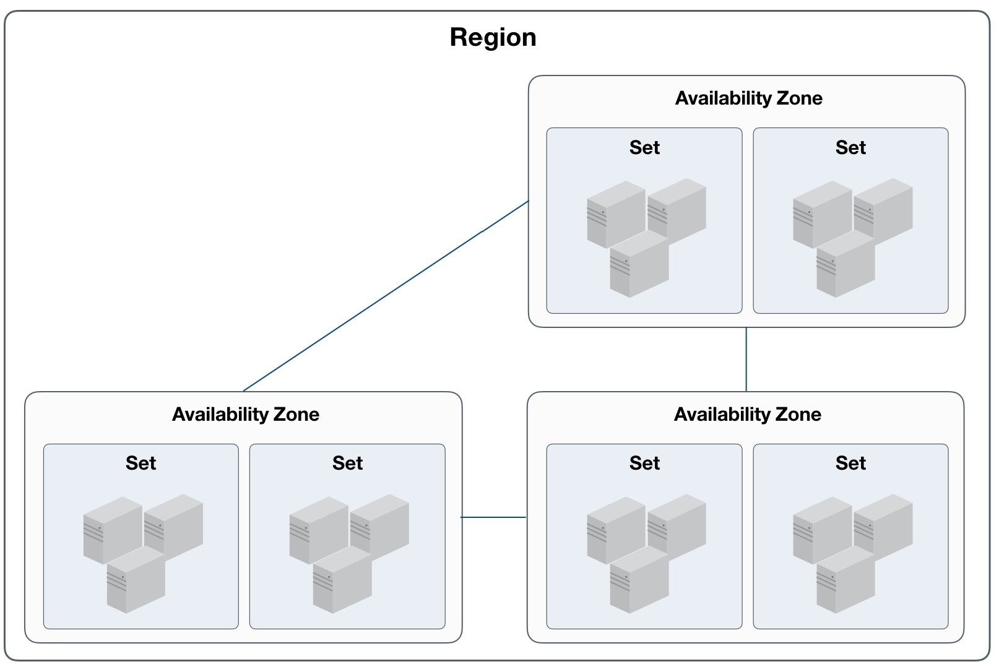

* 一个可用区可包含多个集群，云资源支持跨集群调度；
* 一个集群至少由 3 台服务器节点组成，集群内服务器须具有相同的 CPU/内存、磁盘类型及操作系统；
  * 服务器为计算&存储融合节点时，不同磁盘类型的节点划分为一个集群，如 SSD 计算节点集群；
  * 服务器为独立存储节点时，不同磁盘类型的节点划分为一个集群，如 SATA 存储节点集群；
* 通常一个集群的服务器建议接入同一组接入交换机，业务数据网络仅在集群内进行传输；
* 若采用独立存储节点，可将其与计算节点划分为一个集群进行磁盘挂载；
* 虚拟机仅支持跨集群挂载分布式块存储设备，用于数据存储。

集群中独立存储节点可直接挂载并使用磁盘阵列柜中的磁盘作为分布式存储系统的存储池，同时支持挂载 NFS 、NAS 等多种类型存储。

### 4.1.4 业务组

业务组是 UCloudStack 云平台为用户提供的业务资源分类的标识，通过业务组可以有效的对不同业务的虚拟资源进行分类。

* 支持通过业务组进行计费帐单筛选和统计；
* 每个虚拟资源都必须属于一个业务组，每个业务组可包含多种虚拟资源；
* 业务组可虚拟机进行业务分类，同时支持通过业务组进行均衡部署；
  * 将多个虚拟机加入同一个业务组，智能调度系统自动将虚拟机打散部署于不同的物理服务器上；
  * 提供统一服务的业务虚拟机加入同一个业务组打散部署后，可有效提高服务的可用性；
* 支持创建业务组、删除业务组、移除资源、移入资源等生命周期管理；
* 将虚拟机从业务组移除后，智能调度系统将会在发生故障时，重新将虚拟机调度至健壮的服务器节点。

## 4.2 虚拟机

虚拟机是 UCloudStack 云平台的核心服务，提供可随时扩展的计算能力服务，包括 CPU 、内存、操作系统等最基础的计算组件，并与网络、磁盘、安全等服务结合提供完整的计算环境。通过与负载均衡、数据库、缓存、对象存储等服务结合共同构建 IT 架构。

* UCloudStack 云平台通过 KVM ( Kernel-based Virtual Machine ) 将物理服务器计算资源虚拟化，为虚拟机提供计算资源；
* 一台虚拟机的计算资源只能位于一台物理服务器上，当物理服务器负载较高或故障时，自动迁移至其它健康的物理服务器；
* 虚拟机计算能力通过虚拟 CPU ( vCPU ) 和虚拟内存表示，存储能力通过云存储容量和性能体现；
* 虚拟机管理程序通过控制 vCPU、内存及磁盘的 QoS ，用于支持虚拟机资源隔离，保证多台虚拟机在同一台物理服务器上互不影响。

虚拟机是云平台用户部署并运行应用服务的基础环境，与物理计算机的使用方式相同，提供创建、关机、断电、开机、重置密码、重装系统、升降级等完全生命周期功能；支持 Linux、Windows 等不同的操作系统，并可通过 VNC 、SSH 等方式进行访问和管理，拥有虚拟机的完全控制权限。虚拟机运行涉及资源及关联关系如下：


如图所示，实例规格、镜像、VPC 网络是运行虚拟机必须指定的基础资源，即指定虚拟机的 CPU 内存、操作系统、虚拟网卡及 IP 信息。在虚拟机基础之上，可绑定云硬盘、弹性IP 及安全组，为虚拟机提供数据盘、公网 IP 及网络防火墙，保证虚拟机应用程序的数据存储和网络安全。

### 4.2.1 实例规格

实例规格是对虚拟机 CPU 内存的配置定义，为虚拟机提供计算能力。CPU 和内存是虚拟机的基础属性，需配合镜像、VPC 网络、云硬盘、安全组及密钥，提供一台完整能力的虚拟机。

* 默认提供 1C2G 、2C4G 、4C8G 、8C16G 、16C32G 等实例规格；
* 支持自定义实例规格，提供多种 CPU 内存组合，以满足不同应用规模和场景的负载要求；
* 支持升降级虚拟机 CPU 和内存配置，可通过更改实例规格进行调整；
* 实例规格变更后，需重启虚拟机生效；
* 实例规格与虚拟机生命周期一致，虚拟机被销毁时，实例规格即被释放。

UCloudStack 提供虚拟机实例规格全生命周期的管理和维护，包括创建、删除、更新、查看。

### 4.2.2 镜像

镜像（ Image ）是虚拟机实例运行环境的模板，通常包括操作系统、预装应用程序及相关配置等。虚拟机管理程序通过指定的镜像模板作为启动实例的系统盘，生命周期与虚拟机一致，虚拟机被销毁时，系统盘即被销毁。平台虚拟机镜像分为基础镜像和自制镜像。

#### 4.2.2.1 基础镜像

基础镜像是由 UCloudStack 官方提供，包括多发行版 Centos 、Ubuntu 及 Windows 等原生操作系统。
* 操作系统版本包括 Centos 6.5 64 、Centos 7.4 64 、Windows 2008r2 64 、Windows 2012r2 64 、Ubuntu 14.04 64 、Ubuntu 16.04 64 ；
* 基础镜像均经过系统化测试，并定期更新维护，确保镜像安全稳定的运行和使用；
* 基础镜像为系统默认提供的镜像，仅支持查看及通过镜像运行虚拟机，不支持修改、创建、删除；
* Linux 镜像默认系统盘为 20GB ，Windows 镜像默认系统盘为 40GB ，支持系统盘容量扩容。

支持重装系统，即更换虚拟机镜像，Linux 虚拟机仅支持更换 Centos 和 Ubuntu 操作系统，Windows 虚拟机仅支持更换 Windows 其它版本的操作系统；

> **Windows 操作系统镜像为微软官方提供，需自行购买 Lincense 激活。**

#### 4.2.2.2 自制镜像

自制镜像由云平台用户通过虚拟机自行导出的自有镜像，可用于创建虚拟机，仅用户本人有权限查看和管理。
* 支持虚拟机在线和离线状态下自制镜像，在线状态下自制的镜像无法保存内存中的数据；
* 支持通过虚拟机自制镜像、从镜像创建主机、上线、下线、修改名称、查看镜像及删除镜像等生命周期管理；
* 自制镜像整个生命周期包括制作中、可用、下线中、不可用、上线中、已删除等状态，状态流转如下图所示：

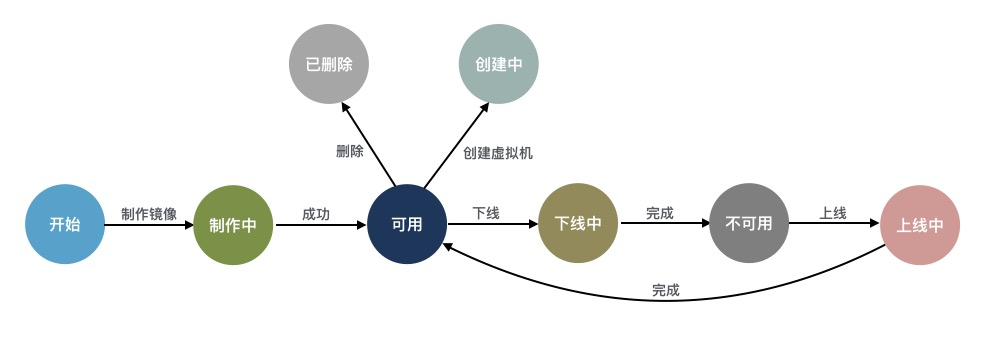

#### 4.2.2.3 镜像存储

基础镜像和用户自制镜像默认均存储于分布式存储系统，保证性能的同时通过三副本保证数据安全。

* 镜像支持 RAW 格式，可将 QCOW2 、VMDK 等格式镜像转换为 RAW 格式文件，用于 V2V 迁移场景；
* 所有镜像均存储于分布式存储系统，即镜像文件会分布在底层计算存储超融合节点磁盘上；
* 若为独立存储节点，则分布存储于独立存储节点的所有磁盘上；
* 镜像默认在多可用区级别进行同步，不支持跨地域同步，即通过在一个地域中虚拟机导出的镜像会自动同步至本地域所有可用区中；
* 一个地域的镜像只能创建本地域的虚拟机，不支持跨 Region 镜像创建虚拟机。

### 4.2.3 虚拟网卡

虚拟网卡（ Virtual NIC ）是虚拟机与外部通信的虚拟网络设备，创建虚拟机时随 VPC 网络默认创建的虚拟网卡。虚拟网卡与虚拟机的生命周期一致，无法进行分离，虚拟机被被销毁时，虚拟网卡即被销毁。有关 VPC 网络详见 [VPC 网络](#_36-私有网络) 。

* 虚拟网卡基于 Virtio 实现，QEMU 通过 API 对外提供一组 Tun/Tap 模拟设备，将虚拟机的网络桥接至宿主机网卡，通过 OVS 与其它虚拟网络进行通信；
* 每个虚拟机默认会生成 2 块虚拟网卡，分别承载虚拟机内外网通信；
* 在虚拟机启动时，根据选择的 VPC 子网自动发起 DHCP 请求以获取内网 IP 地址，并将网络信息配置在一块虚拟网卡上，为虚拟机提供内网访问；
* 虚拟机启动后，可申请公网 IP （外网 IP）绑定至虚拟机，提供互联网访问服务；
  * 绑定的 外网 IP 会自动将公网 IP 信息配置在另一块虚拟网卡上，为虚拟机提供外网访问；
  * 一个虚拟机仅支持绑定一个 外网 IP ，详见 [外网 IP](#_37-外网-IP) 。
* 不支持修改虚拟网卡的 IP 地址，手动修改的 IP 地址将无法生效；
* 每块虚拟网卡支持绑定一个安全组，提供网卡级别安全控制，详见[安全组](#_425-安全组) ；
* 支持虚拟网卡 QoS 控制，提供自定义设置虚拟网卡的出/入口带宽；

平台默认提供 2 块虚拟网卡，若业务有 2 块以上网卡需求可通过绑定 [弹性网卡](#_424-弹性网卡) ，为虚拟机提供多网络服务。

<span id="_424-弹性网卡"></span>

### 4.2.4 弹性网卡

弹性网卡（ Elastic Network Interface, ENI ）是一种可随时附加到虚拟机的弹性网络接口，支持绑定和解绑，可在多个虚拟机间灵活迁移，为虚拟机提供高可用集群搭建能力，同时可实现精细化网络管理及廉价故障转移方案。


* 弹性网卡与虚拟网卡的实现方式相同，区别在于弹性网卡的具有独立的生命周期；
* 弹性网卡支持绑定和解绑，可在多个虚拟机间自由迁移；
* 虚拟机被销毁时，弹性网卡将自动解绑，可绑定至另一台虚拟机使用；
* 一块弹性网卡仅支持绑定至一个虚拟机，一个虚拟机最多可绑定 **6** 块弹性网卡；
* 支持弹性网卡 QoS 控制，提供自定义设置弹性网卡的出/入口带宽；

弹性网卡具有可用区、VPC、子网、IP 及安全组等属性，支持创建、绑定、解绑、绑定安全组、解绑安全组及删除弹性网卡等生命周期管理，有关 VPC 网络详见 [VPC 网络](#_36-私有网络) 。

* 可用区：弹性网卡仅支持绑定至相同可用区的虚拟机；
* 子网：一块弹性网卡仅支持加入至一个子网，创建后无法修改 VPC 和子网；
* IP地址：支持手动指定和 DHCP 自动获取弹性网卡在子网内的 IP 地址，一块弹性网卡仅支持 1 个私有 IP 地址，创建后无法修改 IP 地址；
* 安全组：每块弹性网卡支持绑定一个安全组，提供网卡级别安全控制，详见[安全组](#_345-安全组) ；
* MAC 地址：每块弹性网卡拥有全局唯一 MAC 地址；

弹性网卡整个生命周期包括创建中、未绑定、绑定中、已绑定、解绑中、已删除等状态，状态流转如下图所示：


<span id="_425-安全组"></span>

### 4.2.5 安全组

安全组（ Security Group ）是一种类似 [IPTABLES](https://en.wikipedia.org/wiki/Iptables) 的虚拟防火墙，提供出入双方向流量访问控制规则，定义哪些网络或协议能访问资源，用于限制虚拟资源的网络访问流量，支持 IPv4 和 IPv6 双栈限制，为云平台提供必要的安全保障。

#### 4.2.5.1 实现机制

平台安全组基于 Linux Netfilter 子系统，通过在 [OVS](http://www.openvswitch.org/) 流表中添加流表规则实现，需开启宿主机 IPv4 和IPv6 包转发功能。每增加一条访问控制规则会根据网卡作为匹配条件，生成一条流表规则，用于控制进入 OVS 的流量，保证虚拟资源的网络安全。

安全组仅可作用于**同一个数据中心** 内具有相同安全需求的虚拟机、弹性网卡、负载均衡及 NAT 网关，工作原理如下图所示：


安全组具有独立的生命周期，可以将安全组与虚拟机、弹性网卡、负载均衡、NAT 网关绑定在一起，提供安全访问控制，与之绑定的虚拟资源销毁后，安全组将自动解绑。

- 安全组对虚拟机的安全防护针对的是一块网卡，即安全组是与虚拟机的默认虚拟网卡或弹性网卡绑定在一起，分别设置访问控制规则，限制每块网卡的出入网络流量；
- 如安全组原理图所示，安全组与提供外网 IP 服务的虚拟外网网卡绑定，通过添加出入站规则，对南北向（虚拟机外网）的访问流量进行过滤；
- 安全组与提供私有网络服务的虚拟网卡或弹性网卡绑定，通过添加出入站规则，控制东西向（虚拟机间及弹性网卡间）网络访问；
- 安全组与外网类型的负载均衡关联，通过添加出入站规则，可对进出外网负载均衡的外网 IP 流量进行限制和过滤，保证外网负载均衡器的流量安全；
- 安全组与 NAT 网关绑定，通过添加出入站规则，可对进入 NAT 网关的流量进行限制，保证 NAT 网关的可靠性和安全性；
- 一个安全组支持同时绑定至多个虚拟机、弹性网卡、NAT 网关及外网负载均衡实例；
- 虚拟机支持绑定一个内网安全组和一个外网安全组，分别对应虚拟机默认的内网网卡和外网网卡上，其中外网安全组对绑定至虚拟机的所有外网 IP 地址生效；
- 弹性网卡仅支持绑定一个安全组，与虚拟机默认网卡绑定的安全组相互独立，分别限制对应网卡的流量；
- 外网负载均衡和 NAT 网关实例仅支持绑定一个安全组，可更换安全组应用不同的网络访问规则。

创建虚拟机时必须指定外网安全组，支持随时修改安全组的出入站规则，新规则生成时立即生效，可根据需求调整安全组出/入方向的规则。支持安全组全生命周期管理，包括安全组创建、修改、删除及安全组规则的创建、修改、删除等生命周期管理。

#### 4.2.5.2 安全组规则

安全组规则可控制允许到达安全组关联资源的入站流量及出站流量，提供双栈控制能力，支持对 IPv4/IPv6 地址的 TCP、UPD、ICMP、GRE 等协议数据包进行有效过滤和控制。

每个安全组支持配置多条规则，根据优先级对资源访问依次生效。**规则为空时，安全组将默认拒绝所有流量；规则不为空时，除已生成的规则外，默认拒绝其它访问流量。**

**支持有状态的安全组规则，可以分别设置出入站规则，对被绑定资源的出入流量进行管控和限制。**每条安全组规则由协议、端口、地址、动作、优先级及方向六个元素组成：

- 协议：支持 TCP、UDP、ICMPv4、ICMPv6 四种协议数据包过滤。
  - ALL 代表所有协议和端口，ALL TCP 代表所有 TCP 端口，ALL UDP 代表所有 UDP 端口；
  - 支持快捷协议指定，如 FTP、HTTP、HTTPS、PING、OpenVPN、PPTP、RDP、SSH 等；
  - ICMPv4 指 IPv4 版本网络的通信流量；ICMPv6 指 IPv6 版本网络的通信流量。
- 端口：源地址访问的本地虚拟资源或本地虚拟资源访问目标地址的 TCP/IP 端口。
  - TCP 和 UDP 协议的端口范围为 1~65535 ；
  - ICMPv4 和 ICMPv6 不支持配置端口。
- 地址：访问安全组绑定资源的网络数据包来源地址或被安全组绑定虚拟资源访问的目标地址。
  - 当规则的方向为入站规则时，地址代表访问被绑定虚拟资源的源 IP 地址段，支持 IPv4 和 IPv6 地址段；
  - 当规则的方向为出站规则时，地址代表被绑定虚拟资源访问目标 IP 地址段，支持 IPv4 和 IPv6 地址段；
  - 支持 CIDR 表示法的 IP 地址及网段，如 `120.132.69.216` 、 `0.0.0.0/0` 或 `::/0` 。
- 动作：安全组生效时，对数据包的处理策略，包括 “接受” 和 “拒绝” 两种动作。
- 优先级：安全组内规则的生效顺序，包括高、中、低三档规则。
  - 安全组按照优先级高低依次生效，优先生效优先级高的规则；
  - 同优先级的规则，优先生效精确规则。
- 方向：安全组规则所对应的流量方向，包括出站流量和入站流量。

**安全组支持数据流表状态，规则允许某个请求通信的同时，返回数据流会被自动允许，不受任何规则影响。即安全组规则仅对新建连接生效，对已经建立的链接默认允许双向通信。**如一条入方向规则允许任意地址通过互联网访问虚拟机外网 IP 的 80 端口，则访问虚拟机 80 端口的返回数据流（出站流量）会被自动允许，无需为该请求添加出方向允许规则。

> 注：通常建议设置简洁的安全组规则，可有效减少网络故障。

### 4.2.6 SSH 密钥

为保证虚拟机安全性，Linux 虚拟机提供密码和 SSH 密钥两种登录方式。SSH 密钥是通过 RSA 加密算法生成的一对密钥，分别为**公钥**和**私钥**。公钥是对外界公开的密钥，私钥是自己保留的密钥，传输数据时通过公钥加密的数据，只能用私钥解密并查看。通过 SSH 密钥与 Linux 虚拟机进行连接，相对密码登录更加安全。

UCloudStack 支持将用户生成的公钥上传至已绑定的虚拟机，并通过 SSH 密钥登录虚拟机，具体流程如下：

1. 用户将自己本地生成的 SSH 公钥上传至云平台，绑定公钥到虚拟机后，在本地通过 SSH 登录虚拟机；
2. SSH 客户端向虚拟机发出登录请求，虚拟机收到请求后，查找并读取用户有效的公钥信息；
3. 虚拟机验证公钥的有效性后生成一串随机数，使用公钥对其加密后返回给 SSH 客户端；
4. 客户端使用私钥对返回的加密数据进行解密，若解密成功，则将解密后的原文信息重新发送给虚拟机；
5. 虚拟机对 SSH 客户端返回信息进行比对，若比对成功，表示认证通过，SSH 客户端可以登录虚拟机；

云平台仅存储用户上传的公钥数据，拥有私钥的客户端才可以登录虚拟机，为保证虚拟机安全，需考虑私钥存储位置的安全性。SSH 密钥拥有独立的生命周期，包括创建、绑定、解绑、删除等功能管理，虚拟机销毁时将自动解除已绑定的 SSH 密钥。

* SSH 密钥具有 Region 属性，仅支持绑定至同一个 Region 内的虚拟机；
* 一个SSH 密钥可同时绑定至多个虚拟机，即一个 SSH 密钥可同时登录多个虚拟机；
* 一个虚拟机可同时绑多个密钥，即支持多个 SSH 密钥客户端可同时登录一个虚拟机；
* 绑定 SSH 密钥后，可同时使用 SSH 密钥和密码登录虚拟机；
* 支持修改 SSH 密钥的名称及备注，用于标识不同的 SSH 公有密钥；

### 4.2.7 VNC 登录

VNC（ Virtual Network Console ）是 UCloudStack 为用户提供的一种通过 WEB 浏览器连接虚拟机的登录方式，适应于无法通过远程登录客户端（如 SecureCRT、PuTTY 等）连接虚拟机的场景。通过 VNC 登录连到虚拟机，可以查看虚拟机完整启动流程，并可以像 SSH 及 远程桌面一样管理虚拟机操作系统及界面，支持发送各种操作系统管理指令，如  `CTRL+ALT+DELETE` 及 `CTRL+C` 、`CTRL+V` 等。

### 4.2.8 生命周期        

UCloudStack 为虚拟机提供完整生命周期管理，用户可自助创建虚拟机，并对虚拟机进行关机、断电、开机、重置密码、重装系统、升降级配置、制作镜像、修改业务组、修改名称/备注、修改告警模板及删除等基本操作；同时支持与虚拟机相关联资源的绑定和解绑管理，包括弹性网卡、云硬盘、 外网  IP 、安全组、 SSH 密钥等。

* 关机是对虚拟机操作系统的正常关机，断电是将虚拟机强制关机；
* 重装系统即更换虚拟机镜像，Linux 仅支持更换 Linux 类型镜像，Windows 仅支持更换 Windows 类型镜像；
* 升降级配置是对虚拟机的规格配置进行升级或降级的变更操作；
* 销毁虚拟机会自动删除实例规格、系统盘及默认虚拟网卡，同时会自动解绑相关联的虚拟资源；
* 一个虚拟机支持绑定多个云硬盘、弹性网卡、安全组及 SSH 密钥；
* 一个虚拟机仅支持绑定一个 外网 IP 资源；

UCloudStack 虚拟机完整生命周期包括启动中、运行、关机中、断电中、关机、启动中、重装中、删除中及已删除等资源状态，各状态流转如下图所示：

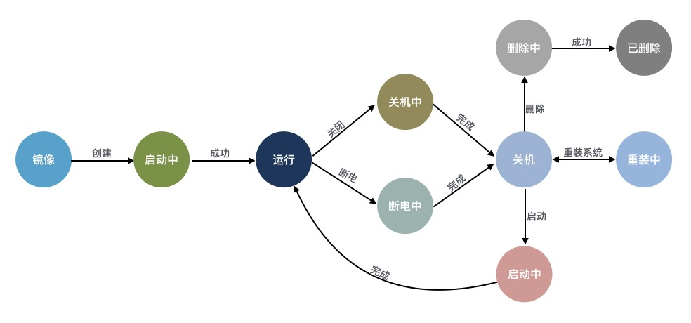

## 4.3 云硬盘

### 4.3.1 云硬盘概述

云硬盘是一种基于分布式存储系统为虚拟机提供持久化存储空间的块设备。具有独立的生命周期，支持随意绑定/解绑至多个虚拟机使用，并能够在存储空间不足时对云硬盘进行扩容，基于网络分布式访问，为云主机提供高安全、高可靠、高性能及可扩展的数据磁盘。

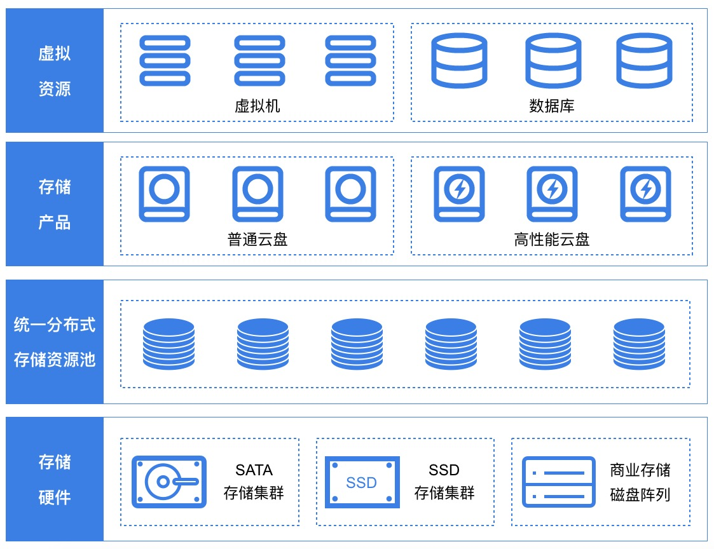

分布式存储系统为虚拟机系统盘、镜像及云硬盘提供统一存储及管理，提高虚拟机与系统盘、云硬盘的数据传输入效率，实现虚拟机快速创建及恢复，并支持系统盘和云硬盘的在线快速扩容和迁移。在本地可通过快照技术，对云硬盘及数据进行快照备份，在数据丢失或损坏时，可通过快照快速恢复数据，包括数据库数据、应用数据及文件目录数据等，可实现分钟级恢复。

### 4.3.2 功能与特性

云平台为租户提供普通和高性能两种类型的云硬盘，普通云硬盘使用 SATA/SAS 磁盘作为存储介质，性能型云硬盘使用 SSD/NVME 磁盘作为存储介质。普通云硬盘和高性能云硬盘均通过条带化、PG映射及三副本机制进行存储，并在分布式存储系统的基础之上通过块存储系统接口为用户提供云硬盘资源及全生命周期管理。

* 云硬盘容量是由统一存储的从存储集群容量中分配的，所有云硬盘共享整个分布式存储池的容量及性能；
* 支持云硬盘创建、挂载、卸载、磁盘扩容、删除等生命周期管理；
* 支持在线和离线的方式扩容磁盘容量，磁盘扩容后需要在虚拟机的操作系统进行磁盘容量的扩容操作；
* 为保证数据安全，目前云硬盘不支持磁盘缩容；
* 云硬盘最小支持 10G 的容量，步长为 10GB ，可自定义控制单块云硬盘的最大容量；
* 云硬盘具有独立的生命周期，可自由挂载到任意虚拟机上 ，支持秒级创建与删除云硬盘； 
* 每个虚拟机支持挂载多个云硬盘，虚拟机删除后，已挂载至虚拟机的云硬盘将自动卸载，可重新挂载虚拟机；
* 单块云硬盘同时仅能挂载一台虚拟机；
* 支持对全局分布式存储及整体云硬盘进行 I/O 的 QoS 限制；
* 支持对每一块云硬盘的 QoS 进行配置，可根据不同业务模式调整磁盘的性能，以平衡平台整体性能；

高性能型云硬盘的性能与容量的大小成线性关系，容量越大，提供的 IO 性能越高，如果对IO性能有强烈需求，可考虑扩容性能型云硬盘。UCloudStack 云硬盘完整生命周期包括创建中、可用、挂载中、已挂载、卸载中、扩容中、已删除等资源状态，各状态流转如下图所示：


### 4.3.3 应用场景

* 普通云硬盘
  * 适用于对容量要求较高且数据不被经常访问或 I/O 负载低的应用场景；
  * 需要低成本并且有随机读写 I/O 的应用环境，如大型视频、音乐、离线文档存储等；
* 高性能云硬盘
  * 适用于 I/O 负载高且数据经常被读写的应用场景；
  * 中大型关系数据库；
  * 中大型开发测试环境；
  * 中大型实时响应服务类环境；

<span id="_44-私有网络"></span>

## 4.4 私有网络

### 4.4.1 VPC 概述

UCloudStack 通过软件定义网络 （ SDN ）对传统数据中心物理网络进行虚拟化，采用 OVS 作为虚拟交换机，VXLAN 隧道作为 OverLay 网络隔离手段，通过三层协议封装二层协议，用于定义虚拟私有网络 VPC 及不同虚拟机 IP 地址之间数据包的封装和转发。

私有网络（ VPC ——Virtual Private Cloud ）是一个属于用户的、逻辑隔离的二层网络广播域环境。在一个私有网络内，用户可以构建并管理多个三层网络，即子网（ Subnet ），包括网络拓扑、IP 网段、IP 地址、网关等虚拟资源作为租户虚拟机业务的网络通信载体。

私有网络 VPC 是虚拟化网络的核心，为云平台虚拟机提供内网服务，包括网络广播域、子网（IP 网段）、IP 地址等，是所有 NVF 虚拟网络功能的基础。私有网络是子网的容器，不同私有网络之间是绝对隔离的，保证网络的隔离性和安全性。

可将虚拟机、负载均衡、弹性网卡、NAT 网关等虚拟资源加入至私有网络的子网中，提供类似传统数据中心交换机的功能，支持自定义规划网络，并通过安全组对虚拟资源 VPC 间的流量进行安全防护。

> 可通过 IPSecVPN、专线及外网 IP 接入等方式将云平台私有网络及虚拟资源与其它云平台或 IDC 数据中心组成一个按需定制的混合云网络环境。

VPC 网络具有数据中心属性，每个 VPC 私有网络仅属于一个数据中心，数据中心间资源和网络完全隔离，资源默认内网不通。租户内和租户间 VPC 网络默认不通，从不同维度保证租户网络和资源的隔离性。

### 4.4.2 VPC 逻辑结构

一个 VPC 网络主要由私有网络网段和子网两部分组成，如下图所示：

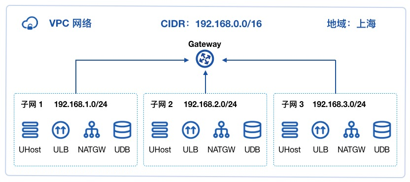

**（1）私有网络网段**

VPC 网络所属的 CIDR  网段，作为 VPC 隔离网络的私网网段。关于 CIDR 的相关信息，详见 [CIDR](https://en.wikipedia.org/wiki/Classless_Inter-Domain_Routing) 。创建 VPC 网络需指定私有网段，平台管理员可通过管理控制台自定义 VPC 私有网络的网段，使租户的虚拟资源仅使用管理员定义网段的 IP 地址进行通信。平台 VPC 私有网络 CIDR 默认支持的网段范围如下表所示：

| 网段           | 掩码范围 | IP 地址范围                   |
| -------------- | -------- | ----------------------------- |
| 10.0.0.0/8     | 8 ~ 29   | 10.0.0.0 - 10.255.255.255     |
| 172.16.0.0/12  | 12 ~ 29  | 172.16.0.0 - 172.31.255.255   |
| 192.168.0.0/16 | 16 ~ 29  | 192.168.0.0 - 192.168.255.255 |

> 由于 DHCP 及相关服务需占用 IP 地址，私有网络 CIDR 网段不支持 `30` 位掩码的私有网段。

**（2）子网**

子网（ Subnet ）是 VPC 私有网络的基础网络地址空间，用于虚拟资源间内网连接。

* 一个私有网络至少由一个子网组成，子网的 CIDR 必须在 VPC 的 CIDR 网段内；
* 同一私有网络内子网间通过`公共网关`连接，资源默认内网互通，可部署虚拟机、负载均衡、NAT 网关、Redis、MySQL 及 IPSecVPN 网关等；
* 同一个 VPC 子网间默认通过公共网关进行互通；
* 子网 CIDR 网段拔码最小为 `29` 位，不支持 `30` 、`32` 位掩码的子网网段； 
* 每个子网中，使用第一个可用 IP 地址作为网关，如 `192.168.1.0/24` 的网关地址是 `192.168.1.1` 。

> 当子网中存在虚拟资源时，不允许删除并销毁私有网络和子网资源。

### 4.4.3 VPC 连接

平台对常用网络设备均进行软件定义及组件抽像，通过将 VPC 网络与虚拟机、弹性网卡、外网 IP、安全组、NAT 网关、负载均衡、VPN 网关、MySQL 数据库、Redis 缓存及专线等组件连接，可快速构建和配置繁杂的网络环境及混合云场景，如下图所示：


* 虚拟机默认内网网卡（创建时自带的虚拟网卡）加入同一个 VPC 网络实现虚拟机间网络通信，并可通过安全组保证虚拟机东西向流量安全。
* 虚拟机默认外网网卡（创建时自带的虚拟网卡）可直接绑定多个外网 IP 地址实现 Internet 访问，同时可绑定与 IDC 物理网络相连的外网 IP 地址实现物理网络打通，结合安全组管控虚拟机南北向流量的同时，构建安全可靠的混合接入环境。
* 虚拟机的弹性网卡加入不同的 VPC 网络及子网，实现精细化网络管理及廉价故障转移方案，同时将安全组与弹性网卡绑定，通过安全组规则多维度保障私有网络及虚拟资源的安全。
* 虚拟机与 UDB、URedis 服务加入同一个 VPC 网络，满足业务应用和数据库、缓存服务连通场景。
* 相同 VPC 网络的虚拟机可通过 NAT 网关及外网 IP 连接，共享外网 IP 访问 Internet 或 IDC 数据中心网络，并可通过 DNAT 端口映射对外提供业务服务。
* 相同 VPC 网络的虚拟机加入至内网 ULB 后端服务节点，提供 VPC 网络内负载均衡服务。
* 相同 VPC 网络的虚拟机加入到外网 ULB 后端服务节点，结合 ULB 关联的外网 IP ，提供外网负载均衡服务。
* 相同 VPC 网络的虚拟机通过 IPSecVPN 网关可与不同 VPC 网络的虚拟机进行内网互联，实现 VPC 间互通。
* 通过 IPSecVPN 网关打通不同 VPC 间的网络，使两个 VPC 间的虚拟机可直接进行内网通信。
* 采用 IPSecVPN 网关或专线将平台与本地 IDC 数据中心及第三方云平台连通，构建安全可靠的混合云环境。

> 外网 IP 可用于打通 IDC 数据中心的物理网络，应用与虚拟机直接与物理机进行内网通信的场景；IPSecVPN 网关用于打通第三方云平台或 IDC 数据中心的虚拟网络，应用于不同云平台间通过 VPN 安全连接场景。

### 4.4.4 功能与特性

平台 VPC 网络基于租户控制台和 API 提供隔离网络环境、自定义子网、子网通信及安全防护等功能，并可结合硬件及 DPDK 等技术特性提供高性能的虚拟网络。

* 隔离的网络环境

  私有网络基于 [OVS](http://www.openvswitch.org/)（ Open vSwitch）组件，通过 [VXLAN](https://datatracker.ietf.org/doc/rfc7348/) 隧道封装技术实现隔离的虚拟网络。每一个 VPC 网络对应一个 VXLAN 隧道号（VNI），作为全局唯一网络标识符，为租户提供一张独立且完全隔离的二层网络，可通过在私有网络中划分多个子网作为虚拟资源的通信载体，用于连通多个虚拟资源。不同的 VPC 网络间完全隔离，无法直接通信。

* 自定义子网

  支持在一个 VPC 网络内进行三层网络规划，即划分一个或多个子网。提供自定义 IP 网段范围、可用 IP 网段及默认网关，可在子网中通过虚拟机部署应用程序和服务。支持在子网中增加多个弹性网卡，分别指定子网中的 IP 地址，并绑定至部署应用程序的虚拟机，用于精细化管理应用服务的网络访问。

* 子网通信

  每一个子网都属于一个广播域，VPC 网络默认提供网关服务，同一个 VPC 内不同子网通过网关进行通信。

* 安全防护

  云平台提供内网安全组和外网防火墙，通过协议、端口为虚拟资源提供多维度安全访问控制，同时基于虚拟网卡及虚拟实例的网络流量进行上下行的 QoS 控制，全方位提高 VPC 网络的安全性。安全组为有状态安全层，可分别设置出入方向的安全规则，用于控制并过滤进出子网 IP 的数据流量。

* 高性能虚拟网络

  SDN 网络分布式部署于所有计算节点，节点间通过 20GE 冗余链路进行通信，并通过所有计算节点负载内网流量，为云平台提供高可靠及高性能的虚拟网络。

云平台在保证网络隔离、网络规模、网络通信及安全的同时，为租户和子帐号提供 VPC 子网的创建、修改、删除及操作审计日志等全生命周期管理。用户创建虚拟机、NAT 网关、负载均衡、VPN 网关、MySQL 及  Redis 等虚拟资源时可指定需加入的VPC 网络和子网，并可查询每个子网的可用 IP 数量。

VPC 网络具有数据中心属性，仅支持指定相同数据中心的虚拟资源到 VPC 网络中，且每个 VPC 网络的子网网段必须在 VPC 网络的 CIDR 网段中。平台会通过管理员配置的 VPC 网络，为每个租户和子账号提供默认的 VPC 网络和子网资源，方便用户登录云平台快速部署业务。

 <span id="_45-外网-IP"></span>

## 4.5 外网 IP

### 4.5.1 概述

外网弹性 IP（ Elastic IP Address ，简称 EIP ），是平台为用户的虚拟机、NAT 网关、VPN 网关及负载均衡等虚拟资源提供的外网 IP 地址，为虚拟资源提供平台 VPC 网络外的网络访问能力，如互联网或 IDC 数据中心物理网络，同时外部网络也可通过 EIP 地址直接访问平台 VPC 网络内的虚拟资源。

EIP 资源支持独立申请和拥有，用户可通过控制台或 API 申请 IP 网段资源池中的 IP 地址，并将 EIP 绑定至虚拟机、 NAT 网关、负载均衡、VPN 网关上，为业务提供外网服务通道。

### 4.5.2 物理架构

在私有云平台中，允许平台管理员自定义平台外网 IP 资源池，即由平台管理员自定义平台访问外网的方式，外网 IP 网段资源池在添加至云平台前，需要通过物理网络设备下发至计算节点连接的交换机端口。

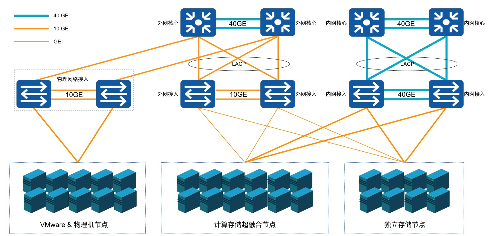

如上图物理架构示意图所示，所有计算节点需要连接网线至物理网络的外网接入交换机，并在物理网络的交互机上配置所连接端口允许透传 Vlan 的网络访问方式，使运行在计算节点上虚拟机可通过外网物理网卡直接与外部网络进行通信：

* 若通过外网 IP 访问互联网，需要物理网络设备上将自定义的外网 IP 网段配置为可直通或 NAT 到互联网；
* 若通过外网 IP 访问 IDC 数据中心的物理网络，需要在物理网络设备上将自定义的外网 IP 网段配置为可与 IDC 数据中心网络通信，如相同的 Vlan 或 Vlan 间打通等。

> 物理网络架构为高可用示意图，实际生产环境架构可进行调整，如内外网接入交换机可合并为一组高可用接入交换机，通过不同的 Vlan 区分内外网等。

### 4.5.3 逻辑架构

物理网络架构及配置确认后，在平台层面需要分别添加互联网 IP 网段和 IDC 物理网段至云平台 IP 网段资源池中，租户可申请不同网段的 EIP 地址，并将通往不同网络的 EIP 地址绑定至虚拟机默认外网网卡，使虚拟机可通过外网 IP 地址同时访问互联网和 IDC 数据中心物理网络。


如逻辑架构图所示，用户在平台中分别添加通往 Internet (Vlan200) 和通往 IDC 物理网络（Vlan100）的网段至云平台。网段举例如下：

* Vlan200 的网段为`106.75.236.0/25` ，配置下发默认路由，即虚拟机绑定网段的 EIP 将会自动下发目标地址为 0.0.0.0/0 的默认路由；
* Vlan100 的网段为`192.168.1.0/24` ，仅下发当前网段路由，即虚拟机绑定网段的 EIP 仅下发目标地址为 192.168.1.0/24 的指定路由。

租户可分别申请 Vlan200 和 Vlan100 的 EIP 地址，并可将两个 EIP 同时绑定至虚拟机。平台会将 EIP 地址及下发路由直接配置至虚拟机外网网卡，并通过 SDN 控制器下发流表至虚拟机所在的物理机 OVS ，物理机 OVS 通过与物理机外网网卡接口及交换机进行互联，通过交换机设备与互联网或 IDC 物理网络进行通信。

当虚拟机需要访问互联网或物理网络时，数据会通过虚拟机外网网卡直接透传至物理机的 OVS 虚拟交换机，并通过 OVS 流表将请求转发至物理机外网网卡及物理交换机，经由物理交换机的 Vlan 或路由配置将数据包转发至互联网或 IDC 物理网络区域，完成通信。

如上图 VPC1 网络的虚拟机同时绑定了 Vlan100 和 Vlan200 网段的 EIP 地址，Vlan100 EIP 为 `192.168.1.2` ，Vlan200 EIP 为 `106.75.236.2` 。平台会直接将两个 IP 地址直接配置至虚拟机的外网网卡，通过虚拟机操作系统可直接查看配置到外网网卡的 EIP 地址；同时自动下发两个 IP 地址所属网段需要下发的路由到虚拟机操作系统中，虚拟机的默认路由指定的下一跳为 Vlan200 互联网网段的网关，使虚拟机可通过 `106.75.236.2`  IP 地址与互联网进行通信，通过 `192.168.1.2`  与物理网络区域的 Oracle 及 HPC 高性能服务器进行内网通信。

整个通信过程直接通过虚拟机所在物理机的物理网卡进行通信，在物理网卡和物理交换机性能保障的前提下，可发挥物理网络硬件的最佳转发性能，提升虚拟机对外通信的转发能力。同时所有外网 IP 流量均可通过平台安全组在平台内进行流量管控，保证虚拟机访问平台外部网络的安全性。

### 4.5.4 功能特性

EIP 为浮动 IP ，可随故障虚拟机恢复漂移至健康节点，继续为虚拟机或其它虚拟资源提供外网访问服务。


当一台虚拟机所在的物理主机发生故障时，智能调度系统会自动对故障主机上的虚拟机进行宕机迁移操作，即故障虚拟机会在其它健康的主机上重新拉起并提供正常业务服务。若虚拟机已绑定外网 IP ，智能调度系统会同时将外网 IP 地址及相关流表信息一起漂移至虚拟迁移后所在的物理主机，并保证网络通信可达。

* 支持平台管理员自定义外网 IP 资源池，即自定义外网 IP 网段，并支持配置网段的路由策略。租户申请网段的外网 IP 绑定至虚拟资源后，下发目的路由地址的流量自动以绑定的外网 IP 为网络出口。
* 外网 IP 网段支持下发默认路由和指定路由，下发默认路由代表默认所有流量均以绑定的外网IP为出口，指定路由为管理员指定目的地址的流量以绑定的外网IP为出口。
* **提供 IPv4/IPv6 双栈能力，管理员可自定义管理 IPv4 和 IPv6 网段资源池，并支持同时绑定 IPv4/IPv6 地址到虚拟机，为虚拟机提供双栈网络通信服务。**

- 支持外网 IP 网段的权限管控，可指定所有租户或部分租户使用，未被指定的租户无权限申请并使用网段 EIP。
- EIP 具有弹性绑定的特性，支持随时绑定至虚拟机、NAT 网关、负载均衡、VPN 网关等虚拟机资源，并可随时解绑绑定至其它资源。
- 虚拟机支持绑定 10 个外网 IPv4 和 10 个外网 IPv6 地址，以第一个有默认路由的外网 IP 作为虚拟机的默认网络出口。
- 提供外网 IP 网段获取服务，支持租户手动指定 IP 地址申请  EIP，并提供 IP 地址冲突检测，方便用户业务网络地址规划。
- 平台管理员可自定义外网 IP 网段的带宽规格，租户可在带宽规格范围内配置外网 IP 的带宽上限。

外网 IP 具有数据中心属性，仅支持绑定相同数据中心的虚拟资源。用户可通过平台自定义申请 EIP ，并对 EIP 进行绑定、解绑、调整带宽等相关操作。

## 4.6 NAT 网关

### 4.6.1 产品概述

NAT 网关（ NAT Gateway ）是一种类似 [NAT](https://zh.wikipedia.org/wiki/网络地址转换) 网络地址转换协议的 VPC 网关，为云平台资源提供 SNAT 和 DNAT 代理，支持互联网地址转换能力，并支持普通和白名单两种资源网络出口模式。

用户可通过 NAT 网关让 VPC 子网中未绑定外网 IP 的虚拟机访问外网，同时可配置端口转发规则使虚拟机、数据库 MySQL 及 Redis 服务对外提供服务。作为一个虚拟网关设备，需要绑定外网 IP 作为 NAT 网关的默认统一出口，支持普通和白名单两种网络出口模式。

- 普通模式下，NAT 网关指定子网中所有未绑定外网 IP  的云资源，均可通过 NAT 网关访问互联网或 IDC 数据中心的物理网络。
- 白名单模式下，NAT 网关指定子网中且在白名单中定义的云资源，才可通过 NAT 网关访问互联网或 IDC 数据中心的物理网络。

同时网关提供 DNAT 能力，支持配置基于 TCP 和 UDP 两种协议的端口转发，将 VPC 内的云资源内网端口映射到 NAT 网关所绑定的外网 IP，对互联网或 IDC 数据中心网络提供服务。NAT 网关具有地域（数据中心）属性，仅支持相同数据中心下同 VPC 虚拟资源的 SNAT 和 DNAT 转发服务，

虚拟机通过 NAT 网关可访问的网络取决于绑定的外网 IP 所属网段在物理网络上的配置，若所绑定的外网 IP 可通向互联网，则虚拟机可通过 NAT 网关访问互联网；若所绑定的外网 IP 可通向 IDC 数据中心的物理网络，则虚拟机通过 NAT 网关访问 IDC 数据中心的物理网络。

### 4.6.2 应用场景

用户在平台使用虚拟机部署应用服务时，有访问外网或通过外网访问虚拟机的应用场景，通常我们会在每一台虚拟机上绑定一个外网 IP 用于和互联网或 IDC 数据中心网络进行通信。真实环境和案例中，可能无法分配足够的公网 IP ，即使公网 IP 足够也无需在每一台需要访问外网的虚拟机上绑定外网 IP 地址。

- 共享 EIP ：通过 SNAT 代理，使多台 VPC 内网虚拟机共享 1 个 外网 IP 地址访问互联网或 IDC 数据中心的物理网络。
- 屏蔽真实 IP ：通过 SNAT 代理，多台 VPC 内网虚拟机使用代理 IP 地址通信，自动屏蔽真实 IP 内网地址。
- VPC 内网虚拟机提供外网服务：通过 DNAT 代理，配置 IP 及端口转发，对互联网或 IDC 数据中心的网络提供业务服务。

### 4.6.3 架构原理

平台产品服务底层资源统一，NAT 网关实例为主备高可用集群架构，可实现 NAT 网关故障自动切换，提高 SNAT 和 DNAT 服务的可用性。同时结合外网 IP 地址，根据 NAT 配置为租户虚拟资源提供 SNAT 和 DNAT 代理。

在产品层面，租户通过申请一个 NAT 网关，指定 NAT 网关可允许通信的子网，通过绑定【外网 IP】使多子网下虚拟机与互联网或 IDC 数据中心物理网进行通信，具体逻辑架构图如下：

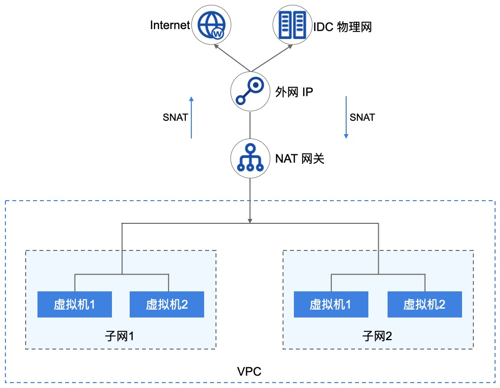

- 平台支持同 VPC 多子网虚拟机使用 NAT 网关访问互联网或 IDC 数据中心网络。
- 当多个子网中未绑定外网 IP 的虚拟机关联 NAT 网关时，平台将自动在虚拟机中下发访问外网的路由。
- 虚拟机通过下发的路由，将访问外网的数据通过 NAT 网关透传至已绑定的【外网 IP】。
- 透传至外网 IP 的数据通过平台 OVS 及物理网卡将数据包发送至物理交换机，完成数据 SNAT 的通信。
- 当外网需要访问 VPC 中的虚拟机或 MySQL 服务时，可通过 NAT 网关端口转发，使互联网或 IDC 物理网通过 NAT 网关已绑定的 IP+端口 访问 VPC 内网服务。

NAT 网关 SNAT 功能支持白名单模式，即仅支持多子网中已添加至白名单的虚拟机通过 NAT 网关提供 SNAT 地址转换服务。

### 4.6.4 功能特性

云平台提供 NAT 网关全生命周期管理，包括 NAT 网关的增删改查、模式设置、DNAT 端口转发及资源绑定等。

#### 4.6.4.1 多子网绑定

NAT 网关服务的核心价值是为平台虚拟机提供 SNAT 和 DNAT 的功能，节省 IP 地址的同时提升部署效率。一个 VPC 支持多个子网，NAT 网关可为指定的多个子网同时提供地址转换服务，使【**多个子网**】中的虚拟机均通过 NAT 网关与外网或 IDC 物理网进行通信。

  * 用户可将一个 VPC 中的一个子网绑定至 NAT 网关，也可将一个 VPC 中的部分子网绑定至 NAT 网关。
  * 支持用户将一个 VPC 中的所有子网绑定至 NAT 网关，同时支持用户移除部分子网。
  * 指定子网后，子网下未绑定外网 IP 且在白名单中的虚拟机可通过 NAT 网关与外界通信。

#### 4.6.4.2 多网络出口模式

NAT 网关支持多种网络出口模式，包括普通模式和白名单模式。

* 普通模式下 NAT 网关指定子网中所有未绑定外网 IP 的虚拟机，均可通过 NAT 网关访问外网或 IDC 数据中心的网络。
  * 白名单模式下 NAT 网关指定子网中且在白名单中定义的云资源，才可通过 NAT 网关访问外网或 IDC 数据中心的网络。

支持修改出口模式，从普通模式切换到白名单模式，则白名单生效。若从白名单模式切换到普通模式，则白名单失效，网关所关联的子网中的虚拟机均可通过 NAT 网关与外界通信。

#### 4.6.4.3 SNAT 能力

NAT 网关支持 SNAT（Source Network Address Translation 源地址转换），即 VPC 子网 IP 地址转换为外网 IP 地址进行网络访问。通过 SNAT 功能，关联 NAT 网关的虚拟机可在不绑定外网 IP 的情况下，与外网通信。

  * 在虚拟机未绑定外网 IP 地址的情况下，NAT 绑定的外网 IP 将作为所有关联虚拟机的默认网络出口，共享外网 IP 地址访问互联网信息和服务。
  * 若虚拟机已添加 NAT 网关白名单在绑定外网 IP 时，默认会将虚拟机从 NAT 网关白名单移除，以虚拟机绑定的外网 IP 地址为虚拟机的默认出口。

#### 4.6.4.4 DNAT 能力

NAT 网关支持 DNAT（Destination Network Address Translation 目的地址转换），也称为端口转发或端口映射，即将外网 IP 地址转换为 VPC 子网的 IP 地址提供网络服务。

  - 支持 TCP 和 UDP 两种协议的端口转发，支持对端口转发规则进行生命周期管理。
  - 支持批量进行多端口转发规则配置，即支持映射端口段，如 TCP:1024~TCP:1030 。
  - NAT 网关绑定外网 IP 时，端口转发规则为 VPC 子网内的虚拟机提供互联网外网服务，可通过外网访问子网内的虚拟机服务。

#### 4.6.4.5 监控告警

平台支持对 NAT 网关进行监控数据的收集和展示，通过监控数据展示每一个 NAT 网关的指标数据，同时支持为每一个监控指标设置阈值告警及通知策略。支持的监控指标包括网络出/带宽、网络出/包量及连接数。

支持查看一个 NAT 网关多时间维度的监控数据，包括 1 小时、6 小时、12 小时、1 天、7 天、15 天及自定义时间的监控数据。默认查询数提成为 1 小时的数据，最多可查看 1 个月的监控数据。

#### 4.6.4.6 NAT 网关安全

NAT 网关的网络访问控制可以关联安全组给予安全保障，通过安全组的规则可控制到达 NAT 网关 所绑定外网 IP 的入站流量及出站流量，支持 TCP、UDP、ICMP、GRE 等协议数据包的过滤和控制。

安全组及安全组的规则支持对已关联安全组的 NAT 网关的流量进行限制，仅允许安全组规则内的流量透传安全组到达目的地。

### 4.6.5 NAT 网关隔离性

**（1）资源隔离**

- NAT 网关具有数据中心属性，不同数据中心间 NAT 网关资源物理隔离；
- NAT 网关资源在租户间相互隔离，租户可查看并管理账号及子账号下所有 NAT 网关资源；
- 一个租户内的 NAT 网关资源，仅支持绑定租户内同数据中心的 VPC 子网资源；
- 一个租户内的 NAT 网关资源，仅支持绑定租户内同数据中心的外网 IP 资源；
- 一个租户内的 NAT 网关资源，仅支持绑定租户内同数据中心的安全组资源。

**（2）网络隔离**

- 不同数据中心间 NAT 网关资源网络相互物理隔离；
- 同数据中心 NAT 网关网络采用 VPC 进行隔离，不同 VPC 的 NAT 网关资源无法相互通信；
- NAT 网关绑定的外网 IP 网络隔离取决于用户物理网络的配置，如不同的 Vlan 等。

### 4.6.6 NAT 网关高可用

NAT 网关实例支持高可用架构，即至少由 2 个虚拟机实例构建，支持双机热备。当一个 NAT 网关的实例发生故障时，支持自动在线切换到另一个虚拟机实例，保证 NAT 代理业务正常。同时基于外网 IP 地址的漂移特性，支持在物理机宕机时，保证 SNAT 网关出口及 DNAT 入口的可用性。

## 4.7 负载均衡

### 4.7.1 负载均衡概述

负载均衡（ Load Balance ）是由多台服务器以对称的方式组成一个服务器集合，每台服务器都具有等价的地位，均可单独对外提供服务而无须其它服务器的辅助。平台负载均衡服务（简称 ULB—UCloudStack Load Balance）是基于 TCP/UDP/HTTP/HTTPS 协议将网络访问流量在多台虚拟机间自动分配的控制服务，类似于传统物理网络的硬件负载均衡器。

通过平台负载均衡服务提供的虚拟服务地址，将相同数据中心、相同 VPC 网络的虚拟机添加至负载均衡转发后端，并将加入的虚拟机构建为一个高性能、高可用、高可靠的应用服务器池，根据负载均衡的转发规则，将来自客户端的请求均衡分发给服务器池中最优的虚拟机进行处理。

支持内外网两种访问入口类型，分别提供 VPC 内网和 EIP 外网的负载访问分发，适应多种网络架构及高并发的负载应用场景。提供四层和七层协议的转发能力及多种负载均衡算法，支持会话保及健康检查等特性，可自动隔离异常状态虚拟机，同时提供 **SSL Offloading** 及 SSL 证书管理能力，有效提高整体业务的可用性及服务能力。

ULB 支持收集并展示负载流量各种网络指标的监控数据，并可根据告警模板进行监控报警及通知，保证业务的正常运行。当前 ULB 为接入的虚拟机服务池提供基于 NAT 代理的请求分发方式，在 NAT 代理模式下，所有业务的请求和返回数据都必须经过 ULB ，类似 LVS 的 NAT 工作模式。

### 4.7.2 应用场景

平台提供外网和内网两种类型的负载均衡服务，分别对应外网服务和内网服务两种场景。用户可根据业务需求，选择创建对外公开或对内私有的负载均衡实例，平台会根据负载均衡类型分别分配外网 IP 地址或 VPC 私有网络的 IP 地址，即负载均衡的服务访问地址。

- 外网类型的负载均衡使用场景：
  - 部署在平台的业务服务需要构建高可用虚拟机集群，且需对互联网提供统一访问入口。
  - 部署在平台的业务服务需要构建高可用虚拟机集群，且需对 IDC 数据中心提供统一访问入口。
- 内网负载均衡使用场景：
  - 部署在平台的业务服务需要构建高可用虚拟机集群，且仅需对 VPC 内网提供统一访问入口。
  - 部署在 VPC 私有网络的虚拟机集群需要对其它用户或服务屏蔽真实 IP 地址，对客户端提供透明化服务。

> 用户也可将负载均衡服务分配的 IP 地址与自有域名绑定在一起，通过域名访问后端应用服务。

### 4.7.3 架构原理

一个提供服务的负载均衡，主要由 LB 实例（ LoadBalancer ）、虚拟服务器（ VServer ）、后端服务器（ Backend Real Server ）三部分组成。如架构图所示：


- LoadBalancer（ LB ）：负载均衡实例为主备高可用集群架构，可实现负载均衡器故障自动切换，提高接入负载均衡服务的可用性。同时结合内外网 IP 地址，根据 VServer 配置的监听器，将虚拟机加入到 Backend 成为 Real Server ，以实现业务的流量均衡与服务容错。
- Virtual Server（ VServer ）：监听器，每个监听器是一组负载均衡的监听端口配置，包含协议、端口、负载算法、会话保持、连接空闲超时及健康检查等配置项，用于分发和处理访问 LB 的请求。
- Backend Server Pool ：后端一组虚拟机服务器池，实际处理请求的真实服务器（RealServer），即真实部署业务的虚拟机实例。
- 外网 IP（ EIP ）：外网弹性 IP 地址，绑定至外网类型的 LB 实例上，对互联网或 IDC 数据中心提供业务负载均衡访问入口。
- 内网 IP （Private IP）：内网 IP 地址，内网类型 LB 实例提供服务的访问地址，通常是由创建内网负载均衡器时指定的 VPC 自动分配。

负载均衡器用于承载 VServer 及访问入口，VServer 负责访问入口地址的端口监听及请求分发。当负载均衡器接受到来自客户端的请求后，会通过一系列负载均衡算法，将访问请求路由分发到后端虚拟机服务器池进行请求处理，同时由 VServer 将处理结果返回给客户端。

* 通过加权轮询、最小连接数及基于源地址的负载均衡调度策略，进行业务请求流量转发，满足多场景业务负载需求，如加权轮询是按照后端服务器的权重进行请求转发，权重越大转发的请求越多。

- 通过会话保持机制，在请求会话的生命周期内，会将来自同一个客户端的会话转发至同一个虚拟机进行处理，适用于 TCP 长连接等应用场景。
- 通过健康检查机制，监控 RealServer 的运行状况及业务可用性，确保只将流量分发至业务健康的虚拟机。当 后端虚拟机业务不可访问时，调度器会停止向虚拟机分发负载流量；待虚拟机业务恢复正常后，会将虚拟机重新加入至 VServer 后端并分发流量至虚拟机。

**负载均衡器的工作模式为 NAT 请求代理，请求和返回均由负载均衡器进行转发和处理，即后端 RealServer 虚拟机处理请求后，会将请求返回给负载均衡 ，由负载均衡将结果返回给客户端。**

### 4.7.4 功能特性

平台负载均衡服务提供四层和七层转发能力，支持内网和外网两种网络入口，在多种负载调度算法基础之上支持健康检查、会话保持、连接空闲超时、内容转发及 **SSL Offloading** 和 SSL 证书管理等功能，保证后端应用服务的可用性和可靠性。

- 支持内网和外网两种类型负载均衡器，满足 VPC 内网、IDC 数据中心及互联网服务负载均衡应用场景。
- 提供四层和七层业务负载分发能力，支持基于 TCP、UDP、HTTP 及 HTTPS 协议的监听及请求转发。
- 支持加权轮询、最小连接数和基于源地址的的负载调度算法，满足不同场景的流量负载业务。
  - 加权轮询：基于权重的轮询调度，负载均衡器接收到新的访问请求后，根据用户指定的权重，按照权重概率分发流量至各后端虚拟机，进行业务处理；
  - 最小连接数：基于后端服务器最小连接数进行调度，负载均衡器接收到新的访问请求后，会实时统计后端服务器池的连接数，选择连接数最低的虚拟机建立新的连接并进行业务处理；
  - 源地址：基于客户端源 IP 地址的调度策略，采用哈希算法将来源于相同 IP 地址的访问请求均转发至一台后端虚拟机进行处理。
- 提供会话保持功能，在会话生命周期内，保证同一个客户端的请求转发至同一台后端服务节点上。四层和七层分别采用不同的方式进行会话保持 。
  - 针对 UDP 协议，基于 IP 地址保证会话保持，将来自同一 IP 地址的访问请求转发到同一台后端虚拟机进行处理，支持关闭会话 UDP 协议的会话保持；
  - 针对 HTTP 和 HTTPS 协议，提供 Cookie 植入的方式进行会话保持，支持自动生成KEY 和自定义 KEY。自动生成 key 是由平台自动生成 Key 进行植入，自定义 Key 是由用户自定义 Key 进行植入。
- 支持 TCP、HTTP 及 HTTPS 协议的连接空闲超时配置，自动中断在超时时间内一直无访问请求的连接。
  - 客户端向 LB 地址发送的请求，在平台会维护两个连接，一个由客户端到 LB，一个由 LB 到后端虚拟机；
  - 连接空闲超时是指由客户端到 LB 的连接空闲超时时间，若在超时周期内没有发送或接收任何数据，将自动中断从客户端到 LB 的连接；
  - 默认连接空闲超时周期为 60 秒，即在建立连接后的 60 秒内一直没有新的数据请求，将自动中断连接。

- 健康检查：支持端口检查和 HTTP 检查，根据规则对后端业务服务器进行业务健康检查，可自动检测并隔离服务不可用的虚拟机，待虚拟机业务恢复正常后，会将虚拟机重新加入至 VServer 后端并分发流量至虚拟机。
  - 端口检查：针对四层和七层负载均衡，支持按 IP 地址 + 端口的的方式探测后端服务节点的健康状况，及时剔除不健康的节点；
  - HTTP 检查：针对七层负载均衡，支持按 URL 路径和请求 HOST 头中携带的域名进行健康检查，筛选健康节点。
- 内容转发：针对七层 HTTP 和 HTTPS 协议的负载均衡，支持基于域名和 URL 路径的流量分发及健康检查能力，可将请求按照域名及路径转发至不同的后端服务节点，提供更加精准的业务负载均衡功能。
- SSL 证书：针对 HTTPS 协议，提供统一的证书管理服务和 **`SSL Offloading `** 能力，并支持 HTTPS 证书的单向和双向认证。SSL 证书部署至负载均衡，仅在负载均衡上进行解密认证处理，无需上传证书到后端业务服务器，降低后端服务器的性能开销。

- 获取客户端真实 IP：HTTP 监听器支持附加 HTTP header 字段，通过 X-Forwarded-For 和 X-Real-IP 获取客户端真实 IP 地址。
- 获取监听器协议：HTTP 监听器支持附加 HTTP header 字段，通过 X-Forwarded-Proto 获取监听器的协议。
- 附加 HTTP HOST：HTTP 监听器支持附加 HTTP header 字段，通过 Host 附加 HOST 域名至 HTTP 请求中，用于适配需要检测 HTTP 头 HOST 字段的业务。
- 监控数据：负载均衡级别提供每秒连接数、每秒出/入流量、每秒出/入包数量的监控及告警；VServer 级别提供连接数、HTTP 2XX、HTTP 3XX、HTTP 4XX、HTTP 5XX 等监控数据及告警。
- 安全控制：通过安全组对外网负载均衡的访问进行安全管控，仅允许安全组规则内的流量透传负载均衡到达后端真实服务器，保证业务负载的安全性。

负载均衡为用户提供业务级别的高可用方案，可以将业务应用同时部署至多个虚拟机中，通过负载均衡和 DNS 域名的方案设置流量均衡转发，实现多业务级别的流量负载均衡。当大并发流量通过负载均衡访问虚拟机业务时，可通过最小连接数、加权轮询等算法，将请求转发给后端最健壮的虚拟机进行处理，请通过负载均衡将请求结果返回给客户端，保证业务可用性和可靠性。

> 用户可通过智能 DNS 服务，将两个数据中心的负载均衡实例同时绑定至一个域名，使用 DNS 实现跨数据中心的业务容灾方案。

### 4.7.5 负载均衡隔离性

- 资源隔离
  - 负载均衡具有数据中心属性，不同数据中心间负载均衡资源物理隔离；
  - 负载均衡资源在租户间相互隔离，租户可查看并管理账号及子账号下所有负载均衡资源；
  - 一个租户内的负载均衡资源，仅支持绑定租户内同数据中心的 VPC 子网资源；
  - 一个租户内的负载均衡资源，仅支持绑定租户内同数据中心的外网 IP 资源；
  - 一个租户内的负载均衡资源，仅支持绑定租户内同数据中心的安全组资源。
- 网络隔离
  - 不同数据中心间负载均衡资源网络相互物理隔离；
  - 同数据中心负载均衡网络采用 VPC 进行隔离，不同 VPC 的负载均衡资源无法相互通信；
  - 负载均衡绑定的外网 IP 网络隔离取决于用户物理网络的配置，如不同的 Vlan 等。

## 4.8 IPSecVPN 服务

### 4.8.1 背景

用户在使用云平台部署并管理应用服务时，会有部分业务部署于 IDC 数据中心环境的内网或第三方公/私有云平台上，如 Web 服务部署于公有云平台，应用和数据库等应用部署于私有云，构建公有云和私有云混合部署环境。

在混合云的应用场景中，可以可通过专线的方式将两端网络的内网直接打通，且较好的保证网络可靠性和性能。但由于专线成本较高，仅适用于部分对网络时延要求较高的业务，为节省成本并与第三方平台建立点对点的网络通信，云平台提供 VPN 网关-IPsecVPN 连接的服务能力，允许平台侧 VPC 子网的资源直接与第三方平台内网的主机进行通信，同时也可为平台不同 VPC 网络间提供连接服务。

### 4.8.2 产品概述

IPsec VPN 是一种采用 IPsec 协议加密的隧道技术，由 Internet Engineering Task Force（[IETF](https://ietf.org/)）定义的安全标准框架，在互联网上为两个私有网络提供安全通道，通过加密保证连接的安全。有关 IPsec 可参考 [RFC2409](https://tools.ietf.org/html/rfc2409) （IKE—Internet Key Exchange 因特网密钥交换协议）和 [RFC4301](https://tools.ietf.org/html/rfc4301) （IPsec 架构）。

云平台 IPsecVPN 服务是基于 Internet 的网络连接服务，采用 IPsec（**I**nternet **P**rotocol **Sec**urity）安全加密通道实现企业数据中心、办公网络与平台 VPC 私有网络的安全可靠连接，同时也可使用 VPN 网关在 VPC 之间建立加密内网连接。网关服务为可容灾的高可用架构，同时支持用户选择多种加密及认证算法，并提供 VPN 连接健康检测及连接日志，保证隧道连接的可靠性、安全性及管理便捷性。

通过 IPsecVPN 服务，用户可将本地数据中心、企业分支机构与私有云平台的 VPC 私有网络通过加密通道进行连接，也可将用于不同 VPC 之间的加密连接。对端设备或系统仅需支持 IPsec 的 IKEv1 或 IKEv2 ，即可通过配置与平台的 VPN 网关进行互连，如通用网络设备或配置 IPsecVPN 的服务器。

### 4.8.3 逻辑架构

VPN 网关 IPsecVPN 服务由 VPN 网关、对端网关及 VPN 隧道连接三部分组成。

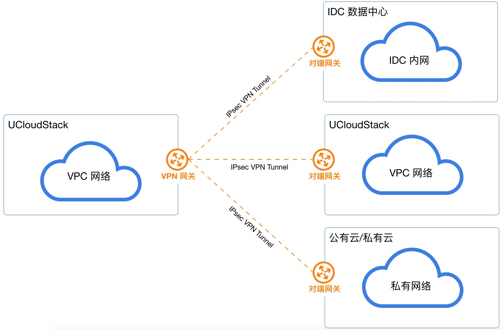

- VPN 网关

  平台侧 VPC 网络建立 IPsecVPN 连接的出口网关，通过关联 VPC 和外网 IP 与对端网关的 IPsecVPN 进行连接，用于平台私有网络和外部网络（如 IDC、公有云、私有云）之间建立安全可靠的加密网络通信。

- 对端网关

  运行于外部网络端 IPsecVPN 网关的公网 IP 地址，即与私有云平台 VPN 网关进行隧道连接的网关 IP 地址，支持 NAT 转发的网关地址。

- VPN 隧道

  连接 VPN 网关和对端网关的加密隧道，结合相应的加密认证算法及策略，为平台 VPC 私有网络和外部私有网络建立加密通信的隧道连接。

一个 VPN 网关有且必须关联 1 个 VPC 网络和 1 个外网 IP 地址，与对端网关相对应，通过 VPN 隧道进行连接。IPsecVPN 支持点到多点的连接特性，使得 VPN 网关与对端网关可以为一对一或一对多的连接关系，即一个 VPN 网关可以同时与多个对端网关建立隧道。VPN 隧道支持平台多个 VPC 子网与对端网络的多个网段通过隧道进行加密通信，平台 VPC 子网的网段与对端网络的网络不可重叠（本端与对端子网重叠会影响网络的正常通信）。

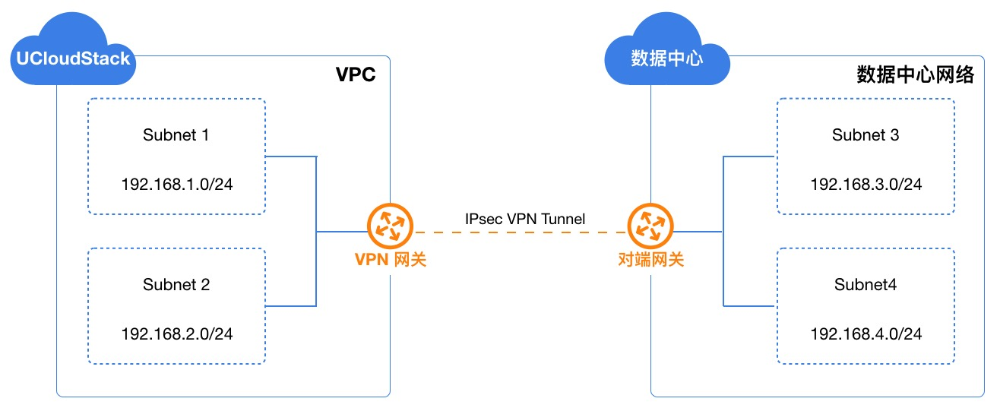

如上图案例所示，在云平台中的 VPC 网络已拥有 2 个子网，分别为 subnet1（`192.168.1.0/24`）和 subnet2（`192.168.2.0/24`）。在远端 IDC 数据中心下有 2 个内网网段，分别为 subnet3（`192.168.3.0/24`）和 subnet4（`192.168.4.0/24`）。

- 私有云平台 VPN 网关绑定 VPC 子网，并使用外网 IP 地址作为网络出口及远端数据中心的对端网关。
- 远端数据中心的平台的网关绑定数据中心子网，并使用另一个公网 IP 地址作为网络出口及私有云平台的的对端网关。
- 两端 VPN 网关分别建立 IPsecVPN 隧道，使用相同的预共享密钥及加密认证策略，经过第一阶段的 IKE 认证及第二阶段的 IPsec 认证，建立 VPN 连接通道。
- 两端网络的子网分别通过 VPN 隧道与对端网络的子网进行通信，打通跨数据中心、跨云平台的内网，构建混合云环境。

> IPsecVPN 通道在 Internet 网络中构建并运行，公网的带宽、网络阻塞、网络抖动会直接影响 VPN 网络通信的质量。

### 4.8.4 VPN 隧道建立

在建立 IPsecVPN 安全通道时，需要先在两个网关间建立 SA（Security Association 安全联盟）。SA 是 IPsec 的基础，是通信网关间对连接条件的约定，如网络认证协议（AH、ESP）、协议封装模式、加密算法（DES、3DES 和 AES）、认证算法、协商模式（主模式和野蛮模式）、共享密钥及密钥生存周期等。**SA 安全联盟的建立需要在两端网关上均约定并配置相同的条件，以确保 SA 可以对两端网关进行双向数据流通信保护。**

标准 IPsecVPN 建立 SA 的方式有手工配置和 IKE 自动协商两种，**私有云平台 VPN 网关服务使用 IKE 协议来建立 SA** 。IKE 协议建立在由 ISAKMP（Internet Security Association and Key Management Protocol，互联网安全联盟和密钥管理协议）定义的框架上，具有一套自保护机制，可在不安全的网络上安全地认证身份、交换及密钥分发，为 IPsec 提供自动协商交换密钥并建立 SA 服务。

- 身份认证：支持预共享密钥（pre-shared-key）认证，确认通信两端的身份，并在密钥产生之后对身份数据进行加密传送，实现对身份数据的安全保护。
- 交换及密钥分发：DH（Diffie-Hellman，交换及密钥分发）算法是一种公共密钥算法，通信两端在不传输密钥的情况下通过交换一些数据，计算出共享的密钥。

**IKE 通过两个阶段为 IPsec 进行密钥协商并建立 SA ：**

1. 第一阶段：通信两端彼此间建立一个已通过身份认证和安全保护的通道，即建立一个 IKE SA ，作用是为两端之间彼此验证身份，并协商出 IKE SA ，保护第二阶段中 IPsec SA 协商过程。支持 IKE V1 和 V2 版本，其中 V1 版本支持主模式（Main Mode）和野蛮模式（Aggressive Mode）两种 IKE 交换方法。

2. 第二阶段：用第一阶段建立的 IKE SA 为 IPsec 协商安全服务，即为 IPsec 协商具体的 SA ，建立用于最终的 IP 数据安全传输的 IPsec SA 。

IKE 为 IPsec 协商建立 SA，并将建立的参数及生成的密钥交给 IPsec ，IPsec 使用 IKE 协议建立的 SA 对最终 IP 报文加密或认证处理。通过 IKE 协议可为 IPsecVPN 提供端与端之间的动态认证及密钥分发，通过自动建立 IPsec 参数，降低手工配置参数的复杂度；同时由于 IKE 协议中每次 SA 的建立均需运行 DH 交换过程，可有效保证每个 SA 所使用密钥的互不相关，增加 VPN 通道的安全性。

**VPN 隧道成功建立连接后，将自动为所属 VPC 关联的本端子网下发到对端子网的路由，使本端子网访问远端私有网络的请求通过 VPN 网关及隧道进行转发，完成整个链路的打通。**

### 4.8.5 VPN 隧道参数

IPsecVPN 隧道 SA 协商建立需要配置相应的参数信息，包括隧道的基本信息、预共享密钥、IKE 策略及 IPsec 策略配置信息。两端的 VPN 在建立的过程中，需保证预共享密钥、IKE 策略及 IPsec 策略配置一致，IKE 策略指定 IPSec 隧道在协商阶段的加密和认证算法，IPSec 策略指定 IPSec 在数据传输阶段所使用的协议及加密认证算法。具体参数信息如下表所示：

**（1）基本信息**

* **名称/备注**：VPN 隧道连接的名称和备注。
* **VPN 网关**：VPN 隧道挂载的 VPN 网关，即隧道运行在云平台端的所属 VPN 网关。
* **对端网关**：VPN 隧道挂载的对端网关，即对端网关的互联网出口 IP 地址，如 IDC 数据中心的 VPN 网关。
* **本端网段**：VPN 网关所在 VPC 网络内需要和对端网络（如 IDC 数据中心）互通的子网，如 192.168.1.0/24 。本端网段用于第二阶段协商，不可与对端网段重叠。
* **对端网段**：IDC 数据中心或第三方云平台中需要与本端网段 VPN 通信的子网，如 192.168.2.0/24 。对端网段用于第二阶段协商，不可与本端网段重叠。

**（2）预共享密钥**

* **Pre Shared Key** ：IPsecVPN 连接的秘钥，用于 VPN 连接的协商，在 VPN 连接协商过程中，需保证本端与对端的密钥一致。

**（3）IKE 策略**

* **版本**：IKE 密钥交换协议的版本，支持 V1 和 V2 。V2 版对 SA 的协商过程进行简化且更加适应多网段场景，推荐选择 V2 版本。
* **认证算法**：为 IKE 协商过程中的报文提供认证，支持 md5、sha1 和 sha2-256 三种认证算法。
* **加密算法**：为 IKE 协商过程中的报文提供加密保护，支持 3des、aes128、aes192、aes256 四种加密算法。
* **协商模式**：IKE v1 的协商模式，支持主模式（main）和野蛮模式（aggressive）。
  * 主模式在 IKE 协商时需经过 SA 交换、密钥交换、身份验证三个双向交换阶段（6 个消息），而野蛮模式仅需要经过 SA 生成/密钥交换和身份验证两次交换阶段 （3 个消息）。
  * 由于野蛮模式密钥交换与身份认证一起进行无法提供身份保护，因此主模式的协商过程安全性更高，协商成功后信息传输安全性一致。
  * 主模式适用于两端设备的公网 IP 固定的场景，野蛮模式适用于需要 NAT 穿越及 IP 地址不固定的场景。
* **DH 组**：指定 IKE 交换密钥时使用的 Diffie-Hellman 算法，密钥交换的安全性及交换时间随 DH 组的扩大而增加，支持 1、2、5、14、24 。
  * 1：采用 768-bit 模指数（Modular Exponential，MODP ）算法的 DH 组。
  * 2：采用 1024-bit MODP 算法的 DH 组。
  * 5：采用 1536-bit MODP 算法的 DH 组。
  * 14：采用 2048-bit MODP 算法的 DH 组。
  * 24：带 256 位的素数阶子群的 2048-bit MODP算法 DH 组。
* **本端标识**：VPN 网关的标识，用于 IKE 第一阶段协商。支持 IP 地址和 FQDN（全称域名）。
* **对端标识**：对端网关的标识，用于 IKE 第一阶段协商。支持 IP 地址和 FQDN（全称域名）
* **生存周期**：第一阶段 SA 的生存时间，在超过生存周期后， SA 将被重新协商，如 86400 秒。

**（4）IPSec 策略**

* **安全传输协议：**IPSec 支持 AH 和 ESP 两种安全协议，AH 只支持数据的认证保护，ESP 支持认证和加密，推荐使用 ESP 协议。
* **IPSec 认证算法：**为第二阶段用户数据提供的认证保护功能，支持 md5 和 sha1 两种认证算法。
* **IPSec 加密算法：**为第二阶段用户数据提供的加密保护功能，支持 3des、aes128、aes192 和 aes256 四种加密算法 ，使用 AH 安全协议时不可用。
* **PFS DH 组：**PFS （Perfect Forward Secrecy，完善的前向安全性）特性是一种安全特性，指一个密钥被破解，并不影响其他密钥的安全性。PFS 特性为第二阶段协商的 Diffie-Hellman密钥交换算法，支持的 DH 组为支持 1、2、5、14、24 与关闭（Disable），Disable 适用于不支持 PFS 的客户端 。
* **生存周期：**第二阶段 SA 的生存时间，在超过生存周期后， SA 将被重新协商，如 86400 秒。

### 4.8.6 应用场景

VPN 网关 IPsecVPN 服务是基于 Internet 的网络连接服务，通过 IPsec 安全加密通道实现企业数据中心、办公网络与平台 VPC 私有网络的安全可靠连接，同时用户也可使用 VPN 网关在 VPC 之间建立加密内网连接。网关服务为可容灾的高可用架构，同时支持用户选择多种加密及认证算法，并提供 VPN 连接健康检测及连接日志，可满足不同的应用场景。

- VPC 到本地数据中心的连接：通过 IPsecVPN 服务将本地数据中心的内网主机和 VPC 网络的虚拟资源进行连接，构建混合云服务模式。
- VPC 到公有云 VPC 的连接：通过 IPsecVPN 服务将第三方公有云 VPC 私有网络和私有云 VPC 网络的虚拟资源进行连接，构建多云混合服务模式。
- VPC 到第三方私有云内网的连接：通过 IPsecVPN 服务将第三方私有云的 VPC 私有网络和 UCloudStack VPC 网络的虚拟资源进行连接，构建多云混合服务模式。
- VPC 到 VPC 的连接：通过 IPsecVPN 服务将 VPC 与的另一个 VPC 网络进行连接，实现 VPC 打通的场景。

## 4.9 弹性伸缩

### 4.9.1 概述

弹性伸缩（Auto Scaling）是指在业务需求增长时自动增加计算资源（虚拟机）以保证计算能力，在业务需求下降时自动减少计算资源以节省成本；同时可结合负载均衡及健康检查机制，满足请求量波动和业务量稳定的场景。

用户可通过弹性伸缩服务，定制弹性伸缩组及伸缩策略，在伸缩组内资源量达到策略定义的阈值后，根据定制的虚拟机模板自动增减虚拟机数量，提升业务部署及运维的效率。

### 4.9.2 逻辑架构

弹性伸缩从逻辑架构上可分为三部分，分别为伸缩组、伸缩器及虚拟机模板。


* 伸缩组：负责将组内的实例数量维持在“期望”的水位，添加/缩减虚拟机的动作均由伸缩组进行操作，支持“自动伸缩”和“固定数量” 两种模式维护伸缩组内的实例数量。
* 伸缩器：即伸缩策略，用于定义伸缩组内虚拟机伸缩的规则，可为伸缩组定义根据 CPU 使用率的阈值触发伸缩动作，支持定义伸缩组最小及最大实例数量，并可配置是否允许缩容。
* 虚拟机模板：用户根据需求自定义虚拟机模板，用于弹性伸缩时自动创建虚拟机的模板，同时支持通过虚拟机模板手动创建虚拟机。

伸缩组定义好伸缩模式后，伸缩组的实例“期望”值由伸缩策略接管并动态修改，最终由伸缩组负责虚拟机的动态扩容和缩容，新增虚拟机实例时会根据虚拟机模板创建新的虚拟机实例。

### 4.9.3 伸缩组工作流程

伸缩组内的虚拟机实例可定义预热时间，指为虚拟机创建成功后需要一定的时间拉起应用程序以承接业务流量。因此在伸缩组发起创建虚拟机的请求后，在虚拟机创建成功并处于运行中状态时，伸缩组中虚拟机的状态为“启动中”，代表虚拟机在预热中，待超过预热时间后，会自动转换为“运行” ，代表虚拟机为健康状态。

伸缩组每 15 秒 获取一次被其控制的所有虚拟机状态，判断是否需要添加或删除实例。若伸缩组关了负载均衡，则由负载均衡判断伸缩组内的实例是否健康，若不健康具体流程如下：

* 健康实例等于期望值

  伸缩组会自动将不健康（基于三个周期健康检测的判断）的实例移出伸缩组，并执行删除虚拟机操作。

* 健康实例大于期望值

  选择将最晚创建的健康虚拟机实例移出伸缩组，并执行删除虚拟机操作，同时将不健康的实例移出伸缩组并执行删除操作。

* 健康实例小于期望值

  伸缩组会自动以虚拟机模板发起创建实例操作，并将实例数量维持在期望值，同时会将不健康的实例移出伸缩组并执行删除操作。

### 4.9.4 伸缩器工作流程

伸缩器会根据伸缩策略中设置的最小和最大实例值，每 15 秒采集一次伸缩组中健康实例的 CPU 监控数据，用于判断是否需要扩容或缩容伸缩组中的实例。

* 扩容

  若伸缩组中健康实例的 CPU 平均使用率大于伸缩策略定义的阈值，则会触发伸缩组进行扩容实例操作。

* 缩容

  通常伸缩组中健康实例的 CPU 平均使用率小于伸缩策略定义的阈值，则会触发伸缩组进行缩容实例操作。**为避免频繁的缩容导致伸缩组内集群服务震荡，缩容时会获取伸缩组过去 10 分钟内所有健康实例的 CPU 监控数据平均值，用于判断是否需要缩容伸缩组中的实例**。

### 4.9.5 功能特性

弹性伸缩通过伸缩组、伸缩策略及虚拟机模板共同维护集群内虚拟机的实例数量，同时可结合负载均衡对伸缩组内虚拟机实例的业务健康进行检测并及时剔除处于不健康状态的虚拟机实例，保证整体集群业务的可用性和可靠性。

* 支持定义虚拟机模板，用于伸缩组自动创建虚拟机的模板，同时支持通过虚拟机模板手动创建虚拟机。
* 支持伸缩组预热时间，使虚拟机创建成功后有时间拉起应用程序以承接业务流量。
* 支持自动伸缩和固定数量两种伸缩模式，适应多种自动伸缩场景。
  * 自动伸缩模式依据伸缩器的伸缩策略维护伸缩组中的实例数量；
  * 固定数量模式依据用户指定的实例数量维伸缩组中的实例。
* 支持按照伸缩组中健康实例的平均 CPU 使用率作为自动伸缩模式中是否需要扩缩容的依据。
* 支持设置伸缩策略的最大实例数量，避免因 CPU 使用率过高，无限制扩容伸缩组内实例数量，如集群虚拟机被攻击等。
* 支持设置伸缩策略的最小实例数量，避免因 CPU 使率过低而导致伸缩组中实例数量为 0 ，导致业务中断或服务停止等问题。
* 支持设置伸缩策略的缩容策略，即限制一个伸缩组内的实例只允许扩容，不允许缩容。
* 支持用户查看伸缩组的伸缩日志和已添加至伸缩组的实例信息，用于查看自动伸缩组所有执行动作及原因，方便用户对伸缩组集群业务进行维护。
* 支持用户启用或禁用一个伸缩组，伸缩组禁用后即为不可用状态，将不会在触发伸缩策略执行实例伸缩和健康检查，禁用伸缩组不影响伸缩组中已存在实例的正常运行。
* 提供伸缩组中所有实例的平均 CPU 使用率监控数据，并可通过告警模板对监控数据进行告警配置，在使用率过高而触发扩缩容时，为用户发送告警邮件。

支持弹性伸缩与负载均衡进行关联，通过将伸缩组中的实例添加至负载均衡的监听器中，为伸缩组中的虚拟机业务提供负载均衡服务，同时通过监听器的健康检查机制，判断伸缩组中所有实例的业务健康状况，自动剔除业务不健康的实例并新增健康实例到业务集群。

## 4.10 定时器

### 4.10.1 概述

定时器（Scheduler）是平台为用户提供自动化任务功能，可用于定期执行一系列任务的，如创建快照。可在指定的周期重复执行，也可仅执行一次，且每个任务支持多个资源批量操作。

### 4.10.2 功能特性

* 支持定时创建快照，即实现硬盘的自动快照，同时支持为多个硬盘批量创建定时快照任务。
* 支持单次和重复执行定时任务，重复执行支持每天、每周、每月的指定时间执行任务。
* 每天支持单小时或每个小时进行定时任务的执行操作。
* 每周支持星期一至星期日单小时或每个小时进行定时任务的执行操作。
* 每月支持每一天单小时或每个小时进行定时任务的执行操作。
* 平台会保存定时器执行的任务列表及执行结果记录，支持用户在定时器中查看每个任务的执行记录。

## 4.11 云密码

### 4.11.1 背景

为了满足等级保护测评和商用密码应用安全性评估，平台提供密码综合服务平台方案，依托于云服务器密码机构建密码资源池，并提供云密码资源池管控平台、密钥管理和密码服务平台，从而能够为构建在云平台之上的信息系统提供安全可靠、持续稳定、成本低廉、应用便捷的密码服务。

### 4.11.2 方案概述

基于对密码应用的要求，云密码采用以下架构。


系统架构主要分为四大部分，分别是由硬件密码设备如金融数据密码机、服务器密码机、签名验签服务器、云服务器密码机以及时间戳服务器等组成的密码设备资源，为密码设备资源提供统一资源管控和调度的密码管控系统，为业务应用系统提供密钥全生命周期管理服务的密钥管理系统以及为业务应用系统提供密码运算服务的密码服务系统。

### 4.11.3 云密码设备资源池

密码设备资源池主要是由金融数据密码机、服务器密码机、签名验签服务器、云服务器密码机以及时间戳服务器组成，各密码硬件设备介绍如下：

#### 云服务器密码机

云服务器密码机符合国密局等主管单位的相关标准规范，在一台硬件密码设备上实现同时运行多个虚拟化的密码机，密码机可以是传统的金融数据、签名验签、认证服务器等多种加密机形态之一，云服务器密码机可与云计算管理系统无缝对接，实现对密码机的独立管理，并支持虚拟化多种密码体系的云密码机，用户使用云密码机与使用传统密码机一致。

#### 服务器密码机

服务器密码机是符合国家密码管理要求的新一代密码产品，是各类通用安全解决方案的核心部分，能够支持国家重点信息系统由使用国际密码算法向使用国家自主密码算法的平滑过渡，在这些重要的信息系统中推广国产密码算法，可以有利于保障国家重要信息系统的安全性，保障这些重要行业信息系统的安全运行，加强国家自主的信息安全保障。该系列产品支持国产密码算法（SM1、SM2、SM3、SM4、ZUC），符合GB/T 36322-2018 《信息安全技术 密码设备应用接口规范》，GM/T 0030-2014 《服务器密码机技术规范》，GM/T 0028-2014 《密码模块安全技术要求》，GM/T 0039-2015 《密码模块安全检测要求》等技术规范和安全规范。

#### 签名验签服务器

签名验证服务器是是高性能数字签名服务器，实现了数字签名/验证、文件签名/验证、数字信封、数据杂凑等功能，是提供数字签名服务以及对数据验证其数字签名的真实性和有效性的服务平台。

#### 金融数据密码机

金融数据密码机是符合国家密码管理要求的新一代金融密码产品，是金融数据安全解决方案的核心部分，可满足国家密码管理局、人民银行等行业主管部门的安全技术规范要求，符合PBOC1.0/2.0/3.0、GP、TSM、EMV等行业应用规范，广泛适用于银行、电信运营商、证券、保险、社保、卫生、交通、市民卡、第三方支付、移动支付等行业。

####	时间戳服务器

签名验证服务器是带时间戳功能的数字签名服务器，实现了数字签名/验证、文件签名/验证、数字信封、时间戳生成、时间戳验证、数据杂凑等功能，是提供数字签名服务以及对数据验证其数字签名的真实性和有效性的服务平台，数字签名配合时间戳服务，能更好地支持数据的有效性。

### 4.11.4 应用模式

系统中的密钥通过KMS提供统一的密钥产生、密钥下发等生命周期管理功能，并且提供相应的数据加密和密钥分发服务，可根据不同的应用场景为不同的对象进行密钥的分发，如为应用系统服务器、系统用户以及终端等应用对象进行密钥分发。
密钥管理系统所提供的密钥管理服务是通过硬件密码设备组成的密码资源池提供底层的密钥生成、对称加密解密、签名验签等基础密码运算服务，保证了密钥管理的安全性及合规性。


**密钥生命周期管理**

密钥生命周期管理：管理应用系统中对称密钥、非对称密钥，实现密钥的全生命周期在线和离线管理。实现密钥的创建、生成、维护、更新、分发、存储、删除、授权、备份、归档等功能。

**密钥服务配置**

主要包括数据密钥的算法配置、数据库连接串的加密配置、敏感数据的加密保护等功能。

**应用授权访问管理**

通过对应用进行授权控制，保障应用的安全接入，并配置应用系统认证方式。
认证方式支持： Token认证、白名单等认证机制。

**日志审计管理**

日志审计系统监测密钥管理系统功能和服务子系统的日志信息。


# 5 用户服务支持

## 5.1 实施支持 

* 提供技术支持⼈员远程指导部署实施服务。
* 提供技术支持人员现场部署实施服务。
* 提供专有云平台部署及故障处理的培训和支持服务。
* 提供全套专有云平台部署调试文档及相关资料。

## 5.2 技术服务

* 拥有运维千万级云平台系统的运维的经验和支持团队。
* 提供平台测试⾄终验后的技术⽀持服务，期间提供7×24⼩小时的技术支持。
* 在技术⽀持服务期间，承诺在系统发⽣故障的情况下，派技术⼈员赶赴现场。
* 在服务期内对系统有所修改或版本升级，均免费提供甲方使⽤。

## 5.3 故障响应

1）服务期内，对于系统出现的问题首先通过 24 小时的热线电话解决，如通过电话无法解决，则技术⼈员应到现场指导处理。响应时间要求如下：

| 故障等级 |   响应时间   | 恢复故障时间  |
| :------: | :----------: | :-----------: |
| 一级故障 |   立即响应   | 2 小时内恢复  |
| 二级故障 |   立即响应   | 4 小时内恢复  |
| 三级故障 | 6 小时内响应 | 12 小时内恢复 |
| 四级故障 | 6 小时内响应 | 24 小时内恢复 |

**故障等级分类如下：**

| 故障等级 | 说明                                       |
| :------: | :----------------------------------------- |
| 一级故障 | 因平台故障造成整个系统瘫痪                 |
| 二级故障 | 因平台故障严重影响系统运行                 |
| 三级故障 | 因平台故障影响系统的效率，系统仍然可以运行 |
| 四级故障 | 不影响业务的运行及管理功能故障             |

2）故障排除后，技术人员应针对本次故障出现的原因和故障排除⽅法对⽤户进行现场培训。

3）服务期外，应按照已同意及签定的售后协议书或售后服务条款上的要求提供服务。  

## 5.4 培训计划

**1）培训目标**

在云平台的实施过程中，技术培训的完成情况将直接影响到云平台建设能否如期顺利完成。通过培训将达到如下两个目标：

* 保证云平台的顺利实施，通过培训使得维护技术人员能够切实对系统的整体结构和系统运行模式有清晰的了解，具有独立的系统管理及⽇常维护能⼒，解决常见的故障。
* 确保网络系统能正常运行，提⾼对故障的处理能力及系统的综合处理能⼒。


顺利完成系统平台交接，通过培训帮助技术⼈员了解平台基本情况、⽹络基本情况、 业务运⾏现状、维护技能等，顺利实施平台交接⼯作。

**2）培训形式**

针对云平台的具体情况，将采取集中培训与现场培训相结合的方式。

**现场培训**

系统平台测试和实施中，现场实施工程师到达现场与技术人员一起完成系统平台具体实施和部署。现场实施工程师将对用户现场的技术人员进行一次现场培训。现场培训主要的内容包括云平台基础模块的情况介绍、实施步骤等；

**集中培训**

与用户协商负责安排集中培训，在集中培训过程中，将组织用户技术人员参加 UCloud 认可的培训班，培训采用投影仪、教学软件等培训设备，以电子白板的形式进行培训教学。培训包括授课和实际操作两种方式，培养维护和构建云平台系统的技术人员。

**3）师资力量**

作为国内的专业的云平台提供商及 IaaS 虚拟化技术的研究团队，拥有一批教学丰富的培训教师，他们会针对特定的技术课程和技术主题授课。

对所提供系统方案的原理和技术性能、操作维护方法、安装调测、排除故障及软件结构、定制和升级等等各个方面，提供全套培训教材和培训课程计划表。同时还会针对特殊情况，请直接参于云平台系统设计、开发、实施的高级工程技术人员，为学员详细剖析案例，使学会自己对系统有整体和细致的理解。

