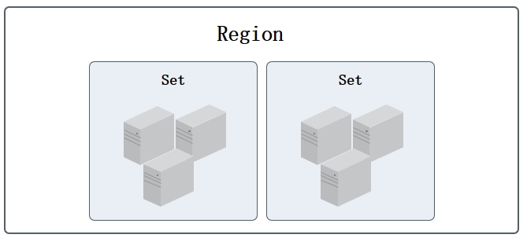
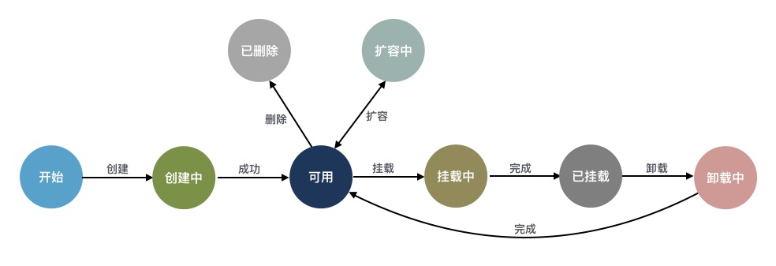
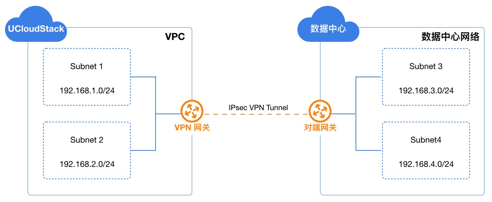
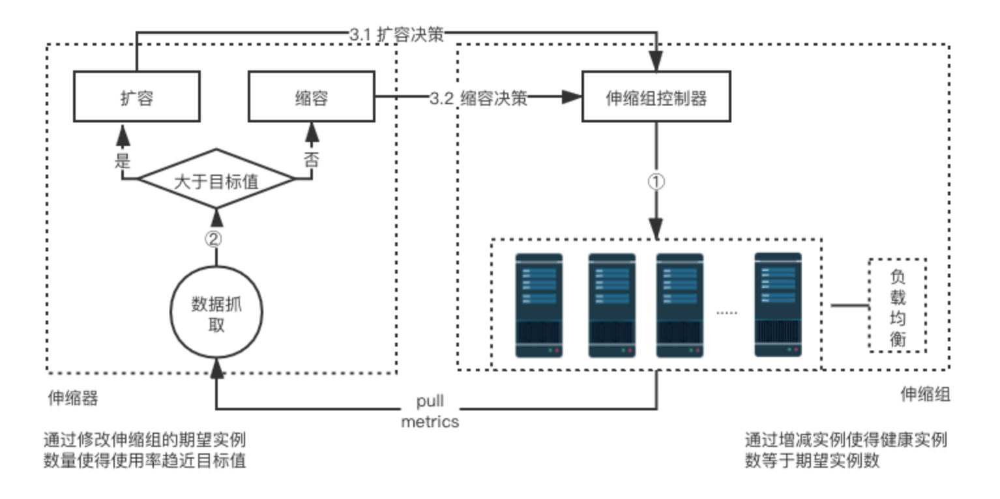

# 4 产品功能架构

## 4.1 核心功能概念

### 4.1.1 地域

地域 ( Region ) 指 UCloudStack 云平台物理数据中心的地理区域，如上海、北京、杭州等。

* 不同地域间完全物理隔离，云平台资源创建后不能更换地域；
* 不同地域间网络完全隔离，资源内网不能互通，可通过公网或专线进行网络通信；
* 私有网络 VPC 和负载均衡服务支持相同地域部署。

### 4.1.2 集群

集群 ( Set ) 是 UCloudStack 物理资源的逻辑划分，用于区分不同配置规格及不同存储类型的服务器节点。区域、集群、物理服务器的逻辑关系如下：

* 一个地域可包含多个集群，使用统一云管理平台进行集群管理和运营，云资源仅支持在单集群调度；
* 一个集群至少由 3 台服务器节点组成，集群内服务器须具有相同的 CPU/内存、磁盘类型及操作系统；
  * 服务器为计算&存储融合节点时，不同磁盘类型的节点划分为一个集群，如 SSD 计算节点集群；
  * 服务器为独立存储节点时，不同磁盘类型的节点划分为一个集群，如 SATA 存储节点集群；
* 通常一个集群的服务器建议接入同一组接入交换机，业务数据网络仅在集群内进行传输；
* 若采用独立存储节点，可将其与计算节点划分为一个集群进行磁盘挂载；
* 虚拟机仅支持跨集群挂载分布式块存储设备，用于数据存储。

云平台支持将 X86、ARM、GPU 等异构计算集群统一管理，并可统一管理 SSD、STAT、NVME 多种架构存储集群。 用户可将虚拟资源部署于不同的计算集群，并分别对虚拟资源挂载不同存储集群的块存储设备；同时云平台虚拟化可通过 ISCSI 协议对接 IPSAN 商业存储设备，为云平台虚拟机提供集群中高性能块存储服务，同时可利旧企业用户的集中存储设备，整体节省信息化转型的总拥有成本。

管理员控制台可对数据中心的计算集群、存储集群及外置存储集群进行便捷的管理和维护，同时平台可对集群进行权限控制，用于将部分物理资源独享给一个或部分租户使用，适用于专属私有云场景。

#### 4.1.2.1 计算集群

计算集群是一组配置、用途相同的计算节点（物理机）组成，用于部署并承载平台上运行的虚拟计算资源。一个数据中心可部署多个不同类型的计算集群，如 X86 集群、ARM 集群、GPU 集群等，不同的集群可运行不同类型的虚拟机资源，如 GPU 集群可为租户提供 GPU 虚拟机，ARM 集群可为租户提供基于 ARM 或国产化 OS 的虚拟机。

为保证虚拟机高可用，平台基于集群纬度提供虚拟化智能调度策略，包括打散部署、在线迁移及宕机迁移，即虚拟资源可在集群内的所有计算节点中进行调度、部署及迁移，提升业务的可用性。

- 打散部署是指平台租户创建虚拟机时默认会将创建的虚拟机尽量打散部署于集群内的所有节点上，保障硬件或软件故障等异常情况下租户业务服务的可用性。
- 在线迁移是指手动将一台虚拟机从集群的一个物理机迁移到另一台物理机，释放源物理机的资源，支持随机分配和指定物理节点两种模式。
- 宕机迁移是指运行虚拟机的物理机出现异常或故障导致宕机时，调度系统会自动将其所承载的虚拟资源快速迁移至集群内健康且负载正常的物理机，尽量保证业务的可用性。

基于在线迁移和宕机迁移的逻辑，通常在部署上推荐将相同 CPU 和内存配置的物理机节点规划为一个计算集群，避免因 CPU 架构或配置不一致，导致虚拟机迁移后异常或无法启动。

默认情况下平台会根据 CPU 平台架构设定集群名称，管理员可根据平台自身使用情况修改集群名称；同时支持管理员管理计算集群内的物理机和计算实例。集群默认对所有租户开放权限，平台支持对计算集群进行权限控制，用于将部分物理计算资源独享给一个或部分租户使用，适用于专属私有云场景。修改集群权限后，集群仅可对指定的租户开放并使用，无权限的租户无法查看并使用受限的集群创建虚拟资源。

#### 4.1.2.2 存储集群

存储集群为平台分布式块存储集群，通常由一组配置相同的存储节点（物理机）组成，用于部署并承载分布式存储资源。一个数据中心可部署多个不同类型的存储集群，如 SSD 集群、SATA 集群、容量型集群、性能型集群等，不同的集群可提供不同类型的云盘源，如 SSD 存储集群可为租户提供 SSD 类型的云硬盘。

平台通过分布式存储集群体系结构提供基础存储资源，并支持在线水平扩容，同时融合智能存储集群、多副本机制、数据重均衡、故障数据重建、数据清洗、自动精简配置、QOS 及快照等技术，为虚拟化存储提供高性能、高可靠、高扩展、易管理及数据安全性保障，全方面提升存储虚拟化及云平台的服务质量。

分布式存储集群默认支持 3 副本策略，写入数据时先向主副本写入数据，由主副本负责向其他副本同步数据，并将每一份数据的副本跨磁盘、跨服务器、跨机柜分别存储于不同磁盘上，多维度保证数据安全。在存储集群中存储服务器节点无网络中断或磁盘故障等异常情况时，副本数据始终保持为 3 副本，不区分主副本和备副本；当存储节点发生异常副本数量少于 3 时，存储系统会自动进行数据副本重建，以保证数据副本永久为三份，为虚拟化存储数据安全保驾护航。

默认情况下平台会根据存储架构设定集群名称，管理员可根据平台自身使用情况修改集群名称；同时支持管理员管理存储集群。集群默认对所有租户开放权限，平台支持对存储集群进行权限控制，用于将部分物理存储资源独享给一个或部分租户使用，适用于专属私有云场景。修改集群权限后，集群仅可对指定的租户开放并使用，无权限的租户无法查看并使用受限的集群创建云盘资源。

#### 4.1.2.3 外置存储集群

云平台默认提供分布式存储作为虚拟化的后端存储，为云平台用户提供高可用、高性能、高可靠及高安全的存储服务。同时云平台虚拟化支持对接商业存储设备，如 IPSAN 等存储阵列，为云平台虚拟机提供集群中高性能块存储服务，同时可利旧企业用户的集中存储设备，整体节省信息化转型的总拥有成本。

外置存储服务是云平台为企业用户提供的商业存储服务，通过 ISCSI 协议对接商业存储，将商业存储作为虚拟化后端存储池，提供存储池管理及逻辑卷分配，可直接作为虚拟机的系统盘及数据盘进行使用，即只要支持 ISCSI 协议的存储设备均可作为平台虚拟化的后端存储，适应多种应用场景。

平台支持存储设备的对接和管理，并支持将存储设备中的 LUN 分配给租户，由租户将 LUN 分配或挂载至虚拟机的系统盘或数据盘，进行数据的读写，具体功能特性如下：

- 支持存储设备资源池的录入管理，并支持一键扫描 ISCSI 设备中已创建的 LUN 存储卷信息。
- 支持将已扫描的 LUN 存储卷分配给平台租户，使租户有权限使用磁盘作为虚拟机的系统盘或数据盘。
- 支持租户将有权限的 LUN 存储卷信息作为虚拟机的系统盘，使虚拟机直接运行直商业存储中，提升性能。
- 支持租户将有权限的 LUN 存储卷信息作为虚拟机的数据盘。
- 支持将存储卷重新分配给平台其它租户。

基于以上功能特性，平台可支持直接使用商业存储设备作为虚拟化的后端存储，为虚拟机提供传统商业存储设备的存储空间，同时不影响商业存储中的其它 LUN 为其它业务提供存储服务。

平台基于 ISCSI 协议对接商业存储，在对接中需要将存储设备的 LUN 映射到平台计算节点，使平台计算节点上运行的虚拟机可直接使用映射的 LUN ；同时为保证虚拟机的高可用，需要将 LUN 同时映射到一个集群内的所有计算节点，即所有计算节点均可挂载并使用映射的存储卷，以保证宕机迁移时可在每个计算节点挂载该存储卷信息。

- 当虚拟机所在的计算节点故障时，平台会自动触发虚拟机宕机迁移，即将虚拟机迁移至计算集群内正常的计算节点上，使虚拟机可正常提供服务。
- 虚拟机使用的 LUN 存储卷已被映射到集群内所有计算节点，当虚拟机在集群内迁移至新节点后，可直接使用已映射的 LUN 存储启动虚拟机的系统盘或数据盘，并正常挂载至虚拟机，保证虚拟机迁移后业务正常。

> 平台仅将商业存储的 LUN 作为存储卷进行使用，不对存储卷本身进行管理，如 LUN 的创建、映射、扩容、快照、备份、回滚、克隆等。

在使用外置存储前，需要平台管理者或存储设备管理者，将外置存储与平台的计算节点网络打通，使计算节点可与存储设备间直接内网可互相通信。

物理存储设备及网络准备好后，即可与平台进行对接并使用平台提供的外置存储服务，整个对接过程需要存储设备管理员、平台管理员及平台租户三个角色进行操作，其中与平台相关的为平台管理员和平台租户的操作，如下图流程所示：

1. **存储设备管理员管理存储卷**

   所有存储卷的管理均由存储设备管理员自行在商业存储的管理系统上进行操作，包括存储卷（Lun）的创建和映射，同时包括存储卷的扩容、快照、备份及删除等相关生命周期管理。

2. **存储设备管理员映射存储卷至集群计算节点**

   创建好的 Lun ，由存储设备管理员在存储设备上映射到所有计算节点（如果新增计算节点，需再次进行映射），同时也可进行多路径映射。

3. **平台管理员录入并管理存储设备**

   存储卷 LUN 映射成功后，由【平台管理员】在管理控制台“外置存储集群”中进行 ISCSI 存储池或存储设备的录入，录入时需要指定存储设备的 ISCSI 地址，如 172.18.12.8:8080 。

4. **平台管理员扫描已映射的 LUN 信息**

   录入的存储设备后，由【平台管理员】在存储设备中一键扫描 ISCSI 存储设备中已被映射至集群节点上的存储卷设备及信息。

5. **平台管理员为租户分配 LUN 设备**

   由【平台管理员】将扫描成功的 LUN 存储卷设备指定给租户，一个存储卷同一时间仅支持分配给一个租户，分配后租户在外置存储设备中即可查询已分配的存储卷设备，并可进行创建虚拟机或挂载虚拟机。

6. **平台租户使用 LUN 存储卷设备**

   平台租户通过控制台外置存储可直接查询已分配的存储卷，并在创建虚拟机时指定系统盘类型为外置存储，或者也可直接将 LUN 存储卷直接挂载给已有虚拟机，作为虚拟机的数据盘进行使用。

平台租户使用外置存储服务的前提是存储卷已映射并分配给租户，租户只需要简单的绑定即可便捷的使用平台提供的外置存储设备，并可进行弹性绑定和解绑。

## 4.2 虚拟机

虚拟机是 UCloudStack 云平台的核心服务，提供可随时扩展的计算能力服务，包括 CPU 、内存、操作系统等最基础的计算组件，并与网络、磁盘、安全等服务结合提供完整的计算环境。通过与负载均衡、数据库、缓存、对象存储等服务结合共同构建 IT 架构。

* UCloudStack 云平台通过 KVM ( Kernel-based Virtual Machine ) 将物理服务器计算资源虚拟化，为虚拟机提供计算资源；
* 一台虚拟机的计算资源只能位于一台物理服务器上，当物理服务器负载较高或故障时，自动迁移至其它健康的物理服务器；
* 虚拟机计算能力通过虚拟 CPU ( vCPU ) 和虚拟内存表示，存储能力通过云存储容量和性能体现；
* 虚拟机管理程序通过控制 vCPU、内存及磁盘的 QoS ，用于支持虚拟机资源隔离，保证多台虚拟机在同一台物理服务器上互不影响。

虚拟机是云平台用户部署并运行应用服务的基础环境，与物理计算机的使用方式相同，提供创建、关机、断电、开机、重置密码、重装系统、升降级等完全生命周期功能；支持 Linux、Windows 等不同的操作系统，并可通过 VNC 、SSH 等方式进行访问和管理，拥有虚拟机的完全控制权限。虚拟机运行涉及资源及关联关系如下：

如图所示，实例规格、镜像、VPC 网络是运行虚拟机必须指定的基础资源，即指定虚拟机的 CPU 内存、操作系统、虚拟网卡及 IP 信息。在虚拟机基础之上，可绑定云硬盘、弹性IP 及安全组，为虚拟机提供数据盘、公网 IP 及网络防火墙，保证虚拟机应用程序的数据存储和网络安全。

在虚拟化计算能力方面，平台提供 GPU 设备透传能力，支持用户在平台上创建并运行 GPU 虚拟机，让虚拟机拥有高性能计算和图形处理能力。**支持透传的设备包括 NVIDIA 的 K80、P40、V100、2080、2080Ti、T4 及 华为 Atlas300** 等。

### 4.2.1 实例规格

实例规格是对虚拟机 CPU 内存的配置定义，为虚拟机提供计算能力。CPU 和内存是虚拟机的基础属性，需配合镜像、VPC 网络、云硬盘、安全组及密钥，提供一台完整能力的虚拟机。

* 默认提供 1C2G 、2C4G 、4C8G 、8C16G 、16C32G 等实例规格；
* 支持自定义实例规格，提供多种 CPU 内存组合，以满足不同应用规模和场景的负载要求；
* 支持升降级虚拟机 CPU 和内存配置，可通过更改实例规格进行调整；
* 实例规格变更后，需重启虚拟机生效；
* 实例规格与虚拟机生命周期一致，虚拟机被销毁时，实例规格即被释放。

创建虚拟机规格支持根据不同的集群创建不同的规格，即可为不同的机型创建不同的规格，租户创建虚拟机选择不同机型时，即可创建不同规格的虚拟机，适应不同集群硬件配置不一致的应用场景。可分别定义 CPU 和内存：

- CPU 规格支持（C）：除 1 以外，以2的倍数进行增加，如 1C、2C、4C、6C ，最大值为240C。
- 内存规格支持（G）：除 1 以外，以2的倍数进行增加，如 1G、2G、4G、6G ，最大值为 1024G。

创建出的规格即可被所有租户看到并使用，可根据业务需求在不同的集群中创建不同的规格。

### 4.2.2 镜像

镜像（ Image ）是虚拟机实例运行环境的模板，通常包括操作系统、预装应用程序及相关配置等。虚拟机管理程序通过指定的镜像模板作为启动实例的系统盘，生命周期与虚拟机一致，虚拟机被销毁时，系统盘即被销毁。平台虚拟机镜像分为基础镜像和自制镜像。

#### 4.2.2.1 基础镜像

基础镜像是由 UCloudStack 官方提供，包括多发行版 Centos 、Ubuntu 及 Windows 等原生操作系统。
* 基础镜像默认所有租户均可使用，默认提供的镜像包括 Centos 6.5 64 、Centos 7.4 64 、Windows 2008r2 64 、Windows 2012r2 64 、Ubuntu 14.04 64 、Ubuntu 16.04 64。
* 基础镜像均经过系统化测试，并定期更新维护，确保镜像安全稳定的运行和使用；
* 基础镜像为系统默认提供的镜像，仅支持查看及通过镜像运行虚拟机，不支持修改、创建、删除；
* Linux 镜像默认系统盘为 40GB ，Windows 镜像默认系统盘为 40GB ，支持系统盘容量扩容。
* 支持管理将租户自制或导入的镜像复制为基础镜像，作为默认基础镜像共享给平台所有租户使用；同时支持管理员修改基础镜像的名称备注及删除基础镜像。

支持重装系统，即更换虚拟机镜像，Linux 虚拟机仅支持更换 Centos 和 Ubuntu 操作系统，Windows 虚拟机仅支持更换 Windows 其它版本的操作系统；

> **Windows 操作系统镜像为微软官方提供，需自行购买 Lincense 激活。**

#### 4.2.2.2 自制镜像

自制镜像由租户或管理员通过虚拟机自行导出或自定义导入的自有镜像，可用于创建虚拟机，除平台管理员外仅账号自身有权限查看和管理。

- 支持管理将为租户导入自定义镜像，并支持管理员将租户的虚拟机导出为自制镜像；同时管理员可下载镜像仓库中的所有自制镜像。
- 支持管理员通过自制镜像创建虚拟机、删除自制镜像、修改自制镜像名称。

为方便平台镜像模板文件的共享，平台支持管理员将一个自制镜像复制为一个基础镜像，使一个租户的自制镜像共享给所有租户使用，适用于运维部门制作模板镜像的场景，如自制镜像操作系统的漏洞修复或升级后，制作一个自制镜像并复制为基础镜像，使所有租户可使用新的镜像文件升级虚拟机系统。

#### 4.2.2.3 镜像存储

基础镜像和用户自制镜像默认均存储于分布式存储系统，保证性能的同时通过三副本保证数据安全。

* 镜像支持 QCOW2 格式，可将 RAW、VMDK 等格式镜像转换为 QCOW2 格式文件，用于 V2V 迁移场景；
* 所有镜像均存储于分布式存储系统，即镜像文件会分布在底层计算存储超融合节点磁盘上；
* 若为独立存储节点，则分布存储于独立存储节点的所有磁盘上；
* 一个地域的镜像只能创建本地域的虚拟机，不支持跨 Region 镜像创建虚拟机。

### 4.2.3 虚拟网卡

虚拟网卡（ Virtual NIC ）是虚拟机与外部通信的虚拟网络设备，创建虚拟机时随 VPC 网络默认创建的虚拟网卡。虚拟网卡与虚拟机的生命周期一致，无法进行分离，虚拟机被销毁时，虚拟网卡即被销毁。有关 VPC 网络详见 [VPC 网络](#_36-私有网络) 。

虚拟网卡基于 Virtio 实现，QEMU 通过 API 对外提供一组 Tun/Tap 模拟设备，将虚拟机的网络桥接至宿主机网卡，通过 OVS 与其它虚拟网络进行通信。

* 每个虚拟机默认会生成 2 块虚拟网卡，分别承载虚拟机内外网通信。
* 在虚拟机启动时，根据选择的 VPC 子网自动发起 DHCP 请求以获取内网 IP 地址，并将网络信息配置在一块虚拟网卡上，为虚拟机提供内网访问。
* 虚拟机启动后，可申请公网 IP （外网 IP）绑定至虚拟机，提供互联网访问服务。
  * 绑定的外网 IP 会自动将公网 IP 信息配置在另一块虚拟网卡上，为虚拟机提供外网访问；
  * 一个虚拟机支持绑定 50 个外网 IPv4 和 10 个 IPv6 地址 。
* 不支持修改虚拟网卡的 IP 地址，手动修改的 IP 地址将无法生效。
* 每块虚拟网卡支持绑定一个安全组，提供网卡级别安全控制。
* 支持虚拟网卡 QoS 控制，提供自定义设置虚拟网卡的出/入口带宽。

平台默认提供 2 块虚拟网卡，若业务有 2 块以上网卡需求可通过绑定 [弹性网卡](#_424-弹性网卡) ，为虚拟机提供多网络服务。

### 4.2.4 弹性网卡

弹性网卡（ Elastic Network Interface, ENI ）是一种可随时附加到虚拟机的弹性网络接口，支持绑定和解绑，可在多个虚拟机间灵活迁移，为虚拟机提供高可用集群搭建能力，同时可实现精细化网络管理及廉价故障转移方案。

弹性网卡与虚拟机自带的默认网卡（一个内网网卡和一个外网网卡）均是为虚拟机提供网络传输的虚拟网络设备，分为内网网卡和外网网卡两种类型，同时均会从所属网络中分配 IP 地址、网关、子网掩码及路由相关网络信息。

- 内网类型的弹性网卡所属网络为 VPC 和子网，同时从 VPC 中自动或手动分配 IP 地址。
- 外网类型的弹性网卡所属网络为外网网段，同时会从外网网段中自动或手动分配 IP 地址，且分配的 IP 地址与弹性网卡生命周期一致，仅支持随弹性网卡销毁而释放。
- 当网卡类型为外网时，网卡会根据所选外网 IP 的带宽规格进行计费，用户可根据业务需要，选择适合的付费方式和购买时长。

> 虚拟机自带的默认网卡所属网络为虚拟机创建时指定的 VPC 和子网，为虚拟机绑定一块不同 VPC 的弹性网卡，虚拟机即可与不同 VPC 网络的虚拟机进行通信。

弹性网卡具有独立的生命周期，支持绑定和解绑管理，可在多个虚拟机间自由迁移；虚拟机被销毁时，弹性网卡将自动解绑，可绑定至另一台虚拟机使用。

弹性网卡具有地域（数据中心）属性，仅支持绑定相同数据中心的虚拟机。**一块弹性网卡仅支持绑定至一个虚拟机，x86 架构虚拟机最多支持绑定 6 块弹性网卡，ARM 架构虚拟机最多支持绑定 3 块网卡。**外网弹性网卡被绑定至虚拟机后，不影响虚拟机默认网络出口策略，包含虚拟机上弹性网卡绑定的外网 IP 在内，以第一个有默认路由的 IP 作为虚拟机的默认网络出口，用户可设置某一个有默认路由的外网 IP 为虚拟机默认网络出口。

每块弹性网卡仅支持分配一个 IP 地址，并可根据需要绑定一个安全组，用于控制进出弹性网卡的流量，实现精细化网络安全管控；如无需对弹性网卡的流量进行管控，可将弹性网卡的安全组置空。

用户可通过平台自定义创建网卡，并对网卡进行绑定、解绑及修改安全组等相关操作，对于外网弹性网卡还可进行【调整带宽】操作，用于调整外网弹性网卡上的外网 IP 地址的带宽上限。

弹性网卡具有地域、网卡类型、VPC、子网、外网网段、外网 IP 带宽、IP 及安全组等属性，支持创建、绑定、解绑、绑定安全组、解绑安全组及删除弹性网卡等生命周期管理。

* 地域：弹性网卡仅支持绑定至相同地域的虚拟机。
* 网卡类型：弹性网卡的网络接入类型，支持 VPC 内网和 EIP 外网两种类型。
* VPC/子网：一块内网弹性网卡仅支持加入至一个 VPC 和子网，创建后无法修改 VPC 和子网。
* 外网网段：一块外网弹性网卡仅支持从一个外网网段中分配 IP 地址，创建后无法修改。
* 外网 IP 带宽：外网网卡分配 IP 地址的带宽。
* IP地址：支持手动指定和自动获取弹性网卡在子网或外网网段内的 IP 地址，一块弹性网卡仅支持 1 个 IP 地址，创建后无法修改 IP 地址；
* 安全组：每块弹性网卡支持绑定一个安全组，提供网卡级别安全控制，详见[安全组](#_345-安全组) ；
* MAC 地址：每块弹性网卡拥有全局唯一 MAC 地址；

弹性网卡整个生命周期包括创建中、未绑定、绑定中、已绑定、解绑中、已删除等状态，状态流转如下图所示：

### 4.2.5 安全组

安全组（ Security Group ）是一种类似 [IPTABLES](https://en.wikipedia.org/wiki/Iptables) 的虚拟防火墙，提供出入双方向流量访问控制规则，定义哪些网络或协议能访问资源，用于限制虚拟资源的网络访问流量，支持 IPv4 和 IPv6 双栈限制，为云平台提供必要的安全保障。

#### 4.2.5.1 实现机制

平台安全组基于 Linux Netfilter 子系统，通过在 [OVS](http://www.openvswitch.org/) 流表中添加流表规则实现，需开启宿主机 IPv4 和IPv6 包转发功能。每增加一条访问控制规则会根据网卡作为匹配条件，生成一条流表规则，用于控制进入 OVS 的流量，保证虚拟资源的网络安全。

安全组仅可作用于**同一个数据中心**内具有相同安全需求的虚拟机、弹性网卡、负载均衡、 NAT 网关及堡垒机等，工作原理如下图所示：

安全组具有独立的生命周期，可以将安全组与虚拟机、弹性网卡、负载均衡、NAT 网关绑定在一起，提供安全访问控制，与之绑定的虚拟资源销毁后，安全组将自动解绑。

- 安全组对虚拟机的安全防护针对的是一块网卡，即安全组是与虚拟机的默认虚拟网卡或弹性网卡绑定在一起，分别设置访问控制规则，限制每块网卡的出入网络流量；
- 如安全组原理图所示，安全组与提供外网 IP 服务的虚拟外网网卡绑定，通过添加出入站规则，对南北向（虚拟机外网）的访问流量进行过滤；
- 安全组与提供私有网络服务的虚拟网卡或弹性网卡绑定，通过添加出入站规则，控制东西向（虚拟机间及弹性网卡间）网络访问；
- 安全组与外网类型的负载均衡关联，通过添加出入站规则，可对进出外网负载均衡的外网 IP 流量进行限制和过滤，保证外网负载均衡器的流量安全；
- 安全组与 NAT 网关绑定，通过添加出入站规则，可对进入 NAT 网关的流量进行限制，保证 NAT 网关的可靠性和安全性；
- 一个安全组支持同时绑定至多个虚拟机、弹性网卡、NAT 网关及外网负载均衡实例；
- 虚拟机支持绑定一个内网安全组和一个外网安全组，分别对应虚拟机默认的内网网卡和外网网卡上，其中外网安全组对绑定至虚拟机的所有外网 IP 地址生效；
- 弹性网卡仅支持绑定一个安全组，与虚拟机默认网卡绑定的安全组相互独立，分别限制对应网卡的流量；
- 外网负载均衡和 NAT 网关实例仅支持绑定一个安全组，可更换安全组应用不同的网络访问规则。

创建虚拟机时必须指定外网安全组，支持随时修改安全组的出入站规则，新规则生成时立即生效，可根据需求调整安全组出/入方向的规则。支持安全组全生命周期管理，包括安全组创建、修改、删除及安全组规则的创建、修改、删除等生命周期管理。

#### 4.2.5.2 安全组规则

安全组规则可控制允许到达安全组关联资源的入站流量及出站流量，提供双栈控制能力，支持对 IPv4/IPv6 地址的 TCP、UPD、ICMP、GRE 等协议数据包进行有效过滤和控制。

每个安全组支持配置 200 条安全组规则，根据优先级对资源访问依次生效。**规则为空时，安全组将默认拒绝所有流量；规则不为空时，除已生成的规则外，默认拒绝其它访问流量。**

**支持有状态的安全组规则，可以分别设置出入站规则，对被绑定资源的出入流量进行管控和限制。**每条安全组规则由协议、端口、地址、动作、优先级、方向及描述六个元素组成：

- 协议：支持 TCP、UDP、ICMPv4、ICMPv6 四种协议数据包过滤。
  - ALL 代表所有协议和端口，ALL TCP 代表所有 TCP 端口，ALL UDP 代表所有 UDP 端口；
  - 支持快捷协议指定，如 FTP、HTTP、HTTPS、PING、OpenVPN、PPTP、RDP、SSH 等；
  - ICMPv4 指 IPv4 版本网络的通信流量；ICMPv6 指 IPv6 版本网络的通信流量。
- 端口：源地址访问的本地虚拟资源或本地虚拟资源访问目标地址的 TCP/IP 端口。
  - TCP 和 UDP 协议的端口范围为 1~65535 ；
  - ICMPv4 和 ICMPv6 不支持配置端口。
- 地址：访问安全组绑定资源的网络数据包来源地址或被安全组绑定虚拟资源访问的目标地址。
  - 当规则的方向为入站规则时，地址代表访问被绑定虚拟资源的源 IP 地址段，支持 IPv4 和 IPv6 地址段；
  - 当规则的方向为出站规则时，地址代表被绑定虚拟资源访问目标 IP 地址段，支持 IPv4 和 IPv6 地址段；
  - 支持 CIDR 表示法的 IP 地址及网段，如 `120.132.69.216` 、 `0.0.0.0/0` 或 `::/0` 。
- 动作：安全组生效时，对数据包的处理策略，包括 “接受” 和 “拒绝” 两种动作。
- 优先级：安全组内规则的生效顺序，包括高、中、低三档规则。
  - 安全组按照优先级高低依次生效，优先生效优先级高的规则；
  - 同优先级的规则，优先生效精确规则。
- 方向：安全组规则所对应的流量方向，包括出站流量和入站流量。
- 描述：每一条安全组规则的描述，用于标识规则的作用。

**安全组支持数据流表状态，规则允许某个请求通信的同时，返回数据流会被自动允许，不受任何规则影响。即安全组规则仅对新建连接生效，对已经建立的链接默认允许双向通信。**如一条入方向规则允许任意地址通过互联网访问虚拟机外网 IP 的 80 端口，则访问虚拟机 80 端口的返回数据流（出站流量）会被自动允许，无需为该请求添加出方向允许规则。

> 注：通常建议设置简洁的安全组规则，可有效减少网络故障。

### 4.2.6 VNC 登录

VNC（ Virtual Network Console ）是 UCloudStack 为用户提供的一种通过 WEB 浏览器连接虚拟机的登录方式，适应于无法通过远程登录客户端（如 SecureCRT、PuTTY 等）连接虚拟机的场景。通过 VNC 登录连到虚拟机，可以查看虚拟机完整启动流程，并可以像 SSH 及 远程桌面一样管理虚拟机操作系统及界面，支持发送各种操作系统管理指令，如  `CTRL+ALT+DELETE`。

支持用户获取虚拟机的 VNC 登录信息，包括 VNC 登录地址及登录密码，适用于使用 VNC 客户端连接虚拟机的场景，如桌面云场景。为确保 VNC 连接的安全性，每一次调用 API 或通过界面所获取的 VNC 登录信息有效期为 300 秒，如果 300 秒内用户未使用 IP 和端口进行连接，则信息直接失效，需要重新获取新的登录信息；同时用户使用 VNC 客户端登录虚拟机后，300 秒内无任何操作将会自动断开连接。

### 4.2.7 生命周期        

UCloudStack 为虚拟机提供完整生命周期管理，用户可自助创建虚拟机，并对虚拟机进行关机、断电、开机、重置密码、重装系统、升降级配置、热升级、制作镜像、修改业务组、修改名称/备注、修改告警模板及删除等基本操作；同时支持与虚拟机相关联资源的绑定和解绑管理，包括弹性网卡、云硬盘、 外网  IP 及安全组等。

* 关机是对虚拟机操作系统的正常关机，断电是将虚拟机强制关机；
* 重装系统即更换虚拟机镜像，Linux 仅支持更换 Linux 类型镜像，Windows 仅支持更换 Windows 类型镜像；
* 升降级配置是对虚拟机的规格配置进行升级或降级的变更操作；
* 热升级指在虚拟机开机（running ）状态下，支持升级虚拟机的CPU、内存，仅支持 Base 镜像为 Centos7.4 的虚拟机热升级，不支持在线降级操作。
* 销毁虚拟机会自动删除实例规格、系统盘及默认虚拟网卡，同时会自动解绑相关联的虚拟资源；
* 一个虚拟机支持绑定多个云硬盘、弹性网卡、外网 IP 及安全组。

UCloudStack 虚拟机完整生命周期包括启动中、运行、关机中、断电中、关机、启动中、重装中、删除中及已删除等资源状态，各状态流转如下图所示：

## 4.3 云硬盘

### 4.3.1 云硬盘概述

云硬盘是一种基于分布式存储系统为虚拟机提供持久化存储空间的块设备。具有独立的生命周期，支持随意绑定/解绑至多个虚拟机使用，并能够在存储空间不足时对云硬盘进行扩容，基于网络分布式访问，为云主机提供高安全、高可靠、高性能及可扩展的数据磁盘。

存储系统兼容并支持多种底层存储硬件，如通用服务器（计算存储超融合或独立通用存储服务器）和商业存储，并将底层存储硬件分别抽像不同类型集群的存储资源池，由分布式存储系统统一调度和管理。在实际应用场景中，可以将普通 SATA 接口的机械盘统一抽像为【SATA 存储集群】，将 SSD 全闪磁盘统一抽象为【SSD 存储集群】，分别由统一存储封装后提供平台用户使用。

如示意图所示，将 SATA 存储集群的资源封装为普通云盘，将 SSD 全闪存储集群的资源封装为高性能云盘。平台的虚拟机和数据库服务可根据需求挂载不同存储集群类型的磁盘，支持同时挂载多种集群类型的云硬盘。云平台管理员可通过管理员控制台自定义存储集群类型的别名，用于标识不同磁盘介质、不同品牌、不同性能或不同底层硬件的存储集群，如 EMC 存储集群、SSD 存储集群等。

> 通常 SSD 磁盘介质的云硬盘的性能与容量的大小成线性关系，容量越大提供的 IO 性能越高，如对 IO 性能有强烈需求，可考虑扩容 SSD 磁盘介质的云硬盘。

分布式存储底层数据通过 PG 映射的方式进行数据存储，同时以多副本存储的方式保证数据安全，即写入至云平台存储集群的数据块会同时保存多份至不同服务器节点的磁盘。多副本存储的数据提供一致性保证，可能导致写入的多份数据因误操作或原始数据异常导致数据不准确；为保证数据的准确性，云平台提供硬盘快照能力，将云盘数据在某一时间点的数据文件及状态进行备份，在数据丢失或损坏时，可通过快照快速恢复数据，包括数据库数据、应用数据及文件目录数据等，可实现分钟级恢复。

### 4.3.2 功能与特性

云硬盘由统一存储从存储集群容量中分配，为平台虚拟资源提供块存储设备并共享整个分布式存储集群的容量及性能；同时通过块存储系统为用户提供云硬盘资源及全生命周期管理，包括云硬盘的创建、绑定、解绑、扩容、克隆、快照及删除等管理。

- 云硬盘容量是由统一存储的从存储集群容量中分配的，所有云硬盘共享整个分布式存储池的容量及性能。
- 支持云硬盘创建、挂载、卸载、磁盘扩容、删除等生命周期管理，单块云硬盘同时仅能挂载一台虚拟机。
- 支持在线和离线的方式扩容磁盘容量，磁盘扩容后需要在虚拟机的操作系统进行磁盘容量的扩容操作。
- 为保证数据安全性及准确性，云硬盘仅支持磁盘扩容，不支持磁盘缩容。
- 云硬盘最小支持 10G 的容量，步长为 1GB ，可自定义控制单块云硬盘的最大容量。
- 云硬盘具有独立的生命周期，可自由绑定至任意虚拟机或数据库服务，解绑后可重新挂载至其它虚拟机；
- X86 架构的虚拟机最多支持绑定 6 块云硬盘，ARM 架构虚拟机最多支持绑定 3 块云硬盘；
- 支持云硬盘克隆，即将云硬盘内的数据复制成为一个新的云硬盘；
- 支持对云硬盘进行快照备份，包括虚拟机的系统盘快照及弹性云盘快照，并可从快照回滚数据至云硬盘，用于数据恢复和还原场景；
- 支持对全局及每一块云硬盘的 QoS 进行配置，可根据不同业务模式调整磁盘的性能，以平衡平台整体性能；
- 支持设置存储集群类型权限，即可以将部分存储资源设置为租户独享，满足需要独享底层存储资源的场景。

支持自动精简配置，在创建云硬盘时，仅呈现分配的逻辑虚拟容量。当用户向逻辑存储容量中写入数据时，按照存储容量分配策略从物理空间分配实际容量。如一个用户创建的云硬盘为 1TB 容量，存储系统会为用户分配并呈现 1TB 的逻辑卷，仅当用户在云硬盘中写入数据时，才会真正的分配物理磁盘容量。

高性能型云硬盘的性能与容量的大小成线性关系，容量越大，提供的 IO 性能越高，如果对IO性能有强烈需求，可考虑扩容性能型云硬盘。UCloudStack 云硬盘完整生命周期包括创建中、可用、挂载中、已挂载、卸载中、扩容中、已删除等资源状态，各状态流转如下图所示：

### 4.3.3 应用场景

* 普通云硬盘
  * 适用于对容量要求较高且数据不被经常访问或 I/O 负载低的应用场景；
  * 需要低成本并且有随机读写 I/O 的应用环境，如大型视频、音乐、离线文档存储等；
* 高性能云硬盘
  * 适用于 I/O 负载高且数据经常被读写的应用场景；
  * 中大型关系数据库；
  * 中大型开发测试环境；
  * 中大型实时响应服务类环境；

## 4.4 私有网络

### 4.4.1 VPC 概述

UCloudStack 通过软件定义网络 （ SDN ）对传统数据中心物理网络进行虚拟化，采用 OVS 作为虚拟交换机，VXLAN 隧道作为 OverLay 网络隔离手段，通过三层协议封装二层协议，用于定义虚拟私有网络 VPC 及不同虚拟机 IP 地址之间数据包的封装和转发。

私有网络（ VPC ——Virtual Private Cloud ）是一个属于用户的、逻辑隔离的二层网络广播域环境。在一个私有网络内，用户可以构建并管理多个三层网络，即子网（ Subnet ），包括网络拓扑、IP 网段、IP 地址、网关等虚拟资源作为租户虚拟机业务的网络通信载体。

私有网络 VPC 是虚拟化网络的核心，为云平台虚拟机提供内网服务，包括网络广播域、子网（IP 网段）、IP 地址等，是所有 NVF 虚拟网络功能的基础。私有网络是子网的容器，不同私有网络之间是绝对隔离的，保证网络的隔离性和安全性。

可将虚拟机、负载均衡、弹性网卡、NAT 网关等虚拟资源加入至私有网络的子网中，提供类似传统数据中心交换机的功能，支持自定义规划网络，并通过安全组对虚拟资源 VPC 间的流量进行安全防护。

> 可通过 IPSecVPN、专线及外网 IP 接入等方式将云平台私有网络及虚拟资源与其它云平台或 IDC 数据中心组成一个按需定制的混合云网络环境。

VPC 网络具有数据中心属性，每个 VPC 私有网络仅属于一个数据中心，数据中心间资源和网络完全隔离，资源默认内网不通。租户内和租户间 VPC 网络默认不通，从不同维度保证租户网络和资源的隔离性。

### 4.4.2 VPC 逻辑结构

一个 VPC 网络主要由私有网络网段和子网两部分组成，如下图所示：

**（1）私有网络网段**

VPC 网络所属的 CIDR  网段，作为 VPC 隔离网络的私网网段。关于 CIDR 的相关信息，详见 [CIDR](https://en.wikipedia.org/wiki/Classless_Inter-Domain_Routing) 。创建 VPC 网络需指定私有网段，平台管理员可通过管理控制台自定义 VPC 私有网络的网段，使租户的虚拟资源仅使用管理员定义网段的 IP 地址进行通信。平台 VPC 私有网络 CIDR 默认支持的网段范围如下表所示：

| 网段           | 掩码范围 | IP 地址范围                   |
| -------------- | -------- | ----------------------------- |
| 10.0.0.0/16    | 16 ~ 29  | 10.0.0.0 - 10.0.255.255       |
| 172.16.0.0/16  | 16 ~ 29  | 172.16.0.0 - 172.16.255.255   |
| 192.168.0.0/16 | 16 ~ 29  | 192.168.0.0 - 192.168.255.255 |

> 由于 DHCP 及相关服务需占用 IP 地址，私有网络 CIDR 网段不支持 `30` 位掩码的私有网段。

平台默认会占用或对某一部分 IP 网段做限制，故不支持的网段范围包括 127.0.0.0/8、0.0.0.0/8、169.254.0.0/16、169.254.0.0/16 。

**（2）子网**

子网（ Subnet ）是 VPC 私有网络的基础网络地址空间，用于虚拟资源间内网连接。

* 一个私有网络至少由一个子网组成，子网的 CIDR 必须在 VPC 的 CIDR 网段内；
* 同一私有网络内子网间通过`公共网关`连接，资源默认内网互通，可部署虚拟机、负载均衡、NAT 网关、 IPSecVPN 网关等；
* 同一个 VPC 子网间默认通过公共网关进行互通；
* 子网 CIDR 网段拔码最小为 `29` 位，不支持 `30` 、`32` 位掩码的子网网段； 
* 每个子网中，使用第一个可用 IP 地址作为网关，如 `192.168.1.0/24` 的网关地址是 `192.168.1.1` 。

> 当子网中存在虚拟资源时，不允许删除并销毁私有网络和子网资源。

### 4.4.3 VPC 连接

平台对常用网络设备均进行软件定义及组件抽像，通过将 VPC 网络与虚拟机、弹性网卡、外网 IP、安全组、NAT 网关、负载均衡、VPN 网关、MySQL 数据库、Redis 缓存及专线等组件连接，可快速构建和配置繁杂的网络环境及混合云场景，如下图所示：

* 虚拟机默认内网网卡（创建时自带的虚拟网卡）加入同一个 VPC 网络实现虚拟机间网络通信，并可通过安全组保证虚拟机东西向流量安全。
* 虚拟机默认外网网卡（创建时自带的虚拟网卡）可直接绑定多个外网 IP 地址实现 Internet 访问，同时可绑定与 IDC 物理网络相连的外网 IP 地址实现物理网络打通，结合安全组管控虚拟机南北向流量的同时，构建安全可靠的混合接入环境。
* 虚拟机的弹性网卡加入不同的 VPC 网络及子网，实现精细化网络管理及廉价故障转移方案，同时将安全组与弹性网卡绑定，通过安全组规则多维度保障私有网络及虚拟资源的安全。
* 虚拟机与 UDB、URedis 服务加入同一个 VPC 网络，满足业务应用和数据库、缓存服务连通场景。
* 相同 VPC 网络的虚拟机可通过 NAT 网关及外网 IP 连接，共享外网 IP 访问 Internet 或 IDC 数据中心网络，并可通过 DNAT 端口映射对外提供业务服务。
* 相同 VPC 网络的虚拟机加入至内网 ULB 后端服务节点，提供 VPC 网络内负载均衡服务。
* 相同 VPC 网络的虚拟机加入到外网 ULB 后端服务节点，结合 ULB 关联的外网 IP ，提供外网负载均衡服务。
* 相同 VPC 网络的虚拟机通过 IPSecVPN 网关可与不同 VPC 网络的虚拟机进行内网互联，实现 VPC 间互通。
* 通过 IPSecVPN 网关打通不同 VPC 间的网络，使两个 VPC 间的虚拟机可直接进行内网通信。
* 采用 IPSecVPN 网关或专线将平台与本地 IDC 数据中心及第三方云平台连通，构建安全可靠的混合云环境。

> 外网 IP 可用于打通 IDC 数据中心的物理网络，应用与虚拟机直接与物理机进行内网通信的场景；IPSecVPN 网关用于打通第三方云平台或 IDC 数据中心的虚拟网络，应用于不同云平台间通过 VPN 安全连接场景。

### 4.4.4 功能与特性

平台 VPC 网络基于租户控制台和 API 提供隔离网络环境、自定义子网、子网通信及安全防护等功能，并可结合硬件及 DPDK 等技术特性提供高性能的虚拟网络。

* 隔离的网络环境

  私有网络基于 [OVS](http://www.openvswitch.org/)（ Open vSwitch）组件，通过 [VXLAN](https://datatracker.ietf.org/doc/rfc7348/) 隧道封装技术实现隔离的虚拟网络。每一个 VPC 网络对应一个 VXLAN 隧道号（VNI），作为全局唯一网络标识符，为租户提供一张独立且完全隔离的二层网络，可通过在私有网络中划分多个子网作为虚拟资源的通信载体，用于连通多个虚拟资源。不同的 VPC 网络间完全隔离，无法直接通信。

* 自定义子网

  支持在一个 VPC 网络内进行三层网络规划，即划分一个或多个子网。提供自定义 IP 网段范围、可用 IP 网段及默认网关，可在子网中通过虚拟机部署应用程序和服务。支持在子网中增加多个弹性网卡，分别指定子网中的 IP 地址，并绑定至部署应用程序的虚拟机，用于精细化管理应用服务的网络访问。

* 子网通信

  每一个子网都属于一个广播域，VPC 网络默认提供网关服务，同一个 VPC 内不同子网通过网关进行通信。

* 安全防护

  云平台提供内网安全组和外网防火墙，通过协议、端口为虚拟资源提供多维度安全访问控制，同时基于虚拟网卡及虚拟实例的网络流量进行上下行的 QoS 控制，全方位提高 VPC 网络的安全性。安全组为有状态安全层，可分别设置出入方向的安全规则，用于控制并过滤进出子网 IP 的数据流量。

* 高性能虚拟网络

  SDN 网络分布式部署于所有计算节点，节点间通过 20GE 冗余链路进行通信，并通过所有计算节点负载内网流量，为云平台提供高可靠及高性能的虚拟网络。

云平台在保证网络隔离、网络规模、网络通信及安全的同时，为租户和子帐号提供 VPC 子网的创建、修改、删除及操作审计日志等全生命周期管理。用户创建虚拟机、NAT 网关、负载均衡及 VPN 网关等虚拟资源时可指定需加入的VPC 网络和子网，并可查询每个子网的可用 IP 数量。

VPC 网络具有数据中心属性，仅支持指定相同数据中心的虚拟资源到 VPC 网络中，且每个 VPC 网络的子网网段必须在 VPC 网络的 CIDR 网段中。平台会通过管理员配置的 VPC 网络，为每个租户和子账号提供默认的 VPC 网络和子网资源，方便用户登录云平台快速部署业务。

 

## 4.5 外网 IP

### 4.5.1 概述

外网弹性 IP（ Elastic IP Address ，简称 EIP ），是平台为用户的虚拟机、NAT 网关、VPN 网关及负载均衡等虚拟资源提供的外网 IP 地址，为虚拟资源提供平台 VPC 网络外的网络访问能力，如互联网或 IDC 数据中心物理网络，同时外部网络也可通过 EIP 地址直接访问平台 VPC 网络内的虚拟资源。

EIP 资源支持独立申请和拥有，用户可通过控制台或 API 申请 IP 网段资源池中的 IP 地址，并将 EIP 绑定至虚拟机、 NAT 网关、负载均衡、VPN 网关上，为业务提供外网服务通道。

### 4.5.2 物理架构

在私有云平台中，允许平台管理员自定义平台外网 IP 资源池，即由平台管理员自定义平台访问外网的方式，外网 IP 网段资源池在添加至云平台前，需要通过物理网络设备下发至计算节点连接的交换机端口。

如上图物理架构示意图所示，所有计算节点需要连接网线至物理网络的外网接入交换机，并在物理网络的交互机上配置所连接端口允许透传 Vlan 的网络访问方式，使运行在计算节点上虚拟机可通过外网物理网卡直接与外部网络进行通信：

* 若通过外网 IP 访问互联网，需要物理网络设备上将自定义的外网 IP 网段配置为可直通或 NAT 到互联网；
* 若通过外网 IP 访问 IDC 数据中心的物理网络，需要在物理网络设备上将自定义的外网 IP 网段配置为可与 IDC 数据中心网络通信，如相同的 Vlan 或 Vlan 间打通等。

> 物理网络架构为高可用示意图，实际生产环境架构可进行调整，如内外网接入交换机可合并为一组高可用接入交换机，通过不同的 Vlan 区分内外网等。

### 4.5.3 逻辑架构

物理网络架构及配置确认后，在平台层面需要分别添加互联网 IP 网段和 IDC 物理网段至云平台 IP 网段资源池中，租户可申请不同网段的 EIP 地址，并将通往不同网络的 EIP 地址绑定至虚拟机默认外网网卡，使虚拟机可通过外网 IP 地址同时访问互联网和 IDC 数据中心物理网络。

如逻辑架构图所示，用户在平台中分别添加通往 Internet (Vlan200) 和通往 IDC 物理网络（Vlan100）的网段至云平台。网段举例如下：

* Vlan200 的网段为`106.75.236.0/25` ，配置下发默认路由，即虚拟机绑定网段的 EIP 将会自动下发目标地址为 0.0.0.0/0 的默认路由；
* Vlan100 的网段为`192.168.1.0/24` ，仅下发当前网段路由，即虚拟机绑定网段的 EIP 仅下发目标地址为 192.168.1.0/24 的指定路由。

租户可分别申请 Vlan200 和 Vlan100 的 EIP 地址，并可将两个 EIP 同时绑定至虚拟机。平台会将 EIP 地址及下发路由直接配置至虚拟机外网网卡，并通过 SDN 控制器下发流表至虚拟机所在的物理机 OVS ，物理机 OVS 通过与物理机外网网卡接口及交换机进行互联，通过交换机设备与互联网或 IDC 物理网络进行通信。

当虚拟机需要访问互联网或物理网络时，数据会通过虚拟机外网网卡直接透传至物理机的 OVS 虚拟交换机，并通过 OVS 流表将请求转发至物理机外网网卡及物理交换机，经由物理交换机的 Vlan 或路由配置将数据包转发至互联网或 IDC 物理网络区域，完成通信。

如上图 VPC1 网络的虚拟机同时绑定了 Vlan100 和 Vlan200 网段的 EIP 地址，Vlan100 EIP 为 `192.168.1.2` ，Vlan200 EIP 为 `106.75.236.2` 。平台会直接将两个 IP 地址直接配置至虚拟机的外网网卡，通过虚拟机操作系统可直接查看配置到外网网卡的 EIP 地址；同时自动下发两个 IP 地址所属网段需要下发的路由到虚拟机操作系统中，虚拟机的默认路由指定的下一跳为 Vlan200 互联网网段的网关，使虚拟机可通过 `106.75.236.2`  IP 地址与互联网进行通信，通过 `192.168.1.2`  与物理网络区域的 Oracle 及 HPC 高性能服务器进行内网通信。

整个通信过程直接通过虚拟机所在物理机的物理网卡进行通信，在物理网卡和物理交换机性能保障的前提下，可发挥物理网络硬件的最佳转发性能，提升虚拟机对外通信的转发能力。同时所有外网 IP 流量均可通过平台安全组在平台内进行流量管控，保证虚拟机访问平台外部网络的安全性。

### 4.5.4 功能特性

EIP 为浮动 IP ，可随故障虚拟机恢复漂移至健康节点，继续为虚拟机或其它虚拟资源提供外网访问服务。

当一台虚拟机所在的物理主机发生故障时，智能调度系统会自动对故障主机上的虚拟机进行宕机迁移操作，即故障虚拟机会在其它健康的主机上重新拉起并提供正常业务服务。若虚拟机已绑定外网 IP ，智能调度系统会同时将外网 IP 地址及相关流表信息一起漂移至虚拟迁移后所在的物理主机，并保证网络通信可达。

* 支持平台管理员自定义外网 IP 资源池，即自定义外网 IP 网段，并支持配置网段的路由策略。租户申请网段的外网 IP 绑定至虚拟资源后，下发目的路由地址的流量自动以绑定的外网 IP 为网络出口。
* 外网 IP 网段支持下发默认路由和指定路由，下发默认路由代表默认所有流量均以绑定的外网IP为出口，指定路由为管理员指定目的地址的流量以绑定的外网IP为出口。
* **提供 IPv4/IPv6 双栈能力，管理员可自定义管理 IPv4 和 IPv6 网段资源池，并支持同时绑定 IPv4/IPv6 地址到虚拟机，为虚拟机提供双栈网络通信服务。**

- 支持外网 IP 网段的权限管控，可指定所有租户或部分租户使用，未被指定的租户无权限申请并使用网段 EIP。
- EIP 具有弹性绑定的特性，支持随时绑定至虚拟机、NAT 网关、负载均衡、VPN 网关等虚拟机资源，并可随时解绑绑定至其它资源。
- 虚拟机支持绑定 50 个外网 IPv4 和 10 个外网 IPv6 地址，以第一个有默认路由的外网 IP 作为虚拟机的默认网络出口。
- 提供外网 IP 网段获取服务，支持租户手动指定 IP 地址申请  EIP，并提供 IP 地址冲突检测，方便用户业务网络地址规划。
- 平台管理员可自定义外网 IP 网段的带宽规格，租户可在带宽规格范围内配置外网 IP 的带宽上限。

外网 IP 具有数据中心属性，仅支持绑定相同数据中心的虚拟资源。用户可通过平台自定义申请 EIP ，并对 EIP 进行绑定、解绑、调整带宽等相关操作。

## 4.6 NAT 网关

### 4.6.1 产品概述

NAT 网关（ NAT Gateway ）是一种类似 [NAT](https://zh.wikipedia.org/wiki/网络地址转换) 网络地址转换协议的 VPC 网关，为云平台资源提供 SNAT 和 DNAT 代理，支持互联网或物理网地址转换能力。平台 NAT 网关服务通过的 SNAT 和 DNAT 规则分别实现 VPC 内虚拟资源的 SNAT 转发和 DNAT 端口映射功能。

* SNAT 规则：通过 SNAT 规则实现 VPC 级、子网级及虚拟资源实例级的 SNAT 能力，使不同维度的资源通过 NAT 网关访问外网。
* DNAT 规则：通过 DNAT 规则，可配置基于 TCP 和 UDP 两种协议的端口转发，将 VPC 内的云资源内网端口映射到 NAT 网关所绑定的外网 IP，对互联网或 IDC 数据中心网络提供服务。

作为一个虚拟网关设备，需要绑定外网 IP 作为 NAT 网关的 SNAT 规则出口及 DNAT 规则的入口。NAT 网关具有地域（数据中心）属性，仅支持相同数据中心下同 VPC 虚拟资源的 SNAT 和 DNAT 转发服务，

虚拟机通过 NAT 网关可访问的网络取决于绑定的外网 IP 所属网段在物理网络上的配置，若所绑定的外网 IP 可通向互联网，则虚拟机可通过 NAT 网关访问互联网；若所绑定的外网 IP 可通向 IDC 数据中心的物理网络，则虚拟机通过 NAT 网关访问 IDC 数据中心的物理网络。

### 4.6.2 应用场景

用户在平台使用虚拟机部署应用服务时，有访问外网或通过外网访问虚拟机的应用场景，通常我们会在每一台虚拟机上绑定一个外网 IP 用于和互联网或 IDC 数据中心网络进行通信。真实环境和案例中，可能无法分配足够的公网 IP ，即使公网 IP 足够也无需在每一台需要访问外网的虚拟机上绑定外网 IP 地址。

- 共享 EIP ：通过 SNAT 代理，使多台 VPC 内网虚拟机共享 1 个或多个外网 IP 地址访问互联网或 IDC 数据中心的物理网络。
- 屏蔽真实 IP ：通过 SNAT 代理，多台 VPC 内网虚拟机使用代理 IP 地址通信，自动屏蔽真实 IP 内网地址。
- VPC 内网虚拟机提供外网服务：通过 DNAT 代理，配置 IP 及端口转发，对互联网或 IDC 数据中心的网络提供业务服务。

### 4.6.3 架构原理

平台产品服务底层资源统一，NAT 网关实例为主备高可用集群架构，可实现 NAT 网关故障自动切换，提高 SNAT 和 DNAT 服务的可用性。同时结合外网 IP 地址，根据 NAT 配置为租户虚拟资源提供 SNAT 和 DNAT 代理。

在产品层面，租户通过申请一个 NAT 网关，指定 NAT 网关可允许通信的子网，通过绑定【外网 IP】使多子网下虚拟机与互联网或 IDC 数据中心物理网进行通信，具体逻辑架构图如下：

- 平台支持同 VPC 多子网虚拟机使用 NAT 网关访问互联网或 IDC 数据中心网络。
- 当多个子网中未绑定外网 IP 的虚拟机关联 NAT 网关时，平台将自动在虚拟机中下发访问外网的路由。
- 虚拟机通过下发的路由，将访问外网的数据通过 NAT 网关透传至已绑定的【外网 IP】。
- 透传至外网 IP 的数据通过平台 OVS 及物理网卡将数据包发送至物理交换机，完成数据 SNAT 的通信。
- 当外网需要访问 VPC 中的虚拟机服务时，可通过 NAT 网关端口转发，使互联网或 IDC 物理网通过 NAT 网关已绑定的 IP+端口 访问 VPC 内网服务。

### 4.6.4 功能特性

云平台提供高可用 NAT 网关服务，并支持网关的全生命周期管理，包括多外网 IP 、SNAT 规则及 DNAT 端口转发及监控告警，同时为 NAT 网关提供网络及资源隔离的安全保障。

一个 VPC 允许创建 20 个 NAT 网关，相同 VPC 下所有 NAT 网关中 SNAT 规则不可重复，即 20 个 NAT 网关中的 SNAT 规则不允许重复。场景举例：

- 当 NATGW (VPC：192.168.0.0/16）中创建了子网（192.168.0.1/24）的 SNAT 规则，则相同 VPC 下 NATGW 不可在创建子网（192.168.0.1/24）为源地址的 SNAT 规则，当 NATGW01 中该子网规则删除后，才可进行创建。
- 当 NATGW (VPC：192.168.0.0/16）中创建了 VPC 级别的规则，则相同 VPC 下不可在创建 VPC 级别的规则。
- 当 NATGW (VPC：192.168.0.0/16）中创建了 虚拟机（192.168.1.2） 的 SNAT 规则，则相同VPC 下 NATGW 不可在创建虚拟机（192.168.1.2） 为源地址的 SNAT 规则。

#### 4.6.4.1 多外网 IP 支持

NAT 网关支持绑定多个外网 IP 地址，使 SNAT 规则中的资源可通过多个外网 IP 地址访问外网，DNAT 端口转发规则中的虚拟资源，可通过指定的外网 IP 地址访问 VPC 内网服务。

一个 NAT 网关支持绑定 50 个默认路由类型的 IPv4 外网 IP 地址，为 NAT 网关指定子网的虚拟资源提供共享的外网 IP 资源池，以提供更加灵活便捷的 SNAT 及 DNAT 能力。

支持用户查看已绑定至 NAT 网关的所有外网 IP 地址，同时支持对外网 IP 地址的解绑，解绑后相关联的 SNAT 规则和 DNAT 规则网络通信都将失效。用户可通过修改 SNAT 和 DNAT 规则，分别设置新的出口 IP 及入口源 IP 地址。

#### 4.6.4.2 SNAT 规则

NAT 网关通过 SNAT 规则支持 SNAT（Source Network Address Translation 源地址转换）能力，每条规则由源地址和目标地址组成，即将源地址转换为目标地址进行网络访问。平台 SNAT 规则支持多种场景的出外网场景，即源地址包括 VPC、子网、虚拟机三种类型：

- VPC 级别：指 NAT 网关所属 VPC 下的所有虚拟机可通过 NAT 网关访问外网。
- 子网级别：指 NAT 网关所属 VPC 下被指定子网中的所有虚拟机可通过 NAT 网关访问外网。
- 虚拟机级别：指 NAT 网关所属 VPC 下被指定的虚拟机才可通过 NAT 网关访问外网。

规则的目标地址为 NAT 网关绑定的外网 IP 地址，通过规则策略即可将源地址在 VPC 、子网、虚拟机的 IP 地址转换为网关绑定的外网 IP 进行网络通信，即通过 SNAT 规则虚拟机可在不绑定外网 IP 的情况下与平台外网进行通信，如访问 IDC 数据中心网络或互联网。

SNAT 规则中不同源地址类型的规则优先级不同，以优先级高的规则为准：

**（1）源地址为 VPC **

- NAT 网关所属 VPC 下所有虚拟机均可通过 NAT 网关访问外网。
- 一个 NAT 网关仅允许创建一条源地址为 ALL 的 SNAT 规则。
- 源地址为 ALL 规则的优先级最低，在未匹配到精确规则时，以源地址为 ALL 的规则访问外网。

**（2）源地址为子网 CIDR**

- 子网下虚拟机可通过 NAT 网关访问外网，子网 SNAT 规则优先级高于源地址为 ALL 的规则。
- 每个子网仅可创建一条 SNAT 规则，不允许重复。
- 支持为子网下虚拟机单独配置 SNAT 规则，优先级高于源地址为子网的 SNAT 规则。

**（3）源地址为虚拟机IP**

- 虚拟机可通过 NAT 网关访问外网。
- 每个虚拟机 IP 仅可创建一条 SNAT 规则，不允许重复。
- 源地址为虚拟机 IP 的 SNAT 规则优先级高于源地址为 ALL 和 子网的 SNAT 规则。

SNAT 规则的目标地址可以为 NAT 网关已绑定的一个或多个外网 IP ，当目标外网 IP 为 ALL 时，源地址资源从网关上所有外网 IP 池中随机选择 IP 访问外网。

> 一个 NAT 网关默认可创建 100条 SNAT 规则。

用户配置 SNAT 规则后，NAT 网关会自动下发默认路由至源地址匹配的虚拟机，使虚拟机通过 SNAT 规则的外网 IP 访问外网。具体通信逻辑如下：

- 虚拟机未绑定 IPv4 外网 IP ，则默认通过 NAT 网关访问外网。
- 虚拟机已绑定 IPv4 外网 IP 且存在默认网络出口，则通过虚拟机默认网络出口访问外网。
- 虚拟机已绑定 IPv4 外网 IP 且无默认网络出口，则通过 NAT 网关访问外网。

虚拟机通过 NAT 网关访问外网时，使用的外网 IP 取决于 SNAT 规则的配置，若规则配置的外网 IP 为多个，则会从多个外网 IP 中随机选择 IP 地址作为虚拟机的出口。

#### 4.6.4.3 DNAT 规则

NAT 网关支持 DNAT（Destination Network Address Translation 目的地址转换），也称为端口转发或端口映射，即将外网 IP 地址转换为 VPC 子网的 IP 地址提供网络服务。

- 支持 TCP 和 UDP 两种协议的端口转发，支持对端口转发规则进行生命周期管理。
- 支持批量进行多端口转发规则配置，即支持映射端口段，如 TCP:1024~TCP:1030 。
- NAT 网关绑定外网 IP 时，端口转发规则为 VPC 子网内的虚拟机提供互联网外网服务，可通过外网访问子网内的虚拟机服务。

#### 4.6.4.4 监控告警

平台支持对 NAT 网关进行监控数据的收集和展示，通过监控数据展示每一个 NAT 网关的指标数据，同时支持为每一个监控指标设置阈值告警及通知策略。支持的监控指标包括网络出/带宽、网络出/包量及连接数。

支持查看一个 NAT 网关多时间维度的监控数据，包括 1 小时、6 小时、12 小时、1 天、7 天、15 天及自定义时间的监控数据。默认查询数提成为 1 小时的数据，最多可查看 1 个月的监控数据。

#### 4.6.4.6 NAT 网关高可用

NAT 网关实例支持高可用架构，即至少由 2 个虚拟机实例构建，支持双机热备。当一个 NAT 网关的实例发生故障时，支持自动在线切换到另一个虚拟机实例，保证 NAT 代理业务正常。同时基于外网 IP 地址的漂移特性，支持在物理机宕机时，保证 SNAT 网关出口及 DNAT 入口的可用性。

### 4.6.5 NAT 网关安全

NAT 网关的网络访问控制可以关联安全组给予安全保障，通过安全组的规则可控制到达 NAT 网关 所绑定外网 IP 的入站流量及出站流量，支持 TCP、UDP、ICMP、GRE 等协议数据包的过滤和控制。

安全组及安全组的规则支持对已关联安全组的 NAT 网关的流量进行限制，仅允许安全组规则内的流量透传安全组到达目的地。为保证 NAT 网关的资源和网络安全，平台为 NAT 网关提供资源隔离及网络隔离机制：

**（1）资源隔离**

- NAT 网关具有数据中心属性，不同数据中心间 NAT 网关资源物理隔离；
- NAT 网关资源在租户间相互隔离，租户可查看并管理账号及子账号下所有 NAT 网关资源；
- 一个租户内的 NAT 网关资源，仅支持绑定租户内同数据中心的 VPC 子网资源；
- 一个租户内的 NAT 网关资源，仅支持绑定租户内同数据中心的外网 IP 资源；
- 一个租户内的 NAT 网关资源，仅支持绑定租户内同数据中心的安全组资源。

**（2）网络隔离**

- 不同数据中心间 NAT 网关资源网络相互物理隔离；
- 同数据中心 NAT 网关网络采用 VPC 进行隔离，不同 VPC 的 NAT 网关资源无法相互通信；
- NAT 网关绑定的外网 IP 网络隔离取决于用户物理网络的配置，如不同的 Vlan 等。

## 4.7 负载均衡

### 4.7.1 负载均衡概述

负载均衡（ Load Balance ）是由多台服务器以对称的方式组成一个服务器集合，每台服务器都具有等价的地位，均可单独对外提供服务而无须其它服务器的辅助。平台负载均衡服务（简称 ULB—UCloudStack Load Balance）是基于 TCP/UDP/HTTP/HTTPS 协议将网络访问流量在多台虚拟机间自动分配的控制服务，类似于传统物理网络的硬件负载均衡器。

通过平台负载均衡服务提供的虚拟服务地址，将相同数据中心、相同 VPC 网络的虚拟机添加至负载均衡转发后端，并将加入的虚拟机构建为一个高性能、高可用、高可靠的应用服务器池，根据负载均衡的转发规则，将来自客户端的请求均衡分发给服务器池中最优的虚拟机进行处理。

支持内外网两种访问入口类型，分别提供 VPC 内网和 EIP 外网的负载访问分发，适应多种网络架构及高并发的负载应用场景。提供四层和七层协议的转发能力及多种负载均衡算法，支持会话保及健康检查等特性，可自动隔离异常状态虚拟机，同时提供 **SSL Offloading** 及 SSL 证书管理能力，有效提高整体业务的可用性及服务能力。

ULB 支持收集并展示负载流量各种网络指标的监控数据，并可根据告警模板进行监控报警及通知，保证业务的正常运行。当前 ULB 为接入的虚拟机服务池提供基于 NAT 代理的请求分发方式，在 NAT 代理模式下，所有业务的请求和返回数据都必须经过 ULB ，类似 LVS 的 NAT 工作模式。

### 4.7.2 应用场景

平台提供外网和内网两种类型的负载均衡服务，分别对应外网服务和内网服务两种场景。用户可根据业务需求，选择创建对外公开或对内私有的负载均衡实例，平台会根据负载均衡类型分别分配外网 IP 地址或 VPC 私有网络的 IP 地址，即负载均衡的服务访问地址。

- 外网类型的负载均衡使用场景：
  - 部署在平台的业务服务需要构建高可用虚拟机集群，且需对互联网提供统一访问入口。
  - 部署在平台的业务服务需要构建高可用虚拟机集群，且需对 IDC 数据中心提供统一访问入口。
- 内网负载均衡使用场景：
  - 部署在平台的业务服务需要构建高可用虚拟机集群，且仅需对 VPC 内网提供统一访问入口。
  - 部署在 VPC 私有网络的虚拟机集群需要对其它用户或服务屏蔽真实 IP 地址，对客户端提供透明化服务。

> 用户也可将负载均衡服务分配的 IP 地址与自有域名绑定在一起，通过域名访问后端应用服务。

### 4.7.3 架构原理

一个提供服务的负载均衡，主要由 LB 实例（ LoadBalancer ）、虚拟服务器（ VServer ）、后端服务器（ Backend Real Server ）三部分组成。如架构图所示：

- LoadBalancer（ LB ）：负载均衡实例为主备高可用集群架构，可实现负载均衡器故障自动切换，提高接入负载均衡服务的可用性。同时结合内外网 IP 地址，根据 VServer 配置的监听器，将虚拟机加入到 Backend 成为 Real Server ，以实现业务的流量均衡与服务容错。
- Virtual Server（ VServer ）：监听器，每个监听器是一组负载均衡的监听端口配置，包含协议、端口、负载算法、会话保持、连接空闲超时及健康检查等配置项，用于分发和处理访问 LB 的请求。
- Backend Server Pool ：后端一组虚拟机服务器池，实际处理请求的真实服务器（RealServer），即真实部署业务的虚拟机实例。
- 外网 IP（ EIP ）：外网弹性 IP 地址，绑定至外网类型的 LB 实例上，对互联网或 IDC 数据中心提供业务负载均衡访问入口。
- 内网 IP （Private IP）：内网 IP 地址，内网类型 LB 实例提供服务的访问地址，通常是由创建内网负载均衡器时指定的 VPC 自动分配。

负载均衡器用于承载 VServer 及访问入口，VServer 负责访问入口地址的端口监听及请求分发。当负载均衡器接受到来自客户端的请求后，会通过一系列负载均衡算法，将访问请求路由分发到后端虚拟机服务器池进行请求处理，同时由 VServer 将处理结果返回给客户端。

* 通过加权轮询、最小连接数及基于源地址的负载均衡调度策略，进行业务请求流量转发，满足多场景业务负载需求，如加权轮询是按照后端服务器的权重进行请求转发，权重越大转发的请求越多。

- 通过会话保持机制，在请求会话的生命周期内，会将来自同一个客户端的会话转发至同一个虚拟机进行处理，适用于 TCP 长连接等应用场景。
- 通过健康检查机制，监控 RealServer 的运行状况及业务可用性，确保只将流量分发至业务健康的虚拟机。当 后端虚拟机业务不可访问时，调度器会停止向虚拟机分发负载流量；待虚拟机业务恢复正常后，会将虚拟机重新加入至 VServer 后端并分发流量至虚拟机。

**负载均衡器的工作模式为 NAT 请求代理，请求和返回均由负载均衡器进行转发和处理，即后端 RealServer 虚拟机处理请求后，会将请求返回给负载均衡 ，由负载均衡将结果返回给客户端。**

### 4.7.4 功能特性

平台负载均衡服务提供四层和七层转发能力，支持内网和外网两种网络入口，在多种负载调度算法基础之上支持健康检查、会话保持、连接空闲超时、内容转发及 **SSL Offloading** 和 SSL 证书管理等功能，保证后端应用服务的可用性和可靠性。

- 支持内网和外网两种类型负载均衡器，满足 VPC 内网、IDC 数据中心及互联网服务负载均衡应用场景。
- 提供四层和七层业务负载分发能力，支持基于 TCP、UDP、HTTP 及 HTTPS 协议的监听及请求转发。
- 支持加权轮询、最小连接数和基于源地址的的负载调度算法，满足不同场景的流量负载业务。
  - 加权轮询：基于权重的轮询调度，负载均衡器接收到新的访问请求后，根据用户指定的权重，按照权重概率分发流量至各后端虚拟机，进行业务处理；
  - 最小连接数：基于后端服务器最小连接数进行调度，负载均衡器接收到新的访问请求后，会实时统计后端服务器池的连接数，选择连接数最低的虚拟机建立新的连接并进行业务处理；
  - 源地址：基于客户端源 IP 地址的调度策略，采用哈希算法将来源于相同 IP 地址的访问请求均转发至一台后端虚拟机进行处理。
- 提供会话保持功能，在会话生命周期内，保证同一个客户端的请求转发至同一台后端服务节点上。四层和七层分别采用不同的方式进行会话保持 。
  - 针对 UDP 协议，基于 IP 地址保证会话保持，将来自同一 IP 地址的访问请求转发到同一台后端虚拟机进行处理，支持关闭会话 UDP 协议的会话保持；
  - 针对 HTTP 和 HTTPS 协议，提供 Cookie 植入的方式进行会话保持，支持自动生成KEY 和自定义 KEY。自动生成 key 是由平台自动生成 Key 进行植入，自定义 Key 是由用户自定义 Key 进行植入。
- 支持 TCP、HTTP 及 HTTPS 协议的连接空闲超时配置，自动中断在超时时间内一直无访问请求的连接。
  - 客户端向 LB 地址发送的请求，在平台会维护两个连接，一个由客户端到 LB，一个由 LB 到后端虚拟机；
  - 连接空闲超时是指由客户端到 LB 的连接空闲超时时间，若在超时周期内没有发送或接收任何数据，将自动中断从客户端到 LB 的连接；
  - 默认连接空闲超时周期为 60 秒，即在建立连接后的 60 秒内一直没有新的数据请求，将自动中断连接。
- 健康检查：支持端口检查和 HTTP 检查，根据规则对后端业务服务器进行业务健康检查，可自动检测并隔离服务不可用的虚拟机，待虚拟机业务恢复正常后，会将虚拟机重新加入至 VServer 后端并分发流量至虚拟机。
  - 端口检查：针对四层和七层负载均衡，支持按 IP 地址 + 端口的的方式探测后端服务节点的健康状况，及时剔除不健康的节点；
  - HTTP 检查：针对七层负载均衡，支持按 URL 路径和请求 HOST 头中携带的域名进行健康检查，筛选健康节点。
- 内容转发：针对七层 HTTP 和 HTTPS 协议的负载均衡，支持基于域名和 URL 路径的流量分发及健康检查能力，可将请求按照域名及路径转发至不同的后端服务节点，提供更加精准的业务负载均衡功能。
- SSL 证书：针对 HTTPS 协议，提供统一的证书管理服务和 **`SSL Offloading `** 能力，并支持 HTTPS 证书的单向和双向认证。SSL 证书部署至负载均衡，仅在负载均衡上进行解密认证处理，无需上传证书到后端业务服务器，降低后端服务器的性能开销。
- HTTP 获取客户端真实 IP：HTTP 监听器支持附加 HTTP header 字段，通过 X-Forwarded-For 和 X-Real-IP 获取客户端真实 IP 地址。
- TCP 获取客户端真实 IP：TCP 监听器采用 Nginx  官方的 Proxy-Protocol  方案。
  - 使 LB TCP 监听收到客户端的请求后，在转发请求至后端服务节点时，将客户端的源 IP 地址封装在 TCP 请求数据包中，发送给后端服务节点，使服务端通过解析 TCP 数据包后即可获取客户端 IP 地址。
  - Proxy Protocol是一种 Internet 协议，用于将连接信息从请求连接的源传送到请求连接的目的地，通过为 TCP 报文添加 Proxy Protocol 报头来获取客户端源 IP，因此需要后端服务节点做相应的适配工作，解析 Proxy Protocol 报头以获取客户端源 IP 地址。Proxy-Protocol 官方文档详见：https://docs.nginx.com/nginx/admin-guide/load-balancer/using-proxy-protocol/ 。
- 获取监听器协议：HTTP 监听器支持附加 HTTP header 字段，通过 X-Forwarded-Proto 获取监听器的协议。
- 附加 HTTP HOST：HTTP 监听器支持附加 HTTP header 字段，通过 Host 附加 HOST 域名至 HTTP 请求中，用于适配需要检测 HTTP 头 HOST 字段的业务。
- 监控数据：负载均衡级别提供每秒连接数、每秒出/入流量、每秒出/入包数量的监控及告警；VServer 级别提供连接数、HTTP 2XX、HTTP 3XX、HTTP 4XX、HTTP 5XX 等监控数据及告警。
- 安全控制：通过安全组对外网负载均衡的访问进行安全管控，仅允许安全组规则内的流量透传负载均衡到达后端真实服务器，保证业务负载的安全性。

负载均衡为用户提供业务级别的高可用方案，可以将业务应用同时部署至多个虚拟机中，通过负载均衡和 DNS 域名的方案设置流量均衡转发，实现多业务级别的流量负载均衡。当大并发流量通过负载均衡访问虚拟机业务时，可通过最小连接数、加权轮询等算法，将请求转发给后端最健壮的虚拟机进行处理，请通过负载均衡将请求结果返回给客户端，保证业务可用性和可靠性。

> 用户可通过智能 DNS 服务，将两个数据中心的负载均衡实例同时绑定至一个域名，使用 DNS 实现跨数据中心的业务容灾方案。

### 4.7.5 负载均衡隔离性

- 资源隔离
  - 负载均衡具有数据中心属性，不同数据中心间负载均衡资源物理隔离；
  - 负载均衡资源在租户间相互隔离，租户可查看并管理账号及子账号下所有负载均衡资源；
  - 一个租户内的负载均衡资源，仅支持绑定租户内同数据中心的 VPC 子网资源；
  - 一个租户内的负载均衡资源，仅支持绑定租户内同数据中心的外网 IP 资源；
  - 一个租户内的负载均衡资源，仅支持绑定租户内同数据中心的安全组资源。
- 网络隔离
  - 不同数据中心间负载均衡资源网络相互物理隔离；
  - 同数据中心负载均衡网络采用 VPC 进行隔离，不同 VPC 的负载均衡资源无法相互通信；
  - 负载均衡绑定的外网 IP 网络隔离取决于用户物理网络的配置，如不同的 Vlan 等。

## 4.8 IPSecVPN 服务

### 4.8.1 背景

用户在使用云平台部署并管理应用服务时，会有部分业务部署于 IDC 数据中心环境的内网或第三方公/私有云平台上，如 Web 服务部署于公有云平台，应用和数据库等应用部署于私有云，构建公有云和私有云混合部署环境。

在混合云的应用场景中，可以可通过专线的方式将两端网络的内网直接打通，且较好的保证网络可靠性和性能。但由于专线成本较高，仅适用于部分对网络时延要求较高的业务，为节省成本并与第三方平台建立点对点的网络通信，云平台提供 VPN 网关-IPsecVPN 连接的服务能力，允许平台侧 VPC 子网的资源直接与第三方平台内网的主机进行通信，同时也可为平台不同 VPC 网络间提供连接服务。

### 4.8.2 产品概述

IPsec VPN 是一种采用 IPsec 协议加密的隧道技术，由 Internet Engineering Task Force（[IETF](https://ietf.org/)）定义的安全标准框架，在互联网上为两个私有网络提供安全通道，通过加密保证连接的安全。有关 IPsec 可参考 [RFC2409](https://tools.ietf.org/html/rfc2409) （IKE—Internet Key Exchange 因特网密钥交换协议）和 [RFC4301](https://tools.ietf.org/html/rfc4301) （IPsec 架构）。

云平台 IPsecVPN 服务是基于 Internet 的网络连接服务，采用 IPsec（**I**nternet **P**rotocol **Sec**urity）安全加密通道实现企业数据中心、办公网络与平台 VPC 私有网络的安全可靠连接，同时也可使用 VPN 网关在 VPC 之间建立加密内网连接。网关服务为可容灾的高可用架构，同时支持用户选择多种加密及认证算法，并提供 VPN 连接健康检测及连接日志，保证隧道连接的可靠性、安全性及管理便捷性。

通过 IPsecVPN 服务，用户可将本地数据中心、企业分支机构与私有云平台的 VPC 私有网络通过加密通道进行连接，也可将用于不同 VPC 之间的加密连接。对端设备或系统仅需支持 IPsec 的 IKEv1 或 IKEv2 ，即可通过配置与平台的 VPN 网关进行互连，如通用网络设备或配置 IPsecVPN 的服务器。

### 4.8.3 逻辑架构

VPN 网关 IPsecVPN 服务由 VPN 网关、对端网关及 VPN 隧道连接三部分组成。

- VPN 网关

  平台侧 VPC 网络建立 IPsecVPN 连接的出口网关，通过关联 VPC 和外网 IP 与对端网关的 IPsecVPN 进行连接，用于平台私有网络和外部网络（如 IDC、公有云、私有云）之间建立安全可靠的加密网络通信。

- 对端网关

  运行于外部网络端 IPsecVPN 网关的公网 IP 地址，即与私有云平台 VPN 网关进行隧道连接的网关 IP 地址，支持 NAT 转发的网关地址。

- VPN 隧道

  连接 VPN 网关和对端网关的加密隧道，结合相应的加密认证算法及策略，为平台 VPC 私有网络和外部私有网络建立加密通信的隧道连接。

一个 VPN 网关有且必须关联 1 个 VPC 网络和 1 个外网 IP 地址，与对端网关相对应，通过 VPN 隧道进行连接。IPsecVPN 支持点到多点的连接特性，使得 VPN 网关与对端网关可以为一对一或一对多的连接关系，即一个 VPN 网关可以同时与多个对端网关建立隧道。VPN 隧道支持平台多个 VPC 子网与对端网络的多个网段通过隧道进行加密通信，平台 VPC 子网的网段与对端网络的网络不可重叠（本端与对端子网重叠会影响网络的正常通信）。

如上图案例所示，在云平台中的 VPC 网络已拥有 2 个子网，分别为 subnet1（`192.168.1.0/24`）和 subnet2（`192.168.2.0/24`）。在远端 IDC 数据中心下有 2 个内网网段，分别为 subnet3（`192.168.3.0/24`）和 subnet4（`192.168.4.0/24`）。

- 私有云平台 VPN 网关绑定 VPC 子网，并使用外网 IP 地址作为网络出口及远端数据中心的对端网关。
- 远端数据中心的平台的网关绑定数据中心子网，并使用另一个公网 IP 地址作为网络出口及私有云平台的的对端网关。
- 两端 VPN 网关分别建立 IPsecVPN 隧道，使用相同的预共享密钥及加密认证策略，经过第一阶段的 IKE 认证及第二阶段的 IPsec 认证，建立 VPN 连接通道。
- 两端网络的子网分别通过 VPN 隧道与对端网络的子网进行通信，打通跨数据中心、跨云平台的内网，构建混合云环境。

> IPsecVPN 通道在 Internet 网络中构建并运行，公网的带宽、网络阻塞、网络抖动会直接影响 VPN 网络通信的质量。

### 4.8.4 VPN 隧道建立

在建立 IPsecVPN 安全通道时，需要先在两个网关间建立 SA（Security Association 安全联盟）。SA 是 IPsec 的基础，是通信网关间对连接条件的约定，如网络认证协议（AH、ESP）、协议封装模式、加密算法（DES、3DES 和 AES）、认证算法、协商模式（主模式和野蛮模式）、共享密钥及密钥生存周期等。**SA 安全联盟的建立需要在两端网关上均约定并配置相同的条件，以确保 SA 可以对两端网关进行双向数据流通信保护。**

标准 IPsecVPN 建立 SA 的方式有手工配置和 IKE 自动协商两种，**私有云平台 VPN 网关服务使用 IKE 协议来建立 SA** 。IKE 协议建立在由 ISAKMP（Internet Security Association and Key Management Protocol，互联网安全联盟和密钥管理协议）定义的框架上，具有一套自保护机制，可在不安全的网络上安全地认证身份、交换及密钥分发，为 IPsec 提供自动协商交换密钥并建立 SA 服务。

- 身份认证：支持预共享密钥（pre-shared-key）认证，确认通信两端的身份，并在密钥产生之后对身份数据进行加密传送，实现对身份数据的安全保护。
- 交换及密钥分发：DH（Diffie-Hellman，交换及密钥分发）算法是一种公共密钥算法，通信两端在不传输密钥的情况下通过交换一些数据，计算出共享的密钥。

**IKE 通过两个阶段为 IPsec 进行密钥协商并建立 SA ：**

1. 第一阶段：通信两端彼此间建立一个已通过身份认证和安全保护的通道，即建立一个 IKE SA ，作用是为两端之间彼此验证身份，并协商出 IKE SA ，保护第二阶段中 IPsec SA 协商过程。支持 IKE V1 和 V2 版本，其中 V1 版本支持主模式（Main Mode）和野蛮模式（Aggressive Mode）两种 IKE 交换方法。

2. 第二阶段：用第一阶段建立的 IKE SA 为 IPsec 协商安全服务，即为 IPsec 协商具体的 SA ，建立用于最终的 IP 数据安全传输的 IPsec SA 。

IKE 为 IPsec 协商建立 SA，并将建立的参数及生成的密钥交给 IPsec ，IPsec 使用 IKE 协议建立的 SA 对最终 IP 报文加密或认证处理。通过 IKE 协议可为 IPsecVPN 提供端与端之间的动态认证及密钥分发，通过自动建立 IPsec 参数，降低手工配置参数的复杂度；同时由于 IKE 协议中每次 SA 的建立均需运行 DH 交换过程，可有效保证每个 SA 所使用密钥的互不相关，增加 VPN 通道的安全性。

**VPN 隧道成功建立连接后，将自动为所属 VPC 关联的本端子网下发到对端子网的路由，使本端子网访问远端私有网络的请求通过 VPN 网关及隧道进行转发，完成整个链路的打通。**

### 4.8.5 VPN 隧道参数

IPsecVPN 隧道 SA 协商建立需要配置相应的参数信息，包括隧道的基本信息、预共享密钥、IKE 策略及 IPsec 策略配置信息。两端的 VPN 在建立的过程中，需保证预共享密钥、IKE 策略及 IPsec 策略配置一致，IKE 策略指定 IPSec 隧道在协商阶段的加密和认证算法，IPSec 策略指定 IPSec 在数据传输阶段所使用的协议及加密认证算法。具体参数信息如下表所示：

**（1）基本信息**

* **名称/备注**：VPN 隧道连接的名称和备注。
* **VPN 网关**：VPN 隧道挂载的 VPN 网关，即隧道运行在云平台端的所属 VPN 网关。
* **对端网关**：VPN 隧道挂载的对端网关，即对端网关的互联网出口 IP 地址，如 IDC 数据中心的 VPN 网关。
* **本端网段**：VPN 网关所在 VPC 网络内需要和对端网络（如 IDC 数据中心）互通的子网，如 192.168.1.0/24 。本端网段用于第二阶段协商，不可与对端网段重叠。
* **对端网段**：IDC 数据中心或第三方云平台中需要与本端网段 VPN 通信的子网，如 192.168.2.0/24 。对端网段用于第二阶段协商，不可与本端网段重叠。

**（2）预共享密钥**

* **Pre Shared Key** ：IPsecVPN 连接的秘钥，用于 VPN 连接的协商，在 VPN 连接协商过程中，需保证本端与对端的密钥一致。

**（3）IKE 策略**

* **版本**：IKE 密钥交换协议的版本，支持 V1 和 V2 。V2 版对 SA 的协商过程进行简化且更加适应多网段场景，推荐选择 V2 版本。
* **认证算法**：为 IKE 协商过程中的报文提供认证，支持 md5、sha1 和 sha2-256 三种认证算法。
* **加密算法**：为 IKE 协商过程中的报文提供加密保护，支持 3des、aes128、aes192、aes256 四种加密算法。
* **协商模式**：IKE v1 的协商模式，支持主模式（main）和野蛮模式（aggressive）。
  * 主模式在 IKE 协商时需经过 SA 交换、密钥交换、身份验证三个双向交换阶段（6 个消息），而野蛮模式仅需要经过 SA 生成/密钥交换和身份验证两次交换阶段 （3 个消息）。
  * 由于野蛮模式密钥交换与身份认证一起进行无法提供身份保护，因此主模式的协商过程安全性更高，协商成功后信息传输安全性一致。
  * 主模式适用于两端设备的公网 IP 固定的场景，野蛮模式适用于需要 NAT 穿越及 IP 地址不固定的场景。
* **DH 组**：指定 IKE 交换密钥时使用的 Diffie-Hellman 算法，密钥交换的安全性及交换时间随 DH 组的扩大而增加，支持 1、2、5、14、24 。
  * 1：采用 768-bit 模指数（Modular Exponential，MODP ）算法的 DH 组。
  * 2：采用 1024-bit MODP 算法的 DH 组。
  * 5：采用 1536-bit MODP 算法的 DH 组。
  * 14：采用 2048-bit MODP 算法的 DH 组。
  * 24：带 256 位的素数阶子群的 2048-bit MODP算法 DH 组。
* **本端标识**：VPN 网关的标识，用于 IKE 第一阶段协商。支持 IP 地址和 FQDN（全称域名）。
* **对端标识**：对端网关的标识，用于 IKE 第一阶段协商。支持 IP 地址和 FQDN（全称域名）
* **生存周期**：第一阶段 SA 的生存时间，在超过生存周期后， SA 将被重新协商，如 86400 秒。

**（4）IPSec 策略**

* **安全传输协议：**IPSec 支持 AH 和 ESP 两种安全协议，AH 只支持数据的认证保护，ESP 支持认证和加密，推荐使用 ESP 协议。
* **IPSec 认证算法：**为第二阶段用户数据提供的认证保护功能，支持 md5 和 sha1 两种认证算法。
* **IPSec 加密算法：**为第二阶段用户数据提供的加密保护功能，支持 3des、aes128、aes192 和 aes256 四种加密算法 ，使用 AH 安全协议时不可用。
* **PFS DH 组：**PFS （Perfect Forward Secrecy，完善的前向安全性）特性是一种安全特性，指一个密钥被破解，并不影响其他密钥的安全性。PFS 特性为第二阶段协商的 Diffie-Hellman密钥交换算法，支持的 DH 组为支持 1、2、5、14、24 与关闭（Disable），Disable 适用于不支持 PFS 的客户端 。
* **生存周期：**第二阶段 SA 的生存时间，在超过生存周期后， SA 将被重新协商，如 86400 秒。

### 4.8.6 应用场景

VPN 网关 IPsecVPN 服务是基于 Internet 的网络连接服务，通过 IPsec 安全加密通道实现企业数据中心、办公网络与平台 VPC 私有网络的安全可靠连接，同时用户也可使用 VPN 网关在 VPC 之间建立加密内网连接。网关服务为可容灾的高可用架构，同时支持用户选择多种加密及认证算法，并提供 VPN 连接健康检测及连接日志，可满足不同的应用场景。

- VPC 到本地数据中心的连接：通过 IPsecVPN 服务将本地数据中心的内网主机和 VPC 网络的虚拟资源进行连接，构建混合云服务模式。
- VPC 到公有云 VPC 的连接：通过 IPsecVPN 服务将第三方公有云 VPC 私有网络和私有云 VPC 网络的虚拟资源进行连接，构建多云混合服务模式。
- VPC 到第三方私有云内网的连接：通过 IPsecVPN 服务将第三方私有云的 VPC 私有网络和 UCloudStack VPC 网络的虚拟资源进行连接，构建多云混合服务模式。
- VPC 到 VPC 的连接：通过 IPsecVPN 服务将 VPC 与的另一个 VPC 网络进行连接，实现 VPC 打通的场景。

## 4.9 弹性伸缩

### 4.9.1 概述

弹性伸缩（Auto Scaling）是指在业务需求增长时自动增加计算资源（虚拟机）以保证计算能力，在业务需求下降时自动减少计算资源以节省成本；同时可结合负载均衡及健康检查机制，满足请求量波动和业务量稳定的场景。

用户可通过弹性伸缩服务，定制弹性伸缩组及伸缩策略，在伸缩组内资源量达到策略定义的阈值后，根据定制的虚拟机模板自动增减虚拟机数量，提升业务部署及运维的效率。

### 4.9.2 逻辑架构

弹性伸缩从逻辑架构上可分为三部分，分别为伸缩组、伸缩器及虚拟机模板。

* 伸缩组：负责将组内的实例数量维持在“期望”的水位，添加/缩减虚拟机的动作均由伸缩组进行操作，支持“自动伸缩”和“固定数量” 两种模式维护伸缩组内的实例数量。
* 伸缩器：即伸缩策略，用于定义伸缩组内虚拟机伸缩的规则，可为伸缩组定义根据 CPU 使用率的阈值触发伸缩动作，支持定义伸缩组最小及最大实例数量，并可配置是否允许缩容。
* 虚拟机模板：用户根据需求自定义虚拟机模板，用于弹性伸缩时自动创建虚拟机的模板，同时支持通过虚拟机模板手动创建虚拟机。

伸缩组定义好伸缩模式后，伸缩组的实例“期望”值由伸缩策略接管并动态修改，最终由伸缩组负责虚拟机的动态扩容和缩容，新增虚拟机实例时会根据虚拟机模板创建新的虚拟机实例。

### 4.9.3 伸缩组工作流程

伸缩组内的虚拟机实例可定义预热时间，指为虚拟机创建成功后需要一定的时间拉起应用程序以承接业务流量。因此在伸缩组发起创建虚拟机的请求后，在虚拟机创建成功并处于运行中状态时，伸缩组中虚拟机的状态为“启动中”，代表虚拟机在预热中，待超过预热时间后，会自动转换为“运行”，代表虚拟机为健康状态。

伸缩组每 15 秒 获取一次被其控制的所有虚拟机状态，判断是否需要添加或删除实例。若伸缩组关了负载均衡，则由负载均衡判断伸缩组内的实例是否健康，若不健康具体流程如下：

* 健康实例等于期望值

  伸缩组会自动将不健康（基于三个周期健康检测的判断）的实例移出伸缩组，并执行删除虚拟机操作。

* 健康实例大于期望值

  选择将最晚创建的健康虚拟机实例移出伸缩组，并执行删除虚拟机操作，同时将不健康的实例移出伸缩组并执行删除操作。

* 健康实例小于期望值

  伸缩组会自动以虚拟机模板发起创建实例操作，并将实例数量维持在期望值，同时会将不健康的实例移出伸缩组并执行删除操作。

### 4.9.4 伸缩器工作流程

伸缩器会根据伸缩策略中设置的最小和最大实例值，每 15 秒采集一次伸缩组中健康实例的 CPU 监控数据，用于判断是否需要扩容或缩容伸缩组中的实例。

* 扩容

  若伸缩组中健康实例的 CPU 平均使用率大于伸缩策略定义的阈值，则会触发伸缩组进行扩容实例操作。

* 缩容

  通常伸缩组中健康实例的 CPU 平均使用率小于伸缩策略定义的阈值，则会触发伸缩组进行缩容实例操作。**为避免频繁的缩容导致伸缩组内集群服务震荡，缩容时会获取伸缩组过去 10 分钟内所有健康实例的 CPU 监控数据平均值，用于判断是否需要缩容伸缩组中的实例**。

### 4.9.5 功能特性

弹性伸缩通过伸缩组、伸缩策略及虚拟机模板共同维护集群内虚拟机的实例数量，同时可结合负载均衡对伸缩组内虚拟机实例的业务健康进行检测并及时剔除处于不健康状态的虚拟机实例，保证整体集群业务的可用性和可靠性。

* 支持定义虚拟机模板，用于伸缩组自动创建虚拟机的模板，同时支持通过虚拟机模板手动创建虚拟机。
* 支持伸缩组预热时间，使虚拟机创建成功后有时间拉起应用程序以承接业务流量。
* 支持自动伸缩和固定数量两种伸缩模式，适应多种自动伸缩场景。
  * 自动伸缩模式依据伸缩器的伸缩策略维护伸缩组中的实例数量；
  * 固定数量模式依据用户指定的实例数量维伸缩组中的实例。
* 支持按照伸缩组中健康实例的平均 CPU 使用率作为自动伸缩模式中是否需要扩缩容的依据。
* 支持设置伸缩策略的最大实例数量，避免因 CPU 使用率过高，无限制扩容伸缩组内实例数量，如集群虚拟机被攻击等。
* 支持设置伸缩策略的最小实例数量，避免因 CPU 使率过低而导致伸缩组中实例数量为 0 ，导致业务中断或服务停止等问题。
* 支持设置伸缩策略的缩容策略，即限制一个伸缩组内的实例只允许扩容，不允许缩容。
* 支持用户查看伸缩组的伸缩日志和已添加至伸缩组的实例信息，用于查看自动伸缩组所有执行动作及原因，方便用户对伸缩组集群业务进行维护。
* 支持用户启用或禁用一个伸缩组，伸缩组禁用后即为不可用状态，将不会在触发伸缩策略执行实例伸缩和健康检查，禁用伸缩组不影响伸缩组中已存在实例的正常运行。
* 提供伸缩组中所有实例的平均 CPU 使用率监控数据，并可通过告警模板对监控数据进行告警配置，在使用率过高而触发扩缩容时，为用户发送告警邮件。

支持弹性伸缩与负载均衡进行关联，通过将伸缩组中的实例添加至负载均衡的监听器中，为伸缩组中的虚拟机业务提供负载均衡服务，同时通过监听器的健康检查机制，判断伸缩组中所有实例的业务健康状况，自动剔除业务不健康的实例并新增健康实例到业务集群。

## 4.10 定时器

### 4.10.1 概述

定时器（Scheduler）是平台为用户提供自动化任务功能，可用于定期执行一系列任务的，如创建快照。可在指定的周期重复执行，也可仅执行一次，且每个任务支持多个资源批量操作。

### 4.10.2 功能特性

* 支持定时创建快照，即实现硬盘的自动快照，同时支持为多个硬盘批量创建定时快照任务。
* 支持单次和重复执行定时任务，重复执行支持每天、每周、每月的指定时间执行任务。
* 每天支持单小时或每个小时进行定时任务的执行操作。
* 每周支持星期一至星期日单小时或每个小时进行定时任务的执行操作。
* 每月支持每一天单小时或每个小时进行定时任务的执行操作。
* 平台会保存定时器执行的任务列表及执行结果记录，支持用户在定时器中查看每个任务的执行记录。

