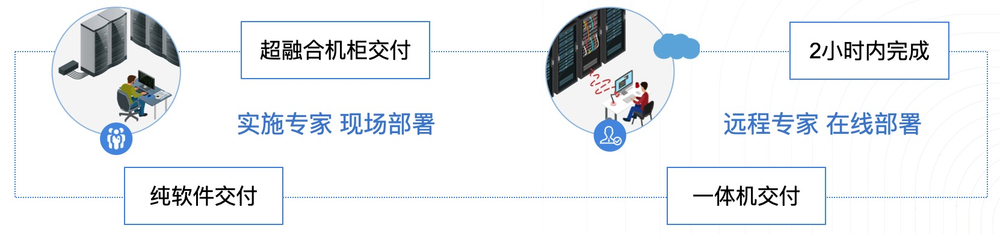
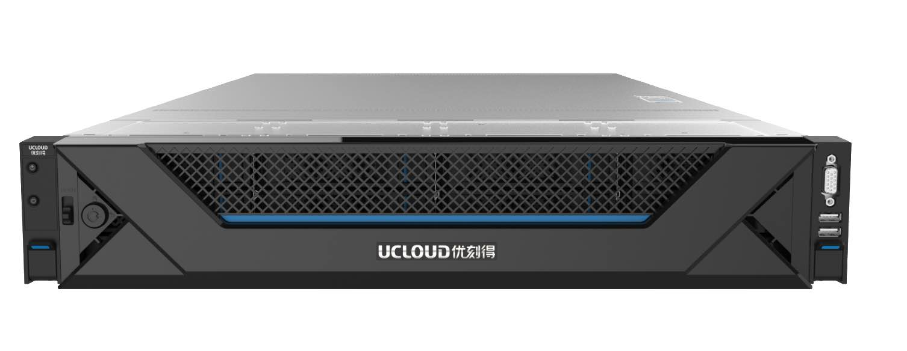

# 1 产品简介

## 1.1 产品概述

UCloudStack （优钛）私有云平台，提供虚拟化、SDN 网络、分布式存储、容器及安全等核心服务的统一管理、资源调度、监控日志及运营运维等一整套云资源管理能力，助力政企数字化转型。

平台基于 UCloud 公有云基础架构，复用内核及核心虚拟化组件，将公有云架构私有化部署，具有自主可控、稳定可靠、持续进化及开放兼容等特点，可通过控制台或 APIs 快速构建资源及业务，支持与公有云无缝打通，灵活调用公有云能力，帮助政企快速构建安全可靠的业务架构。

UCloudStack 定位为轻量级交付，3 节点即可构建生产环境且可平滑扩容，不强行绑定硬件及品牌，兼容 X86 和ARM 架构，并提供统一资源调度和管理，支持纯软件、超融合一体机及一体机柜多种交付模式，有效降低用户管理维护成本，为用户提供一套安全可靠且自主可控的云服务平台。

## 1.2 产品架构

UCloudStack 平台整体产品架构由基础硬件设施、虚拟核心引擎、智能调度系统、核心产品资源、统一云管平台及运维管理平台组成，为平台租户、管理员及运营人员提供云平台管理和服务。

- **基础设施**：用于承载 UCloudStack 平台的服务器、交换机及存储设备等。

  - 平台支持并兼容通用 X86、ARM 及 MIPS 架构硬件服务器，不限制服务器和硬件品牌；
  - 支持 SSD 、SATA 、SAS 等磁盘存储，同时支持计算存储超融合节点及对接磁盘阵列设备，无厂商锁定；
  - 支持华为、思科、H3C 等通用交换机、路由器网络设备接入，所有网络功能均通过 SDN 软件定义，仅需物理交换机支持 Vlan、Trunk、IPv6、端口聚合、堆叠等特性；
  - 支持混合云接入并适配客户现有硬件资源，充分利用资源的同时，无缝对接现有资源服务。
- **虚拟核心引擎**：承载平台核心的操作系统内核、虚拟化计算、存储、网络的实现和逻辑。
  - 内核模块：承载云平台运行的服务器操作系统及内核模块，复用公有云深度优化的 Linux 内核；同时兼容 ARM 生态的 UOS、银河麒麟等操服务器操作系统及内核；
  - 虚拟化计算：通过 KVM 、Libvirt 及 Qemu 实现计算虚拟化，支持标准虚拟化架构，提供虚拟机全生命周期管理，兼容 X86 和 ARM 架构体系，支持热升级、重装系统、CPU 超分、GPU 透传、在线迁移、宕机迁移、反亲和部署等特性，并支持导入导出虚拟机镜像满足业务迁移上云需求；
  - 分布式网络 SDN ：通过 OVS + VXLAN 实现虚拟网络，纯软件定义分布式网络，提升网络转发性能的同时对传统数据中心物理网络进行虚拟化，为云平台资源提供 VPC 隔离网络环境、弹性网卡、外网IP、NAT 网关、负载均衡、防火墙、VPN连接、混合云接入及网络拓扑等网络功能，并支持 IPv4&IPv6 双栈；
  - 分布式存储 SDS ：基于 Ceph 实现分布式高性能存储，为平台提供块存储服务，支持云盘在线扩容、克隆、快照及回滚功能；同时底层数据多副本存储并支持数据重均衡和故障重建能力，保证性能和数据安全性。
- **智能调度系统**
  - 支持反亲和性调度部署策略，保证业务的高可用性和高可靠性；
  - 支持在线迁移技术，实时感知物理机状态和负载信息；
  - 物理主机故障或超过负载时，自动迁移虚拟机至低负载物理主机；
  - 创建虚拟机时，根据业务调度策略，自动启动虚拟机至低负载健康的物理主机；
  - 支持计算额度分配和资源抢占，保障公平的前提下，有效共享物理资源；
  - 支持平台虚拟资源的网络流表控制及下发，保证分布式网络架构的性能及可用性。
- **核心产品资源**
  - **地域（数据中心）**：数据中心指资源部署的物理位置分类，数据中心之间相互独立，如无锡数据中心、上海数据中心等。平台支持多数据中心管理，使用一套管理平台管理遍布各地数据中心的私有云平台；
  - **集群**：用于区分不同资源在一个数据中心下的分布情况，如 x86 计算集群、ARM 计算集群、 SSD 存储集群 及 SATA 存储集群，一个数据中心可以部署多个集群；
  - **多租户**：平台支持多租户模式，提供租户隔离功能、子帐号、权限控制、配额配置及价格配置等功能；
  - **子帐号及权限**：支持一个租户拥有多个子帐号，支持资源隔离并可对子帐号进行资源管理的权限控制；
  - **计量计费**：支持按需、按月、按年三种计费方式，支持过期续费及回收策略，同时提供完整的计费订单及消费明细；
  - **弹性计算**：运行在物理主机上的虚拟机，支持从镜像创建、重启/关机/启动、删除、VNC登陆、重装系统、重置密码、热升级、绑定外网 IP及安全组、挂载数据盘及反亲和策略部署等虚拟机全生命周期功能，同时支持将虚拟机制作为镜像及磁盘快照能力，提供快捷的业务部署及备份能力；
  - **GPU虚拟机**：平台提供 GPU 设备透传能力，支持用户在平台上创建并运行 GPU 虚拟机，让虚拟机拥有高性能计算和图形处理能力；
  - **弹性伸缩**：支持弹性伸缩功能，用户可通过定义弹性伸缩策略，在业务需求增长时自动增加计算资源（虚拟机）以保证计算能力；在业务需求下降时自动减少计算资源以节省成本。基于负载均衡和健康检查机制，可同时适用于请求量波动和业务量稳定的业务场景；
  - **镜像**：虚拟机运行时所需的操作系统，提供 CentOS 、Windows 、Ubuntu 等常用基础操作系统镜像；支持将虚拟机导出为镜像，通过自制镜像重建虚拟机；同时支持镜像的导入导出，便于用户自定义镜像；
  - **云硬盘**：一种基于分布式存储系统为虚拟机提供持久化存储空间的块设备。具有独立的生命周期，支持随意绑定/解绑至多个虚拟机使用，基于网络分布式访问，并支持容量扩容、克隆、快照等特性，为虚拟资源提供高安全、高可靠、高性能及可扩展的磁盘；
  - **快照**：提供磁盘快照及快照回滚能力，可应用于容灾备份及版本回退等业务场景，降低因误操作、版本升级等导致的数据丢失风险；
  - **VPC 网络**：软件定义虚拟专有网络，用于租户间数据隔离，提供自定义 VPC 网络、子网规划及网络拓朴;
  - **外网 IP**：用于虚拟机、负载均衡、NAT 网关及 VPN 网关等资源的外网 IP 接入，用于与平台外网络进行连接，如虚拟机访问互联网或访问 IDC 数据中心的物理机网络；支持同时绑定多个外网 IP 至虚拟资源，并提供 IPv6 网络连接服务；
  - **安全组**：虚拟防火墙，提供出入双方向流量访问控制规则，定义哪些网络或协议能访问资源，用于限制虚拟资源的网络访问流量，支持 TCP 、UDP 、ICMP 及多种应用协议，为云平台提供必要的安全保障；
  - **弹性网卡**：一种可随时附加到虚拟机的弹性网络接口，支持绑定和解绑，可在多个虚拟机间灵活迁移，为虚拟机提供高可用集群搭建能力，同时可实现精细化网络管理及廉价故障转移方案；
  - **NAT 网关**：企业级 VPC 网关，为云平台资源提供 SNAT 和 DNAT 代理，支持自动和白名单两种网络出口模式，并为 VPC 网络提供端口映射代理服务，使外部网络通过 NAT 网关访问虚拟机和 MySQL 。
  - **负载均衡**：基于 TCP/UDP/HTTP/HTTPS 协议将网络访问流量在多台虚拟机间自动分配的控制服务，类似于传统物理网络的硬件负载均衡器.用于多台虚拟机间实现流量负载及高可用，提供内外网 4 层和 7 层监听及健康检查服务；
  - **IPSecVPN**：提供 IPSecVPN 网关服务，通过 IPSec 协议加密的隧道技术，将 UCloudStack 与 UCloud 公有云、IDC 数据中心、第三方公有云的内网打通，在互联网上为两个私有网络提供安全通道，通过加密保证连接的安全；同时 IPSecVPN 服务还可作为 UCloudStack 平台 VPC 间通信的桥梁；
  - **监控告警**：支持虚拟机、弹性伸缩、磁盘、弹性 IP 、NAT网关、负载均衡、IPSecVPN、MySQL、Redis 等资源各维度监控数据收集及展示，同时可通过告警模板快速配置资源监控指标的告警策略和通知规则；
  - **操作日志**：云平台所有资源及云平台自身的操作和审计日志，支持多时间跨度的日志收集和展示，提供操作失败原因；
  - **回收站**：资源删除后暂存的位置，支持回收资源、恢复资源及彻底删除资源等操作；
  - **定时器**：提供定时器任务执行功能，可用来定期执行一系列任务，支持定时创建快照， 可在指定的周期重复执行，也可仅执行一次，且每个任务支持多个资源批量操作。
- **统一云管平台**
  - UCloudStack 平台提供 Web 控制台 和 API 接口两种方式接入和管理云平台；
  - 通过 WEB 控制台用户可快捷的的使用并管理云平台资源，如虚拟机、弹性 IP 、负载均衡 、计费等；
  - 开发者可通过 APIs 自定义构建云平台资源，支持无缝迁移上云。
- **运维管理平台**：为云平台管理员提供的运维运营管理平台，包括租户管理、资源管理、帐务管理、监控告警、日志审计、系统管理及部署升级等功能模块。
  - **租户管理**：用于管理整个云平台的租户及帐号信息，提供创建/冻结租户及充值功能，支持查看租户拥有资源信息、订单记录、交易记录及配额价格等信息，同时支持修改租户的资源配额及产品价格；
  - **资源管理**：支持查看并管理平台所有物理资源和虚拟资源；
    - 物理资源包括物理数据中心、集群、宿主机资源、存储资源、网络IP网段资源池及镜像资源池等；
    - 虚拟资源包括所有租户及子帐号所拥有的资源，包括虚拟机、VPC 、负载均衡、外网 IP 、弹性网卡、弹性伸缩、NAT 网关、MySQL、Redis、IPSecVPN、监控告警、安全组、回收站等；
  - **帐务管理**：支持查看平台所有订单记录、交易记录、充值记录及全局产品价格，支持配置平台整体产品价格，同时支持财务报表导出；
  - **平台监控告警**：提供 UCloudStack 自身物理设备、组件及所有虚拟资源的监控数据，并支持自定义监控报警和通知；
  - **日志事件**：提供平台所有租户、子帐号及管理员的操作日志和审计信息，可进行多维度的筛选和搜索；
  - **系统管理**：提供云平台全局配置、规格配置和配额管理功能。
    - 全局配置包含邮箱设置、回收策略、网络设置、计费、资源管理、配额设置、登录态、控制台及网站设置等；
    - 规格配置支持对虚拟机的 CPU 内存规格、磁盘容量范围、外网 IP 带宽及 MySQL/Redis 内存规格进行自定义配置；
    - 全局配额支持查看并修改全局每个地域虚拟资源的配额值。
  - **部署升级**：平台支持自动化脚本安装物理服务器节点，包括操作系统、云平台组件及管理服务等。
- **基础监控服务**：云平台基础硬件资源的外围监控服务，包括云平台接入的所有网络设备、服务器、磁盘阵列等硬件设备的运行状态和性能指标进行监控告警，同时也可对集群中 MySQL、Redis、MongoDB 等常用服务进行监控和告警。

## 1.3 产品特性

- 自主可控

  基于公有云架构，复用核心虚拟化组件自主研发，可控性高且可靠性经上万家企业验证。

- 稳定可靠

  平台服务高可用，虚拟资源智能调度，数据存储多副本，自愈型分布式网络，为业务保驾护航。

- 简单易用

  3 节点构建生产环境，规模轻量可水平扩展，支持业务平滑迁移，助力政企轻松上云。

- 开放兼容

  不绑定硬件品牌，兼容 X86 和 ARM 架构及生态适配，设备异构搭建统一管理。

## 1.4 技术架构特性

### 1.4.1 API 幂等性

幂等性是指一次和多次请求某一个资源应该具有同样的副作用，保证资源请求无论调用多少次得到的结果始终一致。如多次调用更新虚拟机的 API 请求，返回的结果都是一致的。

UCloudStack 通过分布式锁、业务字段唯一约束及 Token 唯一约束等技术手段保证平台资源 API 幂等性。对虚拟机、云硬盘、VPC 、负载均衡等资源的操作请求（除创建请求）均支持重复提交，并保证多次调用同一个 API 请求返回结果的一致性，同时避免网络中断导致 API 未能获取确切结果，从而导致重复操作的问题；

### 1.4.2 全异步架构

* 云平台使用消息总线进行服务通信连接，在调用服务 API 时，源服务发消息给目的服务，并注册一个回调函数，然后立即返回；一旦目的服务完成任务，即触发回调函数回复任务结果；
* 云平台服务之间和服务内部均采用异步调用方法，通过异步消息进行通信，并结合异步 HTTP 调用机制，保证平台所有组件均实现异步操作；
* 基于异步架构机制，云平台可同时管理数十万以上的虚拟机及虚拟资源，后端系统每秒可并发处理上万条 API 请求；
* UCloudStack 采用的插件机制，每个插件设置相应的代理程序，同时在 HTTP 包头为每个请求设置回调 URL ,插件任务结束后，代理程序发送应答给调用者的 URL ；

### 1.4.3 分布式

**(1) 分布式底层系统**：UCloudStack 核心模块提供计算、存储及调度等分布式底层支持，用于智能调度、资源管理、安全管理、集群部署及集群监控等功能模块。

* 智能调度：基于分布式服务调用和远程服务调用为租户提供智能调度模块。智能调度模块实时监测集群和所有服务节点的状态和负载，当某集群扩容、服务器故障、网络故障及配置发生变更时，智能调度模块将自动迁移被变更集群的虚拟资源到健康的服务器节点，保证云平台的高可靠性和高可用性；
* 资源管理：通过分布式资源管理模块，负责集群计算、存储、网络等资源的分配及管理，为云平台租户提供资源配额、资源申请、资源调度、资源占用及访问控制，提升整个集群的资源利用率；
* 安全管理：分布式底层系统提供安全管理模块，为租户提供身份认证、授权机制、访问控制等功能。通过 API 密钥对和用户名密码等多种方式进行服务间调用及用户身份认证；通过角色权限机制进行用户对资源访问的控制；通过 VPC 隔离机制和安全组对资源网络进行访问控制，保证平台的安全性；
* 集群部署：分布式底层系统为云平台提供自动化部署集群节点的模块，为运维人员提供集群部署、配置管理、集群管理、集群扩容、在线迁移及服务节点下线等功能，为平台管理者提供自动化部署通道；

* 集群监控：监控模块主要负责平台物理资源和虚拟资源信息收集、监控及告警。监控模块在物理机及虚拟资源上部署 Agent ，获取资源的运行状态信息，并将信息指标化展示给用户；同时监控模块提供监控告警规则，通过配置告警规则，对集群的状态事件进行监控及报警，并有效存储监控报警历史记录；

**(2) 分布式存储系统**：UCloudStack 采用高可靠、高安全、高扩展、高性能的分布式存储系统，提供块存储服务，保证本地数据的安全性和可靠性。

- 软件定义分布式存储，将大量通用机器的磁盘存储资源聚合在一起，采用通用的存储系统标准，对数据中心的所有存储进行统一管理；
- 分布式存储系统采用多副本数据备份机制，写入数据时先向主副本写入数据，由主副本负责向其他副本同步数据，并将每一份数据的副本跨磁盘、跨服务器、跨机柜、跨数据中心分别存储于不同磁盘上，多维度保证数据安全；
- 多副本机制存储数据，将自动屏蔽软硬件故障，磁盘损坏和软件故障，系统自动检测到并自动进行副本数据备份和迁移，保证数据安全性，不会影响业务数据存储和使用
- 分布式存储服务支持水平扩展、增量扩容及数据自动平衡性，保证存储系统的高扩展性；
- 支持 PB 级存储容量，总文件数量可支持亿量级；
- 支持不间断数据存储和访问服务，SLA 为 99.95% ，保证存储系统的高可用性；
- 支持高性能云硬盘，IOPS 和 吞吐量随存储容量规模线性增长，保证响应时延；

在部署上，计算节点自带 SSD 磁盘构建为高性能的存储池，计算节点自带的 SATA/SAS 磁盘构建为普通性能存储池。分布式存储系统将块设备内建为弹性块存储，可供虚拟机直接挂载使用，在数据写入时通过三副本、写入确认机制及副本分布策略等措施，最大限度保障数据安全性和可用性。在本地可通过备份及快照技术，将本地数据定时增量备份服务器或对象存储服务，在数据丢失或损坏时，可通过备份快速恢复本地业务的数据，包括数据库数据、应用数据及文件目录数据等，可实现分钟级恢复。

**(3) 分布式网络架构**：采用分布式 Overlay 网络，提供 VPC 、NAT 网关、负载均衡、安全组、外网 IP 等网络功能。

- UCloudStack 云平台 Overlay 网络分布式运行在所有计算节点；
  - 管理服务仅作为管理角色，不承担网络组件部署及生产网络传输；
  - 虚拟网络流表分发服务为高可用架构，仅做流表分发不透传生产网络传输；
  - 所有生产网络仅在计算节点上传输，无需通过管理服务或流表分发服务进行转发；
  - 管理服务和流表分发服务故障，不影响已部署好的虚拟资源运行及通信。
- 超融合计算节点或独立存储节点根据磁盘和业务分不同的集群（Set）；
  - 每个集群最多 45 台节点，控制集群规模；
  - 业务数据网络仅在单集群中进行传输，即在单组交换机中进行传输。
- 分布式存储直接通过物理网络进行挂载，无需通过 overlay 网络进行挂载和传输；
  - 通过 libvirt 融合分布式存储 rbd 和 qemu ，qemu 通过 librbd 操作分布式存储；
  - 虚拟化进程与分布式存储进程通过本机 & 跨物理机内网进行通信；
  - 云平台内网至少使用万兆交换机并做端口聚合，可满足虚拟机和分布式存储的性能需求；

分布式网络架构将业务数据传输分散至各个计算节点，除业务逻辑等北向流量需要管理服务外，所有虚拟化资源的业务实现等南向流量均分布在计算节点或存储节点上，即平台业务扩展并不受管理节点数量限制。

### 1.4.4 高可用

UCloudStack 私有云平台架构，从硬件设施、网络设备、服务器节点、虚拟化组件、分布式存储均提供高可用技术方案，保证整个云平台业务不间断运行：

- 数据中心机柜级别冗余性设计，所有设备均对称部署于机柜，单机柜掉电或故障不影响业务；
- 网络服务区域隔离设计，内网业务和外网业务在物理设备上完全隔离，避免内外网业务相互影响；
- 网络设备扩展性设计，所有网络设备分为核心和接入两层架构，一套核心可水平扩展几十套接入设备；
- 网络设备冗余性设计 ，所有网络设备均为一组两台堆叠，避免交换机单点故障；
- 交换机下联接入冗余性设计，所有服务器双上联交换机的接口均做 LACP 端口聚合，避免单点故障；
- 服务器网络接入冗余性设计，所有服务器节点均做双网卡绑定，分别接入内网和外网，避免单点故障；
- 管理节点冗余性和扩展性设计，多台管理节点均为 HA 部署，并支持横向扩展，避免管理节点单点故障；
- 通过智能调度系统将虚拟机均衡部署于计算节点，可水平扩展计算节点数量；
- 分布式存储冗余性设计，将数据均衡存储于所有磁盘，并三副本、写确认机制及副本分布策略保证数据安全；
- 进行服务器节点及存储扩展时，只需增加相应数量的硬件设备，并相应的配置资源调度管理系统；
- 云平台内各组件均采用高可用架构设计，如管理服务、调度服务、网络流表分发服务等，保证平台高可用；
- 云平台提供的产品服务，如负载均衡、NAT 网关、数据库服务及缓存服务均采用高可用架构构建，保证云平台提供服务的可靠性。

### 1.4.5 业务实现分离

UCloudStack 云平台架构从业务逻辑上分为北向接口和南向接口，将云平台的业务逻辑和业务实现进行分离，业务管理逻辑不可用时，不影响虚拟资源的正常运行，整体提升云平台业务可用性和可靠性。

* 北向接口：仅定义业务逻辑，提供业务接口，负责北向数据落地。业务接口包括帐户认证、资源调度、监控、计费、API 网关及 WEB 控制台等业务服务接口；
* 南向接口：仅定义业务实现，负责将北向接口的业务转换为实现，如虚拟机运行、VPC 网络构建、分布式存储数据存储等；

业务实现分离后，当云平台业务端（如 WEB 控制台）发生故障时，并不影响已运行在云平台上的虚拟机及运行在虚拟机中的业务，一定程度上保证业务高可用。

### 1.4.6 组件化

UCloudStack 将云平台的所有虚拟资源组件化，支持热插拔、编排组合及横向扩展。

* 组件化包括虚拟机、磁盘、网卡、IP、路由器、交换机、安全组等；
* 每种组件均支持热插拔，如将一个 IP 绑定至一个在运行中的虚拟机；
* 每种组件均支持横向扩展，如横向增加虚拟机的磁盘，提升整体云平台的健壮性 。

## 1.5 客户痛点

### 1.5.1 自建私有云的痛点

* 可控性差

  业界基于开源架构封装的私有云核心组件和服务源自社区，可控性差且可靠性未经验证，平台特性升级受限于社区且需专精运维人员，同时开源框架构繁杂，部署实施环节复杂，实施难度大。

* 投入成本大

  OEM 公有云直接部署的专有云平台，所有服务均需独立的服务器集群，起始部署规模较大且通常限制硬件架构及品牌，部署实施需要投入大量基础设施和人力资源；在运维方面通常需要托管运维，建设成本较高。

* 运维复杂

  自建数据中心及通用虚拟化系统，对于业务构建所需的数据库、缓存、负载均衡等一系列应用，需自己通过虚拟机进行搭建并维护，同时还需考虑服务的集群部署、监控、日志、备份、容灾及可靠性和可用性等。

* 兼容性差

  通用数据中心及虚拟化系统，对国产化硬件、操作系统、中间件的适配及兼容性较差。

### 1.5.2 解决之道

* 可控可靠

  UCloudStack 采用非开源架构，基于公有云自主研发，复用内核及核心虚拟化组件，将公有云部署规模重构为可运营、可运维、可快速交付且可私有化交付的云平台，可控性高且可靠性经上万家企业验证。

* 轻量构建

  平台所有产品服务使用统一底层资源池，所有产品无需准备专用服务器集群，3节点即可轻量构建生产环境，规模轻量且可水平扩展，支持自动化一键部署并提供平滑升级能力，一个运维人员即可轻松管理。

* 丰富组件

  公有云一致用户体验的自服务平台，除基础 IaaS 产品外，为政企用户提供高可用、高可靠且可自服务的负载均衡、NAT网关、IPSecVPN、数据库服务及缓存服务等 PaaS 类产品服务。

* 兼容性高

  平台本身不绑定硬件架构及品牌，兼容X86、ARM、MIPS等主流架构，可异构搭建并进行统一资源管理；同时已适配信创体系硬件、操作系统及中件间，如华为泰山加鲲鹏、飞腾加银可麒麟、UOS 及南大通用数据库等。

## 1.6 应用场景

### 1.6.1 虚拟化&云化

通过将业务系统和内部应用部署至UCloudStack平台，可为用户提供一套集虚拟化、分布式存储、SDN 网络为一体的私有云平台。平台支持多数据中心管理，可将业务部署至多个数据中心构建灾备云或边缘计算，同时支持与公有云无缝打通，灵活调用公有云能力，帮助政企快速构建安全可靠的业务架构。

### 1.6.2 业务快速交付

平台服务所见即所得，可通过自服务云管理平台一键部署并管理业务交付所需的基础设施和中件间，包括在线扩容、负载分发、数据库缓存及监控日志等应用基础环境服务能力；同时平台支持镜像导入导出，可方便快捷将业务系统迁移至云平台，并可对所有业务系统的资源进行统一管理。

### 1.6.3 超融合一体机

平台提供一体机交付模式，多款机型应用不同业务场景，集成UCloudStack私有云平台，出厂预装开箱即用，服务模块热插拔可按需部署，提供虚拟化、网络、存储、数据库、缓存及云管等一系列云服务能力；同时可通过与IDC数据中心互联，构建混合云解决方案。

### 1.6.4 政企专有云

UCloudStack提供租户控制台和管理员控制台，支持多租户、账户注册、计量计费等功能特性，同时为云平台管理者提供运营运维管理功能，包括资源管理、租户管理、价格配置、资源规格配置、部署升级及监控日志等服务，为政企提供行业专有云解决方案。

UCloudStack 轻量级私有云属于 IaaS+PaaS 复合型产品，并可按需搭载大数据、安全屋、AI 等公有云产品，适用于全行业客户需要云化且私有部署的业务应用上云场景，典型行业如下：

* **政府、央企、军工、交通、制造型企业**

  对外承担公共服务职责，内外部业务应用系统和商用软件需要快速交付、资源共享、智能调度及统一管理等上云需求的行业客户。

* **泛互联网行业，如B2B电商、大数据、教育等企业**

  需要构建行业专属云，结合自有SaaS业务为其用户提供整体解决方案的行业客户。

* **人工智能和科研实验室行业**

  需要大量可快速交付且私有化部署的虚拟化环境，用于科研项目和训练系统的快速部署和管理的行业客户。

## 1.7 交付模式

UCloudStack定位为轻量级交付，3 节点即可构建生产环境且可平滑扩容，并提供统一资源调度和管理，**支持纯软件、超融合一体机及超融合机柜**多种交付模式，有效降低用户管理维护成本，为用户提供一套安全可靠且自主可控的云服务平台。

* **纯软件交付**

  客户提供承载云平台运行的硬件服务器、网络设备及相关基础设施，UCloud 优刻得提供 **UCloudStack 轻量级私有云软件**；通常在基础网络设施环境完备的情况下，UCloudStack 软件可在 2 小时内完成部署并交付。

* **超融合一体机**

  客户仅需提供数据中心基础设施，UCloud 优刻得提供**超融合一体机**（出厂预装 UCloudStack ），通常在基础网络设施环境完备的情况下，可在小时内完成初始化并交付。

  

* **超融合机柜**

  客户仅需提供数据中心即可，UCloud 优刻得提供**超融合一体机柜**（包含网络设备、服务器节点&一体机、PDU、线缆及 UCloudStack 软件 ），通常以一个机柜的形式进行交付。

  
  
  

