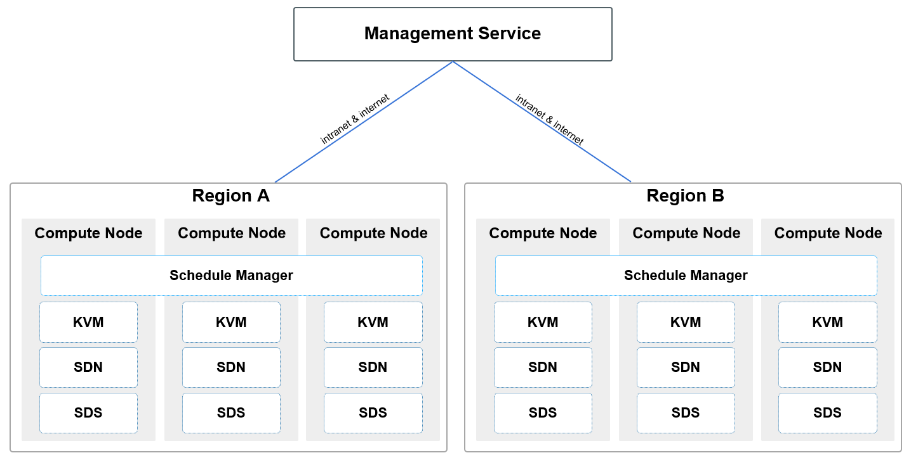

# 2 平台物理架构

## 2.1 物理集群节点

UCloudStack 云平台系统常见集群节点角色有 4 种，分别是管理节点、计算存储融合节点、独立计算节点、以及独立存储节点。

### 2.1.1 管理节点

集群内部署的核心管理服务，承载 UCloudStack 云平台的北向接口服务模块，包括帐户认证、计量计费、资源管理、API-Gateway 及服务监控等服务，提供标准 API 和 WEB 控制台两种接入和管理方式。

* 管理节点负责虚拟资源全生命周期的管理，由于北向业务与南向实现接口分离及分布式网络机制，网络流量通过所在计算节点直接转发，平台业务扩展并不受管理节点数量限制；
* 云平台支持统一的底层资源，基于管理服务仅转发和透传管理流量，平台支持并推荐将管理服务部署于计算节点的虚拟机中，通过平台虚拟机的智能调度提供管理能力的高可用。

管理服务与计算服务间通过 TCP/IP 协议进行通信，提供管理服务通过内网或外网与计算节点通信的能力，支持管理服务与计算服务分离部署，如管理服务部署至公有云或其中一个数据中心，计算节点分布在各个数据中心，通过全局云管平台跨机房、跨数据中心及跨地域统一管理。

### 2.1.2 计算存储融合节点

计算存储融合节点，同时包含计算资源和存储资源，用于运行虚拟机、虚拟网络、分布式存储、数据库服务、缓存服务等资源，同时承载智能调度控制和监控服务。云平台分布式存储使用所有计算节点的数据磁盘，每个节点仅支持部署一种类型的数据磁盘，如 SATA、SSD等（使用SSD作为缓存的场景除外）。生产环境至少部署 3 台以上，保证分布式系统的正常部署和运行。

在部署上，每台计算节点均会部署用于运行计算存储网络的 KVM、Qemu、Libvirt、OVS、Ceph 等核心组件，同时在每个地域中至少有3台计算节点会部署核心调度及管理模块，如下图所示：

其中【Schedule Manager】即为 UCloudStack 云平台的核心调度及管理模块，用于虚拟资源的运行调度及虚拟网络的流表下发管理，每一个地域仅需部署一套高可用的 Schedule Manager 。一般为主备模式，可在3台或多台计算节点上进行部署，当部署调度模块的主计算节点服务器物理故障时，部署调度模块的备计算节点将自动接替调度服务，保证核心调度及流表控制服务的可用性。

每个地域或数据中心的部署的 Schedule Manager 均会开放一个 API 端点，作为管理服务连接并管理数据中心计算资源的统一入口。API 端点支持通过内网和互联网的连接模式，在 TCP/IP 网络通信可达的情况下，管理服务（Management Service）支持部署于相同数据中心，也可部署于公有云或其它数据中心，并可为多数据中心计算资源提供统一调度和管理，满足云平台多应用场景部署。

### 2.1.3 独立计算节点

集群内宿主机节点：

* 用于独立运行所有计算和网络资源，通过挂载独立存储节点的磁盘作为云平台的存储资源；
* 一般由几台到几千台服务器组成，生产环境至少部署 3 台以上，保证分布式存储系统的多副本部署及运行；
* 通常建议将相同配置的计算节点服务器放置在一个集群内进行虚拟资源的调度。

### 2.1.4 独立存储节点

独立存储节点，用于独立承载分布式存储的节点，构建独立存储区域。适合将计算和存储分离，搭建独立存储网络的场景。独立存储节点，使用独立的存储网络接入设备，与计算业务物理或逻辑隔离。

* 部署独立存储节点，可节省计算节点的 CPU、内存等资源；
* 一般由几台和几千台服务器组成，生产环境至少部署 3 台以上，保证分布式系统的正常部署和运行；
* 独立存储节点为【**可选**】节点，如果采用融合节点，可使用计算存储超融合节点上的数据磁盘作为分布式存储的存储池。

部署存储节点时，每个节点需配置相同介质类型的数据磁盘，如全 SSD 存储节点、SATA 存储节点 等（使用SSD作为缓存的场景除外），将相同磁盘类型的节点组成一个存储集群，分别作为普通存储和高性能存储资源池。

> 如需对接商业存储设备，需将存储设备与存储节点相连，在存储节点上部署分布式存储系统，将磁盘阵列作为存储资源池。同时，存储节点仍需配置磁盘，用于管理服务的数据存放。

### 2.1.5 推荐节点方案

UCloudStack 物理节点方案会根据企业业务需求及应用场景进行调整，可部署计算存储融合节点（例如 3+3 的节点方案，即 3 台 SATA 超融合计算节点 + 3 台 SSD 超融合计算节点，管理服务部署于计算节点的虚拟机中，后续可根据业务规模水平扩展，如将 SATA 超融合计算节点扩容为 9 台），也可部署独立计算节点+独立存储节点（后续可根据业务规模水平扩展计算节点或存储节点）。

SSD 和 SATA 节点的配比取决于业务需求，如高存储容量需求较大，则需配置较多的 SATA 节点；若高性能业务需求较多，则需配置较多的 SSD 全闪节点。

最佳实践中，生产环境至少需要 3 台 SATA/SSD 超融合节点部署搭建  UCloudStack 平台，即 UCloudStack 最小生产规模为 3 台服务器。

## 2.2 物理网络架构

为构建高可用、高可靠、高安全的企业专有云平台， UCloudStack 平台均采用高可用冗余性设计。本文以标准网络拓扑图为基础进行物理网络架构描述，本架构设计至少需要 6 台万兆交换机、2 台千兆交换机、 多台计算&存储节点服务器。若有 IPMI 管理及网络设备管理等需求，可根据需求增加 IPMI 和 Management 交换机并接入网络。

UCloudStack 平台网络设计为**核心**、**接入**二层架构，接入交换机双上联到核心，且按计算业务分集群划分。本架构设计从业务场景上提供公网服务，因此整体业务架构分为**内网区域**和**外网区域**两张网络，分别承载云平台内网通信和外网通信，两张网络在网络设备层面物理隔离。

### 2.2.1 架构规模

标准的网络架构为单数据中心网络架构，以下述配置为例，单数据中心可支撑 900 ~1000 台规模的节点数量：

- 两台交换机堆叠在一起，称为一组交换机，如一组内网接入交换机或一组外网接入交换机；
- 通常一组接入交换机为 96 个业务接口，堆叠检测及备用占用 3\*2 个接口，可用业务端口为 90 个；
- 每个服务器节点使用两个网卡占用一组接入交换机的 2 个接口，即一组接入交换机可接入 45 台服务器；
- 每增加一组交换机即可扩展 45 个节点，一组核心交换机至少可接入 20 组接入交换机，即至少可支撑 900 个节点服务器。

### 2.2.2 网络区域

网络区域的设备通常包括内网核心交换机、外网核心交换机、内网接入交换机、外网接入交换机。若服务器节点规模较小且暂不考虑扩容，可仅采用内/外网接入交换机。

- 内网核心交换机：采用 2 台 40GE 的三层交换机堆叠作为一组内网核心，用于承载内网接入交换机的汇聚和管理；
- 外网核心交换机：采用 2 台万兆三层交换机堆叠作为一组外网核心，用于承载外网接入交换机的汇聚和管理；
- 内网接入交换机：采用 2 台万兆交换机堆叠作为一组内网接入，用于承载 45 台服务器内网接入；
- 外网接入交换机：采用 2 台千兆交换机堆叠作为一组外网接入 ，用于承载 45 台服务器外网接入；
- 除 Internet 连接外，网络均为大二层环境，采用 LLDP 协议获取网络拓扑信息，所有网络接入均为端口聚合，保证高可用；同时通过控制接口广播报文流量，抑制网络广播风暴；
- 外网核心交换机与 Internet 之间可以为二层聚合、三层聚合、L3 ECMP 、L3 A/S 等互连模式，同时支持串联或旁挂防火墙、IDS、IPS 及防 DDOS 等安全设备；
- 云平台提供的网络功能均采用软件定义的方式实现，物理交换机仅作为网络流量转发设备，即仅使用交换机部分通用能力，如**堆叠、Vlan、Trunk、LACP 及 IPV6** 等，无需采用 SDN 交换机实现虚拟网络的通信。

标准网络架构中，通常推荐至少采用万兆及以上级别的交换机，保证平台节点内网接入、虚拟资源通信及分布式存储的性能及可用性。由于外网接入带宽一般较小，通常推荐采用千兆交换机作为外网接入设备。

### 2.2.3 服务器区域

服务器区域的设备通常包括计算存储超融合节点、独立计算节点、独立存储节点、以及管理节点。若直接使用计算节点的虚拟机作为管理节点，即可省去物理管理节点服务器。

- 计算节点**【必选】**：采用 x86/ARM 架构服务器作为计算节点或计算存储超融合节点，用于运行虚拟机、虚拟网络分布式、存储服务及数据库缓存等服务，承载整个云平台的资源核心实现及运行。
  - 采用 2 个 GE 网卡分别上联到两台外网接入交换机 ，并做双网卡 bond ，作为计算节点外网接入；
  - 采用 2 个 10GE 网卡分别上联到两台内网接入交换机 ，并做双网卡 bond ，作为计算节点内网接入；
  - 若为超融合节点，则分布式存储使用所有计算节点上的数据磁盘，所有计算节点上的数据磁盘组成统一分存储资源池，用于构建分布式存储；
  - 若为独立计算节点，则分布式存储使用存储节点上的数据磁盘作为统存储资源池，通过网络跨集群挂载。
- 独立存储节点**【可选】**：若计算存储需要分离部署，可采用 x86/ARM 架构且磁盘较多服务器作为独立存储节点，用于承载独立的分布式存储服务。
  - 存储节点与计算服务通过内网进行通信，仅需 2 个 10GE 网卡分别上联到两台内网接入交换机 ，并做双网卡 bond ，作为存储节点的内网接入；
  - 如需将计算存储网络物理隔离，可采用独立存储接入交换机，存储节点的网卡上联至存储接入交换机；
  - 分布式存储使用存储节点及超融合节点上的所有数据磁盘，三副本保证数据安全；
  - 为保证分布式存储的性能及可用性，存储节点必须采用万兆以上速率的网卡。
- 管理节点【**可选**】：平台默认推荐使用平台虚拟机部署管理服务，如需**物理服务器**承载并运行管理服务，可采用 x86/ARM 服务器作为云平台管理节点，用于承载云平台管理塻块及服务。
  - 采用 2 个 GE 网卡分别上联到两台外网接入交换机 ，并做双网卡 bond ，作为管理节点外网接入；
  - 采用 2 个 10GE 网卡分别上联到两台内网接入交换机 ，并做双网卡 bond ，作为管理节点内网接入。

> 以上网卡 bond 均采用 “ mode=4 ” 模式，即 IEEE 802.3ad 动态链路聚合。

### 2.2.4 标准架构扩展

在实际项目中，根据用户需求和所提供的环境，可对标准网络架构进行调整，如项目较小规模（ 48 节点内）或仅需一个简单的测试环境或等场景。

（1）如需内外网物理隔离且考虑接入冗余，可采用 2 组共 4 台接入交换机进行业务部署。
- 2 台堆叠用于服务器内网接入，2 台堆叠用于服务器外网接入；
- 每台服务器内外网分别使用 2 个接口绑定接入内外网接入交换机，可支持 48 台服务器节点冗余接入。

（2）如需内外网物理隔离且不考虑接入冗余，可采用 2 台接入交换机进行业务部署；
- 1 台用于服务器内网接入，1 台用于服务器外网接入；
- 每台服务器分别使用 1 个接口接入内网接入交换机及外网接入交换机，支持 48 台服务器节点接入；

（3）若内外网无需物理隔离且考虑接入冗余，可采用 2 台交换机堆叠，通过 Vlan 隔离内外网，如下图所示：

- 方案一：通过在交换机上划分 Vlan ，服务器分别使用 2 个接口绑定接入交换机内外网 Vlan 接口，即每台服务器需 2 组 `bond` (4 个接口)实现内外网业务通信，可支持 24 节点；
- 方案二：通过在服务器操作系统内划分 Vlan（即子接口），服务器分别使用 2 个接口绑定接入交换机 Trunk 接口，即每台服务器仅需 2 个接口绑定实现内外网业务通信，可支持 48 节点；

（4）若内外网无需物理隔离且不考虑接入冗余，可采用 1 台交换机，通过交换机 Vlan 或服务器内划分 Vlan 进行内外网隔离及接入。

（5）若实际环境中需要采用独立的计算节点和独立的存储节点，并需要将计算网络和存储网络进行物理隔离，可以为独立存储节点单独划分一对接入交换机上联至内网核心交换机，实现计算和存储网络进行分离。平台计算虚拟机可通过物理网络挂载多个存储网络的存储集群，采用独立的存储网络设计可将存储节点及分布式存储系统内部同步流量与虚拟机计算读写存储的流量进行分离，提高平台整体的稳定性和性能。

## 2.3 硬件选型

### 2.3.1 推荐配置

**（1）网络设备推荐配置**

| 业务                      | 配置描述                       |
| ------------------------ | ------------------------------ |
| 内网核心交换机           | 40G板卡(16口) * 4 + 64 * 40GE |
| 外网核心交换机           |  48\*10GE + 6\*40GE             |
| 内网接入交换机(**必选**) | 48\*10GE + 6\*40GE             |
| 存储接入交换机           | 48\*10GE + 6\*40GE             |
| 外网接入交换机           |  48\*GE + 4\*10GE + 2\*40GE     |

> 交换机型号默认推荐华为 CE 系列，亦可根据配置选择其它品牌同等配置交换机。

**（2）服务器推荐配置**

| 业务                           | 配置描述                                                     |
| ------------------------------ | ------------------------------------------------------------ |
| 计算存储融合节点（存储密集型） | Factor Form：2U CPU Intel® Xeon® Silver 4210R Processor (13.75M Cache, 2.40 GHz, 10 core)  *2 DDR4_32GB_RDIMM_2667MHz *6 OS HDD 480G_SSD_SATA3_512E_2.5"_6Gb/s *2 Data HDD SATA3_HDD_8TB_6Gb/s_7200RPM *12 HDD Controller 12Gb_HBA_Card *1 NIC 10GFibre光口双口（不含SFP+多模模块）1 PSU >=800W白金版 *2 |
| 计算存储融合节点（计算密集型） | Factor Form：2U CPU Intel® Xeon® Gold 6248R Processor (35.75M Cache, 3.00 GHz, 24 core) * 2 DDR4_32GB_RDIMM_2933MHz *12 OS HDD 480G_SSD_SATA3_512E_2.5"_6Gb/s *2 Data HDD SATA3_SSD_960GB_6Gb/s *12 HDD Controller 12Gb_HBA_Card *1 NIC 10GFibre光口双口（不含SFP+多模模块）1 PSU  >=800W白金版 2 |

### 2.3.2 最低配置

用于生产环境的最低主机和网络硬件配置，一般生产环境至少需要 3 台计算节点和 2 台万兆接入交换机。

**（1）服务器最低配置**

| 配置分类 | 配置说明                                                     |
| -------- | ------------------------------------------------------------ |
| CPU      | CPU 不低于16核，且支持 x86 或 ARM 架构的硬件虚拟化特性 通常建议服务器配置相同型号的 CPU |
| 内存     | 单台服务器的内存不低于 128 GB                                |
| 网卡     | 最低配置：1张万兆网卡2个网口 推荐配置：2张万兆网卡       |
| 磁盘     | 2 块系统盘做 RAID1 本地数据盘根据业务情况，可使用机械硬盘 SATA 和 SSD 硬盘 若业务对读写性能要求较高，建议采用 SSD 或 NVMe 类型的硬盘 |

**（2）网络设备最低配置**

| 业务 | 网络设备描述                                                 |
| ---- | ------------------------------------------------------------ |
| 内网 | 至少 2 台普通二层交换机，做交换机堆叠，保证高可用            |
| 外网 | 如需外网接入，可与内网共用交换机，通过 Vlan 进行逻辑隔离，详见 [标准架构扩展](#_224-标准架构扩展) |

## 2.4 机柜空间规划

网络设备和服务器的物理机柜空间规划如下图所示：

所有设备在机柜中对称部署，实现机柜级冗余，单机柜掉电或故障不影响云平台业务。一个机柜可支撑 15 个节点，根据网络架构设计一组接入交换机支撑 45 个节点，即一组接入交换机支撑 3 个机柜。3 个机柜为 1 组，平均 1 组机柜支撑 45 个节点、1 组内网接入交换机、1 组外网接入交换机、1 台 IPMI 接入交换机。

如上图项目案例中的设备包括 8 台业务交换机、4 台运维管理交换机、21 台服务器设备及 3 个机柜：

- 一组内网核心交换机对称部署于 2 个机柜，即其中两个机柜各部署 1 台；
- 一组内网接入交换机对称部署于 2 个机柜，即其中两个机柜各部署 1 台；
- 一组外网核心交换机对称部署于 2 个机柜，即其中两个机柜各部署 1 台；
- 一组外网接入交换机对称部署于 2 个机柜，即其中两个机柜各部署 1 台；
- 一组管理汇聚交换机对称部署于 2 个机柜，即其中两个机柜各部署 1 台；
- 1 台 IPMI 接入交换机 和 1 台网络设备带外管理交换机部署于 1个机柜；
- 3 台管理节对称部署于 3 个机柜，即每个机柜各部署 1台；
- 12 台计算 & SATA 节点对称部署于 3 个机柜，即每个机柜各部署 4 台；
- 6 台计算 & SSD 节点对称部署于 3 个机柜，即每个机柜各部署 2 台。

> 若服务器分集群部署云平台，建议不同集群的服务器对称部署于多个机柜中。

