# 3 平台技术架构

UCloudStack 平台基于 UCloud 公有云平台，复用公有云核心组件，具备计算虚拟化、智能调度、存储虚拟化、网络虚拟化的基础能力，为用户提供软件定义的计算、存储、网络及资源管理等服务，在保证资源服务性能、可用性及安全性的同时，提供统一资源调度及管理服务，适应企业基础设施服务的多种应用场景。

在标准化通用产品服务外，平台针对国产化场景提供一云多芯的信创政务云平台，从芯片到应用全适配政务云；同时面向高性能场景提供软硬协调设计的全新快杰私有云。

## 3.1 计算虚拟化

云计算技术是虚拟化技术的延伸，计算虚拟化是在硬件之上增加一个 Hypervisor，通过它虚拟出多个完全隔离的主机并可安装不同的操作系统，承载不同的应用程序运行，最大程度上解决了一台物理机被一个系统或一个应用占用的问题，有效的提高资源使用率。

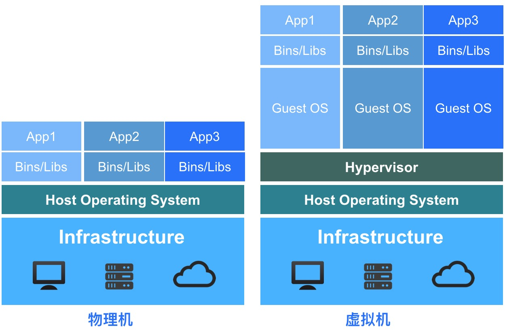

如上图所示，物理机和虚拟机在应用部署及资源占用上有本质区别：

* 物理机环境
  * 操作系统是直接安装在物理机上，通常一台物理机只支持安装一个操作系统；
  * 所有的应用程序和服务均需部署在物理机操作系统上，共享底层硬件资源；
  * 多个应用程序对底层操作系统的及组件要求不一致时，可能会导致应用无法正常运行，需要将两个应用程序分虽部署至一台物理机上，在非业务高峰时资源利用率较低。
* 虚拟机环境
  * 在硬件底层及操作系统之上增加 Hypervisor 层，作为计算虚拟化的引擎；
  * 虚拟化引擎支持将底层硬件虚拟为多个主机，即虚拟机；
  * 每个虚拟机都拥有独立的硬件设施，如 CPU、内存、磁盘、网卡等；
  * 每个虚拟机可以独立安装并运行不同的操作系统（GuestOS），相互完全隔离，彼此不受影响；
  * 每个虚拟机操作系统与物理机的操作系统一致，拥有独立的组件及库文件，可运行专属应用服务；
  * 多个应用程序的虚拟机在完全隔离且彼此不影响的情况下运行在一台物理机上，并共享物理机的资源，提高物理机的资源使用率及管理效率。

UCloudStack 计算虚拟化采用 KVM 和 Qemu 等 Hypervisor 组件及技术，将通用裸金属架构的 x86/ARM 服务器资源进行抽象，以虚拟机的方式呈现给用户。虚拟机将 CPU、 内存、I/O、磁盘等服务器物理资源转化为一组可统一管理、调度和分配的逻辑资源，并基于虚拟机在物理机上构建多个同时运行、相互隔离的虚拟机执行环境，可充分利用硬件辅助的完全虚拟化技术，实现高资源利用率的同时满足应用更加灵活的资源动态分配需求，如快速部署、资源均衡部署、重置系统、在线变更配置及热迁移等特性，降低应用业务的运营成本，提升部署运维的灵活性及业务响应的速度。

UCloudStack 计算虚拟化通过 KVM 硬件辅助的全虚拟化技术实现，**因此需要 CPU 虚拟化特性的支持**，即要求计算节点 CPU 支持虚拟化技术，如 Intel VT 和 AMD V 技术。KVM 属于 Linux Kernel 的一个模块，虚拟化平台可通过加载内核模块的方式启动 KVM ，管理虚拟硬件的设备驱动，用于模拟 CPU 和内存资源，同时需要加载 QEMU 模块模拟 I/O 设备。KVM 虚机包括虚拟内存、虚拟 CPU 和虚机 I/O 设备，其中 KVM 用于 CPU 和内存的虚拟化，QEMU 用于 I/O 设备的虚拟化。

虚拟机不直接感知物理 CPU ，它的计算单元会通过 Hypervisor 抽象的 vCPU 和内存进行呈现，通过与 GuestOS 的结合共同构建虚拟机系统。I/O 设备的虚拟化是 Hypervisor 复用外设资源，通过软件模拟真实硬件进行呈现，为 GuestOS 提供诸如网卡、磁盘、USB 设备等外设。

计算虚拟化是 UCloudStack 企业专有云平台的服务器虚拟化组件，是整个云平台架构的核心组件。在提供基础计算资源的同时，支持 CPU 超分、QCOW2 镜像文件、GPU 透传、虚拟机异常重启及集群平滑扩容等特性。

### 3.1.1 CPU 超分

UCloudStack 支持平台物理 CPU 超分，即平台可虚拟化的 vCPU 数量可大于 pCPU 数量，在分配给虚拟机的 CPU 资源未全部使用时，共享未使用的部分给其它虚拟机使用，进一步提高平台 CPU 资源使用率。以 1 台双路 CPU 的计算节点服务器为例：

* 双路 CPU 即为 2 颗物理 CPU ，每颗物理 CPU 为 12 核，开启双线程；
* 每颗 CPU 为 24 核，两颗 CPU 为 48 核，即可分配 48 vCPU；
* 正常情况下，能提供的虚拟机 vCPU 为 48C ；

若平台管理员开启 CPU 超分，并设置超分比例为 **`1:2`** ，即代表可使用的 vCPU 数量是实际 CPU 数量的 2 倍。服务器（48C ）在开启 2 倍超分后，可实际创建使用的 vCPU 为 96 ，即可创建 96C 的虚拟机。

支持平台管理员在设置并管理 CPU 超分比，并查看平台 CPU 的实际使用量及 vCPU 的使用量。由于开启超分后，可能存在多台虚拟机共用 vCPU 的情况，为不大幅影响虚拟机的性能及可用性，通常建议尽量降低 CPU 超分比例，甚至不建议开启 CPU 超分。

如平台实际共 48 vCPU ，经过超分后可创建 96 vCPU 的虚拟机，在虚拟机业务峰值时可能会真正占满 48 vCPU 的性能，通过超分资源运行的虚拟机性能会极速下降，甚至会影响虚拟机的正常运行。CPU 超分比例需通过长期运行运营的数据进行调整，与平台虚拟机上所运行的业务应用程序有强关联性，需要长期考察平台在峰值业务时需要的 CPU 资源量进行灵活调整。

### 3.1.2 RAW 镜像文件

UCloudStack 平台使用 RAW 格式的镜像作为虚拟机的虚拟磁盘文件，即原始镜像。 

RAW 镜像会直接当作一个块设备提供给虚拟机使用，由宿主机文件系统管理镜像文件的空洞，如创建一个 100GB 的 RAW 的镜像文件，实际占用空间很小。当虚拟机的 GuestOS 读写磁盘时，会以 CHS 变量方式进行运算并寻址，通过 KVM 驱动将值翻译成 RAW 镜像特有格式进行 IO 操作。

RAW 镜像的优势在于启动虚拟机的效率较高，即启动虚拟机速度较快，相比 QCOW2 格式镜像的虚拟机启动速度快 25%，同时 RAW 镜像支持转换为 QCOW2 格式。

RAW 镜像及运行的虚拟机块设备均会存储于统一分布式存储系统中，方便虚拟机的迁移和故障恢复。

### 3.1.3 GPU 透传

UCloudStack 平台支持 GPU 设备透传能力，为平台用户提供 GPU 虚拟机服务，让虚拟机拥有高性能计算和图形处理能力。GPU 虚拟机在科学计算表现中比传统架构性能提高数十倍，可同时搭配 SSD 云硬盘，IO 性能亦在普通磁盘的数十倍以上，可有效提升图形处理、科学计算等领域的计算处理效率，降低IT成本投入。

GPU 虚拟机与标准虚拟机采用一致管理方式，包括内外网 IP 分配、弹性网卡、子网及安全组管理，并可对 GPU 虚拟机进行全生命周期管理，包括重置密码，变更配置及监控等，使用方式与普通的虚拟机一致，支持多种操作系统，如 CentOS、Ubuntu、Windows 等，在不增加额外管理的基础上，为租户提供快捷的 GPU 计算服务。

为让 GPU 发挥最佳性能，平台对 GPU 、CPU 及内存的组合定义如下：

| GPU  | CPU  | 内存      |
| ---- | ---- | --------- |
| 1颗  | 4核  | 8G，16G   |
|      | 8核  | 16G，32G  |
| 2颗  | 8核  | 16G，32G  |
|      | 16核 | 32G，64G  |
| 4颗  | 16核 | 32G，64G  |
|      | 32核 | 64G，128G |

平台本身不限制 GPU 品牌及型号，即支持任意 GPU 设备透传，已测试并兼容 GPU 型号为 NVIDIA 的 K80、P40、V100、2080、2080Ti、T4 及 华为 Atlas300。

!> 平台默认不支持 GPU 虚拟化，如需 GPU 虚拟化能力，需购买 GPU 虚拟化授权。

### 3.1.4 集群平滑扩容

UCloudStack 平台支持平滑扩容集群内的计算节点，新增的节点不会影响已有节点及虚拟资源的运行。通过平滑扩容云平台管理员可轻松解决平台因业务增长而带来的资源扩展，包括硬件资源不足、高负载主机维护、新业务上线资源扩容等场景。

UCloudStack 集群扩容可保证节点扩展过程中业务不中断，虚拟资源均正常运行，并提供简单快速的部署操作，支持自动化脚本一键部署上线。在扩容后平台支持在线为节点添加磁盘功能，使管理员可在不影响平台稳定运行的情况下，为平台横向及纵向的扩展资源。

平滑扩容成功后，平台原有的虚拟资源会保持原始状态，待平台有新的虚拟资源需要运行和部署时，智能调度平台会将新的虚拟资源（如虚拟机）调度至平滑扩容的节点；若平台有物理机发生故障，原物理机上的虚拟机会根据调度策略迁移至新扩容的节点。支持平台管理员手动将一台虚拟机迁移至新扩容的节点，用于平衡平台整体资源使用率。

## 3.2 智能调度

智能调度是 UCloudStack 平台虚拟机资源调度管理的核心，由【Schedule Manager 】模块负责调度任务的控制和管理，支持反亲和性部署策略，用于决策虚拟机运行在哪一台物理服务器上，同时管理虚拟机状态及迁移计划，保证虚拟机可用性和可靠性。

智能调度系统实时监测集群所有计算节点计算、存储、网络等负载信息，作为虚拟机调度和管理的数据依据。当有新的虚拟资源需要部署时，**调度系统会优先选择低负荷节点进行部署**，确保整个集群节点的负载。如下图所示，新创建的虚拟资源将会通过调度检测，自动部署至负载较低的 Node3 节点上。

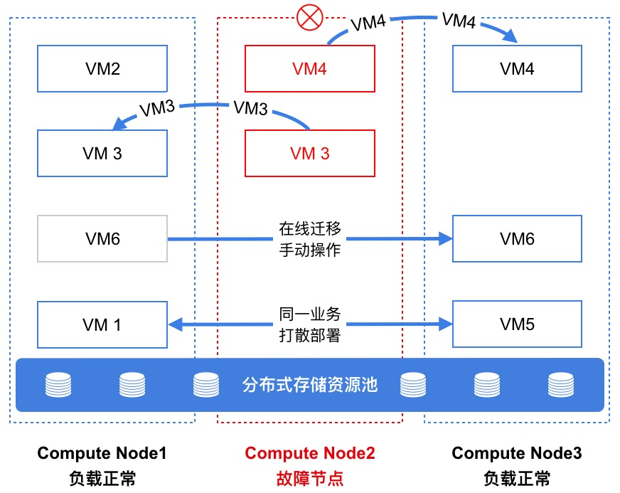

调度系统在优先选择低负荷节点进行虚拟资源部署的同时，分别提供打散部署、在线迁移、宕机迁移等能力，整体保证云平台的可靠性。UCloudStack 云平台使用分布式存储提供存储服务，如上图所示，虚拟机均运行于分布式存储池之上，且分布式存储池可跨多台物理机构建统一分布式存储资源池。虚拟机的系统盘、镜像文件及挂载的硬盘均存储于统一分布式存储池中，每台计算节点均可通过分布式存储池中的虚拟机的系统盘文件及配置信息注册一个相同的虚拟机进程，可作用于在线迁移或宕机迁移任务。

### 3.2.1 打散部署

打散部署——即虚拟资源反亲和部署策略，指将运行相同应用服务的虚拟资源根据调度策略打散且均衡的分布在底层集群物理服务器上，保障硬件或软件故障等异常情况下服务的高可用性。

UCloudStack 云平台默认支持虚拟机打散部署策略，即一个用户的虚拟机在创建时，会优先选择健壮的节点进行部署，同时会保证一个用户的虚拟机尽量打散部署至底层集群的节点上，保证业务健壮性；同时平台支持手动进行打散标记，用户可通过【业务组】区分不同业务的虚拟资源，同一业务组的虚拟机会根据智能调度策略均衡分布在集群物理服务器，确保业务服务的高可用性。

* 当用户将两台虚拟机标识为同一个业务组，即代表两台虚拟机部署相同或相关联的业务应用服务；
* 平台调度策略会根据业务组标识，将两台虚拟机分别部署在不同的计算节点上，即尽量保证两台虚拟机不会部署在同一台服务器节点；
* 若相同业务的两台虚拟机部署至同一台物理机，当物理机故障时，两台虚拟机均会发生故障，并会同时进行【宕机迁移】，会影响业务应用正常提供服务；
* 若相同业务的两台虚拟机部署至不同的物理机，当其中一台物理机故障时，仅会有一台虚拟机宕机并迁移，不会影响业务应用正常提供服务；

如智能调度图中的 VM1 和 VM5 同属一个业务组，系统自动将 VM1 部署至 Node1 ，VM5 部署至 Node3 ，当 Node1 节点故障时，VM5 会继续提供服务，VM1 将自动迁移至健康且负载正常的计算节点，详见 [宕机迁移](#_3123-宕机迁移) 。

### 3.2.2 在线迁移

在线迁移（虚拟机热迁移）是计划内的迁移操作，即虚拟机不停机的情况下，在不同的物理机之间进行在线跨机迁移。首先是在目标物理机注册一个相同配置的虚拟机进程，然后进行虚拟机内存数据同步，最终快速切换业务到目标新虚拟机。整个迁移切换过程非常短暂，几乎不影响或中断用户运行在虚拟机中的业务，适用于云平台资源动态调整、物理机停机维护、优化服务器能源消耗等场景，进一步增强云平台可靠性。

由于采用分布式统一存储，虚拟机在线迁移时只迁移**【计算】**的运行位置，不涉及**存储**（系统盘、镜像、云硬盘）位置迁移。迁移时仅需通过统一存储内的源虚拟机配置文件在目的主机上注册一个相同配置且状态置为暂停的虚拟机进程，然后反复迁移源虚拟机的内存至目的虚拟机，待虚拟机内存同步一致后，关闭源虚拟机并激活目标虚拟机进程，最后进行网络切换并成功接管源虚拟机业务。

整个迁移任务仅在激活目标虚拟机及网络切换时业务处于短暂中断，由于激活和切换所用时间很短，少于 TCP 超时重传时间，因此源虚拟机业务几乎无感知。同时由于无需迁移虚拟机磁盘及镜像位置，**虚机挂载的云盘迁移后不受影响**，可为用户提供无感知且携带存储数据的迁移服务。具体迁移过程如下：

1. **注册目标虚拟机**
   * 调度系统使用统一分布式存储内的源虚拟机配置文件在目标主机上注册一个相同配置的虚拟机进程；
   * 注册的虚拟机进程为不可提供服务的暂停【paused】状态，并通过监听一个 TCP 端口接收迁移数据；
   * 注册目标虚拟机的阶段为瞬间完成，通常耗时为几毫秒，此时源虚拟机处于正常提供业务的状态。
2. **迁移源虚拟机内存**
   * 在目标虚拟机注册完成的同时，调度系统会立即将源虚拟机的**全量内存数据**迁移至目标虚拟机；
   * 为保证数据迁移的一致性，迁移过程中源虚拟机的内存更新也需要进行同步，因此调度系统通过多次迭代将源虚拟机产生的新内存数据迁移至目标端，耗时与物理机的网络带宽、性能及虚拟机的内存大小有关；
   * 内存迁移时源虚拟机正常提供业务，待内存数据反复迭代迁移完成时立即**暂停**源虚拟机进程，避免产生新的内存数据；
   * 源虚拟机进程暂停后，会再进行一次内存数据的同步，保证源端和目标端的数据一致性。
3. **接管源虚拟机服务**
   * 完成内存同步的收尾工作，调度系统会关闭源虚拟机并**激活**目标虚拟机的进程，实现虚拟机平滑运行；
   * 虚拟机从源主机迁移至目标主机，系统会将虚拟机的网络切换至目标主机（下发流表），通过目标主机的 vSwitch 进行通信，成功接管源虚拟机服务。
   * 若虚拟机有绑定的外网 IP ，外网 IP 地址在网络切换时会自动漂移至目标主机，并通过 OVS 中的流表进行通信。

整个迁移过程中，从源虚拟机暂停至目标虚拟机激活并完成网络切换为停机时间，由于激活虚拟机及网络切换时间非常短暂，通常小于**几百毫秒**，少于 TCP 超时重传时间，对大多数应用服务来说可忽略不计，因此虚拟机业务几乎不会感知到迁移停机。如智能调度图中的 VM6 默认运行在 Node1 上，管理员通过在线迁移功能手动将 VM6 迁移至 Node3 的流程如下：

* 调度系统收到迁移指令后，会立即使用 VM6 的配置文件在 Node3 节点上注册一个暂停状态的虚拟机进程；
* 立即迁移 VM6 的全量进程数据至 Node3 节点的 VM6'，并反复多次迁移更新内存数据；
* 调度系统暂停 Node1 上的 VM6 虚拟机，再次进行内存数据的迁移并关闭 VM6 虚拟机；
* 激活 Node3 节点上的 VM6' 虚拟机进程，完成网络切换并接管 VM6 的业务服务及通信；
* 若 VM6 有挂载的云硬盘，迁移成功后，不影响已云硬盘的挂载信息及配置，可正常读写云硬盘。

### 3.2.3 宕机迁移 

宕机迁移又称离线迁移（Offline Migration）或虚拟机高可用（ High Availability），指平台底层物理机出现异常或故障而导致宕机时，调度系统会自动将其所承载的虚拟资源快速迁移到健康且负载正常的物理机，尽量保证业务的可用性。整体宕机迁移不涉及存储及数据迁移，新虚拟机可快速在新物理机上运行，平均迁移时间为 90 秒左右，可能会影响或中断运行在虚拟机中的业务。

由于采用分布式统一存储，虚拟机的系统盘及写进系统盘的数据均存储在底层分布式存储中，虚拟机宕机迁移只迁移**【计算】**的运行位置，不涉及**存储**（系统盘、镜像、云硬盘）位置迁移，仅需在新物理机上重新启动虚拟机并保证网络通信即可。迁移机制说明如下：

* UCloudStack 调度管理系统会周期性监测物理机的健康状态，间隔时间为 1秒 ；
* 当检测到一台物理机宕机时，调度系统会继续探测试 50 个周期（即 50 秒）；
* 若 50 个周期物理机依然故障则触发二层 Ping 检测，间隔为 400ms ，持续 10 个周期（即 4 秒）；
* 若二层检测依然失败则会触发虚拟机迁移操作，即调度系统在物理机持续故障 54 秒后开始执行迁移任务；
* 调度系统使用分布式存储内故障虚拟机的系统盘及数据重新在新物理机上启动虚拟机，启动过程及状态流转与新建虚拟机一致，平均启动时间为 30 秒左右；
* 虚拟机在新物理机上启动后，会将虚拟机网络切换至新物理机，通过 OVS 中下发的流表进行通信；
* 若虚拟机有绑定的外网 IP ，外网 IP 地址迁移后自动漂移至目标主机，并通过 OVS 中的流表进行通信。

整个迁移过程，从检测到故障至迁移成功平均为 90 秒左右。虚拟机启动时间与源虚拟机的组件及配置有关，如绑定云硬盘、外网 IP 、弹性网卡及操作系统等；同时由于虚拟机规格过大、底层物理资源不足、底层硬件故障等原因可能会导致宕机迁移失败，通常建议尽量保证底层物理资源充足。如智能调度图中的 Node2  节点故障，智能调度系统自动将 VM3 和 VM4 分别迁移至 Node1 和  Node3  节点，具体流程如下：

* 调度系统经过周期性监测及二层检测，判断 Node2  节点故障，VM3/VM4 两台虚拟机不可用，需要进行宕机迁移操作；
* 调度系统根据收集的集群节点信息，使用分布式存储系统中 VM3 的系统盘及数据在 Node1 节点启动 VM3 虚拟机，并在启动后重新下发流表将 VM3 的网络信息切换至 Node1 ；
* 使用分布式存储系统中 VM4 的系统盘及数据在 Node3 节点启动 VM4 虚拟机，并在启动后重新下发流表将 VM4 的网络信息切换至 Node3 ；
* 若 VM3 或 VM4 已绑定外网 IP ，虚拟机启动后外网 IP 地址会分别漂移至 Node1 和 Node3 节点，并通过 OVS 中的流表进行通信。

宕机迁移的前提是集群中至少有 2 台以上的物理服务器，且在迁移过程中需保证健康节点的资源充足及网络连通性。通过宕机迁移技术，为业务系统提供高可用性，极大缩短由于各种主机物理故障或链路故障引起的中断时间。

## 3.3 存储虚拟化

云计算平台通过硬件辅助的虚拟化计算技术最大程度上提高资源利用率和业务运维管理的效率，整体降低 IT 基础设施的总拥有成本，并有效提高业务服务的可用性、可靠性及稳定性。在解决计算资源的同时，企业还需考虑适用于虚拟化计算平台的数据存储，包括存储的安全性、可靠性、可扩展性、易用性、性能及成本等。

虚拟化计算 KVM 平台可对接多种类型的存储系统，如本地磁盘、商业化 SAN 存储设备、NFS 及分布式存储系统，分别解决虚拟化计算在不同应用场景下的数据存储需求。

* 本地磁盘：服务器上的本地磁盘，通常采用 RAID 条带化保证磁盘数据安全。性能高，扩展性差，虚拟化环境下迁移较为困难，适用于高性能且基本不考虑数据安全业务场景。
* 商业化存储：即磁盘阵列，通常为软硬一体的单一存储，采用 RAID 保证数据安全。性能高，成本高，需配合共享文件系统进行虚拟化迁移，适用于 Oracle 数据库等大型应用数据存储场景。
* NFS 系统：共享文件系统，性能较低，易用性较好，无法保证数据安全性，适用于多台虚拟机共享读写的场景
* 分布式存储系统：软件定义存储，采用通用分布式存储系统的标准，将大量通用 x86 廉价服务器的磁盘资源聚合在一起，提供统一存储服务。通过多副本的方式保证数据安全，高可靠 、高性能、高安全、易于扩展、易于迁移且成本较低，适用于虚拟化、云计算、大数据、企业办公及非结构化数据存储等存储场景。

每一种类型的存储系统，在不同的存储场景下均有优劣势，虚拟化计算平台需根据业务特证选择适当的存储系统，用于提供存储虚拟化功能，在某些特定的业务模式下，可能需要同时提供多种存储系统，用于不同的应用服务。

在传统的存储结构中，客户端与单一入口点的集中式存储组件进行通信，可能会限制存储系统的性能和可伸缩性，同时可能带来单点故障。**UCloudStack 平台采用分布式存储系统作为虚拟化存储，用于对接 KVM 虚拟化计算及通用数据存储服务，消除集中式网关，使客户端直接与存储系统进行交互，并以多副本/纠删码、多级故障域、数据重均衡、故障数据重建等数据保护机制，确保数据安全性和可用性。**

### 3.3.1 分布式存储

UCloudStack 云平台基于 [Ceph](https://ceph.io/) 分布式存储系统适配优化，为虚拟化计算平台提供一套纯软件定义、可部署于 x86 通用服务器的高性能、高可靠、高扩展、高安全、易管理且较低成本的虚拟化存储解决方案，同时具有极大可伸缩性。作为云平台的核心组成部分，为用户提供多种存储服务及 PB 级数据存储能力，适用于虚拟机、数据库等应用场景，满足关键业务的存储需求，保证业务高效稳定且可靠的运行。

分布式存储服务通过将大量 x86 通用服务器的磁盘存储资源融合在一起进行【池化】，构建一个无限可伸缩的统一分布式存储集群，实现对数据中心所有存储资源的统一管理及调度，向虚拟化计算层提供【块】存储接口，供云平台虚拟机或虚拟资源根据自身需求自由分配并使用存储资源池中的存储空间。同时云平台虚拟化通过 iSCSI 协议对接 IPSAN 商业存储设备，将商业存储作为虚拟化后端存储池，提供存储池管理及逻辑卷分配，可直接作为虚拟机的系统盘及数据盘进行使用，即只要支持 iSCSI 协议的存储设备均可作为平台虚拟化的后端存储，适应多种应用场景；可利旧企业用户的集中存储设备，整体节省信息化转型的总拥有成本。

存储功能所见即所得，用户无需关注存储设备的类型和能力，即可在云平台快捷使用虚拟化存储服务，如虚拟磁盘挂载、扩容、增量快照、监控等，云平台用户像使用 x86 服务器的本地硬盘一样的方式使用虚拟磁盘，如格式化、安装操作系统、读写数据等。云平台管理和维护者可以全局统一配置并管理平台整体虚拟化存储资源，如 QoS 限制、存储池扩容、存储规格及存储策略配置。

分布式存储系统可提供块存储、文件存储及对象存储服务，适用于多种数据存储的应用场景，同时可保证数据的安全性及集群服务的可靠性。文件存储和对象存储在一个数据中心部署一套集群，支持机械盘和高性能盘混合部署且可逻辑划分多个存储池，如高性能存储池和容量型存储池。在块存储的部署上，通常推荐使用同一类型的磁盘构建存储集群，如超融合计算节点和独立存储节点自带 SSD 磁盘构建为高性能的存储集群；超融计算节点和独立存储节点自带的 SATA/SAS 磁盘构建为普通性能存储集群。

分布式存储存储系统将集群内的磁盘设备通过 OSD 内建不同的存储资源池，分别提供弹性块存储服务、对象存储及文件存储服务，其中块存储服务可供虚拟机直接挂载使用，在数据写入时通过三副本、写入确认机制及副本分布策略等措施，最大限度保障数据安全性和可用性。文件存储和对象存储可提供诸如 NFS、CIFS、S3 等多种协议接口为应用服务提供非结构化数据存储服务，同时结合多副本及纠删码数据冗余策略满足多种场景下的数据存储和处理，逻辑架构如下：	

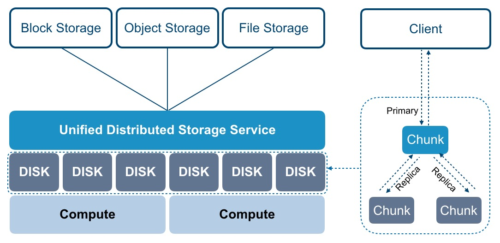

UCloudStack 分布式存储系统是整个云平台架构不可或缺的核心组件，通过分布式存储集群体系结构提供基础存储资源，并支持在线水平扩容，同时融合智能存储集群、超大规模扩展、多副本与纠删码冗余策略、数据重均衡、故障数据重建、数据清洗、自动精简配置及快照等技术，为虚拟化存储提供高性能、高可靠、高扩展、易管理及数据安全性保障，全方面提升存储虚拟化及云平台的服务质量。

### 3.3.2 智能存储集群

分布式存储集群可包含数千个存储节点，通常至少需要一个监视器和多个 OSD 守护进程才可正常运行及数据复制。分布式智能存储集群消除集中控制网关，使客户端直接和存储单元 OSD 守护进程交互，自动在各存储节点上创建数据副本确保数据安全性和可用性。其中包括的基础概念如下：

* **OSD**：通常一个 OSD 对应物理机一块磁盘、一个 RAID Group 或者一个物理存储设备，主要负责数据存储、处理数据复制、恢复、回填及数据重均衡，并负责向监视器报告检测信息。单集群至少需要两个 OSD，并在物理架构可划分为多个故障域（机房、机架、服务器），通过策略配置使多副本位于不同的故障域中。
* **监视器 Monitor**：实现存储集群的状态监控，负责维护存储集群的 Object、PG 及 OSD 间的映射关系图，为数据存储提供强一致性决策，同时为客户端提供数据存储的映射关系。
* **元数据服务 MDS：**实现文件存储服务时，元数据服务（MDS）管理文件元数据。
* **客户端**：部署在服务器上，实现数据切片，通过 CRUSH 算法定位对象位置，并进行对象数据的读写。通常包括块设备、对象存储及文件系统客户端，读/写操作由 OSD 守护进程处理。
* **CRUSH 算法**：用于保证数据均匀分布的伪随机算法，OSD 和客户端均使用 CRUSH 算法来按需计算对象的位置信息，为存储集群动态伸缩、重均衡和自修复功能提供支撑。

**存储数据时**，存储集群从客户端（块设备、对象存储、文件系统）接收数据，并将数据分片为存储池内的对象 Object，每个对象直接存储至 OSD 的裸存储设备上，由 OSD 进程处理裸设备上的读写操作。如下图所示：

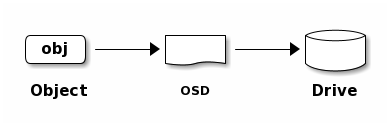

客户端程序通过与 OSD 或监视器交互获取映射关系数据，在本地通过 CRUSH 算法计算得出对象存储位置后，直接与对应的 OSD 进行通信，完成数据读写操作。为实现分布式存储集群可自主、智能且自我修复的存取数据，智能存储集群通过 CURSH 算法、存储池 Pool、放置组 PG 及 OSD 等多种逻辑概念相互关联承载数据存储流程，逻辑架构图如下：

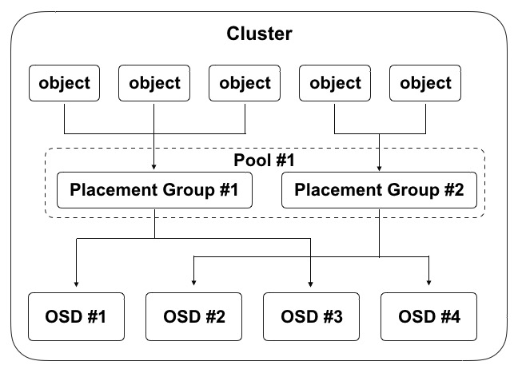

* 一个集群可逻辑上划分为多个 Pool ，Pool 是一个命名空间，客户端存储数据时需指定一个 Pool；
* 一个 Pool 包含若干个逻辑 PG（Placement Group），可定义 Pool 内的 PG 数量和对象副本数量；
* PG 是对象和 OSD 的中间逻辑分层，写对象数据时，会根据 CRUSH 算法计算每个对象要存储的 PG ；

* 一个物理文件会被切分为多个 Object ，每个 Object 会被映射到一个 PG ，一个 PG 包含多个 Object ；
* 一个 PG 可映射到一组 OSD ，其中第一个 OSD 为主 ，其它 OSD 为从，Object 会被均匀分发至一组 OSD 上进行存储；
* 承载相同 PG 的 OSD 间相互监控存活状态，支持多个 PG 同时映射到一个 OSD 。

在存储集群的机制中，承载相同 PG 的主从 OSD 间需要彼此交换信息，确保彼此的存活状态。客户端首次访问会首先从监视器获取映射关系的数据，存储数据时会与 OSD 对比映射关系数据的版本。由上图示意图得知，一个 OSD 可同时承载多个 PG ，在三副本机制下每个 PG 通常为 3 个 OSD 。如上图所示，数据寻址流程分为三个映射阶段：

1. 将用户要操作的文件映射为存储集群可处理的 Object ，即将文件按照对象大小进行分片处理；
2. 通过 CRUSH 算法将所有文件分片的 Object 映射到 PG ；
3. 将 PG 映射到数据实际存储的 OSD 中 ，最后客户端直接联系主 OSD 进行对象数据存储操作。

分布式存储客户端从监视器获取集群映射关系图，并将对象写入到存储池。集群存储数据的逻辑主要取决于存储池的大小、副本数量、CRUSH 算法规则及PG 数量等。

### 3.3.3 超大规模扩展

在传统集中式架构中，中心集群组件作为客户端访问集群的单一入口，这将严重影响集群的性能和可扩展性，同时引入单点故障。在分存储存储集群的设计中，存储单元 OSD 和存储客户端能直接感知集群中的其它 OSD 及监视器信息，允许存储客户端直接与存储单元 OSD 交互进行数据读写，同时允许每个 OSD 与监视器及其它节点上的 OSD 直接交互进行数据读写，这种机制使得 OSD 能够充分利用每个节点的 CPU/RAM ，将中心化的任务分摊到各个节点去完成，支持超大规模集群扩展能力，提供 EB 级存储容量。

* OSD 直接服务于客户端，存储客户端直接与 OSD 进行通信，消除中心控制器及单点故障，提升整体集群的性能及可扩展性。
* OSD 之间相互监测彼此的健康状态，并主动更新状态给监视器，使监视器可以轻量化部署和运行。

* OSD 使用 CRUSH 算法，用于计算数据副本的位置，包括数据重平衡。在多副本机制中，客户端将对象写入主 OSD 中后， 主 OSD 通过自身的 CRUSH 映射图识别副本 OSD 并将对象复制到副本 OSD 中；凭借执行数据副本复制的能力，OSD 进程可减轻存储客户端的负担，同时确保高数据可用性和数据安全性。

为消除中心节点，分布式存储客户端和 OSD 均使用 CRUSH 算法按需计算对象的位置信息，避免对监视器上集群映射图的中心依赖，让大部分数据管理任务可以在集群内的客户端和 OSD 上进行分布式处理，提高平台的可伸缩性。

**在存储集群扩容层面，支持存储节点水平扩展、增量扩容及数据自动平衡性，同时集群的整体性能随容量的增长呈正向增长，继而保证存储系统的性能及高扩展性。**

### 3.3.4 高可用和高可靠

为构建全平台高可用的分布式存储服务，保证虚拟化计算及应用服务数据存储的可靠性，分布式存储系统从多方面保证存储服务的稳健运行。

* **基础设施高可用**

  存储集群不强行绑定硬件及品牌，可采用通用服务器及网络设备，支持存储集群异构。物理网络设备支持 10GE/25GE 底层存储堆叠网络架构，同时服务器层面均采用双链路，保证数据读写的 IO 性能及可用性。

* **存储监视器高可用**

  集群监视器维护存储集群中  Object、PG 及 OSD 间的主映射图，包括集群成员、状态、变更、以及存储集群的整体健康状况等。OSD 和客户端均会通过监视器获取最新集群映射图，为保证平台服务的可用性，支持监视器高可用，当一个监视器因为延时或错误导致状态不一致时，存储系统会通过算法将集群内监视器状态达成一致。

* **存储接入负载均衡**

  对象存储和文件存储接入网关支持负载均衡服务，保证对象存储和文件存储网关高可用，同时为存储网关提供流量负载分发，提升存储的整体性能。在负载均衡的接入机制下，读写 I/O 会均衡到集群中所有网关服务上，当其中一台网关服务器出现异常时，会自动剔除异常网关节点，屏蔽底层硬件故障，提升业务的可用性。

### 3.3.5 多冗余策略

#### 3.3.5.1 多副本机制

多副本机制是指将写入的数据保存多份的数据冗余技术，并由存储系统保证多副本数据的一致性。UCloudStack 分布式块存储系统默认采用多副本数据备份机制，**写入数据时先向主副本写入数据，由主副本负责向其他副本同步数据，**并将每一份数据的副本跨节点、跨机柜、跨数据中心分别存储于不同磁盘上，多维度保证数据安全。**存储客户端在读取数据会优先读取主副本的数据，仅当主副本数据故障时，由其它副本提供数据的读取操作。**

UCloudStack 分布式存储系统通过多副本、写入确认机制及副本分布策略等措施，最大限度保障数据安全性和可用性。多副本机制存储数据，将自动屏蔽软硬件故障，当磁盘损坏和软件故障导致副本数据丢失，系统自动检测到并自动进行副本数据备份和同步，不会影响业务数据的存储和读写，保证数据安全性和可用性。本章节以**三副本**为例，具体描述多副本的工作机制：

**（1）三副本**

用户通过客户端写入分布式存储的数据，会根据 Pool 设置的副本数量 `3`  写入三份，并按照副本分布策略，分别存储于不同物理主机的磁盘上。分布式存储保证数据安全的副本数量至少为 2 份，以便存储集群可以在降级状态下运行，保证数据安全。

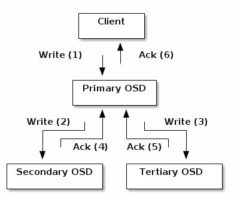

**（2）写入确认机制**

如上图所示，三副本在写入过程中，只有三个写入过程全部被确认，才返回写入完成，确保数据写入的强一致性。

客户端将对象写入到目标 PG 的主 OSD 中，然后主 OSD 通过 GRUSH 映射关系图定位用于存储对象副本的第二个和第三个 OSD ，并将对象数据复到 PG 所对应的两个从 OSD ，当三个对象副本数据均写入完成，最后响应客户端确认对象写入成功。

**（3）副本分布策略**

分布式存储支持副本数据落盘分布策略（多级故障域），使用 CRUSH 算法根据存储设备的权重值分配数据对象，尽量确保对象数据的均匀分布。平台通过定义存储桶类型，支持节点级、机柜级、数据中心级故障域，可将副本数据分布在不同主机、不同机柜及不同数据中心，避免因单主机、单机柜及单数据中心整体故障造成数据丢失或不可用的故障，保证数据的可用性和安全性。

为保证存储数据的访问时延，通常建议最多将数据副本保存至不同的机柜，若将数据三副本保存至不同的机房，由于网络延时等原因，可能会影响云硬盘的 IO 性能。

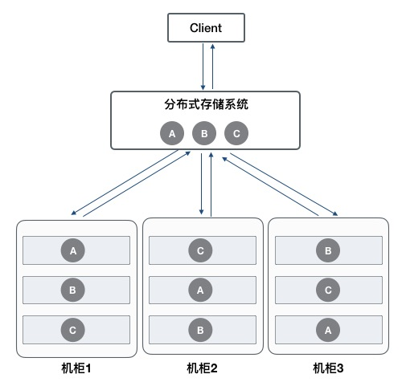

如上图所示，客户端通过分布式存储系统写入 ABC 三个对象数据，根据 CRUSH 规则定义的故障域，需要将三个对象的副本分别存储于不同的机柜。以 A 对象为例，存储系统提前设置副本分布策略，尽量保证对象副本分布在不同柜柜的服务器 OSD 中，即定义机柜和主机存储桶。当分布式存储系统计算出写入对象的 PG 及对应的 OSD 位置时，会优先将 A 写入到机柜 1 的服务器 OSD 中，同时通过主 OSD 复制副本 A' 至机柜 2 的服务器 OSD 中，复制 A''  至机柜 3 的服务器 OSD 中 ，数据全部复制写入成功，即返回客户端对象 A 写入成功。

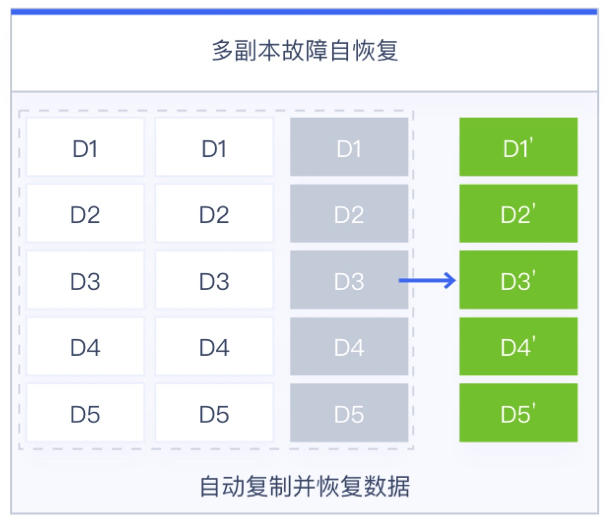

在存储节点无网络中断或磁盘故障等异常情况时，对象副本数据始终保持为 3 副本。仅当节点发生异常时，副本数量少于 3 时，存储系统会自动进行数据副本重建，以保证数据副本永久为三份，为虚拟化存储数据安全保驾护航。如上图第三个节点发生故障，导致数据 D1-D5 丢失并故障，存储系统会将对象数据的 PG 自动映射一个新的  OSD，并通过其它两个副本自动同步并重建出 D1‘-D5’，以保证数据始终为三副本，保证数据安全。

#### 3.3.5.2 纠删码策略

纠删码（Erasure Coding，EC）是一种数据保护方法，类似商业存储中的 RAID5 技术，它将数据分割成片段，把冗余数据块扩展、编码，并将其存储在不同的位置，比如磁盘、存储节点或者其它地理位置。UCloudStack 分布式对象存储和文件存储可采用纠删码策略进行数据冗余保护。

纠删码策略可兼备数据安全性和磁盘利用率，在分布式存储系统中，纠删码策略将写入的数据进行分片（称为数据块），基于分片编码生成备份冗余数据（称为较验块），最后将原始分片数据和备份数据分别写入不同的存储介质，以保证数据的安全性。同时数据块和校验块可通过故障域分别存储于跨节点、跨机柜、跨数据中心的不同 OSD 磁盘上，多维度保证数据安全。

通过纠删码策略将数据分段的块数称为 K，编码较验块称为 M，所有数据块个数称为 N ，即 N= K+M；基于此磁盘利用率可通过 K/N 获得，如 K=9，M=3 ，N=12 ，则磁盘总空简利用率为 9/12=75% ，即磁盘利用率为 75%。对象存储和文件存储的存储集群根据冗余策略不同，磁盘利用率不同。在三副本机制下，磁盘利用率为集群总容量的三分之一；而在纠删码策略中，利用率与 K+M 的比例值相关，即不同的 K+M 值，会有不同的磁盘利用率，可根据实际使用场景自定义纠删码策略的 K+M 值，平台默认推荐 4+2。

以 4+2 为例，在写入数据时存储系统会先将对象数据映射到一个 PG ，再由 PG 映射到一组 OSD 中（OSD 的数量取决于 K+M 的值，即 OSD 数量与 N 的值相等）；同时在 OSD 中选举出主 OSD ，由主 OSD 将对象文件分片为 4 个数据块，在通过 4 个数据块编码出 2 个校验块，最后将 4 个数据块和 2 个校验块分别写入 6 个 OSD 中。在读取数据时，由主 OSD 分别从相同 PG 的其它 OSD 中读取所有需要的分片数据，最后由主 OSD 统一汇总拼拼凑出指定的对象文件，向客户端应答。

> 由于纠删码是将数据切片并发写入至多个 OSD 磁盘，并无多副本机制中多倍写放大的问题，因此写性能较有优势。而读数据时需要先计算数据分片，再将多个 OSD 中的数据读出来进行汇总，因此读性能相对偏低。

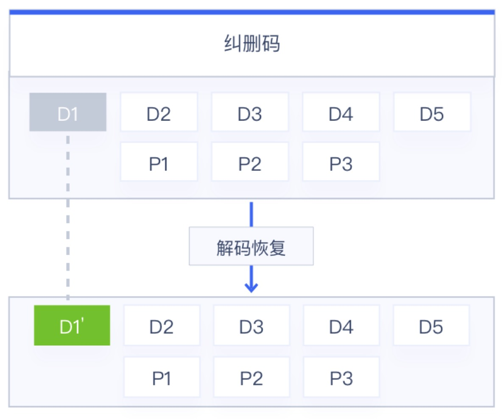

纠删码的原理证明，存储集群中允许损坏的数据块数量小于等于 M（较验块），在存储节点或磁盘无故障或异常时，对象数据块和校验块始终不变。仅当节点发生异常时，数据块和较验块小于 N+M 值时，需要通过剩余的数据块和较验块一起进行解码计算出损坏数据，并将期恢复在正常的 OSD 设备中。如上图 5+3 的 EC 策略中，允许失败的数据为 3 ，即在实际生产环境中可允许失败 3 块磁盘；当分片数据 D1 损坏时，主 OSD 计算获取到对象文件剩余的数据块（D2-D5 ）及较验块信息（ P1-P3），通过 EC 对数据块和较验块的信息解码，计算出损坏的 D1 数据 D1'，最后将 D1' 数据恢复至正常的 OSD 设备中，完成损坏数据的恢复。

> 若在读取数据时正好有一个分片数据损坏，则会同步进行数据解码恢复操作，则读取该数据的时延较大，会影响整体数据的读取性能。

由于纠删码在存取数据时需要消耗更多的计算资源，因此纠删码对节点的计算要求相较多副本高，然纠删码以其灵活多变的数据备份策略、较高的存储空间利用率非常适合存储大量对时延不敏感的数据，如备份数据、办公应用数据、日志数据等。基于此，UCloudStack 的文件存储和对象存储可提供纠删码和多副本两种冗余保护策略，而块存储仅采用多副本机制进行数据安全保护。

### 3.3.6 数据重均衡

UCloudSack 云平台分布式存储集群在写入数据时，会通过数据分片、CRUSH 映射关系、多副本或纠删码分布策略尽量保证数据对象在存储池中的均衡。随着存储集群的长期运行及对平台的运维管理，可能会导致存储池内的数据失衡，如存储节点和磁盘扩容、存储部分数据被删除、磁盘和主机故障等。

* 存储节点及磁盘扩容后，平台总存储容量增加，新增容量未承载数据存储，导致集群数据失衡；
* 用户删除虚拟机或云硬盘数据，导致集群内出现大量空闲空间；
* 磁盘和主机故障下线后，部分数据对象副本会重建至其它磁盘或主机，故障恢复后处于空闲状态。

为避免扩容及故障导致存储集群数据分布失衡，UCloudStack 分布式存储系统提供数据重均衡能力，在存储集群及磁盘数据发生变更后，通过 CRUSH 规则及时对数据的部分对象进行重新分发和均衡，使存储池中的对象数据尽量均衡，避免产生数据热点及资源浪费，提升存储系统的稳定性及资源利用率。

**（1）集群扩容重均衡**

平台支持水平扩展存储节点或在线向存储节点中增加磁盘的方式扩容存储集群的容量，即分布式存储集群支持在运行时增加 OSD 进行存储池扩容 。当集群容量达到阈值需要扩容时，可将新磁盘添加为集群的 OSD 并加入到集群的 CRUSH 运行图，平台会按照新 CRUSH 运行图重新均衡集群数据分布，将一些 PG 移入/移出多个 OSD 设备，使集群数据回到均衡状态。如下图所示：

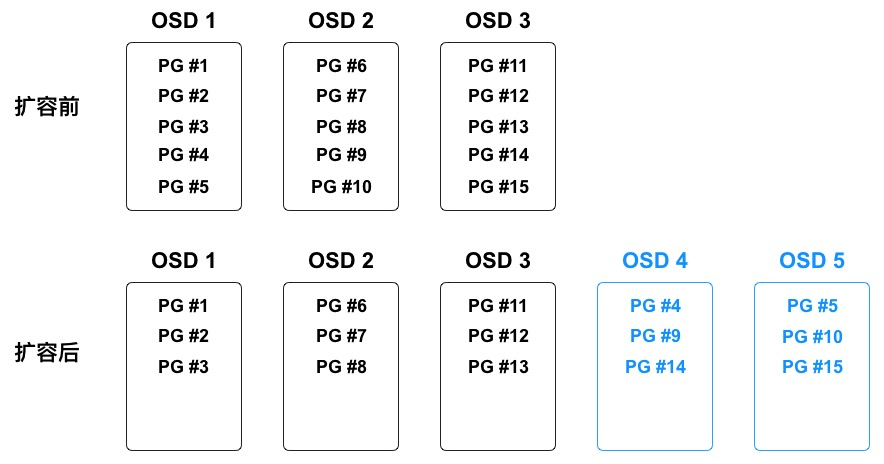

在数据均衡过程中，仅会将现有 OSD 中的部分 PG 到迁移到新的 OSD 设备，不会迁移所有 PG ，尽量让所有 OSD 均腾出部分容量空间，保证所有 OSD 的对象数据分布相对均衡。如上图中新增 `OSD 4` 和 `OSD 5` 后，有三个 PG（PG #4、PG #9、PG #14） 迁移到 `OSD 4 `，三个 PG （PG #5、PG #10、PG #15）迁移到  `OSD 5 ` ，使五个 OSD 中映射的 PG 均为 3 个。为避免 PG 迁移导致集群性能整体降低，**存储系统会提高用户读写请求的优先级**，在系统空闲时间进行 PG 迁移操作。

> PG 在迁移过程中，原 OSD 会继续提供服务，直到 PG 迁移完成才将数对象写入新 OSD 设备。

**（2）集群容量缩减重均衡**

存储集群在运行过程中可能需要缩减集群容量或替换硬件，平台支持在线删除 OSD 及节点下线，用于缩减集群容量或进入运维模式。当 OSD 被在集群中被删除时，存储系统会根据 CRUSH 运行图重新均衡集群数据分布，将被删除的 OSD 上的 PG 迁移至其它相对空闲的 OSD 设备上，使集群回到均衡状态。如下图所示：

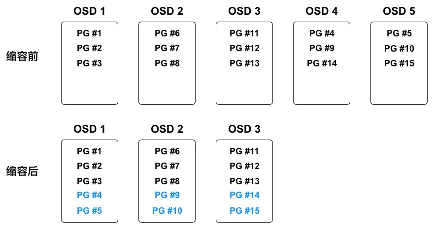

在数据均衡过程中，仅会将被删除 OSD 上的 PG 迁移至相对空闲的 OSD 设备，尽量保证所有 OSD 的对象数据分布相对均衡。如上图中即将被删除的  `OSD 4` 和 `OSD 5` 上共映射 6 个 PG ，删除后分别分有 2 个 PG 会被迁移至剩余 3 个 OSD 中，使 3 个 OSD 中映射的 PG 均为 5 个。

**（3）故障数据重均衡**

分布式存储在长期运行中会存在磁盘、节点的物理损坏、系统崩溃及网络中断等故障，均会中断节点的存储服务。存储集群提供容错方法来管理软硬件，PG 作为对象与 OSD 的中间逻辑层，可保证数据对象不会直接绑死到一个 OSD 设备，意味着集群可在“降级”模式下继续提供服务。详见[数据故障重建](#_3136-数据故障重建)。

!> **通过数据重均衡机制，可支持分布式存储集群平滑扩容，包括横向扩容和纵向扩容，即可以在线添加存储节点及存储磁盘。**

 

### 3.3.7 数据故障重建

根据多副本和 EC 纠删码的保护机制，存储集群在把数据对象通过 CRUSH 写入到指定 OSD 后，OSD 会通过运行图计算副本或数据块的存储位置，并将数据副本或数据块写入到指定 OSD 设备中，通常数据对象会被分配至不同故障域中，保证数据安全性和可用性。

当磁盘损坏或节点故障时，即代表节点部分/全部 OSD 设备下线或无法为 PG 内对象提供存储服务，同时也表示有部分对象数据的副本数量不完整，如 3 副本可能因为磁盘损坏变为 2 副本。故障时对象数据的 PG 被置为“降级”模式继续提供存储服务，并开始进行数据副本重建操作，按照最新 CRUSH 运行图将故障节点或磁盘上的对象数据重映射到其它 OSD 设备上，即重新复制对象数据的副本至其它  OSD 设备，保证副本数量与存储池设置一致。

在 EC 纠删码策略下，节点或磁盘设备故障时会导致部分数据块或校验块丢失，如 4+2 的纠删码数据会丢失一个数据块或校验块，此时对象数据的 PG 被置为“降级”模式继续提供存储服务，并开始进行纠删数据的解码和恢复操作，按照最新 CRUSH 运行图将故障数据块或校验块数据重新恢复至其它健康的 OSD 设备上，保证对象数据的完整性和可用性。

故障数据重建时会遵循存储集群中配置的故障域（主机级、机柜级及数据中心级），选择符合故障域定义的 OSD 作为故障数据重建的位置，让同一对象数据的多副本或 EC 数据间位置互斥，避免数据块均位于同一个故障域，保证数据安全性和可靠性。同时为提高故障数据的重建速度，多个故障数据重建任务的 I/O 会并发进行，实现故障数据的快速重建。

故障节点或磁盘恢复后，OSD 被重新加入至集群的 CRUSH 运行图，平台会按照新 CRUSH 运行图重新均衡集群数据分布，将一些 PG 移入/移出多个 OSD 设备，使集群数据回到均衡状态。为保证存储集群的运营性能，副本或纠删码 EC 数据恢复及迁移时，会限制恢复请求数、线程数、对象块尺寸，**并提高用户读写请求的优先级**，保证集群可用性和运行性能。

### 3.3.8 数据清洗

分布式存储集群在长期运行及数据重平衡的过程中，可能会产生一些脏数据、缺陷文件及系统错误数据。如一块 OSD 磁盘损坏，集群在重均衡后重建数据至其它 OSD 设备，当故障 OSD 设备恢复后可能还存储着之前数据的副本，这些副本数据在集群重新平衡时需及时进行清洗。

分布式存储的 OSD 守护进程可进行 PG 内对象的清洗，即 OSD 会比较 PG 内不同 OSD 的各对象副本元数据，如果发现有脏数据、文件系统错误及磁盘坏扇区，会对其进行深度清洗，以确保数据的完整性。

### 3.3.9 自动精简配置

自动精简配置（Thin Provisioning），又称【超额申请】或【运行时空间】，是一种利用虚拟化技术减少物理存储部署的技术。通过自动精简配置，可以用较小的物理容量提供较大容量的虚拟存储空间，且真实的物理容量会随着数据量的增长及时扩展，可最大限度提升存储空间的利用率，并带来更大的投资回报。

UCloudStack 云平台分布式存储系统支持自动精简配置，在创建块存储服务时，分配逻辑虚拟容量呈现给用户，当用户向逻辑存储容量中写入数据时，按照存储容量分配策略从物理空间分配实际容量。如一个用户创建的云硬盘为 1TB 容量，存储系统会为用户分配并呈现 1TB 的逻辑卷，仅当用户在云硬盘中写入数据时，才会真正的分配物理磁盘容量。若用户在云硬盘上存储的数据为 100GB ，则云硬盘仅使用存储池的 100GB 容量，剩余的 900GB 容量可以供其它用户使用。

云平台分布式存储系统支持对真实物理容量的监控，可提供真实物理可用容量及已使用容量。通常建议真实使用容量超过总容量的 80% 时对存储集群进行扩容。自动精简配置类似 CPU 超分的概念，即可供租户创建使用的存储容量可大于物理总容量，自动按需分配物理存储空间给块存储设备，消除已分配但未使用的存储空间浪费。

通过自动精简配置，平台管理员无需对业务存储规模进行细化且准确预判，更不需提前为每个业务做精细的空间资源规划和准备，配合逻辑存储卷的容量分配策略，有效提升运维效率及存储空间的整体利用率。

### 3.3.10 存储功能简介

UCloudStack 通过软件定义的分布式存储重新定义数据存储服务，基于通用服务器构建统一存储层，为应用提供块、对象及文件存储服务，同时提供多种数据接口，用户无需关注底层存储设备及架构，即可在云平台构建并使用存储服务，适用于虚拟化、云计算、大数据、物联网及企业应用等使用场景。

#### 3.3.10.1 块存储服务

UCloudStack 基于分布式存储系统为云平台租户提供块设备，即云硬盘服务，为计算虚拟化的虚拟机提供持久化存储空间的块设备。具有独立的生命周期，支持随意绑定/解绑至多个虚拟机使用，并能够在存储空间不足时对云硬盘进行扩容，基于网络分布式访问，为云主机提供高安全、高可靠、高性能及可扩展的数据磁盘。

云平台为租户提供普通和高性能两种架构类型的云硬盘，普通云硬盘使用 SATA/SAS 磁盘作为存储介质，性能型云硬盘使用 SSD/NVME 磁盘作为存储介质。云硬盘数据均通过 PG 映射及三副本机制进行存储，并在分布式存储系统的基础之上通过块存储系统接口为用户提供云硬盘资源及全生命周期管理。

支持组建多个存储集群，如 SATA 存储集群和 SSD 存储集群，并支持虚拟机跨集群挂载集群上的块存储服务。

* 分布式块存储服务直接通过物理网络进行挂载，无需通过 overlay 网络进行挂载和传输。
* 通过 libvirt 融合分布式存储 rbd 和 qemu ，qemu 通过 librbd 操作分布式存储。
* 虚拟化进程与分布式存储进程通过本机 & 跨物理机内网进行通信。

不同存储集群间，对象数据的存储完全隔离。一个存储集群中不同块存储设备的存储策略完全隔离，互不干扰。分布式存储系统为虚拟机系统盘、镜像及云硬盘提供统一存储及管理，提高虚拟机与系统盘、云硬盘的数据传输效率，实现虚拟机快速创建及恢复，并支持系统盘和云硬盘的在线快速扩容和迁移。 

在业务数据安全方面，云平台分布式存储支持磁盘快照能力，可降低因误操作、版本升级等导致的数据丢失风险，是平台保证数据安全的一个重要措施。支持对虚拟机的系统盘和数据盘进行手动或定时快照，在数据丢失或损坏时，可通过快照快速恢复本地业务的数据，实现业务分钟级恢复，包括数据库数据、应用数据及文件目录数据等。

#### 3.3.10.2 块存储数据存储机制

私有云的块存储服务采用分布式统一存储系统，由统一存储提供 RBD 接口为虚拟机提供系统盘、镜像及云硬盘服务。本节通过块存储数据存储架构、块存储数据 IO 流程及数据落盘管理流程对数据存储及删除机制进行说明。

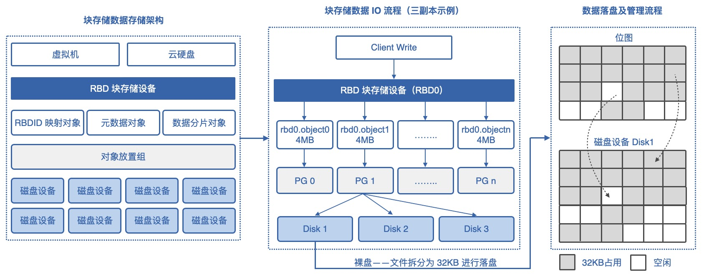

**（1）块存储数据存储架构**

虚拟机和云硬盘创建后，会在分布式存储系统中分别生成一个 RBD 块存储设备，即 KVM 引擎客户端读写数据的载体，同时针对一个块存储设备会生成 RBDID 映射对象、元数据对象及数据分片对象。

* RBDID 映射对象：指每个 RBD 块存储设备在存储系统中映射的 ID，作为全局唯一标识符，如 RBD0 对应的标识符为 RBD00001 。
* 元数据对象：指 RBD 块存储设备的元数据描述信息，包括块设备的创建时间、更新时间、属性、容量等。
* 数据分片对象：RBD 块存储设备的数据分片对象文件，每个分片默认为 4MB ，分片数量取决于 RBD 设备的大小，如 400MB 的云硬盘，分片数量即为 100 个对象文件。

所有的对象文件分别会通过算法计算对象的 PG 存储放置组，三副本模式下，一个放置组通常对应三个磁盘设备，即 RBDID 对象、元数据对象及数据分片的所有对象均会对应一个放置组，同时会将对象数据写入放置组对应的三个磁盘设备中。

**（2）块存储数据 IO 流程**

虚拟机和云硬盘的虚拟化客户端在写数据至 RBD 块设备时，会自动对数据进行切片操作。如上图中 RBD 块设备为 RBD0，每个分片大小为 4MB ，即会动将写入的数据切分为 4M 大小的对象文件，同时包括元数据对象及 RBDID 映射对象。每个对象文件都有一个名字，即 rdb 设备+object+序号，如 rbd0.object0 。

每一个 rbd.objectn 的对象文件通过放置组进行副本位置的分配，放置组通过 Cursh 算法定位出三个磁盘设备，作为对象文件的存储位置，即数据及元数据会首先进行对象文件的拆分，并根据放置组及磁盘设备的对应关系，分别存储至存储系统中的所有磁盘中。

**（3）数据落盘及管理流程**

分布式存储系统使用裸盘进行磁盘管理及数据落盘操作，在进行对象文件 rbd.objectn 文件的存储和落盘时，会通过存储管理系统将每一个对象文件再次进行拆分进行存储，即通过位图的方式计算拆分后文件的在物理磁盘上的存储位置，将每个 4MB 对象文件拆分后存储至磁盘设备中，默认拆分大小为 32KB 。

在写数据时根据位图计算出 32KB 文件在磁盘介质上的存储位置，同时在位置上将占用的位置标示为 1（占用），未被占用的磁盘位置标示为 0 （空闲）。

整体存储数据的过程，会将文件拆成 4MB 大小的对象文件，对应至不同的磁盘设备；同时在落盘时再次将 4MB 文件拆分成 32KB 大小的块存储至磁盘设备中。

**（4）删除数据机制**

销毁云硬盘时删除的数据不会被任何人通过任何途径访问，云硬盘系统中已删除的数据一定会被完全擦除。主要通过以下机制保证数据擦除的完整性：

删除云硬盘逻辑空间的操作会被作为元数据记录，并发起对物理磁盘空间的写零操作，强制永久性删除。一切对该逻辑空间的读操作，存储系统会确保返回全零。
云硬盘被彻底释放时，存储系统立即销毁元数据，确保无法继续访问数据。同时，该云硬盘对应的物理存储空间会被回收，物理空间再次被分配前一定是清零过的。

#### 3.3.10.3 对象存储服务

UCloudStack 采用分布式存储，基于标准 S3 接口为上层 HTTP 应用提供非结构化数据的对象存储服务，具有高扩展、高可靠、高安全、易接入等特性，用户可通过对象存储服务提供的 RESTful API 接口、SDK 及对象存储客户端通过网络快速存储或访问对象存储中的海量数据，同时支持通过 S3 接口对存储的数据进行备份和归档操作。

对象存储服务在一个数据中心仅部署一套存储集群，通过存储池划分不同的存储类型，如三副本存储池、五副本存储池及纠删码存储池等，同时可对存储池配置故障域、磁盘介质类型等。默认对象存储服务使用三副本存储池，即对象存储服务默认使用三副本冗余机制（后续会开放其它数据冗余机制）。在对象存储服务层面，平台对象存储服务支持存储空间管理、网络接入、配额管理、ACL 控制、密钥管理等对象存储管理功能，同时支持丰富的数据管理能力：

* 存储空间管理：基于云平台多租户及子账号提供存储桶生命周期管理，支持多租户隔离。
* 网络接入：对象存储服务接入云平台 SDN 网络及外网 IP 网络，即可同时为每个对象文件提供内网和外网访问地址。内网地址可通过平台 VPC 网络进行文件读写，外网地址可通过云平台外网网络进行文件读写操作。
* 配额管理：支持单存储桶的的空间容量及对象数配额，支持用户自定义每个存储桶的配额。
* ACL 控制：支持为存储空间配置 ACL 权限，包括公开类型和私有类型。公开类型的所有文件均可直接通过 URL 访问；私有类型的所有文件必须获得拥有者的授权才可访问，同时公开和私有仅对空间的读文件生效。
* 密钥管理：针对存储空间授权的一对密钥，包括访问密钥和安全密钥，用于第三方客户端请求对象存储的身份验证。
* 数据管理：面向最终用户提供对象存储的图形化 WEB 服务，支持丰富的文件管理操作，包括文件上传、文件下载、文件夹管理、文件拷贝、图片预览及文件重命名等操作，提升使用对象存储服务的便捷性。
* 分片上传：支持将待上传文件分成多个数据块来分别上传，上传完成之后再调用对象存储 API 将这些 Part 组合成一个 File。

#### 3.3.10.4 文件存储服务

UCloudStack 采用分布式存储，向上层虚拟化、容器及企业应用提供兼容 POSIX 标准的文件目录，支持标准 NFS 和 CIFS/SMB 共享协议接口，为用户提供非结构化数据共享存储服务，可适用于企业办公、日志存储、内容管理及数据备份等场景。（当前版本仅支持 NFS 协议的文件存储）

文件存储服务在一个数据中心仅部署一套存储集群，并与对象存储共享一套存储集群，可通过存储池划分不同的存储类型，如性能型和容量型，同时可对存储池进行冗余策略、故障域、磁盘介质类型配置。默认文件存储使用三副本存储池，即文件存储服务默认使用三副本冗余策略（后续会开放其它数据冗余策略）。在文件存储服务层面平台文件存储支持文件目录管理、网络接入、扩容、NFS 共享等管理能力：

* 文件目录管理：基于云平台多租户及子账号提供文件目录管理，支持多租户隔离。
* 网络接入：文件存储服务接入云平台 SDN 网络及外网 IP 网络，即可同时为每个文件目录提供内网和外网挂载地址。内网地址可通过平台 VPC 网络的虚拟机进行 NFS 存储挂载及读写，外网地址可通过云平台外网网络进行 NFS 存储挂载及文件读写操作。
* 扩容：支持对文件目录进行扩容操作。
* NFS共享：支持开启文件目录的 NFS 共享，开启后文件目录将会生成 NFS 挂载地址，可通过 Linux 客户机挂载 NFS 共享存储，进行文件的读写操作。

## 3.4 网络虚拟化

网络是虚拟化计算和分布式存储为云平台提供服务时不可或缺的核心部分，通常可采用硬件定义的 UnderLay 网络或软件定义的 OverLay 网络与虚拟化计算对接，为云平台提供多应用场景的网络及信息传输服务。

* **UnderLay 网络**

  传统 IT 架构中硬件方式定义的单层物理网络，由物理设备和物理链路组成，即当前数据中心物理基础转发架构层——物理底层承载网，包括一切现有的传统网络技术，负责互联互通。常见的物理设备有交换机、路由器、负载均衡、防火墙、IDS/IPS 等。

* **OverLay 网络**

  虚拟网络，基于底层 UnderLay 网络架构上叠加隧道技术构建的逻辑网络，实现网络资源虚拟化，以软件的方式在虚拟化平台上完整再现物理网络的功能。

  OverLay 网络的核心是隧道技术，只负责虚拟化计算资源的网络通信，具有独立的控制面和转发面（SDN 的核心理念）。对于连接到 OverLay 的终端设备（例如服务器）来说，物理网络是透明的，从而可以实现承载网络和业务网络的分离。

作为云计算核心技术之一的虚拟化计算已被数据中心普遍应用，UnderLay 网络和 OverLay 网络均可为虚拟化计算提供网络服务。随着业务规模的增长，虚拟机数量的快速增长和迁移已成为一个常态性业务，如果采用传统 IT 架构中硬件方式定义的 UnderLay 网络，可能会给云平台带来一些问题：

- **网络隔离能力限制**

  UnderLay 主流的网络隔离技术是 VLAN ，由于IEEE 802.1Q 中定义的 `VLAN ID ` 为 12 比特，仅能实现 4096 个 VLAN ，无法满足大二层网络中标识大量租户或租户群的需求。同时由于 Vlan 技术会导致未知目的广播数据在整网泛滥，无节制消耗网络交换能力与带宽，仅适合小规模的云计算虚拟化环境。

- **虚拟机迁移范围受网络架构限制**

  为保证虚拟机热迁移，需保持虚拟机的 IP 地址和 MAC 地址保持不变，即要求业务网络为二层网络且需具备多路径的冗余备份和可靠性。传统物理网络 STP、设备虚拟化等技术部署反锁且不适合大规模网络，限制虚拟机的网络扩展性，通常仅适用于数据中心内部网络。

  为大规模网络扩展的 TRILL/SPB/FabricPath/VPLS 等技术，虽可解决规模问题，但均需网络中的软硬件进行升级而支持此类新技术，增加云计算平台的部署成本。

- **虚拟机规模受网络规格限制**

  在传统二层网络环境下，数据报文是通过查询 MAC 地址表进行二层转发，而网络设备 MAC 地址表的容量限制了虚拟机的数量。若选择适配较大容量 MAC 地址表的网络设备，则会提升网络建设成本。

* **部署缓慢且僵化**

  虚拟化计算快速部署及灵活扩展特性上，均需网络提供强有力的支撑。传统网络中虚拟机部署业务及上线，均需对系统及网络设备进行繁琐的配置，甚至需要改变物理设备部署位置，降低业务发布效率的同时，难以快速响应新业务灵活部署及发布。

基于上述的问题和场景，可在 UnderLay 网络基础架构上采用 OverLay 网络解决方案，构建大二层虚拟网络，实现业务系统间网络隔离，并通过 NFV 实现网络中所需的各类网络功能和资源，按需灵活的调度资源，功能所见即所得，从而实现云计算平台中的网络虚拟化，满足虚拟化计算对网络的能力需求。

* **网络隔离能力**

  OverLay 网络虚拟化提供多种隧道隔离技术，如 VXLAN 、GRE、NVGRE、STT 等，均引入类似 Vlan 的用户隔离标识，并对隔离标识进行极大扩展，如 VXLAN 支持 24 比特，可支持千万级以上的网络隔离标识。

* **隧道路由网络**

  OverLay 通过隧道技术，将二层以太报文封装在三层 IP 报文之上，通过路由的方式在网络中分发传输。路由网络本身无特殊网络结构限制，具备大规模扩展能力和高性能转发能力，同时路由三层网络会缩小二层广播域，大幅降低网络广播风暴的风险，具备很强的故障自愈能力和负载均衡能力。通过 OverLay 技术的路由网络，虚拟机迁移不受网络架构限制，企业部署的现有网络便可用于支撑新的云计算业务。

* **大规模虚拟机规模**

  虚拟机发出的数据包封装在 IP 数据包中，对网络只表现为封装后的网络参数，即隧道端点的地址。因此极大的降低大二层网络（UnderLay）对 MAC 地址表容量的需求，可支撑大规模虚拟机场景。

* **快速灵活部署**

  基础网络不感知虚拟网络业务变化，OverLay 网络中应用部署的位置将不受限制，网络功能所见即所得，支持即插即用、自动配置下发及自动运行，可快速并灵活的部署业务，并支持业务在虚拟网络中进行迁移和变更。

网络虚拟化通过结合软件定义网络（SDN Software Defined Network）和网络功能虚拟化（NFV Network Function Virtualization）提供服务。SDN 是一种全新的网络架构，核心思想是通过标准化技术（如 openflow ）将网络控制面和数据转发面进行分离，由控制器统一计算并下发流表，进而实现对网络流量集中化、灵活化、细粒度的控制。NFV 是指具体网络设备的虚拟化，使用通用服务器和软件实现并运行网络功能，如虚拟网卡、虚拟交换机、虚拟防火墙等，实现网络功能灵活配置、快速部署及定制编程能力。

SDN 和 NFV 是高度互补关系，各有侧重，分别从不同角度提供解决方案满足不同虚拟化场景的网络需求。SDN 通过将控制平台和数据转发面分离实现集中的网络控制，而 NFV 技术是通过软硬件分离，实现网络功能虚拟化。二者的关系如下：

* SDN 技术在流量路由方面所提供的灵活性，结合 NFV 的虚拟化架构，可更好地提升网络的效率，提高网络整体的敏捷性。
* NFV 不依赖 SDN ，可在无 SDN 的情况下进行虚拟化部署，但 SDN 中控制和数据转发分离可改善 NFV 网络性能、易用性及可维护性，可实现 NFV 的快速部署及网络构建。

UCloudStack 通过 `OVS+VXLAN `  的 OverLay 网络及软件定义的 SDN 控制器，构建大二层虚拟网络，实现业务系统间网络隔离；并通过 NFV 实现网络中所需的各类网络功能和资源，用于对接 KVM 虚拟化计算服务，结合分布式网络架构为平台提供高可用、高性能且功能丰富的网络虚拟化能力及管理。

### 3.4.1 分布式网络

UCloudStack 基于 [OVS](http://www.openvswitch.org/)（ Open vSwitch）组件，通过 [VXLAN](https://tools.ietf.org/html/rfc7348) 隧道封装技术实现隔离的虚拟网络，并结合软件定义的 SDN 控制器，为虚拟化计算平台提供一套纯软件定义、可运行于 x86 通用服务器的高性能、高可用、高可靠、易管理及较低成本的分布式网络解决方案。

作为云平台的核心组成部分，为云平台所有虚拟资源提供全方位的网络转发及通信能力，提供与物理网络相同的功能特性和性能保证，且通过虚拟化提供网络资源分配、灵活部署及自动恢复等自动化运维能力，满足网络功能的虚拟化的同时，保证网络的可靠性。

分布式网络通过纯软件定义的方式在 x86 通用服务器上提供云计算所有网络功能，无需网络硬件设备支撑 SDN 或 OverLay 特性，即所有虚拟网功能特性及业务流量转发均由计算节点中的虚拟网络组件提供，物理网络交换机设备仅承载平台物理节点间通信的数据转发，因此物理网络仅需支持 Vlan、Trunk、LACP、IPV6、堆叠等特性即可。

平台虚拟化网络功能所见即所得，用户无需关第底层设备类型及网络架构，即可在云平台构建使用虚拟网络服务，如虚拟私有网络 VPC 、子网、弹性网卡、外网 IP、NAT 网关、负载均衡、防火墙及 VPN 等。云平台用户像使用物理网络一样的方式使用虚拟网络，如将虚拟机加入一个隔离网络、分配 IP 地址、配置外网 IP 访问外网，或者通过 NAT 网关使多台虚拟机通过一个 外网 IP 地址访问外网等。云平台管理员可以像物理网络的管理员一样，对全局网络资源进行统一配置、监控及管理，如 IP 地址规划、外网 IP 地址池管理、网络设备资源管理及 QoS 配置等。

### 3.4.2 分布式架构

UCloudStack 采用 OVS 作为虚拟交换机，VXLAN 隧道作为 OverLay 网络隔离手段，通过三层协议封装二层协议，用于定义虚拟私有网络 VPC 及不同虚拟机 IP 地址之间数据包的封装和转发。

私有网络（ VPC ——Virtual Private Cloud ）是一个属于用户的、逻辑隔离的二层网络广播域环境。在一个私有网络内，用户可以构建并管理多个三层网络，即子网（ Subnet ），包括网络拓扑、IP 网段、IP 地址、网关等虚拟资源作为租户虚拟机业务的网络通信载体。

私有网络 VPC 是虚拟化网络的核心，为云平台虚拟机提供内网服务，包括网络广播域、IP 网段、IP 地址等，是所有 NVF 虚拟网络功能的基础。VPC 网络基于 VXLAN 协议，不同网络之间二层完全隔离。

* 平台通过 VXLAN 定义并封装的 VPC 网络使用 VXLAN 头部 **VNI ( VXLAN Network Identifier， 3 字节)** 字段作为全局唯一网络标识符，即 VPCID （类似物理网络中的 VlanID）。
* 根据 [VXLAN RFC 7348](https://tools.ietf.org/html/rfc7348) 的描述，VNI 字段包含一个由 3 个 8 位字节组成的数字封装器，用于验证和标识 VXLAN 数据包的来源 。
* VNI 字段长度为 24 位，每一个 VXLAN 隧道号对应一个 VPC网络，即平台可支持 1600 （ 2^24^ ）万个 VPC 网络。

 UCloudStack OverLay 网络数据面组件以分布式的方式部署于每个计算节点服务器，结合自研的 SDN 虚拟网络控制器下发流表，提供虚拟网络及 NFV 组件的实现、隔离、流表分发、数据封装及数据传输等功能，实现可弹性、高安全、高可靠及绝对隔离的虚拟化网络。如下图所示：

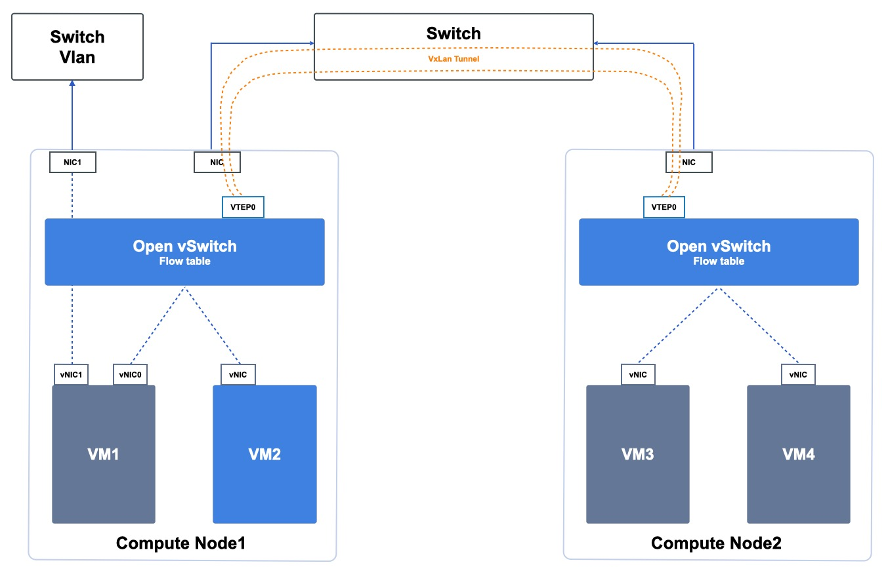

OVS 是虚拟网络数据通路的核心路径，每个计算节点开始提供服务时，SDN 控制器会自动下发属于当前节点的流表到虚拟交换机，告知每个虚拟资源的网络应该如何通信。VXLAN 则提供虚拟网络跨物理主机访问时的数据封装及网络隧道。OVS 在所有计算节点上为分布式结构，[SDN 控制器 ](#_3144-SDN-控制器)所属的管理控制模块为集群架构，结合物理网络及链路的冗余架构，整体提升虚拟网络的可用性。

如上图所示，云平台 OverLay 网络组件分布式运行在所有计算节点，即每个计算节点均部署 `OVS+VXLAN `  等组件：

- 虚拟网络流表分发服务为高可用架构，仅做流表分发不透传生产网络传输。
- 分布式架构，无集中网络转发节点，所有生产网络仅在计算节点上传输，无需通过管理服务或流表分发服务进行转发，避免集中网络转发节点成为性能瓶颈。
- 每个计算节点仅承载运行在本机的虚拟机网络转发和传输，单节点故障，不影响其它节点的虚拟网络通信。
- 管理服务和流表分发服务故障，不影响已部署好的虚拟资源运行及通信。

* 分布式存储直接通过物理网络进行挂载，无需通过 OverLay 网络进行挂载和传输，提升存储性能和可用性。
  - 通过 libvirt 融合分布式存储 rbd 和 qemu ，qemu 通过 librbd 操作分布式存储；
  - 虚拟化进程与分布式存储进程通过本机 & 跨物理机内网进行通信。

如物理集群章节所描述，云平台管理服务仅作为管理角色，不承担网络组件部署及生产网络传输。分布式网络架构将业务数据传输分散至各个计算节点，除业务逻辑等北向流量需要管理服务外，所有虚拟化资源的业务实现等南向流量均分布在计算节点或存储节点上，即平台业务扩展并不受管理节点数量限制。

### 3.4.3 通信机制

云平台通过 VXLAN 隧道及分布式网络架构提供完全隔离的虚拟网络，通过定义虚拟私有网络为虚拟化计算提供与物理网络 VLAN 类似的网络功能，具体通信原理如下：

* 相同 VPC 网络中，同一个物理主机上的虚拟资源可直接通过 OVS 进行网络数据通信；
* 相同 VPC 网络中，跨物理主机虚拟资源间的数据均通过 VXLAN 隧道封装送至物理网络上进行传输；
* 不同 VPC 间使用的隧道 ID 不同，在网络上处于两个逻辑的路由平面，使 VPC 间的网络天然隔离，即不同 VPC  网络间虚拟资源不可通信；
* 不同 VPC 网络间资源内网不通，需通过【**弹性网卡**】的路由功能将不同 VPC 间的网络打通。

如分布式网络架构图所示，假设 VM1、VM3、VM4 属于同一个 VPC 网络 ，VM2 属于独立的 VPC 网络。则虚拟机内网和外网通信机制如下：

**（1）内网络通信及限制**

* VM1 和 VM2 属于不同 VPC 网络，由于 VPC 网络的隔离性，VM1 无法和 VM2 进行网络通信。
* VM3 和 VM4 属于同一个 VPC 网络且在同一台物理主机，可以直接通过 `Open vSwitch` 的流表进行通信。
* VM1 和 VM3/VM4 属于同一个 VPC 网络，默认可进行网络通信，但由于 VM1 与其它两个 VM 不在同一台物理主机，则需要借助 VXLAN 隧道进行数据封装，并通过物理网络进行传输，具体过程如下：
  * VM1 发送数据至 Compute1  的 OVS ，OVS 查询流表 VPC 信息，得知目的虚拟机 VM3 位于 Compute2 节点；
  * OVS 将数据包发送至 `Compute1-vtep0` 设备，对数据包进行 VXLAN 三层封装，并在两个节点 `vtep0` 间建立 VXLAN 隧道；
  * VXLAN 封装数据报文后，根据此 IP 包的目的地址及路由信息，将报文通过 Compute1 的网络接口及物理网络 `Switch` 送达 Compute2 节点；
  * `Compute2-vtep0`  设备通过物理网络收到 VXLAN 报文后，对数据包进行 VXLAN 解封装；
  * 数据报文解封装后，通过 OVS 流表 VPC 信息，将报文转发至 VM3/VM4 ；
* VM2 和 VM3/VM4 属于不同 VPC 网络，由于 VPC 网络隔离性无法直接进行网络通信。

**（2）外网络通信及限制**

如上图所示，本文假设  VM1 已绑定一个外网 IP 地址，通过外网 IP 访问外网为例进行描述，VM 通过 NAT 网关进行外网访问可参照【NAT 网关】。

* 用户通过云平台申请外网 IP 并绑定至虚拟机 VM1 时，云平台系统直接将外网 IP 及网关相关信息配置至虚拟机默认外网虚拟网卡  `eth1`  接口；
* 虚拟机需要访问外网时将数据包发送至 OVS ，OVS 查询流表外网 IP 路由相关信息，将数据包直接发送至 Compute1 外网网卡，通过物理网络配置的路由或 Vlan 与互联网进行通信；
* 外网需要访问 VM1 时，数据包会通过物理网络 Compute1 的外网网卡发送至 OVS ，OVS 查询流表外网 IP 路由相关信息，将数据包直接发送至 VM1 外网虚拟网卡  `eth1`  接口。

!> 网络通信会受安全组规则的限制，即在流量进出虚拟网卡时均会根据安全组规则再次进行筛选。

 

### 3.4.4 SDN 控制器

SDN 控制器即 OverLay 虚拟网络的控制面，负责虚拟网络流表生成及下发管理，通过控制器可自动对云平台的虚拟网络功能和组件进行参数及流表规则配置，无需人工干预，提升平台网络管控能力及运维效率。

每个计算节点开始提供服务时，控制器会自动生成并下发属于当前节点的流表到节点虚拟交换机，告知每个虚拟资源的网络应该如何通信。网络控制器和智能调度系统一样，由【Schedule Manager 核心调度及管理模块】提供虚拟网络控制及管理，支持集群架构，结合物理网络及链路的冗余架构，整体提升虚拟网络的可用性。

* 每一个地域仅需部署一套高可用（主备模式）的 Schedule Manager ，可在两台或多台节点上进行部署。
* 当部署网络控制模块所在的主计算节点服务器物理故障时，部署调度模块的备计算节点将自动接替调度服务，保证核心调度及流表控制服务的可用性。
* 网络控制器仅承载流表分发和控制服务，不透传生产网络传输。

网络控制器高可用架构全部故障，仅影响新建虚拟资源的流表下发及管理，不影响已部署的虚拟资源运行及通信。由于网络控制器及云管理服务不承载生产网络转发和传输，均由分布在所有计算节点的 OVS 组件进行所属虚拟机的网络传输，所以计算节点在水平扩展的同时，承载生产流量的虚拟网络也同步进行了扩展，整体提升平台的可用性和可靠性。

### 3.4.5 网络功能简介

UCloudStack 通过软件定义网络 （ SDN ）对传统数据中心物理网络进行虚拟化，虚拟化网络功能所见即所得，用户无需关注底层设备类型及网络架构，即可在云平台构建使用虚拟网络服务，包括私有网络 VPC 、网络隔离、弹性网卡、外网 IP、NAT 网关、负载均衡、防火墙（安全组）及 VPN 连接等网络服务，承载云平台上虚拟资源的网络通信及安全。

* **VPC 网络**

  软件定义虚拟专有网络，用于租户间数据隔离。提供自定义 VPC 网络、子网规划及网络拓朴，可将虚拟机加入私有网络和子网，为虚拟机提供二层网络服务。

* **网络隔离能能力**

  由 VPC 提供的逻辑隔离的二层网络广播域环境，为云平台用户或子帐号提供网络隔离能力，不同 VPC 网络间网络完全隔离，不可进行通信。

* **弹性网卡**

  一种可随时附加到虚拟机的弹性网络接口，支持绑定和解绑，可在多个虚拟机间灵活迁移，为虚拟机提供高可用集群搭建能力，同时可实现精细化网络管理及廉价故障转移方案。

* **外网 IP**

  用于 VM、负载均衡及 NAT 网关等资源的互联网接入。支持多运营商线路接入并可调整外网 IP 的带宽上限。

* **NAT 网关**

  企业级 VPC 网关，为云平台资源提供 SNAT 和 DNAT 代理，支持外网和物理网两种网络地址转换能力，并支持 VPC 级、子网级及实例级 SNAT 规则。

* **负载均衡**

  基于 TCP/UDP/HTTP/HTTPS 协议将网络访问流量在多台虚拟机间自动分配的控制服务，类似于传统物理网络的硬件负载均衡器.用于多台虚拟机间实现流量负载及高可用，提供内外网 4 层和 7 层监听及健康检查服务。

* **安全组**

  虚拟防火墙，提供出入双方向流量访问控制规则，定义哪些网络或协议能访问资源，用于限制虚拟资源的网络访问流量，支持 TCP 、UDP 、ICMP 及多种应用协议，为云平台提供必要的安全保障。

* **VPN**

  VPN 网关服务，提供可容灾的高可用 VPN 服务，配合 VPC、本地网关及公网服务三者共同使用。 用户可选用多种加密及认证算法，保证隧道的可靠性。

云平台虚拟网络为用户提供丰富的网络功能，同时也提升平台可运营及可运维性，为云平台管理员提供网络规划配置、监控、QoS 限制及网络资源管理，让管理员可以像管理物理网络一样管理虚拟网络。

* **网络规划配置**

  支持平台管理员对私有网络 IP 地址池、外网 IP 地址池、物理网络混合接入等进行对接及配置管理。

* **监控**

  支持平台管理员监控平台所有 IP 及网络资源的使用率、流量及可用性，保证平台的可用性。

* **网络 QoS**

  支持平台管理员配置网络 QoS ，用于控制和限制内/外网络的带宽，用于避免用户间争取网络资源性能，保证所有虚拟网络组件的可用性。

* **网络资源管理**

  支持平台管理员查看并管理平台所有的网络资源，包括物理网络资源和虚拟网络资源。

## 3.5 复用公有云

UCloudStack 云平台基于 UCloud 公有云平台，复用公有云虚拟化核心组件，包括操作系统内核、KVM、QEMU 及 OVS 等组件。

## 3.6 信创云架构

UCloudStack 信创版私有云，提供通过信创互认证的 IaaS 和 PaaS 功能，兼容硬件、操作系统到上层应用的全信创生态。

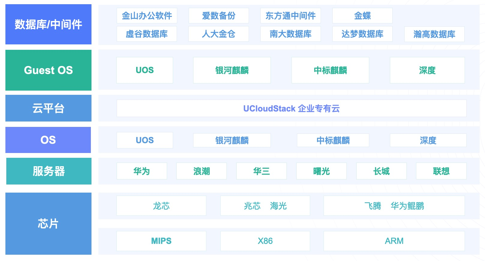

## 3.7 快杰私有云

UCloudStack 快杰版基于软硬协同的技术方案，提供业界领先的计算、存储、网络服务，存储 IOPS 最高可达 120万。

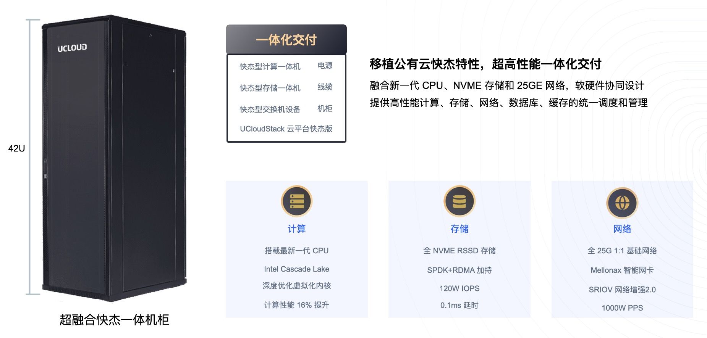

