# 21 账号管理

账号管理是平台基于多租户为用户提供的用户身份管理与资源访问控制服务。通过账号管理服务，可管理账号及子账号并配置账号的安全认证，同时通过子账号管理集管理租户内的用户（子账号），控制并管理子账号对资源的访问和操作权限，适用于企业多用户协同、按需资源分配的场景，从而降低企业信息安全风险。

- 支持多租户模式，可同时创建多个租户并共享整个云平台的资源；多租户间通过认证及权限实现资源访问控制，通过 VPC 网络实现多租户间的网络隔离；
- 账号管理服务提供主账号及子账号的管理，支持查看账号的基本信息且可对账号的登录密码及登录授权进行配置及管理；
- 在主账号控制台中，可进行子账号全生命周期的管理，包括子账号的添加、查看、冻结及资源权限管理；

账号根据角色不同，分为云平台管理员、租户管理员和普通成员：

- 云平台管理员：指整个云平台的管理员，可管理整个云平台的物理管理、虚拟资源管理、平台运维及运营等相关功能，是整个云平台的超级管理员，有关平台管理员的详情介绍及使用指南可参考【 UCloudStack 管理员手册】；
- 租户：是平台资源使用的单位，相当于一个租户，租户有自己的资源配额、计费，租户下的账号登录后，即可在此租户下使用资源。
- 租户管理员：指一个主账号，即通过平台自助注册或平台管理员创建的租户账号；
  - 通过租户管理员，可创建并使用配额内的虚拟资源，并可通过子账号管理添加属于主账号的子账号，实现企业级精细化权限控制；
  - 租户管理员支持充值，平台管理员通过管理控制台的租户管理中，可对租户进行充值及管理；
- 普通成员：子账号，即租户管理员通过用户控制台子账号管理创建的普通账号；
  - 通过主账号权限配置及管理，子账号可独立登录云平台，进行权限范围内的资源管理及操作；
  - 所有子账号共享主账号（租户管理员）的账户余额、免费余额及信用余额；
  - 所有子账号共享主账号（租户管理员）的资源配额；
  - 所有子账号间默认相互隔离，主账号可查看并管理所有子账号创建的资源。

## 21.1 账号信息

账号信息可以查看账号或子账号的基本信息，包括账户 ID、角色 ID、账户名称、账户邮箱、手机号码、现金余额、赠送余额、信用余额及创建时间等信息。可通过用户控制台导航栏“**账户**”进入账户控制台进行查看，如下图所示：

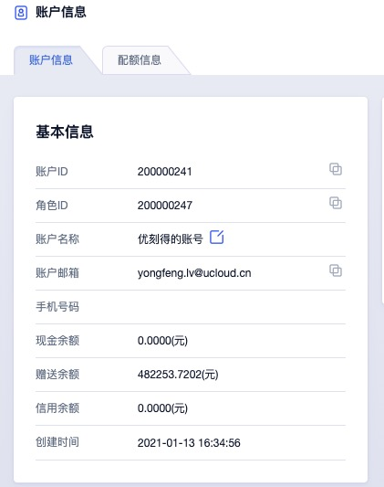

- 账号 ID /角色 ID：当前登录平台账号的 ID 及角色 ID 。
- 账户名称：当前登录平台账号的账户名称或昵称，可直接通过编辑按钮进行修改，支持中文、英文或字符。
- 账户邮箱：当前登录平台账户的邮箱地址。
- 现金余额：指通过支付宝、微信、银行及新浪支付充值的金额。
- 赠送余额：指优惠券及其它渠道赠送的余额，一般由平台管理员进行充值。
- 信用余额：指优惠券及其它渠道赠送的余额，一般由平台管理员进行充值。
- 创建时间：指当前账户的注册时间或创建时间。

## 21.2 账户安全

账户安全是指平台为用户账户安全提供的登录保护，可通过账户安全修改登录密码、开启双子因验证登录保护，同时支持配置账号登录平台的访问限制，保证登录账号的安全。

对于 API 用户，账户安全为开发者提供 API 公钥和私钥信息，可通过复制密钥信息用于操作 API 指令，可参考 API 开发者手册。

### 21.2.1 修改登录密码

平台支持用户修改账号登录密码，可通过账号控制台【账号安全】登录密码的“**修改**”进行密码修改。

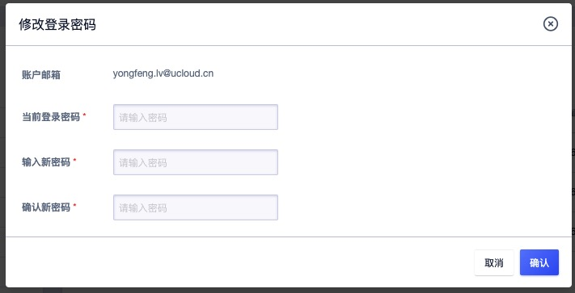

> 修改密码必须使用旧密码，若忘记旧密码，可联系管理员进行修改。

### 21.2.2 开通登录保护

平台提供免费的基于 TOTP（Time-Based One-Time Password Algorithm）登录二次认证服务，开通本服务后，用户每次登录控制台均需通过授权认证。 为了降低用户账号密码泄漏造成的风险，建议您开通账号登录二次认证。开通登录保护的前提条件如下：

（1）开通对象为独立主账号或子账号；

（2）移动设备上安装有 FortiToken 或其他基于 TOTP 技术的令牌工具；

（3）推荐使用 FortiToken 。

#### 21.2.2.1 开通步骤

1. 登录控制台并进入账号控制台，点击账号安全中的【登录保护】“**开启**” 按钮开启登录保护，也可通过右上角登录头像处的【开启登录保护】进行操作，如下图所示：

   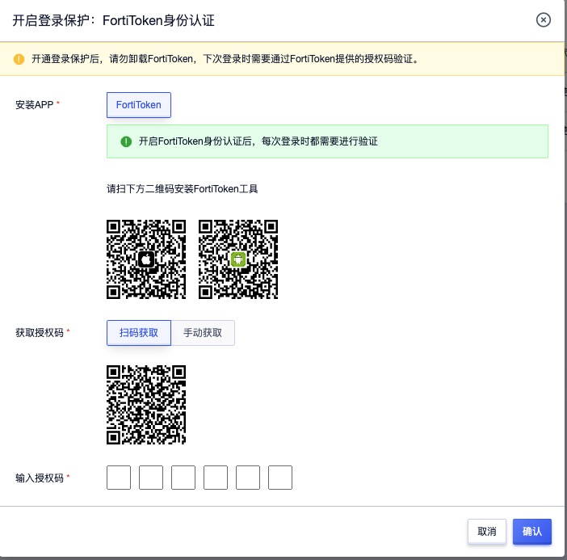

   

2. 检查移动设备上是否安装 FortiToken ：

   - 页面提供 IOS 和 Android 用户工具下载地址，若您未安装 FortiToken 可通过扫码下载。
   - 安卓手机用户也可以通过手机品牌商提供的应用商店搜索和下载 FortiToken 。

3. 打开 FortiToken 工具，扫码获取授权码，也可手动输入密钥获取授权码。

4. 在页面方框内输入获取到的授权码，完成绑定。

#### 21.2.2.2 关闭登录保护

1. 登录控制台并进入账号控制台，点击账号安全中的【登录保护】“**关闭**” 按钮进行操作。
2. 按照页面提示获取并输入授权码即可关闭二次认证功能。

#### 21.2.2.3 功能应用

二次认证服务开通后，账号密码登录平台时会要求输入认证码，系统判断认证码有效后，即可成功登录平台。

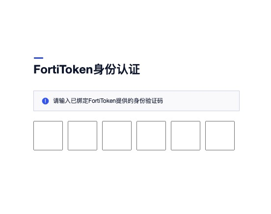

#### 21.2.2.4 登录保护 FAQ

Q：如何下载 FortiToken ？

A：账号绑定页面提供 ISO 和 Android 工具下载链接，可选择通过移动设备扫码下载。若使用的是基于 Android 系统的移动设备，可通过移动设备本身提供的应用下载市场搜索和下载 FortiToken 身份认证器。

------

Q：FortiToken 无法扫描获取授权码怎么办？

A：可切换至手动获取，手动输入账号密钥绑定并获取授权码。

------

Q：是否可以用其他工具绑定账号？

A：若使用的是 FortiToken 身份认证方式，可以用基于 TOTP 算法的其他动态令牌工具绑定账号，如微信小程序“二次验证码”等，75为安全起见，推荐使用谷歌官方 “FortiToken” 。

### 21.2.3 登录访问限制

为保证账号登录的安全及对特定安全场景的需求，平台提供账号登录访问限制能力，使租户可为主账号及下属所有子账号设置登录控制台和访问 API 的客户端 IP 地址，配置后租户的主/子账号只能从指定的 IP 登录或发起 API 访问，保证账户登录及资源的安全性。

仅支持主账号设置登录访问限制策略，配置的策略作用于主账号及下属所有子账号，即配置成功后，主账号及子账号登录均受策略影响。

* 支持配置多个 IP 地址或 IP 地址段，多个 IP 地址/段间使用英文逗号进行分隔。
* 配置的 IP 地址 或 IP 地址段为白名单模式，即配置的 IP 地址/段客户端才可正常登录控制台或访问 API 。
* 默认不指定任何 IP ，代表不限制登录控制台和访问 API 的客户端 IP 地址，即默认全网可访问登录控制台。

> 主账号设置的登录 IP 地址错误导致租户下所有账号均无法登录时，可联系平台管理员通过管理控制台侧修改租户的登录访问限制。

主账号可通过【账户安全】中“登录访问限制”功能进行登录策略配置，如下图所示，默认为空代表全网无限制。

可在登录访问范围内输入可登录平台的 IP 地址或 IP 地址段，点击确认即可生效。配置成功后，用户使用账号在未指定的 IP 网络中无法正常登录控制台，并提示当前的 IP 地址，如下图所示：

平台仅可限制访问控制台的 IP 地址，即直接请求到控制台 URL 地址的客户端 IP 地址，如用户访问平台的客户端地址在 NAT 路由内，则平台配置登录策略时，需要放通 NAT 后的 IP 地址，即需要将 NAT 后的出口地址配置在登录访问策略的白名单中，保证 NAT 路由器内的客户端均可正常访问控制台。

### 21.2.4 API 密钥

通过账户安全租户可查看属于当前账号的 API 密钥 ，用于管理并使用 API 接口，如处图所示：

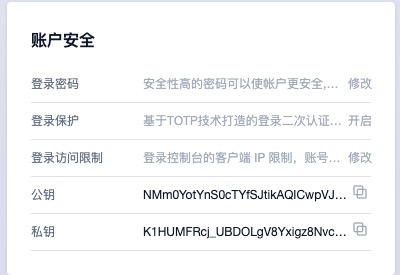

可通过点击复制按钮进行公私密钥的信息复制，以方便 API 指令的调用。

## 21.3 子账号管理

子账号管理是指通过租户管理员进行子账号的生命周期及权限管理，包括添加账户、查看账户、冻结账户及资源权限管理等。子账号对应某一个操作实体，如操作人员或应用程序，可通过创建新的子账号并授权相关资源访问管理权限启用一个子账号。

> 子账号登录云平台时，不可进行子账号管理

### 21.3.1 添加账户

用户通过账户资源控制台的“添加账户”，指定子账号的邮箱、密码及确认密码，即可快带为主账号创建一个子账号，如下图所示：

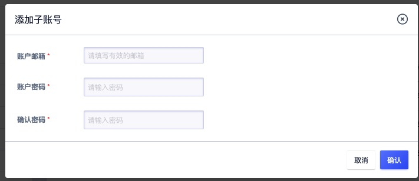

- 邮箱：新建子账号的电子邮件地址，必须实际有效的邮箱地址；
- 密码/确认密码：新建子账号的登录密码，密码须包含有大小写字母、数字、符号中的两种，密码长度为 `6-20` 个字符。

点击确定后，即返回子账号列表页面，可查看当前主账号已拥有的子账号信息。

### 21.3.2 查看账户

用户通过账户控制台可查看子账号列表信息，同时可通过点击子账号 ID 或 邮箱地址进入子账号详情页面，用于查看子账号的基本信息及资源权限管理。

#### 21.3.2.1 子账号列表

子账号列表页面可查看当前主账号下已拥有的所有子账号列表（包含主账号本身），列表信息包括 ID、邮箱、角色、状态、创建时间及操作项，如下图所示：

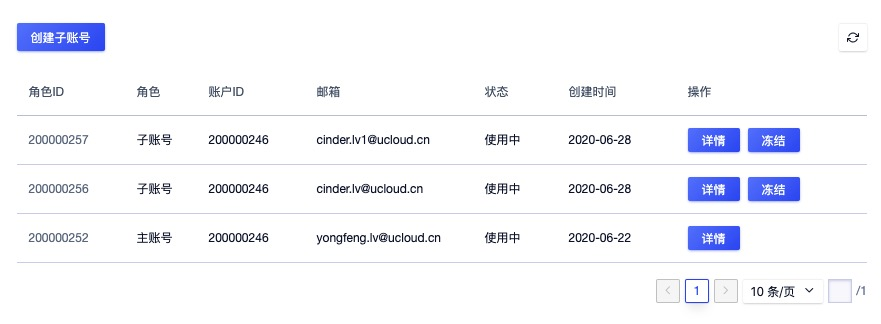

- ID ：当前账号在云平台全局的唯一标识符；
- 邮箱：当前账号的登录邮箱地址；
- 角色：当前账号的角色，包括管理员和普通成员，主账号为租户管理员，子账号为普通成员；
- 状态：当前账号的状态，包括使用中、冻结中：
  - 使用中的用户可登录控制台，并可使用并管理资源；
  - 冻结中的用户无法登录控制台，并禁使使用并管理资源；
- 创建时间：当前账号的创建时间；
- 操作项：对单个账号的操作项，包括冻结和解冻。

#### 21.3.2.2 子账号详情

通过子账号列表的 “ID” 或 邮箱地址可进入账号的详情页面，可查看当前账号的详细信息，如下图所示，详情页面分为基本信息及资源权限管理：

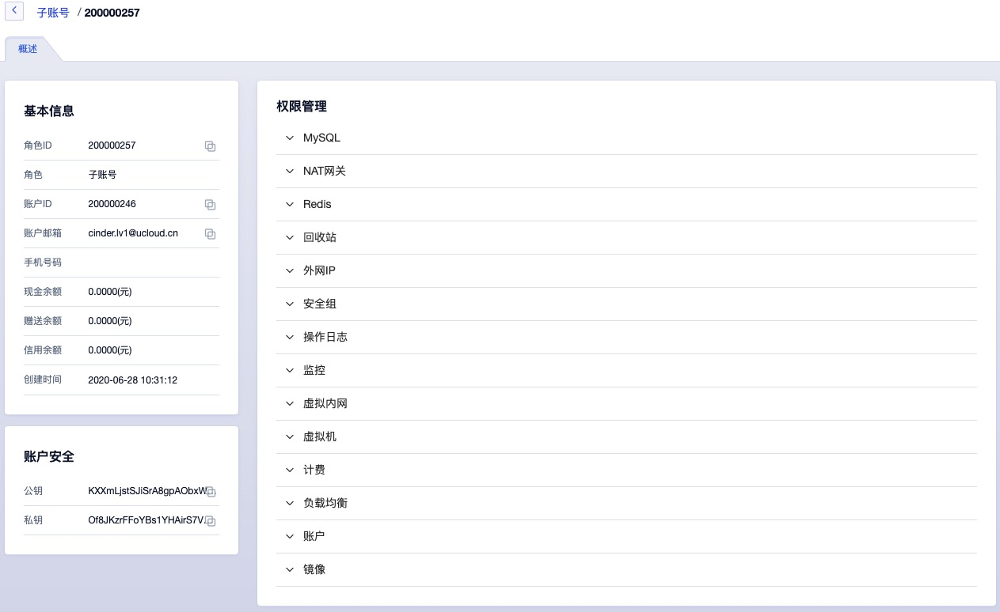

- 基本信息：当前子账号的基本信息，包括 ID、角色、账户邮箱及创建时间；
- 资源权限管理：当前子账号的资源访问及管理的权限控制，可控制的资源包括 NAT 网关、MySQL、Redis、回收站、安全组、外网 IP 、操作日志、监控、VPC、虚拟机、计费、负载均衡、账户及镜像等，具体权限管理详见：[权限管理](#_2135-权限管理) 。

### 21.3.3 冻结账户

冻结账户是指将一个子账号进行锁定，被成功冻结的用户，将不允许登录控制台，且禁止控制并管理相关资源。仅支持状态为“**使用中**”的账号进行冻结操作，用户可点击子账号列表操作项中的“冻结”进入冻结账户向导页面：

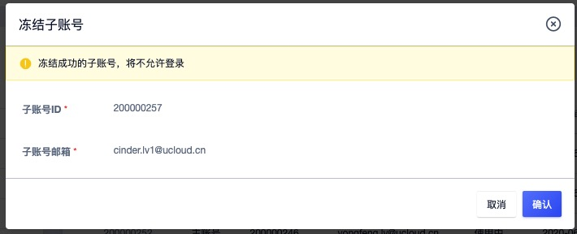

如上图所示，冻结账户需要主账户进行确认。成功锁定子账号后，账号的状态变更为冻结中，在冻结中状态的子账号支持解冻操作。

> 不支持对主账号进行冻结和解冻操作，需平台管理员在管理员控制台进行全租户的冻结和解冻操作。

### 21.3.4 解冻账户

解冻账户是指解冻一个已冻结的账号，被成功解冻的的用户，可登录管理控制台且可进行相关资源使用和管理。仅支持状态为“**冻结中**”的账号进行解冻操作，用户可点击子账号列表操作项中的“解冻”进入解冻账户向导页面：

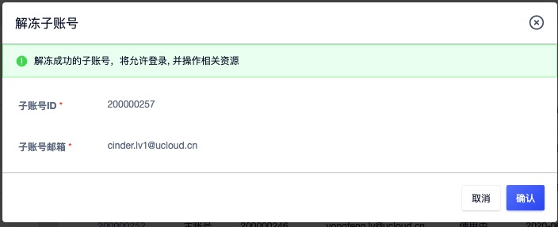

如上图所示，解结一个已锁定的账号需要主账户进行确认。成功解锁的子账号状态将变更为“使用中”，在使用中状态的子账号支持冻结操作。

### 21.3.5 权限管理

子账号权限管理是指租户管理员对每个子账号对云平台资源的控制及管理配置，通过权限管理可以为子账号开启或关闭云平台资源及生命周期管理的功能，实现企业精细化权限管控及资源合理分配的场景。

子账号权限管理可管控的资源包括 NAT 网关、MySQL、Redis、回收站、安全组、外网 IP 、操作日志、监控、VPC、虚拟机、计费、负载均衡、账户及镜像等等，对于不同的虚拟资源，分别提供不同的权限管控项，如下图所示：

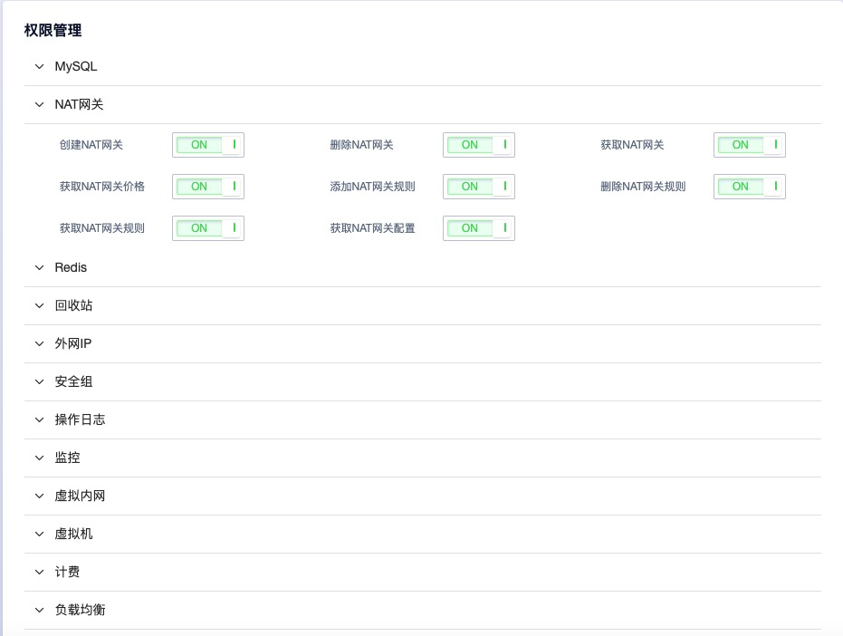

如权限管理示意图所示，根据不同的资源可为子账号开启或关闭不同的管理权限。为子账号开启一个资源的功能开关，子账号登录控制台后，即可使用当前功能；若为子账号关闭一个资源的功能开关，子账号登录控制台后，即显示该功能“**权限不足**”，如下图所示：

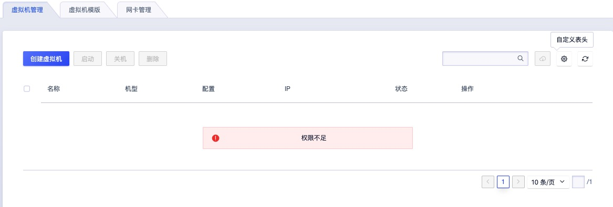

> 权限管理的配置即时生效，在变更子账号资源权限时需谨慎操作。

## 21.4 查看配额

配额（quota）是一个租户（包含子账号）针对每种虚拟资源在一个地域下可创建的数量限制。通过限制每个账户拥有的资源配额，可有效共享并合理分配云平台物理资源，提升资源利用率的同时，满足云平台上每一个账户的资源需求。

云平台全局提供每种资源在每个数据中心的默认配额，即每个租户创建时默认提供的资源配额模板，可通过云平台管理员分别自定义每个租户的资源配额。租户管理员及所拥有的子账号不可自定义修改资源配额数量，仅提供查看配额。

子账号和租户管理员（主账号）共享资源配额，即每种资源配额为主账号和所包含的所有子账号可创建的资源数量之和。如租户对于云硬盘的配额为 10 ，则租户及所有子账号可创建的云硬盘数量上限不可超过 10 个。

租户和子账号可通过账号管理控制台"**配额**"配额控制台查看当前账号拥有的资源配额列表，并根据地域分别展示配额信息，如下图所示： 

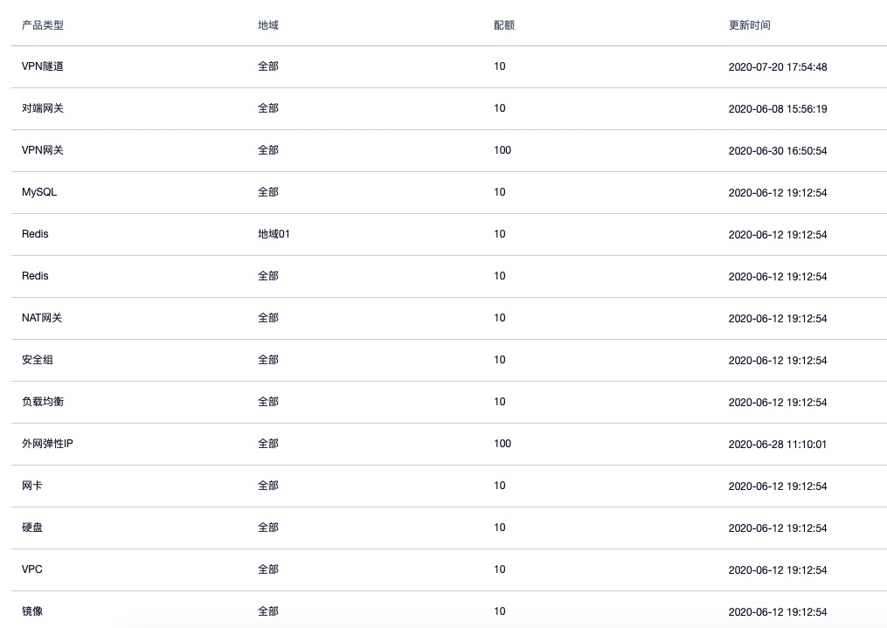

- 产品类型：当前配额信息的资源类型，平台支持的资源配额包括虚拟机、镜像、VPC、硬盘、弹性网卡、外网 IP 、负载均衡、安全组、 NAT 网关、Redis、MySQL、VPN 网关、VPN 隧道。
- 地域：当前配额信息的地域信息，代表一个地域可创建的资源配额，支持某个地域或全部地域；
- 数量：当前配额项在一个地域或全部地域可创建的资源数量；
- 更新时间：当前配额项的修改更新时间。

> 子账号与主账号的配额信息及数量一致，若主账号和子账号创建的资源数量超过配额，则平台自动禁止主账号和子账号创建当前资源。

