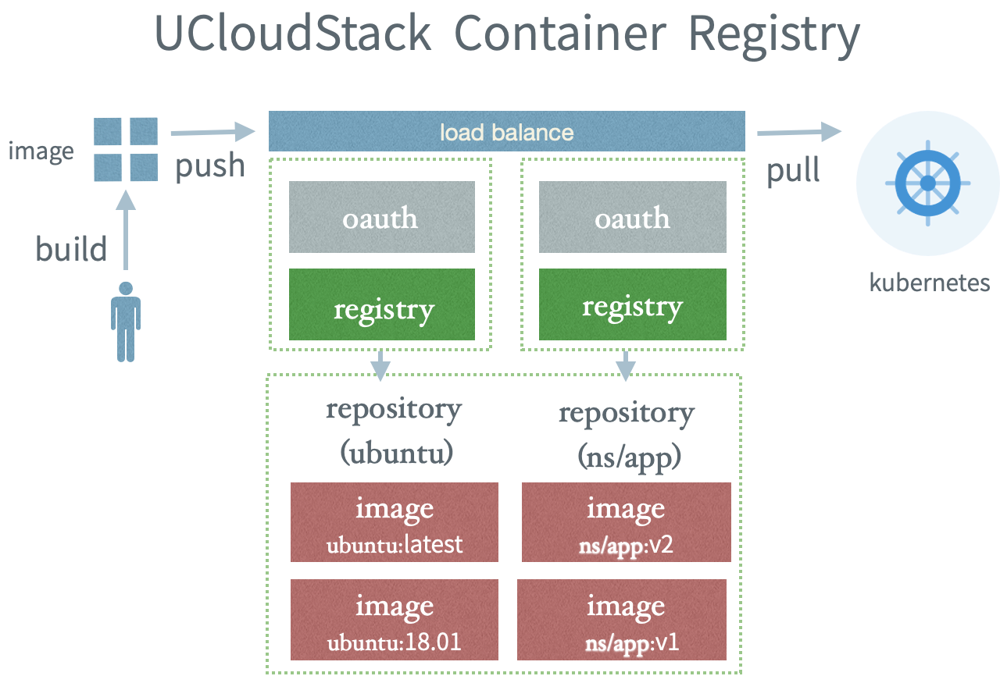

# 24  容器镜像服务

## 24.1 文档目录

1. [产品介绍](/UCloudStack/userguide/containerimage?id=产品解释)
2. [名词解释](/UCloudStack/userguide/containerimage?id=名词解释)
3. [使用流程](/UCloudStack/userguide/containerimage?id=使用流程)
4. [实现原理](/UCloudStack/userguide/containerimage?id=实现原理)
5. [功能列表](/UCloudStack/userguide/containerimage?id=功能列表)
6. [操作指南](/UCloudStack/userguide/containerimage?id=操作指南)

## 24.2 产品介绍

容器镜像服务（UCloudStack Container Registry）是一项面向容器镜像的安全托管及分发平台， 提供容器镜像的全生命周期管理，简单易用、安全可靠，与容器服务（UCloudStack Container Service）无缝集成，帮助降低打造云原生应用的交付复杂度。

## 24.3 名词解释

1. 命名空间（NameSpace）： 命名空间用于管理多个具有关联属性的镜像仓库，不直接存储容器镜像，可理解为企业内部的组织团队、产品项目或个人，命名空间的名称全局唯一（平台级别）。
2. 镜像仓库（Repository）：仓库用于直接管理容器镜像，单个镜像仓库可包含不同版本（Tag）的容器镜像。镜像仓库归属于命名空间，并从命名空间继承了公开、私有属性及未来其他的特性。
3. 标签（Tag）：同一个容器镜像可以包含多个标签，代表镜像源的不同版本，如 ubuntu 仓库源里，有 15.10、14.04 等多个不同的版本，你可以通过 REGISTRY_ADDRESS/NAMESPACE/REPOSITORY:TAG 下载一个特定的容器镜像。
4. 私有&公开(Private&Public)： 私有的命名空间/镜像仓库只允许有权限的用户拉取和推送镜像，公开的命名空间/镜像仓库中的镜像允许任意人拉取，且无需是UCloudStack用户，前提是网络可达。


## 24.4 使用流程

容器镜像服务为你提供容器镜像的存储及分发能力，下面我们从头开始描述下如何使用容器镜像服务，方便你使用。

你在本地或者UCloudStack虚拟机上构建好一个容器镜像后，则可以选择在容器镜像服务中创建一个命名空间和镜像仓库，如果你希望匿名用户也可以拉取你的镜像，则可以将镜像仓库的类型设置为公开，反之则设置为私有。 对于私有属性的镜像，你还可以设置是否允许其他子账号拉取或推送镜像。最后，在上传镜像的时候，你需要登录容器镜像，地址可以在访问凭证中获取，用户名和密码为你在UCloudStack的登录账号一致。

如果你的云平台没有配置TLS证书，镜像仓库的地址会是HTTP，出于安全考虑，Docker或者其他容器运行时默认采用HTTPS，HTTP被认为不可信的，因此如果你在虚拟机上往仓库推送镜像，需要修改一下daemon.json，一般为/etc/docker/daemon.json文件,添加如下行即可。
```bash
{
"insecure-registries": ["$YOUR_REGISTRY_ADDRESS"],
}
```
UCloudStack的容器服务（K8S）集群节点已默认配置该参数，因此你无需单独配置。

将镜像推送到镜像仓库后，则可以通过UCloudStack提供的容器服务或者自建的容器集群来拉起应用。



## 24.5 实现原理

下图为UCloudStack容器镜像服务的技术架构图，为了实现业务的高可用，所有模块均是高可用架构，下面分别说明下每个模块的作用。

1. Docker auth作为Docker Registry外置认证服务，提供认证鉴权服务；

2. sync service模块同步用户数据（用户名/密码）到docker auth服务的数据中，同步服务存在的意义是使Docker Auth不依赖User Service的认证服务，实现独立部署；

3. ApiServer服务提供gRPC接口，从Docker Registry API和Docker auth DB中拉取数据；

4. S3为对象存储服务，提供镜像的存储支持；


## 24.6 功能列表
|序号|所属模块|功能点|功能详细说明|
|---|-------|-----|----------|
|1|命名空间|创建命名空间|命名空间必须全局唯一，长度为2~30个字符，可为英文字母、数字、可使用连接符“-”、“_”，连接符不可以位于开始或结束。|
|2|命名空间|删除命名空间|删除命名空间，命名空间下有镜像仓库也可以删除。|
|3|命名空间|更新命名空间|更新命名空间类型,将命名空间由公有变更为私有，或反之|
|4|命名空间|授权|授权哪些子账号拥有命名空间（私有）下的推送或下载权限|
|5|镜像仓库|创建镜像仓库|创建一个镜像仓库，长度为2-64个字符，可使用小写英文字母、数字，可使用分隔符“_”、“-”、“.”（分隔符不能在首位或末位）|
|6|镜像仓库|删除镜像仓库|删除镜像仓库，有镜像也可以删除。|
|7|镜像仓库|更新仓库信息|可修改镜像仓库的摘要、备注信息、以及类型（公有、私有）|
|8|镜像仓库|查看镜像仓库信息|获取镜像仓库的基本信息（仓库地址、备注、Tag列表等）|
|9|镜像仓库|获取镜像Tag|获取该镜像下的全部Tag|
|10|访问凭证|获取访问凭证|查看镜像仓库地址及使用方式、登录账号和密码|
|11|镜像中心|获取镜像信息|查看系统公开或其他用户共享的镜像|

## 24.7操作指南

这里以Docker作为默认容器运行时作为操作指南的教程示例，对于Containerd等，只需要更换成对应的命令即可。

### 24.7.1 创建私有镜像库

**step1: 进入到容器镜像产品页，点击”创建命名空间“**

命名空间是一组容器镜像的集合，你可以按应用或者团队来创建命名空间；

命名空间的名称全局唯一，长度为2~30个字符，可为英文字母、数字、可使用连接符“-”、“_”，连接符不可以位于开始或结束。

命名空间分为私有和公开两种类型，一般建议设置为私有，其下所有的镜像仓库默认继承其开放属性，也可以单独设置，无论是私有还是公开，推送镜像都需要登录，公开类型的镜像库，下载则无需登录和身份校验。

另外你还可以设置是否允许外网访问，如果开启，则平台外部的客户端也可以上传和下载容器镜像，反之则不行。

**step2: 点击镜像仓库TAB，进入到仓库列表页，点击”创建镜像仓库“**

镜像仓库是一类容器镜像的集合，可包含不同版本（Tag）的容器镜像。镜像仓库归属于命名空间，并从命名空间继承了公开、私有属性及未来其他的特性。

同一命名空间下的镜像仓库全局唯一，可使用小写英文字母、数字，可使用分隔符“_”、“-”、“.”（分隔符不能在首位或末位）。

镜像仓库继承了其上的命名空间的开放属性，你也可以单独设置，即在某个开放属性为私有的命名空间下，将某个镜像的开放属性设置为公开，建议对外开放的镜像不包含业务信息。

完成了上述步骤后，就可以将制作好的镜像推送到你专有的镜像仓库了。

### 24.7.2 登录镜像仓库

在装有docker (版本要求1.10 以上版本) 机器上通过docker login执行登录，通过域名访问服务:

```bash
docker login $UCloudStack_Container_Registry_Addr -u $Your_UCloudStack_UserName
```
$UCloudStack_Container_Registry_Addr 为你的镜像仓库地址，可在访问凭证处获取；

$Your_UCloudStack_UserName 为你的云平台登录账号，可在访问凭证处获取，同时密码为你的云平台登录密码；

!> 如果你的云平台没有配置TLS证书，镜像仓库的地址会是HTTP，出于安全考虑，Docker或者其他容器运行时默认采用HTTPS，HTTP被认为不可信的，因此如果你在虚拟机上往仓库推送镜像，需要修改一下daemon.json，一般为/etc/docker/daemon.json文件,添加如下行即可。
```bash
{
"insecure-registries": ["$YOUR_REGISTRY_ADDRESS"],
}
```

### 24.7.3 推送（push）镜像

Step 1: 对本地已有镜像打一个tag，如一个nginx镜像，可通过docker images 查看所有本地镜像。

```bash
docker tag nginx:latest $UCloudStack_Container_Registry_Addr/{已创建命名空间}/{已创建镜像仓库名称}:tag
```

Step2：提交镜像到仓库。

```bash

docker push $UCloudStack_Container_Registry_Addr/{已创建命名空间}/{已创建镜像仓库名称}:tag

```

### 24.7.4 下载（pull）镜像

```bash 
docker pull $UCloudStack_Container_Registry_Addr/{已创建命名空间}/{已创建镜像仓库名称}:tag

```

