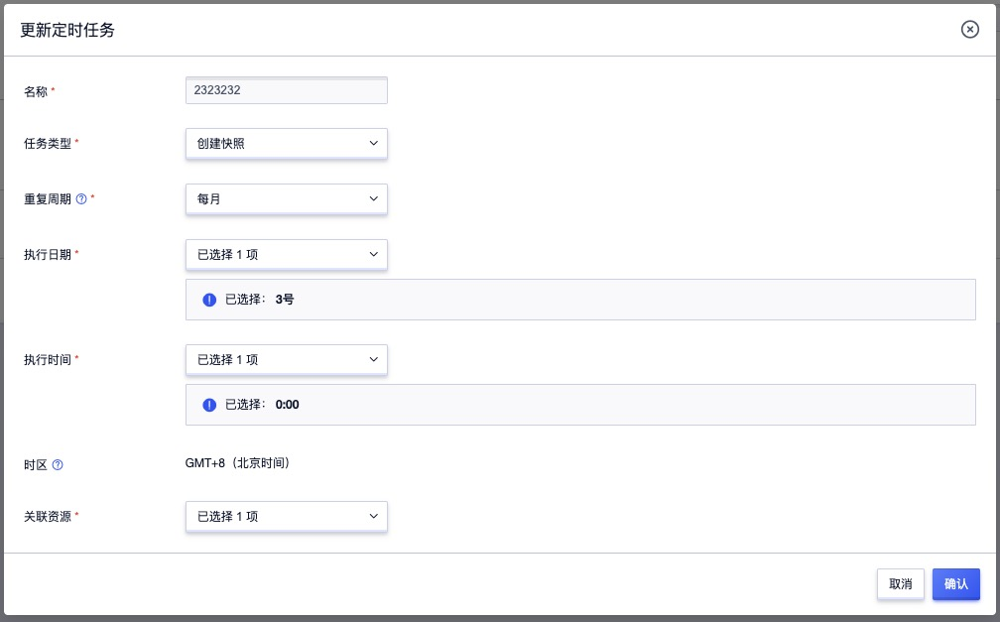
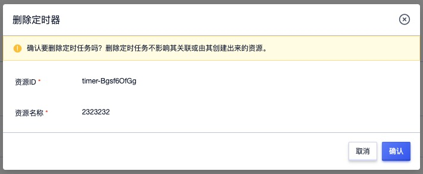

# 15 定时器

## 15.1 产品简介

定时器（Scheduler）是平台为用户提供自动化任务功能，可用于定期执行一系列任务的，如创建快照。可在指定的周期重复执行，也可仅执行一次，且每个任务支持多个资源批量操作。

* 支持定时创建快照，即实现硬盘的自动快照，同时支持为多个硬盘批量创建定时快照任务。
* 支持单次和重复执行定时任务，重复执行支持每天、每周、每月的指定时间执行任务。
* 每天支持单小时或每个小时进行定时任务的执行操作。
* 每周支持星期一至星期日单小时或每个小时进行定时任务的执行操作。
* 每月支持每一天单小时或每个小时进行定时任务的执行操作。
* 平台会保存定时器执行的任务列表及执行结果记录，支持用户在定时器中查看每个任务的执行记录。

平台支持定时器的全生命周期管理，包括创建定时任务、查看定时任务及记录、更新定时任务及删除定时任务。

## 15.2 创建定时任务

用户可通过控制台直接创建一个用于执行创建快照的定时任务，用于云硬盘的备份。创建定时任务时需要指定任务类型、重复周期、执行时间及关联资源，如下图所示：

* 名称：定时任务的名称，用于标识定时任务。
* 任务类型：定时任务的执行动作，当前仅支持创建快照。
* 重复周期：支持单次和重复执行定时任务，重复执行支持每天、每周、每月的指定时间执行任务：
  * 单次执行：需要指定执行具体时间，24小时制；默认当天执行，若执行时间已过则为次日执行。
  * 每天执行：需要指定每天执行的整点时间，支持从 0 点到 23 点的 24 个整点，支持每个整点均会执行定时任务。
  * 每周执行：需要指定每次执行的日期和执行时间，支持从周一到周日的 0 点到 23 点，支持周一到周日每天执行每个执行时间进行定时任务的执行。
  * 每月执行：需要指定每次执行的日期和执行时间，支持从 1 号到 31 号或月末的 0 点到 23 点，同时每月的每一天每个执行时间进行定时任务的执行。
* 执行时间：任务具体执行的时间，根据重复周期不同，执行时间可支持不同的设置方法。
  * 当重复周期为单次执行时，可支持设置日期的具体时、分、秒。
  * 当重复周期为每天、每周、每月重复执行时，可支持 0 点到 23 点中每一个整点。
* 时区：默认定时任务的时区东八区时间，即 GMT+8（北京时间）
* 关联资源：即设置需要定时任务执行创建快照的云盘资源，支持虚拟机的系统盘和数据盘，并支持批量选择。

点击确认后，系统将自动生成一条定时任务，并立即检测定时任务的执行计划和时间，如果到达约定的时间即会立即执行定时任务，可通过定时任务的详情中的日志查看具体执行情况。

## 15.3 查看定时任务

### 15.3.1 定时任务列表

用户可通过控制台查看账户内拥有的所有定时任务列表及相关信息，并可通过列表的名称进入定时任务详情查看定时任务的基本信息及任务执行记录，具体列表信息如下图所示：

列表信息包括名称、ID、任务名称、定时器、关联资源、创建时间、更新时间及操作项：

* 名称/ID：当前定时任务的名称及全局唯一标识符。
* 任务名称：当前定时任务的执行动作，当前仅支持创建快照。
* 定时器：定时任务的执行规则，包括重复周期、执行日期及执行时间，其中执行日期仅在重复执行时有效。
* 关联资源：定时任务执行定时任务时的关联资源，即为关联资源执行创建快照或其它操作。
* 创建时间/更新时间：定时任务的创建时间和更新时间。

列表上支持对定时任务的更新及删除操作，同时支持对定时任务的批量删除操作；为方便用户管理定时任务的资源，平台支持对定时任务的搜索，支持模糊搜索。

### 15.3.2 定时任务详情

用户可进入定时任务详情查看定时任务的详细信息，包括基本信息及任务执行记录信息，如下图所示：

其中基本信息包括名称、ID、任务类型、重复制期、执行时间、关联资源及创建时间，而任务执行日志全面记录当前定时任务的任务执行计划及执行状态，包括资源 ID、开始时间、结束时间、任务状态及任务结果。

* 资源 ID：定时任务执行记录对应的关联资源。
* 开始时间：定时任务执行的开始时间。
* 结束时间：定时任务执行的结束时间。
* 任务状态：当前定时任务的状态，包括成功和失败。
* 任务结果：当前任务的最终资源操作状态，包括操作成功和操作换败。

通过执行记录可进行定时任务的追溯，用于判断任务执行的成功与否。

## 15.4 更新定时任务

用户可在业务需要时对定时任务进行变更，支持变更定时任务的任务类型、重复周期、执行日期、执行时间及关联资源，如下图所示：

定时任务更新后，不影响定时任务已执行的任务，执行新的任务类型时会根据新的定时策略进行操作。

## 15.5 删除定时任务

平台支持用户删除不适合业务场景的定时任务，在任何状态下均可进行删除。如下图所示：

删除定时任务会立即销毁，同时会自动停止定时任务中的执行计划，但不影响其关联或由其创建出来的资源。

