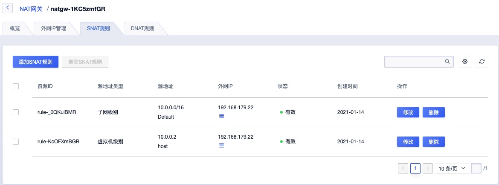

# 12 NAT 网关

## 12.1 NAT 网关简介

### 12.1.1 概述

NAT 网关（ NAT Gateway ）是一种类似 [NAT](https://zh.wikipedia.org/wiki/网络地址转换) 网络地址转换协议的 VPC 网关，为云平台资源提供 SNAT 和 DNAT 代理，支持互联网地址转换能力，并支持普通和白名单两种资源网络出口模式。

用户可通过 NAT 网关让 VPC 子网中未绑定外网 IP 的虚拟机访问外网，同时可配置端口转发规则使虚拟机对外提供服务。作为一个虚拟网关设备，需要绑定外网 IP 作为 NAT 网关的默认统一出口，支持 VPC 、子网、虚拟机三种级别的 SNAT 规则，使不同维度的资源通过 NAT 网关访问外网。

同时网关提供 DNAT 能力，支持配置基于 TCP 和 UDP 两种协议的端口转发，将 VPC 内的云资源内网端口映射到 NAT 网关所绑定的外网 IP，对互联网或 IDC 数据中心网络提供服务。NAT 网关具有地域（数据中心）属性，仅支持相同数据中心下同 VPC 虚拟资源的 SNAT 和 DNAT 转发服务。

虚拟机通过 NAT 网关可访问的网络取决于绑定的外网 IP 所属网段在物理网络上的配置，若所绑定的外网 IP 可通向互联网，则虚拟机可通过 NAT 网关访问互联网；若所绑定的外网 IP 可通向 IDC 数据中心的物理网络，则虚拟机通过 NAT 网关访问 IDC 数据中心的物理网络。

### 12.1.2 应用场景

用户在平台使用虚拟机部署应用服务时，有访问外网或通过外网访问虚拟机的应用场景，通常我们会在每一台虚拟机上绑定一个外网 IP 用于和互联网或 IDC 数据中心网络进行通信。真实环境和案例中，可能无法分配足够的公网 IP ，即使公网 IP 足够也无需在每一台需要访问外网的虚拟机上绑定外网 IP 地址。

- 共享 EIP ：通过 SNAT 代理，使多台 VPC 内网虚拟机共享 1 个 外网 IP 地址访问互联网或 IDC 数据中心的物理网络。
- 屏蔽真实 IP ：通过 SNAT 代理，多台 VPC 内网虚拟机使用代理 IP 地址通信，自动屏蔽真实 IP 内网地址。
- VPC 内网虚拟机提供外网服务：通过 DNAT 代理，配置 IP 及端口转发，对互联网或 IDC 数据中心的网络提供业务服务。

### 12.1.3 架构原理

平台产品服务底层资源统一，NAT 网关实例为主备高可用集群架构，可实现 NAT 网关故障自动切换，提高 SNAT 和 DNAT 服务的可用性。同时结合外网 IP 地址，根据 SNAT 和 DNAT 规则为租户虚拟资源提供 SNAT 和 DNAT 代理服务。

在产品层面，租户通过申请一个 NAT 网关，指定 NAT 网关可允许通信的 VPC 网络，通过绑定【外网 IP】使多子网下虚拟机与互联网或 IDC 数据中心物理网进行通信，具体逻辑架构图如下：

- 平台支持同 VPC 多子网虚拟机使用 NAT 网关访问互联网或 IDC 数据中心网络。
- 当多个子网中未绑定外网 IP 的虚拟机关联 NAT 网关时，平台将自动在虚拟机中下发访问外网的路由。
- 虚拟机通过下发的路由，将访问外网的数据通过 NAT 网关透传至已绑定的【外网 IP】。
- 透传至外网 IP 的数据通过平台 OVS 及物理网卡将数据包发送至物理交换机，完成数据 SNAT 的通信。
- 当外网需要访问 VPC 中的虚拟机时，可通过 NAT 网关端口转发，使互联网或 IDC 物理网通过 NAT 网关已绑定的 IP+端口 访问 VPC 内网服务。

### 12.1.4 功能特性

云平台提供高可用 NAT 网关服务，并支持网关的全生命周期管理，包括多外网 IP 、SNAT 规则及 DNAT 端口转发及监控告警，同时为 NAT 网关提供网络及资源隔离的安全保障。

一个 VPC 允许创建 20 个 NAT 网关，相同 VPC 下所有 NAT 网关中 SNAT 规则不可重复，即 20 个 NAT 网关中的 SNAT 规则不允许重复。场景举例：

* 当 NATGW  (VPC：192.168.0.0/16）中创建了子网（192.168.0.1/24）的 SNAT 规则，则相同 VPC 下 NATGW 不可在创建子网（192.168.0.1/24）为源地址的 SNAT 规则，当 NATGW01 中该子网规则删除后，才可进行创建。
* 当 NATGW  (VPC：192.168.0.0/16）中创建了 VPC 级别的规则，则相同 VPC 下不可在创建 VPC 级别的规则。
* 当 NATGW  (VPC：192.168.0.0/16）中创建了 虚拟机（192.168.1.2） 的 SNAT 规则，则相同VPC 下 NATGW 不可在创建虚拟机（192.168.1.2） 为源地址的 SNAT 规则。

#### 12.1.4.1 多外网 IP 支持

NAT 网关支持绑定多个外网 IP 地址，使 SNAT 规则中的资源可通过多个外网 IP 地址访问外网，DNAT 端口转发规则中的虚拟资源，可通过指定的外网 IP 地址访问 VPC 内网服务。

一个 NAT 网关支持绑定 50 个默认路由类型的 IPv4 外网 IP 地址，为 NAT 网关指定子网的虚拟资源提供共享的外网 IP 资源池，以提供更加灵活便捷的 SNAT 及 DNAT 能力。

支持用户查看已绑定至 NAT 网关的所有外网 IP 地址，同时支持对外网 IP 地址的解绑，解绑后相关联的 SNAT 规则和 DNAT 规则网络通信都将失效。用户可通过修改 SNAT 和 DNAT 规则，分别设置新的出口 IP 及入口源 IP 地址。

#### 12.1.4.2 SNAT 规则

NAT 网关通过 SNAT 规则支持 SNAT（Source Network Address Translation 源地址转换）能力，每条规则由源地址和目标地址组成，即将源地址转换为目标地址进行网络访问。平台 SNAT 规则支持多种场景的出外网场景，即源地址包括 VPC、子网、虚拟机三种类型：

- VPC 级别：指 NAT 网关所属 VPC 下的所有虚拟机可通过 NAT 网关访问外网。
- 子网级别：指 NAT 网关所属 VPC 下被指定子网中的所有虚拟机可通过 NAT 网关访问外网。
- 虚拟机级别：指 NAT 网关所属 VPC 下被指定的虚拟机才可通过 NAT 网关访问外网。

规则的目标地址为 NAT 网关绑定的外网 IP 地址，通过规则策略即可将源地址在 VPC 、子网、虚拟机的 IP 地址转换为网关绑定的外网 IP 进行网络通信，即通过 SNAT 规则虚拟机可在不绑定外网  IP 的情况下与平台外网进行通信，如访问 IDC 数据中心网络或互联网。

SNAT 规则中不同源地址类型的规则优先级不同，以优先级高的规则为准：

**（1）源地址为 VPC ** 

- NAT 网关所属 VPC 下所有虚拟机均可通过 NAT 网关访问外网。
- 一个 NAT 网关仅允许创建一条源地址为 ALL 的 SNAT 规则。
- 源地址为 ALL 规则的优先级最低，在未匹配到精确规则时，以源地址为 ALL 的规则访问外网。

**（2）源地址为子网 CIDR**

- 子网下虚拟机可通过 NAT 网关访问外网，子网 SNAT 规则优先级高于源地址为 ALL 的规则。
- 每个子网仅可创建一条 SNAT 规则，不允许重复。
- 支持为子网下虚拟机单独配置 SNAT 规则，优先级高于源地址为子网的 SNAT 规则。

**（3）源地址为虚拟机IP**

- 虚拟机可通过 NAT 网关访问外网。
- 每个虚拟机 IP 仅可创建一条 SNAT 规则，不允许重复。
- 源地址为虚拟机 IP 的 SNAT 规则优先级高于源地址为 ALL 和 子网的 SNAT 规则。

SNAT 规则的目标地址可以为 NAT 网关已绑定的一个或多个外网 IP ，当目标外网 IP 为 ALL 时，源地址资源从网关上所有外网 IP 池中随机选择 IP 访问外网。

> 一个 NAT 网关默认可创建 100条 SNAT 规则。

用户配置 SNAT 规则后，NAT 网关会自动下发默认路由至源地址匹配的虚拟机，使虚拟机通过 SNAT 规则的外网 IP 访问外网。具体通信逻辑如下：

- 虚拟机未绑定 IPv4 外网 IP ，则默认通过 NAT 网关访问外网。
- 虚拟机已绑定 IPv4 外网 IP 且存在默认网络出口，则通过虚拟机默认网络出口访问外网。
- 虚拟机已绑定 IPv4 外网 IP 且无默认网络出口，则通过 NAT 网关访问外网。

虚拟机通过 NAT 网关访问外网时，使用的外网 IP 取决于 SNAT 规则的配置，若规则配置的外网 IP 为多个，则会从多个外网 IP 中随机选择 IP 地址作为虚拟机的出口。

#### 12.1.4.3 DNAT 规则

NAT 网关支持 DNAT（Destination Network Address Translation 目的地址转换），也称为端口转发或端口映射，即将外网 IP 地址转换为 VPC 子网的 IP 地址提供网络服务。

- 支持 TCP 和 UDP 两种协议的端口转发，支持对端口转发规则进行生命周期管理。
- 支持批量进行多端口转发规则配置，即支持映射端口段，如 TCP:1024~TCP:1030 。
- NAT 网关绑定外网 IP 时，端口转发规则为 VPC 子网内的虚拟机提供互联网外网服务，可通过外网访问子网内的虚拟机服务。

#### 12.1.4.4 监控告警

平台支持对 NAT 网关进行监控数据的收集和展示，通过监控数据展示每一个 NAT 网关的指标数据，同时支持为每一个监控指标设置阈值告警及通知策略。支持的监控指标包括网络出/带宽、网络出/包量及连接数。

支持查看一个 NAT 网关多时间维度的监控数据，包括 1 小时、6 小时、12 小时、1 天、7 天、15 天及自定义时间的监控数据。默认查询数提成为 1 小时的数据，最多可查看 1 个月的监控数据。

#### 12.1.4.5 NAT 网关高可用

NAT 网关实例支持高可用架构，即至少由 2 个虚拟机实例构建，支持双机热备。当一个 NAT 网关的实例发生故障时，支持自动在线切换到另一个虚拟机实例，保证 NAT 代理业务正常。同时基于外网 IP 地址的漂移特性，支持在物理机宕机时，保证 SNAT 网关出口及 DNAT 入口的可用性。

### 12.1.5 NAT 网关安全

NAT 网关的网络访问控制可以关联安全组给予安全保障，通过安全组的规则可控制到达 NAT 网关 所绑定外网 IP 的入站流量及出站流量，支持 TCP、UDP、ICMP、GRE 等协议数据包的过滤和控制。

安全组及安全组的规则支持对已关联安全组的 NAT 网关的流量进行限制，仅允许安全组规则内的流量透传安全组到达目的地。为保证 NAT 网关的资源和网络安全，平台为 NAT 网关提供资源隔离及网络隔离机制：

* 资源隔离
  * NAT 网关具有数据中心属性，不同数据中心间 NAT 网关资源物理隔离；
  * NAT 网关资源在租户间相互隔离，租户可查看并管理账号及子账号下所有 NAT 网关资源；
  * 一个租户内的 NAT 网关资源，仅支持绑定租户内同数据中心的 VPC 子网资源；
  * 一个租户内的 NAT 网关资源，仅支持绑定租户内同数据中心的外网 IP 资源；
  * 一个租户内的 NAT 网关资源，仅支持绑定租户内同数据中心的安全组资源。

* 网络隔离
  * 不同数据中心间 NAT 网关资源网络相互物理隔离；
  * 同数据中心 NAT 网关网络采用 VPC 进行隔离，不同 VPC 的 NAT 网关资源无法相互通信；
  * NAT 网关绑定的外网 IP 网络隔离取决于用户物理网络的配置，如不同的 Vlan 等。

## 12.2 使用流程

在使用 NAT 网关服务前，需根据业务需求规划 NAT 网关的 VPC 网络及外网 IP 网络，并根据业务需求配置 SNAT 和 DNAT 规则。具体流程如下：

1. 租户根据需求创建 VPC 和 子网，并在多个子网中创建虚拟机；
2. 租户根据需求创建 外网 IP 地址，并通过 API 或控制台指定网络类型、关联子网及绑定的出口 IP 地址，创建一个 NAT 网关；
3. 通过 SNAT 规则添加 VPC、子网或虚拟机类型的 SNAT 规则，则关联的虚拟机可通过 NAT 网关访问外网；
4. 通过 DNAT 规则配置需要通过对外提供服务的虚拟机规则，则外网可访问 VPC 网络中未绑定外网 IP 的资源；
5. 如需对 NAT 网关的进出流量进行限制，可通过 NAT 网关绑定的安全组进行配置；
6. 可为 NAT 网关绑定多个外网 IP 地址，配置多外网 IP 的 SNAT 规则和 DNAT 规则。

## 12.3 创建 NAT 网关

用户在平台创建 NAT 网关需指定机型、VPC 网络、子网、外网 IP 、安全组及 NAT 网关名称和备注信息。一个 VPC 允许创建 20 个 NAT 网关，相同 VPC 下所有 NAT 网关中 SNAT 规则不可重复，即 20 个 NAT 网关中的 SNAT 规则不允许重复。

用户可通过导航栏进入【NAT 网关】资源控制台，通过“创建 NAT 网关”进入创建向导页面，如下图所示：

1. 选择并配置 NAT 网关基础配置及网络设置信息：

- 机型：NAT 网关实例所在宿主机的集群类型，由平台管理员自定义，如 x86 机型和 ARM 机型，通过 ARM 机型创建的实例为 ARM 版 NAT 网关实例，已适配国产芯片、服务器及操作系统。
- 名称/备注：NAT 网关的名称及备注信息。
- VPC 网络：NAT 网关所服务的 VPC 网络，即 NAT 网关仅为所选择的 VPC 内资源提供 SNAT 和 DNAT 服务，同时仅支持添加所属 VPC 网络的资源作为 SNAT 规则的源地址及 DNAT 规则的目标地址。
- 子网：NAT 网关实例所在子网，通常建议选择可用 IP 数量充足的子网。
- 外网 IP ：NAT 网关地址所使用的外网 IP 地址，VPC 网络内绑定的资源均通过 NAT 网关所绑定的外网 IP 地址访问互联网或 IDC 物理网络，仅支持绑定有默认路由的外网 IP 地址。
- 安全组：NAT 网关的外网 IP 地址所使用的安全组，控制可进入 NAT 网关的流量。

2. 选择并配置以上信息后，可选择购买数量和付费方式，确认订单金额并点击“立即购买” 进行 NAT 网关创建：

- 购买数量：按照所选配置及参数批量创建 NAT 网关实例，一次仅支持创建 1 个 NAT 网关实例。
- 付费方式：选择 NAT 网关的计费方式，支持按时、按年、按月三种方式，可根据需求选择适合的付费方式。
- 合计费用：用户选择 NAT 网关资源按照付费方式的费用展示。

确认订单无误后点击立即购买，点击立即购买后，会返回 NAT 网关资源列表页，在列表页可查看 NAT 网关的创建过程，通常会先显示“创建中”的状态，创建成功后转换为“**运行**”。

> 允许在一个 VPC 下创建多个 NAT 网关，将 VPC 下的虚拟机分批添加至多个 NAT 网关中，实现 NAT 网关分流，应对大批量虚拟机共享外网 IP 地址访问外网的场景。

## 12.4 查看 NAT 网关

通过导航栏进入 NAT 网关资源控制台，可查看 NAT 网关资源列表，并可通过列表上名称和 ID 进入详情页面查看 NAT 网关的概览及监控信息，同时可切换至白名单标签页对 NAT 网关的白名单进行管理。

### 12.4.1 NAT 网关列表

NAT 网关列表可查看当前账户下所有 NAT 网关的资源信息，包括名称、资源 ID、VPC、子网、安全组、外网 IP、创建时间、过期时间、计费方式、状态及操作项，如下图所示：

- 名称/ID：NAT 网关的名称及全局唯一标识符。
- 外网 IP：NAT 网关所绑定的外网 IP 地址，若 NAT 网关绑定多个外网 IP ，则会展示多个外网 IP 地址。
- VPC 网络：NAT 网关所服务的 VPC 网络，即 NAT 网关仅为 VPC 内的资源提供 SNAT 和 DNAT 服务，同时仅支持添加所属 VPC 网络的资源作为 SNAT 规则的源地址及 DNAT 规则的目标地址。
- 子网：仅代表 NAT 网关实例所在子网
- 状态：NAT 网关的运行状态，包括创建中、运行、删除中等。
- 创建时间/过期时间：指当前 NAT 网关的创建时间和费用过期时间。
- 计费方式：指当前 NAT 网关创建时指定的计费方式。

列表上操作项是指对单个 NAT 网关实例的操作，包括删除及修改安全组等，可通过搜索框对 NAT 网关资源列表进行搜索和筛选，支持模糊搜索。

为方便租户对资源的统计及维护，平台支持下载当前用户所拥有的所有 NAT 网关资源列表信息为 Excel 表格；同时支持对 NAT 网关进行批量删除操作。

### 12.4.2 NAT 网关详情

在 NAT 网关资源列表上，点击“**名称**” 可进入概览页面查看当前 NAT 网关实例的详细信息，同时可切换至 SNAT 规则、DNAT 规则、外网 IP 管理页面，分别管理当前 NAT 网关的 SNAT 规则、DNAT 规则及绑定的外网 IP 管理，如概览页所示：

**（1）基本信息**

NAT 网关的基本信息，包括名称、ID、VPC 网络、子网、外网 IP、安全组、状态、计费方式、创建时间、过期时间及告警模板信息，可点击告警模板右侧按钮修改 NAT 网关所关联的告警模板。

**（2）监控信息**

NAT 网关实例相关的监控图表及信息，包括网卡入/出带宽、网卡入/出包量及连接数，支持查看 1 小时、6 小时、12 小时、1 天及自定义时间的监控数据。

**（3）SNAT 规则**

NAT 网关的 SNAT 规则管理，即可通过 NAT 网关访问外网的虚拟资源及出口 IP 管理，包括 SNAT 规则 的添加、查看、修改及删除操作，详见 [SNAT规则](#_1210-SNAT-规则)。

**（4）DNAT 规则**

NAT 网关的 DNAT 规则管理，即可通过 NAT 网关外网 IP 访问 VPC 内虚拟资源的端口映射管理，包括 DNAT 规则的添加、查看、修改及删除操作，详见 [DNAT规则](#_1211-DNAT-规则)。

**（5）外网 IP 管理**

NAT 网关的外网 IP 管理，即已绑定至 NAT 网关的外网 IP 地址管理，包括外网 IP 查看、绑定及解绑操作，详见  [外网 IP 管理](#_1212-外网-IP-管理)。

## 12.5 修改告警模板

修改告警模板是对 NAT 网关的监控数据进行告警的配置，通过告警模板定义的指标及阈值，可在 NAT 网关相关指标故障及超过指标阈值时，触发告警，通知相关人员进行故障处理，保证 NAT 网关及业务的网络通信。

用户可通过 NAT 网关详情概览页的操作项进行告警模板修改操作，在修改告警模板向导中选择新 NAT 网关告警模板进行修改。

## 12.6 删除 NAT 网关

用户可通过控制台或 API 的方式删除不需要的 NAT 网关实例，删除时会自动解绑已绑定的外网 IP 地址，并清除NAT 网关已添加的 SNAT/DNAT 规则及路由策略。

NAT 网关被删除后即直接销毁，请在删除前确保 NAT 网关无业务流量访问外网，否则可能影响业务访问。

## 12.7 修改名称和备注

修改 NAT 网关资源的名称和备注，在任何状态下均可进行操作。可通过点击 NAT 网关资源列表页面每个 NAT 网关名称右侧的“编辑”按钮进行修改。

## 12.8 修改安全组

绑定至 NAT 网关的安全组策略作用于 NAT 网关出口的外网 IP ，用于限制通过 NAT 网关出口流量。支持修改 NAT 网关的安全组，用户可通过 NAT 网关列表操作项中的“**修改安全组**”进行修改操作，如下图所示：

一个 NAT 网关仅支持绑定一个安全组，修改成功安全组即时生效，平台会以新的安全组策略对进出 NAT 网关的流量进行限制，用户可通过 NAT 网关列表及详细信息查看已修改的安全组信息。

## 12.9 NAT 网关续费

支持用户手动对 NAT 网关进行续费，续费操作只针对资源本身，不对资源额外关联的资源进行续费，如绑定的外网 IP 资源。额外关联的资源到期后，会自动从 NAT 网关进行解绑，为保证业务正常使用，需及时对相关资源进行续费操作。

NAT 网关续费时会按照续费时长收取费用，续费时长与资源的计费方式相匹配，当 NAT 网关的计费方式为【小时】，则续费时长可选择 1 至 24 小时；当 NAT 网关的计费方式为【按月】，则续费时长可选择 1 至 11 月；当 NAT 网关的计费方式为【按年】，则续费时长为 1 至 5 年。

## 12.10 SNAT 规则

NAT 网关通过 SNAT 规则支持 SNAT（Source Network Address Translation 源地址转换）能力，每条规则由源地址和目标地址组成，即将源地址转换为目标地址进行网络访问。

平台 SNAT 规则支持多种场景的出外网场景，即源地址包括 VPC、子网、虚拟机三种类型。通常只需要指定一条 VPC 类型的 SANT 规则，即可实现 NAT 网关所属 VPC 网络下所有虚拟机访问外网的能力。

SNAT 规则仅支持 SNAT 能力，不对 DNAT 端口转发能力进行限制，即添加至 SNAT 规则 的虚拟机可通过 NAT 网关访问外网或 IDC 物理网；若虚拟机需要同时对外网提供业务服务， 则可同时针对虚拟机配置 DNAT 规则。

### 12.10.1 创建 SNAT 规则

用户创建一条 SNAT 规则，为指定虚拟资源指定访问外网的 IP 地址，规则内的源地址资源必须与 NAT 网关处于相同的 VPC 网络。用户可通过 NAT 网关详情页面 “SNAT规则” 控制台中的“创建SNAT规则”进入规则添加向导页面，如下图所示：

在向导页面，用户需指定 SNAT 规则的源地址类型、子网、虚拟机及外网 IP ，源地址是需要通过 NAT 网关访问外网的资源类型；子网是指通过 NAT 网关访问外网的子网 CIDR ；虚拟机指通过 NAT 网关访问外网的虚拟机 IP 地址；外网 IP 是指资源访问外网时的出口 IP 地址。

**（1）源地址类型**：指定 SNAT 规则的源地址类型，包括 VPC 级别、子网级别、虚拟机级别，一条规则仅支持一种类型的规则。

* VPC 级别：指当前 NAT 网关所属 VPC 下所有的虚拟机均可通过 NAT 网关访问外网，一个 VPC 下所有 NAT 网关仅支持指定一条 VPC 级别的 SNAT 规则。
* 子网级别：指当前指定的子网下所有虚拟机均可通过 NAT 网关访问外网，子网 SNAT 规则优先级高于源地址类型为 VPC 类型的规则。
* 虚拟机级别：指当前指定的虚拟机可通过 NAT 网关访问外网，虚拟机类型的 SNAT 规则优先级高于 VPC 和子网类型的 SNAT 规则。

**（2）子网：**仅当源地址类型为子网时指定，可指定 NAT 网关所属 VPC 的子网，每个子网仅可创建一条 SNAT 规则，如 VPC CIDR 为 192.168.0.0/16 ，子网可指定 192.168.1.1/24 。

**（3）虚拟机：**仅当源地址类型为虚拟机时指定，可指定 NAT 网关所属 VPC 的虚拟机，每个虚拟机 IP 仅可创建一条 SNAT 规则，如 VPC CIDR 为 192.168.0.0/16 ，虚拟机可指定 192.168.1.2 。

**（4）外网 IP**：指当前 SNAT 规则源地址访问外网时指定的出口 IP 地址，仅支持选择绑定至 NAT 网关的外网 IP；同时支持用户指定外网 IP 为 ALL ，代表源地址资源从网关上绑定的所有外网 IP 池中随机选择 IP 访问外网。

添加 SNAT 规则成功后，平台会自动下发默认路由至规则中指定的虚拟机，使虚拟机可通过 NAT 网关访问互联网或 IDC 数据中心网络，可通过 netstat -rn  命令在 Linux 虚拟机中查看 NAT 网关自动下发的路由信息，并在虚拟机中检测与外网的联通性。

> SNAT 规则添加成功后，平台仅会下发默认路由至无 IPv4 默认路由的虚拟机，针对有默认路由的虚拟机会自动通过虚拟机自身的默认路由访问外网。

### 12.10.2 查看 SNAT 规则

用户通过 NAT 网关详情页面的“SNAT 规则” 可查看已添加至当前网关的 SNAT 规则列表及信息，包括资源 ID、源地址类型、源地址、外网 IP、状态、创建时间及操作项，如下图所示：

- 资源ID ：已添加 SNAT 规则 的全局唯一标识符。
- 源地址类型：指当前 SNAT 规则的源地址类型，如子网级别、虚拟机级别。
- 源地址：当前指 SNAT 规则的源地址资源的 CIDR 或 IP 地址：
  - 当源地址类型为 VPC 时，源地址为 VPC 的 CIDR 网段和名称；
  - 当源地址类型为子网时，源地址为指定的子网 CIDR 网段和名称；
  - 当源地址类型为虚拟机时，源地址为指定的虚拟机内网 IP 和名称。
- 外网 IP：当前 SNAT 规则的目标外网 IP 地址，若外网 IP 为 ALL 时，代表当前 SNAT 规则的目标出口为当前网关绑定的所有外网 IP 地址。
- 状态：指当前 SNAT 规则的状态，包括创建中、有效、删除中。
- 创建时间：指当前 SNAT 规则的创建时间。

列表上操作项是指对单条 SNAT 规则的操作，包括修改和删除，可通过搜索框对 SNAT 规则进行搜索和筛选，支持模糊搜索。同时为方便租户对资源的维护支持对 SNAT 规则进行批量删除操作。

### 12.10.3 修改 SNAT 规则

用户修改一条 SNAT 规则的外网 IP 地址，规则修改后即时生效，当前规则的源地址资源访问外网会使用新外网 IP 地址作为出口。如下图所示：

修改 SNAT 规则的外网 IP 时，仅支持选择已绑定至 NAT 网关的外网 IP 地址。

### 12.10.4 删除 SNAT 规则

支持用户删除 SNAT 规则，规则删除后将会立即销毁，规则关联的 SNAT 能力即时失效。可在控制台 SNAT 规则列表上删除 SNAT 规则，并支持批量删除，如下图所示：

删除过程中，SNAT 规则的状态为【删除中】，待列表上 SNAT 规则被清除即代表删除成功。删除 SNAT 规则不影响虚拟机本身的正常运行，自动下发的路由将被清除，即不可通过 NAT 网关访问外网，可通过重新添加 SNAT 规则或绑定外网 IP 地址访问外网。

## 12.11 DNAT 规则

DNAT 规则是 NAT 网关提供 DNAT 服务的入口，支持 TCP 和 UDP 两种转发协议。用户可通过端口转发为 NAT 网关配置端口映射，将 VPC 子网内虚拟机内网端口映射到 NAT 网关的外网 IP，使虚拟机可对外网提供服务。

每条规则由协议、源 IP（外网 IP） 、端口、目的 IP（虚拟机 IP）、目的端口五元组组成，即将源 IP 的端口请求转发至目的 IP 的端口，使用户直接通过源 IP 地址访问 VPC 内网虚拟机提供的服务。

### 12.11.1 添加 DNAT 规则

用户为一个 NAT 网关添加转发规则，用于支持 DNAT 代理。转发规则添加成功后，若目的 IP 虚拟机上运行服务正常，用户可通过 NAT 网关绑定的外网 IP 访问目的 IP 虚拟机提供的应用服务。

添加转发规则需用户指定 NAT 网关名称、协议、源 IP 、源端口、目标 IP 、目标端口及多端口，可通过 NAT 网关详情的【DNAT 规则】列表添加 DNAT 规则，如下图所示：

* 协议：指 DNAT 端口转发规则的转发协议，支持 TCP 和 UDP ，创建时必须指定，默认为 TCP 。
* 源 IP：DNAT 端口转发规则的源 IP 地址，即 NAT 网关的所绑定的外网 IP ，一条规则仅支持一个外网 IP 。
* 源端口：DNAT 端口转发规则的源端口，即 NAT 网关所绑定的外网 IP 暴露出来的端口。
  * 创建时必须指定源端口，端口范围为 1~65535。
  * 仅支持指定未创建的源端口，相同协议下不支持重复的源端口规则。
* 目的 IP：DNAT 端口转发规则的目的 IP，即 NAT 网关所属 VPC 网络下虚拟机的内网 IP 地址。
  * 创建时必须指定目的 IP 地址，仅支持指定 NAT 所属 VPC 下的虚拟机 IP 地址。
  * 目的 IP 地址不受 SNAT 规则限制，即一台虚拟机可同时添加 SNAT 规则和 DNAT 规则。
* 目的端口：DNAT 端口转发规则的目的端口，即目的 IP 虚拟机对外提供服务的端口。
  * 创建时必须指定目的端口，端口范围为 1~65535。
  * 目的端口可与源端口相同或不同，如源端口为TCP:80 ，目的端口为 TCP:8080 ，即代表将源 IP 地址的 TCP 80 端口流量转发至目的 IP 地址 TCP 8080 端口。
  * 支持创建同一目的 IP 重复的目的端口，如将两个源地址为的 80 端口均转发至同一个目的地址的相同端口进行业务数据处理。

* 端口范围：DNAT 规则还支持多端口映射规则，即支持指定源端口为连续范围，如 1024~1030；指定端口范围时，目的端口范围的数量必须与源端口一致。

相同协议情况，不支持重复的源端口规则。添加 DNAT 规则成功后，用户即可通过源 IP 地址访问目的虚拟机提供的应用服务。

### 12.11.2 查看 DNAT 规则

用户查看已添加的端口转发规则列表信息，包括转发规则协议、源 IP、源端口、目的IP、目的端口、状态及操作项，如下图所示：

* 协议：当前 DNAT 规则的协议，如 TCP 或 UDP 。
* 源 IP：当前 DNAT 规则的源 IP 地址，即当前规则所指定的外网 IP 。
* 源端口：DNAT 规则源 IP 地址的源端口。
* 目的 IP：DNAT 规则端口转发的目的 IP 地址，即当前规则所指定的虚拟机 IP 。
* 目的端口：DNAT 规则目的 IP 地址的目的端口，即最终处理流量的端口。
* 状态：当前 DNAT 规则的状态，包括创建中、有效、删除中。

列表上操作项是指对单条 DNAT 规则的操作，包括修改和删除；同时为方便租户对资源的维护支持对 DNAT 规则进行批量删除操作。

### 12.11.3 修改 DNAT 规则

用户修改已添加 DNAT 规则，包括协议、源 IP 、源端口、目的 IP、目的端口，如下图所示：

用户修改源 IP 必须为 NAT 网关中已绑定的外网 IP 地址，修改后即时生效。

### 12.11.4 删除 DNAT 规则

用户可删除一条或多条 DNAT 转发规则，删除后即时生效，不可通过 DNAT 规则指定的外网 IP 地址访问目标 IP 地址的业务服务。如下图所示：

支持批量删除多条转发规则，规则被删除后即被销毁，删除前需谨慎操作。

## 12.12 外网 IP 管理

NAT 网关支持绑定 50 个默认路由类型的 IPv4 外网 IP 地址，为 NAT 网关指定子网的虚拟资源提供共享的外网 IP 资源池，以提供更加灵活便捷的 SNAT 及 DNAT 能力。

用户可通过外网 IP 管理查看 NAT 网关已绑定的外网 IP 地址及信息，同时支持对 NAT 网关的外网 IP 进行绑定和解绑操作。

### 12.12.1 查看绑定的外网 IP

用户可通过 NAT 网关详情【外网 IP 管理】标签页查看已绑定至 NAT 网关的外网 IP 地址列表及信息，包括资源 ID、IP、带宽、状态及操作项等，如下图所示：

* 资源 ID ：当前已绑定至 NAT 网关的 EIP  全局唯一标识符。
* IP 地址： 外网 IP 地址。
* 带宽：外网 IP 地址的当前带宽，单位 Mb 。
* 状态：当前外网 IP 地址的状态，包括绑定中、已绑定、解绑中。

列表上操作项是指对单个外网 IP 地址的解绑操作，同时为方便租户对资源的维护，支持对已绑定的外网 IP 地址进行批量解绑操作。

### 12.12.2 绑定外网 IP

支持用户为 NAT 网关绑定 50 个默认路由类型的 IPv4 外网 IP 地址，为 NAT 网关的指定的虚拟资源提供共享外网 IP 池，提供灵活便捷的 SNAT 及 DNAT 能力。具体绑定操作如下图所示：

绑定成功后，用户添加 SNAT 和 DNAT 规则时，即可选择绑定的 IP 地址为 SNAT 的外网 IP 或 DNAT 的源 IP 地址。**注：不支持绑定 IPv6 及非默认路由类型的 IPv4 外网 IP 地址。**

### 12.12.3 解绑外网 IP

支持用户解绑 NAT 网关的外网 IP 地址，解绑后相关联的 SNAT 规则和 DNAT 规则网络通信都将失效。

- 解绑后，外网 IP 会自动从 SNAT 规则的外网 IP 池中清除。
- 解绑后，外网 IP 会自动从 DNAT 规则的源 IP 中清除。

用户可通过修改 SNAT 和 DNAT 规则，分别设置新的出口 IP 及入口源 IP 地址。

