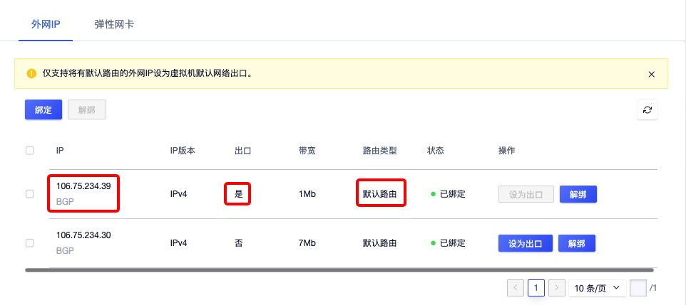
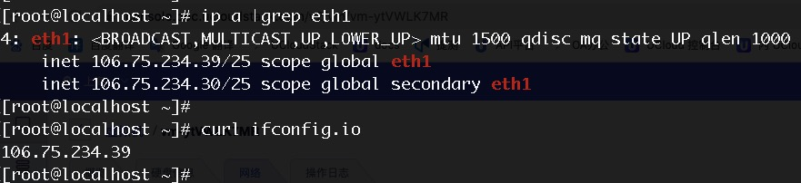

# 3 虚拟机

## 3.1 概述

虚拟机是 UCloudStack 云平台的核心服务，提供可随时扩展的计算能力服务，包括 CPU 、内存、操作系统等最基础的计算组件，并与网络、磁盘、安全等服务结合提供完整的计算环境。通过与负载均衡、数据库、缓存、对象存储等服务结合共同构建 IT 架构。

- UCloudStack 云平台通过 KVM ( Kernel-based Virtual Machine ) 将物理服务器计算资源虚拟化，为虚拟机提供计算资源；
- 一台虚拟机的计算资源只能位于一台物理服务器上，当物理服务器负载较高或故障时，自动迁移至其它健康的物理服务器；
- 虚拟机计算能力通过虚拟 CPU ( vCPU ) 和虚拟内存表示，存储能力通过云存储容量和性能体现；
- 虚拟机管理程序通过控制 vCPU、内存及磁盘的 QoS ，用于支持虚拟机资源隔离，保证多台虚拟机在同一台物理服务器上互不影响；

虚拟机是云平台用户部署并运行应用服务的基础环境，与物理计算机的使用方式相同，提供创建、关机、断电、开机、重置密码、重装系统、升降级等完全生命周期功能；支持 Linux、Windows 等不同的操作系统，并可通过 VNC 、SSH 等方式进行访问和管理，拥有虚拟机的完全控制权限。虚拟机运行涉及资源及关联关系如下：


如图所示，实例规格、镜像、VPC 网络是运行虚拟机必须指定的基础资源，即指定虚拟机的 CPU 内存、操作系统、虚拟网卡及 IP 信息。在虚拟机基础之上，可绑定云硬盘、弹性 IP 及安全组，为虚拟机提供数据盘、公网 IP 及网络防火墙，保证虚拟机应用程序的数据存储和网络安全。

在虚拟化计算能力方面，平台提供 GPU 设备透传能力，支持用户在平台上创建并运行 GPU 虚拟机，让虚拟机拥有高性能计算和图形处理能力。**支持透传的设备包括 NVIDIA 的 K80、P40、V100、2080、2080Ti、T4 及 华为 Atlas300** 等。

## 3.2 创建虚拟机

云平台用户可以通过指定机型、规格、镜像、云硬盘、VPC 网络、公网 IP、安全组及虚拟机相关基础信息一键创建多台虚拟机，用于部署自己的应用和服务。

### 3.2.1 前提条件

* 在创建虚拟机前，已拥有一个可登录云平台的账号，并已为账号充值金额；
* 在创建虚拟机前，需通过控制台左上角的【地域】选择需要创建并运行的虚拟机的数据中心；
* 确认用户所指定区域及账户的配额足够；若配额不足，需向云平台管理申请资源配额；
* 若不使用系统提供的默认安全组，需要在目标地域创建一个安全组并添加能满足用户业务需求的安全规则。

### 3.2.2 创建操作

1. 选择虚拟资源需运行的地域（数据中心）后，在左侧导航栏选择虚拟机，进入虚拟机控制台，点击“创建虚拟机” ，弹出虚拟机创建向导；

   

2. 选择虚拟机的机型，并确定虚拟机运行的操作系统镜像；

   * 机型是运行虚拟机的宿主机的集群类型，代表不同架构、不同型号的 CPU 或硬件特征，可由管理员自定义，如 x86 机型、GPU 机型、ARM 机型等，通过 ARM 机型创建的实例为 ARM 版虚拟机实例，已适配国产芯片、服务器及操作系统，并可运行国产化操作系统，如 UOS 或 银河麒麟。
   * 镜像即虚拟机实例运行环境的模板，可以选择基础镜像和自制镜像；
     * 基础镜像是由平台官方默认提供，包括多发行版 Centos 、Ubuntu 及 Windows 等原生操作系统，同时基础镜像的默认时区为上海。
     * 自制镜像由用户通过虚拟机自行导出或自定义导入的自有镜像，可用于创建虚拟机，仅账号自身有权限查看和管理。
   
3. 选择虚拟机的规格配置，即定义提供计算能力的 CPU 内存及 GPU 配置，规格可由平台管理员进行自定义；

   * CPU 机型默认提供 1 核 2G 、2 核 4G 、4 核 8G 、8 核 16G 、16 核 32G 及 64 核 128G 等虚机规格；
   * 平台提供 GPU 设备透传能力，若机型为 GPU 机型，可创建并运行拥有 GPU 能力的虚拟机；
   * 针对 GPU 机型，平台支持最高配置 4 颗 GPU 芯片，为使 GPU 虚拟机发挥最佳性能，平台限制最小 CPU内存规格为 GPU 颗数的 4 倍以上，如 1 颗 GPU 芯片最小需要 4 核 8G 规格，2 颗 GPU 芯片最小需要 8 核16G 规格，4 颗 GPU 芯片最小需要 16 核 32G 规格。

4. 选择并配置虚拟机的系统盘和数据盘，可分别配置系统盘和云硬盘的容量。

  * 系统盘：运行虚拟机镜像的系统盘，创建虚拟机时必须选择系统盘类型及系统盘容量；
      * 选择系统盘的磁盘类型，如 SSD 磁盘 或 HDD 磁盘，磁盘类型可由管理员进行自定义；
      * 配置系统盘容量，Linux 和 Windows 镜像默认系统盘均为 40GB ，支持扩容系统盘容量至 500GB 。

  > 扩容系统盘是增加块设备的容量，并未对系统内的文件系统进行扩容，即系统盘扩容后需进入虚拟机内部进行文件系统的扩容(resize)操作，具体操作步骤详见：[系统盘扩容](#_317-系统盘扩容) 。

  * 数据盘：一种基于分布式存储系统为虚拟机提供持久化存储空间的弹性块设备，创建虚拟机支持同时创建一块云盘并自动绑定至虚拟机，同时会对硬盘进行自动格式化及挂载操作。
      * 默认数据盘挂载路径为 `/data` ，用户也可选择虚拟机创建后再添加数据云硬盘；
      * 选择并配置数据盘类型及容量，容量范围的规格可由管理员进行自定义；
      * 平台默认规格最小支持 10GB 容量，最大支持 8000GB，步长为 10GB ，即容量应为 10GB 的倍数。

5. 配置网络相关设置，包括虚拟机需要加入的 VPC 网络、子网、内网 IP 地址、内网安全组、外网 IP 及外网安全组等选项：

  

  * VPC 网络是一个属于用户的、逻辑隔离的二层网络广播域环境。在一个 VPC 网络内，用户可以构建并管理多个三层网络，即子网（ Subnet ），VPC 私有网络是子网的容器，不同 VPC 间网络绝对隔离；
      * 创建虚拟机时必须选择 VPC 网络和所属子网，即选择虚拟要加入的网络及 IP 网段；
      * 控制台已为用户计算所选子网的可用 IP 数量，创建时需指定可用 IP 数量足够的子网；
      * 平台默认会从所属子网的网段中为虚拟机自动分配 IP 地址，可通过【内网 IP 】选项手动指定虚拟机的 IP 地址。
  * 安全组是平台提供的虚拟防火墙，提供出入双方向流量访问控制规则，定义哪些网络或协议能访问资源；
      * 外网安全组用于控制虚拟机南北向（外网 IP）的流量，内网安全组用于虚拟机东西向（网卡间）的安全访问控制；
      * 外网安全组和内网安全组默认为暂不绑定，可在创建虚拟机后再进行绑定；
      * 系统提供默认安全组，若无法满足需求，可自行创建安全组并绑定至虚拟机。
  * 外网 IP 为虚拟机提供的弹性外网出口服务，支持创建虚拟机时申请并绑定一个外网 IP 至虚拟机。平台支持 IPv4/IPv6  双栈网络，可在虚拟机创建成功后为虚拟机绑定多个外网 IP 地址，最多支持绑定 50 个 IPv4 和 10 个 IPv6 外网 IP 地址，并支持手动设置虚拟机默认出口。

  > 平台支持在虚拟机中查看已绑定的外网 IP 地址及网络路由，虚拟机访问外网的流量直接通过虚拟网卡透传至物理网卡与外部网络通信，提升网络传输的性能。

6. 选择并配置虚拟机基础管理配置，包括虚拟机名称、登录方式及登录密码等。


  * 虚拟机名称：平台默认配置名称为 `host` ，用户可自定义虚拟机名称，可通过名称进行搜索和筛选；
  * 登录方式：为虚拟机设置登录凭证，即登录虚拟机的密码；
      * CentOS 的管理员为 `root` ，Ubuntu 的管理员为 `ubuntu` ，Windows 系统的管理员名称为  `administrator` ；
      * Linux 操作系统可在虚拟机创建成功后，通过 SSH 密钥的方式进行登录及管理。

9. 选择购买数量和付费方式，如下图所示确认订单并点击“立即购买” 进行虚拟机创建操作。


  * 购买数量：按照所选配置及参数批量创建多台虚拟机，最多可批量创建 10 台虚拟机，批量创建时不支持手动设置虚拟机的 IP 地址；
  * 付费方式：选择虚拟机的计费方式，支持按时、按年、按月三种方式，可根据需求选择适合的付费方式；
  * 合计费用：用户选择虚拟机 CPU、内存、数据盘、外网 IP 等资源按照付费方式的费用展示；
  * 立即购买：点击立即购买后，会返回虚拟机资源列表页，在列表页可查看该台主机的创建过程，通常会先显示“启动中”的状态，在1~2分钟内即可创建完成。

## 3.3 查看虚拟机

通过导航栏进入虚拟机控制台，可查看虚拟机资源的列表，通过列表上的虚拟机名称，可进入虚拟机详情，查看虚拟机及相关资源的详细信息。

### 3.3.1 虚拟机列表

虚拟机列表页可查看当前账户下已有的虚拟机资源列表，包括名称/备注、资源 ID、VPC、子网、机型、配置、 IP、计费方式、创建时间、过期时间、状态及操作等，同时也可通过“自定义列表”按钮，自定义列表所需信息。


* 主机名称：虚拟机的名称和备注，可通过列表页的编辑按钮进行修改；
* 资源 ID：虚拟机的全局唯一 ID，可通过复制按钮对 ID 进行复制操作；
* VPC/子网：虚拟机创建时所指定的 VPC 网络和子网，即虚拟机 IP 所在的 VPC 网络和子网信息；
* IP 地址：虚拟机的 IP 地址，包括内网 IP 和外网 IP (若有)，并可通过复制按钮对 IP 地址进行复制操作；
* 机型：虚拟机所运行物理机的集群类型，代表不同架构、不同型号的 CPU 或硬件特征；
* 配置：虚拟机基本配置信息，包括 CPU 内存规格、GPU 颗数、系统盘镜像、系统盘总容量及数据盘总容量；
* 计费方式：虚拟机创建时指定的付费方式，包括按时、按月、按年；
* 创建时间/过期时间：虚拟机的创建时间和计费周期内的过期时间；
* 状态：虚拟机当前的运行状态，包括启动中、运行、关机中、关机、启动中、修改配置中、重装中、删除中及迁移中和宕机迁移中等；
* 操作：对单台虚拟机的更多操作，包括详情、登录、启动、关机、删除、断电、重启、续费、修改告警模板、制作镜像、重置密码、重装系统、热升级、绑定外网 IP、修改外网安全组、修改内网安全组、修改配置及获取 VNC 信息等。

默认列表每页可显示 10 条虚拟机信息，支持分页并设置每页可展示的虚拟机数量，每页最多可展示 100 条虚拟机数据，可通过搜索框对虚拟机列表进行搜索和筛选，支持模糊搜索。

为方便租户对虚拟机进行维护和操作，平台支持下载当前用户所拥有的所有虚拟机资源列表信息为 Excel  表格；同时支持对虚拟机的批量操作，包括批量启动、关机、断电及删除操作，可通过选中多个虚拟机，点击批量操作按钮进行批量操作，如下图所示：


### 3.3.2 虚拟机详情信息

在虚拟机列表上，点击虚拟机的名称或 ID 可进入当前虚拟机的概览页面查看虚拟机详情及监控信息，同时可切换到硬盘、网络及操作日志页面查看虚拟机的相关磁盘、网络、IP 地址、弹性网卡及操作日志信息，如下图概览页所示：


#### 3.3.2.1 虚拟机概览

**概览页面展示基本信息、配置信息及监控图表等信息，同时可通过概览页对虚拟机进行操作及管理。**

* 基本信息包括资源 ID、名称、内网 IP、VPC、子网、状态、创建时间及告警模板；
  * 可点击名称右侧按钮修改虚拟机的名称和备注信息；
  * 可点击告警模板右侧按钮修改虚拟机所关联的告警模板，虚拟机默认会绑定 Default 告警模板；
* 配置信息包括机型、镜像、CPU、内存、系统盘总容量和系统盘总容量，其中数据盘容量为当前虚拟机所关联所有云硬盘的容量之和；
* 监控图表：包括 CPU 使用率、内存使用率、空间使用率、网卡的出/入带宽、网卡的出/入包量、磁盘的读/写吞吐、磁盘的读/写次数、平均负载、 TCP 连接数和阻塞进程数量。

> 用户可开启监控图表右上角的【自动刷新】，使页面每隔 30 秒自动刷新，以获取最新监控图表数据。

#### 3.3.2.2 虚拟机硬盘

**磁盘页面展示当前虚拟机的系统盘及已挂载的数据盘信息，包括每个硬盘的名称、ID、集群架构、集群、硬盘类型、硬盘容量、挂载点、计费方式、状态、创建时间、过期时间及对单个硬盘的快照操作信息。如下图所示：**


* 集群架构是指虚拟机系统盘或数据盘所属物理机所在的集群架构，包括 HDD、SSD、NVME 等，代表集群的磁盘介质类型；
* 集群指虚拟机系统盘或数据盘所属物理机所在的集群，可由管理员自定义，如容量型或性能型等；
* 硬盘类型包括系统盘和数据盘，除系统盘外，额外绑定的云硬盘均为数据盘；
* 硬盘容量为每块硬盘的当前容量大小；
* 挂载点为硬盘在虚拟机中真实的挂载盘符，如 `vdb` ；
* 仅数据盘支持计费方式和过期时间信息，系统盘与虚拟机的生命周期一致。

在虚拟机硬盘管理列表的操作项中，支持对虚拟机的系统盘和数据盘进行扩容、续费及快照操作，其中续费仅支持数据盘，系统盘与虚拟机生命周期一致。

##### 3.3.2.2.1 硬盘快照

支持对系统盘和数据盘分别进行快照操作，快照仅捕获已写入硬盘的数据，不包含应用程序或操作系统缓存在内存中的数据，为确保快照中捕获所有应用程序的数据，建议将虚拟机关机或卸载数据盘后再进行快照。具体操作如下图所示：


##### 3.3.2.2.2 硬盘扩容

支持对系统盘和数据盘分别进行扩容操作，扩容云硬盘是增加块设备的容量，并未对系统内的文件系统进行扩容，即系统盘和数据盘扩容后需进入虚拟机内部进行文件系统的扩容(resize)操作，系统盘具体操作步骤详见：[系统盘扩容](#_317-系统盘扩容) 。


扩容会按照新容量进行收费，按小时付费的硬盘，升级容量下个付费周期按新配置扣费；按年按月付费的硬盘，升级容量即时生效，并按比例自动补差价。

##### 3.3.2.2.3 数据盘续费

支持在虚拟机中对已挂载至虚拟机的数据盘直接进行续费操作，续费时会按照续费时长收取费用，如下图所示：


云盘续费的时长与资源的计费方式相匹配，当数据盘的计费方式为【小时】，则续费时长可选择 1 至 24 小时；当数据盘的计费方式为【按月】，则续费时长可选择 1 至 11 月；当数据盘的计费方式为【按年】，则数据盘的续费时长为 1 至 5 年。

#### 3.3.2.3 虚拟机网络

**网络页面展示当前虚拟机的基本网络信息，同时可管理虚拟机的外网 IP 及弹性网卡资源 。**其中基本网络信息包括当前虚拟机的属 VPC、所属子网、内网 IP、外网安全组及内网安全组信息，并可通过安全组右侧的按钮更新虚拟机的外网安全组和内网安全组。如下图所示：


有关虚拟机的外网 IP 和弹性网卡资源详情及管理详见：[外网 IP 管理](#_3324-外网-IP-管理)和[弹性网卡管理](#_3325-弹性网卡管理)。

#### 3.3.2.4 外网 IP 管理

平台支持 IPv4/IPv6  双栈网络，每个虚拟机最多支持绑定 50 个 IPv4 和 10 个 IPv6 外网 IP 地址，默认以第一个有默认路由的 IP 地址（包括外网弹性网卡的 IP 地址）作为虚拟机的默认网络出口；同时在虚拟机中查看已绑定的外网 IP 地址及网络路由，虚拟机访问外网的流量直接通过虚拟网卡透传至物理网卡与外部网络通信，提升网络传输的性能。

外网 IP 信息包括虚拟机及绑定的外网弹性网卡 IP ，仅支持将有默认路由的外网 IP 设为虚拟机默认网络出口。可通过列表信息查看已绑定外网 IP 的详细信息及相关管理操作，如图所示已绑定外网 IP 信息包括 IP 地址、IP 版本、出口、带宽、路由类型、绑定时间及状态。

* IP 指当前已绑定外网 IP 的 IP 地址及网段名称（网段是由平台管理员自定义的外网 IP 地址池）；
* IP 版本是指当前已绑定外网 IP 的 IP 版本，包括 IPv4 和 IPv6 ；
* 出口指当前 IP 是否为虚拟机的默认出口，一台虚拟机最多支持两个默认出口（IPv4 和 IPv6 各一个）；
* 带宽指当前 IP 地址的带宽上限，带宽上限由申请外网 IP 地址时指定；
* 路由类型指当前 IP 地址所属网段下发路由的类型（网段路由策略由平台管理员自定义），包括默认路由和非默认路由，仅支持将有默认路由的外网 IP 设为虚拟机默认网络出口。
  * 默认路由类型指虚拟机绑定该 IP 地址时，会自动下发目标地址为 `0.0.0.0/0`  的路由到虚拟机中；
  * 非默认路由指虚拟机绑定该 IP 地址时，会下发管理员为网段配置的指定目标地址路由，如为虚拟机下发目标地址为 `10.0.0.0/24` 的路由；
  * 若绑定至虚拟机的多个外网 IP 地址均为默认路由类型，默认以第一个有默认路由的 IP 地址作为虚拟机的默认出口。

用户可通过外网 IP 管理控制台的操作项，进行外网 IP 地址的绑定、解绑及设为默认出口操作，并支持批量解绑。

> 绑定至虚拟机的外网弹性网卡的 IP 地址同时会展示至外网 IP 列表，支持设为出口操作但不支持解绑，可通过解绑弹性网卡进行弹性网卡外网 IP 的解绑和释放。

##### 3.3.2.4.1 绑定外网 IP

最多支持绑定  50 个 IPv4 和 10 个 IPv6 外网 IP 地址，默认以第一个有默认路由的 IP 地址作为虚拟机的默认网络出口。


绑定成功后，可在虚拟机中查看已绑定的 IP 地址已配置在虚拟机的第二块网卡上，本章节以 `Centos` 操作系统为例，如下图所示：


##### 3.3.2.4.2 解绑外网 IP

支持虚拟机解绑外网 IP 地址，若解绑了默认出口外网IP，则自动选择下一个有默认路由的外网 IP 作为虚拟机的默认网络出口。


绑定至虚拟机的外网弹性网卡 IP 不支持解绑操作，如需解绑弹性网卡的 IP 地址，可直接解绑弹性网卡。

##### 3.3.2.4.3 设为默认出口

支持用户手动将一个已绑定的外网 IP 设置为虚拟机的默认网络出口，仅支持将有默认路由的外网 IP 设为虚拟机默认网络出口。用户可通过虚拟机外网 IP 管理控制台，为虚拟机绑定的 IPv4 和 IPv6 外网 IP 分别设置默认网络出口。如下图所示：


设为出口后，可登录虚拟机验证虚拟机访问外网的 IP 地址是否为设置的外网 IP 地址，本节以 Centos 7.4 系统设置 IPv4 默认出口为 `106.75.234.39` 为例，如下图所示，已绑定外网 IP 地址列表已将新 IP 地址设置为出口：



登录 Centos 虚拟机，输入 `curl ifconfig.io` 查看虚拟机访问外网的出口已更换为 `106.75.234.39`，如下图输出结果所示：



> 外网 IP 地址池资源由管理员自定义，支持使用私有 IP 地址段模拟公网 IP 地址，并在上层物理网络设备上做 NAT 转换访问互联网或 IDC 数据中心网络。

#### 3.3.2.5 弹性网卡管理

x86 架构虚拟机最多支持绑定 6 块弹性网卡，ARM 架构虚拟机最多支持绑定 3 块网卡，用于精细化网络管理或高可用业务等应用场景。虚拟机中可查看已绑定的弹性网卡及关联的 IP 地址等信息，在 `Linux` 操作系统中通常会以 `eth2` 开始命名。


如上图所示，弹性网卡标签页可查看当前虚拟机已绑定的弹性网卡列表信息及解绑操作，支持批量解绑操作。已绑定的弹性网卡信息包括名称、ID、网卡类型、所属网络、IP 地址、安全组及状态信息。

* 网卡类型：指当前绑定至虚拟机的弹性网卡类型，包括内网网卡和外网网卡。
  * 内网类型的弹性网卡仅可从关联的 VPC 子网中自动或手动分配 IP 地址。
  * 外网类型的弹性网卡仅可从关联的外网网段中自动或手动分配 IP 地址，且分配的 IP 地址与弹性网卡生命周期一致，仅支持随弹性网卡销毁而释放。
* 所属网络：弹性网卡的 IP 地址所属网络，内网类型的所属网络为弹性网卡所在的 VPC 网络和子网信息；外网类型的所属网络为弹性网卡所属外网网段信息。

* IP 地址：指当前弹性网卡的 IP 地址，内网类型的网卡 IP 为 VPC 子网分配的内网 IP 地址，外网类型的网卡 IP 为所属外网网段分配的外网 IP 地址。
* 安全组：指当前弹性网卡已绑定的安全组，若未绑定安全组，则为空。平台安全组为作用于网卡，即每块弹性网卡均可指定属于自己的安全组，分别对所关联的网卡进行流量控制。

支持在虚拟机详情中，将已绑定的弹性网卡进行解绑，解绑后可将弹性网卡绑定至其它虚拟机，通过已绑定弹性网卡列表操作项中的解绑操作可对网卡进行解绑，具体操作如下：


#### 3.3.2.6 虚拟机操作日志

虚拟机操作日志页面展示当前虚拟机的操作日志。可提供自定义时间级别的日志展示，同时可对日志进行模糊搜索，默认提供两周内的操作日志，可通过切换日期周期查看不同时间周期的操作日志。


如上图所示，操作日志内容包括操作名称、资源 ID、操作者、失败原因、备注、操作状态及操作时间。

## 3.4 VNC 登录

VNC（ Virtual Network Console ）是 UCloudStack 为用户提供的一种通过 WEB 浏览器连接虚拟机的登录方式，适应于无法通过远程登录客户端（如 SecureCRT、远程桌面等）连接虚拟机的场景。通过 VNC 登录连到虚拟机，可以查看虚拟机完整启动流程，并可以像 SSH 及 远程桌面一样管理虚拟机操作系统及界面，支持发送操作管理指令，如  `CTRL+ALT+DELETE` 。

用户可通过虚拟机列表或详情概览页面操作中的“**登录**”按钮，使用 VNC 链接登录当前虚拟机，提供如同显示器的功能，可登入虚拟机操作系统，对虚拟机进行系统级别的操作和管理。如下图所示：


> 登录虚拟机的前提条件是拥有操作系统账号和密码，VNC 登录适合虚拟机没有外网 IP 地址的场景。

## 3.5 启动/关机/断电/重启

用户可以对虚拟机进行关机、启动、断电及重启等基本操作，且均支持多台 API 批量操作。如下图所示：


* 关机
  * 用户可使用系统命令进行关机，如 Windows 系统下的关机和 Linux 系统下的 shudown 命令；
  * 支持用户通过控制台点击【关机】进行关机操作，关机时虚拟机的状态必须为运行状态；
  * 虚拟机关机时，状态会从运行转换为关机中，最后转换为已关机，代表关机成功；
  * 若虚拟机卡在关机中，支持对虚拟机进行断电操作；
  * 关机后，虚拟机的内存信息丢失，所有磁盘的数据将被保留；
  * 关机后可进行启动、删除、制作镜像、重装系统、修改配置、绑定外网 IP及修改安全组等操作。
* 启动
  * 用户可通过控制台点击【启动】按钮开启虚拟机，仅在虚拟机状态为已关机时可用；
  * 虚拟机开启时，状态会从已关机转换为启动中，最后转换为运行，代表启动成功；
  * 若虚拟机卡在启动中，支持对虚拟机进行断电操作；
  * 运行的虚拟机可执行关闭、登录、删除、断电、重启、重置密码、热升级、绑定外网 IP 、修改安全组及修改告警模板等操作。
* 断电
  * 断电是将虚拟机强行关机，与物理机直接断电操作相同，断电操作可能导致丢失数据甚至损坏操作系统；
  * 断电操作适用于虚拟机死机及极端测试的场景，可通过虚拟机列表操作中的“断电”按钮，对虚拟机进行强行关机操作；
  * 强行关机时，虚拟机直接会进入关机状态，可再次进行启动操作。
* 重启
  * 重启是将虚拟机的操作系统进行正常的重新启动，与物理机操作系统重启操作一致；
  * 虚拟机重启时，状态会从运行转换为重启中，最后转换为运行；
  * 若虚拟机卡在重启中，支持对虚拟机进行断电操作；
  * 重启后，虚拟机的内存信息丢失，所有磁盘的数据将被保留。

## 3.6 制作镜像

自制镜像由云平台账户通过虚拟机自行导出，可用于创建虚拟机，仅账户自身有权限查看和管理，仅支持**虚拟机关机状态下制作镜像**，即在关机状态才可进行虚拟机导出为镜像操作。

用户可通过点击虚拟机列表操作中的“制作镜像” 按钮进行镜像制作，需输入镜像名称及镜像描述，如下图所示：


* 镜像名称：自制镜像的名称和标识；
* 镜像描述：自制镜像的描述和备注信息，可选项；

制作镜像过程中，请勿对虚拟机进行停止、启动、断电、重装系统或修改配置等操作，以免影响镜像制作过程。镜像制作成功后，会展示在虚拟机控制台——镜像管理页面，可通过页面查看镜像的制作过程，待镜像状态转换为可用时，即可使用自制镜像创建虚拟机。

> 通过虚拟机制作镜像时，仅导出系统盘的数据和信息，不支持数据盘。

## 3.7 重装系统

重装系统是重置虚拟机的操作系统，即更换虚拟机镜像，Linux 虚拟机仅支持更换 Centos 和 Ubuntu 操作系统，Windows 虚拟机仅支持更换 Windows 其它版本的操作系统，重装系统的前提是虚拟机必须为关机状态。

虚拟机关机后，通过虚拟机控制台操作中的“重装系统”按钮更换虚拟机的镜像，如下图所示：


重装系统将会自动清除虚拟机已创建的系统盘快照，可通过制作镜像对虚拟机系统盘数据进行备份。在重装系统过程中，虚拟机的状态自动转换为“重装中”，重装成功后转换为“关机”，可以通过启动操作开启虚拟机，虚拟机启动时，会使用新的镜像运行虚拟机。

> 注：重装系统后，虚拟机之前操作系统及数据内容将被清空，挂载的云硬盘及快照不受影响。

## 3.8 重置密码

重置密码是指在线修改虚拟机操作系统的登录密码，适应于忘记登录密码或想通过控制台快速修改密码的场景。

Linux 操作系统是修改 `root` 账号的密码，Windows 操作系统是修改 `administrator` 账号的密码。重置密码时虚拟机必须运行状态。用户通过点击虚拟机控制台操作中的“重置密码”按钮进行密码的重置，如下图所示：


* 虚拟机名称：当前需要修改密码的虚拟机名称和标识；
* 管理员密码/确认密码：需要修改的新密码；
* 若用户主动修改了虚拟机操作系统的管理员账号，则无法进行密码重置；

> 请勿在制作镜像过程中重置密码，用户也可以通过登录操作系统，使用操作系统命令或界面进行密码修改。

## 3.9 修改配置（升降级）

修改配置即更改虚拟机的 CPU  和内存规格，支持升级和降级，适应于业务发生变化需调整虚拟机配置的场景。

修改配置前需将虚拟机进行关机，即必须在关机状态下进行配置修改操作，配置变更后，需重新启动才可生效。用户可点击虚拟机控制台资源列表操作中的“修改配置” 进行虚拟机 CPU 内存的调整，如下图所示：


虚拟机降级配置，下个付费周期按新配置扣费。按小时付费的虚拟机，升级配置下个付费周期按新配置扣费；按年按月付费的虚拟机，升级配置即时生效，并按比例自动补差价。

* 虚拟机 ID 和名称：当前需要变更规格配置的虚拟机名称和全局唯一 ID 标识；
* 计费方式：当前虚拟机的付费方式；
* 目前规格：当前虚拟机变更前的 CPU 内存配置；
* 更改规格：当前虚拟机需要变更的新规格配置，支持升级或降级配置；
* 预计收费：变更配置后，系统预计需要扣除的费用；

点击确定后，虚拟机依然处于关机状态，下次启动时，会使用新变更的配置运行虚拟机。用户可在虚拟机开机后，登录操作系统查看变更后的配置。

> 修改配置仅对 CPU 内存生效，若虚拟机附带 GPU 能力，不支持对 GPU 颗数进行升降配。

## 3.10 热升级

虚拟机提供热升级能力，支持虚拟机开机状态下升级 CPU 和内存。使用热升级前，需先熟悉以下基本概念：

* 修改配置： 即在虚拟机关机状态下，升级或者降级虚拟机的CPU 和内存规格；
* 热升级： 即在虚拟机开机（running ）状态下，支持升级虚拟机的CPU、内存；
* Base镜像：即基础镜像，用户可以通过Base镜像启动一台虚拟机，并基于该虚拟机制作一个自定义镜像。

> 注：目前仅支持 Base 镜像为 Centos7.4 的虚拟机热升级，不支持在线降级操作。

平台支持热升级的虚拟机，在列表上会自动显示支持热升级，如下图所示：


（1）当用户看到热升级提示后，可通过列表操作项中的 “**热升级**” 对该虚拟机进行在线配置调整，如下图：


（2）在热升级的向导中，可以对虚拟机的 CPU 内存规格进行热升级操作，热升级后立即生效，按小时购买的虚拟机下个付费周期按新配置扣费，按年按月购买的虚拟机按比例自动补差价，如下图所示：


> 若用户自定义镜像，其 Base 镜像是基于 Centos7.4 制作的，则默认允许热升级操作。

## 3.11 修改告警模板

修改告警模板是对虚拟机的监控数据进行告警的配置，通过告警模板定义的指标及阈值，可在虚拟机相关指标故障及超过指标阈值时，触发告警，通知相关人员进行故障处理，保证虚拟机及业务的正常运行。

用户可点击虚拟机详情概览页中告警模板右侧的按钮进行告警模板修改操作，在修改告警模板向导中选择新虚拟机告警模板，点击确定立即生效。


* 资源 ID ：当前需要添加或修改告警模板的虚拟机 ID ；
* 资源类型：当前需要添加或修改告警模板的资源类型；
* 告警模板：需要变更的告警模板，一台虚拟机仅支持关联一个告警模板。

> 若系统提供的默认告警模板无法满足需求时，可前往“告警模板”页面进行添加和配置。

## 3.12 绑定外网 IP

绑定外网 IP 指将租户外网 IP 地址绑定至虚拟机，为虚拟机提供外部网络出口。平台支持 IPv4/IPv6  双栈网络，每个虚拟机最多支持绑定 50 个 IPv4 和 10 个 IPv6 外网 IP 地址，同时也可将外网弹性网卡绑定至虚拟机提供外网通信能力，默认以第一个有默认路由的 IP 地址作为虚拟机的默认网络出口。

绑定外网 IP 地址后，平台会将指定的外网 IP 地址配置至虚拟机的网卡，包括外网 IP 地址所属网段的网关、子网掩码及路由相关信息，用户可在虚拟机中查看已绑定的外网 IP 地址及网络路由，虚拟机访问外网的流量直接通过虚拟网卡透传至物理网卡与外部网络通信，提升网络传输的性能。

每台虚拟机创建时会自带两张默认网卡，分别为内网网卡和外网网卡，以 Linux 操作系统为例，内网网卡一般为为 `eth0` ，外网网卡一般为 `eth1` ，默认绑定的外网 IP 均会被配置在虚拟机的 `eth1`  ，即 50 个外网 IP 均会被绑定至外网网卡，并共用虚拟机的外网安全组；在虚拟机绑定外网弹性网卡时，会在虚拟机中直接增加一张弹性网卡，并自动配置外网弹性网卡配置 IP  地址及安全组策略。


虚拟机必须处于运行或关机状态才可进行外网 IP 绑定，可通过虚拟机管理控制台列表或虚拟机详情网络管理的操作项“绑定外网 IP” 按钮，进行外网 IP 绑定操作，具体操作步骤可参考[虚拟机外网 IP 管理](#_3324-外网-IP-管理) 。绑定操作需指定要绑定的外网 IP 地址，仅支持绑定 50 个 IPv4 和 10 个 IPv6 外网 IP 地址。

* 若虚拟机已绑定 50 个 IPv4 外网 IP 地址，则不可再次绑定 IPv4 外网 IP 地址；
* 若虚拟机已绑定 10 个 IPv6 外网 IP 地址，则不可再次绑定 IPv6 外网 IP 地址；
* 若虚拟机已同时绑定 50 个 IPv4  和 10 个 IPv6 外网 IP 地址，则无法再绑定外网  IP 地址，可继续增加外网弹性网卡。

外网 IP 地址绑定成功后，可通过虚拟机列表 IP 信息查看已绑定的外网 IP 地址，用户也可通过虚拟机详情网络管理的外网 IP 标签页查看已绑定外网 IP 地址的详情信息，并可进行设为默认出口及解绑等相关操作。


> 仅支持绑定同一数据中心的外网 IP 地址，被绑定的外网 IP 必须处于未绑定状态。如需解绑虚拟机的外网 IP 地址，详参考：[虚拟机外网 IP 管理](#_3324-外网-IP-管理)  。

## 3.13 修改安全组

平台用户创建的虚拟机，默认会自带两个与虚拟机生命周期一致的虚拟网卡，即内网网卡和外网网卡，同时也可在虚拟机上绑定弹性网卡资源。

* 内网网卡：配置虚拟机创建时指定 VPC/子网的 IP 地址及相关网络信息；
* 外网网卡：配置绑定至虚拟机的所有外网 IP 地址，包括 50 个 IPv4 和 10 个 IPv6 地址；
* 弹性网卡：配置弹性网卡所属网络所分配的 IP 地址及安全组，若弹性网卡为内网类型则所属网络为 VPC 和子网，若弹性网卡为外网类型则所属网络为外网网段。

云平台安全组（软件定义的虚拟防火墙）为网卡级别，即绑定的安全组会对虚拟机中网卡流量做出入限制。平台将绑定至虚拟机内网网卡的安全组定义为内网安全组；绑定至虚拟机外网网卡安全组定义为外网安全组；绑定至弹性网卡的安全组为弹性网卡的所属安全组。

**内网安全组用于虚拟机东西向（网卡间）的安全访问控制；外网安全组用于控制虚拟机南北向（外网 IP）的流量。**在创建虚拟机时可进行内网安全组和外网安全组的指定，同时在虚拟机运行后也可修改内网安全组和外网安全组。

### 3.13.1 修改外网安全组

修改外网安全组是指修改虚拟机外网网卡所关联的安全组，即更改绑定至外网网卡上所有外网 IP 地址的安全组。

用户可通过虚拟机列表及虚拟机详请网络页面的“修改外网安全组”按钮进行操作，如下图所示：


选择需修改的的外网安全组，一台虚拟机仅支持绑定一个外网安全组。修改成功后，用户可通过虚拟机详情的网络信息查看已修改的外网安全组信息。

> 外网安全组规则的访问限制作用于当前虚拟机所绑定的所有外网 IP 。

### 3.13.2 修改内网安全组

修改内网安全组是指修改虚拟机内网网卡所关联的安全组，即更改虚拟机内网的安全策略，用于虚拟机与虚拟机间的流量管控。用户可通过虚拟机列表及虚拟机详请网络页面的“修改内网安全组”按钮进行操作，如下图所示：


选择需要修改的内网安全组，支持修改为 “暂不绑定” 用于解绑内网安全组，一台虚拟机仅支持绑定一个内网安全组。修改成功后，用户可通过虚拟机详情的网络信息查看已修改的内网安全组信息。

> 内网安全组和外网安全组支持绑定同一个安全组，即内外网安全组使用相同的安全组及策略。

## 3.14 修改名称和备注

修改虚拟机的名称和备注，在任何状态下均可进行操作。点击虚拟机列表页面虚拟机名称右侧的按钮即可进行修改，如下图所示：


## 3.15 虚拟机续费

支持用户手动对虚拟机进行续费，续费操作只针对资源本身，不对资源额外关联的资源进行续费，如外网 IP、云硬盘、外网弹性网卡等。额外关联的资源到期后，会自动解绑，为保证业务正常使用，需及时对相关资源进行续费操作，如下图所示：


虚拟机续费时会按照续费时长收取费用，续费时长与资源的计费方式相匹配，当虚拟机的计费方式为【小时】，则续费时长可选择 1 至 24 小时；当虚拟机的计费方式为【按月】，则续费时长可选择 1 至 11 月；当虚拟机的计费方式为【按年】，则虚拟机的续费时长为 1 至 5 年。

## 3.16 获取 VNC 登录信息

支持用户获取虚拟机的 VNC 登录信息，适用于使用 VNC 客户端连接虚拟机的场景。如桌面云场景中，桌面云服务商的桌面终端通常会以 VNC、Spice 及 RDP 等协议连接平台提供的桌面虚拟机，其中 VNC 和 Spice 协议基本作为桌面服务商的通用协议。

用户可通过 API 接口或虚拟机控制台操作项中的【获取 VNC 信息】查看虚拟机的 VNC 登录信息，包括虚拟机 ID、VNCIP 地址、VNC 端口及 VNC 客户端登录密码，如下图所示：


* VNCIP 地址：当前云平台外网 IP 地址池中分配的地址，可访问外网 IP 地址的网络均可使用 VNCIP:端口和密码通过 VNC 客户端连接虚拟机，如 VNCView 客户端软件。
* VNC  端口：VNC 登录时使用的端口，为保证安全平台会在每次获取 VNC 信息时更换一个未被使用的端口。
* VNC 密码：VNC 登录时使用的密码，每一次查看均会根据算法随机提供新的  VNC 登录密码，为保证虚拟机 VNC 登录安全性（场景举例：用户首次使用 VNC 登录虚拟机后，通过虚拟机操作系统的登录密码进入到桌面或命令行，则下一次登录 VNC 会自动进入至桌面和命令行，对用户的虚拟机带来不可避免的安全隐患。）

为确保 VNC 连接的安全性，每一次调用 API 或通过界面所获取的 VNC 登录信息有效期为 300 秒，如果 300 秒内用户未使用 IP 和端口进行连接，则信息直接失效，需要重新获取新的登录信息；同时用户使用 VNC 客户端登录虚拟机后，300 秒内无任何操作将会自动断开连接。

> 用户在使用云平台时，至少会提供的一段可访问到云平台的外网 IP 网段，VNC IP 地址即为该网段中分配的 IP 地址，以确保网络可达。

用户可在网络可达平台的环境中，使用诸如 VNCView 客户端登录平台虚拟机，如下图所示：


## 3.17 删除虚拟机

平台用户可在控制台删除账户内已关机或正在运行的虚拟机资源，支持批量删除。虚拟机被删除后自动进入“**回收站**”，可通过回收站进行还原或彻底销毁。可通过虚拟机列表操作项中的“删除”进行操作，如下图所示：


* 删除虚拟机时会自动解绑虚拟机已绑定的外网 IP、弹性网卡、云硬盘等资源；
* 若虚拟机已添加至 NAT 网关白名单或负载均衡的服务节点中，删除虚拟机时会自动进行解绑操作；

- 支持用户在删除虚拟机时选择删除已绑定的资源，即自动解绑并删除已绑定的外网 IP、弹性网卡及云硬盘；
- 删除虚拟机时同时删除的外网 IP 和云硬盘将自动进入回收站，同时删除的弹性网卡将被彻底销毁；
- 若虚拟机过期，在允许时间内未续费成功，则虚拟机会被自动回收，关联的资源将自动解绑。

虚拟机删除后，随虚拟机创建的 2 个默认网卡、系统盘及系统盘数据将随虚拟机一起进入回收站，可进入回收站对虚拟机进行销毁或恢复操作。

> 随虚拟机同时进入回收站的外网 IP 及云硬盘在恢复时，不会保持原有绑定关系，需重新进行资源绑定操作。

## 3.18 远程登录

远程登录是指通过远程管理客户端软件通过网络远程登录并管理虚拟机，针对 Linux 和 Windows 的虚拟机分别提供不同的方式进行远程登录。远程登录的前提条件为虚拟机必须绑定外网 IP 地址，并可通过外网正常访问服务器的远程登录端口（ Linux SSH 为 22 、Windows 远程桌面为 3389 ）。

### 3.18.1 远程登录 Linux

为方便验证，本手册假设本地用的客户端操作系统为 Linux 或 Mac OS ，即默认自带 SSH 客户端，可通过命令行直接使用 SSH 命令登录远端 SSH 服务端。具体操作步骤为：

1. 为需要远程登录的虚拟机绑定外网 IP 地址且外网安全组允许 SSH 22 端口访问，如下图所示：


2. 用户打开系统自带的终端 （Terminal）并输入 SSH 命令登录：`ssh root@虚拟机的外网 IP 地址` ,如下例：

```bash
# ssh root@106.75.234.31
```

3. 输入虚拟机的登录密码，即可直接登录 Linux 服务器，如下图所示即代表登录成功。


### 3.18.2 远程登录 Windows

为方便验证，本手册假设本地用的客户端操作系统为 Mac OS ，使用微软远程桌面连接 MAC 版程序 [RDC](http://downinfo.myhostadmin.net/RDC.dmg) 进行登录，操作步骤同 Windows 远程桌面相同，仅需要在工具输入 Windows 的公网 IP 地址即可连接，如下图所示：


> 远程桌面连接的前提是虚拟机必须绑定外网 IP 地址，且绑定的外网安全组允许 3389 端口通行，若在操作系统内部修改了远程桌面的默认端口，则安全组需允许修改后的端口通行。

## 3.19 系统盘扩容

虚拟机默认系统盘容量为 40GB ，平台支持用户对系统盘容量进行扩容，最大支持扩容至 500GB 。默认 40GB 系统盘容量不能满足业务需求时，可指定所需系统盘容量进行虚拟机的创建，如下图指定 200GB 系统盘容量创建虚拟机，则创建的虚拟机系统盘块设备容量即为 200GB 。


对系统盘容量的扩容，是对系统盘块设备的容量扩容，并未对虚拟机操作系统内的文件系统进行扩容操作，即系统盘扩容后需进入虚拟机内部进行文件系统的扩容（resize）操作。

针对不同类型的操作系统分区扩容操作有所不同，如 Windows 通常使用自带的磁盘管理工具进行扩容操作。根据不同 OS 系统盘扩容场景大致分类如下：

* Linux 系统盘分区扩容
* Windows 系统盘分区扩容

在执行系统内分区扩容及文件系统扩展前，需保证已在控制台对系统盘的存储容量进行调整。

### 3.19.1 Linux 系统盘分区扩容

Linux 系统通常使用 `growpart` 和 `resize2fs` 工具完成系统盘分区扩容及文件系统扩展操作。 本示例以 Centos 7.4 操作系统为例 ，具体操作如下：

1、安装  `growpart` 文件系统扩容工具。

* Centos

  ```bash
  yum install -y epel-release
  yum install -y cloud-utils
  ```

* Ubuntu

  ```bash
  sudo apt-get install cloud-initramfs-growroot
  ```

2、通过 `fdisk -l ` 查看系统盘容量为 200GB ，运行 `df -Th` 查看系统盘分区`/dev/vda1` 容量为 40GB ，文件系统类型为 ext4 。

```bash
[root@localhost ~]# fdisk -l

磁盘 /dev/vda：214.7 GB, 214748364800 字节，419430400 个扇区
Units = 扇区 of 1 * 512 = 512 bytes
扇区大小(逻辑/物理)：512 字节 / 512 字节
I/O 大小(最小/最佳)：512 字节 / 512 字节
磁盘标签类型：dos
磁盘标识符：0x000ba442

   设备 Boot      Start         End      Blocks   Id  System
/dev/vda1   *        2048    83883775    41940864   83  Linux
[root@localhost ~]# 
[root@localhost ~]# df -Th
文件系统       类型      容量  已用  可用 已用% 挂载点
devtmpfs       devtmpfs  1.9G     0  1.9G    0% /dev
tmpfs          tmpfs     1.9G     0  1.9G    0% /dev/shm
tmpfs          tmpfs     1.9G  8.4M  1.9G    1% /run
tmpfs          tmpfs     1.9G     0  1.9G    0% /sys/fs/cgroup
/dev/vda1      ext4       40G  1.4G   36G    4% /
tmpfs          tmpfs     382M     0  382M    0% /run/user/0
```

3、运行 `growpart <DeviceName> <PartionNumber>` 命令扩容分区并重启虚拟机，本示例`growpart /dev/vda 1` 表示扩容系统盘的分区 1 的容量。

```bash
[root@localhost ~]# LANG=en_US.UTF-8
[root@localhost ~]# growpart /dev/vda 1
CHANGED: partition=1 start=2048 old: size=83881728 end=83883776 new: size=419428319 end=419430367
[root@localhost ~]# reboot
```

4、待虚拟机重启后，扩展虚拟机系统盘的文件系统，不同文件系统类型使用不同的方式进行扩展。

* ext 类型的文件系统，可使用`resize2fs <PartitionName> ` 工具进行扩容，如下所示：

  ```bash
  [root@localhost ~]# resize2fs /dev/vda1
  resize2fs 1.42.9 (28-Dec-2013)
  Filesystem at /dev/vda1 is mounted on /; on-line resizing required
  old_desc_blocks = 5, new_desc_blocks = 25
  The filesystem on /dev/vda1 is now 52428539 blocks long.
  ```

* 若xff 类型的文件系统，可使用 `xfs_growfs <mountpoint>` 工具进行扩容。

5、运行 `df -Th` 查看系统盘分区`/dev/vda1` 容量为 200GB 。

```bash
[root@localhost ~]# df -Th
文件系统       类型      容量  已用  可用 已用% 挂载点
devtmpfs       devtmpfs  1.9G     0  1.9G    0% /dev
tmpfs          tmpfs     1.9G     0  1.9G    0% /dev/shm
tmpfs          tmpfs     1.9G  8.3M  1.9G    1% /run
tmpfs          tmpfs     1.9G     0  1.9G    0% /sys/fs/cgroup
/dev/vda1      ext4      197G  1.5G  187G    1% /
tmpfs          tmpfs     382M     0  382M    0% /run/user/0
```

### 3.19.2 Windows 系统盘分区扩容

Windows 系统通常使用"管理工具——计算机管理" 中的 “磁盘管理” 工具进行扩展卷操作。具体操作如下：

1、在磁盘管理工具中选择操作>重新扫描磁盘，用于识别新扩容的未分配空量空间，如下图 20GB 未分配空间；


2、右键点击 C 盘，选择扩展卷，对系统盘进行扩展卷操作。


3、在扩展卷向导中，使用默认配置进行扩展卷操作。


4、扩展卷操作完成后，新增系统盘容量会自动合并至 C 盘，代表系统盘文件系统扩展成功。

