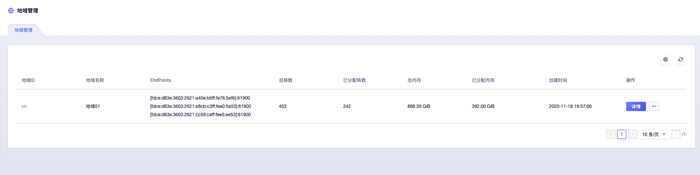
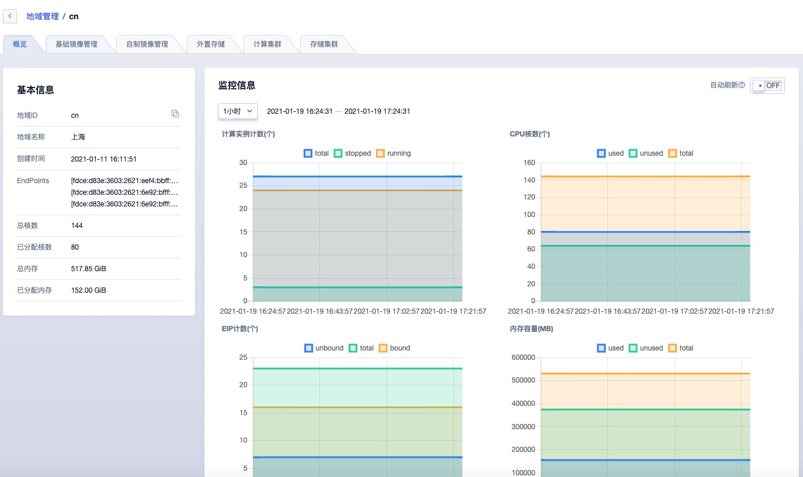

# 3 地域管理

地域（Region）是云平台中的一个逻辑概念，指资源部署的物理位置分类，可对应机柜、机房或数据中心。通常一个数据中心对应一套 UCloudStack 云平台，可支持部署多个计算和存储集群；数据中心之间资源和网络完全物理隔离，可通过一套管理平台管理遍布各地数据中心的私有云平台。

地域在平台也称为数据中心，通常数据中心之间完全隔离以保证最大程度的稳定性和容错性。作为平台最大的资源定义，一个地域即部署一套 UCloudStack 云平台。平台默认内置一个地域，管理服务通过本地数据中心云平台提供的 API 端点管理地域内计算、存储及网络资源。支持对数据中心内资源的生周期管理，包括计算集群、存储集群、外置存储、基础镜像及自制镜像等资源的查看和维护。

## 3.1 查看地域

### 3.1.1 地域列表

通过管理员控制台左侧导致栏的【地域】即可进入地域列表页，可查看当前下已有的地域列表，包括地域 ID、地域名称、Endpoint、总核数、已分配核数、总内存、已分配内存及创建时间，同时也可通过“自定义列表”按钮，自定义列表所需信息，如下图所示：

- 地域 ID：地域在平台的唯一标识符，如 `cn` ，通常也作为 API 接口的请求参数值。
- 地域名称：地域的名称，可通过独立的命名区分不同地域，比如北京数据中心一号机房。
- Endpoint：每个地域的 API 服务端点，平台管理控制台通过 API 端口访问并管理数据中心资源。
- 总核数：地域下总的 vCPU 核数，即平台用户在地域中可使用的总 vCPU 核数，默认情况不进行超分。
- 已分配核数：地域下已分配 vCPU 核数，即平台用户在地域中已申请的 vCPU 核数。
- 总内存：地域下总内存容量，即平台用户在地域中可使用的总内存容量，不支持超分。
- 已分配内存：地域下已分配到总内存容量，即平台在地域中用户已申请的内存容量。
- 创建时间：地域的创建时间

> 如一个地域已分配的 vCPU 和内存比例超过 80% 以上，代表地域下可用 vCPU 和内存资源较少，通常需要进行扩容；也可统计租户云资源使用率并及时释放云资源，确保真正需要使用资源的用户可分配到云资源。

### 3.1.2 地域详细信息

用户可在地域列表中点击地域名称，或者点击目标地域列表右侧的“详情”按钮进入当前地域的概览页面，查看地域的基本信息及监控信息，同时可以切换到基础镜像、自制镜像、计算集群、存储集群及外置存储标签页，查看和管理地域下的基础镜像、自制镜像及计算存储资源，如下图所示：

概览页面展示基本信息和地域核心资源使用趋势的监控图表。

* 基本信息：主要展示基本信息包括地域ID、地域名称、创建时间、EndPoint、总核数、已分配核数、总内存、已分配内存。
* 监控信息：可查看地域的监控信息，其中监控指标包括计算实例数（总数/运行/停止）、CPU 核数（总核数/已用/可用）、内存容量（总容量/已用/可用）。可通过筛选按钮，调节图表的显示时间周期，满足根据不同时间颗粒度的查看地域核心资源使用趋势的需求。

平台中的物理资源和虚拟资源均有地域属性，即必须部署或运行于一个数据中心，详情中的基础镜像、自制镜像、计算集群、存储集群及外置存储管理均指当前地域的资源信息：

* 基础镜像管理：指地域中的虚拟机基础镜像，即平台初始化是提供给用户创建虚拟机使用的镜像文件，同时支持本地域的基础镜像的管理，如删除基础镜像，可参考全局镜像管理中基础镜像章节。
* 自制镜像管理：指平台所有租户在地域中的自制镜像，并支持本地域的自制镜像管理，如导入镜像、删除镜像等，可参考全局镜像管理中的自制镜像章节。
* 计算集群：指平台在地域中部署的计算集群，计算集群是一组作为计算节点使用的物理机逻辑集合。可查看地域下的计算集群列表以及集群的资源总量和分配情况，并支持本地域的计算集群管理，可参考全局集群管理中的计算集群章节。
* 存储集群：指平台在地域中部署的存储集群，可查看地域下的存储计算列表以及集群的资源总量和分配情况，并支持本地域的存储集群管理，如修改集群的租户权限，可参考全局集群管理中的存储集群章节。
* 外置存储：指平台在地域中对接的外置存储池，即通过 ISCSI 协议对接的商业存储资源池，将商业存储作为虚拟化后端存储。支持查看并管理商业存储池，如扫描并分配存储池的 LUN 存储卷信息，可参考全局集群管理中的外置存储章节。

## 3.2 修改地域

支持管理员修改地域的名称，即显示在租户控制台的地域筛选中的名称。在管理平台地域管理列表，点击对应地域右侧的【修改】按钮进行操作，如下图所示：

修改地域名称即时生效，重新登录租户端控制台，即可查看已修改的地域名称。

