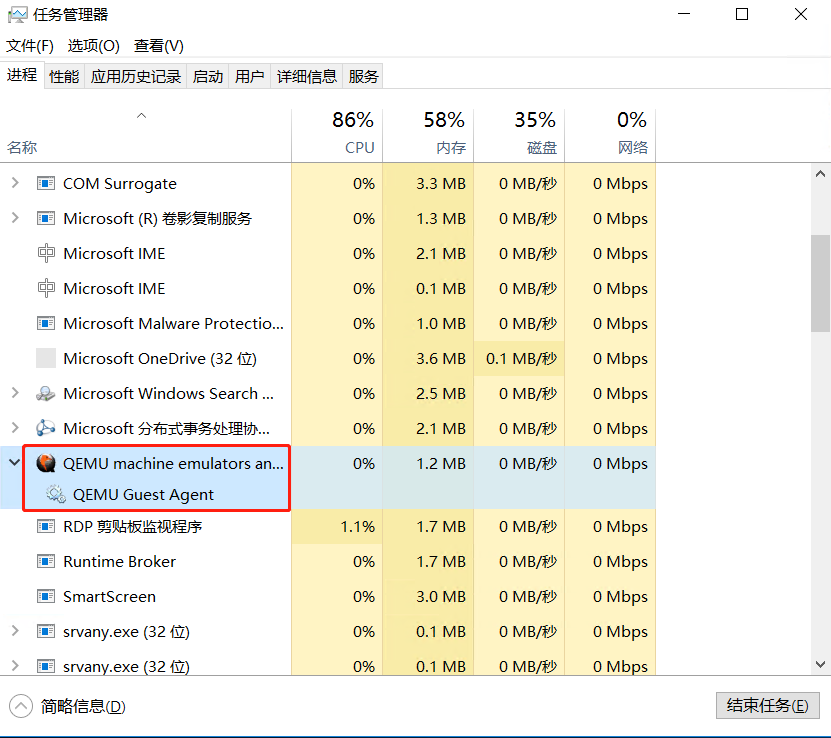
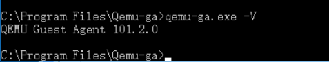

# 1 概述
平台支持用户导入 QCOW2 格式的自定义镜像，用于业务部署和迁移。在导入镜像前，需要制作自定义镜像，并正确安装**qemu-guest-agent**（版本：linux类型为2.10及以上，windows类型为100.0.0及以上），使镜像导入到平台后可正常运行虚拟机，并可在线对虚拟机进行管理操作，如修改密码、初始化网络及初始化磁盘等。

平台支持用户导入 Linux 和 Windows 两种类型的自定义镜像：

* Linux 类型： **CentOS 6.5 至7.9、Ubuntu 14.04 至20.01**
* Windows 类型： **Windows7 至 10，Windows server 2003 至2019**

>如需导入其它版本的镜像或在配置过程中碰到问题，请联系平台客户经理或技术支持。

# 2 自定义镜像制作
## 2.1 Linux 镜像制作方式
* 参考以下在线或者离线安装两种方式安装完成后，将 QCOW2 格式的镜像文件上传并导入到平台，即可使用镜像创建并运行虚拟机；
* 如脚本执行报错，请联系技术支持。
### 在线安装方法
* 启动第三方平台已安装完成或已有的 Linux 虚拟机；
* 使用命令`yum install qemu-guest-agent -y（CentOS）`或`apt-get install qemu-guest-agent -y（Ubuntu）`进行安装Qemu Guest Agent，安装过程无报错;
* 使用命令`qemu-ga --version`，检查qemu-guest-agent版本为2.10以上；

### 离线安装方法

* 在各种镜像源中下载当前操作系统所对应的qemu-guest-agent安装包，且版本为2.10以上的rpm （CentOS）或者deb （Ubuntu）文件；
* 使用命令：

    （CentOS）：

    `rpm -ivh qemu-guest-agent-xxx.rpm`

    （Ubuntu）：

    `sudo dpkg -i qemu-guest-agent_xxx.deb`

* 使用命令 `qemu-ga --version`，检查qemu-guest-agent版本为2.10以上。

## 2.2 Windows 镜像制作方式
* 启动第三方平台已安装完成或已有的 Windows 虚拟机；
* 下载并安装VirtIO驱动程序，选择最新的iso文件；
`https://fedorapeople.org/groups/virt/virtio-win/direct-downloads/latest-virtio/`

    **流程：**

    * 启动虚拟机并连接至图形控制台；
    *  登录 Windows 用户会话；
    *  下载virtio驱动程序中的virtio-win-0.1.xxx.iso文件到虚拟机，如 C 盘根目录下；
    *  将iso文件进行解压至当前虚拟机，在 `vioserial` 文件夹中找到相应的操作系统版本；
    *  以管理员身份运行 `Windows PowerShell` ，切换至上一步的文件夹目录， 如
    `C:\virtio-win-0.1.204\vioserial\2k16\amd64` , 运行 `PnPutil.exe -i -a .\vioser.inf` 进行安装，且安装过程无报错；
    *  安装后在设备管理器--系统设备列表下出现 `VirtIO Serial Driver` 条目则表示安装成功。如图所示：
       
    
*  下载并安装qemu guest agent程序；
    `https://fedorapeople.org/groups/virt/virtio-win/direct-downloads/latest-qemu-ga/`

     **流程：**
    * 下载并安装相对应版本的 `qemu-ga` 安装包，如 C 盘根目录下；
    * 运行msi文件，安装 `qemu-guest-agent`，且安装过程无报错。
    * 打开任务管理器，检查 `QEMU Guest Agent`进程已运行。如图所示：
    

* 安装完成后，检查 `qemu-guest-agent`的版本为100.0.0以上，如图所示：
 
 将 QCOW2 格式的镜像文件上传并导入到平台，即可使用镜像创建并运行虚拟机。

# 3 镜像格式转换
镜像制作完成后，需要将镜像转换为平台可识别的 QCOW2 格式才可导入并使用。镜像格式转换步骤如下：
* 镜像制作完成后，关闭执行脚本的虚拟机；
* 在物理机操作系统上执行 qemu-img info 镜像名称 查看虚拟机磁盘信息；
>不同镜像可能文件格式不同，本指南以 raw 格式镜像为例。
* 执行 qemu-img convert 转换磁盘类型为 QCOW2 ，以供平台使用，具体命令如下：

    `命令:`
    
    ` qemu-img check -f qcow2 [准备导入的镜像]`对磁盘镜像文件进行一致性检查，检查出现`No errors were found on the image.`则表示镜像文件检查完成，没有错误。

    ` qemu-img convert -f <qcow2/vmdk/vhd> -O qcow2 <源盘文件> <输出盘文件>`

    `举例:`

    `qemu-img check -f qcow2 image-centos-74.raw`

     ` qemu-img convert -f raw -O qcow2 image-centos-74.raw image-centos-74.qcow2`

* 将转换完成的镜像文件上传并导入到平台，即可使用镜像创建并运行虚拟机。
