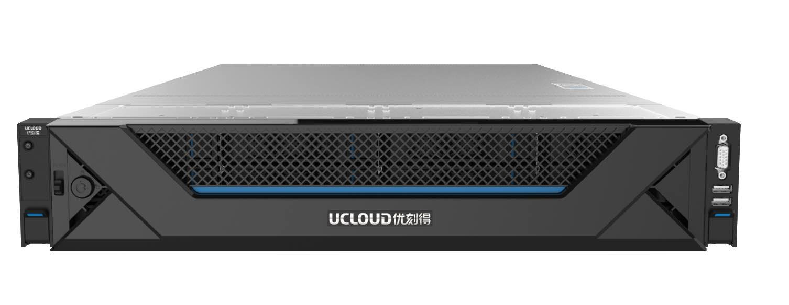
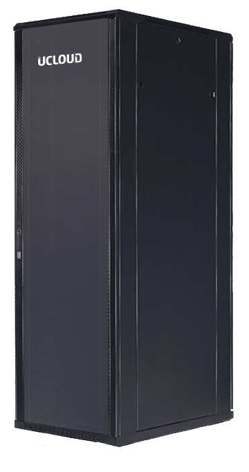

# 交付模式

UCloudStack定位为轻量级交付，3 节点即可构建生产环境且可平滑扩容，并提供统一资源调度和管理，**支持纯软件、超融合一体机及超融合机柜**多种交付模式，有效降低用户管理维护成本，为用户提供一套安全可靠且自主可控的云服务平台。

* **纯软件交付**

  客户提供承载云平台运行的硬件服务器、网络设备及相关基础设施，UCloud 优刻得提供 **UCloudStack 轻量级私有云软件**；通常在基础网络设施环境完备的情况下，UCloudStack 软件可在 2 小时内完成部署并交付。

* **超融合一体机**

  客户仅需提供数据中心基础设施，UCloud 优刻得提供**超融合一体机**（出厂预装 UCloudStack ），通常在基础网络设施环境完备的情况下，可在小时内完成初始化并交付。

  

* **超融合机柜**

  客户仅需提供数据中心即可，UCloud 优刻得提供**超融合一体机柜**（包含网络设备、服务器节点&一体机、PDU、线缆及 UCloudStack 软件 ），通常以一个机柜的形式进行交付。

  

