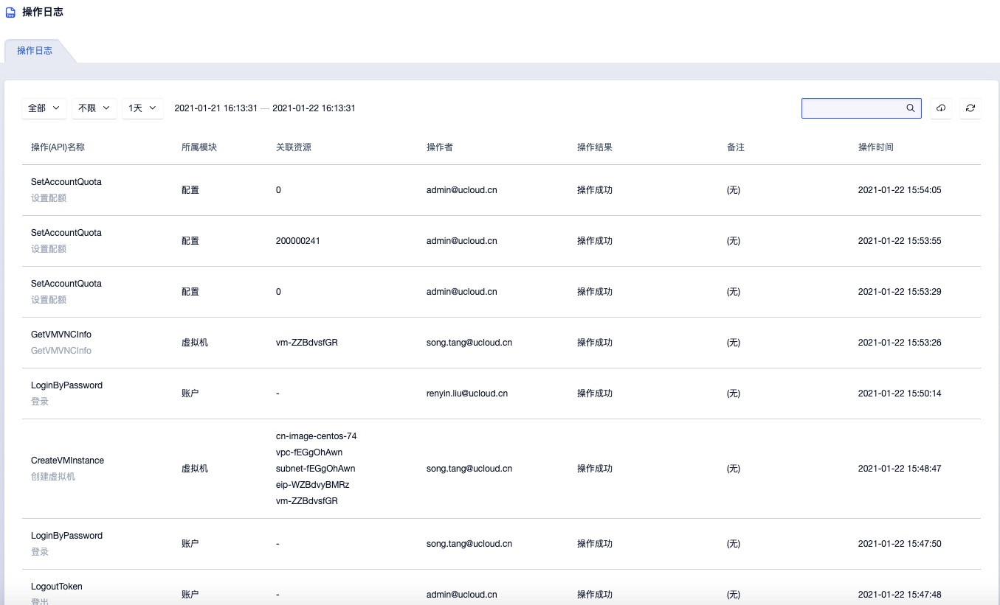

# 11 操作日志

管理控制台的操作日志是为企业及管理员提供的平台全局操作日志，通过平台全局操作日志，可查询当前平台上自身及所有租户对资源的操作和审计信息；默认支持查看 1 天内平台的所有操作审计日志，可选择查看 3 天、7 天及自定义时间长操作日志，最长支持查询 6 个月的操作日志；同时支持管理员通过操作名称、关联资源 ID 及操作者邮件对对操作日志进行搜索。

目前平台全局操作日显示屏 支持查看日志的产品包括虚拟机、自制镜像、弹性网卡、云硬盘、VPC/子网、外网 IP、NAT 网关、VPN网关、弹性伸缩、负载均衡、安全组、帐户、告警模板及定时器等，如下图所示：

* 操作（API）名称：指操作日志的操作名称，包括调用 API 的接口名称及操作的界面展示名称，如调整带宽。
* 所属模块：指操作日志操作的资源类型，包括裸金属、虚拟机、虚拟机模板、镜像、VPC、云硬盘、弹性网卡、外网 IP、安全组、负载均衡、NAT 网关、VPN 网关、自动伸缩、监控告警模板、定时器、账户等。
* 关联资源：操作日志对应的资源标识符，并可查看一个操作中所有关联的资源标识，如绑定弹性 IP 对应的虚拟机 ID 和外网 IP 的 ID 。
* 操作者：操作日志对应的操作者，可追溯到具体的平台管理员、主账号及子账号。
* 操作结果：操作日志的结果，如操作成功、操作失败、参数异常、存储集群物理资源不足等。
* 备注：操作日志的备注信息。
* 操作时间：操作日志的操作时间。

为方便管理员便捷的查看操作审计日志，控制台支持日志的筛选和搜索检索，同时支持对导出用户的操作审计日志为 本地 Excel 表格，方便账户管理和运营。

操作日志查询筛选功能可支持所属模块、操作状态及查询时间范围等纬度。所属模块支持所有产品模块的筛选，同时支持查看全部资源的日志及审计信息，即不对所属模块进行筛选；操作状态支持状态为成功、失败的日志筛选，同时也支持查看全部状态的日志和审计信息；查询时间范围支持 1 小时及自定义时间的日志筛选，最长可查询半年的操作日志。

> **操作日志不记录用户在虚拟机内部进行的操作和审计**。

